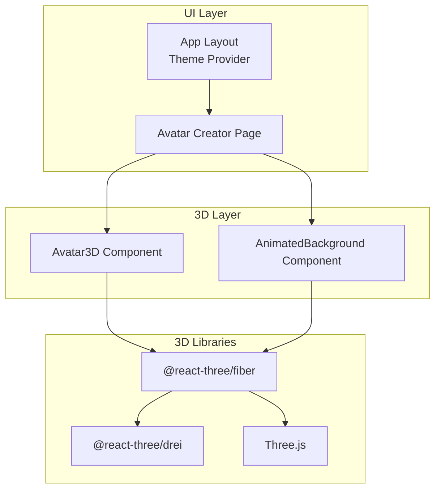
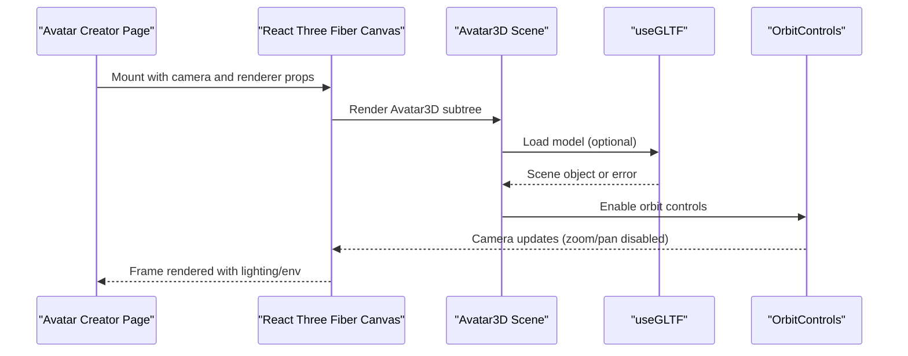
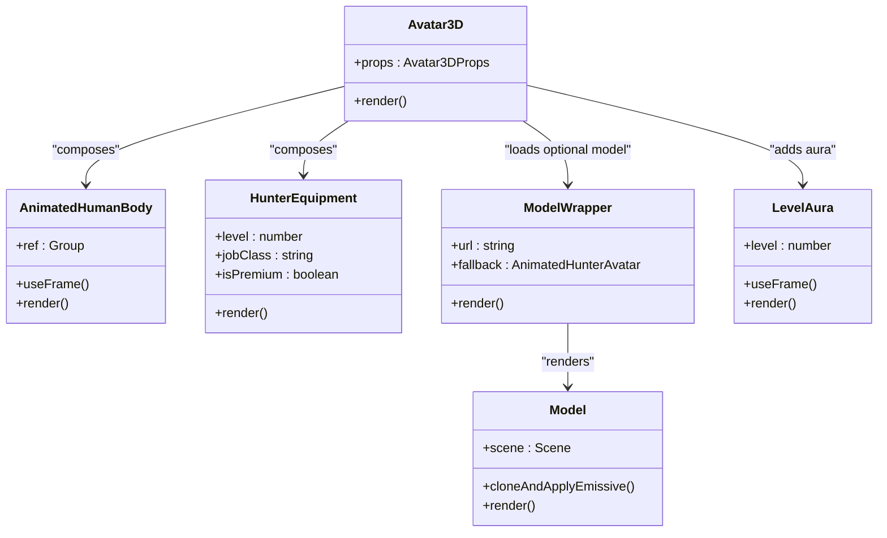
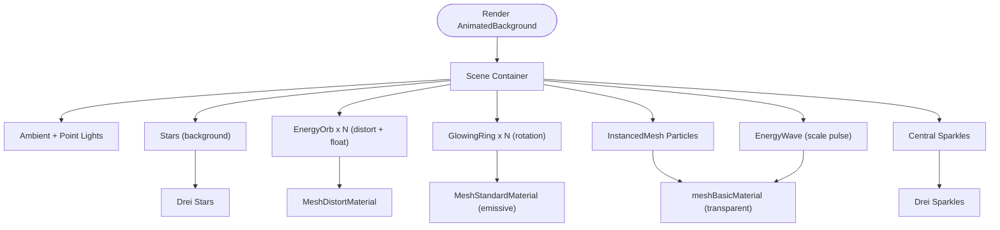
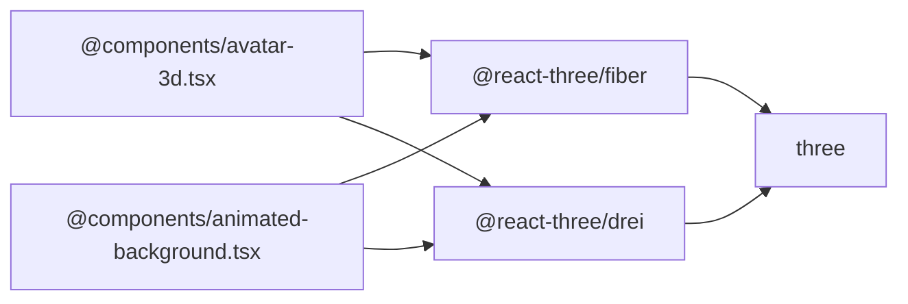

# 3D Graphics and Effects

<cite>
**Referenced Files in This Document**
- [avatar-3d.tsx](file://components/avatar-3d.tsx)
- [animated-background.tsx](file://components/animated-background.tsx)
- [three-fiber.d.ts](file://types/three-fiber.d.ts)
- [page.tsx](file://app/avatar-creator/page.tsx)
- [package.json](file://package.json)
- [next.config.mjs](file://next.config.mjs)
- [layout.tsx](file://app/layout.tsx)
- [theme-provider.tsx](file://components/theme-provider.tsx)
- [ui-effects.tsx](file://components/ui-effects.tsx)
</cite>

## Table of Contents
1. [Introduction](#introduction)
2. [Project Structure](#project-structure)
3. [Core Components](#core-components)
4. [Architecture Overview](#architecture-overview)
5. [Detailed Component Analysis](#detailed-component-analysis)
6. [Dependency Analysis](#dependency-analysis)
7. [Performance Considerations](#performance-considerations)
8. [Troubleshooting Guide](#troubleshooting-guide)
9. [Conclusion](#conclusion)

## Introduction
This document explains the 3D graphics implementation and visual effects in the project, focusing on Three.js integration via React Three Fiber and Drei. It covers scene setup, rendering pipelines, performance optimization strategies, and the Avatar3D and AnimatedBackground components. It also documents TypeScript definitions for type safety, 3D transformation effects, lighting systems, camera controls, and browser/mobile compatibility considerations.

## Project Structure
The 3D features are implemented primarily in two components:
- Avatar3D: A dynamic, animated 3D avatar with class-specific equipment and particle effects.
- AnimatedBackground: A layered animated background with floating orbs, rings, particle fields, and starfields.

Supporting infrastructure includes:
- Type-safe JSX intrinsics for Three.js elements.
- A Next.js page that composes the avatar creator UI with the 3D preview.
- Global layout and theme provider for consistent visuals.

**Diagram sources**
- [layout.tsx:33-47](file://app/layout.tsx#L33-L47)
- [theme-provider.tsx:9-11](file://components/theme-provider.tsx#L9-L11)
- [page.tsx:107-571](file://app/avatar-creator/page.tsx#L107-L571)
- [avatar-3d.tsx:1304-1361](file://components/avatar-3d.tsx#L1304-L1361)
- [animated-background.tsx:178-209](file://components/animated-background.tsx#L178-L209)
- [package.json:40-64](file://package.json#L40-L64)

**Section sources**
- [layout.tsx:33-47](file://app/layout.tsx#L33-L47)
- [theme-provider.tsx:9-11](file://components/theme-provider.tsx#L9-L11)
- [page.tsx:107-571](file://app/avatar-creator/page.tsx#L107-L571)
- [avatar-3d.tsx:1304-1361](file://components/avatar-3d.tsx#L1304-L1361)
- [animated-background.tsx:178-209](file://components/animated-background.tsx#L178-L209)
- [package.json:40-64](file://package.json#L40-L64)

## Core Components
- Avatar3D: Renders a procedurally built avatar with gender/class/body variations, animated materials, and class-specific weapons and armor. Includes fallback procedural geometry and GLTF model loading with graceful error handling.
- AnimatedBackground: Provides an ambient animated scene with stars, floating orbs, glowing rings, particle fields, and sparkle effects, layered under the main UI.

Key capabilities:
- Procedural body and facial features with skin/hair/eye color mapping.
- Class-specific equipment and visual themes.
- Dynamic lighting, environment presets, and contact shadows.
- Camera controls with polar angle constraints.
- Particle systems and additive blending effects.
- Type-safe JSX intrinsics for Three.js elements.

**Section sources**
- [avatar-3d.tsx:9-15](file://components/avatar-3d.tsx#L9-L15)
- [avatar-3d.tsx:1304-1361](file://components/avatar-3d.tsx#L1304-L1361)
- [animated-background.tsx:178-209](file://components/animated-background.tsx#L178-L209)
- [three-fiber.d.ts:1-8](file://types/three-fiber.d.ts#L1-L8)

## Architecture Overview
The 3D rendering pipeline uses React Three Fiber’s Canvas to mount scenes. Lighting and environment presets are applied globally per component. Drei provides convenient helpers for GLTF loading, environment, orbit controls, stars, sparkles, and contact shadows. The Avatar3D component composes a procedural avatar and optional GLTF model with animated effects and a level aura.

**Diagram sources**
- [page.tsx:251-310](file://app/avatar-creator/page.tsx#L251-L310)
- [avatar-3d.tsx:1309-1325](file://components/avatar-3d.tsx#L1309-L1325)
- [avatar-3d.tsx:1133-1186](file://components/avatar-3d.tsx#L1133-L1186)
- [avatar-3d.tsx:1324](file://components/avatar-3d.tsx#L1324)

**Section sources**
- [page.tsx:251-310](file://app/avatar-creator/page.tsx#L251-L310)
- [avatar-3d.tsx:1309-1325](file://components/avatar-3d.tsx#L1309-L1325)
- [avatar-3d.tsx:1133-1186](file://components/avatar-3d.tsx#L1133-L1186)

## Detailed Component Analysis

### Avatar3D Component
Avatar3D renders a 3D avatar with:
- Procedural human body segments (legs, torso, arms, neck, head) with gender-based proportions.
- Animated materials and emissive effects for eyes, hair, and equipment.
- Class-specific weapons and armor (Shadowfang blades, Dawnbreaker greatsword/Aegis shield, Worldbreaker warmaul).
- Premium and sovereign visual enhancements (auras, sparkles, distorted materials).
- Optional GLTF model loader with preflight checks and error fallback.
- Level-based aura and themed lighting.

Rendering pipeline highlights:
- Lighting: Ambient and multiple point lights with dynamic colors based on level.
- Environment: Night preset for consistent material response.
- Shadows: Contact shadows for ground occlusion.
- Camera: Fixed FOV and constrained polar angles for optimal avatar framing.
- Controls: OrbitControls with zoom/pan disabled for a fixed preview.

**Diagram sources**
- [avatar-3d.tsx:9-15](file://components/avatar-3d.tsx#L9-L15)
- [avatar-3d.tsx:20-556](file://components/avatar-3d.tsx#L20-L556)
- [avatar-3d.tsx:561-1094](file://components/avatar-3d.tsx#L561-L1094)
- [avatar-3d.tsx:1133-1186](file://components/avatar-3d.tsx#L1133-L1186)
- [avatar-3d.tsx:1271-1299](file://components/avatar-3d.tsx#L1271-L1299)

**Section sources**
- [avatar-3d.tsx:9-15](file://components/avatar-3d.tsx#L9-L15)
- [avatar-3d.tsx:20-556](file://components/avatar-3d.tsx#L20-L556)
- [avatar-3d.tsx:561-1094](file://components/avatar-3d.tsx#L561-L1094)
- [avatar-3d.tsx:1133-1186](file://components/avatar-3d.tsx#L1133-L1186)
- [avatar-3d.tsx:1271-1299](file://components/avatar-3d.tsx#L1271-L1299)
- [avatar-3d.tsx:1304-1361](file://components/avatar-3d.tsx#L1304-L1361)

### AnimatedBackground Component
AnimatedBackground creates an immersive ambient scene:
- Floating energy orbs with distortion materials and pulsating motion.
- Glowing rings with orbital rotations.
- Particle field using instanced meshes for efficient rendering.
- Energy waves with scalable transparency.
- Central sparkle effects and starfields.
- Underlying UI with gradient overlays, scan lines, and vignette.

**Diagram sources**
- [animated-background.tsx:128-176](file://components/animated-background.tsx#L128-L176)
- [animated-background.tsx:8-37](file://components/animated-background.tsx#L8-L37)
- [animated-background.tsx:39-56](file://components/animated-background.tsx#L39-L56)
- [animated-background.tsx:58-100](file://components/animated-background.tsx#L58-L100)
- [animated-background.tsx:102-125](file://components/animated-background.tsx#L102-L125)

**Section sources**
- [animated-background.tsx:128-176](file://components/animated-background.tsx#L128-L176)
- [animated-background.tsx:8-37](file://components/animated-background.tsx#L8-L37)
- [animated-background.tsx:39-56](file://components/animated-background.tsx#L39-L56)
- [animated-background.tsx:58-100](file://components/animated-background.tsx#L58-L100)
- [animated-background.tsx:102-125](file://components/animated-background.tsx#L102-L125)

### TypeScript Definitions and Type Safety
TypeScript intrinsics are extended to allow native Three.js element tags in JSX, ensuring type-safe composition of Three.js primitives within React components.

- Global JSX.IntrinsicElements are augmented to include ThreeElements, enabling direct use of Three.js nodes as JSX tags.

**Section sources**
- [three-fiber.d.ts:1-8](file://types/three-fiber.d.ts#L1-L8)

### UI Effects and Complementary Visuals
While not 3D-specific, the UI effects complement the 3D experience:
- Glass cards with 3D hover transforms and glow.
- Glowing buttons with gradient borders and shimmer.
- Animated counters, pulsing dots, and energy bars.
- Floating elements and neon borders.

These enhance the overall visual polish without impacting 3D performance.

**Section sources**
- [ui-effects.tsx:13-65](file://components/ui-effects.tsx#L13-L65)
- [ui-effects.tsx:77-136](file://components/ui-effects.tsx#L77-L136)
- [ui-effects.tsx:146-154](file://components/ui-effects.tsx#L146-L154)
- [ui-effects.tsx:197-204](file://components/ui-effects.tsx#L197-L204)
- [ui-effects.tsx:215-262](file://components/ui-effects.tsx#L215-L262)
- [ui-effects.tsx:271-283](file://components/ui-effects.tsx#L271-L283)

## Dependency Analysis
External libraries and their roles:
- @react-three/fiber: React renderer for Three.js scenes.
- @react-three/drei: Helpers for GLTF, environment, stars, sparkles, orbit controls, contact shadows.
- three: Core 3D engine.

**Diagram sources**
- [package.json:40-64](file://package.json#L40-L64)
- [avatar-3d.tsx:3-6](file://components/avatar-3d.tsx#L3-L6)
- [animated-background.tsx:3-6](file://components/animated-background.tsx#L3-L6)

**Section sources**
- [package.json:40-64](file://package.json#L40-L64)
- [avatar-3d.tsx:3-6](file://components/avatar-3d.tsx#L3-L6)
- [animated-background.tsx:3-6](file://components/animated-background.tsx#L3-L6)

## Performance Considerations
- Prefer instanced meshes for large particle fields to reduce draw calls.
- Use additive blending judiciously for glow effects to avoid overdraw.
- Limit emissive intensity and use level-based scaling to balance brightness.
- Constrain camera movement (disable zoom/pan) to reduce unnecessary computations.
- Pre-check model URLs and gracefully fall back to procedural geometry when GLTF fails.
- Use environment presets and optimized materials to minimize shader overhead.
- Keep animation loops lightweight; avoid heavy per-frame calculations.

[No sources needed since this section provides general guidance]

## Troubleshooting Guide
Common issues and remedies:
- GLTF load failures: The Model component applies emissive overrides and falls back to procedural geometry when cloning fails. The ModelWrapper performs a preflight check and switches to the fallback if the URL is invalid or unreachable.
- Runtime errors: SceneErrorBoundary catches rendering errors and renders the fallback avatar.
- Mobile performance: Consider lowering particle counts or disabling additive effects on lower-end devices. Use device pixel ratio tuning and limit animation complexity.

Practical references:
- Model error handling and cloning: [avatar-3d.tsx:1133-1186](file://components/avatar-3d.tsx#L1133-L1186)
- ModelWrapper preflight and fallback: [avatar-3d.tsx:1210-1266](file://components/avatar-3d.tsx#L1210-L1266)
- SceneErrorBoundary: [avatar-3d.tsx:1191-1205](file://components/avatar-3d.tsx#L1191-L1205)

**Section sources**
- [avatar-3d.tsx:1133-1186](file://components/avatar-3d.tsx#L1133-L1186)
- [avatar-3d.tsx:1210-1266](file://components/avatar-3d.tsx#L1210-L1266)
- [avatar-3d.tsx:1191-1205](file://components/avatar-3d.tsx#L1191-L1205)

## Conclusion
The project integrates React Three Fiber and Drei to deliver rich, animated 3D experiences. Avatar3D combines procedural geometry, class-specific assets, and particle effects with robust fallbacks and error handling. AnimatedBackground enhances the UI with layered, low-cost animated elements. Type-safe JSX intrinsics improve developer experience and maintainability. With mindful performance strategies, the system balances visual fidelity with broad browser and device compatibility.