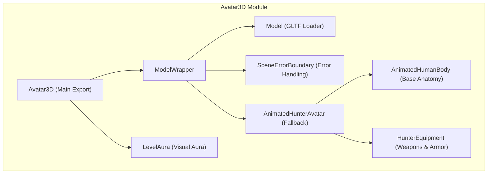
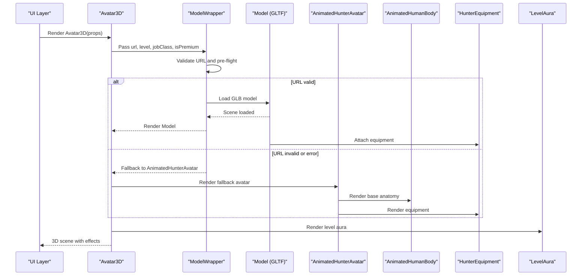
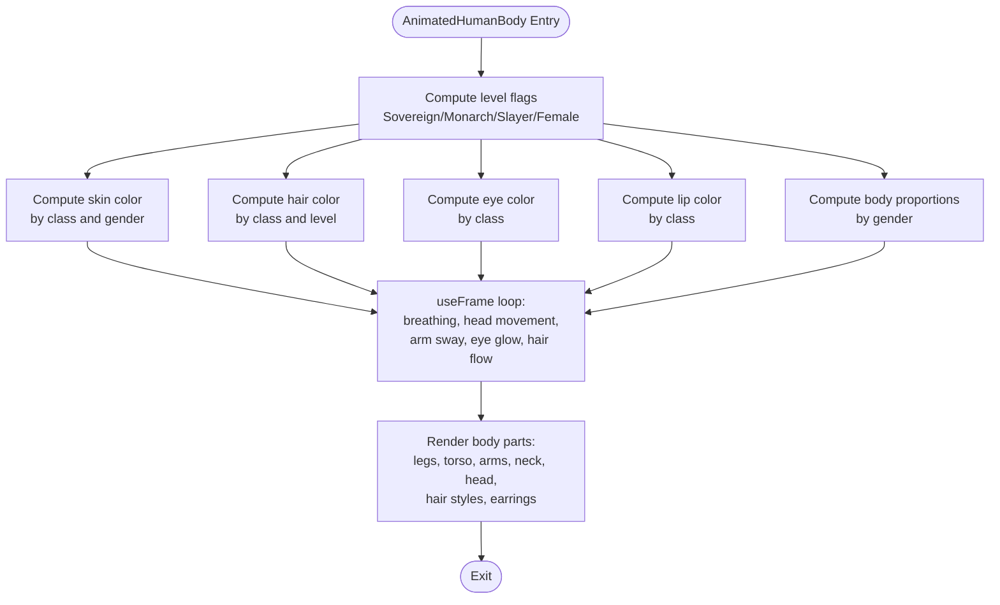
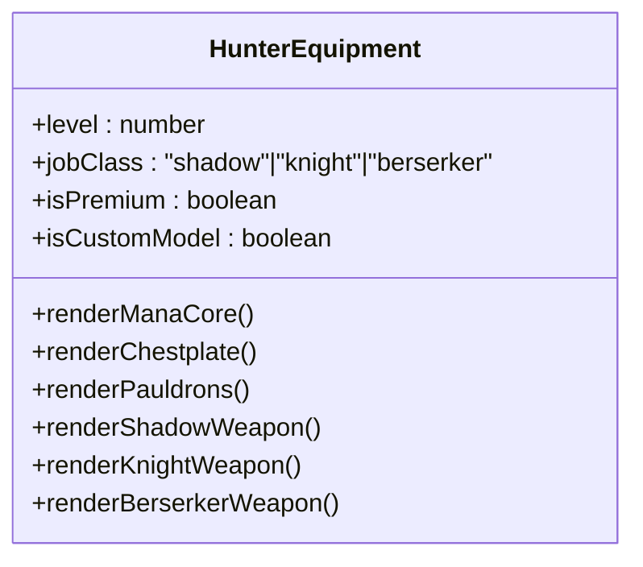
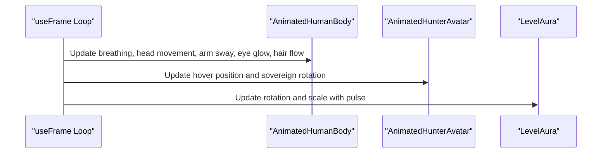
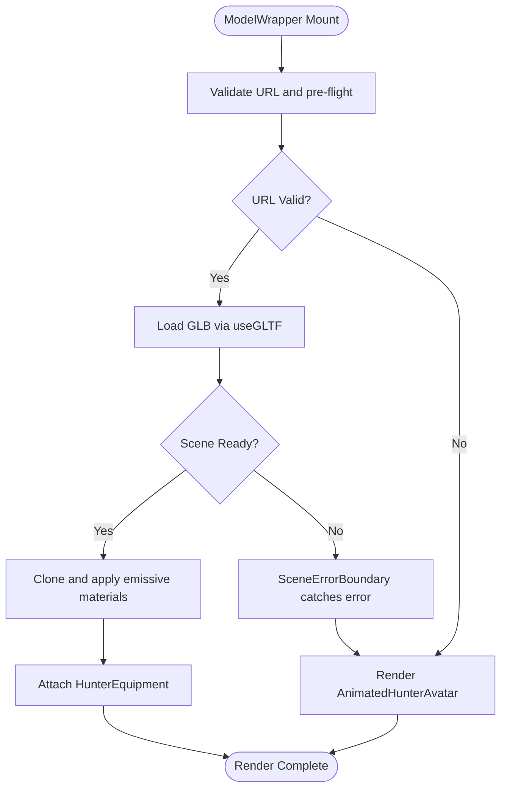
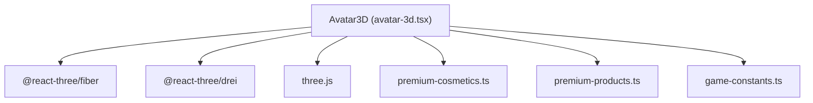

# Avatar3D Component

<cite>
**Referenced Files in This Document**
- [avatar-3d.tsx](file://components/avatar-3d.tsx)
- [page.tsx](file://app/avatar-creator/page.tsx)
- [premium-cosmetics.ts](file://lib/premium-cosmetics.ts)
- [premium-products.ts](file://lib/premium-products.ts)
- [game-constants.ts](file://lib/game-constants.ts)
</cite>

## Table of Contents
1. [Introduction](#introduction)
2. [Project Structure](#project-structure)
3. [Core Components](#core-components)
4. [Architecture Overview](#architecture-overview)
5. [Detailed Component Analysis](#detailed-component-analysis)
6. [Dependency Analysis](#dependency-analysis)
7. [Performance Considerations](#performance-considerations)
8. [Troubleshooting Guide](#troubleshooting-guide)
9. [Conclusion](#conclusion)
10. [Appendices](#appendices)

## Introduction
The Avatar3D component renders a procedurally generated 3D avatar with dynamic animations, equipment layers, and premium effects. It supports three character classes (Shadow, Knight, Berserker), gender-based anatomy, level-based visual progression, and optional custom GLB models with robust fallbacks. The component integrates with React Three Fiber and Drei to deliver immersive visuals with efficient rendering.

## Project Structure
The Avatar3D component resides in the components directory and orchestrates several internal modules:
- Procedural base body with gender and class variations
- Equipment system with weapons, armor, pauldrons, and mana cores
- Premium effects including gold aura and enhanced sparkles
- Animation pipeline using useFrame for eye blinking, hovering, and aura pulsing
- Fallback system for custom models and error handling
- Integration with the avatar creator page for interactive previews

**Diagram sources**
- [avatar-3d.tsx:1304](file://components/avatar-3d.tsx#L1304-L1344)
- [avatar-3d.tsx:1210](file://components/avatar-3d.tsx#L1210-L1266)
- [avatar-3d.tsx:1133](file://components/avatar-3d.tsx#L1133-L1186)
- [avatar-3d.tsx:1099](file://components/avatar-3d.tsx#L1099-L1128)
- [avatar-3d.tsx:20](file://components/avatar-3d.tsx#L20-L556)
- [avatar-3d.tsx:561](file://components/avatar-3d.tsx#L561-L1094)
- [avatar-3d.tsx:1271](file://components/avatar-3d.tsx#L1271-L1299)
- [avatar-3d.tsx:1191](file://components/avatar-3d.tsx#L1191-L1205)

**Section sources**
- [avatar-3d.tsx:1304](file://components/avatar-3d.tsx#L1304-L1344)

## Core Components
- Props interface:
  - url: string — GLB model URL for custom 3D avatars
  - level: number — Player level driving visual progression
  - jobClass?: "shadow" | "knight" | "berserker" — Character class determining theme and equipment
  - isPremium?: boolean — Enables premium effects and gold aura
  - gender?: "male" | "female" — Gender affecting body proportions and details

- Procedural base anatomy:
  - AnimatedHumanBody generates a human-like figure with gender-based proportions, skin tone, hair color, eye color, and lip color
  - Uses useFrame for breathing, subtle head movement, arm sway, eye glow pulses, and hair flow
  - Adds premium earrings for females at monarch+ levels

- Equipment system:
  - HunterEquipment renders level-based equipment including mana core, chestplate, pauldrons, and class-specific weapons
  - Conditional rendering based on level thresholds (5, 11, 18, 10+ for gauntlets)
  - Class-specific designs: Shadowfang twin blades, Dawnbreaker greatsword with Aegis shield, Worldbreaker warmaul

- Premium effects:
  - Gold aura torus with Float animation
  - Enhanced Sparkles with higher counts and sizes for premium users
  - Sovereign effects with distorted materials and floating geometry

- Animation system:
  - useFrame for eye blinking, hovering, and aura pulsing
  - LevelAura component with rotating and scaling cylinder geometry
  - Hovering patterns vary by class for custom models

- Fallback system:
  - ModelWrapper validates URLs and pre-flights availability
  - SceneErrorBoundary catches runtime errors and falls back to AnimatedHunterAvatar
  - AnimatedHunterAvatar provides a fully procedural avatar when models fail to load

**Section sources**
- [avatar-3d.tsx:9](file://components/avatar-3d.tsx#L9-L15)
- [avatar-3d.tsx:20](file://components/avatar-3d.tsx#L20-L556)
- [avatar-3d.tsx:561](file://components/avatar-3d.tsx#L561-L1094)
- [avatar-3d.tsx:1099](file://components/avatar-3d.tsx#L1099-L1128)
- [avatar-3d.tsx:1133](file://components/avatar-3d.tsx#L1133-L1186)
- [avatar-3d.tsx:1191](file://components/avatar-3d.tsx#L1191-L1205)
- [avatar-3d.tsx:1210](file://components/avatar-3d.tsx#L1210-L1266)
- [avatar-3d.tsx:1271](file://components/avatar-3d.tsx#L1271-L1299)

## Architecture Overview
The Avatar3D component composes multiple layers:
- Rendering pipeline: Canvas with lighting, environment, and controls
- Scene composition: ModelWrapper -> Model or AnimatedHunterAvatar -> AnimatedHumanBody + HunterEquipment
- Effects: LevelAura, Sparkles, and premium gold aura
- Error handling: SceneErrorBoundary and ModelWrapper pre-flight checks

**Diagram sources**
- [avatar-3d.tsx:1304](file://components/avatar-3d.tsx#L1304-L1344)
- [avatar-3d.tsx:1210](file://components/avatar-3d.tsx#L1210-L1266)
- [avatar-3d.tsx:1133](file://components/avatar-3d.tsx#L1133-L1186)
- [avatar-3d.tsx:1099](file://components/avatar-3d.tsx#L1099-L1128)
- [avatar-3d.tsx:1271](file://components/avatar-3d.tsx#L1271-L1299)

## Detailed Component Analysis

### Props Interface and Usage
- url: Accepts a GLB model URL; validated by ModelWrapper and pre-flighted via HEAD request
- level: Drives equipment unlocks, theme color progression, and visual effects
- jobClass: Determines theme color mapping and class-specific equipment
- isPremium: Enables premium effects and gold aura
- gender: Affects body proportions and premium earrings for females

Practical usage examples:
- Basic avatar preview in the avatar creator page
- Integration with premium products for custom model URLs
- Dynamic level updates for visual progression

**Section sources**
- [avatar-3d.tsx:9](file://components/avatar-3d.tsx#L9-L15)
- [page.tsx:262](file://app/avatar-creator/page.tsx#L262-L268)
- [premium-products.ts:13](file://lib/premium-products.ts#L13-L71)

### Procedural Base Anatomy
The AnimatedHumanBody component builds a human-like figure with:
- Gender-based proportions (shoulder width, chest width, waist width, hip width, arm thickness, leg thickness, head size)
- Skin tone, hair color, eye color, and lip color derived from jobClass and gender
- Breathing animation for the torso, subtle head movement, arm sway, eye glow pulses, and hair flow
- Premium earrings for females at monarch+ levels with class-based glow

**Diagram sources**
- [avatar-3d.tsx:20](file://components/avatar-3d.tsx#L20-L556)

**Section sources**
- [avatar-3d.tsx:20](file://components/avatar-3d.tsx#L20-L556)

### Equipment System
The HunterEquipment component renders level-based equipment:
- Mana Core: Unlocks at level 5, scales with level, uses MeshDistortMaterial with emissive glow
- Chestplate: Unlocks at level 11, with center line glow
- Pauldrons: Unlocks at level 18, class-specific additions for berserker monarch+
- Weapons:
  - Shadow: Twin blades with serrated edges, shadow veil guards, floating particles at monarch+
  - Knight: Dawnbreaker greatsword with flame edges, sun core, rune engravings, sunburst crossguard, Aegis shield
  - Berserker: Worldbreaker warmaul with four heads, spikes, rage glow, and optional rage aura

**Diagram sources**
- [avatar-3d.tsx:561](file://components/avatar-3d.tsx#L561-L1094)

**Section sources**
- [avatar-3d.tsx:561](file://components/avatar-3d.tsx#L561-L1094)

### Class-Based Theme Color System
Theme colors progress by level:
- Shadow: Purple shades progressing to violet at sovereign
- Knight: Blue shades progressing to yellow at sovereign
- Berserker: Red shades progressing to orange at sovereign

The theme color mapping is computed per level and applied to equipment emissive materials and premium effects.

**Section sources**
- [avatar-3d.tsx:576](file://components/avatar-3d.tsx#L576-L580)
- [avatar-3d.tsx:1103](file://components/avatar-3d.tsx#L1103-L1107)
- [avatar-3d.tsx:1152](file://components/avatar-3d.tsx#L1152-L1156)

### Premium Effects System
Premium effects activate when isPremium is true:
- Gold aura: Torus with emissive gold material and Float animation
- Enhanced Sparkles: Higher count, size, and speed with gold color
- Additional premium visuals are integrated into equipment rendering

**Section sources**
- [avatar-3d.tsx:1071](file://components/avatar-3d.tsx#L1071-L1091)
- [avatar-3d.tsx:589](file://components/avatar-3d.tsx#L589-L595)

### Animation System
Animations are driven by useFrame:
- AnimatedHumanBody: Eye glow pulsing, hair flow, and sovereign hover effect
- AnimatedHunterAvatar: Smooth floating with class-specific hover speeds and sovereign rotation
- LevelAura: Rotating and scaling cylinder with pulsing effect

**Diagram sources**
- [avatar-3d.tsx:83](file://components/avatar-3d.tsx#L83-L124)
- [avatar-3d.tsx:1109](file://components/avatar-3d.tsx#L1109-L1120)
- [avatar-3d.tsx:1283](file://components/avatar-3d.tsx#L1283-L1289)

**Section sources**
- [avatar-3d.tsx:83](file://components/avatar-3d.tsx#L83-L124)
- [avatar-3d.tsx:1109](file://components/avatar-3d.tsx#L1109-L1120)
- [avatar-3d.tsx:1283](file://components/avatar-3d.tsx#L1283-L1289)

### Fallback System and Error Handling
- ModelWrapper validates URLs and performs a pre-flight HEAD request with a 3-second timeout
- If URL is invalid or loading fails, the component falls back to AnimatedHunterAvatar
- SceneErrorBoundary wraps the model rendering to catch runtime errors and render fallback content
- Model applies emissive materials to meshes when level >= 10 and handles scaling based on level tiers

**Diagram sources**
- [avatar-3d.tsx:1210](file://components/avatar-3d.tsx#L1210-L1266)
- [avatar-3d.tsx:1191](file://components/avatar-3d.tsx#L1191-L1205)
- [avatar-3d.tsx:1133](file://components/avatar-3d.tsx#L1133-L1186)

**Section sources**
- [avatar-3d.tsx:1210](file://components/avatar-3d.tsx#L1210-L1266)
- [avatar-3d.tsx:1191](file://components/avatar-3d.tsx#L1191-L1205)
- [avatar-3d.tsx:1133](file://components/avatar-3d.tsx#L1133-L1186)

### Practical Usage Examples
- Avatar creator preview: The avatar creator page demonstrates rendering Avatar3D with dynamic level adjustments and class/gender selections
- Premium integration: Premium products define GLB model URLs for custom avatars
- Cosmetic integration: Premium cosmetic frames and effects complement the Avatar3D visuals

**Section sources**
- [page.tsx:262](file://app/avatar-creator/page.tsx#L262-L268)
- [premium-products.ts:13](file://lib/premium-products.ts#L13-L71)
- [premium-cosmetics.ts:12](file://lib/premium-cosmetics.ts#L12-L73)

## Dependency Analysis
The Avatar3D component depends on:
- React Three Fiber (@react-three/fiber) and Drei (@react-three/drei) for 3D rendering
- Three.js for geometry and materials
- Local modules for premium cosmetics and product definitions

**Diagram sources**
- [avatar-3d.tsx:3](file://components/avatar-3d.tsx#L3-L6)
- [premium-cosmetics.ts:1](file://lib/premium-cosmetics.ts#L1-L10)
- [premium-products.ts:1](file://lib/premium-products.ts#L1-L11)
- [game-constants.ts:1](file://lib/game-constants.ts#L1-L1)

**Section sources**
- [avatar-3d.tsx:3](file://components/avatar-3d.tsx#L3-L6)
- [premium-cosmetics.ts:1](file://lib/premium-cosmetics.ts#L1-L10)
- [premium-products.ts:1](file://lib/premium-products.ts#L1-L11)
- [game-constants.ts:1](file://lib/game-constants.ts#L1-L1)

## Performance Considerations
- Geometry complexity: The component uses primitive geometries (capsules, boxes, spheres) and parametric shapes; keep level-dependent additions minimal to maintain smooth frame rates
- Material usage: Emissive materials and MeshDistortMaterial can be expensive; consider reducing distortion intensity or count at lower levels
- Sparkles: Particle count scales with level; monitor GPU memory usage on low-end devices
- Model loading: Pre-flight checks and fallbacks prevent long hangs; ensure GLB models are optimized for web delivery
- Lighting: Ambient and directional lights are used; avoid excessive point lights for mobile performance
- Animations: useFrame runs every frame; keep calculations lightweight and reuse memoized values where possible

[No sources needed since this section provides general guidance]

## Troubleshooting Guide
Common issues and resolutions:
- Model load failures:
  - Verify URL validity and CORS policy
  - Use ModelWrapper’s pre-flight mechanism to detect issues early
  - SceneErrorBoundary will automatically fall back to the procedural avatar
- GLTF parsing errors:
  - Clone scenes carefully; handle exceptions during cloning
  - Ensure emissive materials are applied only when level conditions are met
- Performance drops:
  - Reduce particle count or distortion intensity
  - Limit level-dependent geometry additions
  - Test on target devices and adjust quality settings accordingly

**Section sources**
- [avatar-3d.tsx:1210](file://components/avatar-3d.tsx#L1210-L1266)
- [avatar-3d.tsx:1191](file://components/avatar-3d.tsx#L1191-L1205)
- [avatar-3d.tsx:1133](file://components/avatar-3d.tsx#L1133-L1186)

## Conclusion
The Avatar3D component delivers a rich, animated 3D avatar with procedural generation, level-based equipment, class themes, and premium effects. Its robust fallback system ensures reliability, while the modular architecture supports easy customization and performance tuning. Integrating with the avatar creator and premium systems provides a seamless user experience across levels and visual tiers.

[No sources needed since this section summarizes without analyzing specific files]

## Appendices

### Props Reference
- url: string — GLB model URL
- level: number — Player level (1–30)
- jobClass?: "shadow" | "knight" | "berserker"
- isPremium?: boolean — Enables premium effects
- gender?: "male" | "female"

**Section sources**
- [avatar-3d.tsx:9](file://components/avatar-3d.tsx#L9-L15)

### Level Progression Highlights
- Trainee (1–9): Base anatomy and basic equipment
- Slayer (10–19): Gauntlets, mana core, and class-specific weapon variants
- Monarch (20–29): Chestplate, pauldrons, advanced weapon details, and premium earrings for females
- Sovereign (30): Full premium effects, distorted materials, floating geometry, and enhanced visuals

**Section sources**
- [avatar-3d.tsx:32](file://components/avatar-3d.tsx#L32-L34)
- [avatar-3d.tsx:589](file://components/avatar-3d.tsx#L589-L595)
- [avatar-3d.tsx:597](file://components/avatar-3d.tsx#L597-L610)
- [avatar-3d.tsx:612](file://components/avatar-3d.tsx#L612-L634)
- [avatar-3d.tsx:1044](file://components/avatar-3d.tsx#L1044-L1058)