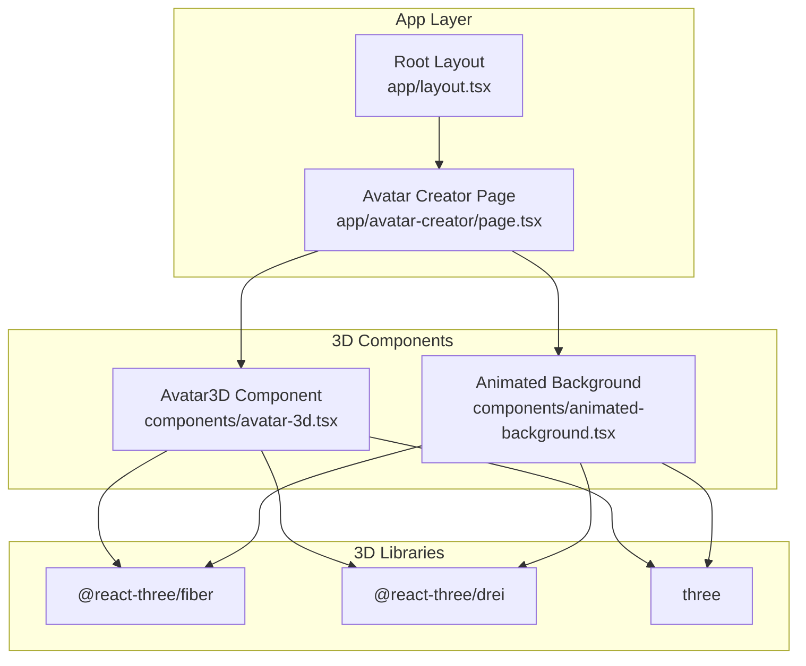
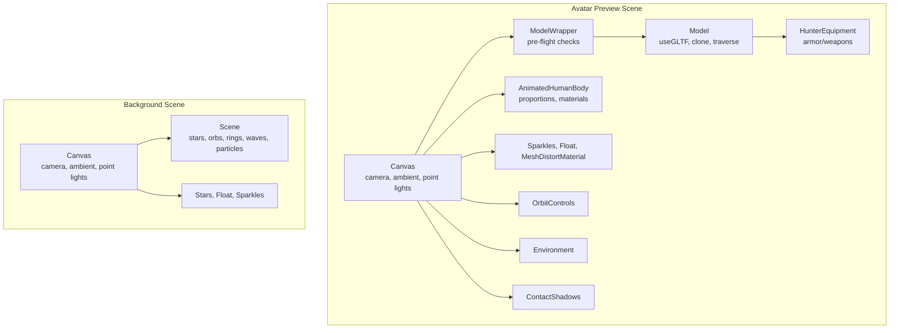
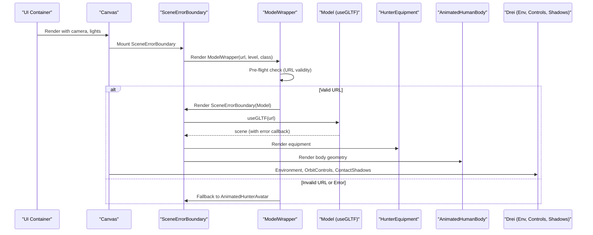
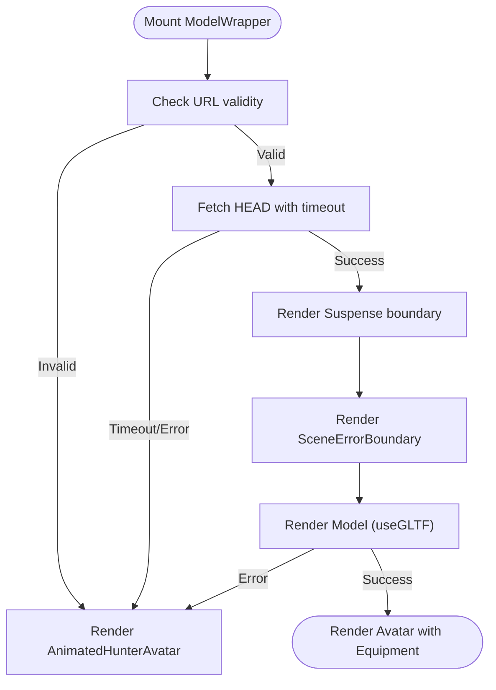
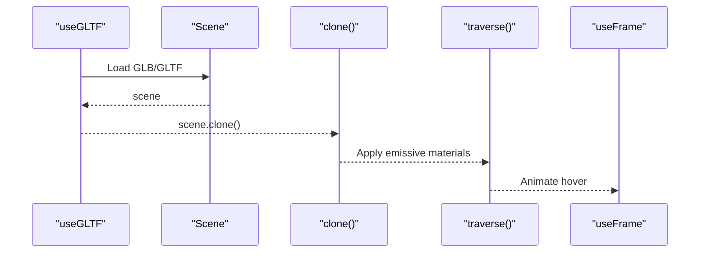
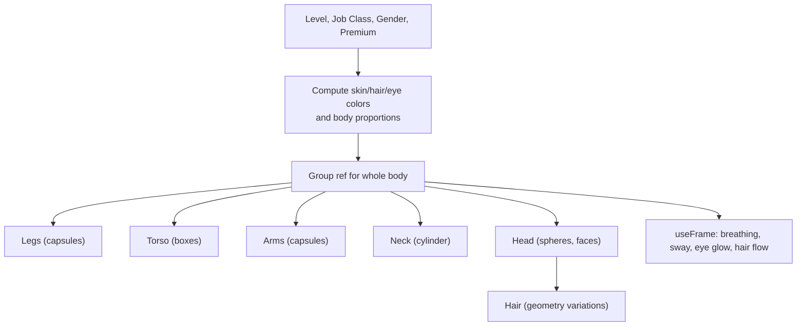
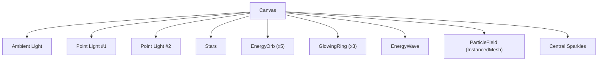
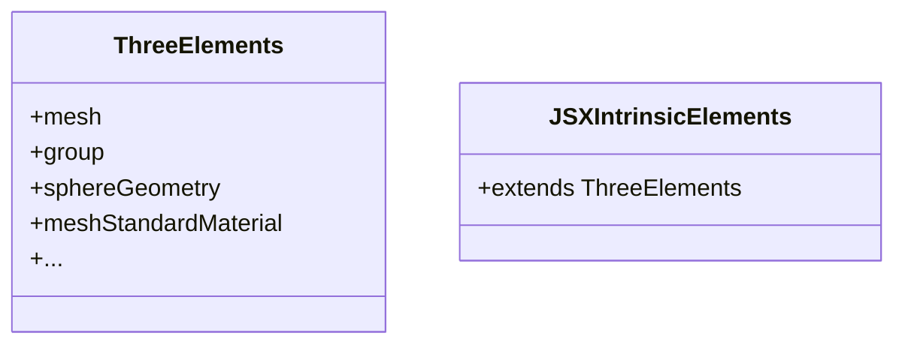
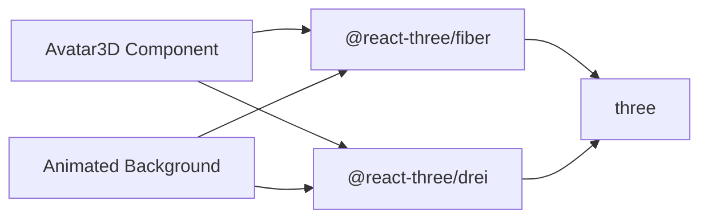

# Three.js Integration

<cite>
**Referenced Files in This Document**
- [avatar-3d.tsx](file://components/avatar-3d.tsx)
- [animated-background.tsx](file://components/animated-background.tsx)
- [three-fiber.d.ts](file://types/three-fiber.d.ts)
- [page.tsx](file://app/avatar-creator/page.tsx)
- [package.json](file://package.json)
- [layout.tsx](file://app/layout.tsx)
</cite>

## Table of Contents
1. [Introduction](#introduction)
2. [Project Structure](#project-structure)
3. [Core Components](#core-components)
4. [Architecture Overview](#architecture-overview)
5. [Detailed Component Analysis](#detailed-component-analysis)
6. [Dependency Analysis](#dependency-analysis)
7. [Performance Considerations](#performance-considerations)
8. [Troubleshooting Guide](#troubleshooting-guide)
9. [Conclusion](#conclusion)
10. [Appendices](#appendices)

## Introduction
This document explains how Three.js is integrated using React Three Fiber in a Next.js application. It covers the Canvas component setup, scene configuration, rendering pipeline, and the useGLTF loader for 3D model loading. It documents error handling strategies and fallback mechanisms, and explains integration patterns for React Three Fiber hooks such as useFrame for animations, useRef for mesh references, and useMemo for performance optimization. It details the component architecture with ModelWrapper, SceneErrorBoundary, and Model, and explains the integration with Drei library for environment mapping, orbit controls, contact shadows, and floating effects. It also includes TypeScript definitions and type safety considerations for Three.js objects, practical examples of scene setup, lighting configuration, and camera controls, and addresses performance optimization techniques, memory management, and graceful degradation for users without WebGL support.

## Project Structure
The project integrates Three.js scenes primarily in two components:
- Avatar 3D preview component that renders a dynamic avatar with animated geometry and equipment
- Animated background component that renders a persistent 3D background scene

**Diagram sources**
- [layout.tsx:33-47](file://app/layout.tsx#L33-L47)
- [page.tsx:8-9](file://app/avatar-creator/page.tsx#L8-L9)
- [avatar-3d.tsx:3-4](file://components/avatar-3d.tsx#L3-L4)
- [animated-background.tsx:3-4](file://components/animated-background.tsx#L3-L4)

**Section sources**
- [layout.tsx:33-47](file://app/layout.tsx#L33-L47)
- [page.tsx:8-9](file://app/avatar-creator/page.tsx#L8-L9)
- [avatar-3d.tsx:3-4](file://components/avatar-3d.tsx#L3-L4)
- [animated-background.tsx:3-4](file://components/animated-background.tsx#L3-L4)

## Core Components
- Canvas setup with camera configuration, lighting, environment, and controls
- useGLTF loader for 3D model loading with error handling and fallbacks
- useFrame for continuous animation loops
- useRef for accessing Three.js objects and applying transformations
- useMemo for memoizing expensive computations and geometry/material creation
- Suspense boundaries for graceful fallbacks during model loading
- SceneErrorBoundary for catching runtime errors in the 3D scene

Key integration patterns:
- useFrame animates meshes and groups, updating positions, rotations, and material properties each frame
- useRef stores references to Three.js objects for direct manipulation
- useMemo caches computed values like theme colors, hair colors, and geometry parameters
- useGLTF loads GLB/GLTF assets with error callbacks and cloning for safe modifications
- Suspense and SceneErrorBoundary provide fallback UIs while models load or when errors occur

**Section sources**
- [avatar-3d.tsx:83-124](file://components/avatar-3d.tsx#L83-L124)
- [avatar-3d.tsx:21-31](file://components/avatar-3d.tsx#L21-L31)
- [avatar-3d.tsx:38-80](file://components/avatar-3d.tsx#L38-L80)
- [avatar-3d.tsx:1134-1186](file://components/avatar-3d.tsx#L1134-L1186)
- [avatar-3d.tsx:1191-1205](file://components/avatar-3d.tsx#L1191-L1205)
- [avatar-3d.tsx:1258-1266](file://components/avatar-3d.tsx#L1258-L1266)

## Architecture Overview
The architecture centers around two primary scenes:
- Avatar preview scene: renders a customizable avatar with animated geometry, equipment, and effects
- Animated background scene: renders a persistent starry, floating particle scene

**Diagram sources**
- [avatar-3d.tsx:1309-1325](file://components/avatar-3d.tsx#L1309-L1325)
- [avatar-3d.tsx:1258-1266](file://components/avatar-3d.tsx#L1258-L1266)
- [avatar-3d.tsx:1134-1186](file://components/avatar-3d.tsx#L1134-L1186)
- [animated-background.tsx:186-194](file://components/animated-background.tsx#L186-L194)
- [animated-background.tsx:128-176](file://components/animated-background.tsx#L128-L176)

## Detailed Component Analysis

### Avatar3D Component
The main component that renders the avatar preview inside a Canvas. It sets up lighting, environment, orbit controls, and renders the avatar with optional custom GLB model.

**Diagram sources**
- [avatar-3d.tsx:1309-1325](file://components/avatar-3d.tsx#L1309-L1325)
- [avatar-3d.tsx:1258-1266](file://components/avatar-3d.tsx#L1258-L1266)
- [avatar-3d.tsx:1134-1186](file://components/avatar-3d.tsx#L1134-L1186)

Key implementation highlights:
- Lighting: ambient and multiple point lights with dynamic colors based on level
- Camera: positioned for optimal avatar framing with FOV tuned for close-ups
- Environment: night preset for consistent material rendering
- Controls: orbit controls with zoom and pan disabled, constrained polar angles
- Effects: contact shadows, stars background, floating effects, sparkles

**Section sources**
- [avatar-3d.tsx:1309-1325](file://components/avatar-3d.tsx#L1309-L1325)
- [avatar-3d.tsx:1314-1319](file://components/avatar-3d.tsx#L1314-L1319)

### ModelWrapper Component
Implements pre-flight validation of model URLs and provides fallback behavior when the model fails to load.

**Diagram sources**
- [avatar-3d.tsx:1210-1266](file://components/avatar-3d.tsx#L1210-L1266)

Behavioral notes:
- Validates URL scheme and path
- Uses AbortController with timeout to prevent hanging requests
- Falls back to a procedural avatar when model loading fails

**Section sources**
- [avatar-3d.tsx:1210-1266](file://components/avatar-3d.tsx#L1210-L1266)

### Model Component (useGLTF)
Loads GLB/GLTF models, clones the scene, applies emissive materials based on level, and animates the avatar.

**Diagram sources**
- [avatar-3d.tsx:1134-1186](file://components/avatar-3d.tsx#L1134-L1186)

Implementation details:
- Error callback logs and triggers fallback
- Cloning ensures safe traversal and material updates
- Emissive materials are adjusted based on level and theme color
- Hover animation is applied via useFrame

**Section sources**
- [avatar-3d.tsx:1134-1186](file://components/avatar-3d.tsx#L1134-L1186)

### AnimatedHumanBody Component
Generates procedural avatar geometry with level-dependent proportions, colors, and animations.

**Diagram sources**
- [avatar-3d.tsx:20-556](file://components/avatar-3d.tsx#L20-L556)

Key points:
- Uses useMemo to compute colors and proportions
- Applies level-based emissive intensities to eyes and accessories
- Implements subtle animations for realism

**Section sources**
- [avatar-3d.tsx:20-556](file://components/avatar-3d.tsx#L20-L556)

### Animated Background Component
Provides a persistent 3D background with floating orbs, rings, particle fields, and energy waves.

**Diagram sources**
- [animated-background.tsx:186-194](file://components/animated-background.tsx#L186-L194)
- [animated-background.tsx:128-176](file://components/animated-background.tsx#L128-L176)

**Section sources**
- [animated-background.tsx:186-194](file://components/animated-background.tsx#L186-L194)
- [animated-background.tsx:128-176](file://components/animated-background.tsx#L128-L176)

### Drei Integration Patterns
- Environment: presets for consistent material rendering
- OrbitControls: constrained camera movement with zoom/pan disabled
- ContactShadows: realistic floor shadows
- Float: floating animations for equipment and aura
- MeshDistortMaterial: distortion effects for glowing materials
- Stars and Sparkles: volumetric and particle effects

**Section sources**
- [avatar-3d.tsx:1321-1324](file://components/avatar-3d.tsx#L1321-L1324)
- [avatar-3d.tsx:1047-1057](file://components/avatar-3d.tsx#L1047-L1057)
- [avatar-3d.tsx:1061-1068](file://components/avatar-3d.tsx#L1061-L1068)
- [animated-background.tsx:137-145](file://components/animated-background.tsx#L137-L145)
- [animated-background.tsx:166-173](file://components/animated-background.tsx#L166-L173)

### TypeScript Definitions and Type Safety
Global JSX intrinsic elements are extended to include Three.js elements for better type inference in JSX.

**Diagram sources**
- [three-fiber.d.ts:1-7](file://types/three-fiber.d.ts#L1-L7)

Practical implications:
- Enables JSX completion and type checking for Three.js primitives
- Reduces runtime errors when writing 3D JSX components

**Section sources**
- [three-fiber.d.ts:1-7](file://types/three-fiber.d.ts#L1-L7)

## Dependency Analysis
External libraries and their roles:
- @react-three/fiber: React renderer for Three.js
- @react-three/drei: Higher-level helpers for environment, controls, shadows, and effects
- three: Core Three.js library

**Diagram sources**
- [package.json:40-62](file://package.json#L40-L62)
- [avatar-3d.tsx:3-4](file://components/avatar-3d.tsx#L3-L4)
- [animated-background.tsx:3-4](file://components/animated-background.tsx#L3-L4)

**Section sources**
- [package.json:40-62](file://package.json#L40-L62)
- [avatar-3d.tsx:3-4](file://components/avatar-3d.tsx#L3-L4)
- [animated-background.tsx:3-4](file://components/animated-background.tsx#L3-L4)

## Performance Considerations
- useFrame: Use minimal work per frame; cache expensive calculations with useMemo
- useRef: Store references to avoid re-creating objects; mutate properties directly
- useMemo: Memoize computed colors, proportions, and geometry parameters
- InstancedMesh: Use instanced rendering for large particle systems
- Suspense: Provide quick fallbacks to keep UI responsive during model loading
- SceneErrorBoundary: Prevent cascading failures and degrade gracefully
- Camera and FOV: Tune camera settings to reduce unnecessary geometry visibility
- Materials: Prefer simpler materials for large meshes; use emissive materials sparingly

[No sources needed since this section provides general guidance]

## Troubleshooting Guide
Common issues and remedies:
- Model loading failures: useGLTF error callback triggers fallback to procedural avatar
- Network timeouts: ModelWrapper pre-flight uses AbortController with timeout
- Runtime errors in scene: SceneErrorBoundary catches and renders fallback
- WebGL unsupported: Ensure fallback UI is visible; consider feature detection and graceful degradation
- Memory leaks: Avoid retaining references to deleted objects; clean up event listeners if used externally

**Section sources**
- [avatar-3d.tsx:1134-1137](file://components/avatar-3d.tsx#L1134-L1137)
- [avatar-3d.tsx:1231-1251](file://components/avatar-3d.tsx#L1231-L1251)
- [avatar-3d.tsx:1191-1205](file://components/avatar-3d.tsx#L1191-L1205)

## Conclusion
The project demonstrates a robust integration of Three.js with React Three Fiber, leveraging Drei for environment mapping, controls, and effects. The architecture emphasizes resilience through pre-flight checks, Suspense boundaries, and SceneErrorBoundary, ensuring a smooth user experience even under adverse conditions. Hooks like useFrame, useRef, and useMemo are used effectively to optimize performance and maintain type safety with global JSX extensions.

[No sources needed since this section summarizes without analyzing specific files]

## Appendices

### Practical Examples Index
- Scene setup: [avatar-3d.tsx:1309-1325](file://components/avatar-3d.tsx#L1309-L1325)
- Lighting configuration: [avatar-3d.tsx:1310-1313](file://components/avatar-3d.tsx#L1310-L1313)
- Camera controls: [avatar-3d.tsx:1324](file://components/avatar-3d.tsx#L1324)
- Model loading with useGLTF: [avatar-3d.tsx:1134-1137](file://components/avatar-3d.tsx#L1134-L1137)
- Error handling and fallbacks: [avatar-3d.tsx:1258-1266](file://components/avatar-3d.tsx#L1258-L1266)

### Component Reference Index
- Avatar3D: [avatar-3d.tsx:1304-1344](file://components/avatar-3d.tsx#L1304-L1344)
- ModelWrapper: [avatar-3d.tsx:1210-1266](file://components/avatar-3d.tsx#L1210-L1266)
- Model: [avatar-3d.tsx:1133-1186](file://components/avatar-3d.tsx#L1133-L1186)
- AnimatedHumanBody: [avatar-3d.tsx:20-556](file://components/avatar-3d.tsx#L20-L556)
- Animated Background: [animated-background.tsx:178-208](file://components/animated-background.tsx#L178-L208)