# Visual Effects System

<cite>
**Referenced Files in This Document**
- [animated-background.tsx](file://components/animated-background.tsx)
- [avatar-3d.tsx](file://components/avatar-3d.tsx)
- [celebration-effect.tsx](file://components/celebration-effect.tsx)
- [ui-effects.tsx](file://components/ui-effects.tsx)
- [player-header.tsx](file://components/player-header.tsx)
- [xp-bar.tsx](file://components/xp-bar.tsx)
- [login/page.tsx](file://app/login/page.tsx)
- [theme-provider.tsx](file://components/theme-provider.tsx)
- [game-constants.ts](file://lib/game-constants.ts)
</cite>

## Table of Contents
1. [Introduction](#introduction)
2. [Project Structure](#project-structure)
3. [Core Components](#core-components)
4. [Architecture Overview](#architecture-overview)
5. [Detailed Component Analysis](#detailed-component-analysis)
6. [Dependency Analysis](#dependency-analysis)
7. [Performance Considerations](#performance-considerations)
8. [Troubleshooting Guide](#troubleshooting-guide)
9. [Conclusion](#conclusion)
10. [Appendices](#appendices)

## Introduction
This document describes the visual effects system across 3D and 2D environments, covering particle effects, lighting, atmospheric enhancements, contact shadows, additive blending, screen effects, and HUD indicators. It also documents the theme color mapping system and how visual effects adapt to player level and class. Practical guidance is included for performance optimization and effect customization within the overall visual design system.

## Project Structure
The visual effects system spans several components:
- 3D animated backgrounds and avatars using Three.js and React Three Fiber
- 2D celebratory particle effects and screen effects
- UI enhancement utilities for glow, shine, and animated counters
- Player header integrating XP progress with visual feedback
- Theme provider enabling theme-aware rendering

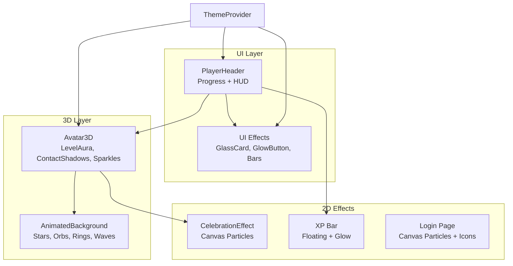

**Diagram sources**
- [player-header.tsx:1-183](file://components/player-header.tsx#L1-L183)
- [ui-effects.tsx:1-284](file://components/ui-effects.tsx#L1-L284)
- [animated-background.tsx:1-197](file://components/animated-background.tsx#L1-L197)
- [avatar-3d.tsx:1271-1344](file://components/avatar-3d.tsx#L1271-L1344)
- [celebration-effect.tsx:42-249](file://components/celebration-effect.tsx#L42-L249)
- [xp-bar.tsx:83-132](file://components/xp-bar.tsx#L83-L132)
- [login/page.tsx:75-104](file://app/login/page.tsx#L75-L104)
- [theme-provider.tsx:1-12](file://components/theme-provider.tsx#L1-L12)

**Section sources**
- [player-header.tsx:1-183](file://components/player-header.tsx#L1-L183)
- [ui-effects.tsx:1-284](file://components/ui-effects.tsx#L1-L284)
- [animated-background.tsx:1-197](file://components/animated-background.tsx#L1-L197)
- [avatar-3d.tsx:1271-1344](file://components/avatar-3d.tsx#L1271-L1344)
- [celebration-effect.tsx:42-249](file://components/celebration-effect.tsx#L42-L249)
- [xp-bar.tsx:83-132](file://components/xp-bar.tsx#L83-L132)
- [login/page.tsx:75-104](file://app/login/page.tsx#L75-L104)
- [theme-provider.tsx:1-12](file://components/theme-provider.tsx#L1-L12)

## Core Components
- Sparkles: 3D magical particle emitter integrated into the avatar scene, configurable by count, scale, size, speed, color, and position.
- LevelAura: Dynamic aura around the avatar with scaling, rotation, and pulsing based on player level and class.
- Stars: Background starfield with adjustable radius, depth, count, saturation, fading, and speed.
- ContactShadows: Realistic depth-based shadows beneath the avatar model.
- Additive Blending: Used for glow effects to achieve luminous compositing.
- CelebrationEffect: Canvas-based particle explosion for level-ups and achievements.
- Screen Effects: Radial gradients and flash overlays for screen impact.
- Theme Color Mapping: Dynamic color assignment based on level tiers and class.
- UI Effects: Glass cards, glowing buttons, animated counters, energy bars, and floating elements.

**Section sources**
- [avatar-3d.tsx:1061-1068](file://components/avatar-3d.tsx#L1061-L1068)
- [avatar-3d.tsx:1271-1299](file://components/avatar-3d.tsx#L1271-L1299)
- [animated-background.tsx:137-145](file://components/animated-background.tsx#L137-L145)
- [avatar-3d.tsx:1322](file://components/avatar-3d.tsx#L1322)
- [celebration-effect.tsx:42-167](file://components/celebration-effect.tsx#L42-L167)
- [avatar-3d.tsx:1341](file://components/avatar-3d.tsx#L1341)
- [avatar-3d.tsx:1346-1351](file://components/avatar-3d.tsx#L1346-L1351)
- [ui-effects.tsx:13-65](file://components/ui-effects.tsx#L13-L65)

## Architecture Overview
The visual system integrates 3D and 2D layers:
- 3D scene composed of lights, stars, floating geometry, and avatar with effects.
- 2D overlays for celebrations, screen flashes, and HUD indicators.
- Theme-aware color mapping and responsive UI enhancements.

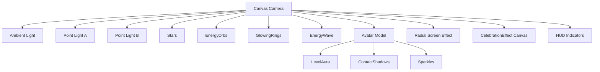

**Diagram sources**
- [animated-background.tsx:128-176](file://components/animated-background.tsx#L128-L176)
- [avatar-3d.tsx:1304-1325](file://components/avatar-3d.tsx#L1304-L1325)
- [avatar-3d.tsx:1317-1318](file://components/avatar-3d.tsx#L1317-L1318)
- [avatar-3d.tsx:1322](file://components/avatar-3d.tsx#L1322)
- [avatar-3d.tsx:1061-1068](file://components/avatar-3d.tsx#L1061-L1068)
- [avatar-3d.tsx:1341](file://components/avatar-3d.tsx#L1341)
- [celebration-effect.tsx:196-215](file://components/celebration-effect.tsx#L196-L215)

## Detailed Component Analysis

### Sparkles Component
Sparkles is a 3D particle emitter used to render magical sparkles around the avatar. It supports:
- count: Number of particles
- scale: Emission volume scale
- size: Particle size
- speed: Movement speed
- color: Particle tint
- position: World-space offset

Integration and configuration:
- Placed at the avatar’s head position and scaled with level to emphasize higher ranks.
- Uses theme color mapping for consistent class-level aesthetics.

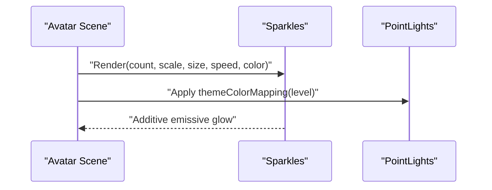

**Diagram sources**
- [avatar-3d.tsx:1061-1068](file://components/avatar-3d.tsx#L1061-L1068)
- [avatar-3d.tsx:1346-1351](file://components/avatar-3d.tsx#L1346-L1351)

**Section sources**
- [avatar-3d.tsx:1061-1068](file://components/avatar-3d.tsx#L1061-L1068)
- [avatar-3d.tsx:1346-1351](file://components/avatar-3d.tsx#L1346-L1351)

### LevelAura Component
LevelAura renders a luminous aura around the avatar that:
- Dynamically scales with level
- Rotates continuously
- Pulsates sinusoidally for a breathing glow

Color mapping:
- Tiered color based on level thresholds
- Additive blending for luminous compositing

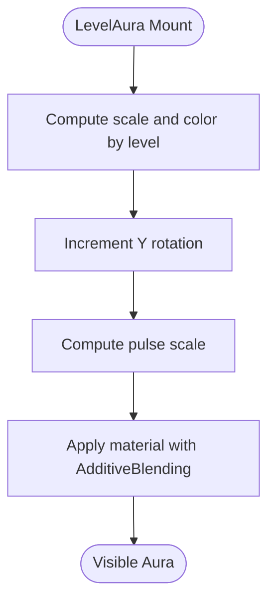

**Diagram sources**
- [avatar-3d.tsx:1271-1299](file://components/avatar-3d.tsx#L1271-L1299)

**Section sources**
- [avatar-3d.tsx:1271-1299](file://components/avatar-3d.tsx#L1271-L1299)

### Stars Component
Stars creates a starfield background with:
- radius: Sphere radius
- depth: Depth into the scene
- count: Number of stars
- factor: Brightness factor
- saturation: Desaturation amount
- fade: Smooth fading
- speed: Animation speed

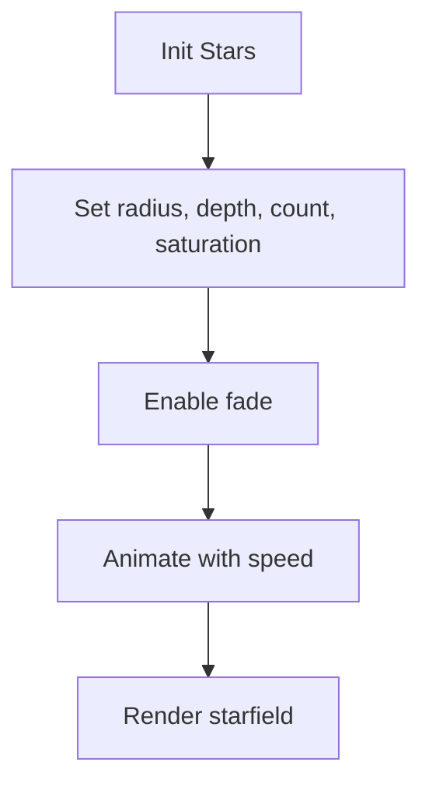

**Diagram sources**
- [animated-background.tsx:137-145](file://components/animated-background.tsx#L137-L145)
- [avatar-3d.tsx:1318](file://components/avatar-3d.tsx#L1318)

**Section sources**
- [animated-background.tsx:137-145](file://components/animated-background.tsx#L137-L145)
- [avatar-3d.tsx:1318](file://components/avatar-3d.tsx#L1318)

### Contact Shadows System
ContactShadows provides realistic depth-based shadows:
- position: Shadow plane offset
- opacity: Fade transparency
- scale: Plane size
- blur: Softness
- far: Distance threshold

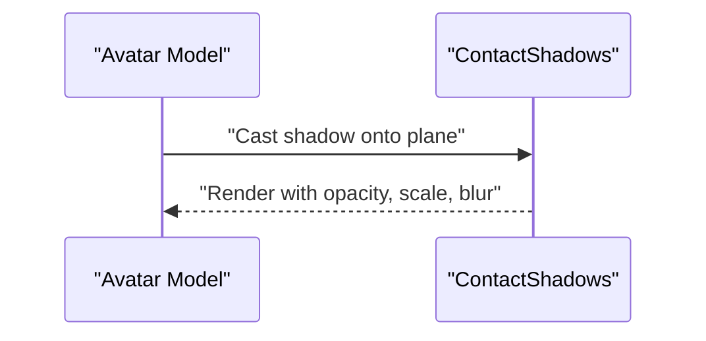

**Diagram sources**
- [avatar-3d.tsx:1322](file://components/avatar-3d.tsx#L1322)

**Section sources**
- [avatar-3d.tsx:1322](file://components/avatar-3d.tsx#L1322)

### Additive Blending Techniques
Additive blending is used for glow effects:
- Material uses AdditiveBlending to combine light intensities
- Achieves luminous edges and soft halos
- Applied to LevelAura and emissive materials

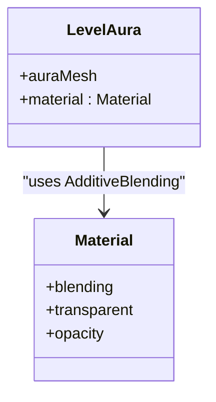

**Diagram sources**
- [avatar-3d.tsx:1295](file://components/avatar-3d.tsx#L1295)

**Section sources**
- [avatar-3d.tsx:1295](file://components/avatar-3d.tsx#L1295)

### Screen Effects: Radial Gradients and Flash
Screen effects include:
- Radial gradient overlay for level-based ambiance
- Flash overlay for impactful moments
- CelebrationEffect canvas particles for level-ups and achievements

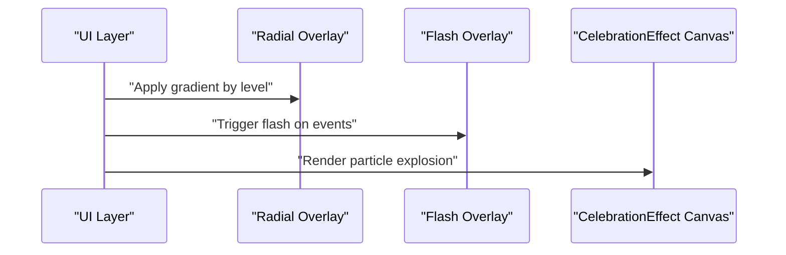

**Diagram sources**
- [avatar-3d.tsx:1341](file://components/avatar-3d.tsx#L1341)
- [celebration-effect.tsx:238-249](file://components/celebration-effect.tsx#L238-L249)
- [celebration-effect.tsx:196-215](file://components/celebration-effect.tsx#L196-L215)

**Section sources**
- [avatar-3d.tsx:1341](file://components/avatar-3d.tsx#L1341)
- [celebration-effect.tsx:238-249](file://components/celebration-effect.tsx#L238-L249)
- [celebration-effect.tsx:196-215](file://components/celebration-effect.tsx#L196-L215)

### Theme Color Mapping System
Theme color mapping ties visuals to player level and class:
- Level tiers: Tiers 1–9, 10–19, 20–29, 30+ with distinct colors
- Class-specific palettes for knights, berserkers, and shadows
- Applied to lights, emissives, borders, and HUD accents

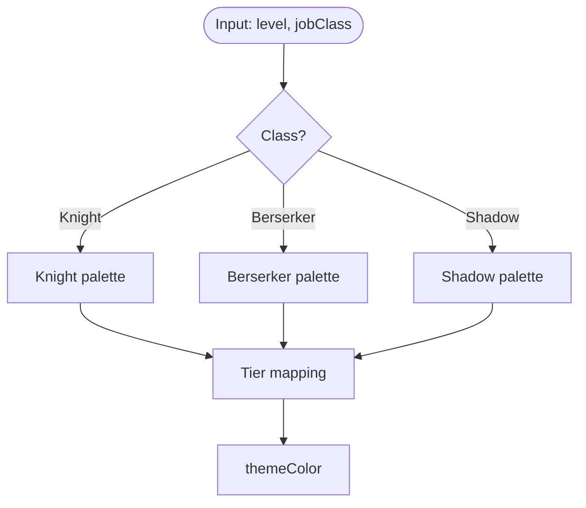

**Diagram sources**
- [avatar-3d.tsx:1152-1156](file://components/avatar-3d.tsx#L1152-L1156)
- [avatar-3d.tsx:1346-1351](file://components/avatar-3d.tsx#L1346-L1351)
- [player-header.tsx:29-37](file://components/player-header.tsx#L29-L37)

**Section sources**
- [avatar-3d.tsx:1152-1156](file://components/avatar-3d.tsx#L1152-L1156)
- [avatar-3d.tsx:1346-1351](file://components/avatar-3d.tsx#L1346-L1351)
- [player-header.tsx:29-37](file://components/player-header.tsx#L29-L37)

### UI Effects and HUD Indicators
UI effects enhance the interface with:
- GlassCard: Backdrop blur, inner glow, and 3D hover
- GlowButton: Animated gradient and glow
- EnergyBar: Animated fill with shimmer
- AnimatedCounter: Numeric animations
- HUD indicators: On-screen status bars

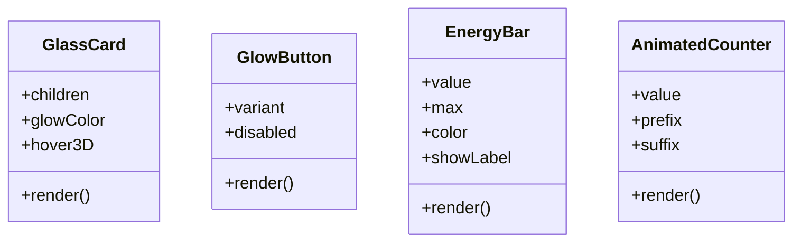

**Diagram sources**
- [ui-effects.tsx:13-65](file://components/ui-effects.tsx#L13-L65)
- [ui-effects.tsx:77-136](file://components/ui-effects.tsx#L77-L136)
- [ui-effects.tsx:215-262](file://components/ui-effects.tsx#L215-L262)
- [ui-effects.tsx:146-154](file://components/ui-effects.tsx#L146-L154)

**Section sources**
- [ui-effects.tsx:13-65](file://components/ui-effects.tsx#L13-L65)
- [ui-effects.tsx:77-136](file://components/ui-effects.tsx#L77-L136)
- [ui-effects.tsx:215-262](file://components/ui-effects.tsx#L215-L262)
- [ui-effects.tsx:146-154](file://components/ui-effects.tsx#L146-L154)

### XP Bar and Floating Particles
The XP bar includes:
- Animated background glow
- Floating XP particle indicators with physics and decay
- Gradient-filled progress bar with shimmer

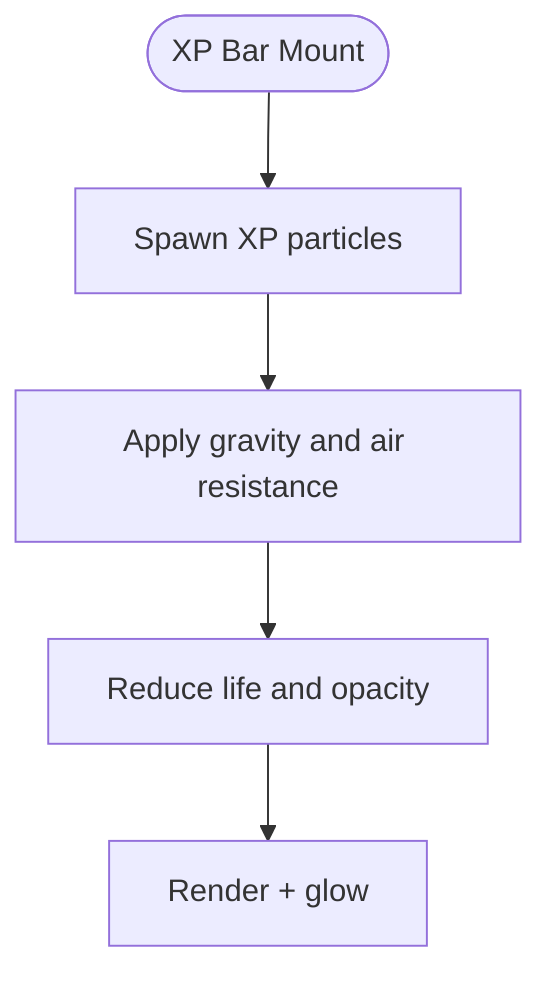

**Diagram sources**
- [xp-bar.tsx:83-132](file://components/xp-bar.tsx#L83-L132)

**Section sources**
- [xp-bar.tsx:83-132](file://components/xp-bar.tsx#L83-L132)

### Login Page Canvas Effects
Login page features:
- Canvas-based floating particles with glow
- Animated icons background
- Radial glow effects

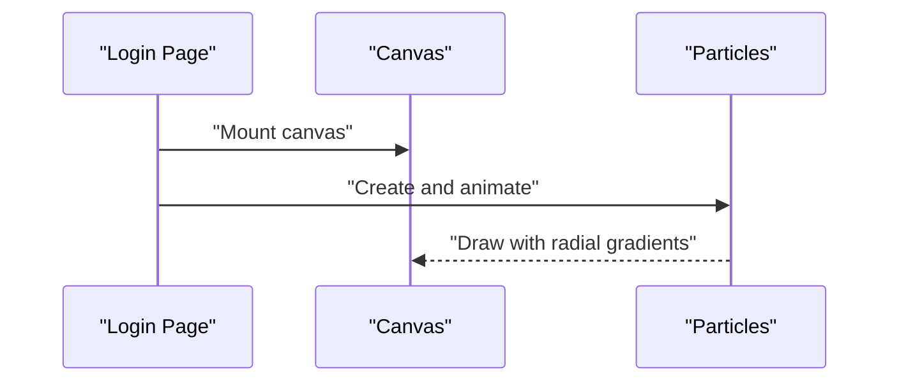

**Diagram sources**
- [login/page.tsx:75-104](file://app/login/page.tsx#L75-L104)
- [login/page.tsx:186-190](file://app/login/page.tsx#L186-L190)

**Section sources**
- [login/page.tsx:75-104](file://app/login/page.tsx#L75-L104)
- [login/page.tsx:186-190](file://app/login/page.tsx#L186-L190)

## Dependency Analysis
Key dependencies and relationships:
- PlayerHeader depends on game constants for XP calculations and level derivation.
- Avatar3D composes LevelAura, Stars, ContactShadows, and Sparkles.
- UI Effects are theme-aware and integrate with ThemeProvider.
- CelebrationEffect is decoupled from 3D and uses canvas for performance.

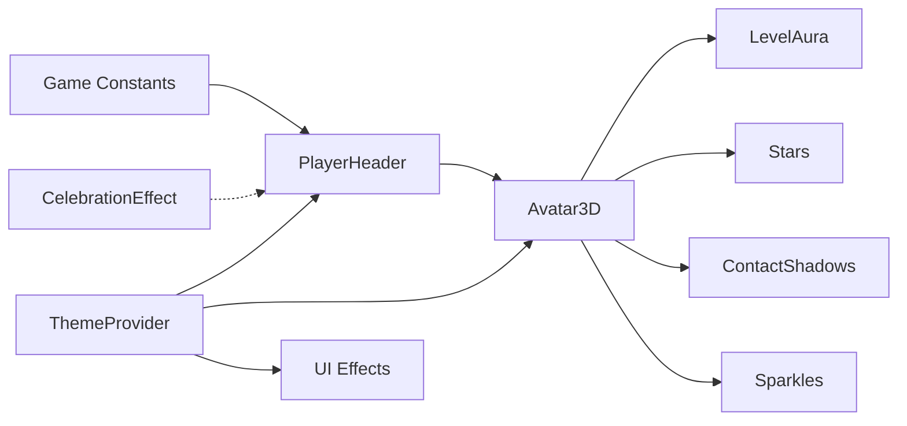

**Diagram sources**
- [game-constants.ts:28-42](file://lib/game-constants.ts#L28-L42)
- [player-header.tsx:21](file://components/player-header.tsx#L21)
- [avatar-3d.tsx:1304-1325](file://components/avatar-3d.tsx#L1304-L1325)
- [avatar-3d.tsx:1317-1318](file://components/avatar-3d.tsx#L1317-L1318)
- [avatar-3d.tsx:1322](file://components/avatar-3d.tsx#L1322)
- [avatar-3d.tsx:1061-1068](file://components/avatar-3d.tsx#L1061-L1068)
- [theme-provider.tsx:1-12](file://components/theme-provider.tsx#L1-L12)
- [celebration-effect.tsx:196-215](file://components/celebration-effect.tsx#L196-L215)

**Section sources**
- [game-constants.ts:28-42](file://lib/game-constants.ts#L28-L42)
- [player-header.tsx:21](file://components/player-header.tsx#L21)
- [avatar-3d.tsx:1304-1325](file://components/avatar-3d.tsx#L1304-L1325)
- [avatar-3d.tsx:1317-1318](file://components/avatar-3d.tsx#L1317-L1318)
- [avatar-3d.tsx:1322](file://components/avatar-3d.tsx#L1322)
- [avatar-3d.tsx:1061-1068](file://components/avatar-3d.tsx#L1061-L1068)
- [theme-provider.tsx:1-12](file://components/theme-provider.tsx#L1-L12)
- [celebration-effect.tsx:196-215](file://components/celebration-effect.tsx#L196-L215)

## Performance Considerations
- Prefer instanced meshes for large particle clouds (as seen in the animated background particle field).
- Use additive blending judiciously; limit emissive intensity to avoid overdraw.
- Cap particle counts and lifetimes; throttle animation frames with requestAnimationFrame where applicable.
- Defer heavy computations to useMemo/useCallback and avoid unnecessary re-renders.
- Use environment presets and optimized geometry for 3D scenes.
- Keep screen effects localized and short-lived to minimize offscreen rendering overhead.

## Troubleshooting Guide
Common issues and resolutions:
- Particles not visible: Verify emissive and opacity settings; ensure additive blending is applied to materials.
- Lighting mismatch: Confirm theme color mapping aligns with level and class; check light colors and intensities.
- Performance drops: Reduce particle counts, simplify geometry, and disable non-essential animations during gameplay.
- Screen effects lag: Use requestAnimationFrame efficiently and cancel animation frames on unmount.
- HUD desynchronization: Ensure XP calculations derive from game constants and update progress percentages accordingly.

**Section sources**
- [animated-background.tsx:59-100](file://components/animated-background.tsx#L59-L100)
- [avatar-3d.tsx:1295](file://components/avatar-3d.tsx#L1295)
- [game-constants.ts:28-42](file://lib/game-constants.ts#L28-L42)
- [celebration-effect.tsx:154-170](file://components/celebration-effect.tsx#L154-L170)

## Conclusion
The visual effects system blends 3D and 2D techniques to deliver immersive, theme-aware experiences. Sparkles, LevelAura, Stars, and ContactShadows create layered depth and atmosphere. Additive blending and screen effects amplify impact, while UI effects and HUD indicators reinforce progression and identity. By following the performance and integration guidelines, developers can customize and scale effects to match evolving visual designs.

## Appendices
- Example customization patterns:
  - Adjust Sparkles count and size based on level thresholds for stronger visual feedback.
  - Modify LevelAura color stops and pulse amplitude to reflect class identities.
  - Tune Stars depth and saturation for different environmental moods.
  - Configure ContactShadows opacity and blur to balance realism and readability.
  - Integrate CelebrationEffect callbacks with game events for contextual celebrations.