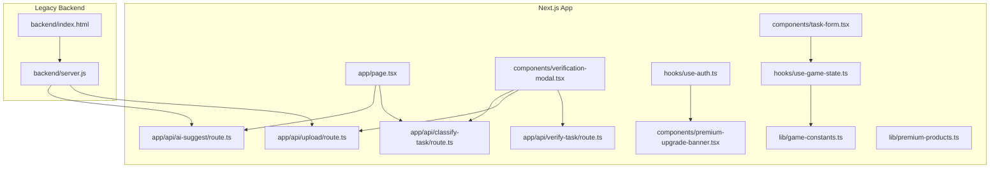
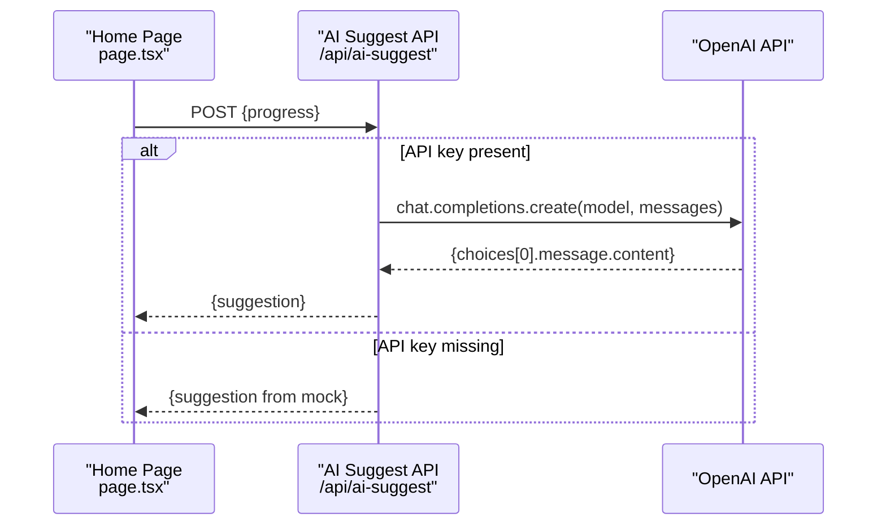
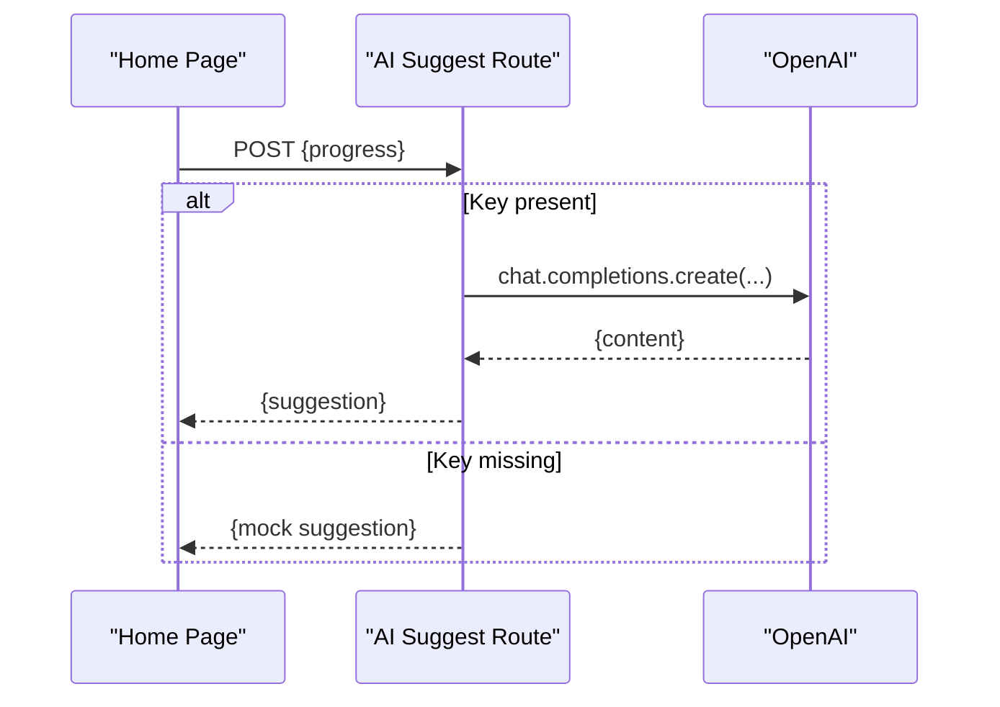
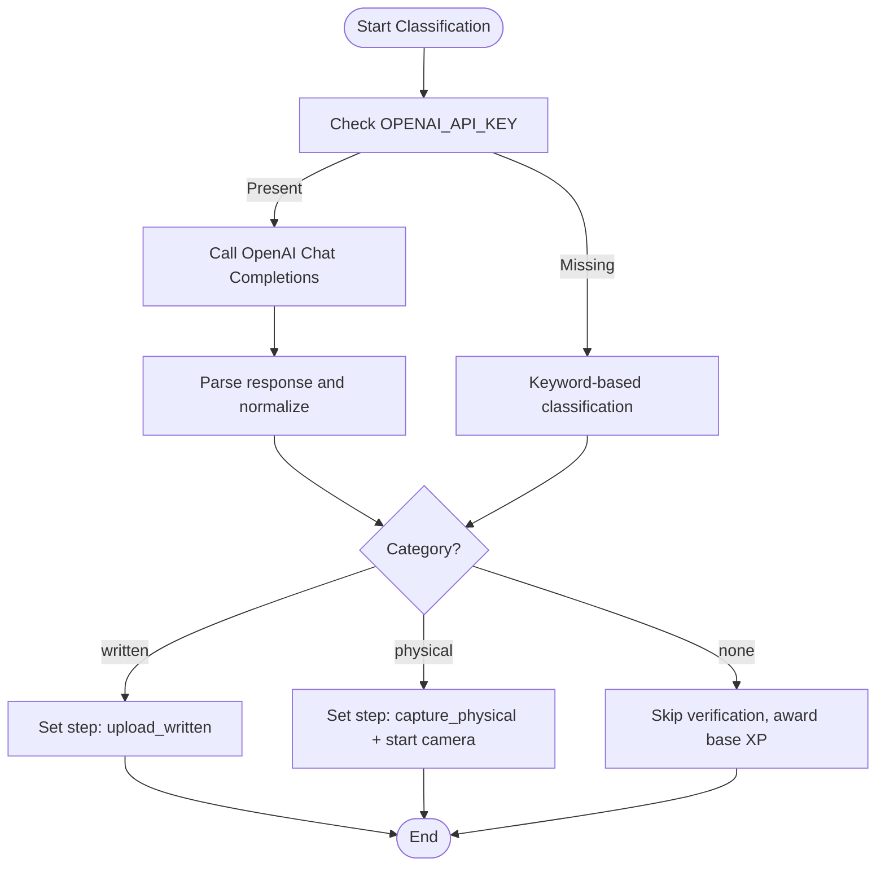
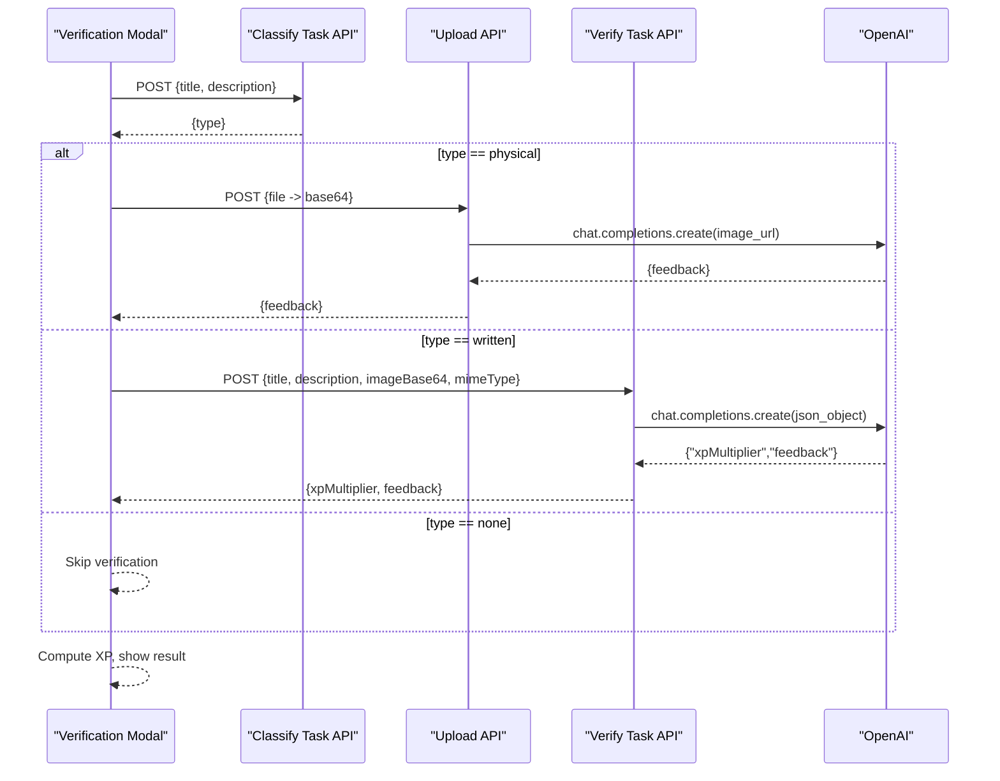
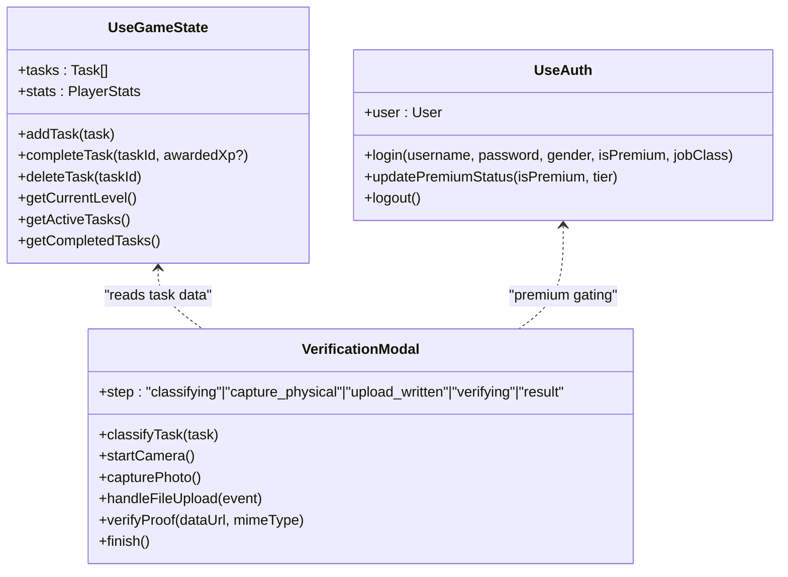
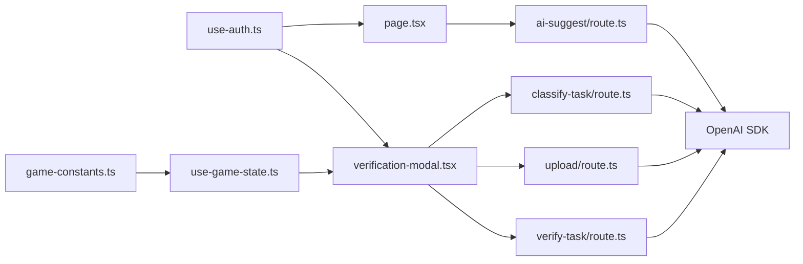

# AI Integration

<cite>
**Referenced Files in This Document**
- [route.ts](file://app/api/ai-suggest/route.ts)
- [route.ts](file://app/api/classify-task/route.ts)
- [route.ts](file://app/api/upload/route.ts)
- [route.ts](file://app/api/verify-task/route.ts)
- [page.tsx](file://app/page.tsx)
- [verification-modal.tsx](file://components/verification-modal.tsx)
- [task-form.tsx](file://components/task-form.tsx)
- [use-auth.ts](file://hooks/use-auth.ts)
- [use-game-state.ts](file://hooks/use-game-state.ts)
- [game-constants.ts](file://lib/game-constants.ts)
- [premium-upgrade-banner.tsx](file://components/premium-upgrade-banner.tsx)
- [premium-products.ts](file://lib/premium-products.ts)
- [server.js](file://backend/server.js)
- [index.html](file://backend/index.html)
</cite>

## Table of Contents
1. [Introduction](#introduction)
2. [Project Structure](#project-structure)
3. [Core Components](#core-components)
4. [Architecture Overview](#architecture-overview)
5. [Detailed Component Analysis](#detailed-component-analysis)
6. [Dependency Analysis](#dependency-analysis)
7. [Performance Considerations](#performance-considerations)
8. [Troubleshooting Guide](#troubleshooting-guide)
9. [Conclusion](#conclusion)
10. [Appendices](#appendices)

## Introduction
This document explains the AI-powered features and OpenAI integration in the project. It covers:
- AI task suggestion system with context-aware recommendations and mock fallback
- Task classification system for automatic categorization and fallback handling
- Image analysis pipeline for proof-of-completion with camera capture and file upload
- API endpoints for AI services, request/response schemas, and error handling
- Frontend integration patterns, loading states, and user feedback
- Practical workflows and examples for suggestions, classification, and image analysis
- Performance, rate limiting, and cost optimization strategies

## Project Structure
The AI features span Next.js API routes under app/api, frontend components and hooks, and a legacy backend server for demonstration and premium gating.

**Diagram sources**
- [route.ts:1-34](file://app/api/ai-suggest/route.ts#L1-L34)
- [route.ts:1-43](file://app/api/classify-task/route.ts#L1-L43)
- [route.ts:1-43](file://app/api/upload/route.ts#L1-L43)
- [route.ts:1-55](file://app/api/verify-task/route.ts#L1-L55)
- [page.tsx:27-103](file://app/page.tsx#L27-L103)
- [verification-modal.tsx:1-331](file://components/verification-modal.tsx#L1-L331)
- [task-form.tsx:1-191](file://components/task-form.tsx#L1-L191)
- [use-auth.ts:1-167](file://hooks/use-auth.ts#L1-L167)
- [use-game-state.ts:1-252](file://hooks/use-game-state.ts#L1-L252)
- [game-constants.ts:1-95](file://lib/game-constants.ts#L1-L95)
- [premium-upgrade-banner.tsx:1-89](file://components/premium-upgrade-banner.tsx#L1-L89)
- [premium-products.ts:1-75](file://lib/premium-products.ts#L1-L75)
- [server.js:1-154](file://backend/server.js#L1-L154)
- [index.html:1-60](file://backend/index.html#L1-L60)

**Section sources**
- [route.ts:1-34](file://app/api/ai-suggest/route.ts#L1-L34)
- [route.ts:1-43](file://app/api/classify-task/route.ts#L1-L43)
- [route.ts:1-43](file://app/api/upload/route.ts#L1-L43)
- [route.ts:1-55](file://app/api/verify-task/route.ts#L1-L55)
- [page.tsx:27-103](file://app/page.tsx#L27-L103)
- [verification-modal.tsx:1-331](file://components/verification-modal.tsx#L1-L331)
- [task-form.tsx:1-191](file://components/task-form.tsx#L1-L191)
- [use-auth.ts:1-167](file://hooks/use-auth.ts#L1-L167)
- [use-game-state.ts:1-252](file://hooks/use-game-state.ts#L1-L252)
- [game-constants.ts:1-95](file://lib/game-constants.ts#L1-L95)
- [premium-upgrade-banner.tsx:1-89](file://components/premium-upgrade-banner.tsx#L1-L89)
- [premium-products.ts:1-75](file://lib/premium-products.ts#L1-L75)
- [server.js:1-154](file://backend/server.js#L1-L154)
- [index.html:1-60](file://backend/index.html#L1-L60)

## Core Components
- AI Task Suggestion API: Generates context-aware quest suggestions using OpenAI Chat Completions. Includes a mock fallback when the API key is missing or placeholder.
- Task Classification API: Automatically classifies tasks as written, physical, or none, with a mock fallback.
- Image Analysis APIs:
  - Upload endpoint converts a multipart file to base64 and sends it to OpenAI for feedback.
  - Verify endpoint evaluates uploaded proof images and returns an XP multiplier and feedback.
- Frontend Integration:
  - AI suggestion trigger on the home page with loading states and toast notifications.
  - Verification modal orchestrates classification, camera capture, file upload, verification, and result display.
  - Task form integrates with game state and XP calculations.
- Premium Gating:
  - Authentication hook manages premium status and avatar selection.
  - Premium upgrade banner and product catalog expose premium tiers and benefits.
  - Legacy backend enforces premium checks for AI features.

**Section sources**
- [route.ts:8-33](file://app/api/ai-suggest/route.ts#L8-L33)
- [route.ts:8-42](file://app/api/classify-task/route.ts#L8-L42)
- [route.ts:8-42](file://app/api/upload/route.ts#L8-L42)
- [route.ts:8-54](file://app/api/verify-task/route.ts#L8-L54)
- [page.tsx:40-73](file://app/page.tsx#L40-L73)
- [verification-modal.tsx:18-140](file://components/verification-modal.tsx#L18-L140)
- [task-form.tsx:18-51](file://components/task-form.tsx#L18-L51)
- [use-auth.ts:28-109](file://hooks/use-auth.ts#L28-L109)
- [premium-upgrade-banner.tsx:7-12](file://components/premium-upgrade-banner.tsx#L7-L12)
- [premium-products.ts:13-71](file://lib/premium-products.ts#L13-L71)
- [server.js:46-52](file://backend/server.js#L46-L52)

## Architecture Overview
The AI features follow a layered architecture:
- Frontend triggers requests via Next.js API routes (/api/*).
- API routes call OpenAI Chat Completions or multimodal endpoints.
- Mock fallbacks are used when OPENAI_API_KEY is absent or equals the placeholder.
- Premium gating ensures AI features are restricted to premium users.
- Game state and XP mechanics are handled client-side with persistent storage.

**Diagram sources**
- [page.tsx:40-73](file://app/page.tsx#L40-L73)
- [route.ts:8-33](file://app/api/ai-suggest/route.ts#L8-L33)

**Section sources**
- [page.tsx:40-73](file://app/page.tsx#L40-L73)
- [route.ts:8-33](file://app/api/ai-suggest/route.ts#L8-L33)

## Detailed Component Analysis

### AI Task Suggestion System
- Purpose: Provide context-aware quest suggestions based on user progress.
- Inputs: progress object containing level, completed tasks, and active titles.
- Processing:
  - Validates OPENAI_API_KEY presence.
  - Calls OpenAI Chat Completions with a prompt tailored to the “System from Solo Leveling.”
  - Returns the generated suggestion.
  - On missing key, returns a randomized mock suggestion.
- Frontend integration:
  - Triggers on button click, sets loading state, shows success/error toasts, and clears loading state.

**Diagram sources**
- [page.tsx:40-73](file://app/page.tsx#L40-L73)
- [route.ts:8-33](file://app/api/ai-suggest/route.ts#L8-L33)

**Section sources**
- [route.ts:8-33](file://app/api/ai-suggest/route.ts#L8-L33)
- [page.tsx:40-73](file://app/page.tsx#L40-L73)

### Task Classification System
- Purpose: Automatically categorize tasks as written, physical, or none.
- Inputs: title and description.
- Processing:
  - Validates OPENAI_API_KEY presence.
  - Sends a system prompt and user content to OpenAI Chat Completions.
  - Parses the response to determine category, with strict fallback to “none”.
  - On missing key, performs keyword-based classification as a mock fallback.
- Frontend integration:
  - Invoked inside the verification modal after opening, then transitions to appropriate capture/upload step.

**Diagram sources**
- [route.ts:8-42](file://app/api/classify-task/route.ts#L8-L42)
- [verification-modal.tsx:39-64](file://components/verification-modal.tsx#L39-L64)

**Section sources**
- [route.ts:8-42](file://app/api/classify-task/route.ts#L8-L42)
- [verification-modal.tsx:39-64](file://components/verification-modal.tsx#L39-L64)

### Image Analysis and Verification Pipeline
- Upload Endpoint:
  - Accepts multipart/form-data with a file.
  - Converts file to base64 and sends it to OpenAI with a multimodal message.
  - Returns feedback text.
- Verify Endpoint:
  - Accepts title, description, image base64, and MIME type.
  - Calls OpenAI with a structured system prompt and JSON response format.
  - Parses the returned JSON to extract xpMultiplier and feedback.
  - On missing key, simulates processing delay and returns mock values.
- Frontend Integration:
  - Verification modal coordinates steps: classifying → capture/upload → verifying → result.
  - Uses camera capture or file upload depending on classification.
  - Displays feedback and computed XP multiplier.

**Diagram sources**
- [verification-modal.tsx:39-140](file://components/verification-modal.tsx#L39-L140)
- [route.ts:8-42](file://app/api/upload/route.ts#L8-L42)
- [route.ts:8-54](file://app/api/verify-task/route.ts#L8-L54)

**Section sources**
- [route.ts:8-42](file://app/api/upload/route.ts#L8-L42)
- [route.ts:8-54](file://app/api/verify-task/route.ts#L8-L54)
- [verification-modal.tsx:39-140](file://components/verification-modal.tsx#L39-L140)

### Frontend Integration Patterns
- Loading States and Feedback:
  - Home page uses a generating flag and toast notifications for suggestion outcomes.
  - Verification modal uses step-based rendering and animated loaders.
- User Progress and XP:
  - Game state calculates XP rewards and levels, integrating with XP multipliers from verification.
- Premium Experience:
  - Authentication hook updates premium status and avatar selection.
  - Premium upgrade banner encourages upgrades; product catalog defines tiers and features.

**Diagram sources**
- [use-game-state.ts:51-251](file://hooks/use-game-state.ts#L51-L251)
- [use-auth.ts:28-167](file://hooks/use-auth.ts#L28-L167)
- [verification-modal.tsx:18-140](file://components/verification-modal.tsx#L18-L140)

**Section sources**
- [page.tsx:27-73](file://app/page.tsx#L27-L73)
- [verification-modal.tsx:18-140](file://components/verification-modal.tsx#L18-L140)
- [use-game-state.ts:51-251](file://hooks/use-game-state.ts#L51-L251)
- [use-auth.ts:28-167](file://hooks/use-auth.ts#L28-L167)

## Dependency Analysis
- API Routes depend on the OpenAI SDK and environment configuration.
- Frontend components depend on hooks for authentication and game state.
- Premium gating is enforced by middleware in the legacy backend and reflected in the UI via authentication state.
- The legacy backend demonstrates premium checks and file upload handling for comparison.

**Diagram sources**
- [route.ts:1-6](file://app/api/ai-suggest/route.ts#L1-L6)
- [route.ts:1-6](file://app/api/classify-task/route.ts#L1-L6)
- [route.ts:1-6](file://app/api/upload/route.ts#L1-L6)
- [route.ts:1-6](file://app/api/verify-task/route.ts#L1-L6)
- [page.tsx:35-73](file://app/page.tsx#L35-L73)
- [verification-modal.tsx:18-140](file://components/verification-modal.tsx#L18-L140)
- [use-auth.ts:28-167](file://hooks/use-auth.ts#L28-L167)
- [use-game-state.ts:51-251](file://hooks/use-game-state.ts#L51-L251)
- [game-constants.ts:1-95](file://lib/game-constants.ts#L1-L95)

**Section sources**
- [route.ts:1-6](file://app/api/ai-suggest/route.ts#L1-L6)
- [route.ts:1-6](file://app/api/classify-task/route.ts#L1-L6)
- [route.ts:1-6](file://app/api/upload/route.ts#L1-L6)
- [route.ts:1-6](file://app/api/verify-task/route.ts#L1-L6)
- [page.tsx:35-73](file://app/page.tsx#L35-L73)
- [verification-modal.tsx:18-140](file://components/verification-modal.tsx#L18-L140)
- [use-auth.ts:28-167](file://hooks/use-auth.ts#L28-L167)
- [use-game-state.ts:51-251](file://hooks/use-game-state.ts#L51-L251)
- [game-constants.ts:1-95](file://lib/game-constants.ts#L1-L95)

## Performance Considerations
- Rate Limiting and Cost Control:
  - Use a single OpenAI API key per environment and monitor usage.
  - Apply client-side caching for repeated suggestions and classifications when appropriate.
  - Batch requests where feasible; avoid redundant calls during modal navigation.
- Model Selection:
  - Prefer gpt-4o-mini for cost-effective inference; reserve larger models for specialized tasks.
- Network Efficiency:
  - Minimize payload sizes; send only necessary fields (e.g., base64 image without metadata).
  - Use image/jpeg with moderate resolution for camera captures to reduce token and bandwidth costs.
- Frontend Responsiveness:
  - Keep UI responsive by deferring heavy computations to background threads or debounced handlers.
  - Use skeleton loaders and minimal re-renders during long-running AI operations.

[No sources needed since this section provides general guidance]

## Troubleshooting Guide
- Missing or Invalid API Key:
  - Symptom: Mock responses instead of AI-generated content.
  - Resolution: Set OPENAI_API_KEY in environment variables.
- Network Errors:
  - Symptom: 500 errors from API routes.
  - Resolution: Retry with exponential backoff; log error.message for diagnostics.
- Camera Access Issues:
  - Symptom: Camera step fails; modal falls back to file upload.
  - Resolution: Ensure HTTPS origin and permissions; test with a different browser/device.
- JSON Parsing Failures:
  - Symptom: Verify endpoint returns defaults when parsing fails.
  - Resolution: Validate input shape and ensure response_format is respected.

**Section sources**
- [route.ts:30-32](file://app/api/ai-suggest/route.ts#L30-L32)
- [route.ts:39-41](file://app/api/classify-task/route.ts#L39-L41)
- [route.ts:39-41](file://app/api/upload/route.ts#L39-L41)
- [route.ts:51-53](file://app/api/verify-task/route.ts#L51-L53)
- [verification-modal.tsx:73-77](file://components/verification-modal.tsx#L73-L77)
- [verification-modal.tsx:135-139](file://components/verification-modal.tsx#L135-L139)

## Conclusion
The AI integration combines context-aware suggestions, automated task classification, and multimodal image analysis to enhance user engagement. The system gracefully degrades to mock implementations when API keys are unavailable, ensuring usability. Premium gating aligns AI features with monetization goals, while frontend components deliver smooth user experiences with clear feedback and loading states.

[No sources needed since this section summarizes without analyzing specific files]

## Appendices

### API Endpoints and Schemas
- AI Suggest
  - Method: POST
  - Path: /api/ai-suggest
  - Request: { progress: object }
  - Response: { suggestion: string } or { error: string }
- Classify Task
  - Method: POST
  - Path: /api/classify-task
  - Request: { title: string, description?: string }
  - Response: { type: "written" | "physical" | "none" } or { error: string }
- Upload
  - Method: POST
  - Path: /api/upload
  - Request: multipart/form-data with file
  - Response: { feedback: string } or { error: string }
- Verify Task
  - Method: POST
  - Path: /api/verify-task
  - Request: { title: string, description?: string, imageBase64: string, mimeType: string }
  - Response: { xpMultiplier: number, feedback: string } or { error: string }

**Section sources**
- [route.ts:8-33](file://app/api/ai-suggest/route.ts#L8-L33)
- [route.ts:8-42](file://app/api/classify-task/route.ts#L8-L42)
- [route.ts:8-42](file://app/api/upload/route.ts#L8-L42)
- [route.ts:8-54](file://app/api/verify-task/route.ts#L8-L54)

### Practical Workflows

- AI Suggestion Workflow
  - Trigger: Click “Get AI Suggestion” on home page.
  - Data: Build progress object from game state.
  - Outcome: Display suggestion in a toast notification.

- Task Classification Workflow
  - Trigger: Open verification modal for a task.
  - Steps: Classify → Capture Photo or Upload File → Verify → Show Result.

- Image Analysis Scenario
  - Physical Task: Use camera to capture proof, convert to base64, send to verify endpoint.
  - Written Task: Upload image file, send to verify endpoint.
  - Result: XP multiplier applied to base XP reward.

**Section sources**
- [page.tsx:40-73](file://app/page.tsx#L40-L73)
- [verification-modal.tsx:39-140](file://components/verification-modal.tsx#L39-L140)
- [use-game-state.ts:127-210](file://hooks/use-game-state.ts#L127-L210)

### Premium Gating and Monetization
- Premium Features:
  - AI task suggestions and image analysis are gated behind premium status.
  - Premium upgrade banner and product catalog define tiers and benefits.
- Backend Premium Check:
  - Middleware validates user plan before allowing AI endpoints.

**Section sources**
- [use-auth.ts:28-109](file://hooks/use-auth.ts#L28-L109)
- [premium-upgrade-banner.tsx:7-12](file://components/premium-upgrade-banner.tsx#L7-L12)
- [premium-products.ts:13-71](file://lib/premium-products.ts#L13-L71)
- [server.js:46-52](file://backend/server.js#L46-L52)