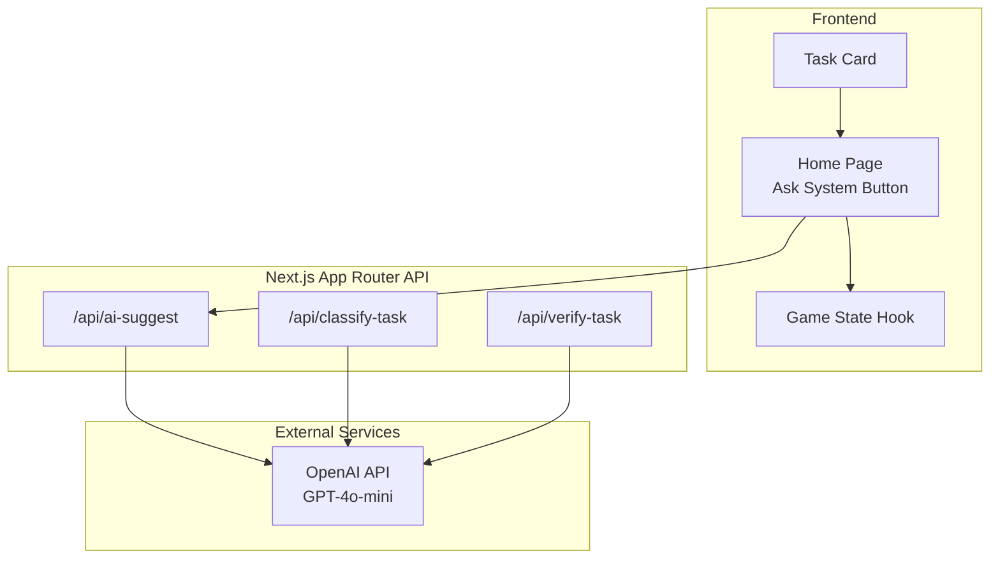
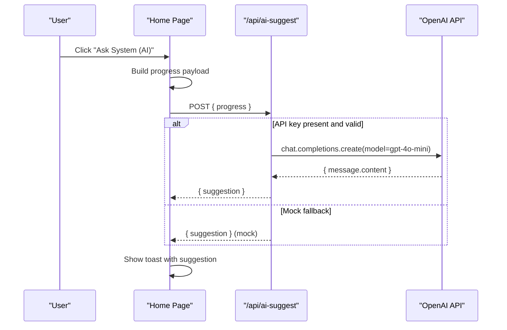
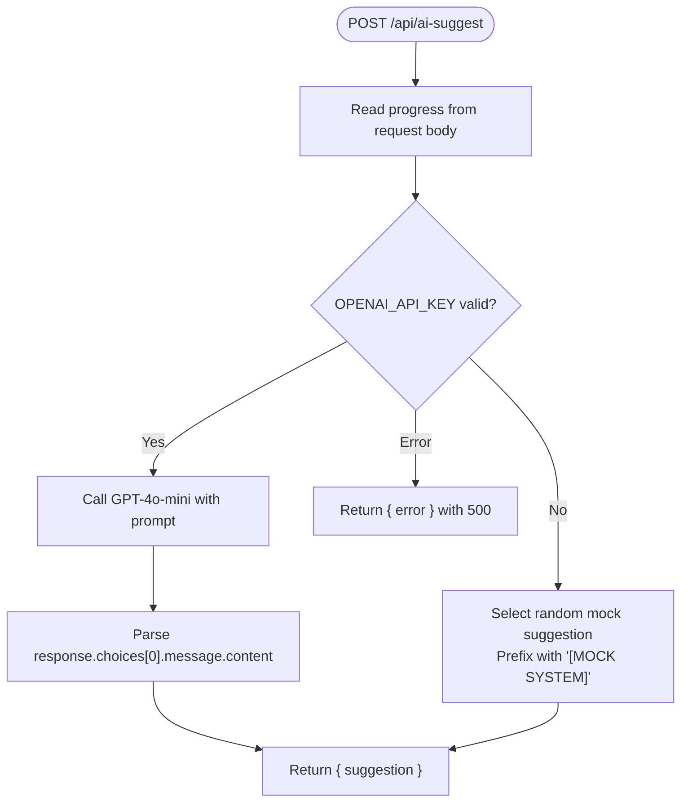
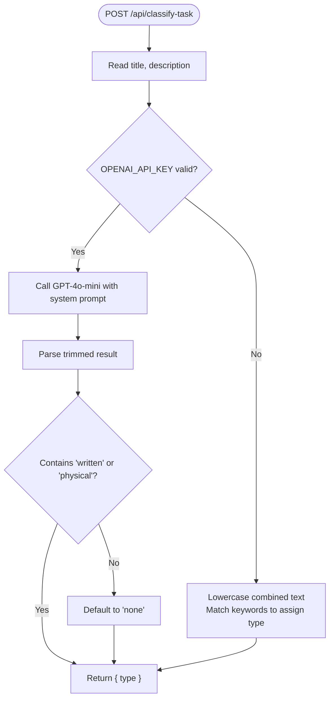
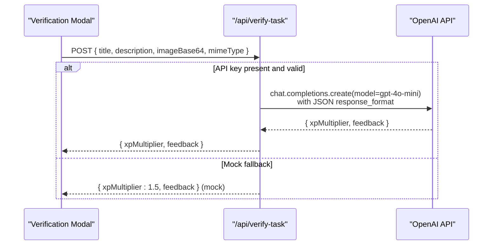
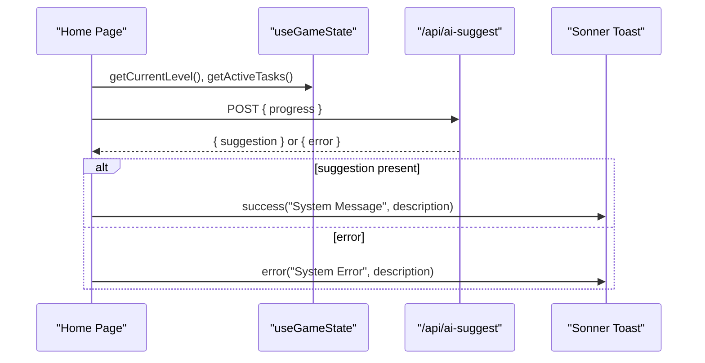
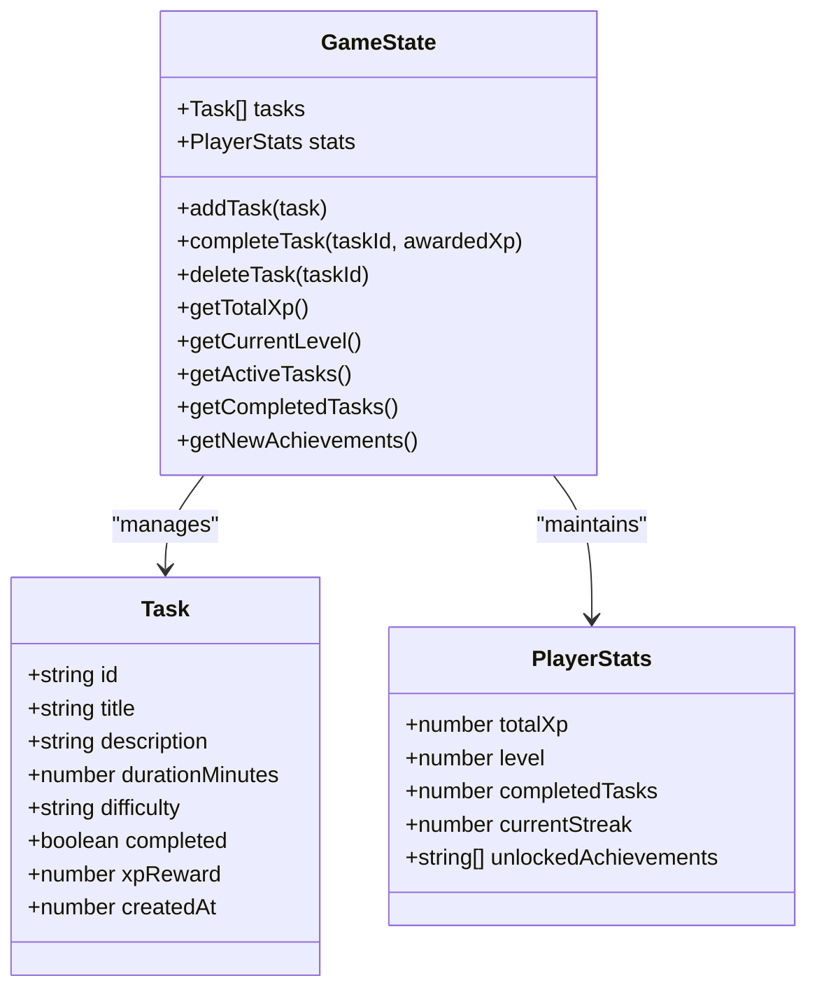
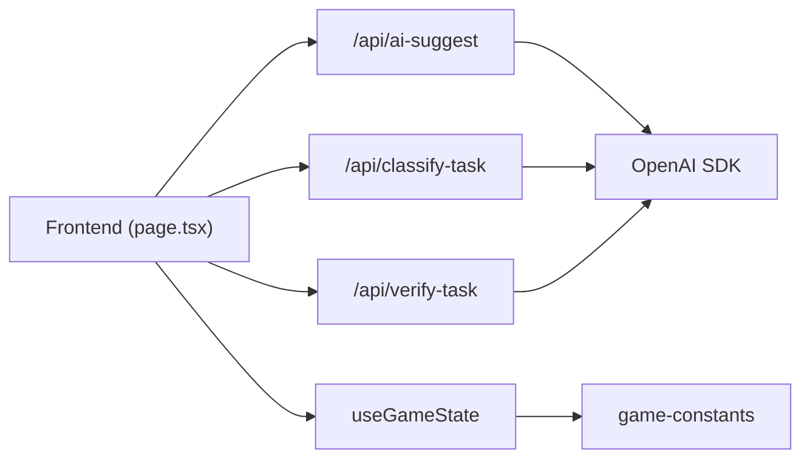

# AI Task Suggestions

<cite>
**Referenced Files in This Document**
- [route.ts](file://app/api/ai-suggest/route.ts)
- [route.ts](file://app/api/classify-task/route.ts)
- [route.ts](file://app/api/verify-task/route.ts)
- [page.tsx](file://app/page.tsx)
- [use-game-state.ts](file://hooks/use-game-state.ts)
- [task-card.tsx](file://components/task-card.tsx)
- [game-constants.ts](file://lib/game-constants.ts)
- [package.json](file://package.json)
</cite>

## Table of Contents
1. [Introduction](#introduction)
2. [Project Structure](#project-structure)
3. [Core Components](#core-components)
4. [Architecture Overview](#architecture-overview)
5. [Detailed Component Analysis](#detailed-component-analysis)
6. [Dependency Analysis](#dependency-analysis)
7. [Performance Considerations](#performance-considerations)
8. [Troubleshooting Guide](#troubleshooting-guide)
9. [Conclusion](#conclusion)

## Introduction
This document explains the AI-powered task suggestion system integrated into the Solo Leveling-themed task manager. It covers how the system uses the OpenAI GPT-4o-mini model to generate context-aware, gamified task recommendations, and how it gracefully degrades to a mock system when API keys are unavailable. It also documents the request/response schema, the gamification layer, error handling, and practical integration patterns with the frontend.

## Project Structure
The AI suggestion feature spans the frontend Next.js app and several API routes:
- Frontend integration: a button triggers a POST to the AI suggestion endpoint and displays the result as a toast notification.
- Backend API routes: dedicated endpoints for suggestion generation, task classification, and proof verification.
- Game state and UI: the frontend maintains player progress and renders suggestions in a gamified interface.

**Diagram sources**
- [page.tsx:40-73](file://app/page.tsx#L40-L73)
- [route.ts:8-33](file://app/api/ai-suggest/route.ts#L8-L33)
- [route.ts:8-42](file://app/api/classify-task/route.ts#L8-L42)
- [route.ts:8-55](file://app/api/verify-task/route.ts#L8-L55)

**Section sources**
- [page.tsx:24-384](file://app/page.tsx#L24-L384)
- [route.ts:1-34](file://app/api/ai-suggest/route.ts#L1-L34)
- [route.ts:1-43](file://app/api/classify-task/route.ts#L1-L43)
- [route.ts:1-55](file://app/api/verify-task/route.ts#L1-L55)

## Core Components
- AI Suggestion Endpoint: Accepts a progress payload and returns a gamified task suggestion. Uses GPT-4o-mini when an API key is configured; otherwise falls back to a mock system with randomized suggestions.
- Task Classification Endpoint: Determines whether a task requires written, physical, or no visual proof for completion.
- Proof Verification Endpoint: Evaluates uploaded images against the quest description and returns an XP multiplier and feedback.
- Frontend Integration: Collects current level, completed task count, and active task titles, posts to the suggestion endpoint, and shows the result as a toast.

Key behaviors:
- Graceful degradation: When the API key is missing or equals a sentinel value, the system returns mock suggestions and feedback after a short delay.
- Gamified tone: The prompt instructs the model to keep suggestions brief, gamified, and punchy, aligning with the Solo Leveling theme.

**Section sources**
- [route.ts:8-33](file://app/api/ai-suggest/route.ts#L8-L33)
- [route.ts:8-42](file://app/api/classify-task/route.ts#L8-L42)
- [route.ts:8-55](file://app/api/verify-task/route.ts#L8-L55)
- [page.tsx:40-73](file://app/page.tsx#L40-L73)

## Architecture Overview
The suggestion workflow integrates the frontend with the backend API and OpenAI.

**Diagram sources**
- [page.tsx:40-73](file://app/page.tsx#L40-L73)
- [route.ts:8-33](file://app/api/ai-suggest/route.ts#L8-L33)

## Detailed Component Analysis

### AI Suggestion Endpoint
Responsibilities:
- Parse the incoming request body to extract the progress object.
- Validate the OpenAI API key; if invalid, return a mock suggestion.
- Otherwise, call GPT-4o-mini with a prompt that frames the user as a Solo Leveling hunter and asks for 1–2 specific quests based on progress.
- Return the model’s response or propagate errors.

Mock fallback algorithm:
- Randomly selects one of several pre-defined suggestions and prefixes them with a mock banner to distinguish them from real AI suggestions.

Request schema:
- Body: { progress: { level: number, completed: number, active: string[] } }
- Response: { suggestion: string }

Error handling:
- Catches exceptions and returns a 500 with the error message.

**Diagram sources**
- [route.ts:8-33](file://app/api/ai-suggest/route.ts#L8-L33)

**Section sources**
- [route.ts:8-33](file://app/api/ai-suggest/route.ts#L8-L33)

### Task Classification Endpoint
Responsibilities:
- Determine if a task requires written proof (document/code screenshot), physical proof (photo of action), or none.
- Uses a strict classification prompt and limits tokens to keep responses concise.
- Falls back to a simple heuristic-based classifier when the API key is not configured.

Request schema:
- Body: { title: string, description?: string }
- Response: { type: "written" | "physical" | "none" }

**Diagram sources**
- [route.ts:8-42](file://app/api/classify-task/route.ts#L8-L42)

**Section sources**
- [route.ts:8-42](file://app/api/classify-task/route.ts#L8-L42)

### Proof Verification Endpoint
Responsibilities:
- Validates presence of base64 image data.
- Returns a mock evaluation with a fixed XP multiplier and feedback when the API key is not configured.
- Otherwise, evaluates the image against the quest title/description and returns an XP multiplier and feedback in JSON format.

Request schema:
- Body: { title: string, description?: string, imageBase64: string, mimeType: string }
- Response: { xpMultiplier: number, feedback: string }

**Diagram sources**
- [route.ts:8-55](file://app/api/verify-task/route.ts#L8-L55)

**Section sources**
- [route.ts:8-55](file://app/api/verify-task/route.ts#L8-L55)

### Frontend Integration and Gamification
Frontend integration:
- The “Ask System” button constructs a progress object from the game state hook and sends it to the suggestion endpoint.
- On success, a toast displays the suggestion; on error, a toast shows failure details.

Gamification aspects:
- The prompt instructs the model to keep suggestions brief, gamified, and punchy, aligning with the Solo Leveling theme.
- The mock suggestions themselves adopt the same fantasy terminology (e.g., “Defeat 10 shadow monsters”, “Study the ancient texts”).
- The UI uses themed icons, animations, and toasts to reinforce the game feel.

**Diagram sources**
- [page.tsx:40-73](file://app/page.tsx#L40-L73)
- [use-game-state.ts:218-226](file://hooks/use-game-state.ts#L218-L226)

**Section sources**
- [page.tsx:40-73](file://app/page.tsx#L40-L73)
- [use-game-state.ts:218-226](file://hooks/use-game-state.ts#L218-L226)

### Data Models and UI Rendering
- Task model and XP calculation are defined in the game constants and used by the game state hook to compute XP rewards and level progression.
- Task cards render XP rewards and difficulty indicators, and integrate with the verification flow.

**Diagram sources**
- [use-game-state.ts:15-47](file://hooks/use-game-state.ts#L15-L47)
- [game-constants.ts:44-48](file://lib/game-constants.ts#L44-L48)

**Section sources**
- [use-game-state.ts:15-47](file://hooks/use-game-state.ts#L15-L47)
- [game-constants.ts:44-48](file://lib/game-constants.ts#L44-L48)

## Dependency Analysis
- The frontend depends on the Next.js app router API endpoints for AI features.
- The backend API routes depend on the OpenAI SDK for GPT-4o-mini.
- The frontend game state hook encapsulates XP and level calculations, which inform the suggestion context.

**Diagram sources**
- [page.tsx:24-384](file://app/page.tsx#L24-L384)
- [route.ts:1-34](file://app/api/ai-suggest/route.ts#L1-L34)
- [route.ts:1-43](file://app/api/classify-task/route.ts#L1-L43)
- [route.ts:1-55](file://app/api/verify-task/route.ts#L1-L55)
- [use-game-state.ts:1-252](file://hooks/use-game-state.ts#L1-L252)
- [game-constants.ts:1-95](file://lib/game-constants.ts#L1-L95)
- [package.json:53](file://package.json#L53)

**Section sources**
- [package.json:53](file://package.json#L53)
- [use-game-state.ts:1-252](file://hooks/use-game-state.ts#L1-L252)
- [game-constants.ts:1-95](file://lib/game-constants.ts#L1-L95)

## Performance Considerations
- Cost management:
  - GPT-4o-mini is selected for balanced cost/performance; monitor usage via OpenAI billing.
  - Consider caching frequent suggestions per user session to reduce repeated calls.
- Rate limiting:
  - Enforce client-side throttling (e.g., disable the “Ask System” button during requests).
  - Optionally add server-side rate limiting for the suggestion endpoint.
- Latency:
  - The mock fallback introduces a short delay to simulate API latency; this improves perceived responsiveness.
  - For production, consider streaming responses or precomputing suggestions asynchronously.
- Token limits:
  - Keep prompts concise; the classification endpoint sets a token limit to reduce cost and latency.

[No sources needed since this section provides general guidance]

## Troubleshooting Guide
Common issues and resolutions:
- Missing or invalid API key:
  - Symptom: Mock suggestions returned.
  - Resolution: Set a valid OPENAI_API_KEY in environment variables.
- Network errors:
  - Symptom: Toast shows “Failed to connect to the System.”
  - Resolution: Retry after network stabilization; verify API key and service availability.
- Malformed request:
  - Symptom: 400 errors for verification endpoint when imageBase64 is missing.
  - Resolution: Ensure the verification modal sends all required fields.
- Model errors:
  - Symptom: 500 error with an error message.
  - Resolution: Inspect logs and retry; confirm API key permissions and quota.

**Section sources**
- [route.ts:30-32](file://app/api/ai-suggest/route.ts#L30-L32)
- [route.ts:12-14](file://app/api/verify-task/route.ts#L12-L14)

## Conclusion
The AI task suggestion system blends OpenAI’s GPT-4o-mini with a robust fallback mechanism to deliver gamified, context-aware recommendations. The frontend integrates seamlessly with the backend APIs, while the game state and UI reinforce the Solo Leveling theme. By following the outlined error handling, performance, and integration practices, teams can maintain a reliable, scalable, and engaging experience.