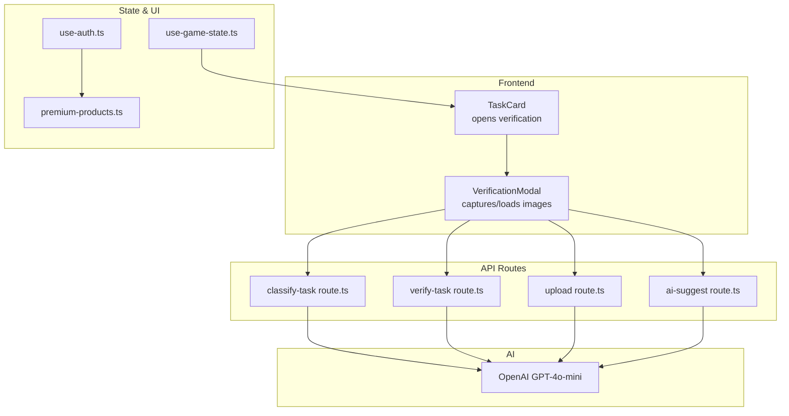
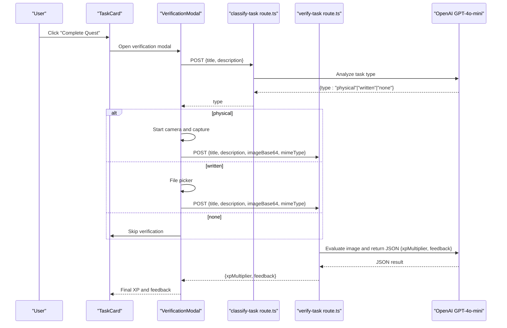
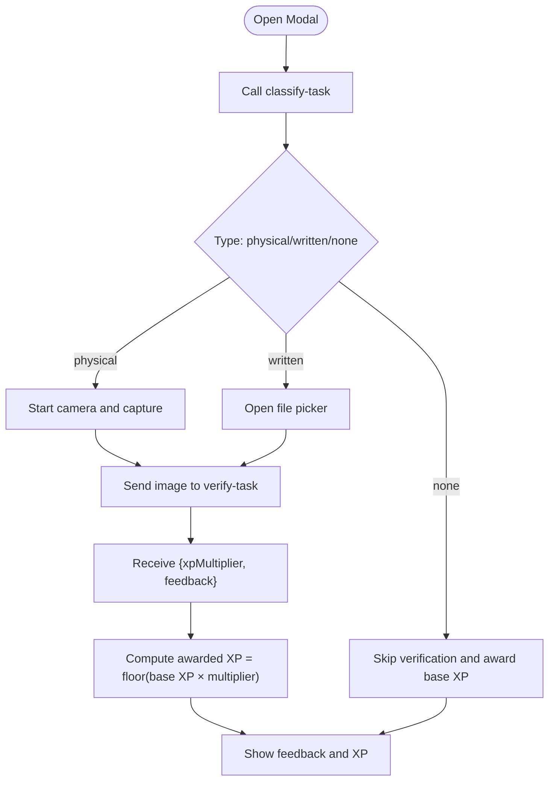
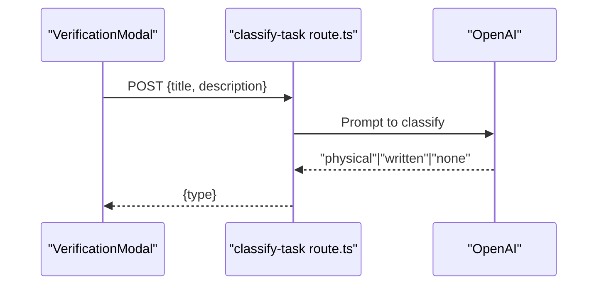
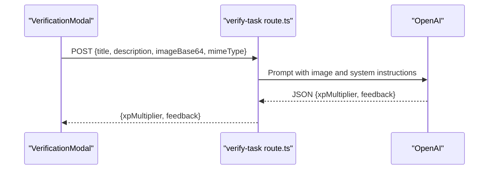
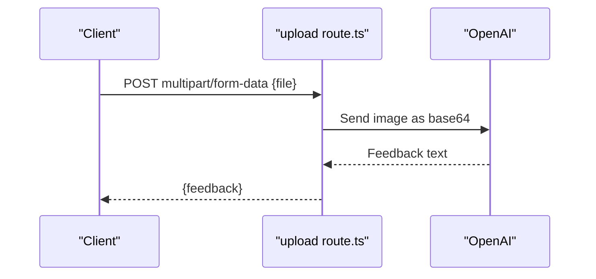
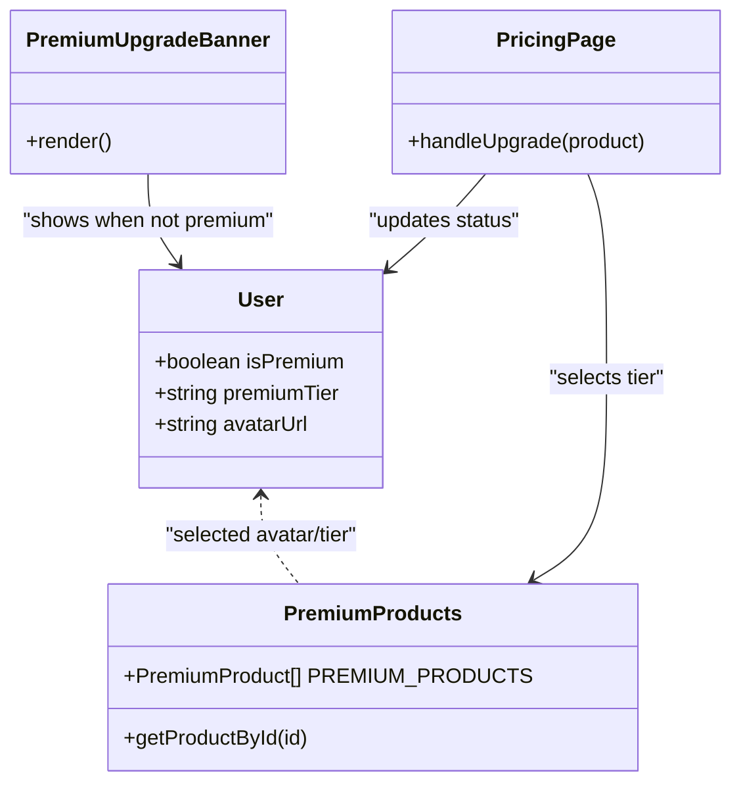
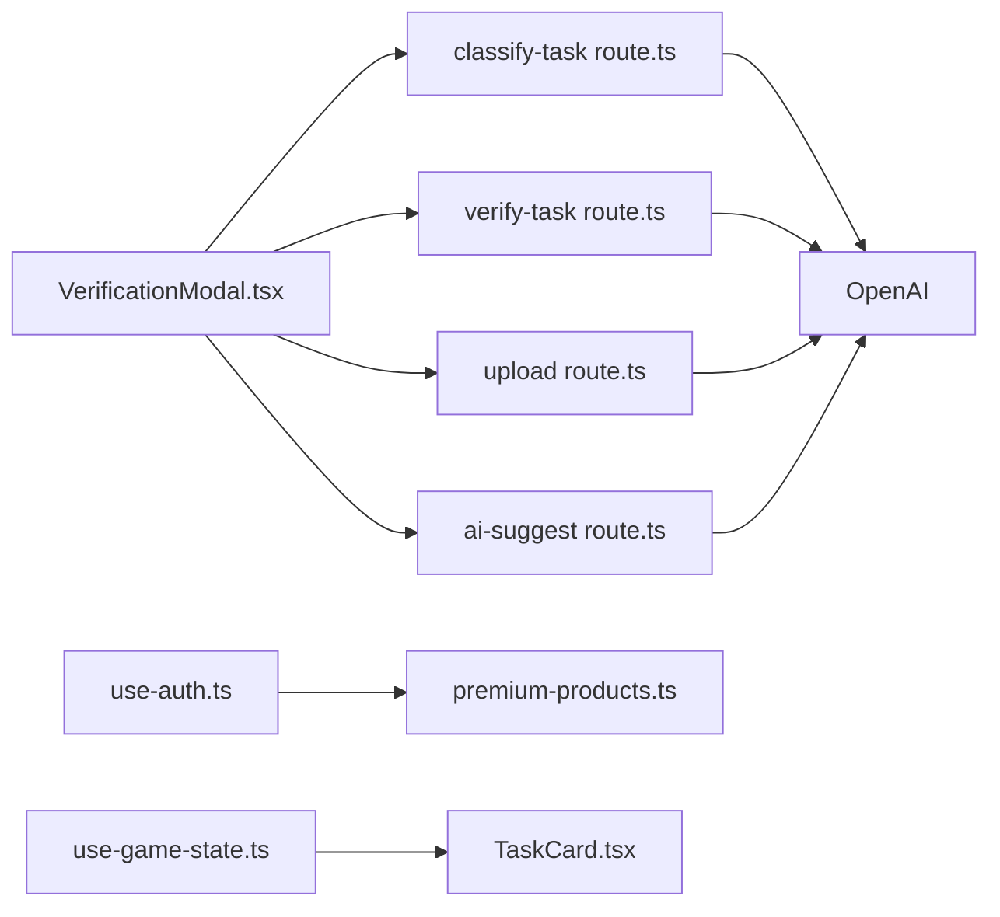

# Image Analysis

<cite>
**Referenced Files in This Document**
- [route.ts](file://app/api/upload/route.ts)
- [route.ts](file://app/api/verify-task/route.ts)
- [route.ts](file://app/api/classify-task/route.ts)
- [route.ts](file://app/api/ai-suggest/route.ts)
- [verification-modal.tsx](file://components/verification-modal.tsx)
- [task-card.tsx](file://components/task-card.tsx)
- [use-auth.ts](file://hooks/use-auth.ts)
- [premium-products.ts](file://lib/premium-products.ts)
- [premium-upgrade-banner.tsx](file://components/premium-upgrade-banner.tsx)
- [use-game-state.ts](file://hooks/use-game-state.ts)
- [game-constants.ts](file://lib/game-constants.ts)
- [page.tsx](file://app/pricing/page.tsx)
</cite>

## Table of Contents
1. [Introduction](#introduction)
2. [Project Structure](#project-structure)
3. [Core Components](#core-components)
4. [Architecture Overview](#architecture-overview)
5. [Detailed Component Analysis](#detailed-component-analysis)
6. [Dependency Analysis](#dependency-analysis)
7. [Performance Considerations](#performance-considerations)
8. [Troubleshooting Guide](#troubleshooting-guide)
9. [Conclusion](#conclusion)

## Introduction
This document explains the AI-powered image analysis and verification system. It covers:
- How images are uploaded and validated
- The AI-driven feedback pipeline for quest completion proofs
- The classification of tasks to determine whether proof requires a photo or a file upload
- The verification workflow that evaluates submitted images and computes XP rewards
- Premium gating for advanced features
- Request/response schemas for upload endpoints
- Practical examples and security/performance considerations

## Project Structure
The system is organized into:
- API routes for image upload, verification, classification, and AI suggestions
- Frontend components orchestrating the verification flow and integrating with the AI APIs
- Hooks and libraries managing user state, game mechanics, and premium features

**Diagram sources**
- [verification-modal.tsx:1-331](file://components/verification-modal.tsx#L1-L331)
- [task-card.tsx:1-186](file://components/task-card.tsx#L1-L186)
- [route.ts:1-43](file://app/api/classify-task/route.ts#L1-L43)
- [route.ts:1-55](file://app/api/verify-task/route.ts#L1-L55)
- [route.ts:1-43](file://app/api/upload/route.ts#L1-L43)
- [route.ts:1-34](file://app/api/ai-suggest/route.ts#L1-L34)
- [use-auth.ts:1-167](file://hooks/use-auth.ts#L1-L167)
- [use-game-state.ts:1-252](file://hooks/use-game-state.ts#L1-L252)
- [premium-products.ts:1-76](file://lib/premium-products.ts#L1-L76)

**Section sources**
- [verification-modal.tsx:1-331](file://components/verification-modal.tsx#L1-L331)
- [task-card.tsx:1-186](file://components/task-card.tsx#L1-L186)
- [route.ts:1-43](file://app/api/classify-task/route.ts#L1-L43)
- [route.ts:1-55](file://app/api/verify-task/route.ts#L1-L55)
- [route.ts:1-43](file://app/api/upload/route.ts#L1-L43)
- [route.ts:1-34](file://app/api/ai-suggest/route.ts#L1-L34)
- [use-auth.ts:1-167](file://hooks/use-auth.ts#L1-L167)
- [use-game-state.ts:1-252](file://hooks/use-game-state.ts#L1-L252)
- [premium-products.ts:1-76](file://lib/premium-products.ts#L1-L76)

## Core Components
- VerificationModal: Guides users through quest verification, classifies task type, captures or accepts images, and triggers AI evaluation.
- API routes:
  - classify-task: Determines if proof is physical (camera) or written (file upload).
  - verify-task: Evaluates submitted images and returns XP multiplier and feedback.
  - upload: Provides a feedback message for uploaded images (used in some flows).
  - ai-suggest: Generates gamified suggestions based on progress.
- State and premium:
  - use-auth: Manages user profile, premium status, and avatar selection.
  - use-game-state: Tracks tasks, XP, levels, and achievements.
  - premium-products: Defines premium tiers and features.

**Section sources**
- [verification-modal.tsx:1-331](file://components/verification-modal.tsx#L1-L331)
- [route.ts:1-43](file://app/api/classify-task/route.ts#L1-L43)
- [route.ts:1-55](file://app/api/verify-task/route.ts#L1-L55)
- [route.ts:1-43](file://app/api/upload/route.ts#L1-L43)
- [route.ts:1-34](file://app/api/ai-suggest/route.ts#L1-L34)
- [use-auth.ts:1-167](file://hooks/use-auth.ts#L1-L167)
- [use-game-state.ts:1-252](file://hooks/use-game-state.ts#L1-L252)
- [premium-products.ts:1-76](file://lib/premium-products.ts#L1-L76)

## Architecture Overview
The verification workflow integrates frontend UI, API routes, and OpenAI. The frontend decides the task type, collects evidence, and sends it to the backend. The backend uses OpenAI to classify or evaluate the evidence and returns results to the UI.

**Diagram sources**
- [task-card.tsx:1-186](file://components/task-card.tsx#L1-L186)
- [verification-modal.tsx:1-331](file://components/verification-modal.tsx#L1-L331)
- [route.ts:1-43](file://app/api/classify-task/route.ts#L1-L43)
- [route.ts:1-55](file://app/api/verify-task/route.ts#L1-L55)

## Detailed Component Analysis

### VerificationModal: Image-based Proof Submission and Evaluation
- Classifies tasks to decide between camera capture or file upload.
- Captures images via webcam or accepts file uploads.
- Sends images to verify-task for AI evaluation.
- Computes XP reward from base XP and returned multiplier.
- Displays feedback and XP summary.

**Diagram sources**
- [verification-modal.tsx:1-331](file://components/verification-modal.tsx#L1-L331)
- [route.ts:1-43](file://app/api/classify-task/route.ts#L1-L43)
- [route.ts:1-55](file://app/api/verify-task/route.ts#L1-L55)

**Section sources**
- [verification-modal.tsx:1-331](file://components/verification-modal.tsx#L1-L331)

### classify-task: Task Type Classification
- Accepts title and description.
- Uses OpenAI to classify as "written", "physical", or "none".
- Returns the determined type to the frontend.

**Diagram sources**
- [route.ts:1-43](file://app/api/classify-task/route.ts#L1-L43)

**Section sources**
- [route.ts:1-43](file://app/api/classify-task/route.ts#L1-L43)

### verify-task: Image Evaluation and XP Calculation
- Accepts title, description, base64 image, and MIME type.
- Calls OpenAI with structured JSON response format.
- Parses returned JSON to extract xpMultiplier and feedback.
- Returns computed XP and feedback to the frontend.

**Diagram sources**
- [route.ts:1-55](file://app/api/verify-task/route.ts#L1-L55)

**Section sources**
- [route.ts:1-55](file://app/api/verify-task/route.ts#L1-L55)

### upload: Feedback from Uploaded Images
- Accepts multipart/form-data with a "file" field.
- Converts the file to base64 and sends it to OpenAI for feedback.
- Returns a concise feedback message.

**Diagram sources**
- [route.ts:1-43](file://app/api/upload/route.ts#L1-L43)

**Section sources**
- [route.ts:1-43](file://app/api/upload/route.ts#L1-L43)

### Premium Gating and User Experience
- Premium users receive enhanced avatars and cosmetic options.
- The upgrade flow updates user premium status and avatar.
- PremiumUpgradeBanner encourages non-premium users to upgrade.

**Diagram sources**
- [use-auth.ts:1-167](file://hooks/use-auth.ts#L1-L167)
- [premium-products.ts:1-76](file://lib/premium-products.ts#L1-L76)
- [premium-upgrade-banner.tsx:1-89](file://components/premium-upgrade-banner.tsx#L1-L89)
- [page.tsx:1-176](file://app/pricing/page.tsx#L1-L176)

**Section sources**
- [use-auth.ts:1-167](file://hooks/use-auth.ts#L1-L167)
- [premium-products.ts:1-76](file://lib/premium-products.ts#L1-L76)
- [premium-upgrade-banner.tsx:1-89](file://components/premium-upgrade-banner.tsx#L1-L89)
- [page.tsx:1-176](file://app/pricing/page.tsx#L1-L176)

### Request/Response Schemas

- classify-task
  - Method: POST
  - Content-Type: application/json
  - Request body: { title: string, description: string|null }
  - Response: { type: "physical"|"written"|"none" }

- verify-task
  - Method: POST
  - Content-Type: application/json
  - Request body: { title: string, description: string|null, imageBase64: string, mimeType: string }
  - Response: { xpMultiplier: number, feedback: string }

- upload
  - Method: POST
  - Content-Type: multipart/form-data
  - Form fields: file: File
  - Response: { feedback: string }

Notes:
- The upload endpoint converts the file to base64 and sends it to OpenAI.
- The verify-task endpoint expects base64 and MIME type; the frontend extracts these from captured or selected images.

**Section sources**
- [route.ts:10-38](file://app/api/classify-task/route.ts#L10-L38)
- [route.ts:10-50](file://app/api/verify-task/route.ts#L10-L50)
- [route.ts:8-42](file://app/api/upload/route.ts#L8-L42)
- [verification-modal.tsx:99-140](file://components/verification-modal.tsx#L99-L140)

## Dependency Analysis
- Frontend depends on:
  - VerificationModal for UI and flow orchestration
  - use-auth for premium status and avatar
  - use-game-state for XP and level calculations
- Backend depends on:
  - OpenAI for classification and evaluation
- No circular dependencies observed among the analyzed files.

**Diagram sources**
- [verification-modal.tsx:1-331](file://components/verification-modal.tsx#L1-L331)
- [route.ts:1-43](file://app/api/classify-task/route.ts#L1-L43)
- [route.ts:1-55](file://app/api/verify-task/route.ts#L1-L55)
- [route.ts:1-43](file://app/api/upload/route.ts#L1-L43)
- [route.ts:1-34](file://app/api/ai-suggest/route.ts#L1-L34)
- [use-auth.ts:1-167](file://hooks/use-auth.ts#L1-L167)
- [premium-products.ts:1-76](file://lib/premium-products.ts#L1-L76)
- [use-game-state.ts:1-252](file://hooks/use-game-state.ts#L1-L252)
- [task-card.tsx:1-186](file://components/task-card.tsx#L1-L186)

**Section sources**
- [verification-modal.tsx:1-331](file://components/verification-modal.tsx#L1-L331)
- [route.ts:1-43](file://app/api/classify-task/route.ts#L1-L43)
- [route.ts:1-55](file://app/api/verify-task/route.ts#L1-L55)
- [route.ts:1-43](file://app/api/upload/route.ts#L1-L43)
- [route.ts:1-34](file://app/api/ai-suggest/route.ts#L1-L34)
- [use-auth.ts:1-167](file://hooks/use-auth.ts#L1-L167)
- [premium-products.ts:1-76](file://lib/premium-products.ts#L1-L76)
- [use-game-state.ts:1-252](file://hooks/use-game-state.ts#L1-L252)
- [task-card.tsx:1-186](file://components/task-card.tsx#L1-L186)

## Performance Considerations
- Image size and format:
  - The verification UI mentions PNG/JPG up to 10MB for file uploads.
  - Webcam capture produces JPEG images.
- Base64 overhead:
  - Converting images to base64 increases payload size by approximately 33%. Consider streaming or chunking for very large images.
- OpenAI latency:
  - API calls introduce network latency; cache results where appropriate and provide loading states.
- Client-side processing:
  - Validate MIME type and approximate size before conversion to reduce wasted bandwidth.
- Server-side limits:
  - Enforce maximum payload sizes at the API gateway or middleware to prevent abuse.

[No sources needed since this section provides general guidance]

## Troubleshooting Guide
Common issues and remedies:
- Missing file in upload:
  - Ensure multipart form includes the "file" field.
  - Verify browser supports FormData and the endpoint receives the file.
- Empty or invalid image:
  - Confirm the image is readable and MIME type matches the file content.
- OpenAI API key missing or invalid:
  - The routes check for a valid key; if missing, they fall back to mock responses.
- Camera access denied:
  - The modal falls back to file upload if camera permissions fail.
- Verification errors:
  - The modal handles failures gracefully and may still award base XP.

**Section sources**
- [route.ts:13-15](file://app/api/upload/route.ts#L13-L15)
- [route.ts:12-14](file://app/api/verify-task/route.ts#L12-L14)
- [route.ts:12-18](file://app/api/classify-task/route.ts#L12-L18)
- [verification-modal.tsx:73-77](file://components/verification-modal.tsx#L73-L77)
- [verification-modal.tsx:135-140](file://components/verification-modal.tsx#L135-L140)

## Conclusion
The system combines a user-friendly verification flow with AI-driven classification and evaluation to assess quest completion proofs. It supports both camera capture and file uploads, integrates with OpenAI for intelligent feedback, and leverages premium features to enhance the user experience. By following the request/response schemas and performance recommendations, teams can maintain a robust and scalable verification pipeline.