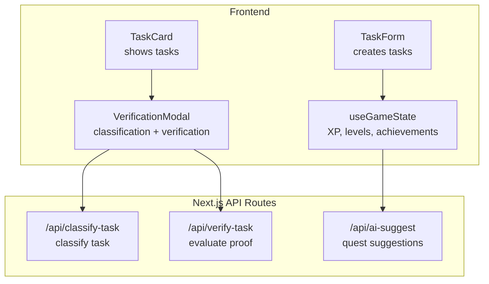
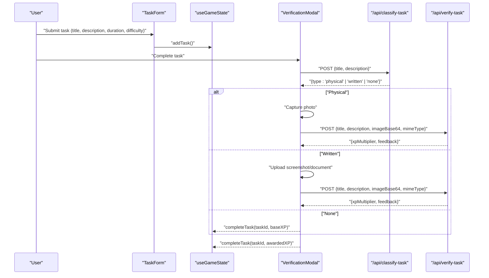
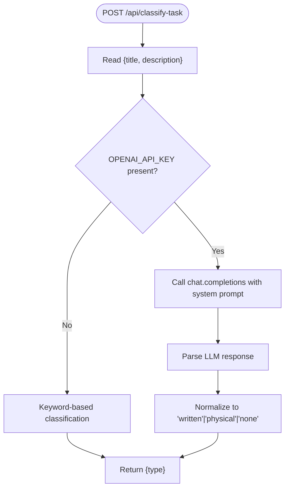
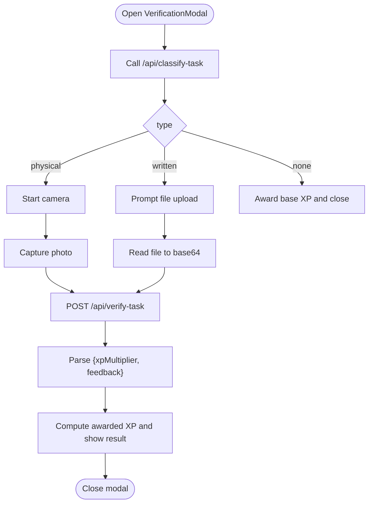
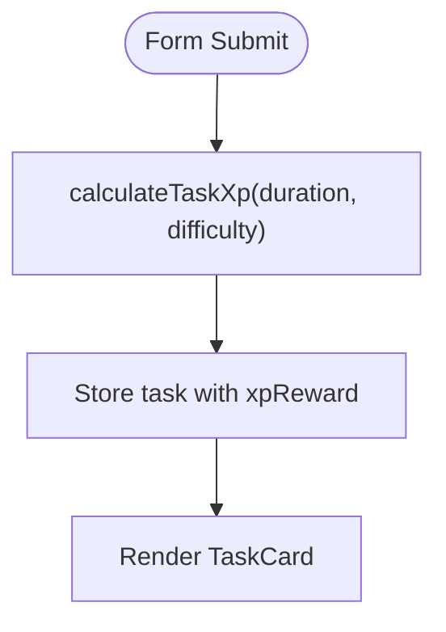
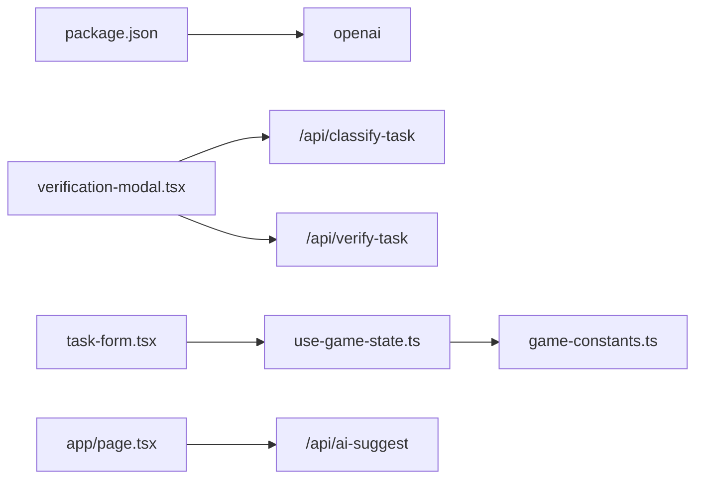

# Task Classification

<cite>
**Referenced Files in This Document**
- [route.ts](file://app/api/classify-task/route.ts)
- [route.ts](file://app/api/verify-task/route.ts)
- [route.ts](file://app/api/ai-suggest/route.ts)
- [verification-modal.tsx](file://components/verification-modal.tsx)
- [task-card.tsx](file://components/task-card.tsx)
- [task-form.tsx](file://components/task-form.tsx)
- [use-game-state.ts](file://hooks/use-game-state.ts)
- [game-constants.ts](file://lib/game-constants.ts)
- [page.tsx](file://app/page.tsx)
- [package.json](file://package.json)
</cite>

## Table of Contents
1. [Introduction](#introduction)
2. [Project Structure](#project-structure)
3. [Core Components](#core-components)
4. [Architecture Overview](#architecture-overview)
5. [Detailed Component Analysis](#detailed-component-analysis)
6. [Dependency Analysis](#dependency-analysis)
7. [Performance Considerations](#performance-considerations)
8. [Troubleshooting Guide](#troubleshooting-guide)
9. [Conclusion](#conclusion)
10. [Appendices](#appendices)

## Introduction
This document explains the automated task classification system that powers the AI-driven categorization of user tasks into predefined categories. It covers how tasks are classified, how the system integrates with the frontend workflow, how verification works for physical and written tasks, and how XP rewards are computed and integrated into the game’s progression system. It also documents request/response schemas, fallback mechanisms, and quality assurance measures.

## Project Structure
The task classification system spans frontend React components and Next.js API routes:
- Frontend: Task creation, verification flow, and game state management
- Backend APIs: Classification, verification, and AI suggestions
- Game constants and XP calculations

**Diagram sources**
- [task-form.tsx:18-51](file://components/task-form.tsx#L18-L51)
- [task-card.tsx:18-43](file://components/task-card.tsx#L18-L43)
- [verification-modal.tsx:39-140](file://components/verification-modal.tsx#L39-L140)
- [use-game-state.ts:127-210](file://hooks/use-game-state.ts#L127-L210)
- [route.ts:8-42](file://app/api/classify-task/route.ts#L8-L42)
- [route.ts:8-54](file://app/api/verify-task/route.ts#L8-L54)
- [route.ts:8-33](file://app/api/ai-suggest/route.ts#L8-L33)

**Section sources**
- [task-form.tsx:18-51](file://components/task-form.tsx#L18-L51)
- [task-card.tsx:18-43](file://components/task-card.tsx#L18-L43)
- [verification-modal.tsx:39-140](file://components/verification-modal.tsx#L39-L140)
- [use-game-state.ts:127-210](file://hooks/use-game-state.ts#L127-L210)
- [route.ts:8-42](file://app/api/classify-task/route.ts#L8-L42)
- [route.ts:8-54](file://app/api/verify-task/route.ts#L8-L54)
- [route.ts:8-33](file://app/api/ai-suggest/route.ts#L8-L33)

## Core Components
- Task creation form: Captures title, description, duration, and difficulty; computes XP reward.
- Verification modal: Auto-classifies tasks and guides users through proof submission for physical or written tasks; evaluates proof and computes XP multiplier.
- Classification API: Determines whether a task requires physical proof, written proof, or no proof.
- Verification API: Evaluates uploaded images against task criteria and returns an XP multiplier and feedback.
- AI suggestion API: Provides gamified quest suggestions based on player progress.
- Game state and XP system: Manages tasks, XP, levels, streaks, and achievements.

**Section sources**
- [task-form.tsx:18-51](file://components/task-form.tsx#L18-L51)
- [verification-modal.tsx:39-140](file://components/verification-modal.tsx#L39-L140)
- [route.ts:8-42](file://app/api/classify-task/route.ts#L8-L42)
- [route.ts:8-54](file://app/api/verify-task/route.ts#L8-L54)
- [route.ts:8-33](file://app/api/ai-suggest/route.ts#L8-L33)
- [use-game-state.ts:127-210](file://hooks/use-game-state.ts#L127-L210)
- [game-constants.ts:44-48](file://lib/game-constants.ts#L44-L48)

## Architecture Overview
The system orchestrates a classification and verification pipeline that influences XP rewards and player progression.

**Diagram sources**
- [task-form.tsx:25-51](file://components/task-form.tsx#L25-L51)
- [use-game-state.ts:127-141](file://hooks/use-game-state.ts#L127-L141)
- [verification-modal.tsx:39-140](file://components/verification-modal.tsx#L39-L140)
- [route.ts:8-42](file://app/api/classify-task/route.ts#L8-L42)
- [route.ts:8-54](file://app/api/verify-task/route.ts#L8-L54)

## Detailed Component Analysis

### Classification API
Responsibilities:
- Accepts task title and description
- Returns one of three categories: physical, written, or none
- Uses a mock fallback when the OpenAI API key is missing or placeholder

Behavior:
- If the environment lacks a valid API key, performs keyword-based classification
- Otherwise, queries the LLM with a strict system prompt and returns a cleaned result

**Diagram sources**
- [route.ts:8-42](file://app/api/classify-task/route.ts#L8-L42)

**Section sources**
- [route.ts:8-42](file://app/api/classify-task/route.ts#L8-L42)

### Verification Modal and Workflow
Responsibilities:
- Classify the task upon opening the modal
- For physical tasks: capture a photo via webcam
- For written tasks: upload an image
- For “none” tasks: bypass verification and award base XP
- Evaluate proof via the verification API and compute XP multiplier

**Diagram sources**
- [verification-modal.tsx:39-140](file://components/verification-modal.tsx#L39-L140)
- [route.ts:8-54](file://app/api/verify-task/route.ts#L8-L54)

**Section sources**
- [verification-modal.tsx:39-140](file://components/verification-modal.tsx#L39-L140)
- [route.ts:8-54](file://app/api/verify-task/route.ts#L8-L54)

### Verification API
Responsibilities:
- Accepts title, description, base64 image, and MIME type
- Evaluates the image against the task criteria using the LLM
- Returns an XP multiplier and feedback message

Behavior:
- Validates presence of image data
- Uses structured JSON response format when available
- Defaults to neutral multiplier on failure

**Section sources**
- [route.ts:8-54](file://app/api/verify-task/route.ts#L8-L54)

### Task Creation and XP Calculation
Responsibilities:
- Collects task metadata from the form
- Computes XP reward based on duration and difficulty multiplier
- Stores task in local state and persists to storage

**Diagram sources**
- [task-form.tsx:25-51](file://components/task-form.tsx#L25-L51)
- [use-game-state.ts:127-141](file://hooks/use-game-state.ts#L127-L141)
- [game-constants.ts:44-48](file://lib/game-constants.ts#L44-L48)

**Section sources**
- [task-form.tsx:25-51](file://components/task-form.tsx#L25-L51)
- [use-game-state.ts:127-141](file://hooks/use-game-state.ts#L127-L141)
- [game-constants.ts:44-48](file://lib/game-constants.ts#L44-L48)

### AI Suggestions Integration
Responsibilities:
- Sends current progress (level, completed tasks, active titles) to the AI
- Displays a gamified suggestion to the user

**Section sources**
- [page.tsx:40-73](file://app/page.tsx#L40-L73)
- [route.ts:8-33](file://app/api/ai-suggest/route.ts#L8-L33)

## Dependency Analysis
External dependencies relevant to classification and verification:
- OpenAI SDK for LLM interactions
- React and Next.js for frontend/backend routing
- Local storage for persistent game state

**Diagram sources**
- [package.json:53](file://package.json#L53)
- [verification-modal.tsx:39-140](file://components/verification-modal.tsx#L39-L140)
- [route.ts:8-42](file://app/api/classify-task/route.ts#L8-L42)
- [route.ts:8-54](file://app/api/verify-task/route.ts#L8-L54)
- [use-game-state.ts:127-210](file://hooks/use-game-state.ts#L127-L210)
- [game-constants.ts:44-48](file://lib/game-constants.ts#L44-L48)
- [task-form.tsx:25-51](file://components/task-form.tsx#L25-L51)
- [page.tsx:40-73](file://app/page.tsx#L40-L73)
- [route.ts:8-33](file://app/api/ai-suggest/route.ts#L8-L33)

**Section sources**
- [package.json:53](file://package.json#L53)
- [verification-modal.tsx:39-140](file://components/verification-modal.tsx#L39-L140)
- [route.ts:8-42](file://app/api/classify-task/route.ts#L8-L42)
- [route.ts:8-54](file://app/api/verify-task/route.ts#L8-L54)
- [use-game-state.ts:127-210](file://hooks/use-game-state.ts#L127-L210)
- [game-constants.ts:44-48](file://lib/game-constants.ts#L44-L48)
- [task-form.tsx:25-51](file://components/task-form.tsx#L25-L51)
- [page.tsx:40-73](file://app/page.tsx#L40-L73)
- [route.ts:8-33](file://app/api/ai-suggest/route.ts#L8-L33)

## Performance Considerations
- LLM calls: Each classification and verification call incurs latency and cost. Consider caching frequent tasks or batching requests where feasible.
- Image processing: Base64 conversion and uploads can be large; compress images when possible and validate MIME types early.
- Frontend responsiveness: Debounce or memoize repeated calls during user input to avoid redundant API calls.
- Local persistence: Game state is persisted to storage; ensure minimal writes and avoid blocking UI updates.

[No sources needed since this section provides general guidance]

## Troubleshooting Guide
Common issues and fallbacks:
- Missing or invalid API key:
  - Classification falls back to keyword-based matching
  - Verification returns a neutral multiplier and feedback
- Camera access denied:
  - Verification modal switches to file upload fallback
- Network errors:
  - Verification modal falls back to awarding base XP and closes
- LLM response parsing errors:
  - Verification defaults to neutral multiplier and logs an error

Operational checks:
- Confirm OPENAI_API_KEY is set and not the placeholder value
- Verify CORS and network connectivity for API routes
- Ensure image uploads meet size and type constraints

**Section sources**
- [route.ts:12-18](file://app/api/classify-task/route.ts#L12-L18)
- [route.ts:16-22](file://app/api/verify-task/route.ts#L16-L22)
- [verification-modal.tsx:67-77](file://components/verification-modal.tsx#L67-L77)
- [verification-modal.tsx:135-139](file://components/verification-modal.tsx#L135-L139)

## Conclusion
The task classification system automates categorization of user tasks and integrates seamlessly with the verification workflow to compute XP rewards. It balances AI-driven decisions with robust fallbacks to maintain reliability and user experience. The XP and progression systems further reinforce engagement by tying task outcomes to measurable rewards.

[No sources needed since this section summarizes without analyzing specific files]

## Appendices

### Request/Response Schemas

- POST /api/classify-task
  - Request: { title: string, description: string | null }
  - Response: { type: "physical" | "written" | "none" }

- POST /api/verify-task
  - Request: { title: string, description: string | null, imageBase64: string, mimeType: string }
  - Response: { xpMultiplier: number, feedback: string }

- POST /api/ai-suggest
  - Request: { progress: { level: number, completed: number, active: string[] } }
  - Response: { suggestion: string }

**Section sources**
- [route.ts:8-42](file://app/api/classify-task/route.ts#L8-L42)
- [route.ts:8-54](file://app/api/verify-task/route.ts#L8-L54)
- [route.ts:8-33](file://app/api/ai-suggest/route.ts#L8-L33)

### Category Definitions and Confidence Mechanisms
- Categories:
  - physical: Requires a photo of a physical action
  - written: Requires a screenshot/document as proof
  - none: Digital task with no clear visual proof
- Confidence:
  - LLM response is constrained to a strict vocabulary and capped tokens
  - Fallback uses keyword matching for quick decisions when API is unavailable

**Section sources**
- [route.ts:23-25](file://app/api/classify-task/route.ts#L23-L25)
- [route.ts:12-18](file://app/api/classify-task/route.ts#L12-L18)

### Frontend Integration Details
- TaskForm submits tasks to useGameState, which computes XP and stores the task
- TaskCard triggers VerificationModal on completion
- VerificationModal orchestrates classification and verification, then calls useGameState.completeTask with awarded XP

**Section sources**
- [task-form.tsx:25-51](file://components/task-form.tsx#L25-L51)
- [task-card.tsx:25-36](file://components/task-card.tsx#L25-L36)
- [verification-modal.tsx:39-140](file://components/verification-modal.tsx#L39-L140)
- [use-game-state.ts:143-210](file://hooks/use-game-state.ts#L143-L210)

### XP Reward System and Categories
- Base XP calculation: durationMinutes × difficulty multiplier
- Levels and XP thresholds follow exponential growth
- Achievements unlock based on milestones and S-rank tasks

**Section sources**
- [game-constants.ts:44-48](file://lib/game-constants.ts#L44-L48)
- [use-game-state.ts:152-210](file://hooks/use-game-state.ts#L152-L210)