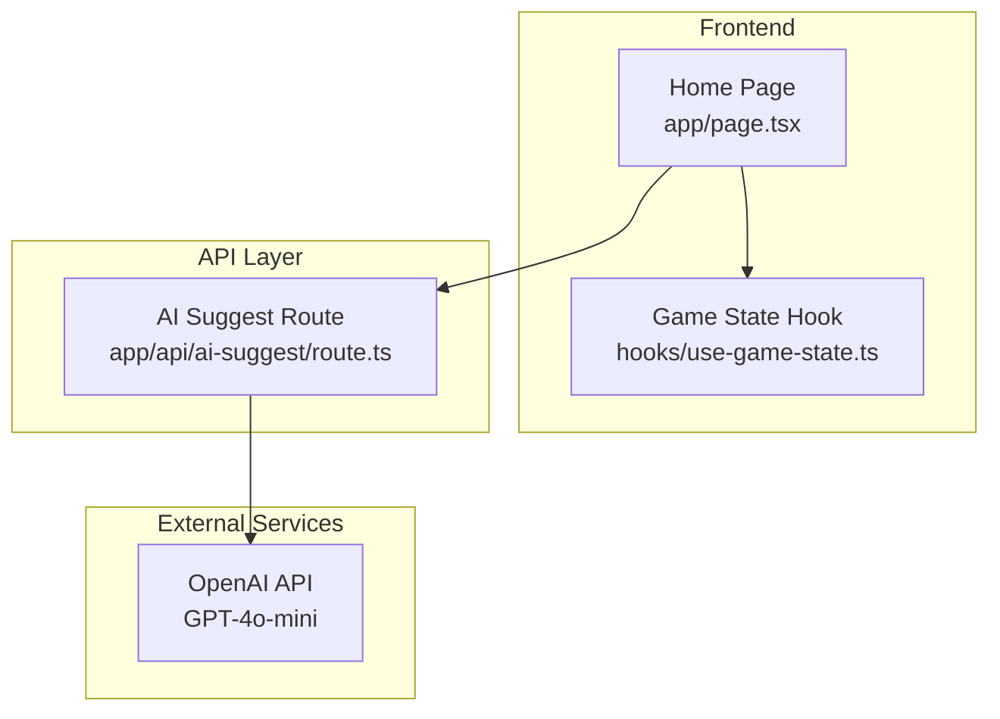
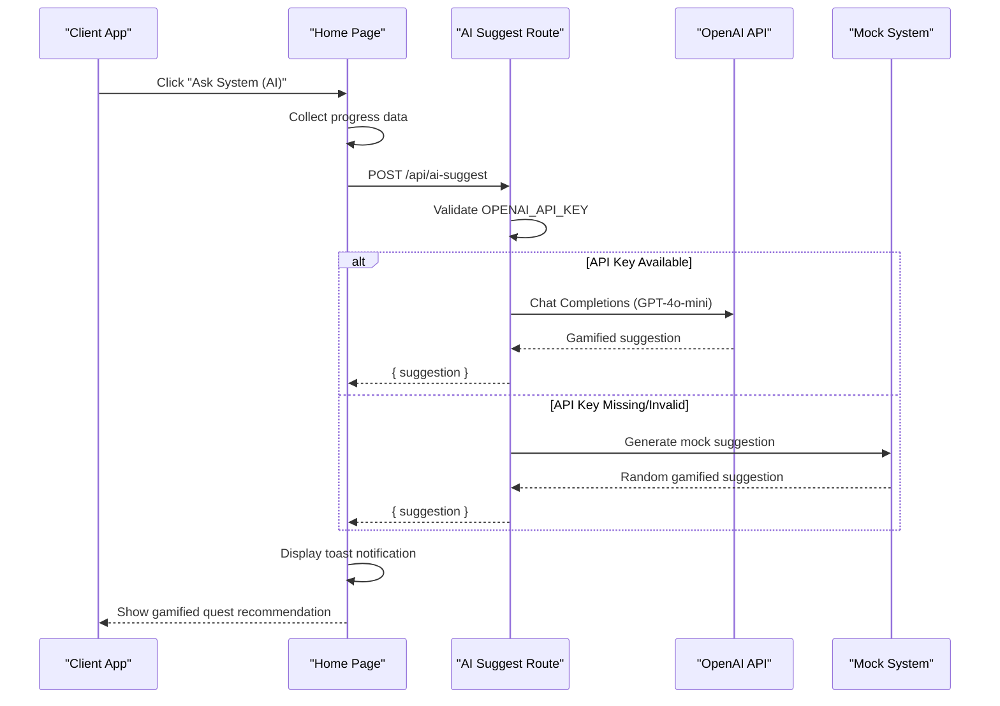
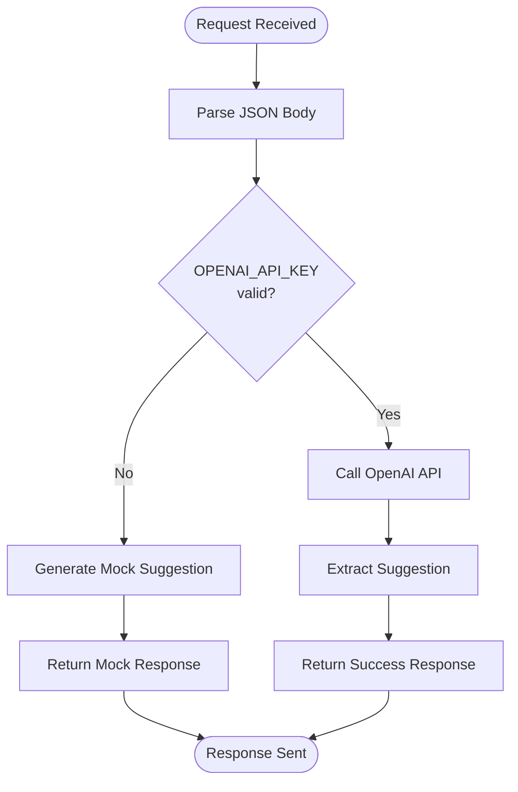
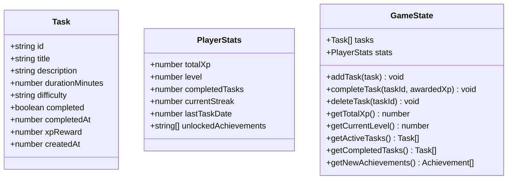
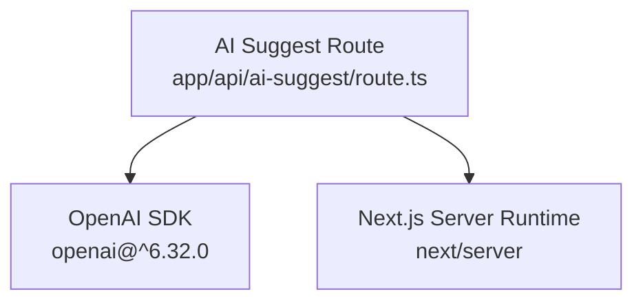

# AI Suggestion API

<cite>
**Referenced Files in This Document**
- [route.ts](file://app/api/ai-suggest/route.ts)
- [page.tsx](file://app/page.tsx)
- [use-game-state.ts](file://hooks/use-game-state.ts)
- [game-constants.ts](file://lib/game-constants.ts)
- [verify-task/route.ts](file://app/api/verify-task/route.ts)
- [classify-task/route.ts](file://app/api/classify-task/route.ts)
- [package.json](file://package.json)
</cite>

## Table of Contents
1. [Introduction](#introduction)
2. [Project Structure](#project-structure)
3. [Core Components](#core-components)
4. [Architecture Overview](#architecture-overview)
5. [Detailed Component Analysis](#detailed-component-analysis)
6. [Dependency Analysis](#dependency-analysis)
7. [Performance Considerations](#performance-considerations)
8. [Troubleshooting Guide](#troubleshooting-guide)
9. [Conclusion](#conclusion)

## Introduction
This document provides comprehensive API documentation for the AI task suggestion endpoint. It covers the POST /api/ai-suggest endpoint, including request/response schemas, authentication requirements, OpenAI integration, and the gamified suggestion algorithm. The endpoint generates context-aware quest recommendations based on user progress and presents them in a gamified format inspired by the Solo Leveling universe.

## Project Structure
The AI suggestion functionality is implemented as a Next.js App Router API route located under app/api/ai-suggest/route.ts. The frontend integration resides in app/page.tsx, which collects user progress data and triggers the API call. Supporting game state and constants are defined in hooks/use-game-state.ts and lib/game-constants.ts respectively.

**Diagram sources**
- [route.ts:1-34](file://app/api/ai-suggest/route.ts#L1-L34)
- [page.tsx:40-73](file://app/page.tsx#L40-L73)
- [use-game-state.ts:1-252](file://hooks/use-game-state.ts#L1-L252)

**Section sources**
- [route.ts:1-34](file://app/api/ai-suggest/route.ts#L1-L34)
- [page.tsx:1-384](file://app/page.tsx#L1-L384)

## Core Components
The AI suggestion endpoint consists of:
- API route handler that validates OpenAI credentials and processes requests
- Frontend integration that collects progress data and displays responses
- Mock fallback system for offline scenarios
- Gamified suggestion generation using GPT-4o-mini

Key implementation details:
- Request payload includes user progress metrics (level, completed tasks, active task titles)
- Response returns a gamified suggestion string
- Automatic fallback to mock suggestions when API key is missing or invalid
- Error handling with structured JSON responses

**Section sources**
- [route.ts:8-33](file://app/api/ai-suggest/route.ts#L8-L33)
- [page.tsx:40-73](file://app/page.tsx#L40-L73)

## Architecture Overview
The AI suggestion workflow follows a client-server architecture with OpenAI integration:

**Diagram sources**
- [route.ts:8-33](file://app/api/ai-suggest/route.ts#L8-L33)
- [page.tsx:40-73](file://app/page.tsx#L40-L73)

## Detailed Component Analysis

### API Endpoint Definition
The AI suggestion endpoint is implemented as a Next.js API route with the following characteristics:

**Endpoint**: POST /api/ai-suggest
**Request Schema**:
- progress: object (required)
  - level: number (required)
  - completed: number (required)
  - active: string[] (required)

**Response Schema**:
- suggestion: string (required)

**Authentication**: No authentication required for this endpoint
**Rate Limiting**: Not implemented in the current codebase

**Section sources**
- [route.ts:8-33](file://app/api/ai-suggest/route.ts#L8-L33)

### Request Processing Logic
The API route handles requests through a structured flow:

**Diagram sources**
- [route.ts:8-33](file://app/api/ai-suggest/route.ts#L8-L33)

**Section sources**
- [route.ts:8-33](file://app/api/ai-suggest/route.ts#L8-L33)

### Frontend Integration
The frontend integrates with the AI suggestion endpoint through the Home page component:

**Progress Collection**:
- Current player level from game state
- Total completed tasks count
- Active task titles for context awareness

**User Experience**:
- Disabled button during API call
- Loading state with visual feedback
- Success/error toast notifications
- Gamified suggestion presentation

**Section sources**
- [page.tsx:40-73](file://app/page.tsx#L40-L73)
- [use-game-state.ts:27-34](file://hooks/use-game-state.ts#L27-L34)

### Mock System Implementation
When the OpenAI API key is missing or set to the placeholder value, the system provides mock suggestions:

**Mock Suggestions**:
- Physical challenges (exercise-based)
- Learning activities (reading/studying)
- Productivity tasks (organizing/decluttering)

**Behavior**:
- Randomly selects from predefined mock suggestions
- Prefixes suggestions with "[MOCK SYSTEM]"
- Provides immediate feedback without external API calls

**Section sources**
- [route.ts:12-20](file://app/api/ai-suggest/route.ts#L12-L20)

### OpenAI Integration Details
The endpoint uses the OpenAI SDK with GPT-4o-mini model:

**Model Configuration**:
- Model: gpt-4o-mini
- Message format: Single user message containing progress context
- Response format: Plain text suggestion

**Context Awareness**:
- Incorporates user level, completed task count, and active task titles
- Generates gamified suggestions in Solo Leveling style
- Maintains brevity and punchiness for mobile UX

**Section sources**
- [route.ts:22-27](file://app/api/ai-suggest/route.ts#L22-L27)

### Data Models and Types

#### Game State Types
The frontend maintains comprehensive game state with the following structure:

**Diagram sources**
- [use-game-state.ts:15-47](file://hooks/use-game-state.ts#L15-L47)

**Section sources**
- [use-game-state.ts:15-47](file://hooks/use-game-state.ts#L15-L47)

### Related AI Features
The codebase includes complementary AI-powered features that demonstrate consistent patterns:

**Task Classification Endpoint**:
- Purpose: Automatically categorize tasks as physical or written
- Implementation: Uses mock fallback for development
- Response: Simple JSON with task type classification

**Task Verification Endpoint**:
- Purpose: Evaluate proof of task completion images
- Implementation: Uses structured JSON response format
- Response: Includes XP multiplier and feedback message

**Section sources**
- [classify-task/route.ts:1-18](file://app/api/classify-task/route.ts#L1-L18)
- [verify-task/route.ts:8-54](file://app/api/verify-task/route.ts#L8-L54)

## Dependency Analysis
The AI suggestion endpoint has minimal external dependencies:

**Diagram sources**
- [route.ts:1-2](file://app/api/ai-suggest/route.ts#L1-L2)
- [package.json:53-53](file://package.json#L53-L53)

**Section sources**
- [route.ts:1-2](file://app/api/ai-suggest/route.ts#L1-L2)
- [package.json:53-53](file://package.json#L53-L53)

## Performance Considerations
Current implementation characteristics:
- **Latency**: Depends on OpenAI API response time (typically 1-3 seconds)
- **Throughput**: Limited by external API rate limits and network conditions
- **Memory**: Minimal memory footprint with small request/response payloads
- **Scalability**: Single-threaded API route with no caching layer

Recommended optimizations:
- Implement request/response caching for repeated suggestions
- Add circuit breaker pattern for API failures
- Introduce exponential backoff for retry logic
- Consider local fallback models for offline scenarios

## Troubleshooting Guide

### Common Issues and Solutions

**API Key Configuration Problems**:
- Symptom: Mock suggestions appear despite valid API key
- Cause: Environment variable not properly loaded
- Solution: Verify OPENAI_API_KEY is set in environment and redeploy

**Network Connectivity Issues**:
- Symptom: 500 errors from API endpoint
- Cause: OpenAI API unavailability or timeout
- Solution: Implement retry logic and graceful degradation

**Rate Limiting**:
- Symptom: API calls fail with rate limit errors
- Cause: Exceeding OpenAI API limits
- Solution: Implement client-side throttling and exponential backoff

**Response Parsing Errors**:
- Symptom: Frontend shows generic error messages
- Cause: Malformed API responses
- Solution: Validate response structure and handle edge cases

**Section sources**
- [route.ts:30-32](file://app/api/ai-suggest/route.ts#L30-L32)
- [page.tsx:67-72](file://app/page.tsx#L67-L72)

### Error Handling Patterns
The endpoint implements structured error handling:
- Try-catch blocks around OpenAI API calls
- JSON error responses with descriptive messages
- Status code 500 for server-side failures
- Graceful fallback to mock system when API key is invalid

**Section sources**
- [route.ts:30-32](file://app/api/ai-suggest/route.ts#L30-L32)

## Conclusion
The AI task suggestion endpoint provides a robust foundation for gamified task recommendations. Its integration with the Solo Leveling universe creates an engaging user experience while maintaining flexibility for future enhancements. The current implementation demonstrates strong separation of concerns between frontend UX and backend AI processing, with clear fallback mechanisms for offline scenarios.

Future improvements should focus on implementing rate limiting, caching strategies, and enhanced error handling to support production deployment requirements.