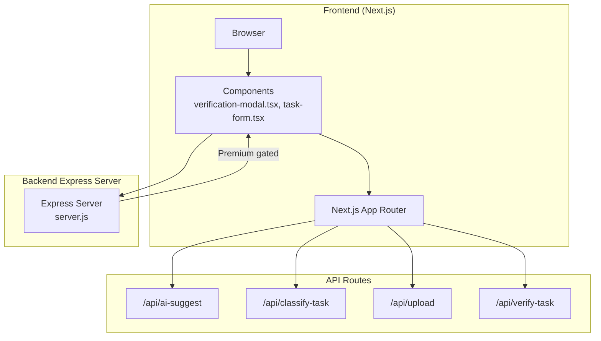
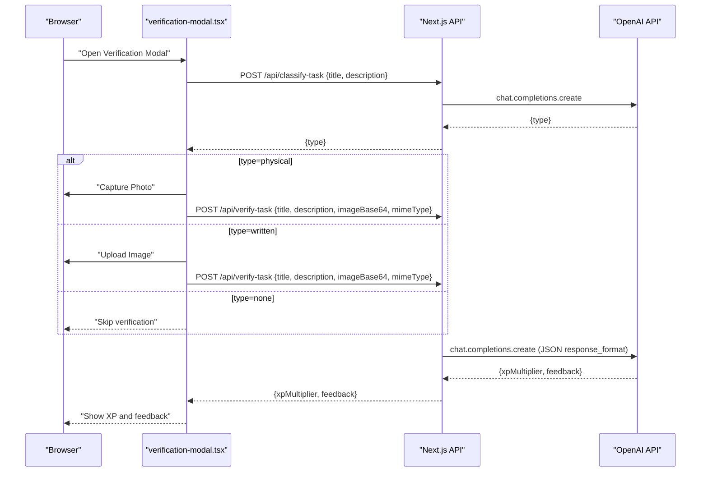
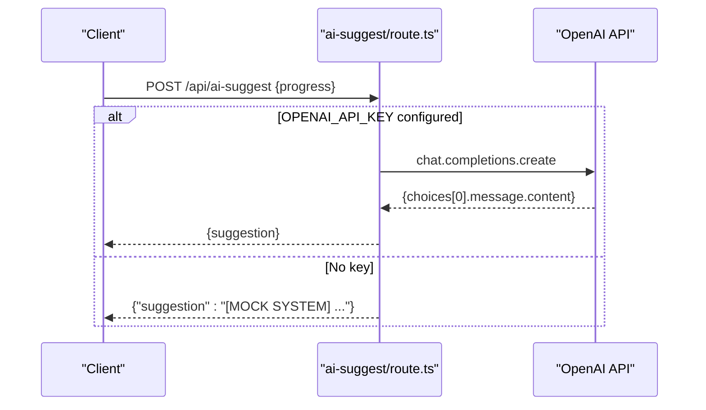
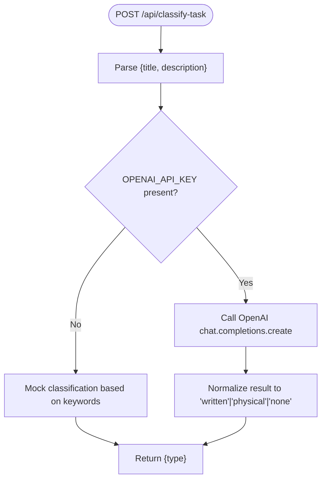
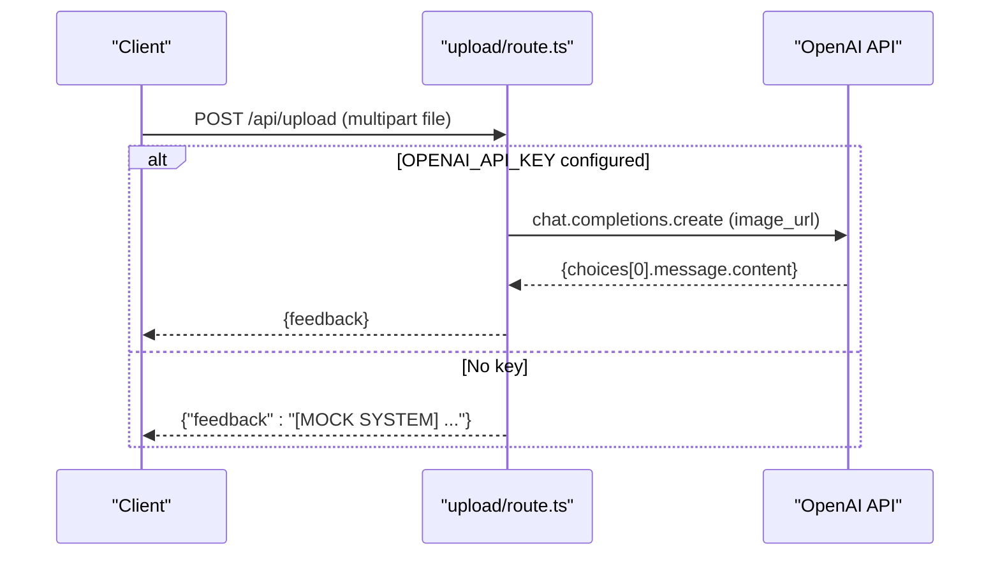
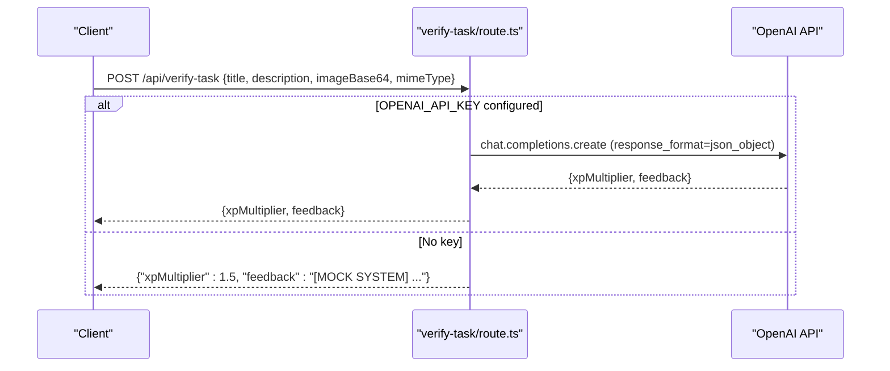
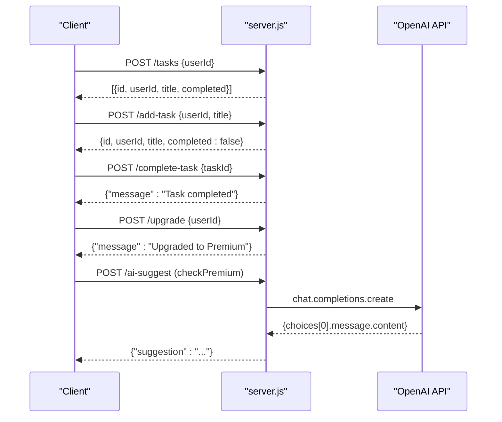
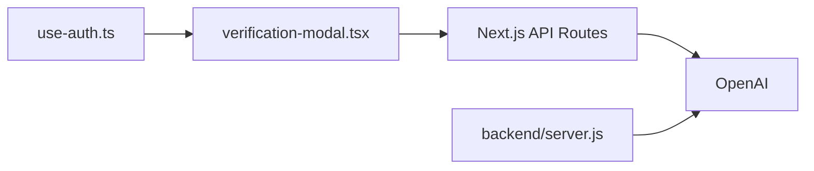

# API Reference

<cite>
**Referenced Files in This Document**
- [route.ts](file://app/api/ai-suggest/route.ts)
- [route.ts](file://app/api/classify-task/route.ts)
- [route.ts](file://app/api/upload/route.ts)
- [route.ts](file://app/api/verify-task/route.ts)
- [server.js](file://backend/server.js)
- [use-auth.ts](file://hooks/use-auth.ts)
- [verification-modal.tsx](file://components/verification-modal.tsx)
- [task-form.tsx](file://components/task-form.tsx)
- [layout.tsx](file://app/layout.tsx)
- [package.json](file://package.json)
</cite>

## Table of Contents
1. [Introduction](#introduction)
2. [Project Structure](#project-structure)
3. [Core Components](#core-components)
4. [Architecture Overview](#architecture-overview)
5. [Detailed Component Analysis](#detailed-component-analysis)
6. [Dependency Analysis](#dependency-analysis)
7. [Performance Considerations](#performance-considerations)
8. [Troubleshooting Guide](#troubleshooting-guide)
9. [Conclusion](#conclusion)
10. [Appendices](#appendices)

## Introduction
This document provides comprehensive API documentation for the gamified task management system. It covers:
- Public Next.js App Router endpoints for AI suggestions, task classification, file uploads, and task verification
- Backend Express server endpoints for task management and premium features
- Authentication and premium gating mechanisms
- Security, CORS, rate limiting, and error handling patterns
- Practical usage examples and integration guidance

## Project Structure
The API surface is split between:
- Next.js App Router API routes under app/api/*
- A legacy Express server under backend/server.js

**Diagram sources**
- [route.ts](file://app/api/ai-suggest/route.ts)
- [route.ts](file://app/api/classify-task/route.ts)
- [route.ts](file://app/api/upload/route.ts)
- [route.ts](file://app/api/verify-task/route.ts)
- [server.js](file://backend/server.js)

**Section sources**
- [route.ts](file://app/api/ai-suggest/route.ts)
- [route.ts](file://app/api/classify-task/route.ts)
- [route.ts](file://app/api/upload/route.ts)
- [route.ts](file://app/api/verify-task/route.ts)
- [server.js](file://backend/server.js)

## Core Components
- AI Suggestion API: Generates gamified quest suggestions based on user progress.
- Task Classification API: Determines whether a task requires physical or written proof.
- File Upload API: Accepts image uploads and returns AI feedback.
- Task Verification API: Evaluates uploaded proof and returns XP multiplier and feedback.
- Backend Express Server: Provides task CRUD and premium features (AI suggestion and upload).

**Section sources**
- [route.ts](file://app/api/ai-suggest/route.ts)
- [route.ts](file://app/api/classify-task/route.ts)
- [route.ts](file://app/api/upload/route.ts)
- [route.ts](file://app/api/verify-task/route.ts)
- [server.js](file://backend/server.js)

## Architecture Overview
The frontend interacts with Next.js API routes for AI-driven features and with the Express server for task management and premium capabilities. Authentication and premium status are managed client-side via a local hook.

**Diagram sources**
- [verification-modal.tsx](file://components/verification-modal.tsx)
- [route.ts](file://app/api/classify-task/route.ts)
- [route.ts](file://app/api/verify-task/route.ts)

## Detailed Component Analysis

### AI Suggestion API
- Method: POST
- URL: /api/ai-suggest
- Purpose: Generate gamified quest suggestions based on user progress.
- Request body:
  - progress: object (arbitrary structure representing user progress)
- Response:
  - suggestion: string (AI-generated suggestion)
- Authentication:
  - Uses OPENAI_API_KEY from environment
  - Mock fallback when key is missing or default placeholder
- Error handling:
  - Returns 500 with error message on failure

**Diagram sources**
- [route.ts](file://app/api/ai-suggest/route.ts)

**Section sources**
- [route.ts](file://app/api/ai-suggest/route.ts)

### Task Classification API
- Method: POST
- URL: /api/classify-task
- Purpose: Classify a task into "written", "physical", or "none".
- Request body:
  - title: string
  - description: string (optional)
- Response:
  - type: "written" | "physical" | "none"
- Authentication:
  - Uses OPENAI_API_KEY from environment
  - Mock fallback when key is missing or default placeholder
- Notes:
  - Uses a strict system prompt to enforce concise answers

**Diagram sources**
- [route.ts](file://app/api/classify-task/route.ts)

**Section sources**
- [route.ts](file://app/api/classify-task/route.ts)

### File Upload API (Client-side)
- Method: POST
- URL: /api/upload
- Purpose: Accepts an image file and returns AI feedback.
- Request:
  - multipart/form-data with field "file"
- Response:
  - feedback: string (AI feedback)
- Authentication:
  - Uses OPENAI_API_KEY from environment
  - Mock fallback when key is missing or default placeholder
- Notes:
  - Converts file to base64 and sends as data URL to OpenAI

**Diagram sources**
- [route.ts](file://app/api/upload/route.ts)

**Section sources**
- [route.ts](file://app/api/upload/route.ts)

### Task Verification API
- Method: POST
- URL: /api/verify-task
- Purpose: Evaluate proof of quest completion and compute XP multiplier.
- Request body:
  - title: string
  - description: string (optional)
  - imageBase64: string (base64 data URL part)
  - mimeType: string (original MIME type)
- Response:
  - xpMultiplier: number (0.0 to 2.0)
  - feedback: string
- Authentication:
  - Uses OPENAI_API_KEY from environment
  - Mock fallback when key is missing or default placeholder
- Notes:
  - Enforces JSON response format from OpenAI
  - Validates numeric XP multiplier and defaults to 1.0 if invalid

**Diagram sources**
- [route.ts](file://app/api/verify-task/route.ts)

**Section sources**
- [route.ts](file://app/api/verify-task/route.ts)

### Backend Express Server Endpoints
- Base URL: http://localhost:3000
- Middleware:
  - CORS enabled globally
  - JSON body parsing
  - checkPremium middleware restricts access to premium users
- Endpoints:
  - POST /tasks: Returns pending tasks for a user ID
  - POST /add-task: Adds a new task for a user ID
  - POST /complete-task: Marks a task as completed
  - POST /ai-suggest (premium): AI suggestion based on progress
  - POST /upload (premium): Uploads an image and returns feedback
  - POST /upgrade: Upgrades a user to premium
- Premium gating:
  - checkPremium middleware validates user plan before allowing AI suggestion and upload

**Diagram sources**
- [server.js](file://backend/server.js)

**Section sources**
- [server.js](file://backend/server.js)

## Dependency Analysis
- Frontend components depend on Next.js API routes for AI features.
- Both Next.js routes and Express server depend on OpenAI for inference.
- Authentication and premium status are handled client-side via a local hook.

**Diagram sources**
- [verification-modal.tsx](file://components/verification-modal.tsx)
- [route.ts](file://app/api/verify-task/route.ts)
- [server.js](file://backend/server.js)
- [use-auth.ts](file://hooks/use-auth.ts)

**Section sources**
- [verification-modal.tsx](file://components/verification-modal.tsx)
- [route.ts](file://app/api/verify-task/route.ts)
- [server.js](file://backend/server.js)
- [use-auth.ts](file://hooks/use-auth.ts)

## Performance Considerations
- OpenAI calls are synchronous per request; consider adding retries and timeouts.
- Image uploads convert files to base64; large images increase payload size and latency.
- The Express server uses in-memory arrays for demo; persist tasks and users in production.
- Consider rate limiting at the gateway or middleware to protect OpenAI usage costs.

## Troubleshooting Guide
- Missing OPENAI_API_KEY:
  - Next.js routes fall back to mock responses.
  - Express routes for AI features will fail; ensure environment is configured.
- 400 errors:
  - Verify required fields in requests (e.g., file in /api/upload, imageBase64 in /api/verify-task).
- 500 errors:
  - Inspect returned error message; verify network connectivity and API key validity.
- Premium gating:
  - Ensure user plan is set to premium before calling premium endpoints (/ai-suggest, /upload on Express).

**Section sources**
- [route.ts](file://app/api/upload/route.ts)
- [route.ts](file://app/api/verify-task/route.ts)
- [server.js](file://backend/server.js)

## Conclusion
The system integrates Next.js API routes with OpenAI for intelligent task features and an Express server for task management and premium capabilities. Authentication and premium status are managed client-side, while server endpoints enforce premium gating. Robust error handling and fallbacks ensure graceful degradation when AI keys are unavailable.

## Appendices

### Authentication Methods
- Client-side authentication and premium status:
  - Local storage stores user profile and premium tier
  - Login simulates account creation and sets avatar and premium status
  - Premium upgrades update local state and UI feedback

**Section sources**
- [use-auth.ts](file://hooks/use-auth.ts)

### Rate Limiting and Security
- Rate limiting:
  - Not implemented in current code; consider adding at gateway or middleware.
- CORS:
  - Enabled globally in Express server.
- Security:
  - Store secrets in environment variables; avoid exposing API keys in client bundles.
  - Validate and sanitize all inputs on the server.

**Section sources**
- [server.js](file://backend/server.js)

### API Versioning, Backward Compatibility, Deprecation
- Current code does not define explicit API versioning.
- Recommendations:
  - Add version prefix to routes (e.g., /api/v1/...)
  - Maintain backward compatibility by supporting multiple versions during transitions.
  - Announce deprecations with timelines and migration guides.

[No sources needed since this section provides general guidance]

### Practical Examples and Integration Patterns
- Task verification flow:
  - Use /api/classify-task to determine proof type
  - For physical tasks, capture a photo and send to /api/verify-task
  - For written tasks, upload an image to /api/verify-task
  - Receive xpMultiplier and feedback to compute rewards

**Section sources**
- [verification-modal.tsx](file://components/verification-modal.tsx)
- [route.ts](file://app/api/classify-task/route.ts)
- [route.ts](file://app/api/verify-task/route.ts)

### Environment Variables and Configuration
- Required environment variables:
  - OPENAI_API_KEY for OpenAI integration
  - NEXT_PUBLIC_APP_URL and NEXT_PUBLIC_SITE_NAME for metadata and links
- Dependencies:
  - OpenAI SDK is used in Next.js routes
  - Express server uses cors and multer for uploads

**Section sources**
- [route.ts](file://app/api/ai-suggest/route.ts)
- [route.ts](file://app/api/classify-task/route.ts)
- [route.ts](file://app/api/upload/route.ts)
- [route.ts](file://app/api/verify-task/route.ts)
- [server.js](file://backend/server.js)
- [layout.tsx](file://app/layout.tsx)
- [package.json](file://package.json)