# Backend Server API

<cite>
**Referenced Files in This Document**
- [server.js](file://backend/server.js)
- [package.json](file://backend/package.json)
- [route.ts](file://app/api/ai-suggest/route.ts)
- [route.ts](file://app/api/classify-task/route.ts)
- [route.ts](file://app/api/upload/route.ts)
- [route.ts](file://app/api/verify-task/route.ts)
- [package.json](file://package.json)
- [premium-products.ts](file://lib/premium-products.ts)
- [premium-cosmetics.ts](file://lib/premium-cosmetics.ts)
- [use-auth.ts](file://hooks/use-auth.ts)
- [use-game-state.ts](file://hooks/use-game-state.ts)
- [game-constants.ts](file://lib/game-constants.ts)
- [page.tsx](file://app/pricing/page.tsx)
- [premium-upgrade-banner.tsx](file://components/premium-upgrade-banner.tsx)
</cite>

## Table of Contents
1. [Introduction](#introduction)
2. [Project Structure](#project-structure)
3. [Core Components](#core-components)
4. [Architecture Overview](#architecture-overview)
5. [Detailed Component Analysis](#detailed-component-analysis)
6. [Dependency Analysis](#dependency-analysis)
7. [Performance Considerations](#performance-considerations)
8. [Troubleshooting Guide](#troubleshooting-guide)
9. [Conclusion](#conclusion)
10. [Appendices](#appendices)

## Introduction
This document provides comprehensive API documentation for the Express.js backend server and the integrated Next.js API routes. It covers server configuration, middleware setup, endpoint definitions for premium features, and integration patterns with the frontend application. It also explains the simulated payment flow for upgrading to premium, user data management, and operational considerations such as environment configuration, CORS, and production deployment.

## Project Structure
The project is a monorepo-like structure with a dedicated backend server under the backend directory and Next.js API routes under app/api. Premium-related frontend assets and logic reside in lib, hooks, and components.

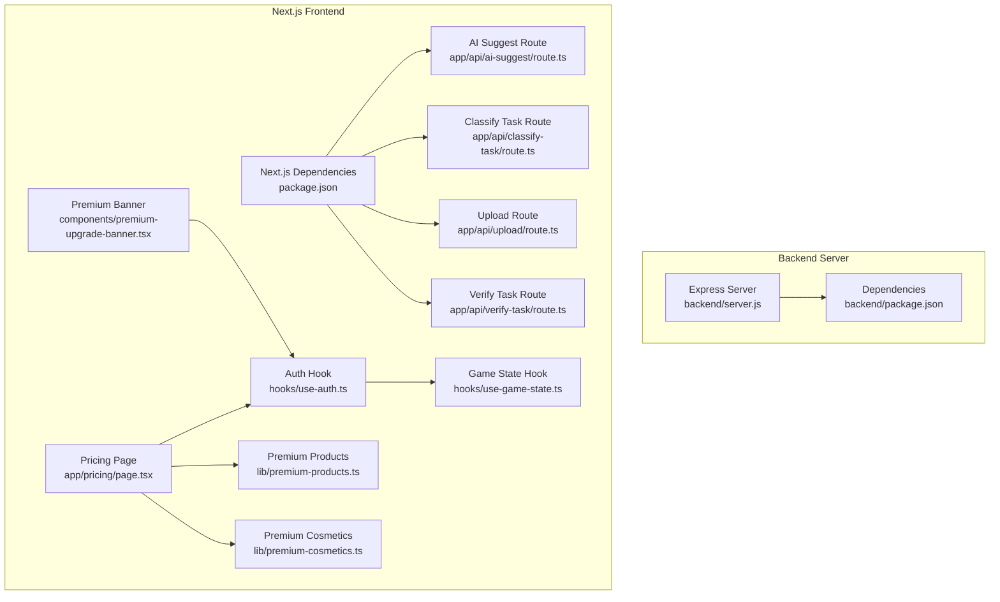

**Diagram sources**
- [server.js](file://backend/server.js)
- [package.json](file://backend/package.json)
- [route.ts](file://app/api/ai-suggest/route.ts)
- [route.ts](file://app/api/classify-task/route.ts)
- [route.ts](file://app/api/upload/route.ts)
- [route.ts](file://app/api/verify-task/route.ts)
- [package.json](file://package.json)
- [page.tsx](file://app/pricing/page.tsx)
- [premium-upgrade-banner.tsx](file://components/premium-upgrade-banner.tsx)
- [use-auth.ts](file://hooks/use-auth.ts)
- [use-game-state.ts](file://hooks/use-game-state.ts)
- [premium-products.ts](file://lib/premium-products.ts)
- [premium-cosmetics.ts](file://lib/premium-cosmetics.ts)

**Section sources**
- [server.js](file://backend/server.js)
- [package.json](file://backend/package.json)
- [route.ts](file://app/api/ai-suggest/route.ts)
- [route.ts](file://app/api/classify-task/route.ts)
- [route.ts](file://app/api/upload/route.ts)
- [route.ts](file://app/api/verify-task/route.ts)
- [package.json](file://package.json)
- [page.tsx](file://app/pricing/page.tsx)
- [premium-upgrade-banner.tsx](file://components/premium-upgrade-banner.tsx)
- [use-auth.ts](file://hooks/use-auth.ts)
- [use-game-state.ts](file://hooks/use-game-state.ts)
- [premium-products.ts](file://lib/premium-products.ts)
- [premium-cosmetics.ts](file://lib/premium-cosmetics.ts)

## Core Components
- Express server with CORS enabled globally and JSON body parsing.
- File upload pipeline using Multer with disk storage and timestamped filenames.
- In-memory “database” for users and tasks used for demonstration.
- Middleware to enforce premium-only access for advanced features.
- Premium upgrade endpoint simulating payment and plan change.
- Next.js API routes for AI-powered features (task suggestions, classification, image analysis, verification).

Key endpoints:
- POST /tasks: Retrieve pending tasks for a user.
- POST /add-task: Add a new task for a user.
- POST /complete-task: Mark a task as completed.
- POST /ai-suggest: Premium endpoint to get AI-generated task suggestions.
- POST /upload: Premium endpoint to upload an image and receive AI feedback.
- POST /upgrade: Simulate upgrading a user to premium.

**Section sources**
- [server.js](file://backend/server.js)
- [route.ts](file://app/api/ai-suggest/route.ts)
- [route.ts](file://app/api/classify-task/route.ts)
- [route.ts](file://app/api/upload/route.ts)
- [route.ts](file://app/api/verify-task/route.ts)

## Architecture Overview
The backend server exposes REST endpoints for task management and premium features. Premium features are gated by a middleware that checks the user’s plan. Next.js API routes provide complementary AI-driven functionality and integrate with the frontend’s authentication and game state.

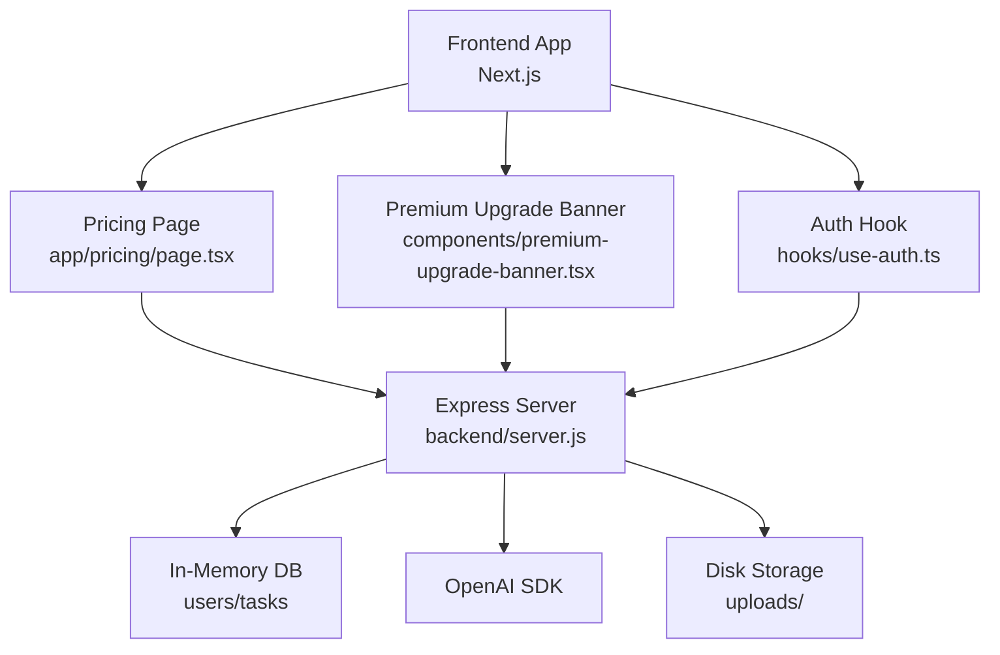

**Diagram sources**
- [server.js](file://backend/server.js)
- [use-auth.ts](file://hooks/use-auth.ts)
- [page.tsx](file://app/pricing/page.tsx)
- [premium-upgrade-banner.tsx](file://components/premium-upgrade-banner.tsx)

## Detailed Component Analysis

### Express Server Configuration and Middleware
- Environment configuration: Loads environment variables from the repository root.
- CORS: Enabled globally for development convenience.
- Body parsing: JSON body parser configured.
- File uploads: Multer configured with disk storage and timestamped filenames.
- In-memory database: Users and tasks arrays for demonstration.
- Premium middleware: Validates user plan before accessing premium endpoints.

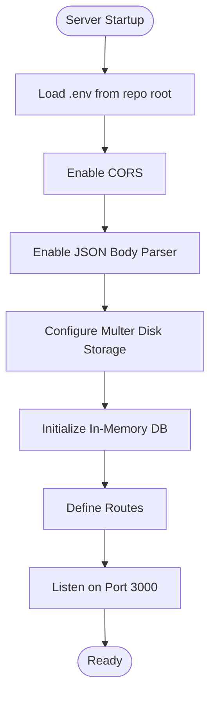

**Diagram sources**
- [server.js](file://backend/server.js)

**Section sources**
- [server.js](file://backend/server.js)

### Premium Middleware
The middleware enforces premium-only access by checking the user’s plan against the in-memory database.

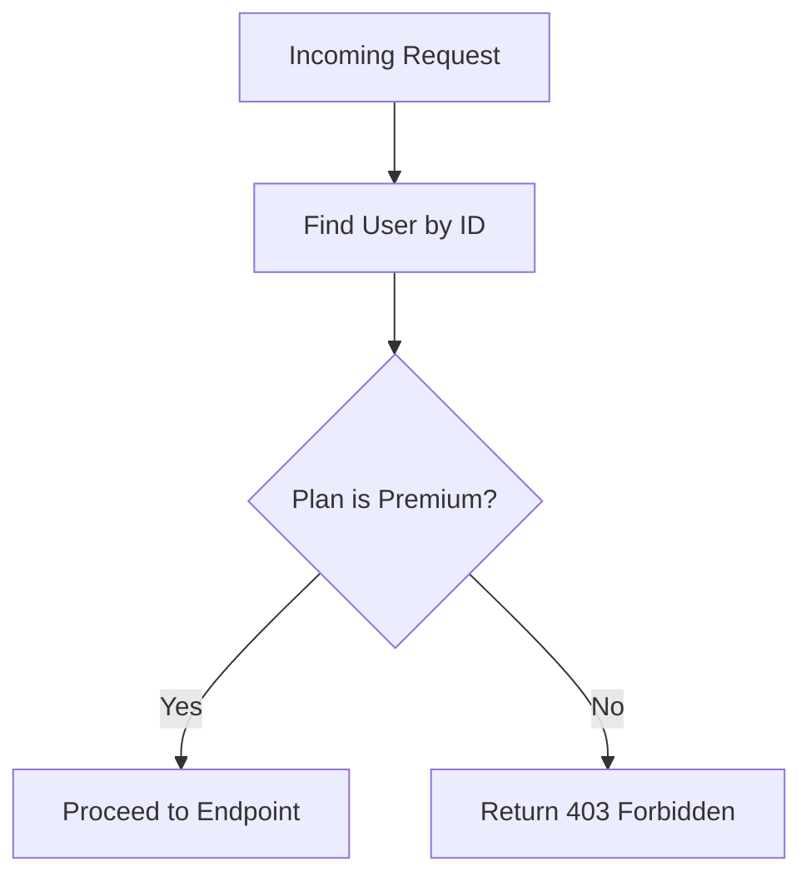

**Diagram sources**
- [server.js](file://backend/server.js)

**Section sources**
- [server.js](file://backend/server.js)

### Task Management Endpoints
- POST /tasks: Filters tasks by user ID and completion status.
- POST /add-task: Creates a new task with auto-incremented ID.
- POST /complete-task: Marks a task as completed.

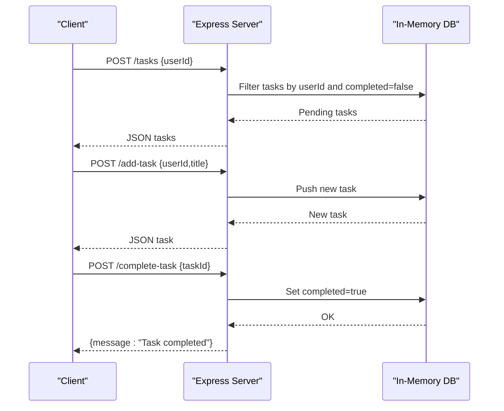

**Diagram sources**
- [server.js](file://backend/server.js)

**Section sources**
- [server.js](file://backend/server.js)

### Premium Endpoints

#### POST /ai-suggest
- Purpose: AI-generated task suggestions for premium users.
- Behavior: Requires premium plan; otherwise returns 403.
- Integrates with OpenAI chat completions.

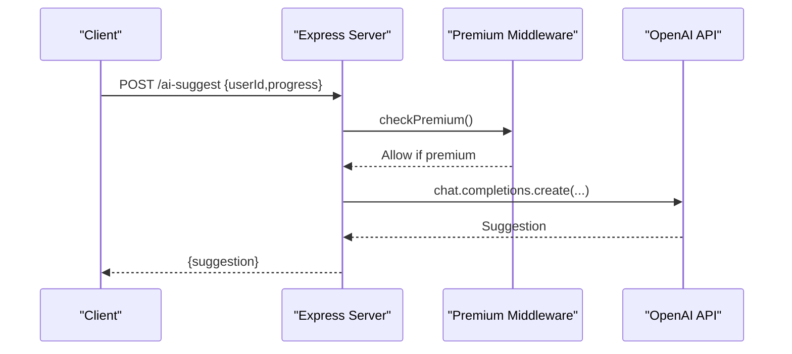

**Diagram sources**
- [server.js](file://backend/server.js)

**Section sources**
- [server.js](file://backend/server.js)

#### POST /upload
- Purpose: Upload an image and receive AI feedback for premium users.
- Behavior: Requires premium plan; otherwise returns 403.
- Stores uploaded files to uploads/ and generates feedback via OpenAI.

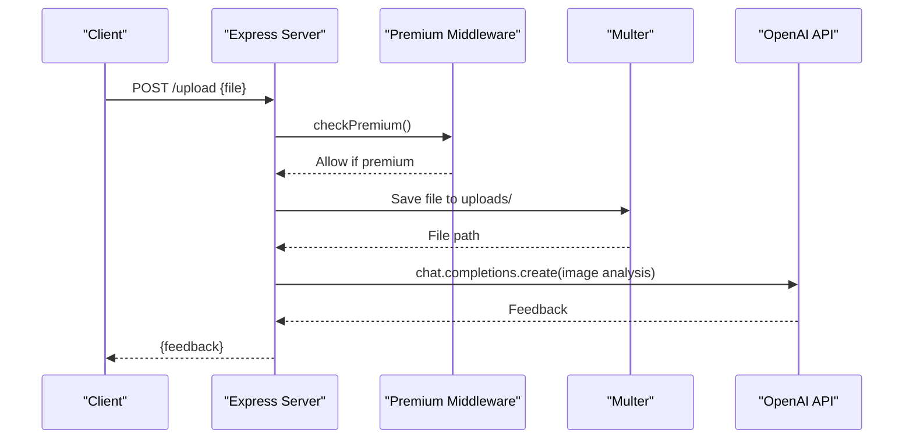

**Diagram sources**
- [server.js](file://backend/server.js)

**Section sources**
- [server.js](file://backend/server.js)

#### POST /upgrade
- Purpose: Simulate upgrading a user to premium.
- Behavior: Updates user plan in memory; returns success message.

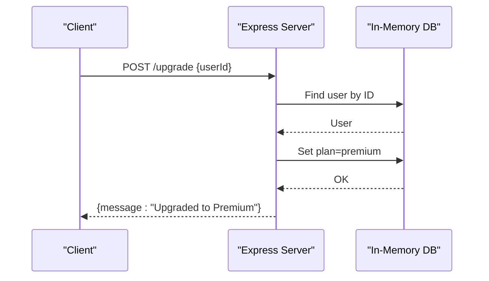

**Diagram sources**
- [server.js](file://backend/server.js)

**Section sources**
- [server.js](file://backend/server.js)

### Next.js API Routes Integration
The frontend integrates with Next.js API routes for AI features. These routes mirror backend capabilities but run within the Next.js runtime and can leverage environment variables similarly.

- AI Suggest: Returns mock suggestions if API key is missing or placeholder; otherwise queries OpenAI.
- Classify Task: Determines task type (written/physical/none) using OpenAI.
- Upload: Converts file to base64 and sends to OpenAI for feedback.
- Verify Task: Evaluates proof image and returns XP multiplier and feedback.

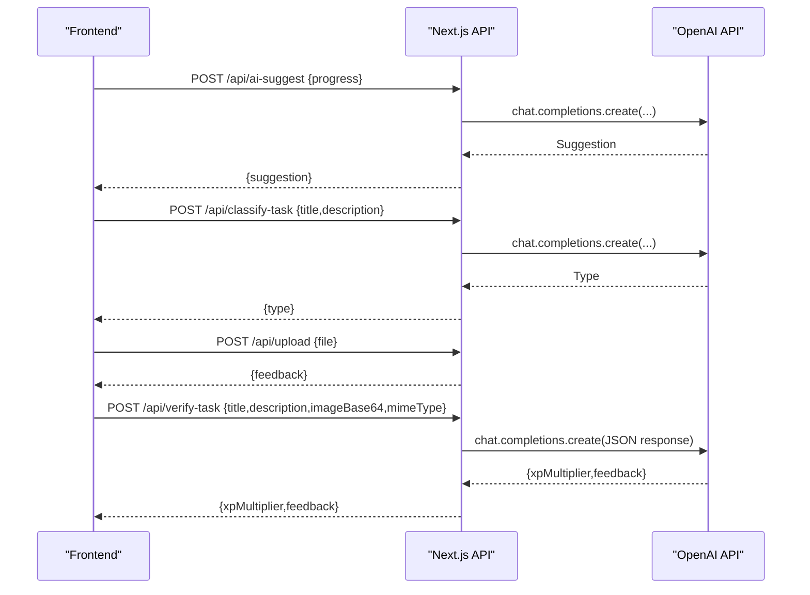

**Diagram sources**
- [route.ts](file://app/api/ai-suggest/route.ts)
- [route.ts](file://app/api/classify-task/route.ts)
- [route.ts](file://app/api/upload/route.ts)
- [route.ts](file://app/api/verify-task/route.ts)

**Section sources**
- [route.ts](file://app/api/ai-suggest/route.ts)
- [route.ts](file://app/api/classify-task/route.ts)
- [route.ts](file://app/api/upload/route.ts)
- [route.ts](file://app/api/verify-task/route.ts)

### Premium Features and User Data Management
- Premium products and tiers are defined in a typed model and rendered on the pricing page.
- Premium cosmetics are categorized and filtered for free vs. premium.
- Authentication hook manages user state, premium status, avatar URLs, and local persistence.
- Game state hook tracks tasks, XP, levels, streaks, and achievements locally.

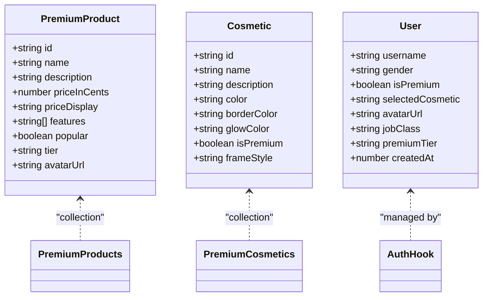

**Diagram sources**
- [premium-products.ts](file://lib/premium-products.ts)
- [premium-cosmetics.ts](file://lib/premium-cosmetics.ts)
- [use-auth.ts](file://hooks/use-auth.ts)

**Section sources**
- [premium-products.ts](file://lib/premium-products.ts)
- [premium-cosmetics.ts](file://lib/premium-cosmetics.ts)
- [use-auth.ts](file://hooks/use-auth.ts)
- [use-game-state.ts](file://hooks/use-game-state.ts)
- [game-constants.ts](file://lib/game-constants.ts)

### Pricing Page and Premium Upgrade Flow
- Pricing page renders premium tiers and features, previews 3D avatars, and triggers premium upgrades.
- On upgrade, the auth hook updates premium status and avatar URL, then navigates to the dashboard.

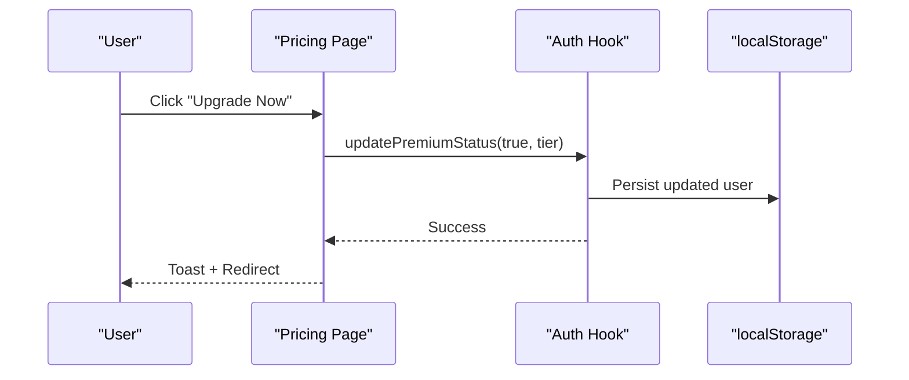

**Diagram sources**
- [page.tsx](file://app/pricing/page.tsx)
- [use-auth.ts](file://hooks/use-auth.ts)

**Section sources**
- [page.tsx](file://app/pricing/page.tsx)
- [use-auth.ts](file://hooks/use-auth.ts)

## Dependency Analysis
- Backend dependencies include Express, CORS, Multer, dotenv, and OpenAI SDK.
- Frontend dependencies include Next.js, OpenAI SDK, analytics, and UI libraries.
- Premium data models and hooks are shared across the frontend.

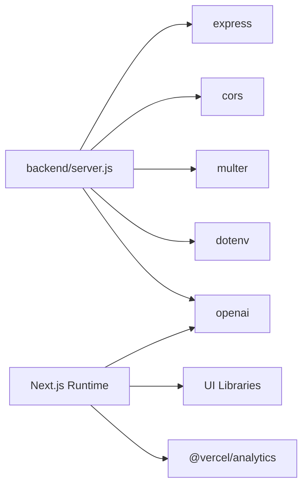

**Diagram sources**
- [package.json](file://backend/package.json)
- [package.json](file://package.json)

**Section sources**
- [package.json](file://backend/package.json)
- [package.json](file://package.json)

## Performance Considerations
- In-memory storage: Suitable for demos; consider migrating to a persistent database for production.
- File uploads: Ensure appropriate disk quotas and cleanup policies for uploads/.
- OpenAI calls: Implement retry logic, rate limiting, and caching for repeated prompts.
- Middleware overhead: Keep middleware lightweight; avoid heavy synchronous operations.
- Frontend caching: Use SWR or React Query for API responses to reduce redundant requests.

## Troubleshooting Guide
Common issues and resolutions:
- Missing environment variables: Ensure OPENAI_API_KEY is set in the backend .env and NEXT_PUBLIC environment variables are configured for frontend routes.
- CORS errors: Verify that the frontend origin is allowed; adjust CORS settings accordingly.
- Multer upload failures: Confirm uploads/ directory exists and is writable; validate file size limits.
- Premium endpoint 403: Ensure the user plan is set to premium in the in-memory database.
- Next.js API route errors: Check for proper JSON parsing and OpenAI API key configuration.

**Section sources**
- [server.js](file://backend/server.js)
- [route.ts](file://app/api/ai-suggest/route.ts)
- [route.ts](file://app/api/classify-task/route.ts)
- [route.ts](file://app/api/upload/route.ts)
- [route.ts](file://app/api/verify-task/route.ts)

## Conclusion
The backend server provides essential task management and premium AI features, while Next.js API routes complement frontend capabilities. Premium gating, user data management, and local persistence enable a cohesive user experience. For production, replace in-memory storage, secure environment variables, and implement robust monitoring and error handling.

## Appendices

### API Reference

- POST /tasks
  - Description: Retrieve pending tasks for a user.
  - Request body: { userId: number }
  - Response: Array of tasks.

- POST /add-task
  - Description: Add a new task for a user.
  - Request body: { userId: number, title: string }
  - Response: New task object.

- POST /complete-task
  - Description: Mark a task as completed.
  - Request body: { taskId: number }
  - Response: { message: string }

- POST /ai-suggest
  - Description: Premium endpoint to get AI task suggestions.
  - Request body: { userId: number, progress: any }
  - Response: { suggestion: string }
  - Security: Requires premium plan.

- POST /upload
  - Description: Premium endpoint to upload an image and receive AI feedback.
  - Request body: Form data with file field.
  - Response: { feedback: string }
  - Security: Requires premium plan.

- POST /upgrade
  - Description: Simulate upgrading a user to premium.
  - Request body: { userId: number }
  - Response: { message: string }

### Frontend Integration Examples
- Pricing page upgrade flow updates premium status and avatar URL via the auth hook.
- Premium banner conditionally renders for non-premium users and navigates to pricing.
- Game state hook persists tasks and XP locally; premium features unlock additional cosmetic tiers.

**Section sources**
- [page.tsx](file://app/pricing/page.tsx)
- [premium-upgrade-banner.tsx](file://components/premium-upgrade-banner.tsx)
- [use-auth.ts](file://hooks/use-auth.ts)
- [use-game-state.ts](file://hooks/use-game-state.ts)