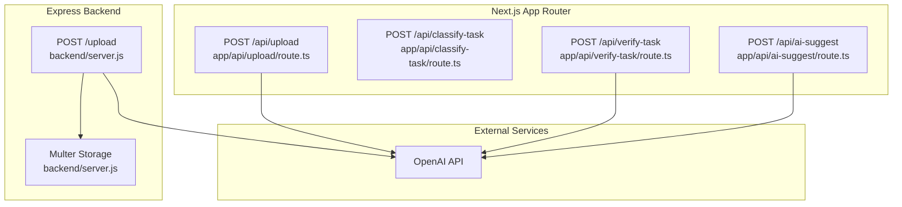
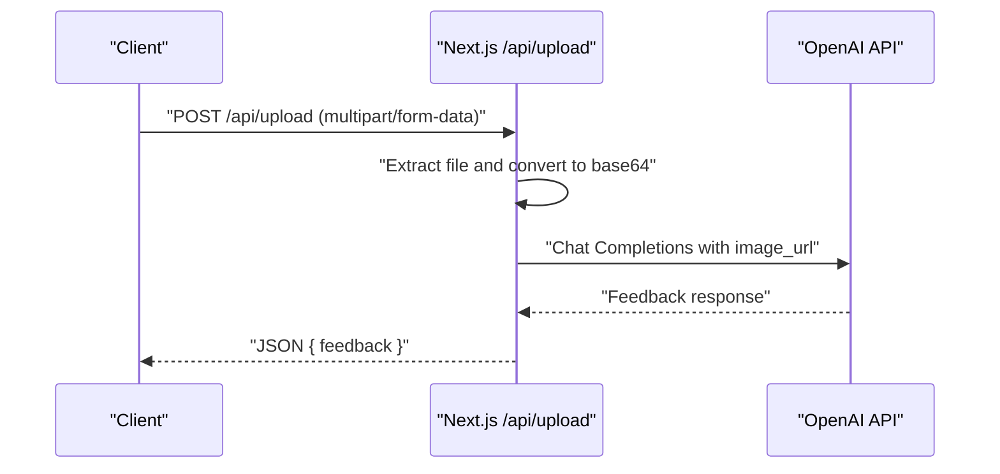
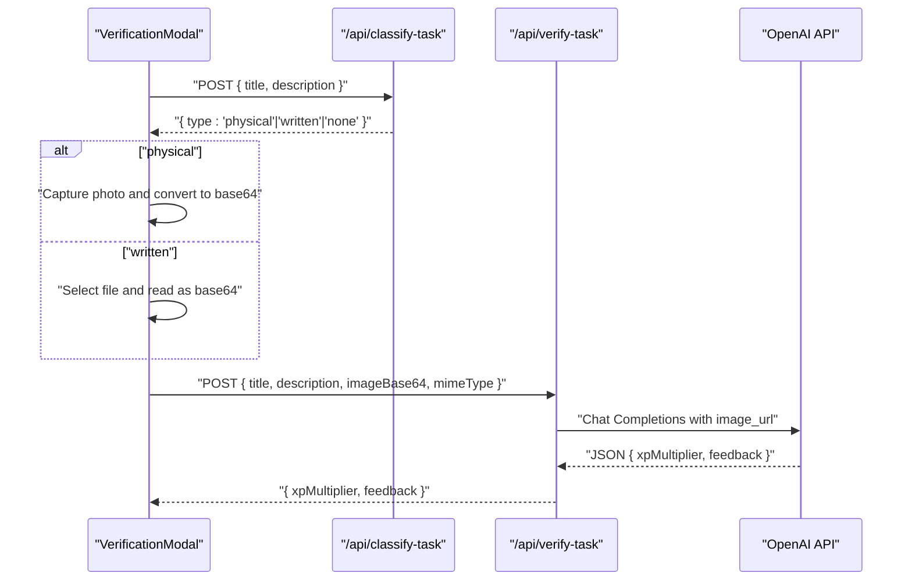
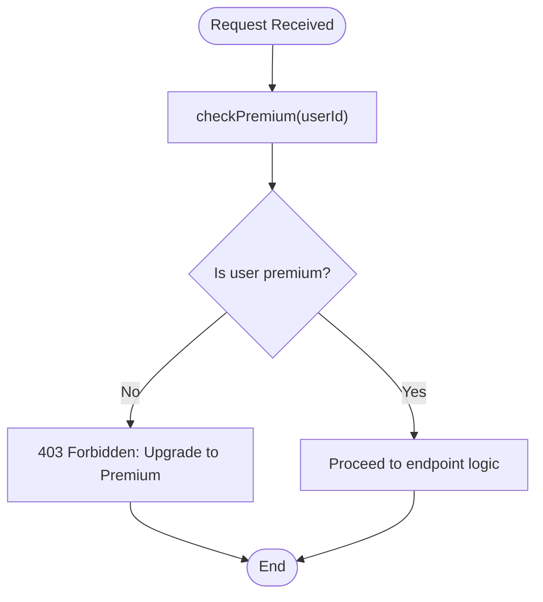
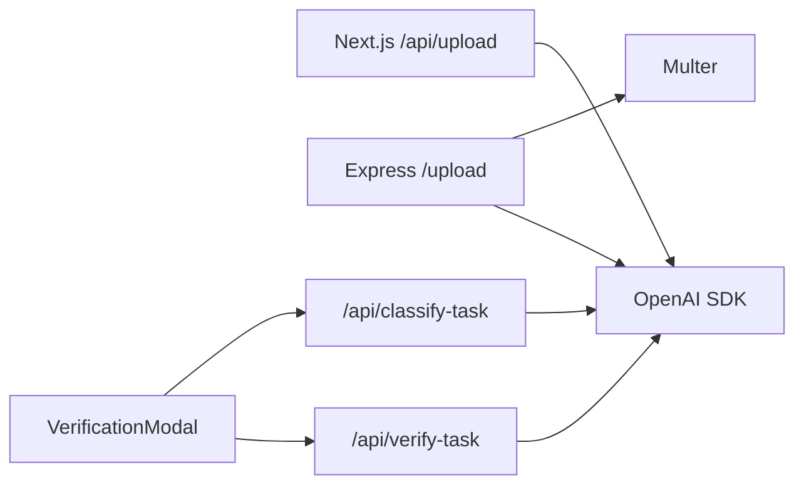

# File Upload API

<cite>
**Referenced Files in This Document**
- [route.ts](file://app/api/upload/route.ts)
- [server.js](file://backend/server.js)
- [verification-modal.tsx](file://components/verification-modal.tsx)
- [route.ts](file://app/api/classify-task/route.ts)
- [route.ts](file://app/api/verify-task/route.ts)
- [route.ts](file://app/api/ai-suggest/route.ts)
- [use-auth.ts](file://hooks/use-auth.ts)
- [premium-products.ts](file://lib/premium-products.ts)
- [page.tsx](file://app/pricing/page.tsx)
</cite>

## Table of Contents
1. [Introduction](#introduction)
2. [Project Structure](#project-structure)
3. [Core Components](#core-components)
4. [Architecture Overview](#architecture-overview)
5. [Detailed Component Analysis](#detailed-component-analysis)
6. [Dependency Analysis](#dependency-analysis)
7. [Performance Considerations](#performance-considerations)
8. [Troubleshooting Guide](#troubleshooting-guide)
9. [Conclusion](#conclusion)

## Introduction
This document describes the file upload and AI analysis endpoint for uploading images and receiving AI-powered feedback. It covers the POST /api/upload endpoint, multipart form handling, file validation, AI-powered feedback processing, supported file types, size limitations, security considerations, and integration examples. It also explains the relationship to premium features and the broader verification workflow.

## Project Structure
The upload feature spans both the Next.js app router and a separate Express backend service. The Next.js route handles direct client requests and delegates to OpenAI for analysis. The Express server provides a traditional multipart upload endpoint with premium gating and file storage.

**Diagram sources**
- [route.ts:1-43](file://app/api/upload/route.ts#L1-L43)
- [server.js:1-155](file://backend/server.js#L1-L155)
- [route.ts:1-43](file://app/api/classify-task/route.ts#L1-L43)
- [route.ts:1-55](file://app/api/verify-task/route.ts#L1-L55)
- [route.ts:1-34](file://app/api/ai-suggest/route.ts#L1-L34)

**Section sources**
- [route.ts:1-43](file://app/api/upload/route.ts#L1-L43)
- [server.js:1-155](file://backend/server.js#L1-L155)

## Core Components
- Next.js upload route: Accepts multipart/form-data, extracts the file, converts to base64, and sends it to OpenAI for analysis.
- Express upload endpoint: Uses Multer to save uploaded files to disk and then analyzes them via OpenAI.
- Frontend verification modal: Guides users through task classification and proof submission, supporting camera capture and file upload.
- Premium gating: Middleware ensures only premium users can access certain endpoints.

Key behaviors:
- File extraction from multipart form data.
- Base64 conversion for OpenAI image input.
- AI analysis with structured prompts.
- Premium-only access for advanced features.

**Section sources**
- [route.ts:8-42](file://app/api/upload/route.ts#L8-L42)
- [server.js:111-135](file://backend/server.js#L111-L135)
- [verification-modal.tsx:39-140](file://components/verification-modal.tsx#L39-L140)

## Architecture Overview
The upload workflow integrates client-side classification, user-driven proof collection, and AI analysis. Premium users gain access to advanced endpoints and richer features.

**Diagram sources**
- [route.ts:8-42](file://app/api/upload/route.ts#L8-L42)

## Detailed Component Analysis

### Next.js Upload Endpoint: POST /api/upload
Purpose:
- Receive a file via multipart form data.
- Validate presence of the file.
- Convert the file to base64 and send to OpenAI for analysis.
- Return AI-generated feedback.

Request
- Method: POST
- Path: /api/upload
- Headers: multipart/form-data; boundary=...
- Body: form field named "file" containing the image
- Authentication: Not enforced in this route

Response
- Success: 200 OK with JSON { feedback: string }
- Client errors: 400 Bad Request with JSON { error: string }
- Server errors: 500 Internal Server Error with JSON { error: string }

Behavior highlights
- Extracts the file from form data.
- Reads raw bytes and encodes to base64.
- Sends image_url payload to OpenAI chat completions.
- Returns the assistant’s message content as feedback.

Security and validation
- No explicit file type or size checks in this route.
- No authentication or authorization enforcement here.

Integration example
- Use a standard HTML form with input type=file and submit via fetch/fetch-like libraries.

**Section sources**
- [route.ts:8-42](file://app/api/upload/route.ts#L8-L42)

### Express Upload Endpoint: POST /upload (Premium)
Purpose:
- Save uploaded files to disk using Multer.
- Verify user premium status via middleware.
- Analyze saved image via OpenAI and return feedback.

Request
- Method: POST
- Path: /upload
- Headers: multipart/form-data; boundary=...
- Body: form field named "file" containing the image
- Authentication: Requires premium user (userId in body checked)

Response
- Success: 200 OK with JSON { feedback }
- Unauthorized: 403 Forbidden with JSON { message }
- Server errors: 500 Internal Server Error with JSON { error }

Storage
- Disk storage configured with timestamped filenames under uploads/.

Security and validation
- Premium middleware enforces access control.
- Multer manages file destination and naming.

**Section sources**
- [server.js:111-135](file://backend/server.js#L111-L135)
- [server.js:21-30](file://backend/server.js#L21-L30)

### Frontend Verification Modal and Workflow
Purpose:
- Classify tasks as physical, written, or none.
- Collect proof via camera or file upload.
- Send proof to verification endpoint for AI evaluation.

Key steps
- Classify task: POST /api/classify-task with title and description.
- If physical: start camera, capture photo, convert to base64.
- If written: choose file, read as base64.
- Verify proof: POST /api/verify-task with title, description, imageBase64, and mimeType.
- Display feedback and XP multiplier.

**Diagram sources**
- [verification-modal.tsx:39-140](file://components/verification-modal.tsx#L39-L140)
- [route.ts:8-42](file://app/api/classify-task/route.ts#L8-L42)
- [route.ts:8-54](file://app/api/verify-task/route.ts#L8-L54)

**Section sources**
- [verification-modal.tsx:39-140](file://components/verification-modal.tsx#L39-L140)
- [route.ts:8-42](file://app/api/classify-task/route.ts#L8-L42)
- [route.ts:8-54](file://app/api/verify-task/route.ts#L8-L54)

### Premium Feature Gating
- Middleware checkPremium validates user plan and blocks non-premium access to premium endpoints.
- Premium tiers and upgrade flow are managed in the frontend pricing page and auth hook.

**Diagram sources**
- [server.js:46-52](file://backend/server.js#L46-L52)

**Section sources**
- [server.js:46-52](file://backend/server.js#L46-L52)
- [use-auth.ts:90-109](file://hooks/use-auth.ts#L90-L109)
- [premium-products.ts:1-75](file://lib/premium-products.ts#L1-L75)
- [page.tsx:18-34](file://app/pricing/page.tsx#L18-L34)

## Dependency Analysis
- OpenAI SDK integration for chat completions.
- Multer for Express file handling and disk storage.
- Next.js App Router for modern API routes.
- Frontend components for user interaction and data preparation.

**Diagram sources**
- [route.ts:1-6](file://app/api/upload/route.ts#L1-L6)
- [server.js:4-16](file://backend/server.js#L4-L16)
- [verification-modal.tsx:39-140](file://components/verification-modal.tsx#L39-L140)
- [route.ts:1-6](file://app/api/classify-task/route.ts#L1-L6)
- [route.ts:1-6](file://app/api/verify-task/route.ts#L1-L6)

**Section sources**
- [route.ts:1-6](file://app/api/upload/route.ts#L1-L6)
- [server.js:4-16](file://backend/server.js#L4-L16)
- [verification-modal.tsx:39-140](file://components/verification-modal.tsx#L39-L140)

## Performance Considerations
- Base64 size overhead: Base64 increases size by approximately 33%. Large images will increase payload and latency.
- Streaming vs. buffering: The Next.js route reads the entire ArrayBuffer before converting to base64. For very large files, consider streaming or server-side processing.
- OpenAI rate limits: Batch requests and implement retry/backoff strategies.
- CDN/static hosting: Serve uploaded images via a CDN or static route to reduce origin load.
- Compression: Prefer JPEG for photos and PNG for graphics; consider client-side compression before upload.

## Troubleshooting Guide
Common issues and resolutions
- Missing file in multipart form:
  - Symptom: 400 error with "No file provided".
  - Resolution: Ensure the form field name is "file" and the client sends multipart/form-data.
- Invalid or unsupported image:
  - Symptom: OpenAI rejects payload or returns generic error.
  - Resolution: Validate MIME type and file size; ensure the image is readable.
- OpenAI API key missing or invalid:
  - Symptom: 500 error or mock behavior in development.
  - Resolution: Set OPENAI_API_KEY in environment; verify quota and region.
- Premium access denied:
  - Symptom: 403 error "Upgrade to Premium".
  - Resolution: Ensure user is premium and request includes a valid userId.
- Frontend verification fails:
  - Symptom: Camera permission denied or verification error.
  - Resolution: Handle browser permissions; fallback to file upload; inspect network tab for errors.

**Section sources**
- [route.ts:13-15](file://app/api/upload/route.ts#L13-L15)
- [server.js:46-52](file://backend/server.js#L46-L52)
- [verification-modal.tsx:73-77](file://components/verification-modal.tsx#L73-L77)
- [route.ts:12-14](file://app/api/verify-task/route.ts#L12-L14)

## Conclusion
The file upload and AI analysis pipeline combines client-side classification and proof collection with server-side AI evaluation. The Next.js route offers a streamlined path for direct image uploads, while the Express route provides robust file handling and premium gating. Implement proper validation, security controls, and performance optimizations to scale reliably.