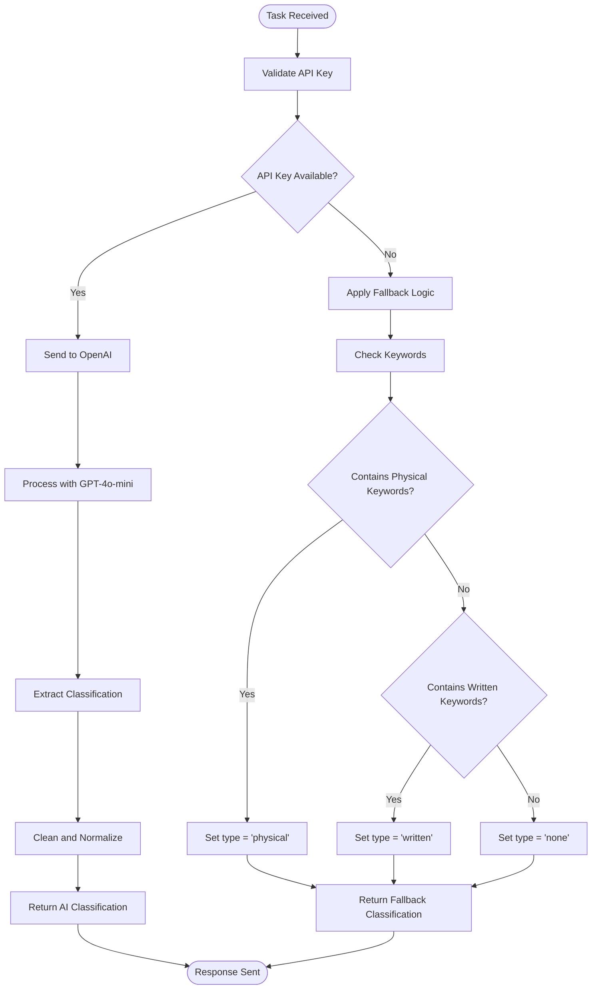
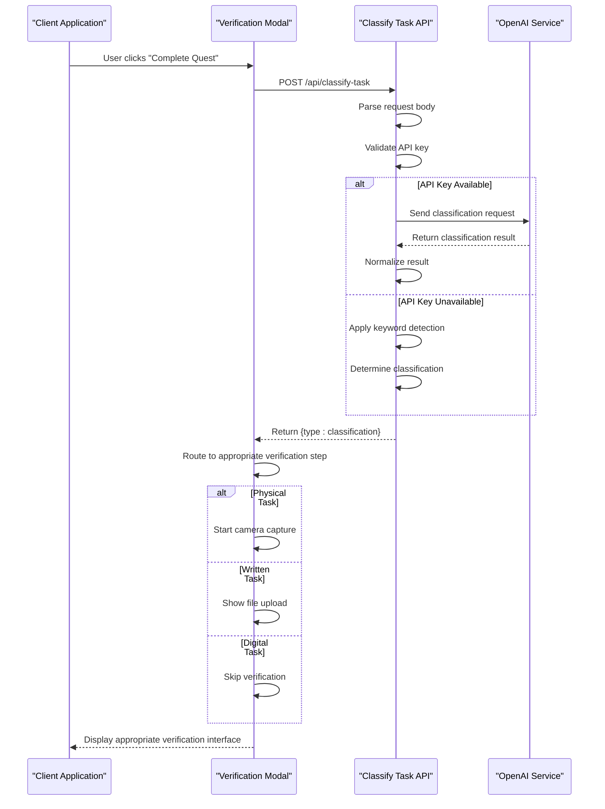
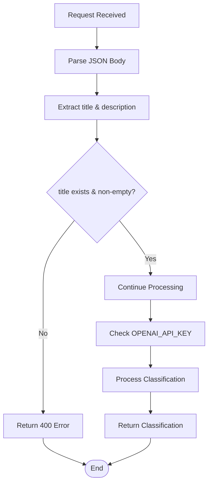
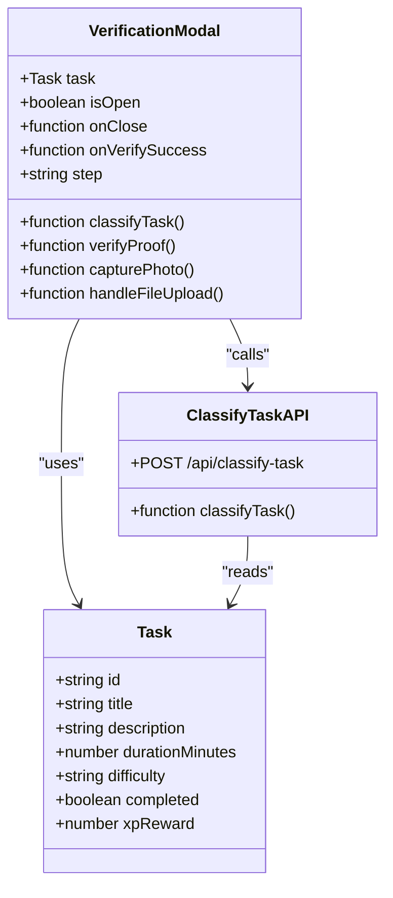
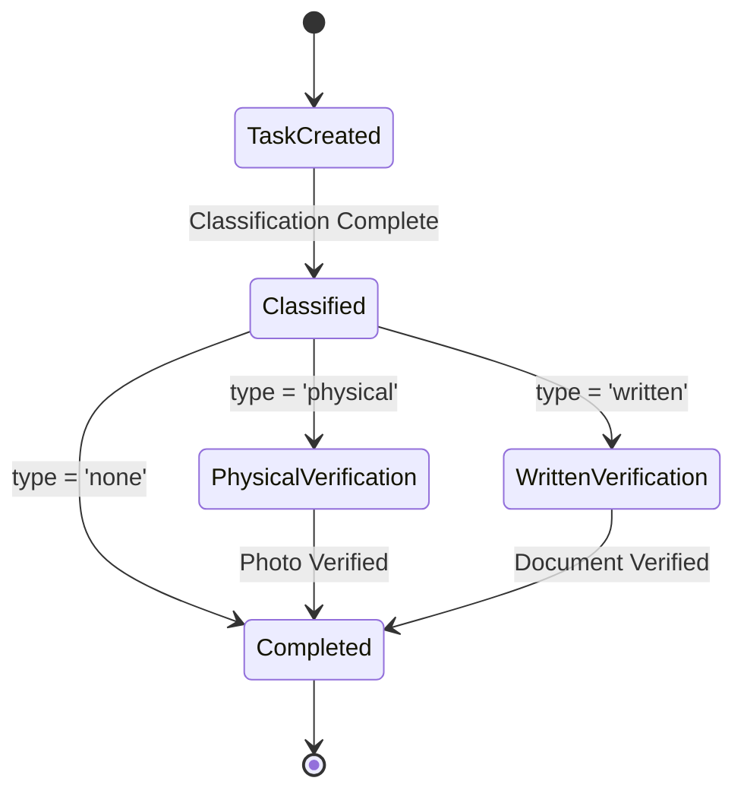

# Task Classification API

<cite>
**Referenced Files in This Document**
- [route.ts](file://app/api/classify-task/route.ts)
- [verification-modal.tsx](file://components/verification-modal.tsx)
- [task-card.tsx](file://components/task-card.tsx)
- [use-game-state.ts](file://hooks/use-game-state.ts)
- [game-constants.ts](file://lib/game-constants.ts)
- [route.ts](file://app/api/verify-task/route.ts)
- [route.ts](file://app/api/ai-suggest/route.ts)
</cite>

## Table of Contents
1. [Introduction](#introduction)
2. [API Endpoint Definition](#api-endpoint-definition)
3. [Request Schema](#request-schema)
4. [Response Schema](#response-schema)
5. [Classification Algorithm](#classification-algorithm)
6. [Integration Flow](#integration-flow)
7. [Input Validation](#input-validation)
8. [Error Handling](#error-handling)
9. [Examples](#examples)
10. [Frontend Integration Patterns](#frontend-integration-patterns)
11. [Security Considerations](#security-considerations)
12. [Conclusion](#conclusion)

## Introduction

The Task Classification API is a critical component of the AI-powered task management system that automatically categorizes user-created tasks into three distinct types: written, physical, or none. This endpoint serves as the foundation for the verification workflow, determining whether a task requires photographic evidence, written documentation, or can be verified without proof.

The system operates on a gamified productivity platform inspired by the Solo Leveling concept, where tasks are classified to determine appropriate verification methods and XP reward calculations. The API integrates seamlessly with the frontend verification modal to provide an intelligent task categorization experience.

## API Endpoint Definition

### Endpoint
```
POST /api/classify-task
```

### Purpose
Automatically classifies user-created tasks into one of three categories based on their nature and required proof type.

### Authentication
- No authentication required for basic operation
- Falls back to deterministic classification when API key is unavailable

## Request Schema

| Field | Type | Required | Description |
|-------|------|----------|-------------|
| title | string | Yes | The main task title or name |
| description | string | No | Additional details about the task |

### Request Body Structure
```json
{
  "title": "string",
  "description": "string"
}
```

### Example Requests

**Physical Task Request:**
```json
{
  "title": "Morning Workout",
  "description": "30 minutes of cardio and strength training"
}
```

**Written Task Request:**
```json
{
  "title": "Code Review",
  "description": "Review 5 pull requests for the React project"
}
```

**Digital Task Request:**
```json
{
  "title": "Research Topic",
  "description": "Investigate AI-powered task classification systems"
}
```

## Response Schema

| Field | Type | Description |
|-------|------|-------------|
| type | string | Classification result: 'written', 'physical', or 'none' |

### Response Body Structure
```json
{
  "type": "string"
}
```

### Response Types

**Physical Task Response:**
```json
{
  "type": "physical"
}
```

**Written Task Response:**
```json
{
  "type": "written"
}
```

**Digital Task Response:**
```json
{
  "type": "none"
}
```

## Classification Algorithm

The task classification system employs a dual-layer approach combining AI-powered analysis with deterministic fallback logic.

### AI-Powered Classification (Primary Method)

When the OPENAI_API_KEY environment variable is properly configured, the system uses OpenAI's GPT-4o-mini model with a specialized prompt designed to classify tasks into three categories:



**Diagram sources**
- [route.ts:8-42](file://app/api/classify-task/route.ts#L8-L42)

### Deterministic Fallback Logic (Backup Method)

When the API key is unavailable or invalid, the system applies keyword-based classification:

**Physical Task Detection Keywords:**
- pushup, workout, exercise, run, clean, lift, build, stretch

**Written Task Detection Keywords:**
- read, write, study, code, document, essay, research, review

**Default Classification:**
- All other tasks classified as 'none'

### Response Normalization

The system performs additional cleanup to ensure consistent output:
- Converts all text to lowercase
- Removes punctuation
- Validates against acceptable classification values
- Defaults to 'none' for any unexpected results

## Integration Flow

The classification endpoint integrates deeply with the verification workflow:



**Diagram sources**
- [verification-modal.tsx:39-64](file://components/verification-modal.tsx#L39-L64)
- [route.ts:8-42](file://app/api/classify-task/route.ts#L8-L42)

## Input Validation

### Required Fields
- **title**: Must be present and non-empty
- **description**: Optional but processed when provided

### Validation Logic


**Diagram sources**
- [route.ts:8-18](file://app/api/classify-task/route.ts#L8-L18)

### Error Conditions
- Missing title field: Returns 400 error
- Malformed JSON: Returns 400 error  
- API key configuration errors: Falls back to deterministic logic
- OpenAI service failures: Returns 500 error with error message

## Error Handling

### HTTP Status Codes

| Status Code | Scenario | Response Body |
|-------------|----------|---------------|
| 200 | Successful classification | `{ type: string }` |
| 400 | Invalid request format | `{ error: string }` |
| 500 | Internal server error | `{ error: string }` |

### Error Response Schema
```json
{
  "error": "string"
}
```

### Error Scenarios

**Missing Required Fields:**
- Client-side validation prevents malformed requests
- Server-side validation ensures robust error handling

**API Key Issues:**
- Invalid or missing API key triggers fallback logic
- Graceful degradation maintains system functionality

**Network Failures:**
- OpenAI service unavailability falls back to keyword-based classification
- Frontend handles network errors with user-friendly messaging

## Examples

### Example 1: Physical Task Classification

**Input:**
```json
{
  "title": "Evening Yoga Session",
  "description": "30 minutes of stretching and meditation"
}
```

**Expected Output:**
```json
{
  "type": "physical"
}
```

**Verification Workflow:**
- Opens camera interface for photo capture
- Requires photographic proof of physical activity

### Example 2: Written Task Classification

**Input:**
```json
{
  "title": "Technical Documentation",
  "description": "Write API documentation for the task manager"
}
```

**Expected Output:**
```json
{
  "type": "written"
}
```

**Verification Workflow:**
- Shows file upload interface
- Requires screenshot or document as proof

### Example 3: Digital Task Classification

**Input:**
```json
{
  "title": "Problem Solving",
  "description": "Think through the optimal task classification algorithm"
}
```

**Expected Output:**
```json
{
  "type": "none"
}
```

**Verification Workflow:**
- Skips verification step
- Awards full XP automatically

## Frontend Integration Patterns

### React Component Integration

The verification modal demonstrates the recommended integration pattern:



**Diagram sources**
- [verification-modal.tsx:9-14](file://components/verification-modal.tsx#L9-L14)
- [route.ts:8-42](file://app/api/classify-task/route.ts#L8-L42)

### Recommended Frontend Implementation

**Basic Integration Pattern:**
```typescript
// Example frontend implementation pattern
const classifyTask = async (task: Task) => {
  try {
    const response = await fetch('/api/classify-task', {
      method: 'POST',
      headers: {
        'Content-Type': 'application/json',
      },
      body: JSON.stringify({
        title: task.title,
        description: task.description
      })
    });
    
    const data = await response.json();
    
    if (data.type === 'physical') {
      // Show camera interface
      showCameraInterface();
    } else if (data.type === 'written') {
      // Show file upload
      showFileUploadInterface();
    } else {
      // Skip verification
      completeTaskWithoutVerification();
    }
  } catch (error) {
    // Handle error gracefully
    completeTaskWithFallback();
  }
};
```

### State Management Integration

The classification result integrates with the game state management:

**XP Calculation Integration:**
- Base XP calculated from duration and difficulty
- Final XP adjusted by verification multiplier
- Achievement tracking based on classification type

**Task Completion Flow:**


**Diagram sources**
- [use-game-state.ts:127-141](file://hooks/use-game-state.ts#L127-L141)

## Security Considerations

### API Key Management
- Environment variable validation prevents accidental exposure
- Fallback logic ensures system continues operating without AI
- Rate limiting considerations for API usage

### Input Sanitization
- JSON parsing validates request format
- Keyword extraction is case-insensitive and safe
- No external database operations performed

### Privacy Considerations
- Classification occurs server-side only
- No personal data stored beyond classification results
- Verification images are processed but not stored

## Conclusion

The Task Classification API provides a robust foundation for automated task categorization in the gamified productivity platform. Its dual-layer approach ensures reliability through AI-powered classification with deterministic fallback logic. The system seamlessly integrates with the verification workflow, enabling intelligent task management while maintaining system resilience during API key issues.

The endpoint's design prioritizes developer experience with clear request/response schemas, comprehensive error handling, and flexible integration patterns suitable for various frontend frameworks and architectures.