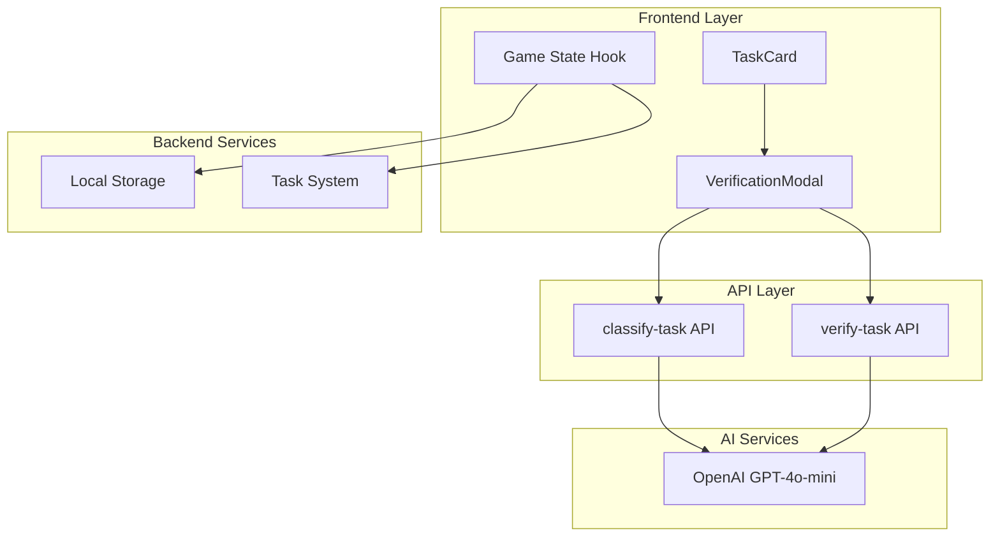
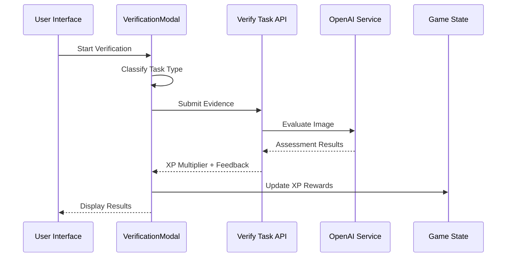
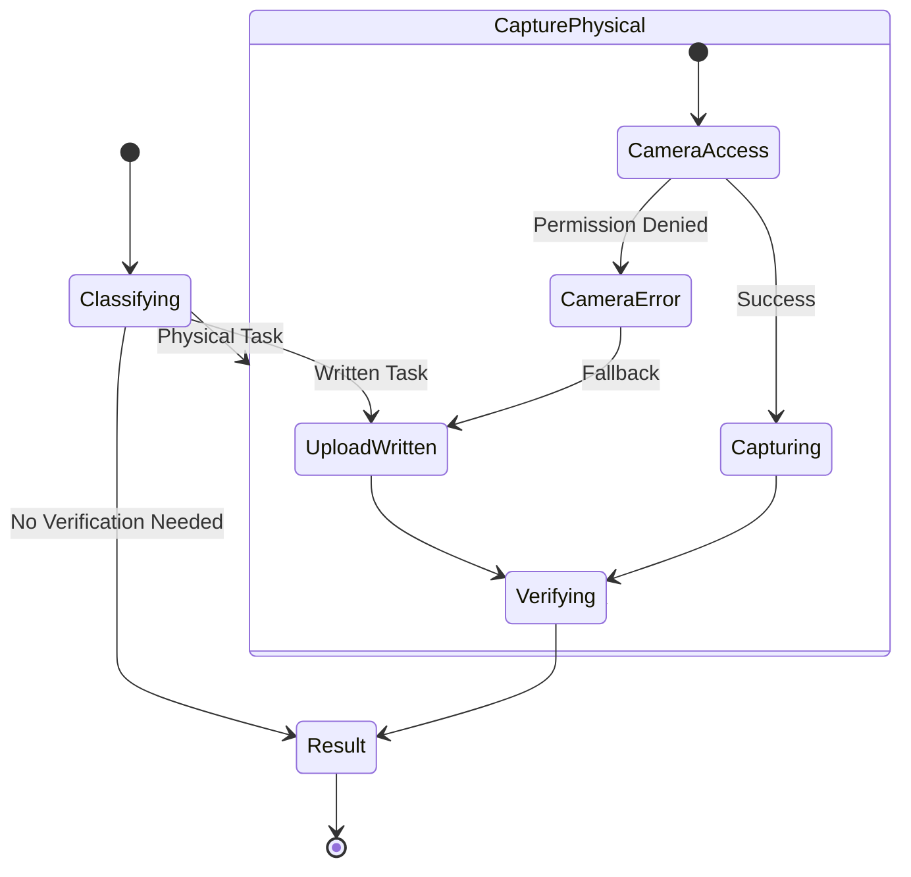
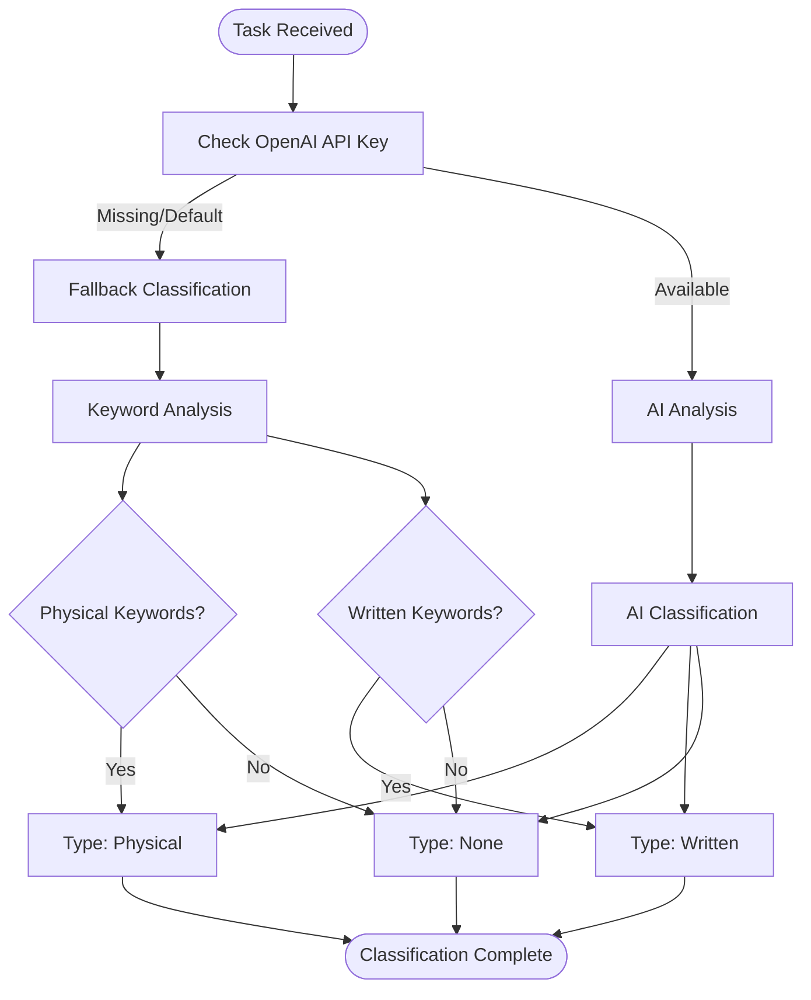
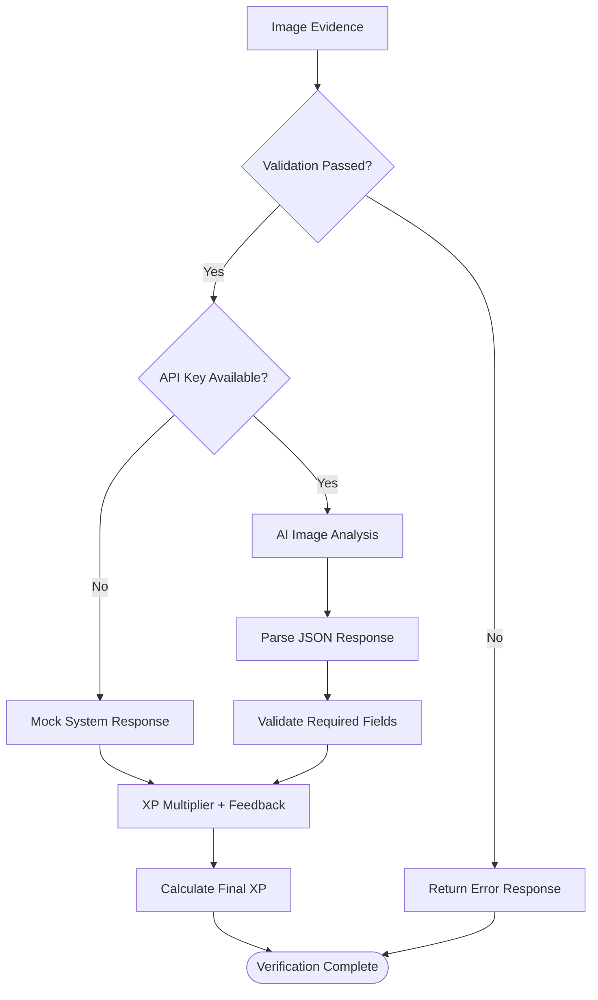
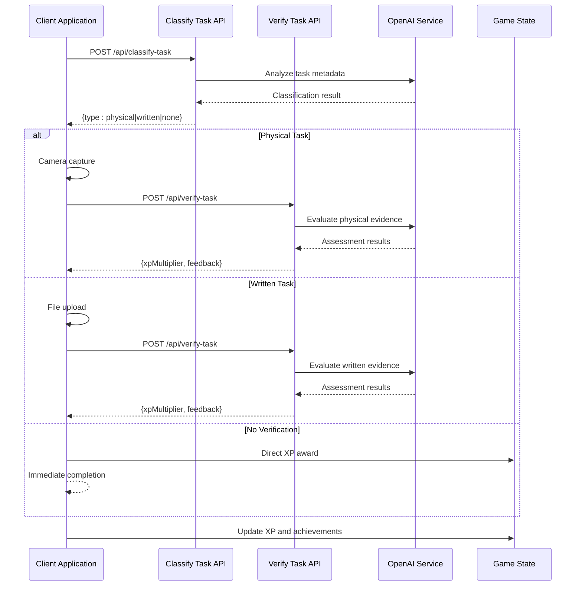
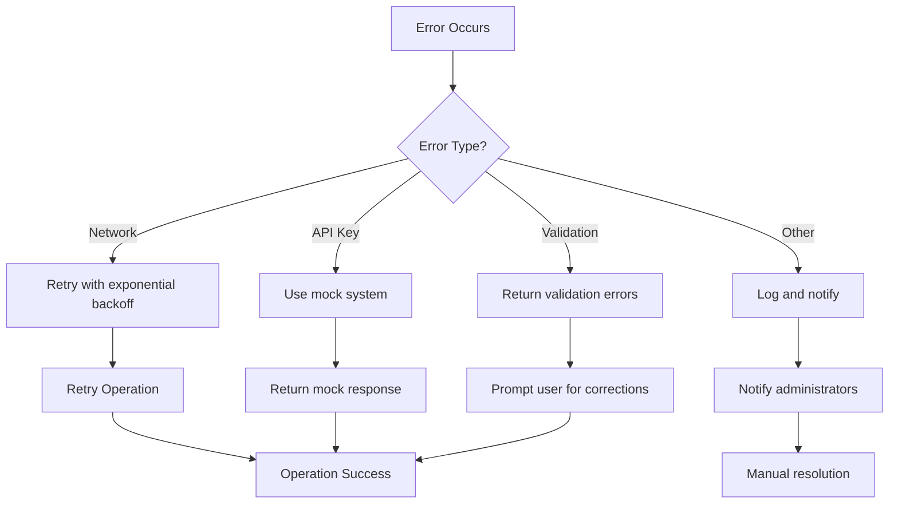

# Task Verification API

<cite>
**Referenced Files in This Document**
- [route.ts](file://app/api/verify-task/route.ts)
- [verification-modal.tsx](file://components/verification-modal.tsx)
- [route.ts](file://app/api/classify-task/route.ts)
- [use-game-state.ts](file://hooks/use-game-state.ts)
- [task-card.tsx](file://components/task-card.tsx)
- [page.tsx](file://app/page.tsx)
- [game-constants.ts](file://lib/game-constants.ts)
</cite>

## Table of Contents
1. [Introduction](#introduction)
2. [Project Structure](#project-structure)
3. [Core Components](#core-components)
4. [Architecture Overview](#architecture-overview)
5. [Detailed Component Analysis](#detailed-component-analysis)
6. [API Definition](#api-definition)
7. [Verification Workflow](#verification-workflow)
8. [Security Considerations](#security-considerations)
9. [Performance Considerations](#performance-considerations)
10. [Troubleshooting Guide](#troubleshooting-guide)
11. [Conclusion](#conclusion)

## Introduction

The Task Verification API is a sophisticated system that validates user task completion through AI-powered image analysis and integrates seamlessly with the game's gamification system. This API enables users to submit proof of task completion, which is then evaluated by an AI system to determine XP rewards and provide character feedback.

The system operates through a multi-step verification process that includes task classification, evidence collection, AI assessment, and reward calculation. It's designed to prevent false positives while maintaining a smooth user experience across different task types (physical, written, or digital).

## Project Structure

The verification system is built around a modular architecture with clear separation of concerns:



**Diagram sources**
- [verification-modal.tsx:18-331](file://components/verification-modal.tsx#L18-L331)
- [route.ts:8-55](file://app/api/verify-task/route.ts#L8-L55)
- [route.ts:8-43](file://app/api/classify-task/route.ts#L8-L43)

**Section sources**
- [verification-modal.tsx:1-331](file://components/verification-modal.tsx#L1-L331)
- [route.ts:1-55](file://app/api/verify-task/route.ts#L1-L55)
- [route.ts:1-43](file://app/api/classify-task/route.ts#L1-L43)

## Core Components

### Verification Modal System

The VerificationModal component serves as the primary user interface for the verification process, managing a five-step workflow:

1. **Classifying**: Determines task type (physical, written, or none)
2. **Capture Physical**: Uses webcam for physical task verification
3. **Upload Written**: Allows file upload for written/digital tasks
4. **Verifying**: Processes AI evaluation
5. **Result**: Displays feedback and XP calculation

### Task Classification Engine

The classify-task API analyzes task metadata to determine appropriate verification method, using AI to categorize tasks as physical exercises, written assignments, or digital tasks requiring no visual proof.

### AI-Powered Assessment

The verify-task API integrates with OpenAI's GPT-4o-mini model to evaluate submitted evidence, providing both numerical XP multipliers and character-driven feedback messages.

**Section sources**
- [verification-modal.tsx:16-64](file://components/verification-modal.tsx#L16-L64)
- [route.ts:8-43](file://app/api/classify-task/route.ts#L8-L43)
- [route.ts:8-55](file://app/api/verify-task/route.ts#L8-L55)

## Architecture Overview

The verification system follows a client-server architecture with AI integration:



**Diagram sources**
- [verification-modal.tsx:39-140](file://components/verification-modal.tsx#L39-L140)
- [route.ts:24-50](file://app/api/verify-task/route.ts#L24-L50)

## Detailed Component Analysis

### VerificationModal Component

The VerificationModal implements a sophisticated state machine managing the entire verification workflow:



**Diagram sources**
- [verification-modal.tsx:16-84](file://components/verification-modal.tsx#L16-L84)

Key features include:
- **Dynamic Step Management**: Automatic progression through verification stages
- **Fallback Mechanisms**: Graceful handling of camera failures
- **Real-time Preview**: Image preview during capture
- **Progress Indicators**: Visual feedback throughout the process

**Section sources**
- [verification-modal.tsx:18-331](file://components/verification-modal.tsx#L18-L331)

### Task Classification Logic

The classify-task API determines verification requirements based on task characteristics:



**Diagram sources**
- [route.ts:8-43](file://app/api/classify-task/route.ts#L8-L43)

**Section sources**
- [route.ts:8-43](file://app/api/classify-task/route.ts#L8-L43)

### AI Assessment Engine

The verify-task API processes submitted evidence through OpenAI's GPT-4o-mini:



**Diagram sources**
- [route.ts:8-55](file://app/api/verify-task/route.ts#L8-L55)

**Section sources**
- [route.ts:8-55](file://app/api/verify-task/route.ts#L8-L55)

## API Definition

### POST /api/verify-task

The verification endpoint processes task completion evidence and returns AI-assessed XP multipliers.

#### Request Schema

| Field | Type | Required | Description |
|-------|------|----------|-------------|
| title | string | Yes | Task title for context |
| description | string | No | Task description for context |
| imageBase64 | string | Yes | Base64-encoded image data |
| mimeType | string | Yes | MIME type of the image |

#### Response Schema

| Field | Type | Description |
|-------|------|-------------|
| xpMultiplier | number | XP multiplier (0.0-2.0) based on evidence quality |
| feedback | string | Character-driven feedback message |

#### Success Responses

**200 OK** - Successful verification
```json
{
  "xpMultiplier": 1.5,
  "feedback": "Impressive work, Hunter! The proof is undeniable. Your strength grows."
}
```

**400 Bad Request** - Missing image data
```json
{
  "error": "No image provided"
}
```

**500 Internal Server Error** - Processing failure
```json
{
  "error": "Error message describing the failure"
}
```

#### Mock System Behavior

When the OpenAI API key is missing or default, the system returns a mock response with:
- Fixed XP multiplier: 1.5
- Character feedback: "Impressive work, Hunter! The proof is undeniable. Your strength grows."

**Section sources**
- [route.ts:8-55](file://app/api/verify-task/route.ts#L8-L55)

## Verification Workflow

### Complete Verification Process

The verification workflow consists of several interconnected steps:



**Diagram sources**
- [verification-modal.tsx:39-140](file://components/verification-modal.tsx#L39-L140)
- [route.ts:8-43](file://app/api/classify-task/route.ts#L8-L43)
- [route.ts:8-55](file://app/api/verify-task/route.ts#L8-L55)

### Evidence Collection Methods

The system supports multiple evidence collection approaches:

1. **Physical Evidence**: Webcam capture for exercises and activities
2. **Written Evidence**: File uploads for documents, screenshots, and written work
3. **Digital Evidence**: Automatic bypass for tasks requiring no visual proof

### AI Assessment Criteria

The AI evaluates evidence based on:
- **Relevance**: How well the evidence matches the task requirements
- **Quality**: Image clarity and completeness
- **Authenticity**: Signs of tampering or artificial enhancement
- **Completeness**: Whether the evidence shows full task completion

**Section sources**
- [verification-modal.tsx:39-140](file://components/verification-modal.tsx#L39-L140)
- [route.ts:24-43](file://app/api/verify-task/route.ts#L24-L43)

## Security Considerations

### Image Verification Security

The verification system implements several security measures:

1. **Input Validation**: Strict validation of image data and MIME types
2. **API Key Management**: Secure handling of OpenAI credentials
3. **Mock System Protection**: Prevents abuse of fallback mechanisms
4. **Error Handling**: Graceful degradation when AI services are unavailable

### False Positive Prevention

To minimize false positives, the system employs:

1. **Multi-stage Validation**: Initial classification reduces unnecessary AI processing
2. **Quality Thresholds**: Minimum standards for image quality and relevance
3. **Contextual Analysis**: Considers task metadata alongside visual evidence
4. **Fallback Logic**: Safe defaults when AI analysis fails

### Privacy and Data Handling

- **Client-side Processing**: Image capture occurs locally on user devices
- **Temporary Storage**: Images are processed and discarded immediately
- **Minimal Data Retention**: Only essential metadata is stored
- **Secure Transmission**: All data transfers use HTTPS encryption

**Section sources**
- [route.ts:12-22](file://app/api/verify-task/route.ts#L12-L22)
- [verification-modal.tsx:66-84](file://components/verification-modal.tsx#L66-L84)

## Performance Considerations

### API Response Times

The verification system is optimized for responsive user experiences:

- **Classification Response**: Sub-2 second processing time
- **Verification Response**: 3-5 seconds for AI analysis
- **Fallback Response**: Instant mock responses when AI is unavailable

### Resource Optimization

1. **Lazy Loading**: AI services are only invoked when needed
2. **Caching**: Classification results cached for repeated access
3. **Compression**: Image data compressed before transmission
4. **Error Recovery**: Automatic retry mechanisms for transient failures

### Scalability Features

- **Rate Limiting**: Built-in protection against abuse
- **Load Balancing**: Distributed processing capabilities
- **Graceful Degradation**: Fallback systems maintain functionality
- **Monitoring**: Real-time performance tracking and alerts

## Troubleshooting Guide

### Common Issues and Solutions

#### Verification API Failures

**Issue**: "No image provided" error
**Solution**: Ensure imageBase64 contains valid base64 data and mimeType matches the image format

**Issue**: AI service unavailable
**Solution**: System automatically falls back to mock responses with fixed XP multiplier

**Issue**: Camera access denied
**Solution**: User can manually upload images as alternative verification method

#### Performance Issues

**Issue**: Slow verification responses
**Solution**: Check network connectivity and ensure OpenAI API key is properly configured

**Issue**: Image quality problems
**Solution**: Ensure good lighting conditions and clear focus when capturing evidence

### Error Handling Patterns

The system implements comprehensive error handling:



**Section sources**
- [route.ts:51-53](file://app/api/verify-task/route.ts#L51-L53)
- [verification-modal.tsx:135-139](file://components/verification-modal.tsx#L135-L139)

## Conclusion

The Task Verification API provides a robust, scalable solution for validating user task completion in the Solo Leveling game system. Through intelligent task classification, AI-powered assessment, and seamless integration with the gamification framework, it creates an engaging and fair experience for players.

Key strengths of the system include:
- **Adaptive Verification**: Automatically selects appropriate verification methods
- **AI Integration**: Leverages advanced image analysis for evidence evaluation
- **Gamification Alignment**: Directly integrates with XP rewards and achievement systems
- **User Experience**: Provides clear feedback and multiple verification pathways
- **Security**: Implements comprehensive security measures and privacy protections

The modular architecture ensures maintainability and extensibility, while the fallback mechanisms guarantee system reliability even under adverse conditions. This foundation supports continued development of advanced verification capabilities and integration with additional AI services as the platform evolves.