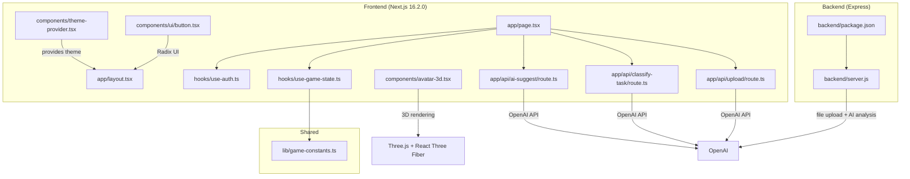
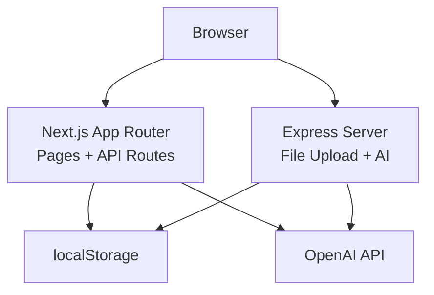
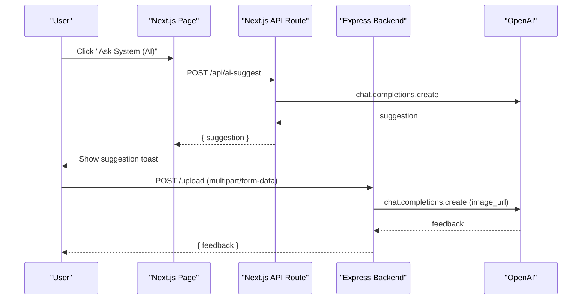
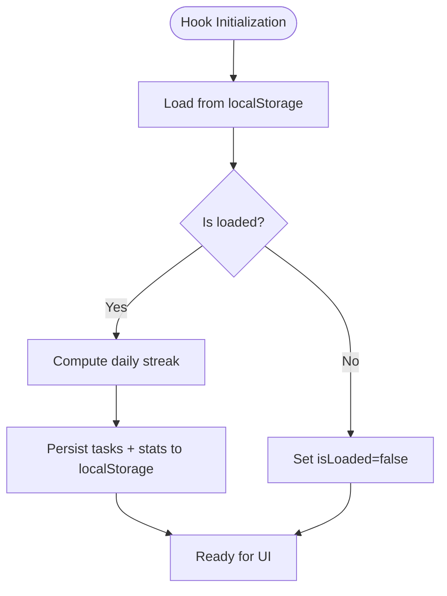
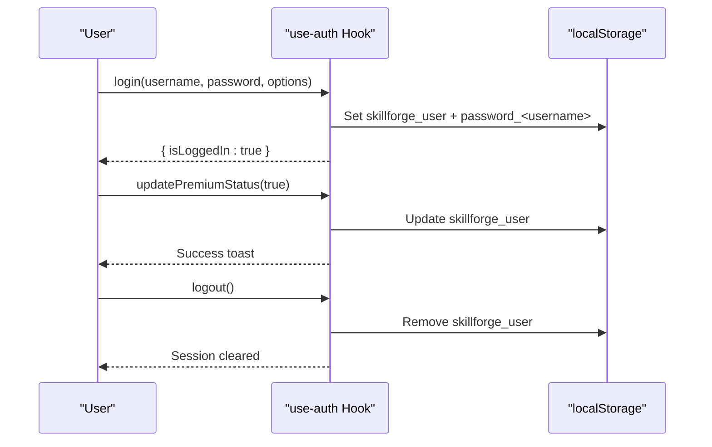
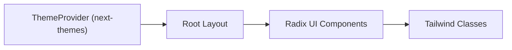
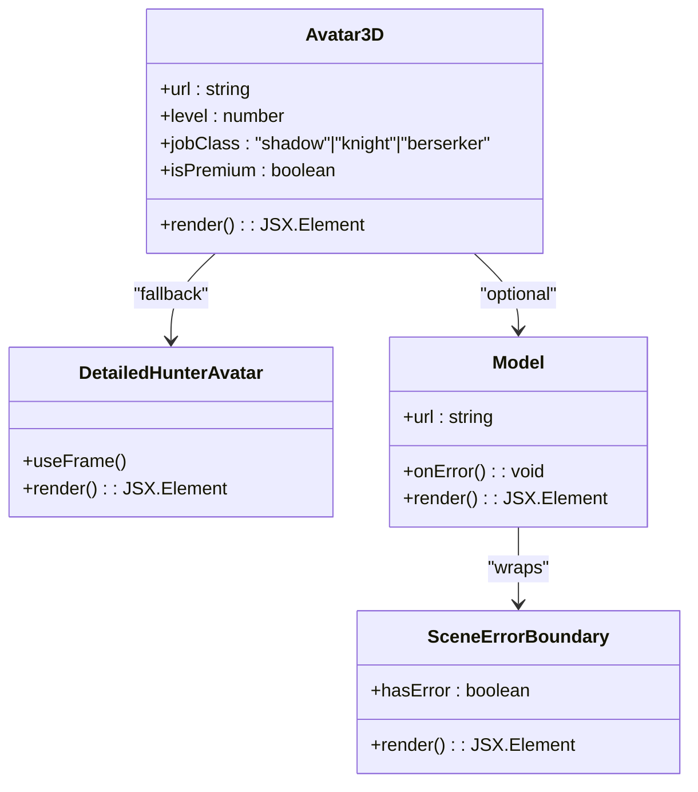
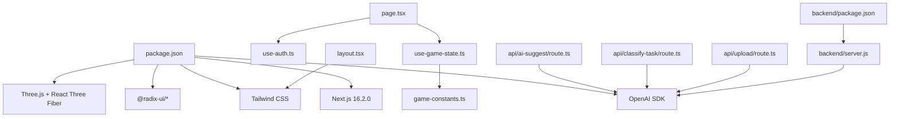

# Architecture Overview

<cite>
**Referenced Files in This Document**
- [package.json](file://package.json)
- [next.config.mjs](file://next.config.mjs)
- [backend/package.json](file://backend/package.json)
- [backend/server.js](file://backend/server.js)
- [hooks/use-game-state.ts](file://hooks/use-game-state.ts)
- [hooks/use-auth.ts](file://hooks/use-auth.ts)
- [lib/game-constants.ts](file://lib/game-constants.ts)
- [app/layout.tsx](file://app/layout.tsx)
- [app/page.tsx](file://app/page.tsx)
- [app/api/ai-suggest/route.ts](file://app/api/ai-suggest/route.ts)
- [app/api/classify-task/route.ts](file://app/api/classify-task/route.ts)
- [app/api/upload/route.ts](file://app/api/upload/route.ts)
- [components/theme-provider.tsx](file://components/theme-provider.tsx)
- [components/avatar-3d.tsx](file://components/avatar-3d.tsx)
- [components/ui/button.tsx](file://components/ui/button.tsx)
</cite>

## Table of Contents
1. [Introduction](#introduction)
2. [Project Structure](#project-structure)
3. [Core Components](#core-components)
4. [Architecture Overview](#architecture-overview)
5. [Detailed Component Analysis](#detailed-component-analysis)
6. [Dependency Analysis](#dependency-analysis)
7. [Performance Considerations](#performance-considerations)
8. [Troubleshooting Guide](#troubleshooting-guide)
9. [Conclusion](#conclusion)

## Introduction
This document describes the system architecture of Solo Leveling Manager, a hybrid full-stack application that blends a modern Next.js 16.2.0 frontend with Express.js backend services. The frontend is built with React 19 and a component-based design, augmented by custom hooks for state management and persistence. The system integrates AI features via OpenAI, provides a 3D avatar experience using Three.js and React Three Fiber, and ensures accessibility and consistency through Radix UI primitives and Tailwind CSS. Cross-cutting concerns include theming, authentication, state synchronization, and real-time-like updates through optimistic UI patterns.

## Project Structure
The repository follows a clear separation of concerns:
- Frontend (Next.js app directory): Pages, API routes, components, hooks, and shared UI primitives
- Backend (Express server): Standalone service exposing REST endpoints for AI and file upload
- Shared libraries: Game constants and utilities
- Styling and theming: Tailwind CSS and next-themes provider

**Diagram sources**
- [app/layout.tsx:1-48](file://app/layout.tsx#L1-L48)
- [app/page.tsx:1-255](file://app/page.tsx#L1-L255)
- [hooks/use-auth.ts:1-122](file://hooks/use-auth.ts#L1-L122)
- [hooks/use-game-state.ts:1-252](file://hooks/use-game-state.ts#L1-L252)
- [components/theme-provider.tsx:1-12](file://components/theme-provider.tsx#L1-L12)
- [components/ui/button.tsx:1-61](file://components/ui/button.tsx#L1-L61)
- [components/avatar-3d.tsx:1-529](file://components/avatar-3d.tsx#L1-L529)
- [app/api/ai-suggest/route.ts:1-34](file://app/api/ai-suggest/route.ts#L1-L34)
- [app/api/classify-task/route.ts:1-43](file://app/api/classify-task/route.ts#L1-L43)
- [app/api/upload/route.ts:1-43](file://app/api/upload/route.ts#L1-L43)
- [backend/server.js:1-155](file://backend/server.js#L1-L155)
- [lib/game-constants.ts:1-95](file://lib/game-constants.ts#L1-L95)

**Section sources**
- [package.json:1-78](file://package.json#L1-L78)
- [next.config.mjs:1-15](file://next.config.mjs#L1-L15)
- [backend/package.json:1-13](file://backend/package.json#L1-L13)
- [backend/server.js:1-155](file://backend/server.js#L1-L155)

## Core Components
- Centralized game state management via a custom React hook with local storage persistence
- Authentication state persisted in localStorage with helpers for profile updates
- Theming provider for light/dark mode support
- Accessible UI primitives powered by Radix UI
- 3D avatar rendering with procedural geometry and GLTF model fallback
- AI-powered features exposed through Next.js App Router API routes and a separate Express backend

Key implementation references:
- Game state hook and XP/level calculations: [hooks/use-game-state.ts:1-252](file://hooks/use-game-state.ts#L1-L252), [lib/game-constants.ts:1-95](file://lib/game-constants.ts#L1-L95)
- Authentication hook: [hooks/use-auth.ts:1-122](file://hooks/use-auth.ts#L1-L122)
- Theming provider: [components/theme-provider.tsx:1-12](file://components/theme-provider.tsx#L1-L12)
- 3D avatar component: [components/avatar-3d.tsx:1-529](file://components/avatar-3d.tsx#L1-L529)
- Next.js API routes for AI: [app/api/ai-suggest/route.ts:1-34](file://app/api/ai-suggest/route.ts#L1-L34), [app/api/classify-task/route.ts:1-43](file://app/api/classify-task/route.ts#L1-L43), [app/api/upload/route.ts:1-43](file://app/api/upload/route.ts#L1-L43)

**Section sources**
- [hooks/use-game-state.ts:1-252](file://hooks/use-game-state.ts#L1-L252)
- [hooks/use-auth.ts:1-122](file://hooks/use-auth.ts#L1-L122)
- [lib/game-constants.ts:1-95](file://lib/game-constants.ts#L1-L95)
- [components/theme-provider.tsx:1-12](file://components/theme-provider.tsx#L1-L12)
- [components/avatar-3d.tsx:1-529](file://components/avatar-3d.tsx#L1-L529)
- [app/api/ai-suggest/route.ts:1-34](file://app/api/ai-suggest/route.ts#L1-L34)
- [app/api/classify-task/route.ts:1-43](file://app/api/classify-task/route.ts#L1-L43)
- [app/api/upload/route.ts:1-43](file://app/api/upload/route.ts#L1-L43)

## Architecture Overview
The system employs a hybrid full-stack architecture:
- Frontend: Next.js App Router handles pages, API routes, and client-side hydration. It integrates Radix UI for accessible components, Tailwind CSS for styling, and next-themes for theme switching.
- Backend: An Express server provides endpoints for file uploads and AI analysis, complementing Next.js API routes for AI suggestions.
- AI integration: Both Next.js API routes and the Express backend call OpenAI to generate suggestions, classify tasks, and analyze uploaded images.
- 3D graphics: React Three Fiber renders a procedurally generated avatar with optional GLTF model fallback and premium effects.
- Persistence: Local storage stores both authentication state and game progress, enabling offline-friendly UX.

**Diagram sources**
- [app/page.tsx:1-255](file://app/page.tsx#L1-L255)
- [app/api/ai-suggest/route.ts:1-34](file://app/api/ai-suggest/route.ts#L1-L34)
- [app/api/classify-task/route.ts:1-43](file://app/api/classify-task/route.ts#L1-L43)
- [app/api/upload/route.ts:1-43](file://app/api/upload/route.ts#L1-L43)
- [backend/server.js:1-155](file://backend/server.js#L1-L155)
- [hooks/use-auth.ts:1-122](file://hooks/use-auth.ts#L1-L122)
- [hooks/use-game-state.ts:1-252](file://hooks/use-game-state.ts#L1-L252)

## Detailed Component Analysis

### Hybrid Full-Stack Integration
- Next.js API routes encapsulate AI suggestions and classification logic, falling back to mock responses when the OpenAI API key is unavailable.
- The Express server provides file upload and AI analysis endpoints, supporting premium features and simulated payment flows.
- The frontend communicates with both layers via fetch requests to Next.js routes and direct backend endpoints.

**Diagram sources**
- [app/page.tsx:25-54](file://app/page.tsx#L25-L54)
- [app/api/ai-suggest/route.ts:8-33](file://app/api/ai-suggest/route.ts#L8-L33)
- [backend/server.js:111-135](file://backend/server.js#L111-L135)

**Section sources**
- [app/page.tsx:25-54](file://app/page.tsx#L25-L54)
- [app/api/ai-suggest/route.ts:1-34](file://app/api/ai-suggest/route.ts#L1-L34)
- [app/api/classify-task/route.ts:1-43](file://app/api/classify-task/route.ts#L1-L43)
- [app/api/upload/route.ts:1-43](file://app/api/upload/route.ts#L1-L43)
- [backend/server.js:111-135](file://backend/server.js#L111-L135)

### Centralized Game State Management
The use-game-state hook centralizes task and player statistics management with:
- Local storage persistence keyed under a dedicated storage identifier
- Streak calculation based on completed tasks per day
- XP and level computation using exponential scaling
- Achievement unlocking with toast notifications

**Diagram sources**
- [hooks/use-game-state.ts:51-82](file://hooks/use-game-state.ts#L51-L82)
- [hooks/use-game-state.ts:84-125](file://hooks/use-game-state.ts#L84-L125)
- [lib/game-constants.ts:13-48](file://lib/game-constants.ts#L13-L48)

**Section sources**
- [hooks/use-game-state.ts:1-252](file://hooks/use-game-state.ts#L1-L252)
- [lib/game-constants.ts:1-95](file://lib/game-constants.ts#L1-L95)

### Authentication and Profile Management
The use-auth hook manages user sessions and profile updates:
- Login persists user data and a simple credential mapping in localStorage
- Updates for premium status, cosmetic selection, avatar URL, and job class are persisted atomically
- Logout clears stored credentials and resets state

**Diagram sources**
- [hooks/use-auth.ts:14-121](file://hooks/use-auth.ts#L14-L121)

**Section sources**
- [hooks/use-auth.ts:1-122](file://hooks/use-auth.ts#L1-L122)

### Theming and Styling
- next-themes provides theme switching with a provider wrapping the root layout
- Tailwind CSS classes define responsive layouts and component styles
- Radix UI components offer accessible base primitives for buttons, dialogs, forms, and more

**Diagram sources**
- [components/theme-provider.tsx:9-11](file://components/theme-provider.tsx#L9-L11)
- [app/layout.tsx:33-47](file://app/layout.tsx#L33-L47)
- [components/ui/button.tsx:1-61](file://components/ui/button.tsx#L1-L61)

**Section sources**
- [components/theme-provider.tsx:1-12](file://components/theme-provider.tsx#L1-L12)
- [app/layout.tsx:1-48](file://app/layout.tsx#L1-L48)
- [components/ui/button.tsx:1-61](file://components/ui/button.tsx#L1-L61)

### 3D Avatar Rendering
The Avatar3D component composes:
- Procedural geometry for a base avatar and equipment
- Optional GLTF model loading with error boundary fallback
- Dynamic lighting, environment, and premium effects
- Level-dependent visuals and HUD indicators

**Diagram sources**
- [components/avatar-3d.tsx:473-512](file://components/avatar-3d.tsx#L473-L512)
- [components/avatar-3d.tsx:279-304](file://components/avatar-3d.tsx#L279-L304)
- [components/avatar-3d.tsx:307-363](file://components/avatar-3d.tsx#L307-L363)
- [components/avatar-3d.tsx:366-380](file://components/avatar-3d.tsx#L366-L380)

**Section sources**
- [components/avatar-3d.tsx:1-529](file://components/avatar-3d.tsx#L1-L529)

## Dependency Analysis
The frontend depends on Next.js, React 19, Radix UI, Tailwind CSS, Three.js, React Three Fiber, and OpenAI SDK. The backend depends on Express, CORS, Multer, and OpenAI. The frontend’s API routes and the backend share the OpenAI integration.

**Diagram sources**
- [package.json:11-64](file://package.json#L11-L64)
- [app/layout.tsx:1-48](file://app/layout.tsx#L1-L48)
- [app/page.tsx:1-255](file://app/page.tsx#L1-L255)
- [hooks/use-auth.ts:1-122](file://hooks/use-auth.ts#L1-L122)
- [hooks/use-game-state.ts:1-252](file://hooks/use-game-state.ts#L1-L252)
- [lib/game-constants.ts:1-95](file://lib/game-constants.ts#L1-L95)
- [app/api/ai-suggest/route.ts:1-34](file://app/api/ai-suggest/route.ts#L1-L34)
- [app/api/classify-task/route.ts:1-43](file://app/api/classify-task/route.ts#L1-L43)
- [app/api/upload/route.ts:1-43](file://app/api/upload/route.ts#L1-L43)
- [backend/package.json:4-10](file://backend/package.json#L4-L10)
- [backend/server.js:1-155](file://backend/server.js#L1-L155)

**Section sources**
- [package.json:11-64](file://package.json#L11-L64)
- [backend/package.json:4-10](file://backend/package.json#L4-L10)

## Performance Considerations
- Client-side caching and persistence reduce network requests and improve perceived responsiveness.
- Optimistic UI updates in the game state and authentication hooks minimize latency for user actions.
- Three.js scenes leverage efficient materials and minimal geometry where possible; fallbacks prevent runtime errors.
- Next.js Image optimization and Tailwind’s JIT compilation help keep bundle sizes lean.
- API route mocking avoids blocking the UI when OpenAI keys are missing.

[No sources needed since this section provides general guidance]

## Troubleshooting Guide
Common issues and resolutions:
- Missing OpenAI API key: Next.js API routes return mock suggestions; verify environment variables and rate limits.
- Authentication failures: Confirm localStorage entries and credential mapping; clear stale entries if corrupted.
- 3D model loading errors: The avatar falls back to procedural geometry; check model URLs and CORS.
- Premium feature restrictions: Express endpoints enforce plan checks; simulate upgrades locally for testing.

**Section sources**
- [app/api/ai-suggest/route.ts:12-20](file://app/api/ai-suggest/route.ts#L12-L20)
- [hooks/use-auth.ts:20-27](file://hooks/use-auth.ts#L20-L27)
- [components/avatar-3d.tsx:404-426](file://components/avatar-3d.tsx#L404-L426)
- [backend/server.js:46-52](file://backend/server.js#L46-L52)

## Conclusion
Solo Leveling Manager combines a modern Next.js frontend with an Express backend to deliver a gamified task management experience. The architecture emphasizes component modularity, accessible UI, persistent state, and AI-driven personalization. The hybrid design allows seamless integration of AI features, 3D graphics, and robust state management, while maintaining a clean separation of concerns and scalable development practices.