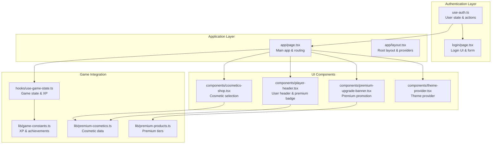
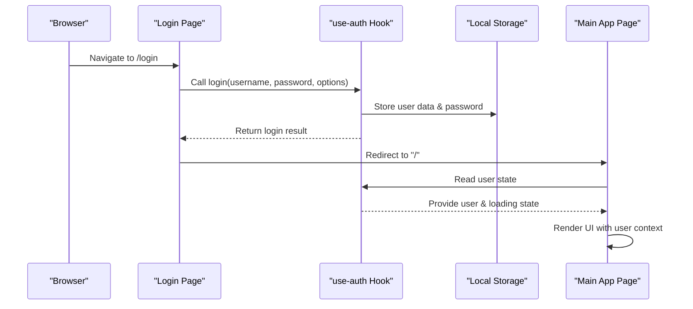
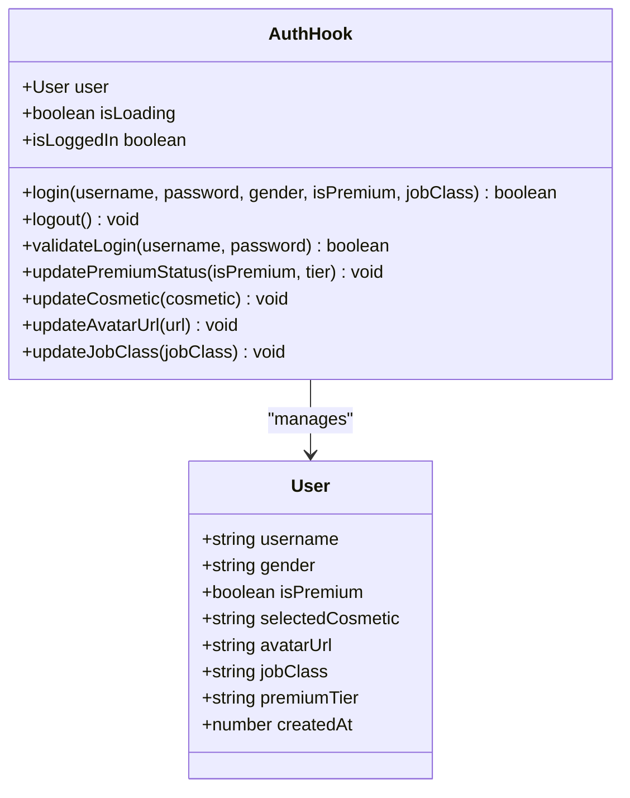
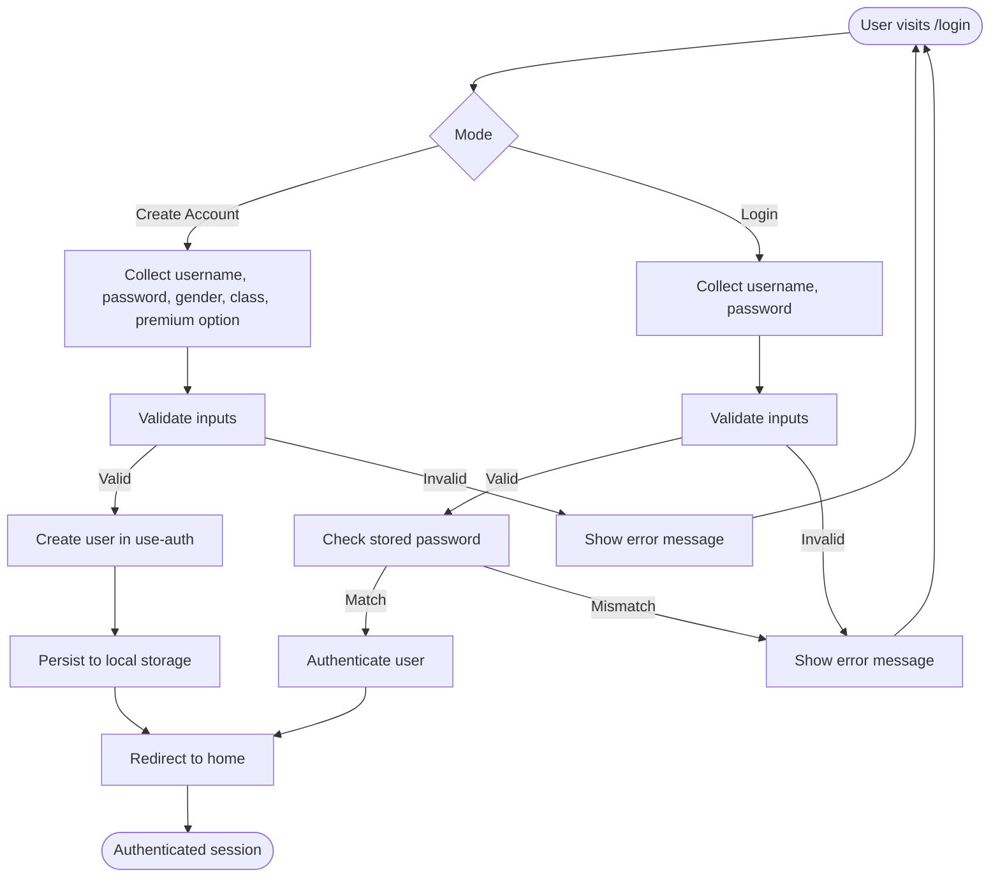
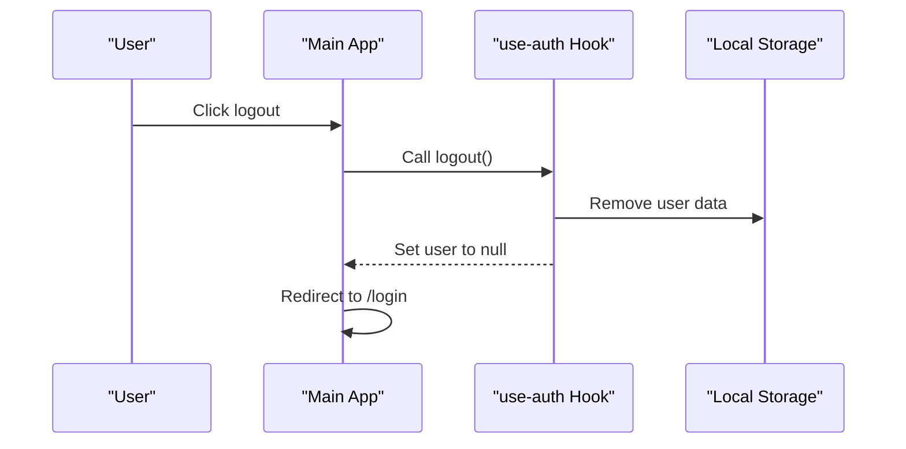
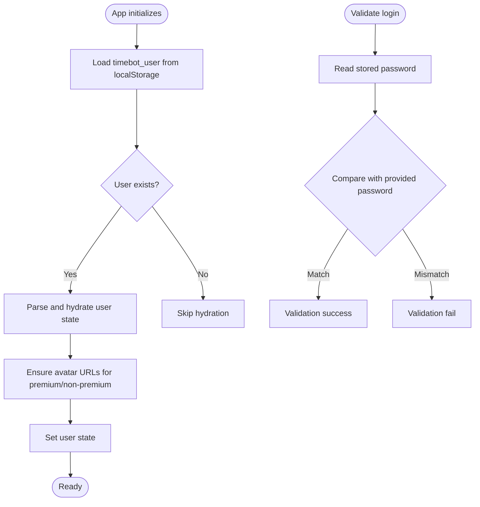
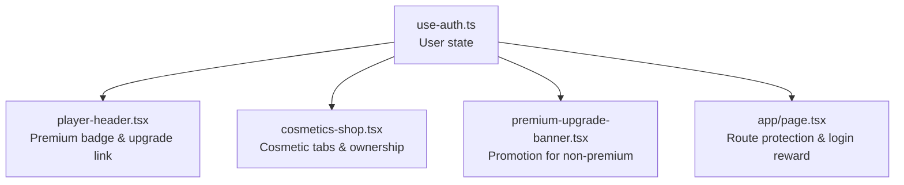
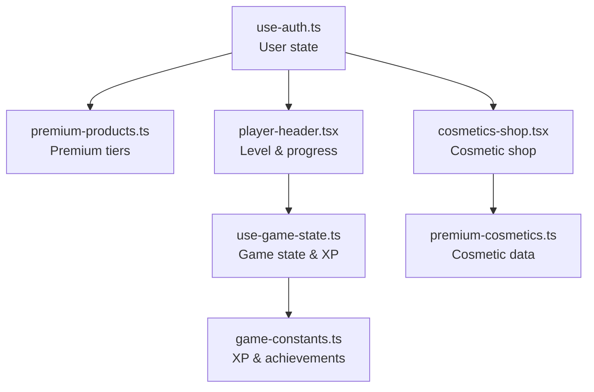
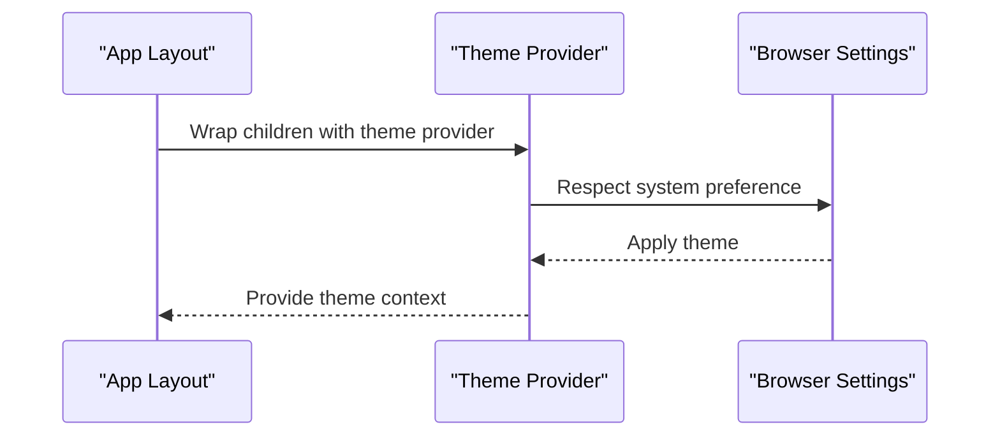
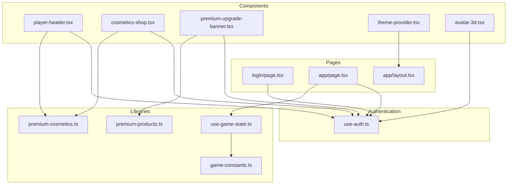

# Authentication System

<cite>
**Referenced Files in This Document**
- [use-auth.ts](file://hooks/use-auth.ts)
- [login/page.tsx](file://app/login/page.tsx)
- [page.tsx](file://app/page.tsx)
- [layout.tsx](file://app/layout.tsx)
- [player-header.tsx](file://components/player-header.tsx)
- [cosmetics-shop.tsx](file://components/cosmetics-shop.tsx)
- [premium-upgrade-banner.tsx](file://components/premium-upgrade-banner.tsx)
- [theme-provider.tsx](file://components/theme-provider.tsx)
- [avatar-3d.tsx](file://components/avatar-3d.tsx)
- [use-game-state.ts](file://hooks/use-game-state.ts)
- [game-constants.ts](file://lib/game-constants.ts)
- [premium-cosmetics.ts](file://lib/premium-cosmetics.ts)
- [premium-products.ts](file://lib/premium-products.ts)
</cite>

## Table of Contents
1. [Introduction](#introduction)
2. [Project Structure](#project-structure)
3. [Core Components](#core-components)
4. [Architecture Overview](#architecture-overview)
5. [Detailed Component Analysis](#detailed-component-analysis)
6. [Dependency Analysis](#dependency-analysis)
7. [Performance Considerations](#performance-considerations)
8. [Troubleshooting Guide](#troubleshooting-guide)
9. [Conclusion](#conclusion)

## Introduction
This document provides comprehensive documentation for the authentication system, focusing on user session management, login/logout workflows, user data persistence, session validation, and authentication hook implementation. It also covers user data structure, profile management, authentication state synchronization across components, integration with the game state system (premium features, cosmetic access, progress tracking), theme provider integration for user preferences, and the overall user experience flow. Security considerations, error handling for authentication failures, and user session timeout management are included, along with practical examples of login flows and user state management.

## Project Structure
The authentication system spans several key areas:
- Hook-based authentication state management
- Login page with interactive UI and form validation
- Main application page orchestrating authentication and game state
- Components consuming authentication state for UI rendering
- Theme provider for user preference management
- Integration with game state and premium features

**Diagram sources**
- [use-auth.ts:28-166](file://hooks/use-auth.ts#L28-L166)
- [login/page.tsx:209-312](file://app/login/page.tsx#L209-L312)
- [page.tsx:24-160](file://app/page.tsx#L24-L160)
- [layout.tsx:33-47](file://app/layout.tsx#L33-L47)
- [player-header.tsx:16-27](file://components/player-header.tsx#L16-L27)
- [cosmetics-shop.tsx:7-17](file://components/cosmetics-shop.tsx#L7-L17)
- [premium-upgrade-banner.tsx:7-12](file://components/premium-upgrade-banner.tsx#L7-L12)
- [theme-provider.tsx:9-11](file://components/theme-provider.tsx#L9-L11)
- [use-game-state.ts:51-251](file://hooks/use-game-state.ts#L51-L251)
- [game-constants.ts:1-95](file://lib/game-constants.ts#L1-L95)
- [premium-cosmetics.ts:1-77](file://lib/premium-cosmetics.ts#L1-L77)
- [premium-products.ts:1-76](file://lib/premium-products.ts#L1-L76)

**Section sources**
- [use-auth.ts:28-166](file://hooks/use-auth.ts#L28-L166)
- [login/page.tsx:209-312](file://app/login/page.tsx#L209-L312)
- [page.tsx:24-160](file://app/page.tsx#L24-L160)
- [layout.tsx:33-47](file://app/layout.tsx#L33-L47)

## Core Components
This section outlines the primary components involved in authentication and user session management.

- Authentication Hook (`use-auth.ts`)
  - Manages user state, loading state, and exposes actions for login, logout, validation, and profile updates.
  - Persists user data and credentials to local storage.
  - Provides convenience methods for updating premium status, cosmetic selection, avatar URL, and job class.

- Login Page (`app/login/page.tsx`)
  - Presents a form for new and returning users.
  - Handles form submission, validation, and navigation after successful authentication.
  - Integrates with the authentication hook to create or validate accounts.

- Main Application Page (`app/page.tsx`)
  - Orchestrates authentication state, redirects unauthenticated users to the login page, and renders the main application UI.
  - Integrates with game state and premium features.

- UI Components Consuming Authentication State
  - Player header displays user information, premium status, and links to premium upgrade.
  - Cosmetics shop allows users to manage avatar cosmetics based on premium status.
  - Premium upgrade banner promotes premium membership for non-premium users.

- Theme Provider (`components/theme-provider.tsx`)
  - Wraps the application to enable theme switching and persistence.

**Section sources**
- [use-auth.ts:28-166](file://hooks/use-auth.ts#L28-L166)
- [login/page.tsx:209-312](file://app/login/page.tsx#L209-L312)
- [page.tsx:24-160](file://app/page.tsx#L24-L160)
- [player-header.tsx:16-27](file://components/player-header.tsx#L16-L27)
- [cosmetics-shop.tsx:7-17](file://components/cosmetics-shop.tsx#L7-L17)
- [premium-upgrade-banner.tsx:7-12](file://components/premium-upgrade-banner.tsx#L7-L12)
- [theme-provider.tsx:9-11](file://components/theme-provider.tsx#L9-L11)

## Architecture Overview
The authentication system follows a client-side state management pattern with local storage persistence. The authentication hook centralizes user state and actions, while pages and components consume this state to render UI and orchestrate workflows.

**Diagram sources**
- [login/page.tsx:270-312](file://app/login/page.tsx#L270-L312)
- [use-auth.ts:60-88](file://hooks/use-auth.ts#L60-L88)
- [page.tsx:105-109](file://app/page.tsx#L105-L109)

**Section sources**
- [login/page.tsx:270-312](file://app/login/page.tsx#L270-L312)
- [use-auth.ts:60-88](file://hooks/use-auth.ts#L60-L88)
- [page.tsx:105-109](file://app/page.tsx#L105-L109)

## Detailed Component Analysis

### Authentication Hook Implementation
The authentication hook encapsulates user state and provides actions for managing sessions and user profiles.

Key responsibilities:
- Initialize user state from local storage on mount
- Validate credentials against stored passwords
- Persist user data and credentials to local storage
- Update user profile attributes (premium status, cosmetic selection, avatar URL, job class)
- Provide loading state and authentication status

**Diagram sources**
- [use-auth.ts:4-13](file://hooks/use-auth.ts#L4-L13)
- [use-auth.ts:28-166](file://hooks/use-auth.ts#L28-L166)

**Section sources**
- [use-auth.ts:28-166](file://hooks/use-auth.ts#L28-L166)

### Login Workflow
The login workflow handles both new user registration and returning user authentication.

**Diagram sources**
- [login/page.tsx:270-312](file://app/login/page.tsx#L270-L312)
- [use-auth.ts:60-88](file://hooks/use-auth.ts#L60-L88)
- [use-auth.ts:149-152](file://hooks/use-auth.ts#L149-L152)

**Section sources**
- [login/page.tsx:270-312](file://app/login/page.tsx#L270-L312)
- [use-auth.ts:60-88](file://hooks/use-auth.ts#L60-L88)
- [use-auth.ts:149-152](file://hooks/use-auth.ts#L149-L152)

### Logout Workflow
The logout workflow clears the user session from local storage and resets the authentication state.

**Diagram sources**
- [page.tsx:153-160](file://app/page.tsx#L153-L160)
- [use-auth.ts:142-147](file://hooks/use-auth.ts#L142-L147)

**Section sources**
- [page.tsx:153-160](file://app/page.tsx#L153-L160)
- [use-auth.ts:142-147](file://hooks/use-auth.ts#L142-L147)

### User Data Persistence and Session Validation
User data and credentials are persisted to local storage with automatic hydration on application load.

**Diagram sources**
- [use-auth.ts:32-58](file://hooks/use-auth.ts#L32-L58)
- [use-auth.ts:149-152](file://hooks/use-auth.ts#L149-L152)

**Section sources**
- [use-auth.ts:32-58](file://hooks/use-auth.ts#L32-L58)
- [use-auth.ts:149-152](file://hooks/use-auth.ts#L149-L152)

### Authentication State Synchronization Across Components
Components consume authentication state to render UI and control access to premium features.

**Diagram sources**
- [use-auth.ts:154-165](file://hooks/use-auth.ts#L154-L165)
- [player-header.tsx:60-74](file://components/player-header.tsx#L60-L74)
- [cosmetics-shop.tsx:13-15](file://components/cosmetics-shop.tsx#L13-L15)
- [premium-upgrade-banner.tsx:10-12](file://components/premium-upgrade-banner.tsx#L10-L12)
- [page.tsx:86-97](file://app/page.tsx#L86-L97)

**Section sources**
- [use-auth.ts:154-165](file://hooks/use-auth.ts#L154-L165)
- [player-header.tsx:60-74](file://components/player-header.tsx#L60-L74)
- [cosmetics-shop.tsx:13-15](file://components/cosmetics-shop.tsx#L13-L15)
- [premium-upgrade-banner.tsx:10-12](file://components/premium-upgrade-banner.tsx#L10-L12)
- [page.tsx:86-97](file://app/page.tsx#L86-L97)

### Integration with Game State System
Authentication influences premium features, cosmetic access, and progress tracking.

**Diagram sources**
- [use-auth.ts:154-165](file://hooks/use-auth.ts#L154-L165)
- [use-game-state.ts:51-251](file://hooks/use-game-state.ts#L51-L251)
- [game-constants.ts:1-95](file://lib/game-constants.ts#L1-L95)
- [premium-cosmetics.ts:1-77](file://lib/premium-cosmetics.ts#L1-L77)
- [premium-products.ts:1-76](file://lib/premium-products.ts#L1-L76)
- [player-header.tsx:21-26](file://components/player-header.tsx#L21-L26)
- [cosmetics-shop.tsx:7-8](file://components/cosmetics-shop.tsx#L7-L8)

**Section sources**
- [use-auth.ts:154-165](file://hooks/use-auth.ts#L154-L165)
- [use-game-state.ts:51-251](file://hooks/use-game-state.ts#L51-L251)
- [game-constants.ts:1-95](file://lib/game-constants.ts#L1-L95)
- [premium-cosmetics.ts:1-77](file://lib/premium-cosmetics.ts#L1-L77)
- [premium-products.ts:1-76](file://lib/premium-products.ts#L1-L76)
- [player-header.tsx:21-26](file://components/player-header.tsx#L21-L26)
- [cosmetics-shop.tsx:7-8](file://components/cosmetics-shop.tsx#L7-L8)

### Theme Provider Integration
The theme provider enables user preference management for light/dark themes.

**Diagram sources**
- [layout.tsx:38-47](file://app/layout.tsx#L38-L47)
- [theme-provider.tsx:9-11](file://components/theme-provider.tsx#L9-L11)

**Section sources**
- [layout.tsx:38-47](file://app/layout.tsx#L38-L47)
- [theme-provider.tsx:9-11](file://components/theme-provider.tsx#L9-L11)

## Dependency Analysis
The authentication system exhibits clear separation of concerns with minimal coupling between modules.

**Diagram sources**
- [use-auth.ts:28-166](file://hooks/use-auth.ts#L28-L166)
- [login/page.tsx:209-312](file://app/login/page.tsx#L209-L312)
- [page.tsx:24-160](file://app/page.tsx#L24-L160)
- [layout.tsx:33-47](file://app/layout.tsx#L33-L47)
- [player-header.tsx:16-27](file://components/player-header.tsx#L16-L27)
- [cosmetics-shop.tsx:7-17](file://components/cosmetics-shop.tsx#L7-L17)
- [premium-upgrade-banner.tsx:7-12](file://components/premium-upgrade-banner.tsx#L7-L12)
- [theme-provider.tsx:9-11](file://components/theme-provider.tsx#L9-L11)
- [avatar-3d.tsx:9-15](file://components/avatar-3d.tsx#L9-L15)
- [use-game-state.ts:51-251](file://hooks/use-game-state.ts#L51-L251)
- [game-constants.ts:1-95](file://lib/game-constants.ts#L1-L95)
- [premium-cosmetics.ts:1-77](file://lib/premium-cosmetics.ts#L1-L77)
- [premium-products.ts:1-76](file://lib/premium-products.ts#L1-L76)

**Section sources**
- [use-auth.ts:28-166](file://hooks/use-auth.ts#L28-L166)
- [login/page.tsx:209-312](file://app/login/page.tsx#L209-L312)
- [page.tsx:24-160](file://app/page.tsx#L24-L160)
- [layout.tsx:33-47](file://app/layout.tsx#L33-L47)
- [player-header.tsx:16-27](file://components/player-header.tsx#L16-L27)
- [cosmetics-shop.tsx:7-17](file://components/cosmetics-shop.tsx#L7-L17)
- [premium-upgrade-banner.tsx:7-12](file://components/premium-upgrade-banner.tsx#L7-L12)
- [theme-provider.tsx:9-11](file://components/theme-provider.tsx#L9-L11)
- [avatar-3d.tsx:9-15](file://components/avatar-3d.tsx#L9-L15)
- [use-game-state.ts:51-251](file://hooks/use-game-state.ts#L51-L251)
- [game-constants.ts:1-95](file://lib/game-constants.ts#L1-L95)
- [premium-cosmetics.ts:1-77](file://lib/premium-cosmetics.ts#L1-L77)
- [premium-products.ts:1-76](file://lib/premium-products.ts#L1-L76)

## Performance Considerations
- Local storage operations are synchronous and should be minimized to avoid blocking the UI thread.
- The authentication hook performs hydration on mount; ensure initial render is fast by keeping serialized user data compact.
- Consider debouncing frequent updates to user preferences (e.g., cosmetic selection) to reduce unnecessary re-renders.
- For large-scale applications, consider migrating to a secure backend with server-side sessions and token refresh mechanisms.

## Troubleshooting Guide
Common issues and resolutions:
- Authentication fails silently
  - Verify input validation and error messages in the login form.
  - Check local storage keys for user data and stored passwords.
  - Ensure the authentication hook returns appropriate boolean values for login and validation.

- User avatar not displaying
  - Confirm avatar URL resolution logic for premium and non-premium users.
  - Verify that default avatar URLs are set when missing.

- Premium features not unlocking
  - Ensure premium status updates propagate to local storage and UI components.
  - Check cosmetic tab visibility logic for premium users.

- Session not persisting across browser restarts
  - Confirm local storage persistence and hydration logic.
  - Verify that user data is properly serialized and deserialized.

**Section sources**
- [login/page.tsx:270-312](file://app/login/page.tsx#L270-L312)
- [use-auth.ts:32-58](file://hooks/use-auth.ts#L32-L58)
- [use-auth.ts:90-109](file://hooks/use-auth.ts#L90-L109)
- [cosmetics-shop.tsx:13-15](file://components/cosmetics-shop.tsx#L13-L15)

## Conclusion
The authentication system provides a robust, client-side solution for user session management with clear separation of concerns and seamless integration with the game state system. By leveraging local storage for persistence and React hooks for state management, the system offers a responsive user experience with premium feature gating and cosmetic customization. Future enhancements could include server-side session management, token-based authentication, and improved error handling and session timeout management.