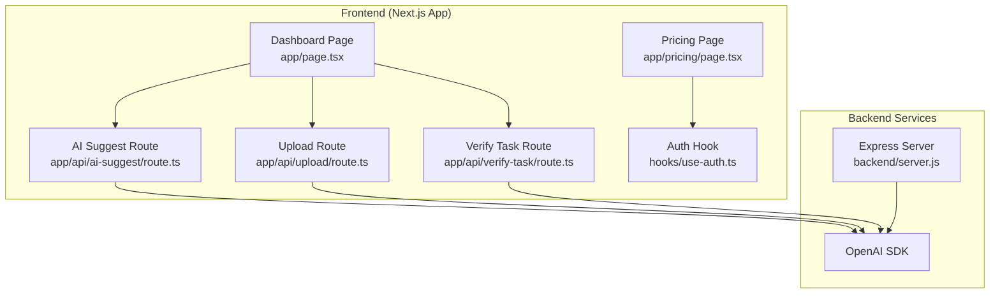
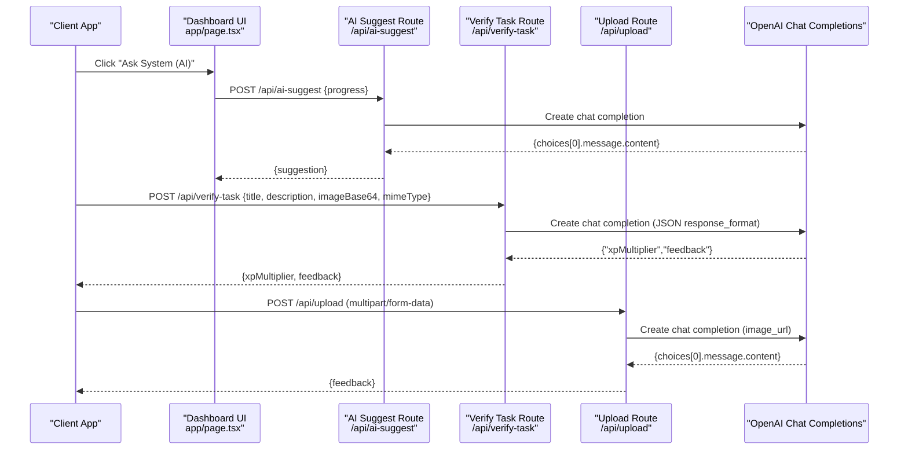
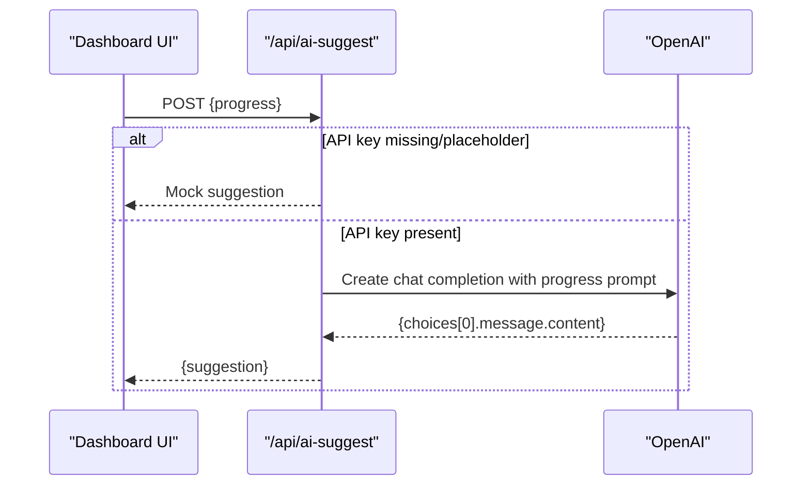
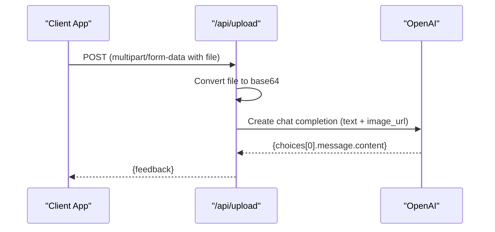
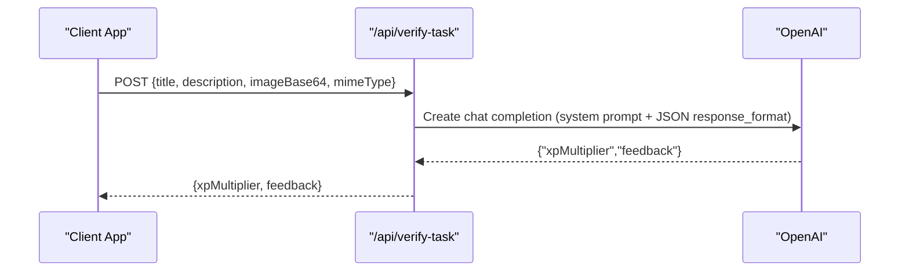
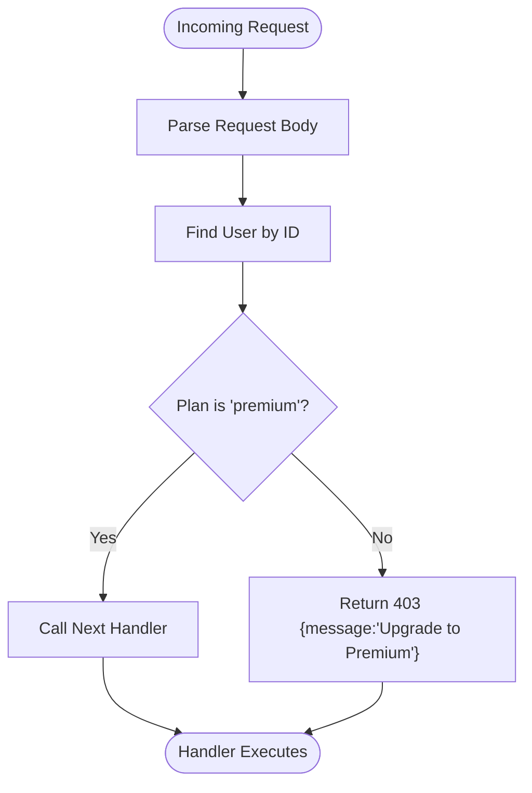
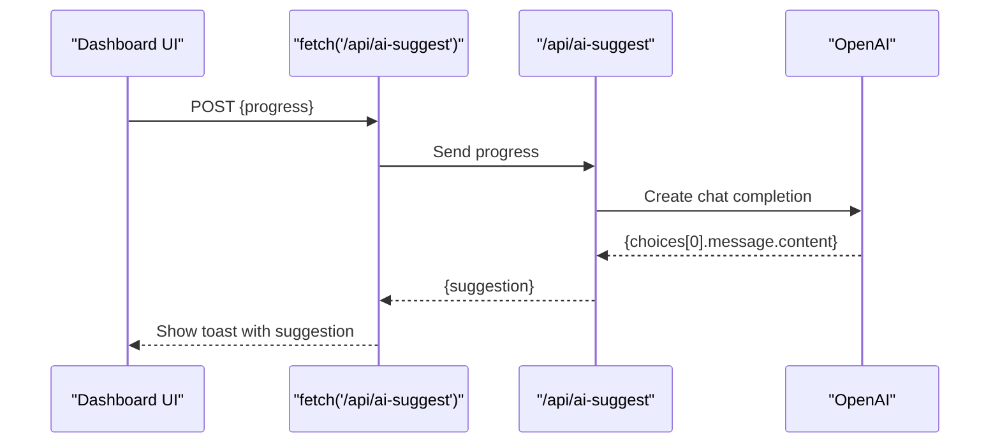
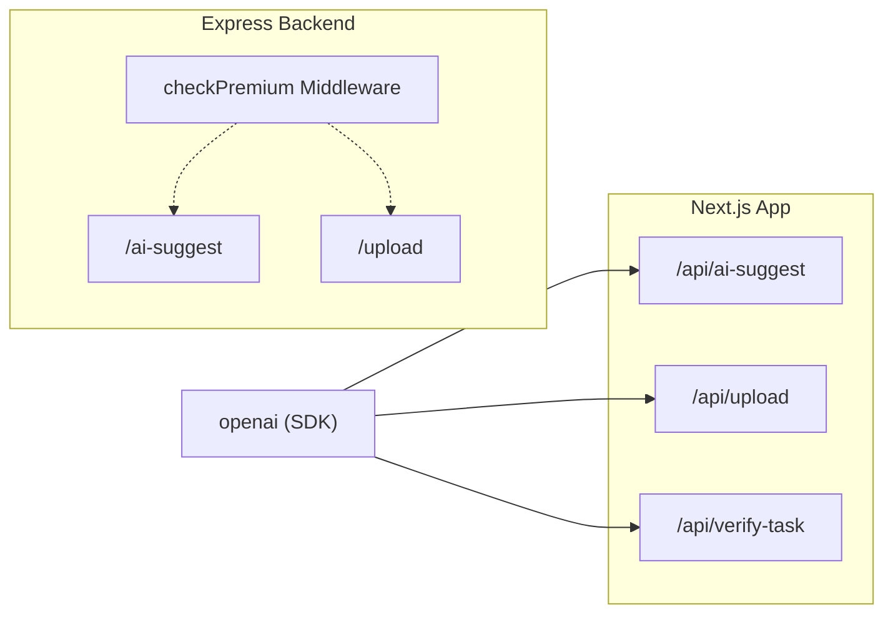

# AI Integration API

<cite>
**Referenced Files in This Document**
- [route.ts](file://app/api/ai-suggest/route.ts)
- [route.ts](file://app/api/upload/route.ts)
- [route.ts](file://app/api/verify-task/route.ts)
- [page.tsx](file://app/page.tsx)
- [use-auth.ts](file://hooks/use-auth.ts)
- [premium-products.ts](file://lib/premium-products.ts)
- [premium-upgrade-banner.tsx](file://components/premium-upgrade-banner.tsx)
- [server.js](file://backend/server.js)
- [index.html](file://backend/index.html)
- [package.json](file://package.json)
- [package.json](file://backend/package.json)
</cite>

## Table of Contents
1. [Introduction](#introduction)
2. [Project Structure](#project-structure)
3. [Core Components](#core-components)
4. [Architecture Overview](#architecture-overview)
5. [Detailed Component Analysis](#detailed-component-analysis)
6. [Dependency Analysis](#dependency-analysis)
7. [Performance Considerations](#performance-considerations)
8. [Troubleshooting Guide](#troubleshooting-guide)
9. [Security Considerations](#security-considerations)
10. [Conclusion](#conclusion)

## Introduction
This document provides comprehensive API documentation for AI-powered endpoints focused on intelligent task recommendations and image analysis with AI feedback. It covers:
- Endpoints: /api/ai-suggest for progress-based suggestions and /api/upload for image analysis
- Premium-only access control using the checkPremium middleware pattern
- OpenAI integration patterns, request formatting for chat completions, and response processing
- Examples of progress-based task suggestions and image analysis workflows
- Error handling for AI service failures, rate limiting considerations, fallback mechanisms, and frontend integration patterns
- Security considerations for API key management and request validation

## Project Structure
The AI integration spans the Next.js app routes under app/api and a legacy Express backend for comparison and demonstration. The frontend integrates AI suggestions into the main dashboard and manages premium upgrades.

**Diagram sources**
- [route.ts](file://app/api/ai-suggest/route.ts)
- [route.ts](file://app/api/upload/route.ts)
- [route.ts](file://app/api/verify-task/route.ts)
- [page.tsx](file://app/page.tsx)
- [use-auth.ts](file://hooks/use-auth.ts)
- [server.js](file://backend/server.js)

**Section sources**
- [route.ts](file://app/api/ai-suggest/route.ts)
- [route.ts](file://app/api/upload/route.ts)
- [route.ts](file://app/api/verify-task/route.ts)
- [page.tsx](file://app/page.tsx)
- [use-auth.ts](file://hooks/use-auth.ts)
- [server.js](file://backend/server.js)

## Core Components
- AI Suggest Endpoint (/api/ai-suggest): Accepts progress payload and returns a gamified task suggestion using OpenAI chat completions.
- Upload Endpoint (/api/upload): Accepts an image file, converts it to base64, and requests feedback from OpenAI chat completions.
- Verify Task Endpoint (/api/verify-task): Accepts task metadata and an image, evaluates proof of completion, and returns an XP multiplier and feedback.
- Frontend Integration: The dashboard triggers AI suggestions and displays results; premium upgrade flow is managed via the auth hook and pricing page.
- Premium Access Control: The Express backend demonstrates a middleware pattern (checkPremium) used to gate premium features.

**Section sources**
- [route.ts](file://app/api/ai-suggest/route.ts)
- [route.ts](file://app/api/upload/route.ts)
- [route.ts](file://app/api/verify-task/route.ts)
- [page.tsx](file://app/page.tsx)
- [use-auth.ts](file://hooks/use-auth.ts)
- [server.js](file://backend/server.js)

## Architecture Overview
The AI endpoints integrate with OpenAI’s chat completions API. Requests are formatted with structured prompts and optional multimodal content (text + image). Responses are parsed and returned to the client. Premium features are gated by a middleware pattern demonstrated in the backend.

**Diagram sources**
- [route.ts](file://app/api/ai-suggest/route.ts)
- [route.ts](file://app/api/verify-task/route.ts)
- [route.ts](file://app/api/upload/route.ts)
- [page.tsx](file://app/page.tsx)

## Detailed Component Analysis

### AI Suggest Endpoint (/api/ai-suggest)
Purpose: Generate progress-based, gamified task suggestions using OpenAI chat completions.

Key behaviors:
- Validates presence of OpenAI API key; returns mock suggestions if missing or placeholder.
- Constructs a prompt embedding the user’s progress (level, completed tasks count, active task titles).
- Calls OpenAI chat completions with a concise instruction to keep suggestions brief, gamified, and punchy.
- Returns the generated suggestion to the client.

**Diagram sources**
- [route.ts](file://app/api/ai-suggest/route.ts)
- [page.tsx](file://app/page.tsx)

**Section sources**
- [route.ts](file://app/api/ai-suggest/route.ts)
- [page.tsx](file://app/page.tsx)

### Upload Endpoint (/api/upload)
Purpose: Analyze uploaded images as proof of quest completion and return AI feedback.

Key behaviors:
- Parses multipart/form-data to extract the file.
- Converts the file to base64 and constructs a multimodal message containing text and image_url.
- Calls OpenAI chat completions to evaluate the image and provide brief, encouraging feedback.
- Returns the feedback to the client.

**Diagram sources**
- [route.ts](file://app/api/upload/route.ts)

**Section sources**
- [route.ts](file://app/api/upload/route.ts)

### Verify Task Endpoint (/api/verify-task)
Purpose: Evaluate proof of completion images and return an XP multiplier along with feedback.

Key behaviors:
- Accepts task title, description, base64 image, and MIME type.
- Uses a system prompt instructing the model to return a JSON object with xpMultiplier and feedback.
- Sets response_format to json_object to enforce structured output.
- Parses the JSON response and returns normalized fields to the client.

**Diagram sources**
- [route.ts](file://app/api/verify-task/route.ts)

**Section sources**
- [route.ts](file://app/api/verify-task/route.ts)

### Premium Access Control Pattern
The Express backend demonstrates a reusable middleware (checkPremium) that validates user plan and blocks non-premium requests to premium endpoints. While the Next.js app currently does not enforce this middleware at runtime, the pattern is documented here for consistency and future alignment.

**Diagram sources**
- [server.js](file://backend/server.js)

**Section sources**
- [server.js](file://backend/server.js)

### Frontend Integration Patterns
- Dashboard integration: The main page triggers AI suggestions by sending the current game state (level, completed tasks, active tasks) to /api/ai-suggest and displays the suggestion as a toast notification.
- Premium upgrade flow: The pricing page updates local user state and premium tier, enabling premium features and avatar customization.

**Diagram sources**
- [page.tsx](file://app/page.tsx)
- [route.ts](file://app/api/ai-suggest/route.ts)

**Section sources**
- [page.tsx](file://app/page.tsx)
- [premium-upgrade-banner.tsx](file://components/premium-upgrade-banner.tsx)
- [premium-products.ts](file://lib/premium-products.ts)
- [use-auth.ts](file://hooks/use-auth.ts)

## Dependency Analysis
External dependencies relevant to AI integration:
- OpenAI SDK: Used by all AI endpoints to call chat completions.
- Next.js App: Routes under app/api expose the AI endpoints.
- Express Backend: Demonstrates middleware and endpoint patterns for comparison.

**Diagram sources**
- [route.ts](file://app/api/ai-suggest/route.ts)
- [route.ts](file://app/api/upload/route.ts)
- [route.ts](file://app/api/verify-task/route.ts)
- [server.js](file://backend/server.js)
- [package.json](file://package.json)
- [package.json](file://backend/package.json)

**Section sources**
- [package.json](file://package.json)
- [package.json](file://backend/package.json)
- [server.js](file://backend/server.js)

## Performance Considerations
- Model selection: The endpoints use gpt-4o-mini, a cost-effective and fast model suitable for lightweight prompts and multimodal inputs.
- Prompt efficiency: Keep prompts concise and structured to reduce token usage and latency.
- Image payload size: Base64 conversion increases size by ~33%; consider optimizing image resolution or MIME type to balance quality and performance.
- Rate limits: Respect OpenAI rate limits; implement client-side retry/backoff and server-side throttling if scaling.
- Caching: Cache static prompts and mock responses for offline or low-latency scenarios where appropriate.
- Streaming: For long-form feedback, consider streaming responses to improve perceived performance.

## Troubleshooting Guide
Common issues and resolutions:
- Missing or invalid API key:
  - Symptom: Mock suggestions returned or 500 errors.
  - Resolution: Set a valid OPENAI_API_KEY in environment variables.
- Malformed request:
  - Symptom: 400 errors for missing fields (e.g., file or progress).
  - Resolution: Ensure proper JSON payload for /api/ai-suggest and multipart/form-data for /api/upload.
- OpenAI service failure:
  - Symptom: 500 errors with error message.
  - Resolution: Retry with exponential backoff; log errors; provide user-friendly messages.
- Premium access denied:
  - Symptom: 403 responses when accessing premium endpoints.
  - Resolution: Redirect users to upgrade; ensure user state reflects premium status.

**Section sources**
- [route.ts](file://app/api/ai-suggest/route.ts)
- [route.ts](file://app/api/upload/route.ts)
- [route.ts](file://app/api/verify-task/route.ts)
- [server.js](file://backend/server.js)

## Security Considerations
- API key management:
  - Store OPENAI_API_KEY in environment variables; never expose it in client-side code.
  - Use server-side routes (/api/*) to encapsulate API key usage.
- Request validation:
  - Validate and sanitize incoming payloads (progress, file metadata).
  - Enforce file type and size limits for uploads.
- CORS and origin policies:
  - Configure CORS appropriately in production environments.
- Input sanitization:
  - Avoid echoing raw user input in prompts; sanitize and truncate to prevent prompt injection.
- Transport security:
  - Use HTTPS in production to protect data in transit.

**Section sources**
- [route.ts](file://app/api/ai-suggest/route.ts)
- [route.ts](file://app/api/upload/route.ts)
- [route.ts](file://app/api/verify-task/route.ts)
- [server.js](file://backend/server.js)

## Conclusion
The AI Integration API provides two primary capabilities: intelligent task recommendations based on user progress and AI-powered image analysis for proof-of-completion feedback. The endpoints leverage OpenAI’s chat completions with concise, gamified prompts and multimodal inputs. Premium access control is demonstrated via a reusable middleware pattern, and the frontend integrates these features seamlessly into the user experience. By following the performance, troubleshooting, and security recommendations, the system remains robust, scalable, and secure.