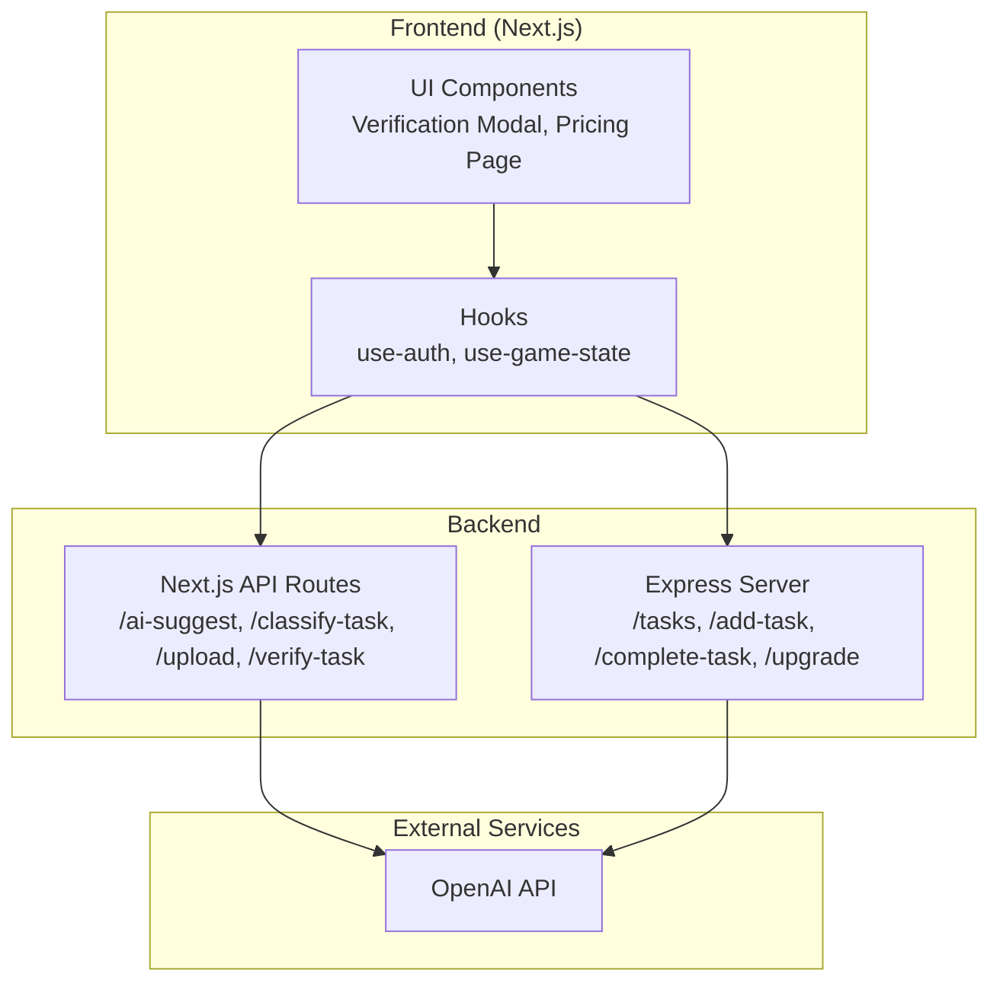
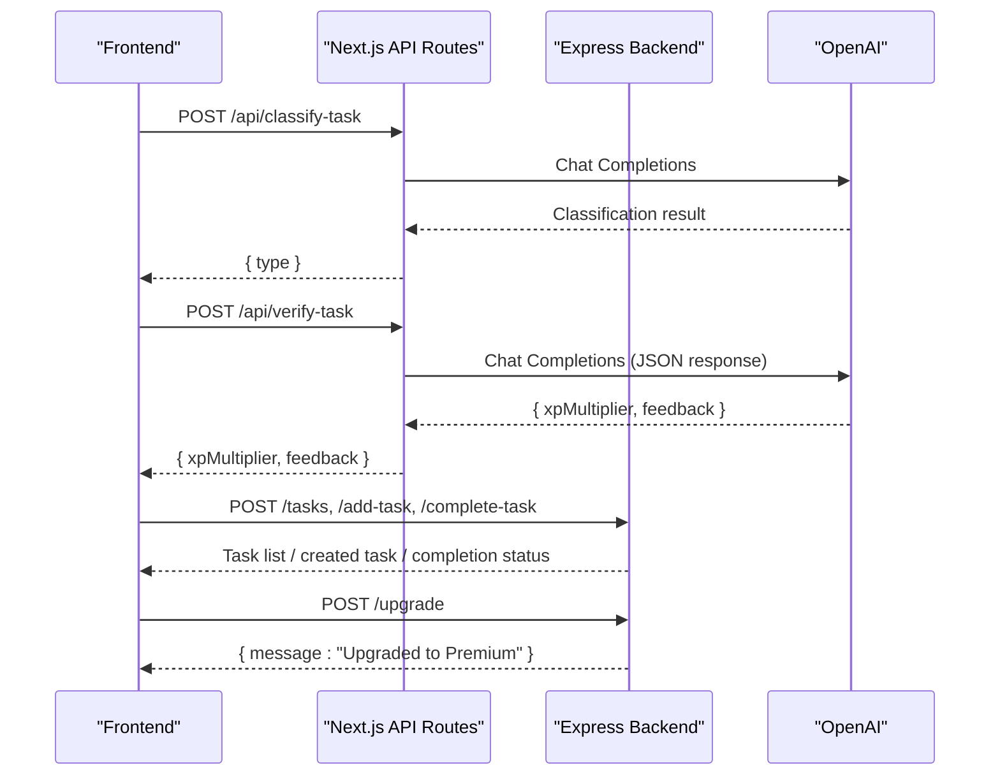
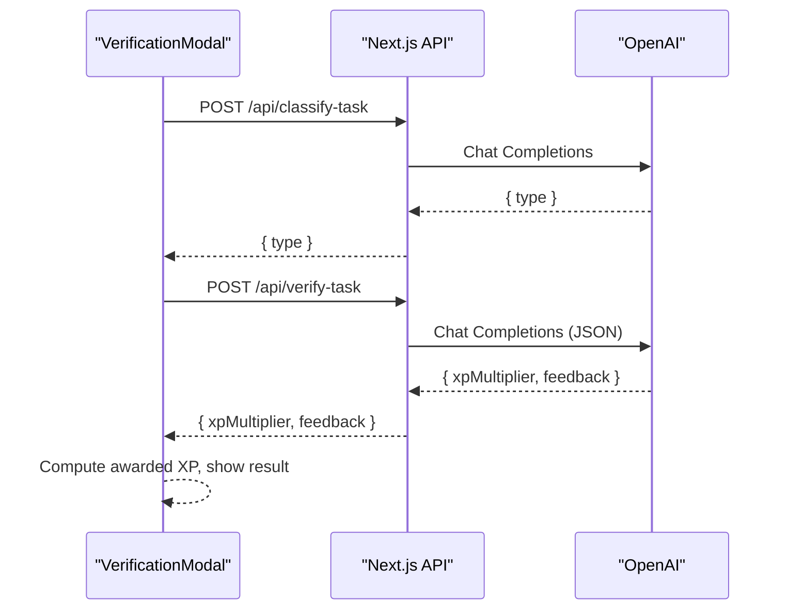
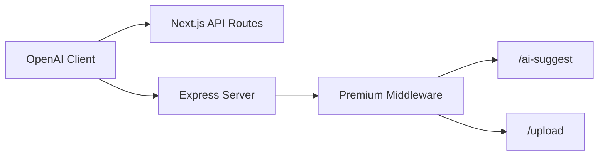

# API Endpoints

<cite>
**Referenced Files in This Document**
- [route.ts](file://app/api/ai-suggest/route.ts)
- [route.ts](file://app/api/classify-task/route.ts)
- [route.ts](file://app/api/upload/route.ts)
- [route.ts](file://app/api/verify-task/route.ts)
- [server.js](file://backend/server.js)
- [page.tsx](file://app/pricing/page.tsx)
- [use-auth.ts](file://hooks/use-auth.ts)
- [verification-modal.tsx](file://components/verification-modal.tsx)
- [use-game-state.ts](file://hooks/use-game-state.ts)
- [game-constants.ts](file://lib/game-constants.ts)
- [package.json](file://package.json)
</cite>

## Table of Contents
1. [Introduction](#introduction)
2. [Project Structure](#project-structure)
3. [Core Components](#core-components)
4. [Architecture Overview](#architecture-overview)
5. [Detailed Component Analysis](#detailed-component-analysis)
6. [Dependency Analysis](#dependency-analysis)
7. [Performance Considerations](#performance-considerations)
8. [Troubleshooting Guide](#troubleshooting-guide)
9. [Conclusion](#conclusion)
10. [Appendices](#appendices)

## Introduction
This document provides comprehensive API documentation for the backend endpoints and their integration with the frontend Next.js application. It covers task management endpoints, premium feature endpoints powered by AI, and the simulated upgrade flow. It also documents middleware for premium access control, request validation, error handling, and outlines practical usage patterns, response formats, and integration approaches with the frontend.

## Project Structure
The API surface is split between:
- Next.js App Router API routes under app/api for AI-powered features and classification
- A legacy Express server under backend for task CRUD and premium upgrade simulation

**Diagram sources**
- [server.js:1-155](file://backend/server.js#L1-L155)
- [route.ts:1-34](file://app/api/ai-suggest/route.ts#L1-L34)
- [route.ts:1-43](file://app/api/classify-task/route.ts#L1-L43)
- [route.ts:1-43](file://app/api/upload/route.ts#L1-L43)
- [route.ts:1-55](file://app/api/verify-task/route.ts#L1-L55)

**Section sources**
- [server.js:1-155](file://backend/server.js#L1-L155)
- [route.ts:1-34](file://app/api/ai-suggest/route.ts#L1-L34)
- [route.ts:1-43](file://app/api/classify-task/route.ts#L1-L43)
- [route.ts:1-43](file://app/api/upload/route.ts#L1-L43)
- [route.ts:1-55](file://app/api/verify-task/route.ts#L1-L55)

## Core Components
- Task Management Endpoints (Express):
  - GET /tasks (pending tasks retrieval)
  - POST /add-task (create a new task)
  - POST /complete-task (mark a task as complete)
- Premium Feature Endpoints (Express):
  - POST /ai-suggest (premium: AI task suggestions)
  - POST /upload (premium: image upload + AI feedback)
  - POST /upgrade (simulate premium upgrade)
- Next.js API Routes (AI-powered):
  - POST /api/ai-suggest (frontend route wrapper)
  - POST /api/classify-task (classify task type)
  - POST /api/upload (frontend route wrapper)
  - POST /api/verify-task (frontend route wrapper)

Authentication and premium access:
- Premium access control middleware checks user plan before allowing premium endpoints
- Frontend premium state managed via local storage and hooks

**Section sources**
- [server.js:44-52](file://backend/server.js#L44-L52)
- [server.js:57-86](file://backend/server.js#L57-L86)
- [server.js:91-106](file://backend/server.js#L91-L106)
- [server.js:111-135](file://backend/server.js#L111-L135)
- [server.js:140-147](file://backend/server.js#L140-L147)
- [use-auth.ts:28-167](file://hooks/use-auth.ts#L28-L167)

## Architecture Overview
The frontend interacts with both the Express backend and Next.js API routes. Premium features leverage OpenAI for AI assistance. The Express server simulates premium upgrades by updating in-memory user data.

**Diagram sources**
- [route.ts:8-42](file://app/api/classify-task/route.ts#L8-L42)
- [route.ts:8-54](file://app/api/verify-task/route.ts#L8-L54)
- [server.js:57-86](file://backend/server.js#L57-L86)
- [server.js:140-147](file://backend/server.js#L140-L147)

## Detailed Component Analysis

### Task Management Endpoints (Express)
- Endpoint: POST /tasks
  - Purpose: Retrieve pending tasks for a given user ID
  - Request body: { userId: number }
  - Response: Array of task objects filtered by user and completion status
  - Notes: No authentication enforced in this route
  - Example usage: Fetch active quests for the dashboard
  - Section sources
    - [server.js:57-61](file://backend/server.js#L57-L61)

- Endpoint: POST /add-task
  - Purpose: Create a new task for a user
  - Request body: { userId: number, title: string }
  - Response: The newly created task object
  - Notes: Assigns an auto-incremented ID and sets completed=false
  - Example usage: Add a new quest from the task form
  - Section sources
    - [server.js:66-76](file://backend/server.js#L66-L76)

- Endpoint: POST /complete-task
  - Purpose: Mark a task as complete
  - Request body: { taskId: number }
  - Response: { message: "Task completed" }
  - Notes: Updates the task’s completion flag
  - Example usage: Complete a quest after verification
  - Section sources
    - [server.js:81-86](file://backend/server.js#L81-L86)

### Premium Feature Endpoints (Express)
- Endpoint: POST /ai-suggest
  - Purpose: Provide AI-generated quest suggestions for premium users
  - Authentication: Requires premium plan via middleware
  - Request body: { progress: any, userId: number }
  - Response: { suggestion: string }
  - Error handling: Returns 500 with error message on failure
  - Mock behavior: If OpenAI API key is missing/placeholder, returns a mock suggestion
  - Example usage: Fetch personalized quest ideas
  - Section sources
    - [server.js:91-106](file://backend/server.js#L91-L106)

- Endpoint: POST /upload
  - Purpose: Upload an image and receive AI feedback for premium users
  - Authentication: Requires premium plan via middleware
  - Request body: multipart/form-data with file field
  - Response: { feedback: string }
  - Error handling: Returns 500 with error message on failure
  - Mock behavior: If OpenAI API key is missing/placeholder, returns a mock feedback
  - Example usage: Submit proof of written/digital task completion
  - Section sources
    - [server.js:111-135](file://backend/server.js#L111-L135)

- Endpoint: POST /upgrade
  - Purpose: Simulate upgrading a user to premium
  - Request body: { userId: number }
  - Response: { message: "Upgraded to Premium" }
  - Notes: Updates in-memory user plan to premium
  - Example usage: Trigger premium access after purchase flow
  - Section sources
    - [server.js:140-147](file://backend/server.js#L140-L147)

### Next.js API Routes (AI-Powered)
These routes wrap AI functionality and are consumed by the frontend.

- Endpoint: POST /api/classify-task
  - Purpose: Determine if a task requires physical, written, or no proof
  - Request body: { title: string, description: string }
  - Response: { type: "physical" | "written" | "none" }
  - Mock behavior: If OpenAI API key is missing/placeholder, performs keyword-based classification
  - Example usage: Drive verification modal steps
  - Section sources
    - [route.ts:8-42](file://app/api/classify-task/route.ts#L8-L42)

- Endpoint: POST /api/verify-task
  - Purpose: Evaluate uploaded proof and compute XP multiplier and feedback
  - Request body: { title: string, description: string, imageBase64: string, mimeType: string }
  - Response: { xpMultiplier: number, feedback: string }
  - Mock behavior: If OpenAI API key is missing/placeholder, returns a fixed multiplier and feedback
  - Example usage: Finalize quest completion with XP adjustment
  - Section sources
    - [route.ts:8-54](file://app/api/verify-task/route.ts#L8-L54)

- Endpoint: POST /api/ai-suggest
  - Purpose: Provide AI suggestions for premium users
  - Request body: { progress: any }
  - Response: { suggestion: string }
  - Mock behavior: If OpenAI API key is missing/placeholder, returns a mock suggestion
  - Example usage: Offer next quests
  - Section sources
    - [route.ts:8-33](file://app/api/ai-suggest/route.ts#L8-L33)

- Endpoint: POST /api/upload
  - Purpose: Upload an image for AI feedback
  - Request body: multipart/form-data with file field
  - Response: { feedback: string }
  - Mock behavior: If OpenAI API key is missing/placeholder, returns a mock feedback
  - Example usage: Submit proof of physical task completion
  - Section sources
    - [route.ts:8-42](file://app/api/upload/route.ts#L8-L42)

### Frontend Integration Patterns
- Verification Modal Flow:
  - Calls /api/classify-task to determine verification type
  - Captures camera or accepts file upload accordingly
  - Calls /api/verify-task to evaluate proof and compute XP multiplier
  - Completes task locally and updates XP/achievements
- Pricing and Premium Simulation:
  - Pricing page triggers premium status update in local storage
  - Express /upgrade simulates plan change for demo purposes

**Diagram sources**
- [verification-modal.tsx:39-140](file://components/verification-modal.tsx#L39-L140)
- [route.ts:8-42](file://app/api/classify-task/route.ts#L8-L42)
- [route.ts:8-54](file://app/api/verify-task/route.ts#L8-L54)

**Section sources**
- [verification-modal.tsx:1-331](file://components/verification-modal.tsx#L1-L331)
- [use-game-state.ts:1-252](file://hooks/use-game-state.ts#L1-L252)
- [game-constants.ts:1-95](file://lib/game-constants.ts#L1-L95)
- [page.tsx:1-176](file://app/pricing/page.tsx#L1-L176)

## Dependency Analysis
- OpenAI SDK usage:
  - Next.js API routes and Express server both initialize the OpenAI client using process.env.OPENAI_API_KEY
  - Routes implement fallback behavior when the API key is missing or set to a placeholder
- Frontend dependencies:
  - The project includes the OpenAI client library in dependencies
- Premium access control:
  - Express middleware enforces premium-only access to AI suggestion and upload endpoints

**Diagram sources**
- [route.ts:4-6](file://app/api/ai-suggest/route.ts#L4-L6)
- [route.ts:4-6](file://app/api/classify-task/route.ts#L4-L6)
- [route.ts:4-6](file://app/api/upload/route.ts#L4-L6)
- [route.ts:4-6](file://app/api/verify-task/route.ts#L4-L6)
- [server.js:14-16](file://backend/server.js#L14-L16)
- [server.js:46-52](file://backend/server.js#L46-L52)

**Section sources**
- [package.json:53-53](file://package.json#L53-L53)
- [server.js:46-52](file://backend/server.js#L46-L52)
- [route.ts:12-20](file://app/api/ai-suggest/route.ts#L12-L20)
- [route.ts:12-18](file://app/api/classify-task/route.ts#L12-L18)
- [route.ts:22-36](file://app/api/upload/route.ts#L22-L36)
- [route.ts:24-43](file://app/api/verify-task/route.ts#L24-L43)

## Performance Considerations
- Rate limiting: Not implemented in the current codebase. Consider adding per-user or IP-based limits for OpenAI calls and API endpoints.
- Caching: Responses from AI endpoints are not cached. For static prompts, consider caching within the Next.js API routes.
- Image uploads: Large images increase latency. Consider validating file size/type and compressing where appropriate.
- Mock fallbacks: When the OpenAI API key is unavailable, the system returns deterministic responses to avoid blocking the UI.

[No sources needed since this section provides general guidance]

## Troubleshooting Guide
- Missing or invalid OpenAI API key:
  - Symptoms: AI endpoints return mock responses or 500 errors
  - Resolution: Set OPENAI_API_KEY in environment variables
- Premium access denied:
  - Symptoms: 403 response on /ai-suggest or /upload
  - Resolution: Ensure user plan is premium (via frontend state or Express /upgrade)
- Verification failures:
  - Symptoms: Empty or unexpected feedback from /api/verify-task
  - Resolution: Confirm imageBase64 and mimeType are correctly passed; check OpenAI availability
- Task endpoints returning empty lists:
  - Symptoms: /tasks returns []
  - Resolution: Verify userId is correct and tasks exist for that user

**Section sources**
- [server.js:46-52](file://backend/server.js#L46-L52)
- [server.js:91-106](file://backend/server.js#L91-L106)
- [server.js:111-135](file://backend/server.js#L111-L135)
- [route.ts:30-53](file://app/api/verify-task/route.ts#L30-L53)

## Conclusion
The backend exposes a clear separation between free task management and premium AI-powered features. The frontend integrates seamlessly with both Next.js API routes and the Express server, enabling a smooth user experience for quest creation, verification, and premium upgrades. Security and performance can be further strengthened with rate limiting, caching, and robust error handling.

[No sources needed since this section summarizes without analyzing specific files]

## Appendices

### API Reference Summary

- Task Management (Express)
  - POST /tasks
    - Request: { userId: number }
    - Response: Array of tasks
  - POST /add-task
    - Request: { userId: number, title: string }
    - Response: Created task
  - POST /complete-task
    - Request: { taskId: number }
    - Response: { message: "Task completed" }

- Premium Features (Express)
  - POST /ai-suggest
    - Request: { progress: any, userId: number }
    - Response: { suggestion: string }
  - POST /upload
    - Request: multipart/form-data (file)
    - Response: { feedback: string }
  - POST /upgrade
    - Request: { userId: number }
    - Response: { message: "Upgraded to Premium" }

- AI-Powered Routes (Next.js)
  - POST /api/classify-task
    - Request: { title: string, description: string }
    - Response: { type: "physical" | "written" | "none" }
  - POST /api/verify-task
    - Request: { title: string, description: string, imageBase64: string, mimeType: string }
    - Response: { xpMultiplier: number, feedback: string }
  - POST /api/ai-suggest
    - Request: { progress: any }
    - Response: { suggestion: string }
  - POST /api/upload
    - Request: multipart/form-data (file)
    - Response: { feedback: string }

- Authentication and Premium Access
  - Premium middleware enforces plan checks for AI endpoints
  - Frontend premium state stored in local storage and updated via hooks

**Section sources**
- [server.js:57-86](file://backend/server.js#L57-L86)
- [server.js:91-106](file://backend/server.js#L91-L106)
- [server.js:111-135](file://backend/server.js#L111-L135)
- [server.js:140-147](file://backend/server.js#L140-L147)
- [route.ts:8-42](file://app/api/classify-task/route.ts#L8-L42)
- [route.ts:8-54](file://app/api/verify-task/route.ts#L8-L54)
- [route.ts:8-33](file://app/api/ai-suggest/route.ts#L8-L33)
- [route.ts:8-42](file://app/api/upload/route.ts#L8-L42)
- [use-auth.ts:28-167](file://hooks/use-auth.ts#L28-L167)