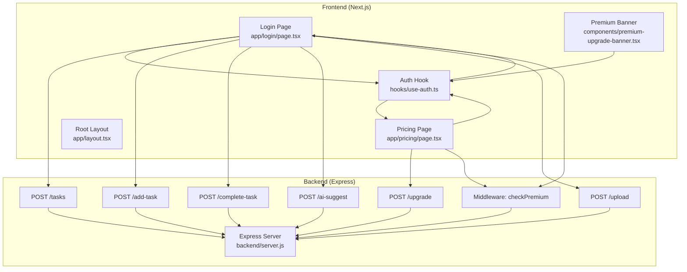
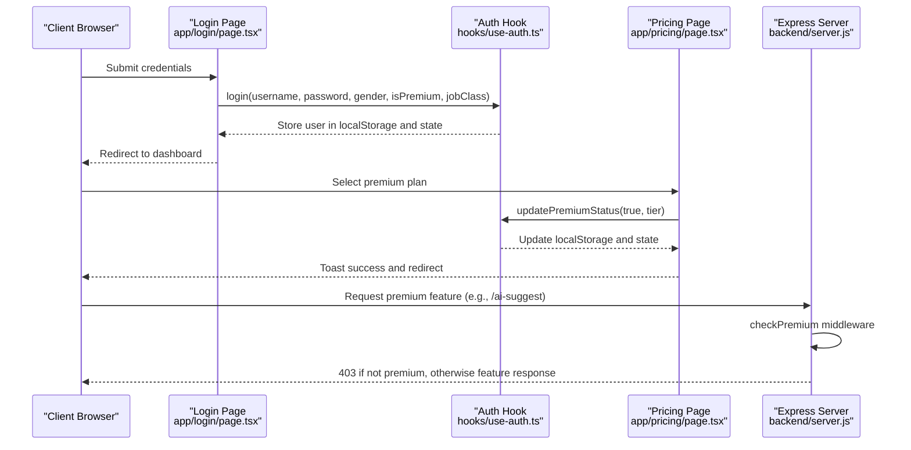
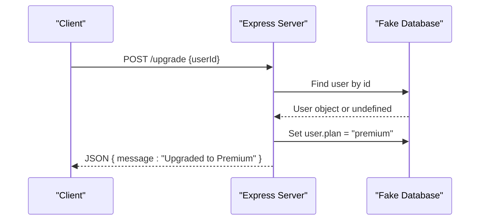
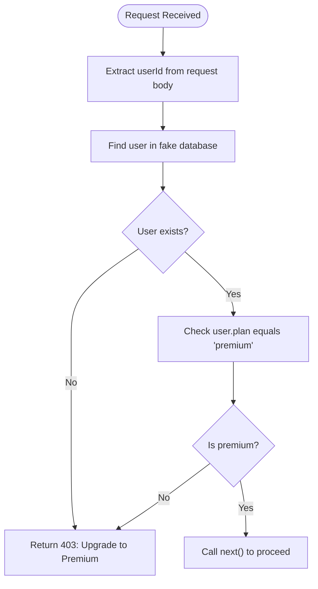
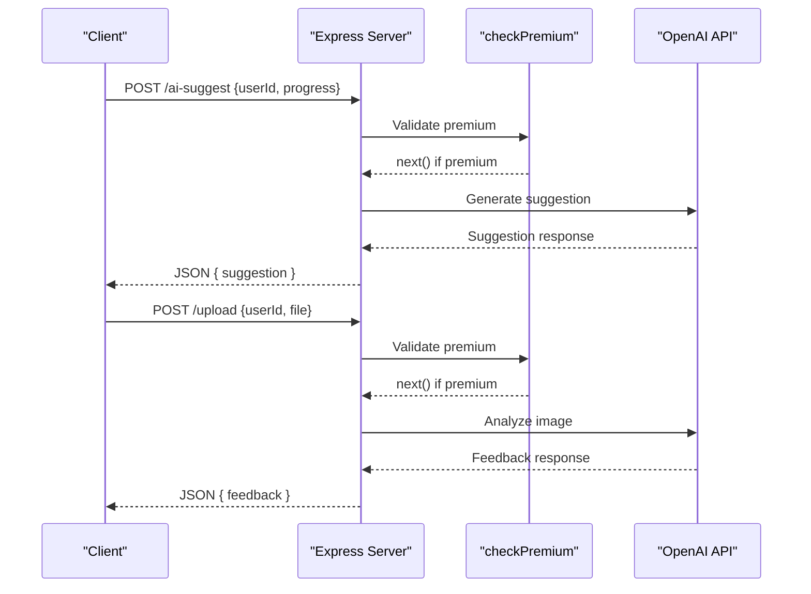
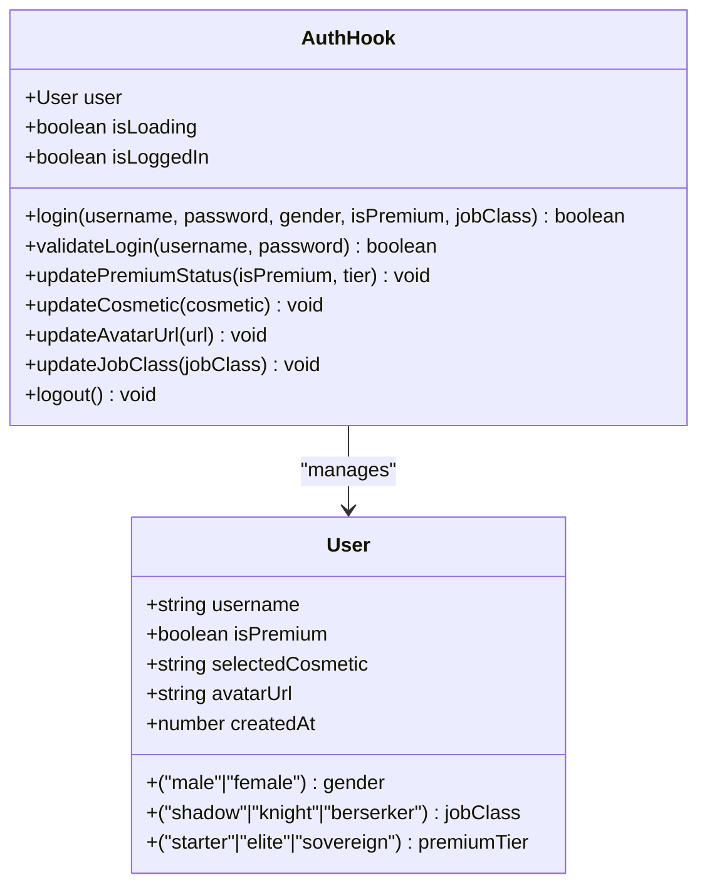
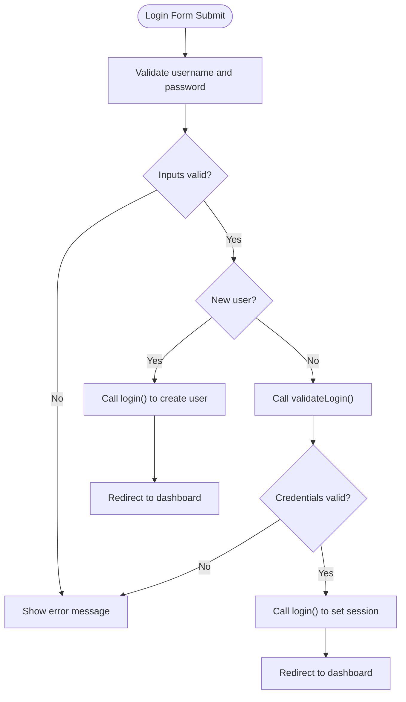
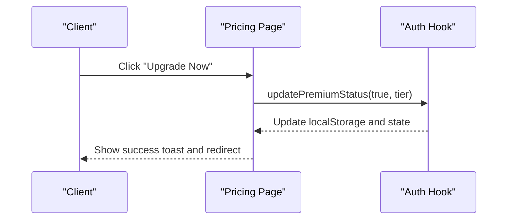
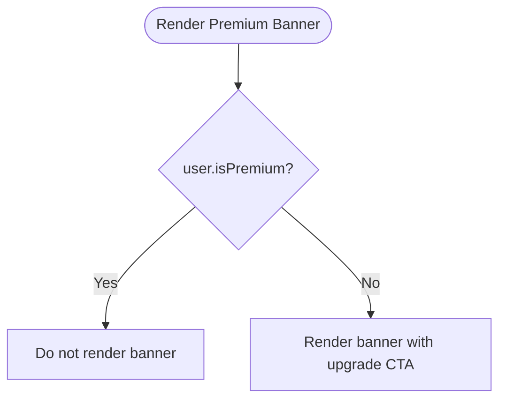
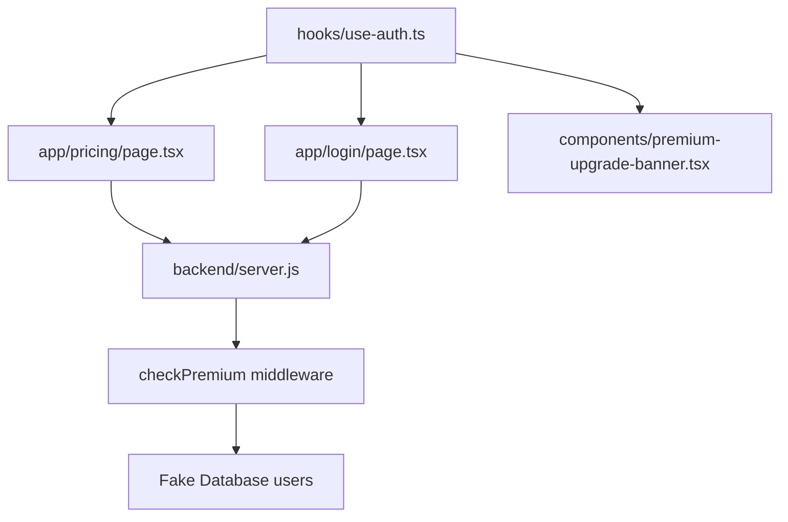

# Authentication API

<cite>
**Referenced Files in This Document**
- [server.js](file://backend/server.js)
- [use-auth.ts](file://hooks/use-auth.ts)
- [page.tsx](file://app/login/page.tsx)
- [page.tsx](file://app/pricing/page.tsx)
- [premium-products.ts](file://lib/premium-products.ts)
- [premium-upgrade-banner.tsx](file://components/premium-upgrade-banner.tsx)
- [layout.tsx](file://app/layout.tsx)
</cite>

## Table of Contents
1. [Introduction](#introduction)
2. [Project Structure](#project-structure)
3. [Core Components](#core-components)
4. [Architecture Overview](#architecture-overview)
5. [Detailed Component Analysis](#detailed-component-analysis)
6. [Dependency Analysis](#dependency-analysis)
7. [Performance Considerations](#performance-considerations)
8. [Troubleshooting Guide](#troubleshooting-guide)
9. [Conclusion](#conclusion)

## Introduction
This document provides API documentation for user authentication and premium upgrade endpoints within a Next.js application. It explains the simulated premium upgrade flow, the fake database implementation, authentication integration with the frontend login system, user session management, and premium status verification. It also covers the simulated payment process, user registration patterns, and authentication state management across the application.

## Project Structure
The authentication and premium upgrade system spans both the frontend React application and a backend Express server:
- Frontend: Next.js pages for login and pricing, React hooks for authentication state, and UI components for premium upgrades.
- Backend: Express server exposing endpoints for task management, AI-powered features (premium), and the premium upgrade endpoint.

**Diagram sources**
- [server.js:46-52](file://backend/server.js#L46-L52)
- [server.js:140-147](file://backend/server.js#L140-L147)
- [page.tsx:270-312](file://app/login/page.tsx#L270-L312)
- [page.tsx:18-34](file://app/pricing/page.tsx#L18-L34)
- [use-auth.ts:28-58](file://hooks/use-auth.ts#L28-L58)

**Section sources**
- [server.js:1-155](file://backend/server.js#L1-L155)
- [page.tsx:1-668](file://app/login/page.tsx#L1-L668)
- [page.tsx:1-176](file://app/pricing/page.tsx#L1-L176)
- [use-auth.ts:1-167](file://hooks/use-auth.ts#L1-L167)
- [layout.tsx:1-48](file://app/layout.tsx#L1-L48)

## Core Components
- Backend Express server with:
  - Fake in-memory database for users and tasks.
  - Middleware to enforce premium plan access for premium features.
  - Endpoints for task management and AI-powered features requiring premium access.
  - Simulated premium upgrade endpoint.
- Frontend authentication hook managing user state in localStorage and providing actions to update premium status, avatar, and job class.
- Login and pricing pages orchestrating user registration, authentication, and premium upgrade flows.

Key responsibilities:
- Authentication state management and persistence.
- Premium upgrade simulation and avatar assignment.
- Premium feature gating via middleware.
- UI integration for premium banners and upgrade prompts.

**Section sources**
- [server.js:35-41](file://backend/server.js#L35-L41)
- [server.js:46-52](file://backend/server.js#L46-L52)
- [server.js:140-147](file://backend/server.js#L140-L147)
- [use-auth.ts:28-109](file://hooks/use-auth.ts#L28-L109)
- [page.tsx:18-34](file://app/pricing/page.tsx#L18-L34)

## Architecture Overview
The system integrates frontend authentication with backend premium enforcement:
- Frontend login page collects credentials and creates/validates user sessions in localStorage.
- Pricing page triggers premium upgrade, updating local state and redirecting to the dashboard.
- Premium features (AI suggestions and image upload) are gated by the checkPremium middleware, which validates the user's plan against the fake database.

**Diagram sources**
- [page.tsx:270-312](file://app/login/page.tsx#L270-L312)
- [use-auth.ts:60-88](file://hooks/use-auth.ts#L60-L88)
- [page.tsx:18-34](file://app/pricing/page.tsx#L18-L34)
- [server.js:46-52](file://backend/server.js#L46-L52)
- [server.js:91-106](file://backend/server.js#L91-L106)

## Detailed Component Analysis

### Backend: Premium Upgrade Endpoint
The /upgrade endpoint simulates upgrading a user to the premium plan by updating the fake database record.

- Endpoint: POST /upgrade
- Request body: { userId: number }
- Behavior:
  - Validates presence of userId.
  - Finds user in the fake database.
  - Sets user.plan to "premium".
  - Returns success message.
- Notes:
  - No external payment processing is performed; this is a simulation for demonstration.

**Diagram sources**
- [server.js:140-147](file://backend/server.js#L140-L147)
- [server.js:35-41](file://backend/server.js#L35-L41)

**Section sources**
- [server.js:140-147](file://backend/server.js#L140-L147)

### Backend: Premium Middleware
The checkPremium middleware enforces premium access for premium features.

- Function: checkPremium(req, res, next)
- Validation:
  - Finds user by req.body.userId.
  - Rejects if user does not exist or plan is not "premium".
- Response:
  - Returns 403 with message "Upgrade to Premium" when validation fails.
  - Calls next() to proceed when valid.

**Diagram sources**
- [server.js:46-52](file://backend/server.js#L46-L52)
- [server.js:35-41](file://backend/server.js#L35-L41)

**Section sources**
- [server.js:46-52](file://backend/server.js#L46-L52)

### Backend: Premium Features (AI Suggestion and Image Upload)
Premium features are protected by the checkPremium middleware:
- POST /ai-suggest: Requires premium plan; responds with AI-generated suggestions.
- POST /upload: Requires premium plan; accepts a single file and responds with AI feedback.

**Diagram sources**
- [server.js:91-106](file://backend/server.js#L91-L106)
- [server.js:111-135](file://backend/server.js#L111-L135)
- [server.js:46-52](file://backend/server.js#L46-L52)

**Section sources**
- [server.js:91-106](file://backend/server.js#L91-L106)
- [server.js:111-135](file://backend/server.js#L111-L135)

### Frontend: Authentication Hook (use-auth)
The use-auth hook manages user state and authentication-related actions:
- State:
  - user: User object persisted in localStorage.
  - isLoading: Loading state during hydration.
- Actions:
  - login(username, password, gender, isPremium, jobClass): Creates a new user and stores in localStorage.
  - validateLogin(username, password): Validates credentials against stored password.
  - updatePremiumStatus(isPremium, tier): Updates premium status and avatar URL in localStorage.
  - updateCosmetic(cosmetic): Updates selected cosmetic.
  - updateAvatarUrl(url): Updates avatar URL.
  - updateJobClass(jobClass): Updates job class.
  - logout(): Clears user from localStorage and state.
- Avatar logic:
  - Ensures premium users have a premium avatar URL based on tier.
  - Ensures non-premium users have a default avatar based on gender.

**Diagram sources**
- [use-auth.ts:4-13](file://hooks/use-auth.ts#L4-L13)
- [use-auth.ts:28-167](file://hooks/use-auth.ts#L28-L167)

**Section sources**
- [use-auth.ts:28-167](file://hooks/use-auth.ts#L28-L167)

### Frontend: Login Page
The login page handles user registration and authentication:
- Collects username, password, gender, job class, and optional premium selection.
- On submit:
  - Validates inputs.
  - For new users: calls login to create and persist user.
  - For existing users: validates credentials and logs in.
  - Redirects to the dashboard upon successful login.

**Diagram sources**
- [page.tsx:270-312](file://app/login/page.tsx#L270-L312)
- [use-auth.ts:60-88](file://hooks/use-auth.ts#L60-L88)
- [use-auth.ts:149-152](file://hooks/use-auth.ts#L149-L152)

**Section sources**
- [page.tsx:270-312](file://app/login/page.tsx#L270-L312)
- [use-auth.ts:60-88](file://hooks/use-auth.ts#L60-L88)
- [use-auth.ts:149-152](file://hooks/use-auth.ts#L149-L152)

### Frontend: Pricing Page and Premium Upgrade
The pricing page allows users to select a premium tier and trigger an upgrade:
- If not logged in, redirects to the login page.
- Calls updatePremiumStatus(true, tier) to update local state and avatar.
- Shows success toast and redirects to the dashboard.

**Diagram sources**
- [page.tsx:18-34](file://app/pricing/page.tsx#L18-L34)
- [use-auth.ts:90-109](file://hooks/use-auth.ts#L90-L109)

**Section sources**
- [page.tsx:18-34](file://app/pricing/page.tsx#L18-L34)
- [use-auth.ts:90-109](file://hooks/use-auth.ts#L90-L109)

### Frontend: Premium Upgrade Banner
The premium upgrade banner is shown only to non-premium users and links to the pricing page.

**Diagram sources**
- [premium-upgrade-banner.tsx:7-12](file://components/premium-upgrade-banner.tsx#L7-L12)

**Section sources**
- [premium-upgrade-banner.tsx:7-12](file://components/premium-upgrade-banner.tsx#L7-L12)

### Frontend: Root Layout and Notifications
The root layout configures global UI elements:
- Adds Toaster for notifications.
- Sets site metadata and theme.

**Section sources**
- [layout.tsx:33-47](file://app/layout.tsx#L33-L47)

## Dependency Analysis
- Frontend dependencies:
  - use-auth hook depends on localStorage for persistence and provides UI actions.
  - Login and pricing pages depend on use-auth for authentication and premium state updates.
  - Premium banner depends on use-auth for visibility logic.
- Backend dependencies:
  - checkPremium middleware depends on the fake database users array.
  - Premium endpoints depend on checkPremium middleware.
  - Non-premium endpoints operate independently of premium checks.

**Diagram sources**
- [use-auth.ts:28-167](file://hooks/use-auth.ts#L28-L167)
- [page.tsx:224-312](file://app/login/page.tsx#L224-L312)
- [page.tsx:14-34](file://app/pricing/page.tsx#L14-L34)
- [server.js:46-52](file://backend/server.js#L46-L52)
- [server.js:35-41](file://backend/server.js#L35-L41)

**Section sources**
- [use-auth.ts:28-167](file://hooks/use-auth.ts#L28-L167)
- [page.tsx:224-312](file://app/login/page.tsx#L224-L312)
- [page.tsx:14-34](file://app/pricing/page.tsx#L14-L34)
- [server.js:46-52](file://backend/server.js#L46-L52)
- [server.js:35-41](file://backend/server.js#L35-L41)

## Performance Considerations
- Local storage usage: Authentication and premium state are stored in localStorage. While convenient, frequent writes can impact performance on low-end devices. Batch updates where possible.
- Middleware overhead: checkPremium performs a simple array lookup by ID. For larger datasets, consider indexing or caching strategies.
- Simulated endpoints: Premium features rely on external AI APIs. Network latency and rate limits should be considered; implement retries and graceful fallbacks.
- UI rendering: 3D avatar previews and animations can be computationally expensive. Optimize geometry and materials, and consider lazy loading.

## Troubleshooting Guide
Common issues and resolutions:
- Upgrade endpoint returns 403:
  - Ensure the user exists in the fake database and has plan set to "premium".
  - Verify the request includes a valid userId.
- Premium features inaccessible:
  - Confirm the checkPremium middleware is applied to the endpoint.
  - Ensure the user's plan is "premium" in the fake database.
- Login failures:
  - Verify username and password are non-empty.
  - Confirm validateLogin matches stored password.
- Avatar not updating:
  - Ensure updatePremiumStatus is called with the correct tier.
  - Confirm localStorage updates and state rehydration occur after changes.

**Section sources**
- [server.js:46-52](file://backend/server.js#L46-L52)
- [server.js:140-147](file://backend/server.js#L140-L147)
- [use-auth.ts:90-109](file://hooks/use-auth.ts#L90-L109)
- [page.tsx:270-312](file://app/login/page.tsx#L270-L312)

## Conclusion
The authentication and premium upgrade system combines a frontend React hook for state management with a backend Express server implementing a fake database and premium-gated features. The /upgrade endpoint simulates a premium purchase by updating user plan state, while the checkPremium middleware ensures premium features remain restricted to premium users. The frontend login and pricing pages integrate seamlessly with the backend through straightforward API interactions, providing a cohesive user experience for authentication and premium access.