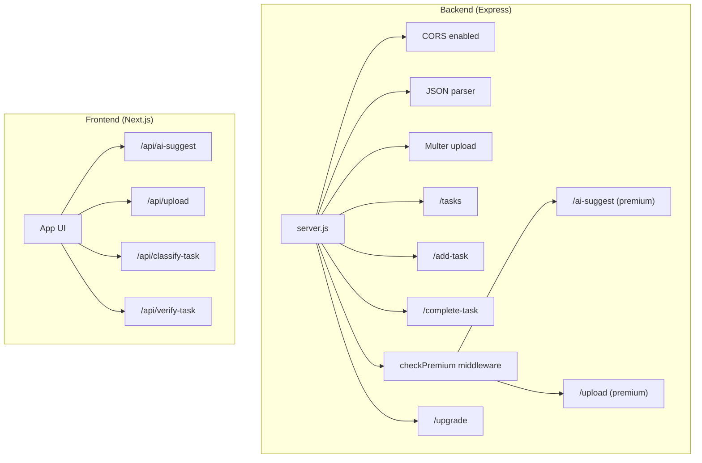
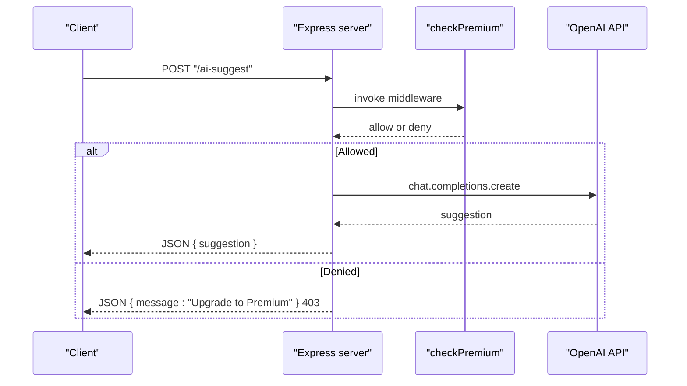
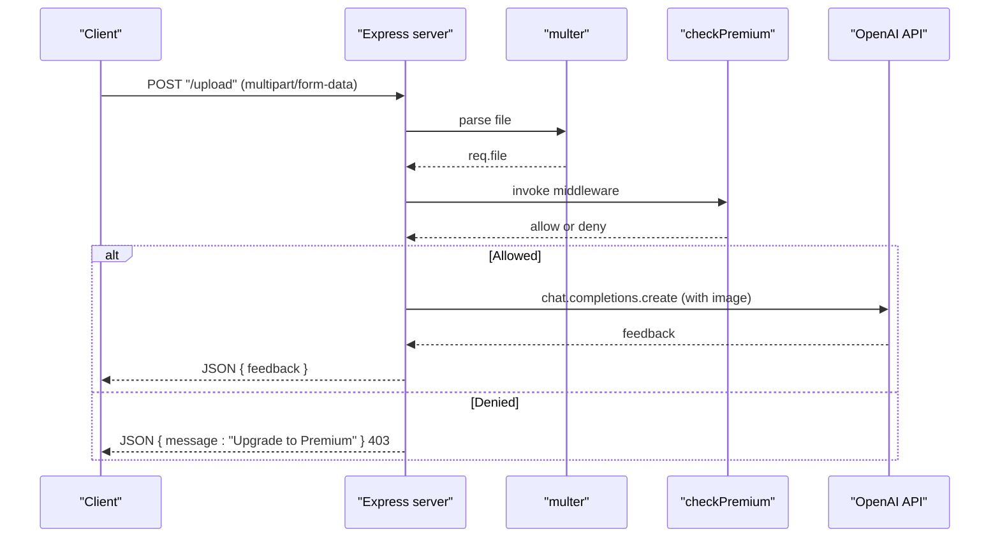
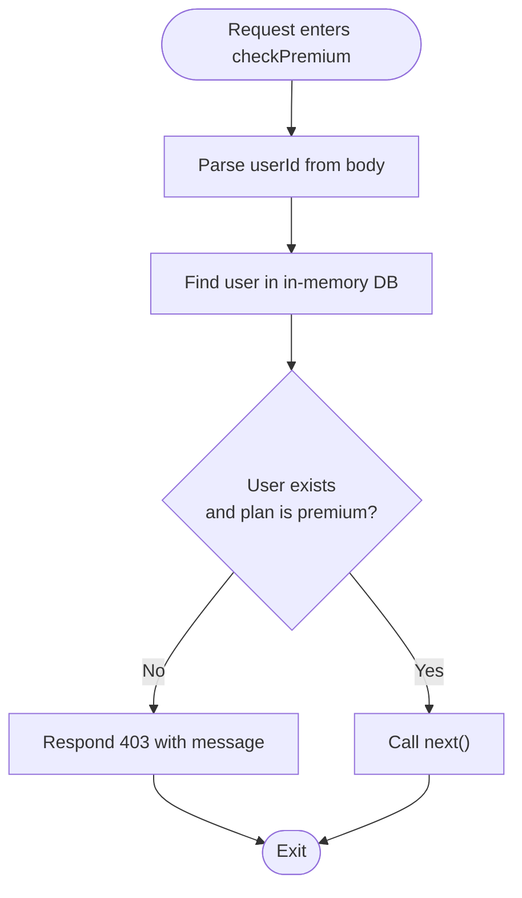
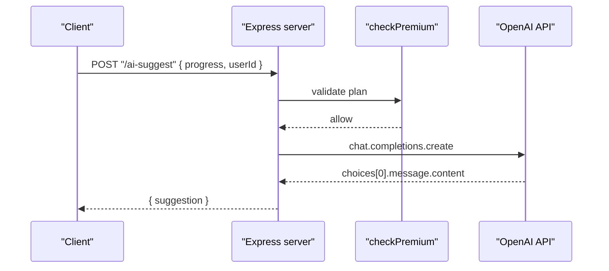
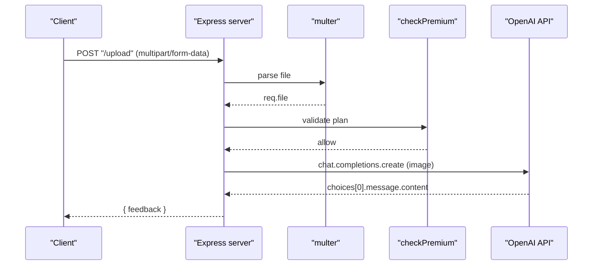
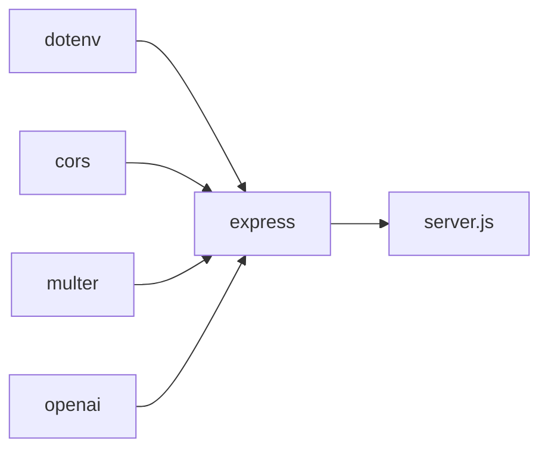

# Middleware and Security

<cite>
**Referenced Files in This Document**
- [server.js](file://backend/server.js)
- [package.json](file://backend/package.json)
- [route.ts](file://app/api/ai-suggest/route.ts)
- [route.ts](file://app/api/upload/route.ts)
- [route.ts](file://app/api/classify-task/route.ts)
- [route.ts](file://app/api/verify-task/route.ts)
- [page.tsx](file://app/page.tsx)
- [use-auth.ts](file://hooks/use-auth.ts)
- [premium-upgrade-banner.tsx](file://components/premium-upgrade-banner.tsx)
- [page.tsx](file://app/pricing/page.tsx)
- [premium-products.ts](file://lib/premium-products.ts)
</cite>

## Table of Contents
1. [Introduction](#introduction)
2. [Project Structure](#project-structure)
3. [Core Components](#core-components)
4. [Architecture Overview](#architecture-overview)
5. [Detailed Component Analysis](#detailed-component-analysis)
6. [Dependency Analysis](#dependency-analysis)
7. [Performance Considerations](#performance-considerations)
8. [Troubleshooting Guide](#troubleshooting-guide)
9. [Conclusion](#conclusion)

## Introduction
This document explains the Express.js middleware stack and security implementation in the backend server, focusing on:
- The checkPremium middleware for premium access control
- CORS configuration, JSON parsing middleware, and multer file upload setup
- Security considerations for API endpoints, request validation patterns, and error handling strategies
- Examples of middleware chaining, custom error responses, and integration with the premium feature gating system
- Mock database security implications and production-ready security recommendations

## Project Structure
The backend server is implemented as a single Express application with middleware and route handlers. Frontend API routes are implemented using Next.js App Router handlers. Premium gating is enforced by a simple in-memory “database” and a middleware function.

**Diagram sources**
- [server.js:1-155](file://backend/server.js#L1-L155)
- [route.ts:1-34](file://app/api/ai-suggest/route.ts#L1-L34)
- [route.ts:1-43](file://app/api/upload/route.ts#L1-L43)
- [route.ts:1-43](file://app/api/classify-task/route.ts#L1-L43)
- [route.ts:1-55](file://app/api/verify-task/route.ts#L1-L55)

**Section sources**
- [server.js:1-155](file://backend/server.js#L1-L155)
- [package.json:1-13](file://backend/package.json#L1-L13)

## Core Components
- Middleware stack
  - CORS: Enabled globally
  - JSON body parsing: Enabled globally
  - Multer: Disk storage configured for uploads
- Premium access control
  - checkPremium middleware validates user plan and blocks non-premium requests
- Premium endpoints
  - AI suggestion endpoint gated by checkPremium
  - Image upload endpoint gated by checkPremium and multer
- Non-premium endpoints
  - Task listing, adding tasks, marking tasks complete
  - Simulated payment endpoint to upgrade user plan

**Section sources**
- [server.js:8-30](file://backend/server.js#L8-L30)
- [server.js:46-52](file://backend/server.js#L46-L52)
- [server.js:57-86](file://backend/server.js#L57-L86)
- [server.js:91-106](file://backend/server.js#L91-L106)
- [server.js:111-135](file://backend/server.js#L111-L135)
- [server.js:140-147](file://backend/server.js#L140-L147)

## Architecture Overview
The backend exposes REST endpoints with optional premium gating. Premium features are protected by a middleware that checks a simple in-memory user database. Frontend Next.js API routes provide alternative implementations for AI-related features.

**Diagram sources**
- [server.js:91-106](file://backend/server.js#L91-L106)

**Diagram sources**
- [server.js:111-135](file://backend/server.js#L111-L135)

## Detailed Component Analysis

### Express Middleware Stack
- CORS
  - Applied globally with default settings, enabling cross-origin requests from browsers.
- JSON parsing
  - Enabled globally to parse incoming request bodies as JSON.
- Multer upload
  - Disk storage configured with dynamic filenames and a fixed uploads directory.
  - Used in the upload endpoint to capture a single file.

Security and behavior implications:
- Global CORS enables broad cross-origin access; consider scoping origins in production.
- JSON body parsing is essential for endpoints expecting JSON payloads.
- Multer writes uploaded files to disk; ensure proper permissions and sanitization.

**Section sources**
- [server.js:8-30](file://backend/server.js#L8-L30)
- [package.json:4-10](file://backend/package.json#L4-L10)

### checkPremium Middleware
Purpose:
- Enforce premium access control by validating the user’s plan before allowing premium endpoints.

Logic summary:
- Extracts userId from request body
- Looks up user in the in-memory database
- Blocks access with a 403 response if user does not exist or plan is not premium
- Calls next() to continue to the route handler if allowed

Response handling:
- On denial: returns JSON with a message and HTTP 403
- On allowance: proceeds to the next handler

Integration:
- Applied to premium endpoints: AI suggestion and image upload

**Diagram sources**
- [server.js:46-52](file://backend/server.js#L46-L52)

**Section sources**
- [server.js:46-52](file://backend/server.js#L46-L52)

### Premium Endpoint: AI Suggestion
Endpoint: POST /ai-suggest
Middleware: checkPremium
Behavior:
- Validates premium access
- Sends a prompt to OpenAI
- Returns the generated suggestion or an error response

Error handling:
- Try/catch around OpenAI call
- Returns 500 with error message on failure

**Diagram sources**
- [server.js:91-106](file://backend/server.js#L91-L106)

**Section sources**
- [server.js:91-106](file://backend/server.js#L91-L106)

### Premium Endpoint: Image Upload + AI Analysis
Endpoint: POST /upload
Middleware: checkPremium + multer.single("file")
Behavior:
- Validates premium access
- Parses multipart/form-data and extracts a single file
- Sends the uploaded image to OpenAI for analysis
- Returns feedback or an error response

Error handling:
- Try/catch around OpenAI call
- Returns 500 with error message on failure

**Diagram sources**
- [server.js:111-135](file://backend/server.js#L111-L135)

**Section sources**
- [server.js:111-135](file://backend/server.js#L111-L135)

### Non-Premium Endpoints
- POST /tasks: Lists pending tasks for a given userId
- POST /add-task: Adds a new task for a given userId
- POST /complete-task: Marks a task as complete
- POST /upgrade: Sets a user’s plan to premium in the in-memory database

These endpoints do not enforce premium access and operate on the in-memory database.

**Section sources**
- [server.js:57-86](file://backend/server.js#L57-L86)
- [server.js:140-147](file://backend/server.js#L140-L147)

### Frontend Next.js API Routes (Alternative Implementations)
While the backend provides Express endpoints, the frontend also includes Next.js API routes for AI features. These routes:
- Validate request payloads
- Optionally fall back to a mock system when the OpenAI API key is missing or placeholder
- Return structured JSON responses with appropriate HTTP statuses

Examples:
- AI suggestion: [route.ts:1-34](file://app/api/ai-suggest/route.ts#L1-L34)
- Upload: [route.ts:1-43](file://app/api/upload/route.ts#L1-L43)
- Classify task: [route.ts:1-43](file://app/api/classify-task/route.ts#L1-L43)
- Verify task: [route.ts:1-55](file://app/api/verify-task/route.ts#L1-L55)

**Section sources**
- [route.ts:1-34](file://app/api/ai-suggest/route.ts#L1-L34)
- [route.ts:1-43](file://app/api/upload/route.ts#L1-L43)
- [route.ts:1-43](file://app/api/classify-task/route.ts#L1-L43)
- [route.ts:1-55](file://app/api/verify-task/route.ts#L1-L55)

### Premium Feature Gating and Frontend Integration
- Premium status is tracked in local storage via a React hook
- Premium upgrade flow updates local storage and selects an avatar based on tier
- UI components conditionally render premium-only features

References:
- Premium upgrade banner: [premium-upgrade-banner.tsx:1-89](file://components/premium-upgrade-banner.tsx#L1-L89)
- Pricing page: [page.tsx:1-176](file://app/pricing/page.tsx#L1-L176)
- Premium products: [premium-products.ts:1-76](file://lib/premium-products.ts#L1-L76)
- Authentication hook: [use-auth.ts:1-167](file://hooks/use-auth.ts#L1-L167)

**Section sources**
- [premium-upgrade-banner.tsx:1-89](file://components/premium-upgrade-banner.tsx#L1-L89)
- [page.tsx:1-176](file://app/pricing/page.tsx#L1-L176)
- [premium-products.ts:1-76](file://lib/premium-products.ts#L1-L76)
- [use-auth.ts:1-167](file://hooks/use-auth.ts#L1-L167)

## Dependency Analysis
External dependencies used by the backend server:
- express: Web framework
- cors: Cross-origin resource sharing
- multer: File upload handling
- dotenv: Environment variable loading
- openai: OpenAI API client

**Diagram sources**
- [package.json:1-13](file://backend/package.json#L1-L13)
- [server.js:1-10](file://backend/server.js#L1-L10)

**Section sources**
- [package.json:1-13](file://backend/package.json#L1-L13)
- [server.js:1-10](file://backend/server.js#L1-L10)

## Performance Considerations
- Multer writes files to disk; ensure adequate disk space and consider asynchronous cleanup.
- OpenAI calls introduce latency; consider caching or rate limiting in production.
- Global CORS allows broad access; restrict origins in production to reduce risk and improve performance by avoiding unnecessary preflight requests.
- JSON body parsing is lightweight but ensure payload sizes are bounded to prevent memory pressure.

## Troubleshooting Guide
Common issues and resolutions:
- 403 Forbidden on premium endpoints
  - Cause: User not found or plan is not premium
  - Resolution: Call the upgrade endpoint to set plan to premium, then retry
- 500 Internal Server Error on AI endpoints
  - Cause: OpenAI API failure or invalid API key
  - Resolution: Verify OPENAI_API_KEY is set and valid; retry after fixing credentials
- 400 Bad Request on upload
  - Cause: Missing file in multipart/form-data
  - Resolution: Ensure the form includes a file under the expected field name

**Section sources**
- [server.js:46-52](file://backend/server.js#L46-L52)
- [server.js:91-106](file://backend/server.js#L91-L106)
- [server.js:111-135](file://backend/server.js#L111-L135)

## Conclusion
The backend implements a straightforward Express middleware stack with global CORS and JSON parsing, plus a dedicated premium gating middleware and file upload pipeline. Premium features are protected by a simple in-memory user database and a dedicated middleware. Frontend Next.js API routes offer alternative implementations with built-in fallbacks for environments without an OpenAI key. For production, tighten CORS, secure environment variables, validate and sanitize uploads, and implement robust authentication and authorization.