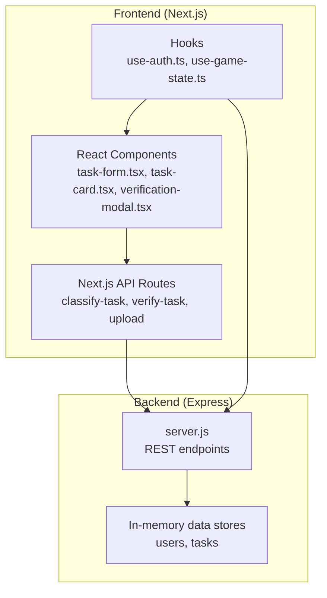
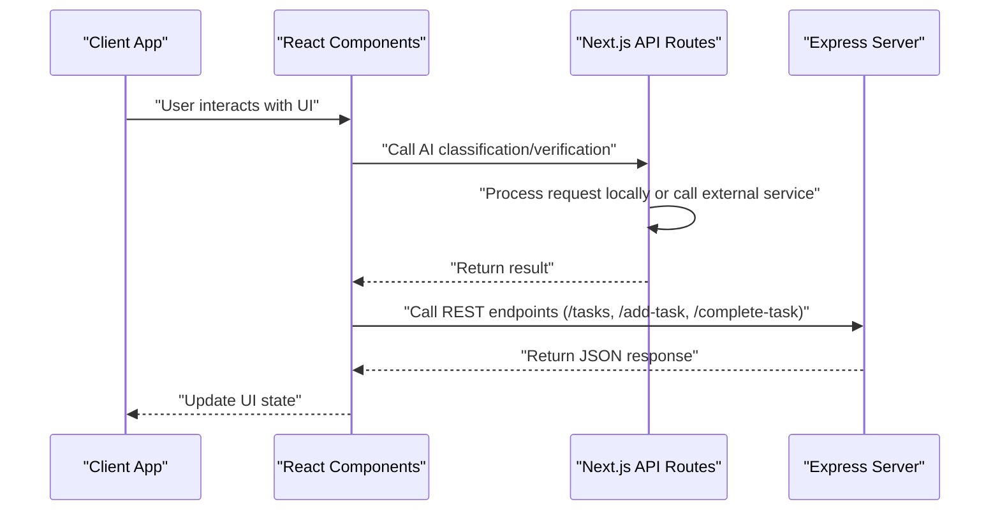
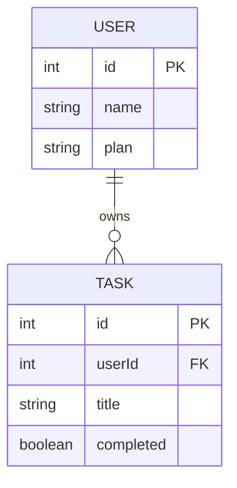
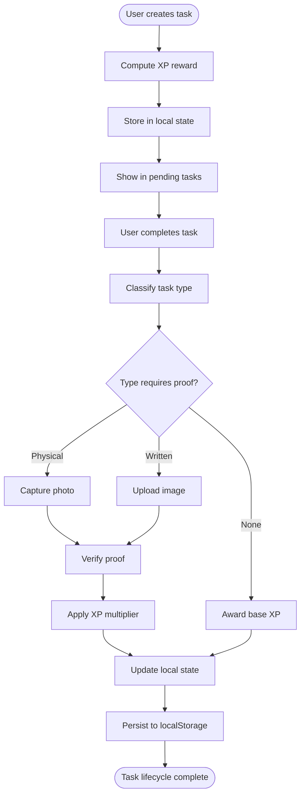
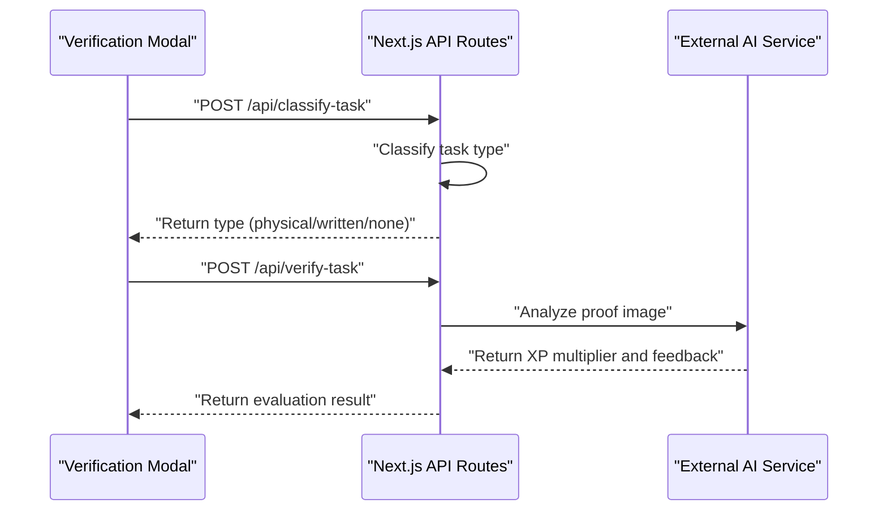
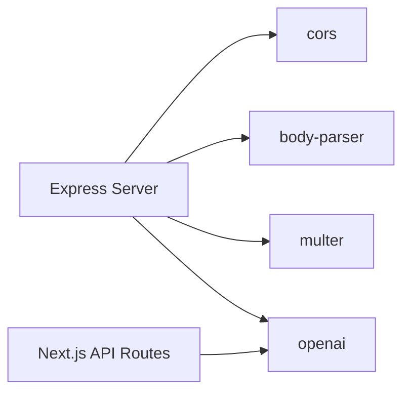

# Task Management API

<cite>
**Referenced Files in This Document**
- [server.js](file://backend/server.js)
- [route.ts](file://app/api/classify-task/route.ts)
- [route.ts](file://app/api/verify-task/route.ts)
- [route.ts](file://app/api/upload/route.ts)
- [task-form.tsx](file://components/task-form.tsx)
- [task-card.tsx](file://components/task-card.tsx)
- [verification-modal.tsx](file://components/verification-modal.tsx)
- [use-game-state.ts](file://hooks/use-game-state.ts)
- [use-auth.ts](file://hooks/use-auth.ts)
- [game-constants.ts](file://lib/game-constants.ts)
- [package.json](file://backend/package.json)
</cite>

## Table of Contents
1. [Introduction](#introduction)
2. [Project Structure](#project-structure)
3. [Core Components](#core-components)
4. [Architecture Overview](#architecture-overview)
5. [Detailed Component Analysis](#detailed-component-analysis)
6. [Dependency Analysis](#dependency-analysis)
7. [Performance Considerations](#performance-considerations)
8. [Troubleshooting Guide](#troubleshooting-guide)
9. [Conclusion](#conclusion)
10. [Appendices](#appendices)

## Introduction
This document provides comprehensive API documentation for task management endpoints. It covers:
- Retrieving pending tasks filtered by userId
- Creating new tasks with validation
- Marking tasks as completed
- Authentication and authorization requirements
- Error handling patterns
- Practical usage examples with curl and JavaScript fetch
- In-memory database structure and lifecycle management
- Integration with the frontend Next.js API routes and components

The backend is implemented as a Node.js/Express server exposing REST endpoints, while the frontend integrates with Next.js API routes for AI-powered classification and verification flows.

## Project Structure
The repository is organized into:
- Backend: Express server with in-memory data stores and REST endpoints
- Frontend: Next.js application with React components and hooks for UI and state management
- Shared libraries: Game constants and types used across components and hooks

**Diagram sources**
- [server.js:57-86](file://backend/server.js#L57-L86)
- [task-form.tsx:18-51](file://components/task-form.tsx#L18-L51)
- [task-card.tsx:18-43](file://components/task-card.tsx#L18-L43)
- [verification-modal.tsx:39-64](file://components/verification-modal.tsx#L39-L64)
- [use-auth.ts:28-58](file://hooks/use-auth.ts#L28-L58)
- [use-game-state.ts:51-82](file://hooks/use-game-state.ts#L51-L82)

**Section sources**
- [server.js:1-155](file://backend/server.js#L1-L155)
- [task-form.tsx:1-191](file://components/task-form.tsx#L1-L191)
- [task-card.tsx:1-186](file://components/task-card.tsx#L1-L186)
- [verification-modal.tsx:1-331](file://components/verification-modal.tsx#L1-L331)
- [use-auth.ts:1-167](file://hooks/use-auth.ts#L1-L167)
- [use-game-state.ts:1-252](file://hooks/use-game-state.ts#L1-L252)

## Core Components
- In-memory database model:
  - users: array of user records with id and plan
  - tasks: array of task records with id, userId, title, completed flag
- REST endpoints:
  - POST /tasks: filter pending tasks by userId
  - POST /add-task: create a new task with title and userId
  - POST /complete-task: mark a task as completed by taskId

Key behaviors:
- Filtering: returns only tasks where completed is false
- Validation: minimal checks; caller must supply required fields
- Persistence: in-memory arrays; no persistence across restarts

**Section sources**
- [server.js:35-41](file://backend/server.js#L35-L41)
- [server.js:57-86](file://backend/server.js#L57-L86)

## Architecture Overview
The system follows a simple layered architecture:
- Presentation/UI layer (React components and Next.js pages)
- Business logic layer (Next.js API routes for AI classification and verification)
- Data access layer (Express REST endpoints)
- In-memory data store (users and tasks)

**Diagram sources**
- [server.js:57-86](file://backend/server.js#L57-L86)
- [route.ts:8-33](file://app/api/classify-task/route.ts#L8-L33)
- [route.ts:8-54](file://app/api/verify-task/route.ts#L8-L54)
- [route.ts:8-42](file://app/api/upload/route.ts#L8-L42)

## Detailed Component Analysis

### Endpoint: GET /tasks (Pending Tasks)
Purpose:
- Retrieve pending tasks for a given userId

Request:
- Method: POST
- Content-Type: application/json
- Body fields:
  - userId: integer or string identifier of the user

Response:
- 200 OK: Array of task objects
  - id: unique task identifier
  - userId: user who owns the task
  - title: task description
  - completed: boolean indicating completion status

Behavior:
- Filters tasks where completed is false
- Returns empty array if no pending tasks

Example usage:
- curl
  - curl -X POST http://localhost:3000/tasks -H "Content-Type: application/json" -d '{"userId":1}'
- JavaScript (fetch)
  - fetch("http://localhost:3000/tasks", { method: "POST", headers: {"Content-Type":"application/json"}, body: JSON.stringify({userId:1}) })

Notes:
- No explicit authentication header required by this endpoint
- Filtering is client-side in the backend for demonstration

**Section sources**
- [server.js:57-61](file://backend/server.js#L57-L61)

### Endpoint: POST /add-task (Create Task)
Purpose:
- Create a new task with title and associate it with userId

Request:
- Method: POST
- Content-Type: application/json
- Body fields:
  - userId: integer or string identifier of the user
  - title: string describing the task

Response:
- 200 OK: Newly created task object
  - id: unique task identifier
  - userId: user who owns the task
  - title: task description
  - completed: boolean (initially false)

Behavior:
- Assigns id as tasks.length + 1
- Sets completed to false
- Returns the created task

Example usage:
- curl
  - curl -X POST http://localhost:3000/add-task -H "Content-Type: application/json" -d '{"userId":1,"title":"Complete chapter 1"}'
- JavaScript (fetch)
  - fetch("http://localhost:3000/add-task", { method: "POST", headers: {"Content-Type":"application/json"}, body: JSON.stringify({userId:1,title:"Complete chapter 1"}) })

Notes:
- Minimal validation; caller must ensure required fields are present
- No authentication header required by this endpoint

**Section sources**
- [server.js:66-76](file://backend/server.js#L66-L76)

### Endpoint: POST /complete-task (Mark Task Complete)
Purpose:
- Mark an existing task as completed by taskId

Request:
- Method: POST
- Content-Type: application/json
- Body fields:
  - taskId: unique identifier of the task to complete

Response:
- 200 OK: Object with message field
  - message: string confirming completion

Behavior:
- Finds task by id and sets completed to true
- Returns success message even if taskId does not exist

Example usage:
- curl
  - curl -X POST http://localhost:3000/complete-task -H "Content-Type: application/json" -d '{"taskId":1}'
- JavaScript (fetch)
  - fetch("http://localhost:3000/complete-task", { method: "POST", headers: {"Content-Type":"application/json"}, body: JSON.stringify({taskId:1}) })

Notes:
- No authentication header required by this endpoint
- Idempotent operation; multiple calls have the same effect

**Section sources**
- [server.js:81-86](file://backend/server.js#L81-L86)

### Authentication and Authorization
- Authentication:
  - Not enforced by the task endpoints documented here
  - The backend includes a middleware to check user plan for premium features, but it is not applied to the task endpoints
- Authorization:
  - No explicit authorization checks for /tasks, /add-task, or /complete-task
  - Filtering by userId is client-side; consider enforcing ownership at the API boundary

Recommendations:
- Add JWT or session-based authentication
- Enforce ownership checks for task operations
- Apply rate limiting for sensitive endpoints

**Section sources**
- [server.js:46-52](file://backend/server.js#L46-L52)

### Error Handling Patterns
- Validation errors:
  - Missing required fields result in unexpected behavior or partial responses
  - Consider adding explicit validation and returning 400 with error details
- Resource not found:
  - /complete-task returns success even if taskId is invalid
  - Consider returning 404 for missing resources
- Server errors:
  - General exceptions lead to 500 responses with error messages
  - Consider logging and returning structured error payloads

**Section sources**
- [server.js:57-86](file://backend/server.js#L57-L86)

### In-Memory Database Structure
Data model:
- users
  - id: unique identifier
  - name: user name
  - plan: subscription plan (e.g., free, premium)
- tasks
  - id: unique identifier
  - userId: user who owns the task
  - title: task description
  - completed: boolean completion flag

Lifecycle:
- Creation: tasks are appended with incremented ids
- Filtering: pending tasks exclude completed ones
- Completion: updates completion flag in place

**Diagram sources**
- [server.js:35-41](file://backend/server.js#L35-L41)

**Section sources**
- [server.js:35-41](file://backend/server.js#L35-L41)

### Task Lifecycle Management
Frontend integration:
- Task creation:
  - UI collects title, description, duration, and difficulty
  - Computes XP reward based on difficulty and duration
  - Stores tasks in local state and persists to localStorage
- Task completion:
  - UI triggers verification modal
  - Modal classifies task type and requests proof
  - Verifies proof and awards XP based on multiplier
  - Updates local state and persists changes

**Diagram sources**
- [use-game-state.ts:127-141](file://hooks/use-game-state.ts#L127-L141)
- [verification-modal.tsx:39-64](file://components/verification-modal.tsx#L39-L64)
- [verification-modal.tsx:112-140](file://components/verification-modal.tsx#L112-L140)

**Section sources**
- [use-game-state.ts:15-47](file://hooks/use-game-state.ts#L15-L47)
- [task-form.tsx:18-51](file://components/task-form.tsx#L18-L51)
- [task-card.tsx:18-43](file://components/task-card.tsx#L18-L43)
- [verification-modal.tsx:39-64](file://components/verification-modal.tsx#L39-L64)
- [verification-modal.tsx:112-140](file://components/verification-modal.tsx#L112-L140)

### Integration with Next.js API Routes
The frontend Next.js API routes complement the backend by providing AI-driven classification and verification:
- Classification:
  - Determines whether a task requires physical or written proof
- Verification:
  - Evaluates uploaded proof images and returns XP multiplier and feedback
- Upload:
  - Processes image uploads for verification

**Diagram sources**
- [route.ts:8-42](file://app/api/classify-task/route.ts#L8-L42)
- [route.ts:8-54](file://app/api/verify-task/route.ts#L8-L54)
- [route.ts:8-42](file://app/api/upload/route.ts#L8-L42)

**Section sources**
- [route.ts:1-43](file://app/api/classify-task/route.ts#L1-L43)
- [route.ts:1-55](file://app/api/verify-task/route.ts#L1-L55)
- [route.ts:1-43](file://app/api/upload/route.ts#L1-L43)

## Dependency Analysis
Backend dependencies:
- express: web framework
- cors: cross-origin support
- multer: file upload handling
- dotenv: environment configuration
- openai: external AI service integration

Frontend integration:
- Next.js API routes depend on the external OpenAI service
- React components rely on hooks for state and authentication

**Diagram sources**
- [package.json:4-11](file://backend/package.json#L4-L11)

**Section sources**
- [package.json:1-13](file://backend/package.json#L1-L13)

## Performance Considerations
- In-memory storage:
  - Suitable for demos; not resilient to restarts
  - Consider migrating to a persistent database for production
- Filtering and updates:
  - Linear scans for filtering and finding tasks
  - For high volume, add indexing or move to a database with efficient queries
- Concurrency:
  - No locking mechanism; concurrent writes may cause race conditions
  - Implement optimistic concurrency control or database transactions
- Scalability:
  - Stateless design supports horizontal scaling
  - Externalize state to a shared store for multi-instance deployments

[No sources needed since this section provides general guidance]

## Troubleshooting Guide
Common issues and resolutions:
- Missing userId or taskId:
  - Ensure userId and taskId are provided in request bodies
  - Validate presence before calling endpoints
- Empty task lists:
  - Confirm tasks exist and are not marked completed
  - Verify userId matches the task owner
- Unexpected completions:
  - /complete-task succeeds even for non-existent taskId
  - Add validation to return 404 for missing tasks
- Authentication concerns:
  - Current endpoints do not enforce authentication
  - Implement authentication middleware and apply to all endpoints

**Section sources**
- [server.js:57-86](file://backend/server.js#L57-L86)

## Conclusion
The task management API provides essential CRUD operations for tasks backed by an in-memory store. While functional for demonstrations, production readiness requires:
- Authentication and authorization
- Input validation and error handling
- Persistent storage and concurrency control
- Migration of AI features to backend endpoints for better control and privacy

[No sources needed since this section summarizes without analyzing specific files]

## Appendices

### API Reference Summary
- GET /tasks
  - Purpose: Retrieve pending tasks for a user
  - Request: { userId }
  - Response: Array of task objects
- POST /add-task
  - Purpose: Create a new task
  - Request: { userId, title }
  - Response: Created task object
- POST /complete-task
  - Purpose: Mark a task as completed
  - Request: { taskId }
  - Response: { message }

**Section sources**
- [server.js:57-86](file://backend/server.js#L57-L86)

### Example Requests
- curl
  - Retrieve pending tasks: curl -X POST http://localhost:3000/tasks -H "Content-Type: application/json" -d '{"userId":1}'
  - Create task: curl -X POST http://localhost:3000/add-task -H "Content-Type: application/json" -d '{"userId":1,"title":"Review chapter"}'
  - Complete task: curl -X POST http://localhost:3000/complete-task -H "Content-Type: application/json" -d '{"taskId":1}'
- JavaScript (fetch)
  - Pending tasks: fetch("http://localhost:3000/tasks", { method: "POST", headers: {"Content-Type":"application/json"}, body: JSON.stringify({userId:1}) })
  - Create task: fetch("http://localhost:3000/add-task", { method: "POST", headers: {"Content-Type":"application/json"}, body: JSON.stringify({userId:1,title:"Review chapter"}) })
  - Complete task: fetch("http://localhost:3000/complete-task", { method: "POST", headers: {"Content-Type":"application/json"}, body: JSON.stringify({taskId:1}) })

**Section sources**
- [server.js:57-86](file://backend/server.js#L57-L86)