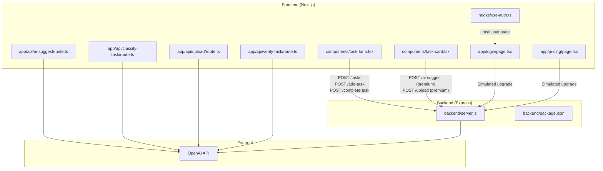
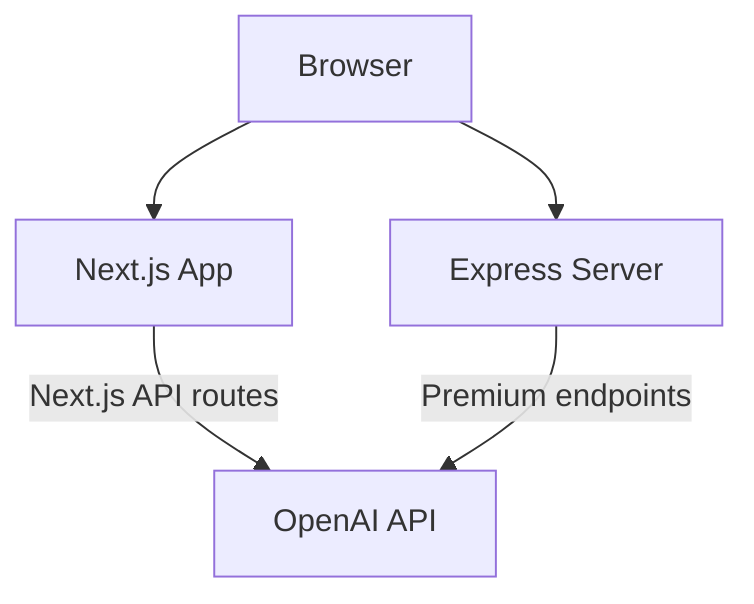
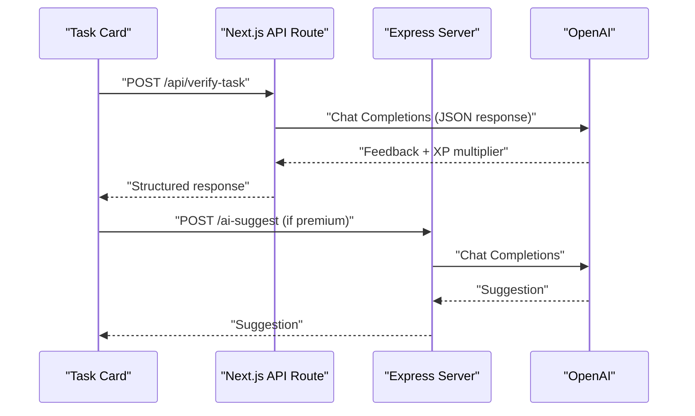
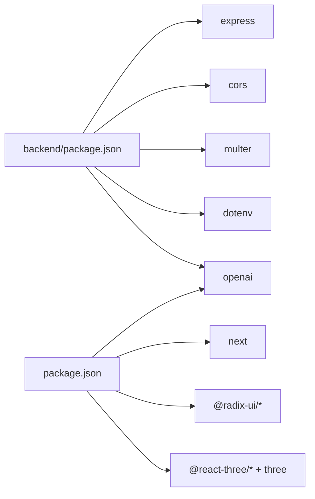

# Backend Services

<cite>
**Referenced Files in This Document**
- [backend/server.js](file://backend/server.js)
- [backend/package.json](file://backend/package.json)
- [app/api/ai-suggest/route.ts](file://app/api/ai-suggest/route.ts)
- [app/api/classify-task/route.ts](file://app/api/classify-task/route.ts)
- [app/api/upload/route.ts](file://app/api/upload/route.ts)
- [app/api/verify-task/route.ts](file://app/api/verify-task/route.ts)
- [package.json](file://package.json)
- [next.config.mjs](file://next.config.mjs)
- [hooks/use-auth.ts](file://hooks/use-auth.ts)
- [components/task-form.tsx](file://components/task-form.tsx)
- [components/task-card.tsx](file://components/task-card.tsx)
- [app/pricing/page.tsx](file://app/pricing/page.tsx)
- [app/login/page.tsx](file://app/login/page.tsx)
</cite>

## Table of Contents
1. [Introduction](#introduction)
2. [Project Structure](#project-structure)
3. [Core Components](#core-components)
4. [Architecture Overview](#architecture-overview)
5. [Detailed Component Analysis](#detailed-component-analysis)
6. [Dependency Analysis](#dependency-analysis)
7. [Performance Considerations](#performance-considerations)
8. [Troubleshooting Guide](#troubleshooting-guide)
9. [Conclusion](#conclusion)
10. [Appendices](#appendices)

## Introduction
This document describes the backend services and API infrastructure supporting a Next.js application. It covers Express.js server configuration, middleware, route definitions, and service architecture. It explains the API endpoint structure for task management, premium feature gating, and file upload handling. It documents the server-side AI integration, data persistence strategies, and security measures. It also outlines how frontend API routes integrate with backend services, request processing, and response handling, along with server configuration, environment variables, deployment considerations, and practical usage examples.

## Project Structure
The repository combines a Next.js frontend with a small Express.js backend server. The backend exposes REST-like endpoints for task management and premium features, while the frontend Next.js app defines API routes that proxy to external services (including OpenAI) and manage user state and UI.

**Diagram sources**
- [backend/server.js:57-147](file://backend/server.js#L57-L147)
- [app/api/ai-suggest/route.ts:8-33](file://app/api/ai-suggest/route.ts#L8-L33)
- [app/api/classify-task/route.ts:8-42](file://app/api/classify-task/route.ts#L8-L42)
- [app/api/upload/route.ts:8-42](file://app/api/upload/route.ts#L8-L42)
- [app/api/verify-task/route.ts:8-54](file://app/api/verify-task/route.ts#L8-L54)

**Section sources**
- [backend/server.js:1-155](file://backend/server.js#L1-L155)
- [backend/package.json:1-13](file://backend/package.json#L1-L13)
- [package.json:1-78](file://package.json#L1-L78)
- [next.config.mjs:1-15](file://next.config.mjs#L1-L15)

## Core Components
- Express server: Provides CORS, JSON body parsing, file upload handling, and middleware for premium checks. Exposes endpoints for task management and premium features.
- Frontend Next.js API routes: Implement AI classification, suggestion, image upload, and verification using OpenAI. They include mock fallbacks when API keys are missing.
- Authentication and user state: Local storage-based user session with premium status and avatar selection.
- UI components: Task creation and verification flows that interact with backend and frontend API routes.

Key implementation highlights:
- Express server initializes OpenAI SDK with environment variable configuration and serves as a gateway for premium features.
- Frontend Next.js API routes encapsulate AI logic and provide robust error handling and mock behavior.
- Frontend components orchestrate user actions and communicate with backend endpoints and Next.js API routes.

**Section sources**
- [backend/server.js:14-16](file://backend/server.js#L14-L16)
- [app/api/ai-suggest/route.ts:4-6](file://app/api/ai-suggest/route.ts#L4-L6)
- [hooks/use-auth.ts:28-109](file://hooks/use-auth.ts#L28-L109)
- [components/task-form.tsx:18-51](file://components/task-form.tsx#L18-L51)
- [components/task-card.tsx:18-43](file://components/task-card.tsx#L18-L43)

## Architecture Overview
The system comprises:
- Frontend Next.js application with:
  - API routes for AI-powered features (suggestion, classification, upload, verification).
  - UI components for task management and user onboarding.
- Backend Express server:
  - Task management endpoints.
  - Premium-gated endpoints protected by middleware.
  - File upload handling with local disk storage.
- External OpenAI integration for AI features.

**Diagram sources**
- [backend/server.js:57-147](file://backend/server.js#L57-L147)
- [app/api/ai-suggest/route.ts:8-33](file://app/api/ai-suggest/route.ts#L8-L33)
- [app/api/classify-task/route.ts:8-42](file://app/api/classify-task/route.ts#L8-L42)
- [app/api/upload/route.ts:8-42](file://app/api/upload/route.ts#L8-L42)
- [app/api/verify-task/route.ts:8-54](file://app/api/verify-task/route.ts#L8-L54)

## Detailed Component Analysis

### Express Server Configuration and Middleware
- Environment configuration: Loads environment variables from a parent directory path.
- CORS and JSON parsing: Enables cross-origin requests and parses JSON bodies.
- OpenAI initialization: Creates an OpenAI client using the configured API key.
- Multer file upload: Configures disk storage and filename generation for uploaded files.
- In-memory database: Simulates users and tasks for demonstration.

Middleware and endpoints:
- Premium check middleware: Validates user plan before accessing premium endpoints.
- Task endpoints:
  - Retrieve pending tasks by user ID.
  - Add a new task.
  - Mark a task as complete.
- Premium endpoints:
  - AI task suggestion based on progress.
  - Image upload with AI analysis.
  - Simulated upgrade to premium.

Security and error handling:
- Premium middleware returns 403 for non-premium users.
- Try/catch blocks around AI calls return 500 on errors.
- File upload validates presence of file and handles exceptions.

**Section sources**
- [backend/server.js:1-155](file://backend/server.js#L1-L155)
- [backend/package.json:1-13](file://backend/package.json#L1-L13)

### Frontend Next.js API Routes
These routes encapsulate AI features and provide fallback behavior when the OpenAI API key is unavailable.

- AI Suggestion:
  - Accepts progress payload.
  - Returns a mock suggestion if the API key is missing or invalid.
  - Otherwise queries OpenAI for a tailored suggestion.

- Task Classification:
  - Accepts title and optional description.
  - Returns a mock classification if the API key is missing.
  - Otherwise classifies as written, physical, or none.

- Image Upload:
  - Accepts multipart/form-data with a file.
  - Converts file to base64 and sends to OpenAI for analysis.
  - Returns feedback from the AI.

- Verification:
  - Accepts title, description, base64 image, and MIME type.
  - Returns a mock evaluation if the API key is missing.
  - Otherwise evaluates the image and returns structured feedback with an XP multiplier.

Error handling:
- Catches exceptions and returns 500 with an error message.
- Upload route validates file presence and returns 400 if missing.

**Section sources**
- [app/api/ai-suggest/route.ts:8-33](file://app/api/ai-suggest/route.ts#L8-L33)
- [app/api/classify-task/route.ts:8-42](file://app/api/classify-task/route.ts#L8-L42)
- [app/api/upload/route.ts:8-42](file://app/api/upload/route.ts#L8-L42)
- [app/api/verify-task/route.ts:8-54](file://app/api/verify-task/route.ts#L8-L54)

### Task Management Endpoints
- Endpoint: POST /tasks
  - Purpose: Fetch pending tasks for a given user ID.
  - Request: JSON body containing user ID.
  - Response: Array of pending tasks.

- Endpoint: POST /add-task
  - Purpose: Add a new task for a user.
  - Request: JSON body containing user ID and task title.
  - Response: Newly created task object.

- Endpoint: POST /complete-task
  - Purpose: Mark a task as complete.
  - Request: JSON body containing task ID.
  - Response: Confirmation message.

Integration pattern:
- Frontend components submit requests and update UI state accordingly.
- Backend maintains an in-memory array of tasks.

**Section sources**
- [backend/server.js:57-86](file://backend/server.js#L57-L86)
- [components/task-form.tsx:18-51](file://components/task-form.tsx#L18-L51)
- [components/task-card.tsx:18-43](file://components/task-card.tsx#L18-L43)

### Premium Feature Endpoints
- Endpoint: POST /ai-suggest
  - Purpose: AI-powered task suggestions gated by premium status.
  - Request: JSON body containing progress information.
  - Response: AI-generated suggestion.
  - Security: Protected by premium middleware.

- Endpoint: POST /upload
  - Purpose: Upload an image for AI analysis (premium).
  - Request: Form data with a single file.
  - Response: AI feedback on the uploaded image.
  - Security: Protected by premium middleware.

- Endpoint: POST /upgrade
  - Purpose: Simulate upgrading a user to premium.
  - Request: JSON body containing user ID.
  - Response: Confirmation message.

Frontend integration:
- Pricing page triggers simulated upgrades and updates user state.
- Login page manages user creation and premium toggles.

**Section sources**
- [backend/server.js:89-147](file://backend/server.js#L89-L147)
- [app/pricing/page.tsx:18-34](file://app/pricing/page.tsx#L18-L34)
- [app/login/page.tsx:282-306](file://app/login/page.tsx#L282-L306)

### File Upload Handling
- Multer configuration:
  - Disk storage destination set to a local uploads directory.
  - Filename generation uses timestamp and original filename.
- Route behavior:
  - Premium endpoint accepts a single file and forwards it to OpenAI.
  - Frontend upload route converts the file to base64 and sends it via data URL.

Security considerations:
- Ensure uploads directory permissions are restricted.
- Validate file types and sizes at the route level.
- Consider moving uploads to cloud storage for production.

**Section sources**
- [backend/server.js:21-30](file://backend/server.js#L21-L30)
- [backend/server.js:111-135](file://backend/server.js#L111-L135)
- [app/api/upload/route.ts:10-21](file://app/api/upload/route.ts#L10-L21)

### AI Integration Patterns
- OpenAI client initialization:
  - Both backend and frontend routes initialize the OpenAI client with the API key from environment variables.
- Mock fallbacks:
  - When the API key is missing or invalid, routes return deterministic mock responses.
- Structured outputs:
  - Verification route requests JSON format from OpenAI and parses the result safely.

Best practices:
- Centralize OpenAI configuration and error handling.
- Use environment variables for API keys and model selection.
- Implement rate limiting and circuit breakers for AI calls.

**Section sources**
- [backend/server.js:14-16](file://backend/server.js#L14-L16)
- [app/api/ai-suggest/route.ts:12-20](file://app/api/ai-suggest/route.ts#L12-L20)
- [app/api/classify-task/route.ts:12-18](file://app/api/classify-task/route.ts#L12-L18)
- [app/api/verify-task/route.ts:42-50](file://app/api/verify-task/route.ts#L42-L50)

### Data Persistence Strategies
- Backend:
  - Uses in-memory arrays for users and tasks.
  - Suitable for demos; not recommended for production.
- Frontend:
  - Uses localStorage for user state and preferences.
  - Includes avatar URLs and premium tiers.

Recommendations:
- Replace in-memory stores with a database (e.g., PostgreSQL/MySQL) and an ORM.
- Use sessions or tokens for secure user state management.
- Implement data migrations and backups.

**Section sources**
- [backend/server.js:35-41](file://backend/server.js#L35-L41)
- [hooks/use-auth.ts:28-109](file://hooks/use-auth.ts#L28-L109)

### Security Measures
- CORS enabled globally on the Express server.
- Premium middleware enforces plan-based access control.
- Frontend routes validate presence of required fields and return appropriate HTTP status codes.
- Environment variables are used for OpenAI API keys.

Enhancements:
- Restrict CORS origins to trusted domains.
- Implement JWT-based authentication and authorization.
- Sanitize and validate all inputs.
- Add rate limiting and input size limits.

**Section sources**
- [backend/server.js:8](file://backend/server.js#L8)
- [backend/server.js:46-52](file://backend/server.js#L46-L52)
- [app/api/upload/route.ts:13-15](file://app/api/upload/route.ts#L13-L15)
- [app/api/verify-task/route.ts:12-14](file://app/api/verify-task/route.ts#L12-L14)

### Integration Between Frontend API Routes and Backend Services
- Frontend components trigger actions that call Next.js API routes or backend endpoints.
- Premium features require the user to be upgraded; otherwise, backend returns 403.
- File uploads flow through either backend (multipart) or frontend (base64 data URL).

**Diagram sources**
- [components/task-card.tsx:18-43](file://components/task-card.tsx#L18-L43)
- [app/api/verify-task/route.ts:8-54](file://app/api/verify-task/route.ts#L8-L54)
- [backend/server.js:89-106](file://backend/server.js#L89-L106)

## Dependency Analysis
- Backend dependencies:
  - Express, CORS, Multer, dotenv, OpenAI SDK.
- Frontend dependencies:
  - Next.js, OpenAI SDK, UI libraries, analytics, and 3D rendering packages.
- Next.js configuration:
  - TypeScript ignores build errors, images are unoptimized, and logging is enabled.

**Diagram sources**
- [backend/package.json:4-11](file://backend/package.json#L4-L11)
- [package.json:11-64](file://package.json#L11-L64)

**Section sources**
- [backend/package.json:1-13](file://backend/package.json#L1-L13)
- [package.json:1-78](file://package.json#L1-L78)
- [next.config.mjs:1-15](file://next.config.mjs#L1-L15)

## Performance Considerations
- AI latency:
  - OpenAI requests introduce network latency; consider caching frequent suggestions and batching requests.
- File uploads:
  - Base64 conversion increases payload size; prefer direct binary uploads for large files.
- Rate limiting:
  - Implement per-user rate limits for AI endpoints to prevent abuse.
- Caching:
  - Cache user preferences and static assets; invalidate on state changes.
- Monitoring:
  - Track endpoint latencies, error rates, and AI token usage.

[No sources needed since this section provides general guidance]

## Troubleshooting Guide
Common issues and resolutions:
- Missing or invalid OpenAI API key:
  - Frontend routes fall back to mock responses; backend premium endpoints return 500 if AI fails.
- File upload errors:
  - Verify file presence and type; ensure uploads directory exists and is writable.
- CORS errors:
  - Confirm that the frontend origin is permitted; avoid wildcard origins in production.
- Premium access denied:
  - Ensure the user is upgraded; backend middleware checks plan and rejects non-premium users.

**Section sources**
- [app/api/ai-suggest/route.ts:12-20](file://app/api/ai-suggest/route.ts#L12-L20)
- [app/api/upload/route.ts:13-15](file://app/api/upload/route.ts#L13-L15)
- [backend/server.js:46-52](file://backend/server.js#L46-L52)
- [backend/server.js:103-105](file://backend/server.js#L103-L105)

## Conclusion
The backend services combine a lightweight Express server with Next.js API routes to deliver a cohesive task management and AI-enhanced experience. Premium features are gated effectively, and the system includes robust fallbacks for AI availability. For production, prioritize persistent data storage, stricter security controls, and performance optimizations such as caching and rate limiting.

[No sources needed since this section summarizes without analyzing specific files]

## Appendices

### API Endpoint Reference
- Task Management
  - POST /tasks: Retrieve pending tasks by user ID.
  - POST /add-task: Add a new task.
  - POST /complete-task: Mark a task as complete.

- Premium Features
  - POST /ai-suggest: AI task suggestions (premium).
  - POST /upload: Image upload and AI analysis (premium).
  - POST /upgrade: Simulate premium upgrade.

- Frontend API Routes
  - POST /api/ai-suggest: AI suggestion with mock fallback.
  - POST /api/classify-task: Task classification with mock fallback.
  - POST /api/upload: Image upload with OpenAI analysis.
  - POST /api/verify-task: Verification with structured JSON output.

**Section sources**
- [backend/server.js:57-147](file://backend/server.js#L57-L147)
- [app/api/ai-suggest/route.ts:8-33](file://app/api/ai-suggest/route.ts#L8-L33)
- [app/api/classify-task/route.ts:8-42](file://app/api/classify-task/route.ts#L8-L42)
- [app/api/upload/route.ts:8-42](file://app/api/upload/route.ts#L8-L42)
- [app/api/verify-task/route.ts:8-54](file://app/api/verify-task/route.ts#L8-L54)

### Environment Variables
- OPENAI_API_KEY: Required for OpenAI integrations.
- NEXT_PUBLIC_SITE_NAME: Used by frontend for branding.

**Section sources**
- [backend/server.js:14-16](file://backend/server.js#L14-L16)
- [app/pricing/page.tsx:44](file://app/pricing/page.tsx#L44)

### Deployment Considerations
- Backend:
  - Run the Express server on a Node-compatible platform.
  - Configure environment variables and ensure uploads directory permissions.
- Frontend:
  - Build and deploy Next.js app; ensure API routes are reachable.
- Observability:
  - Enable logging and metrics for AI usage and endpoint performance.

**Section sources**
- [backend/server.js:152-154](file://backend/server.js#L152-L154)
- [next.config.mjs:9-11](file://next.config.mjs#L9-L11)