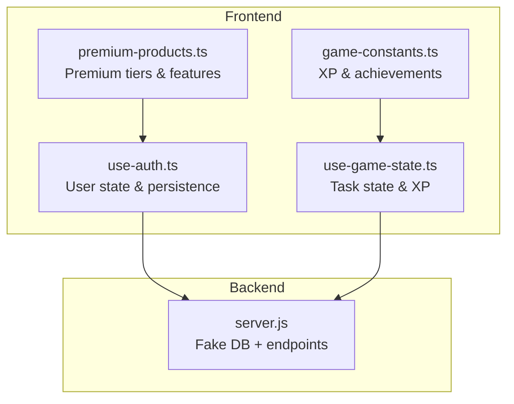
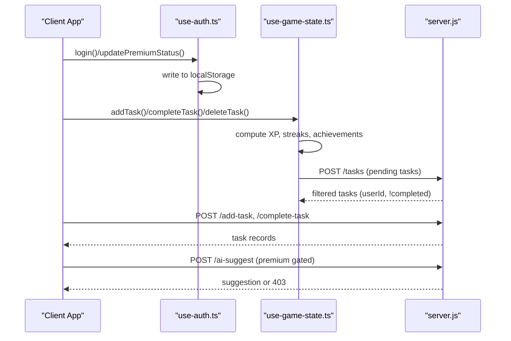
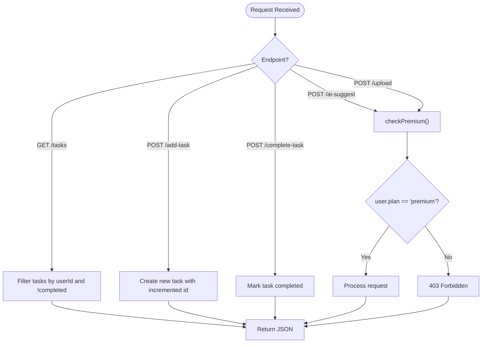
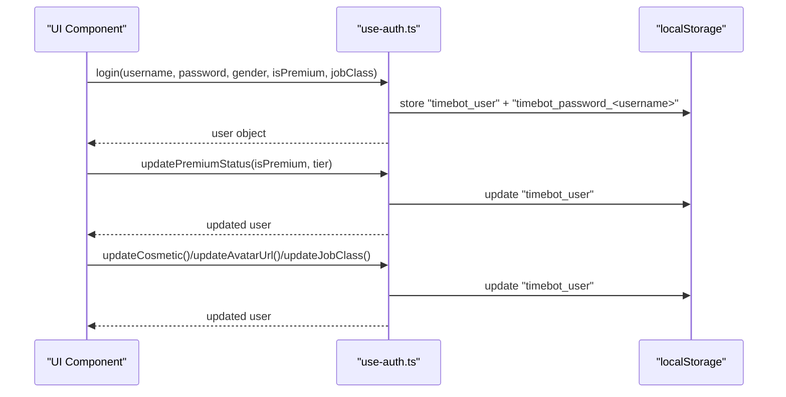
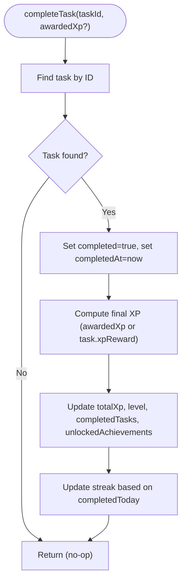
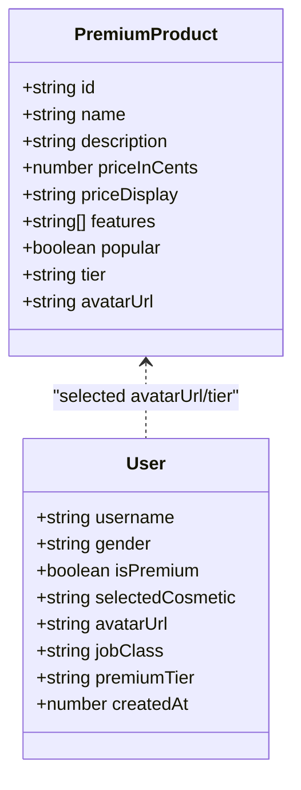
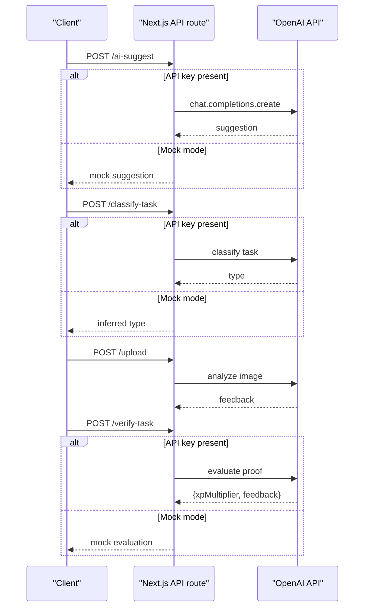
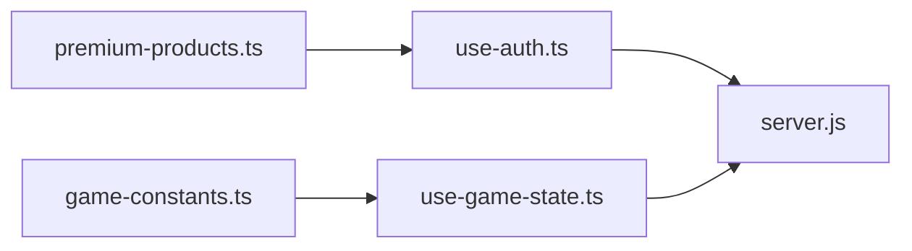
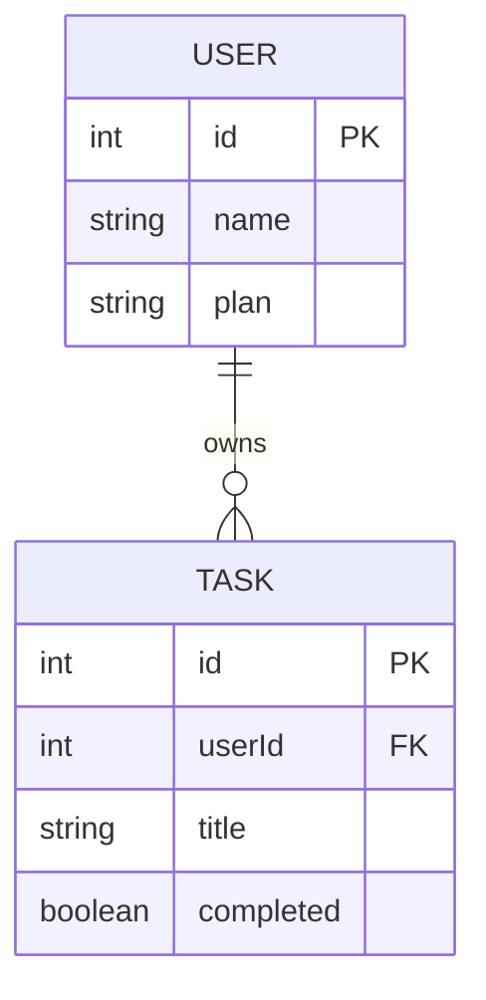

# Data Persistence

<cite>
**Referenced Files in This Document**
- [server.js](file://backend/server.js)
- [use-auth.ts](file://hooks/use-auth.ts)
- [use-game-state.ts](file://hooks/use-game-state.ts)
- [game-constants.ts](file://lib/game-constants.ts)
- [premium-products.ts](file://lib/premium-products.ts)
- [route.ts](file://app/api/ai-suggest/route.ts)
- [route.ts](file://app/api/classify-task/route.ts)
- [route.ts](file://app/api/upload/route.ts)
- [route.ts](file://app/api/verify-task/route.ts)
</cite>

## Table of Contents
1. [Introduction](#introduction)
2. [Project Structure](#project-structure)
3. [Core Components](#core-components)
4. [Architecture Overview](#architecture-overview)
5. [Detailed Component Analysis](#detailed-component-analysis)
6. [Dependency Analysis](#dependency-analysis)
7. [Performance Considerations](#performance-considerations)
8. [Troubleshooting Guide](#troubleshooting-guide)
9. [Conclusion](#conclusion)
10. [Appendices](#appendices)

## Introduction
This document explains the data persistence strategy and database simulation used in the project. It covers the in-memory data structures for users and tasks, the data models and relationships, CRUD operations for task management and user account handling, premium status tracking, filtering mechanisms, and state management. It also documents the fake database implementation used for demonstration, its integration with premium features, and practical examples of data manipulation and validation. Finally, it outlines limitations of the in-memory approach, potential migration paths to persistent databases, and data integrity considerations.

## Project Structure
The data persistence strategy spans both frontend and backend layers:
- Frontend state management persists user profile and game state locally.
- Backend simulates a database with in-memory arrays for users and tasks and exposes REST-like endpoints.
- Premium features are integrated with both local user state and backend middleware checks.

**Diagram sources**
- [use-auth.ts:1-167](file://hooks/use-auth.ts#L1-L167)
- [use-game-state.ts:1-251](file://hooks/use-game-state.ts#L1-L251)
- [game-constants.ts:1-95](file://lib/game-constants.ts#L1-L95)
- [premium-products.ts:1-76](file://lib/premium-products.ts#L1-L76)
- [server.js:1-155](file://backend/server.js#L1-L155)

**Section sources**
- [use-auth.ts:1-167](file://hooks/use-auth.ts#L1-L167)
- [use-game-state.ts:1-251](file://hooks/use-game-state.ts#L1-L251)
- [game-constants.ts:1-95](file://lib/game-constants.ts#L1-L95)
- [premium-products.ts:1-76](file://lib/premium-products.ts#L1-L76)
- [server.js:1-155](file://backend/server.js#L1-L155)

## Core Components
- Fake in-memory database (users and tasks)
- User account and premium state management
- Task lifecycle and XP calculation
- Premium feature gating and avatar/cosmetic updates
- API routes for AI-powered features and verification

Key responsibilities:
- Persist user profile and premium status in browser storage.
- Persist tasks and XP locally for single-session continuity.
- Simulate backend CRUD operations with in-memory arrays.
- Enforce premium-only features via middleware.
- Provide AI-driven suggestions and verification with fallbacks.

**Section sources**
- [server.js:32-52](file://backend/server.js#L32-L52)
- [use-auth.ts:28-167](file://hooks/use-auth.ts#L28-L167)
- [use-game-state.ts:36-82](file://hooks/use-game-state.ts#L36-L82)
- [game-constants.ts:13-48](file://lib/game-constants.ts#L13-L48)
- [premium-products.ts:13-76](file://lib/premium-products.ts#L13-L76)

## Architecture Overview
The system combines local-first persistence with a lightweight backend simulation. Users and tasks are stored in memory on the server for demonstration, while clients persist user profiles and game state locally.

**Diagram sources**
- [use-auth.ts:60-109](file://hooks/use-auth.ts#L60-L109)
- [use-game-state.ts:127-210](file://hooks/use-game-state.ts#L127-L210)
- [server.js:57-86](file://backend/server.js#L57-L86)
- [server.js:89-106](file://backend/server.js#L89-L106)

## Detailed Component Analysis

### Fake Database Implementation (Backend)
The backend maintains two in-memory arrays representing users and tasks. It exposes endpoints for retrieving pending tasks, adding tasks, marking tasks complete, AI suggestions (premium gated), image upload with AI analysis (premium gated), and upgrading to premium.

Data models
- User: minimal profile with plan tracking.
- Task: belongs to a user, supports completion flag.

CRUD operations
- Retrieve pending tasks by user ID and completion status.
- Add a new task with auto-incremented ID.
- Mark an existing task as complete.
- Upgrade user plan to premium.

Premium gating
- Middleware checks user plan before allowing premium endpoints.

**Diagram sources**
- [server.js:57-86](file://backend/server.js#L57-L86)
- [server.js:89-135](file://backend/server.js#L89-L135)
- [server.js:44-52](file://backend/server.js#L44-L52)

**Section sources**
- [server.js:32-52](file://backend/server.js#L32-L52)
- [server.js:57-86](file://backend/server.js#L57-L86)
- [server.js:89-135](file://backend/server.js#L89-L135)
- [server.js:44-52](file://backend/server.js#L44-L52)

### User Account and Premium State Management (Frontend)
The authentication hook manages user identity, premium status, avatar selection, and job class. It reads from and writes to browser storage, ensuring defaults for premium users and non-premium users.

Data model
- User: username, gender, premium flags, tier, avatar URL, job class, creation timestamp.

Operations
- Login: validates credentials, constructs user record, stores in local storage.
- Update premium status: toggles premium flag, assigns tier-specific avatar, updates selection.
- Update cosmetic/avatar/job class: persists changes locally.
- Logout: clears stored user.

**Diagram sources**
- [use-auth.ts:60-109](file://hooks/use-auth.ts#L60-L109)
- [use-auth.ts:111-140](file://hooks/use-auth.ts#L111-L140)
- [use-auth.ts:142-147](file://hooks/use-auth.ts#L142-L147)

**Section sources**
- [use-auth.ts:4-13](file://hooks/use-auth.ts#L4-L13)
- [use-auth.ts:28-58](file://hooks/use-auth.ts#L28-L58)
- [use-auth.ts:60-109](file://hooks/use-auth.ts#L60-L109)
- [use-auth.ts:111-140](file://hooks/use-auth.ts#L111-L140)
- [use-auth.ts:142-147](file://hooks/use-auth.ts#L142-L147)

### Task Management and XP Calculation (Frontend)
The game state hook manages tasks and player statistics, computes XP and levels, tracks streaks, and detects new achievements. It persists the entire state to local storage.

Data model
- Task: unique ID, title, description, duration, difficulty, completion flags, XP reward, timestamps.
- PlayerStats: total XP, level, completed tasks, current streak, last task date, unlocked achievements.

Operations
- Add task: generates ID, calculates XP reward, sets timestamps, prepends to list.
- Complete task: marks as completed, updates XP, checks level-ups and achievements, updates streak.
- Delete task: removes by ID.
- Query helpers: active/completed tasks, total XP, current level, new achievements.

**Diagram sources**
- [use-game-state.ts:143-210](file://hooks/use-game-state.ts#L143-L210)
- [use-game-state.ts:84-125](file://hooks/use-game-state.ts#L84-L125)
- [game-constants.ts:13-48](file://lib/game-constants.ts#L13-L48)

**Section sources**
- [use-game-state.ts:15-47](file://hooks/use-game-state.ts#L15-L47)
- [use-game-state.ts:127-210](file://hooks/use-game-state.ts#L127-L210)
- [use-game-state.ts:84-125](file://hooks/use-game-state.ts#L84-L125)
- [game-constants.ts:13-48](file://lib/game-constants.ts#L13-L48)

### Premium Feature Integration
Premium products define tiers and features. The pricing page triggers premium upgrades, which update user state locally and influence UI and feature availability.

**Diagram sources**
- [premium-products.ts:1-11](file://lib/premium-products.ts#L1-L11)
- [use-auth.ts:4-13](file://hooks/use-auth.ts#L4-L13)

**Section sources**
- [premium-products.ts:13-76](file://lib/premium-products.ts#L13-L76)
- [use-auth.ts:90-109](file://hooks/use-auth.ts#L90-L109)

### AI-Powered Features and Verification (Frontend Routes)
The Next.js app routes integrate with OpenAI to provide AI suggestions, task classification, image upload feedback, and verification with XP multipliers. They include mock fallbacks when the API key is unavailable.

Endpoints and behavior
- AI suggestion: returns a gamified task suggestion.
- Task classification: categorizes tasks as written/physical/none.
- Image upload: analyzes uploaded images and returns feedback.
- Verification: evaluates proof images and returns XP multiplier and feedback.

**Diagram sources**
- [route.ts:8-33](file://app/api/ai-suggest/route.ts#L8-L33)
- [route.ts:8-42](file://app/api/classify-task/route.ts#L8-L42)
- [route.ts:8-42](file://app/api/upload/route.ts#L8-L42)
- [route.ts:8-54](file://app/api/verify-task/route.ts#L8-L54)

**Section sources**
- [route.ts:8-33](file://app/api/ai-suggest/route.ts#L8-L33)
- [route.ts:8-42](file://app/api/classify-task/route.ts#L8-L42)
- [route.ts:8-42](file://app/api/upload/route.ts#L8-L42)
- [route.ts:8-54](file://app/api/verify-task/route.ts#L8-L54)

## Dependency Analysis
- Frontend depends on constants for XP calculations and on hooks for state.
- Backend depends on environment configuration for OpenAI and on middleware for premium checks.
- Premium tiers influence user avatar and cosmetic selection.

**Diagram sources**
- [game-constants.ts:13-48](file://lib/game-constants.ts#L13-L48)
- [use-game-state.ts:127-210](file://hooks/use-game-state.ts#L127-L210)
- [premium-products.ts:13-76](file://lib/premium-products.ts#L13-L76)
- [use-auth.ts:90-109](file://hooks/use-auth.ts#L90-L109)
- [server.js:44-52](file://backend/server.js#L44-L52)

**Section sources**
- [game-constants.ts:13-48](file://lib/game-constants.ts#L13-L48)
- [premium-products.ts:13-76](file://lib/premium-products.ts#L13-L76)
- [use-auth.ts:90-109](file://hooks/use-auth.ts#L90-L109)
- [server.js:44-52](file://backend/server.js#L44-L52)

## Performance Considerations
- In-memory arrays scale poorly for large datasets; consider indexing by userId and completion status.
- Frequent local storage writes can block the UI; batch updates or throttle writes.
- OpenAI requests are asynchronous; ensure proper loading states and error handling.
- Filtering and sorting in memory can be optimized with memoization for frequently accessed views.

## Troubleshooting Guide
Common issues and resolutions
- Missing API key for AI features: routes fall back to mock responses; verify environment configuration.
- Premium endpoint returns 403: ensure user plan is set to premium on the backend simulation.
- Local storage corruption: parsing failures reset persisted state; clear storage keys and retry.
- Task XP anomalies: verify difficulty multipliers and duration inputs; ensure XP calculations align with constants.

**Section sources**
- [route.ts:12-20](file://app/api/ai-suggest/route.ts#L12-L20)
- [server.js:46-52](file://backend/server.js#L46-L52)
- [use-auth.ts:32-58](file://hooks/use-auth.ts#L32-L58)
- [game-constants.ts:44-48](file://lib/game-constants.ts#L44-L48)

## Conclusion
The project employs a hybrid approach: in-memory backend simulation for demonstration and local-first persistence for user and task state. This design enables rapid iteration and offline usability but requires careful planning for persistence, scaling, and data integrity. Premium features are tightly integrated with both frontend state and backend middleware, ensuring consistent behavior across environments.

## Appendices

### Data Models and Relationships
- User: identity, premium tier, avatar, job class, creation timestamp.
- Task: belongs to a user, includes metadata, completion state, XP reward, timestamps.
- PremiumProduct: defines tiers, features, pricing, and avatar assets.

**Diagram sources**
- [server.js:35-41](file://backend/server.js#L35-L41)

**Section sources**
- [server.js:35-41](file://backend/server.js#L35-L41)

### Practical Examples

- Add a task
  - Frontend: call addTask with title, description, duration, difficulty.
  - Backend: POST /add-task with userId and title; server responds with new task.

- Retrieve pending tasks
  - Frontend: call getActiveTasks or filter tasks locally.
  - Backend: POST /tasks with userId; server filters by userId and completion status.

- Mark task complete
  - Frontend: call completeTask with taskId; updates XP and achievements.
  - Backend: POST /complete-task with taskId; server toggles completion.

- Upgrade to premium
  - Frontend: updatePremiumStatus; sets premium flag and avatar.
  - Backend: POST /upgrade with userId; server updates plan.

- AI suggestion (premium)
  - Frontend: POST /ai-suggest with progress; server enforces premium middleware.

Validation examples
- Required fields: title and duration validated before adding tasks.
- Premium gating: middleware rejects non-premium users for premium endpoints.
- XP computation: derived from duration and difficulty multiplier.

**Section sources**
- [use-game-state.ts:127-141](file://hooks/use-game-state.ts#L127-L141)
- [server.js:66-76](file://backend/server.js#L66-L76)
- [use-game-state.ts:223-231](file://hooks/use-game-state.ts#L223-L231)
- [server.js:57-61](file://backend/server.js#L57-L61)
- [use-game-state.ts:143-210](file://hooks/use-game-state.ts#L143-L210)
- [server.js:81-86](file://backend/server.js#L81-L86)
- [use-auth.ts:90-109](file://hooks/use-auth.ts#L90-L109)
- [server.js:140-147](file://backend/server.js#L140-L147)
- [server.js:89-106](file://backend/server.js#L89-L106)

### Migration Paths and Data Integrity
- From in-memory arrays to persistent storage
  - Replace arrays with database-backed collections; maintain primary keys and foreign keys.
  - Add indexes on userId and completion status for efficient queries.
  - Implement transactions for task updates and XP adjustments.

- Data integrity
  - Normalize user and task entities; avoid duplicating premium state in multiple places.
  - Use atomic updates for XP and streaks to prevent race conditions.
  - Validate inputs on both frontend and backend; sanitize titles and descriptions.

- Scalability
  - Paginate task lists; cache frequent queries.
  - Use background jobs for AI processing; queue uploads and evaluations.

[No sources needed since this section provides general guidance]