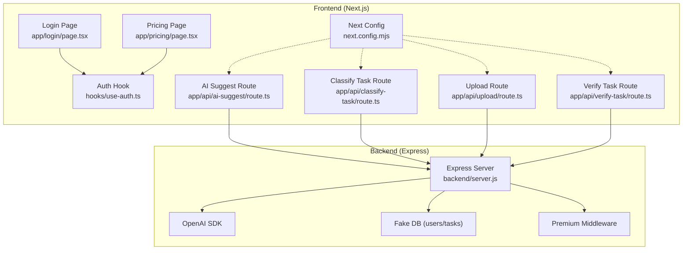
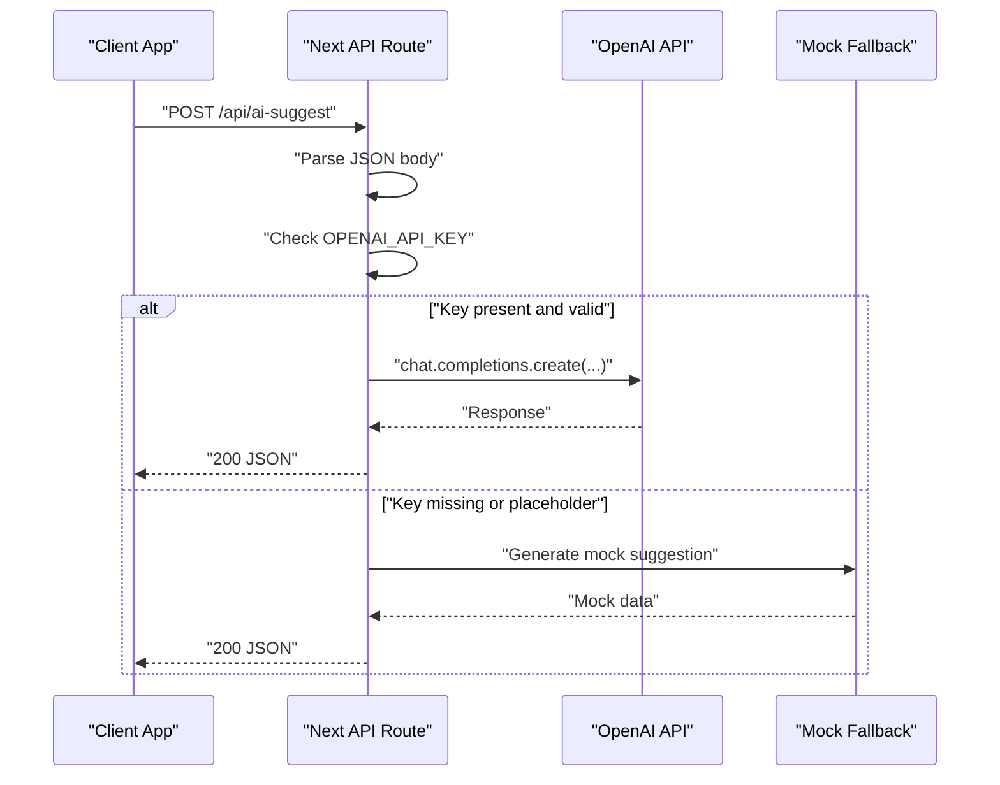
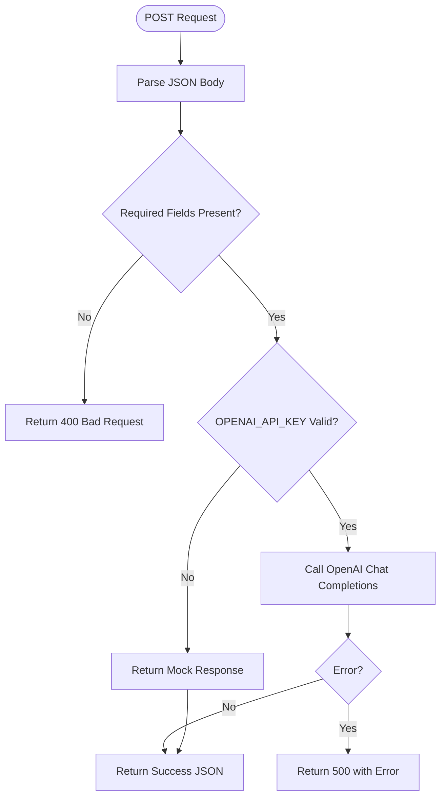
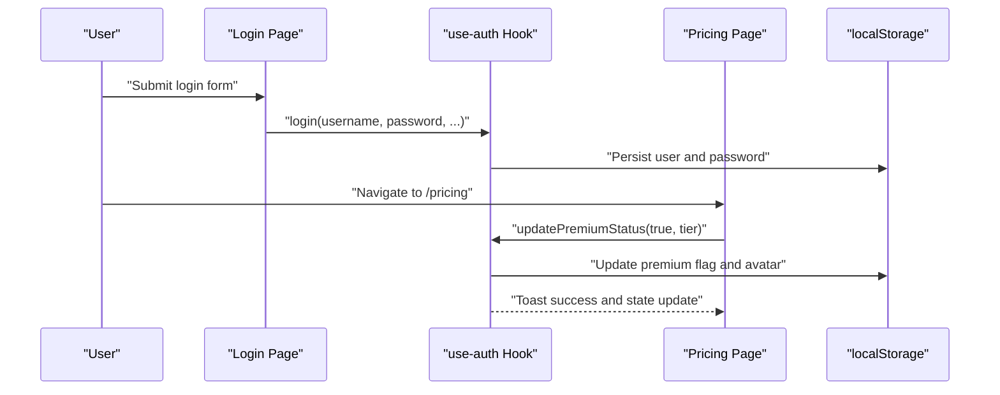
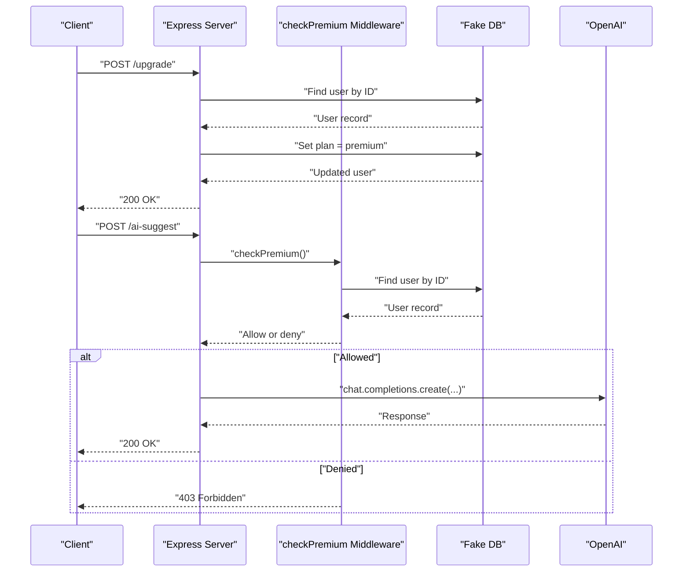
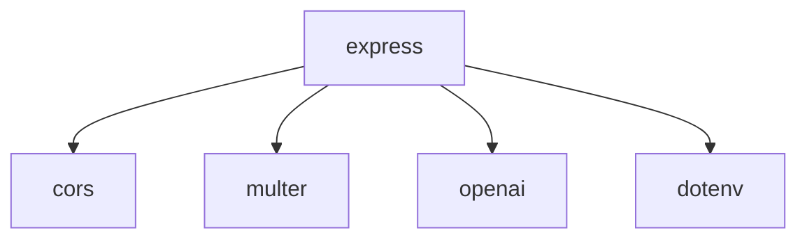

# Security and Middleware

<cite>
**Referenced Files in This Document**
- [route.ts](file://app/api/ai-suggest/route.ts)
- [route.ts](file://app/api/classify-task/route.ts)
- [route.ts](file://app/api/upload/route.ts)
- [route.ts](file://app/api/verify-task/route.ts)
- [use-auth.ts](file://hooks/use-auth.ts)
- [page.tsx](file://app/login/page.tsx)
- [page.tsx](file://app/pricing/page.tsx)
- [premium-cosmetics.ts](file://lib/premium-cosmetics.ts)
- [premium-products.ts](file://lib/premium-products.ts)
- [premium-upgrade-banner.tsx](file://components/premium-upgrade-banner.tsx)
- [server.js](file://backend/server.js)
- [package.json](file://backend/package.json)
- [next.config.mjs](file://next.config.mjs)
</cite>

## Table of Contents
1. [Introduction](#introduction)
2. [Project Structure](#project-structure)
3. [Core Components](#core-components)
4. [Architecture Overview](#architecture-overview)
5. [Detailed Component Analysis](#detailed-component-analysis)
6. [Dependency Analysis](#dependency-analysis)
7. [Performance Considerations](#performance-considerations)
8. [Troubleshooting Guide](#troubleshooting-guide)
9. [Conclusion](#conclusion)
10. [Appendices](#appendices)

## Introduction
This document focuses on security implementations and middleware patterns across the frontend and backend systems. It explains how user plan validation and authentication checks are enforced, how request validation and error handling are performed, and how the system integrates with OpenAI APIs while managing API keys and secure communication. It also documents the simulated payment system and premium feature gating mechanisms, along with practical examples of middleware implementation, security best practices, and vulnerability prevention strategies.

## Project Structure
The repository is a Next.js application with a small Express backend. The frontend exposes several API routes under app/api that integrate with OpenAI. Authentication and premium features are handled client-side with local storage and a dedicated hook. The backend provides middleware for premium gating and simulates payment and task management.

**Diagram sources**
- [route.ts:1-34](file://app/api/ai-suggest/route.ts#L1-L34)
- [route.ts:1-43](file://app/api/classify-task/route.ts#L1-L43)
- [route.ts:1-43](file://app/api/upload/route.ts#L1-L43)
- [route.ts:1-55](file://app/api/verify-task/route.ts#L1-L55)
- [use-auth.ts:1-167](file://hooks/use-auth.ts#L1-L167)
- [page.tsx:1-668](file://app/login/page.tsx#L1-L668)
- [page.tsx:1-176](file://app/pricing/page.tsx#L1-L176)
- [server.js:1-155](file://backend/server.js#L1-L155)
- [next.config.mjs:1-15](file://next.config.mjs#L1-L15)

**Section sources**
- [route.ts:1-34](file://app/api/ai-suggest/route.ts#L1-L34)
- [route.ts:1-43](file://app/api/classify-task/route.ts#L1-L43)
- [route.ts:1-43](file://app/api/upload/route.ts#L1-L43)
- [route.ts:1-55](file://app/api/verify-task/route.ts#L1-L55)
- [use-auth.ts:1-167](file://hooks/use-auth.ts#L1-L167)
- [page.tsx:1-668](file://app/login/page.tsx#L1-L668)
- [page.tsx:1-176](file://app/pricing/page.tsx#L1-L176)
- [server.js:1-155](file://backend/server.js#L1-L155)
- [next.config.mjs:1-15](file://next.config.mjs#L1-L15)

## Core Components
- Frontend API routes: Implement OpenAI integrations with request parsing, mock fallbacks, and error handling.
- Authentication and premium system: Client-side user state management, premium toggling, and UI-driven upgrade flow.
- Backend middleware: Premium gating for sensitive endpoints and simulated payment flow.
- OpenAI integration: Centralized client initialization and secure API key handling.

Key implementation patterns:
- Request validation: JSON parsing and presence checks for required fields.
- Error handling: Try/catch blocks returning structured JSON with appropriate HTTP status codes.
- Premium gating: Middleware checking user plan before allowing access to premium features.
- Secure communication: Environment variable usage for API keys and explicit mock fallbacks when keys are missing.

**Section sources**
- [route.ts:8-32](file://app/api/ai-suggest/route.ts#L8-L32)
- [route.ts:8-41](file://app/api/classify-task/route.ts#L8-L41)
- [route.ts:8-41](file://app/api/upload/route.ts#L8-L41)
- [route.ts:8-53](file://app/api/verify-task/route.ts#L8-L53)
- [use-auth.ts:28-167](file://hooks/use-auth.ts#L28-L167)
- [server.js:44-52](file://backend/server.js#L44-L52)
- [server.js:140-147](file://backend/server.js#L140-L147)

## Architecture Overview
The system comprises:
- Frontend API routes that accept requests, validate inputs, and call OpenAI. They include a mock fallback when the API key is absent or placeholder-like.
- Client-side authentication and premium state managed via a custom hook and persisted in local storage.
- Backend Express server with a premium middleware and simulated payment endpoint.
- Next.js configuration affecting image handling and logging.

**Diagram sources**
- [route.ts:8-32](file://app/api/ai-suggest/route.ts#L8-L32)

**Section sources**
- [route.ts:1-34](file://app/api/ai-suggest/route.ts#L1-L34)
- [route.ts:1-43](file://app/api/classify-task/route.ts#L1-L43)
- [route.ts:1-43](file://app/api/upload/route.ts#L1-L43)
- [route.ts:1-55](file://app/api/verify-task/route.ts#L1-L55)
- [server.js:1-155](file://backend/server.js#L1-L155)
- [next.config.mjs:1-15](file://next.config.mjs#L1-L15)

## Detailed Component Analysis

### Frontend API Routes Security and Validation
Each route performs:
- Request parsing: JSON body extraction for required fields.
- Presence checks: Ensures required fields are provided; returns 400 for invalid payloads.
- OpenAI integration: Creates chat completions with carefully constructed prompts.
- Error handling: Catches exceptions and returns 500 with error details.
- Mock fallback: When the API key is missing or placeholder-like, routes return mock data instead of calling OpenAI.

**Diagram sources**
- [route.ts:8-32](file://app/api/ai-suggest/route.ts#L8-L32)
- [route.ts:8-41](file://app/api/classify-task/route.ts#L8-L41)
- [route.ts:8-41](file://app/api/upload/route.ts#L8-L41)
- [route.ts:8-53](file://app/api/verify-task/route.ts#L8-L53)

**Section sources**
- [route.ts:8-32](file://app/api/ai-suggest/route.ts#L8-L32)
- [route.ts:8-41](file://app/api/classify-task/route.ts#L8-L41)
- [route.ts:8-41](file://app/api/upload/route.ts#L8-L41)
- [route.ts:8-53](file://app/api/verify-task/route.ts#L8-L53)

### Authentication and Authorization Patterns
Client-side authentication and premium gating:
- Local storage: Stores user profile and credentials stubs for demonstration.
- Premium state: Tracks isPremium flag and tier to enable premium features and avatars.
- UI-driven flow: Pricing page allows upgrading; the hook updates local storage and triggers UI feedback.
- Authorization pattern: Premium features are gated by client-side checks (e.g., banner visibility and cosmetic availability).

**Diagram sources**
- [page.tsx:270-312](file://app/login/page.tsx#L270-L312)
- [use-auth.ts:60-109](file://hooks/use-auth.ts#L60-L109)
- [page.tsx:18-34](file://app/pricing/page.tsx#L18-L34)

**Section sources**
- [use-auth.ts:28-167](file://hooks/use-auth.ts#L28-L167)
- [page.tsx:270-312](file://app/login/page.tsx#L270-L312)
- [page.tsx:18-34](file://app/pricing/page.tsx#L18-L34)
- [premium-upgrade-banner.tsx:7-12](file://components/premium-upgrade-banner.tsx#L7-L12)
- [premium-cosmetics.ts:1-77](file://lib/premium-cosmetics.ts#L1-L77)
- [premium-products.ts:1-76](file://lib/premium-products.ts#L1-L76)

### Backend Premium Middleware and Payment Simulation
Backend middleware and endpoints:
- Premium middleware: Validates user plan before allowing access to premium routes.
- Simulated payment: Upgrades a user’s plan to premium in-memory.
- File upload and AI analysis: Requires premium plan and uses multer for uploads.

**Diagram sources**
- [server.js:44-52](file://backend/server.js#L44-L52)
- [server.js:140-147](file://backend/server.js#L140-L147)
- [server.js:89-106](file://backend/server.js#L89-L106)

**Section sources**
- [server.js:44-52](file://backend/server.js#L44-L52)
- [server.js:89-106](file://backend/server.js#L89-L106)
- [server.js:111-135](file://backend/server.js#L111-L135)
- [server.js:140-147](file://backend/server.js#L140-L147)

### OpenAI Integration Security and Rate Limiting
- API key management: API key is loaded from environment variables and validated in routes; a placeholder guard triggers mock responses.
- Secure communication: Calls are made to OpenAI’s official API endpoints.
- Rate limiting: No explicit rate limiting is implemented in the frontend routes; consider adding per-user or IP-based limits in production.

Recommendations:
- Enforce strict API key validation and avoid exposing keys in client-side code.
- Implement request throttling and circuit breakers for external API calls.
- Add retries with exponential backoff and circuit breaker patterns.

**Section sources**
- [route.ts:4-6](file://app/api/ai-suggest/route.ts#L4-L6)
- [route.ts:12-20](file://app/api/ai-suggest/route.ts#L12-L20)
- [route.ts:4-6](file://app/api/classify-task/route.ts#L4-L6)
- [route.ts:4-6](file://app/api/upload/route.ts#L4-L6)
- [route.ts:4-6](file://app/api/verify-task/route.ts#L4-L6)

### CORS Configuration
- The backend enables CORS globally without restrictions. This simplifies development but should be scoped to trusted origins in production.
- Consider configuring CORS with origin lists, credentials support, and preflight caching.

**Section sources**
- [server.js:8-8](file://backend/server.js#L8-L8)

### Input Sanitization and Validation
- Frontend routes validate presence of required fields and return 400 for missing data.
- Image upload routes validate file presence and construct OpenAI payloads safely.
- Consider adding schema validation (e.g., Zod) and input length limits for robustness.

**Section sources**
- [route.ts:8-15](file://app/api/ai-suggest/route.ts#L8-L15)
- [route.ts:8-10](file://app/api/classify-task/route.ts#L8-L10)
- [route.ts:8-15](file://app/api/upload/route.ts#L8-L15)
- [route.ts:8-14](file://app/api/verify-task/route.ts#L8-L14)

### Protection Against Common Attacks
- Injection: Construct prompts programmatically; avoid raw user input interpolation. Use structured prompts and limit token counts.
- DoS: Apply request size limits, enforce timeouts, and add circuit breakers for OpenAI calls.
- Information disclosure: Return minimal error details; log internal errors securely without exposing stack traces.
- CSRF: Not applicable for serverless-style API routes invoked from the same origin.
- XSS: Avoid rendering raw user input; sanitize and escape outputs.

**Section sources**
- [route.ts:22-27](file://app/api/ai-suggest/route.ts#L22-L27)
- [route.ts:20-30](file://app/api/classify-task/route.ts#L20-L30)
- [route.ts:22-36](file://app/api/upload/route.ts#L22-L36)
- [route.ts:24-43](file://app/api/verify-task/route.ts#L24-L43)

### Practical Middleware Implementation Examples
- Premium gating middleware: Validate user plan before processing premium endpoints.
- Request validation middleware: Ensure required fields are present and typed appropriately.
- Error handling middleware: Centralize error responses and logging.

**Section sources**
- [server.js:44-52](file://backend/server.js#L44-L52)
- [route.ts:8-15](file://app/api/ai-suggest/route.ts#L8-L15)
- [route.ts:8-10](file://app/api/classify-task/route.ts#L8-L10)

## Dependency Analysis
External dependencies impacting security:
- Express: Core web framework; ensure latest patch versions to mitigate known vulnerabilities.
- CORS: Global enablement requires careful origin policy in production.
- Multer: File upload handling; configure safe storage and size limits.
- OpenAI SDK: Integrates with OpenAI services; keep updated and monitor rate limits.

**Diagram sources**
- [package.json:4-11](file://backend/package.json#L4-L11)

**Section sources**
- [package.json:4-11](file://backend/package.json#L4-L11)
- [server.js:1-10](file://backend/server.js#L1-L10)

## Performance Considerations
- Frontend API routes: Minimize payload sizes and avoid unnecessary re-renders. Debounce or throttle frequent requests.
- Backend: Use connection pooling and circuit breakers for OpenAI calls. Cache non-sensitive data where appropriate.
- Image uploads: Validate MIME types and enforce size limits to prevent resource exhaustion.

## Troubleshooting Guide
Common issues and resolutions:
- Missing or invalid API key: Routes fall back to mock responses. Ensure environment variables are configured correctly.
- 400 errors: Verify required fields in the request body.
- 403 errors (premium): Confirm user plan is upgraded via the simulated payment endpoint.
- 500 errors: Inspect server logs for OpenAI errors and network connectivity issues.

**Section sources**
- [route.ts:12-20](file://app/api/ai-suggest/route.ts#L12-L20)
- [route.ts:30-32](file://app/api/ai-suggest/route.ts#L30-L32)
- [server.js:46-51](file://backend/server.js#L46-L51)
- [server.js:140-147](file://backend/server.js#L140-L147)

## Conclusion
The system implements a layered security model: client-side premium gating, backend middleware enforcement, and OpenAI integration with API key validation and mock fallbacks. To harden the system, scope CORS, add robust input validation, implement rate limiting and circuit breakers, and adopt centralized error handling. The simulated payment and premium feature mechanisms provide a realistic upgrade flow suitable for demonstration and can be extended to real payment providers.

## Appendices
- Next.js configuration notes: Images are unoptimized and logging is enabled for terminal output. These settings impact performance and observability but are not security-critical.

**Section sources**
- [next.config.mjs:3-12](file://next.config.mjs#L3-L12)