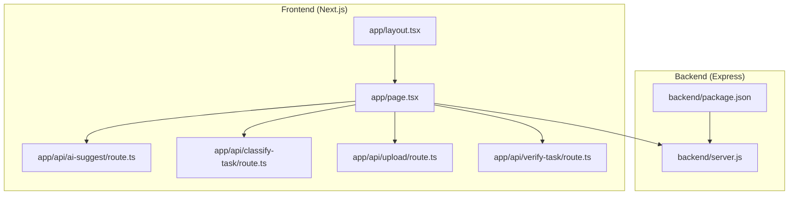
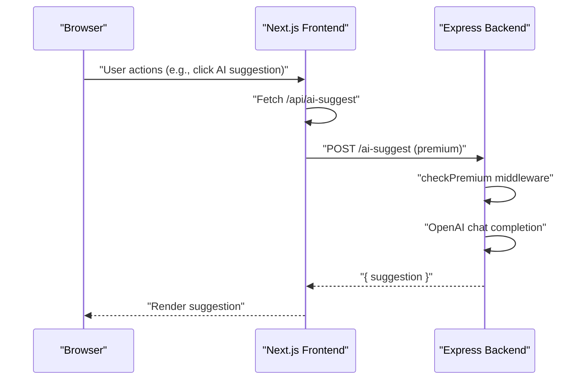
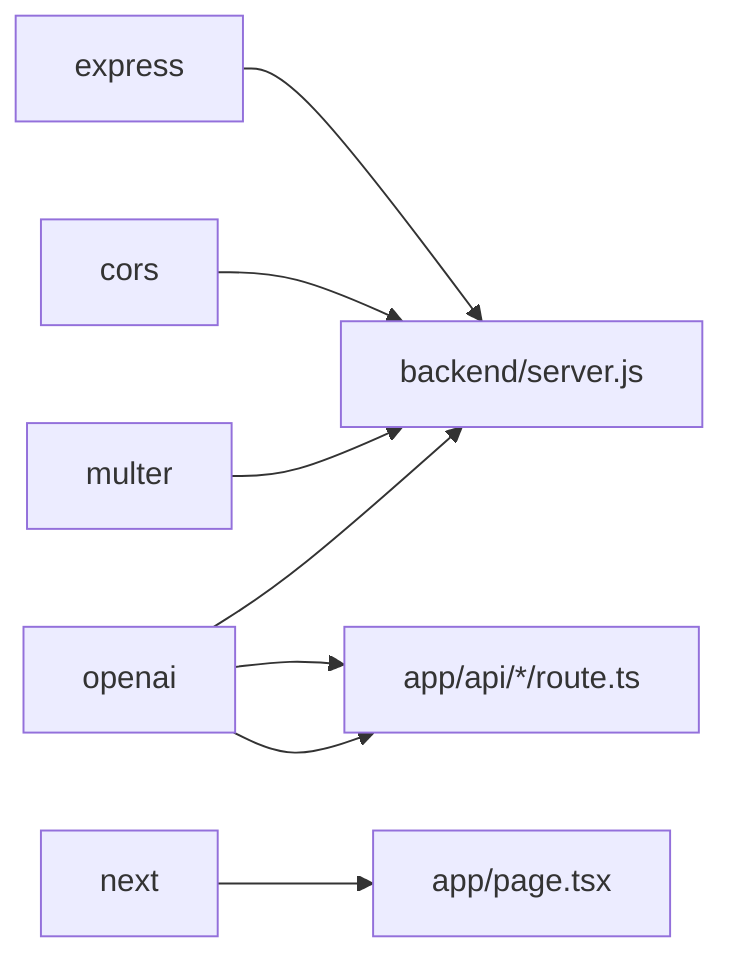

# Server Configuration

<cite>
**Referenced Files in This Document**
- [server.js](file://backend/server.js)
- [package.json](file://backend/package.json)
- [route.ts](file://app/api/ai-suggest/route.ts)
- [route.ts](file://app/api/classify-task/route.ts)
- [route.ts](file://app/api/upload/route.ts)
- [route.ts](file://app/api/verify-task/route.ts)
- [package.json](file://package.json)
- [next.config.mjs](file://next.config.mjs)
- [layout.tsx](file://app/layout.tsx)
- [page.tsx](file://app/page.tsx)
</cite>

## Table of Contents
1. [Introduction](#introduction)
2. [Project Structure](#project-structure)
3. [Core Components](#core-components)
4. [Architecture Overview](#architecture-overview)
5. [Detailed Component Analysis](#detailed-component-analysis)
6. [Dependency Analysis](#dependency-analysis)
7. [Performance Considerations](#performance-considerations)
8. [Troubleshooting Guide](#troubleshooting-guide)
9. [Conclusion](#conclusion)
10. [Appendices](#appendices)

## Introduction
This document explains the Express.js server configuration and setup for the backend service. It covers initialization, middleware configuration (CORS and JSON parsing), environment variable handling, dependency management, server startup, port configuration, development versus production settings, OpenAI API integration, Multer file upload configuration, and a fake in-memory database used for demonstration. Practical examples, security considerations, error handling patterns, and performance optimization recommendations are included to help developers configure, deploy, and operate the server effectively.

## Project Structure
The backend server is implemented as a standalone Express application located under the backend directory. The frontend Next.js application lives under the app directory and communicates with the backend via API routes and direct server endpoints. The server exposes endpoints for task management, AI-powered suggestions, image uploads with AI analysis, and simulated premium upgrades.

**Diagram sources**
- [server.js](file://backend/server.js)
- [package.json](file://backend/package.json)
- [route.ts](file://app/api/ai-suggest/route.ts)
- [route.ts](file://app/api/classify-task/route.ts)
- [route.ts](file://app/api/upload/route.ts)
- [route.ts](file://app/api/verify-task/route.ts)
- [layout.tsx](file://app/layout.tsx)
- [page.tsx](file://app/page.tsx)

**Section sources**
- [server.js](file://backend/server.js)
- [package.json](file://backend/package.json)
- [layout.tsx](file://app/layout.tsx)
- [page.tsx](file://app/page.tsx)

## Core Components
- Express application initialization and middleware stack
- CORS and JSON body parsing configuration
- OpenAI client setup using environment variables
- Multer disk storage configuration for file uploads
- In-memory fake database for users and tasks
- Middleware enforcing premium plan access for advanced features
- Endpoint handlers for task management and AI integrations
- Server startup on a fixed port

Key implementation references:
- Server initialization and middleware: [server.js](file://backend/server.js)
- OpenAI setup: [server.js](file://backend/server.js)
- Multer configuration: [server.js](file://backend/server.js)
- Fake database: [server.js](file://backend/server.js)
- Premium middleware: [server.js](file://backend/server.js)
- Endpoints: [server.js](file://backend/server.js)

**Section sources**
- [server.js](file://backend/server.js)

## Architecture Overview
The backend server runs as a standalone Express service. The frontend Next.js app communicates with the backend via:
- Direct server endpoints for task management and premium features
- Next.js API routes for AI classification, suggestions, and image verification

**Diagram sources**
- [server.js](file://backend/server.js)
- [route.ts](file://app/api/ai-suggest/route.ts)

**Section sources**
- [server.js](file://backend/server.js)
- [route.ts](file://app/api/ai-suggest/route.ts)

## Detailed Component Analysis

### Express Initialization and Middleware
- Environment loading: The server loads environment variables from a parent directory path using dotenv.
- CORS enabled globally to allow cross-origin requests.
- JSON body parsing enabled for request payloads.
- Port binding occurs at startup.

Implementation references:
- Environment loading and imports: [server.js](file://backend/server.js)
- CORS and JSON middleware: [server.js](file://backend/server.js)
- Server listen: [server.js](file://backend/server.js)

Security and performance notes:
- Global CORS allows any origin; restrict origins in production.
- JSON body parser supports reasonable payload sizes; consider rate limiting and payload limits for production.

**Section sources**
- [server.js](file://backend/server.js)

### OpenAI Integration Setup
- The server initializes the OpenAI client using the OPENAI_API_KEY environment variable.
- Premium endpoints (/ai-suggest and /upload) call the OpenAI chat completions API.
- The frontend also integrates OpenAI via Next.js API routes for classification, suggestions, and verification.

Implementation references:
- Server OpenAI client: [server.js](file://backend/server.js)
- Frontend AI suggestion route: [route.ts](file://app/api/ai-suggest/route.ts)
- Frontend classification route: [route.ts](file://app/api/classify-task/route.ts)
- Frontend upload route: [route.ts](file://app/api/upload/route.ts)
- Frontend verification route: [route.ts](file://app/api/verify-task/route.ts)

Mock behavior:
- When OPENAI_API_KEY is missing or equals a placeholder value, the frontend routes return mock responses instead of calling OpenAI.

**Section sources**
- [server.js](file://backend/server.js)
- [route.ts](file://app/api/ai-suggest/route.ts)
- [route.ts](file://app/api/classify-task/route.ts)
- [route.ts](file://app/api/upload/route.ts)
- [route.ts](file://app/api/verify-task/route.ts)

### Multer File Upload Configuration
- Disk storage configured with a destination folder and timestamped filenames.
- Single file upload handler for image-based AI analysis.
- Image URL constructed using the local server address for OpenAI multimodal input.

Implementation references:
- Storage configuration: [server.js](file://backend/server.js)
- Upload endpoint: [server.js](file://backend/server.js)

Security considerations:
- Ensure the uploads directory is writable and protected.
- Validate file types and sizes; consider streaming uploads for large files.
- Serve uploaded files securely and avoid exposing internal paths.

**Section sources**
- [server.js](file://backend/server.js)

### Fake Database Implementation
- In-memory arrays represent users and tasks for demonstration.
- CRUD-like operations are performed via filtering and mutation.
- Premium upgrade endpoint updates user plan.

Implementation references:
- Users and tasks arrays: [server.js](file://backend/server.js)
- Task endpoints: [server.js](file://backend/server.js)
- Premium upgrade endpoint: [server.js](file://backend/server.js)

Operational notes:
- This is for demo purposes; replace with a persistent database in production.
- Add input validation and sanitization for all endpoints.

**Section sources**
- [server.js](file://backend/server.js)

### Premium Middleware and Feature Gates
- A middleware checks the user’s plan before allowing access to premium features.
- Returns a 403 response if the user is not premium.

Implementation references:
- Premium middleware: [server.js](file://backend/server.js)
- AI suggestion endpoint: [server.js](file://backend/server.js)
- Upload endpoint: [server.js](file://backend/server.js)

**Section sources**
- [server.js](file://backend/server.js)

### Server Startup and Port Configuration
- The server listens on port 3000.
- Logs a startup message upon successful binding.

Implementation references:
- Listen call: [server.js](file://backend/server.js)

Deployment considerations:
- Bind to environment-configured ports in containerized environments.
- Use reverse proxies and HTTPS termination in production.

**Section sources**
- [server.js](file://backend/server.js)

### Frontend Integration Points
- The Next.js frontend interacts with backend endpoints and API routes.
- Example: fetching AI suggestions triggers a POST to /api/ai-suggest.

Implementation references:
- Frontend integration: [page.tsx](file://app/page.tsx)
- API routes: [route.ts](file://app/api/ai-suggest/route.ts), [route.ts](file://app/api/classify-task/route.ts), [route.ts](file://app/api/upload/route.ts), [route.ts](file://app/api/verify-task/route.ts)

**Section sources**
- [page.tsx](file://app/page.tsx)
- [route.ts](file://app/api/ai-suggest/route.ts)
- [route.ts](file://app/api/classify-task/route.ts)
- [route.ts](file://app/api/upload/route.ts)
- [route.ts](file://app/api/verify-task/route.ts)

## Dependency Analysis
The backend server depends on Express, CORS, Multer, and the OpenAI SDK. The frontend Next.js application also depends on the OpenAI SDK for client-side AI features.

**Diagram sources**
- [server.js](file://backend/server.js)
- [package.json](file://backend/package.json)
- [package.json](file://package.json)
- [route.ts](file://app/api/ai-suggest/route.ts)
- [route.ts](file://app/api/classify-task/route.ts)
- [route.ts](file://app/api/upload/route.ts)
- [route.ts](file://app/api/verify-task/route.ts)

**Section sources**
- [server.js](file://backend/server.js)
- [package.json](file://backend/package.json)
- [package.json](file://package.json)

## Performance Considerations
- Limit payload sizes and enable rate limiting for endpoints.
- Use streaming uploads for large files and consider memory constraints.
- Cache frequently accessed data and avoid unnecessary computations.
- Monitor OpenAI API latency and errors; implement retries with backoff.
- Use environment-specific configurations for logging and image optimization.

[No sources needed since this section provides general guidance]

## Troubleshooting Guide
Common issues and resolutions:
- Missing environment variables:
  - Ensure OPENAI_API_KEY is set in the environment.
  - Verify dotenv path resolution for environment loading.
- CORS errors:
  - Confirm CORS middleware is enabled; adjust allowed origins for production.
- Multer upload failures:
  - Check write permissions for the uploads directory.
  - Validate file size and type constraints.
- Premium feature access denied:
  - Confirm user plan is upgraded via the premium endpoint.
- OpenAI API errors:
  - Inspect error responses and log messages for actionable diagnostics.
  - Implement fallbacks for offline or degraded modes.

**Section sources**
- [server.js](file://backend/server.js)

## Conclusion
The backend server provides a minimal yet functional foundation for a gamified task management application. It demonstrates Express initialization, middleware configuration, environment handling, OpenAI integration, file uploads, and a simple in-memory database. For production, secure CORS, enforce strict input validation, implement robust error handling, and integrate a persistent database and proper monitoring.

[No sources needed since this section summarizes without analyzing specific files]

## Appendices

### Environment Variables
- OPENAI_API_KEY: API key for OpenAI access.
- NEXT_PUBLIC_APP_URL: Public application URL for metadata and assets.
- NEXT_PUBLIC_SITE_NAME: Site name for metadata and branding.

References:
- Server OpenAI client: [server.js](file://backend/server.js)
- Frontend metadata: [layout.tsx](file://app/layout.tsx)

**Section sources**
- [server.js](file://backend/server.js)
- [layout.tsx](file://app/layout.tsx)

### Development vs Production Settings
- Development:
  - Next.js dev server runs on port 3000; backend server runs on port 3000.
  - Logging is enabled; images are unoptimized for development convenience.
- Production:
  - Configure HTTPS, reverse proxy, and environment variables.
  - Optimize images and disable development-only logging.
  - Restrict CORS origins and enforce stricter input validation.

References:
- Next.js config: [next.config.mjs](file://next.config.mjs)
- Frontend metadata: [layout.tsx](file://app/layout.tsx)

**Section sources**
- [next.config.mjs](file://next.config.mjs)
- [layout.tsx](file://app/layout.tsx)

### Security Configurations
- CORS: Enable only trusted origins in production.
- Input validation: Sanitize and validate all request bodies.
- File uploads: Enforce file type and size limits; serve files securely.
- API keys: Store secrets outside version control; rotate regularly.

[No sources needed since this section provides general guidance]

### Error Handling Patterns
- Centralized try/catch blocks around asynchronous operations.
- Return structured JSON error responses with appropriate HTTP status codes.
- Log errors with context for debugging and monitoring.

References:
- AI suggestion endpoint: [server.js](file://backend/server.js)
- Upload endpoint: [server.js](file://backend/server.js)

**Section sources**
- [server.js](file://backend/server.js)

### Deployment Considerations
- Containerization: Package backend and frontend together or separately.
- Reverse proxy: Route frontend and backend traffic appropriately.
- Static assets: Build and optimize frontend assets for production.
- Monitoring: Add health checks, logs, and metrics collection.

[No sources needed since this section provides general guidance]