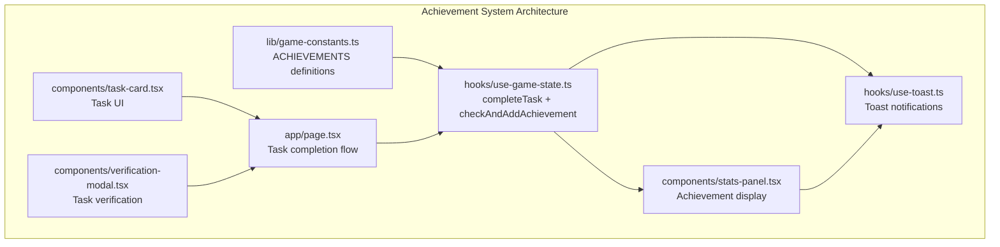
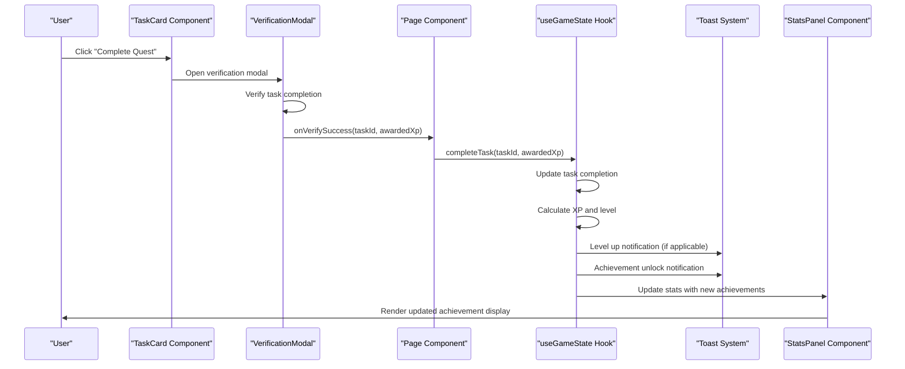
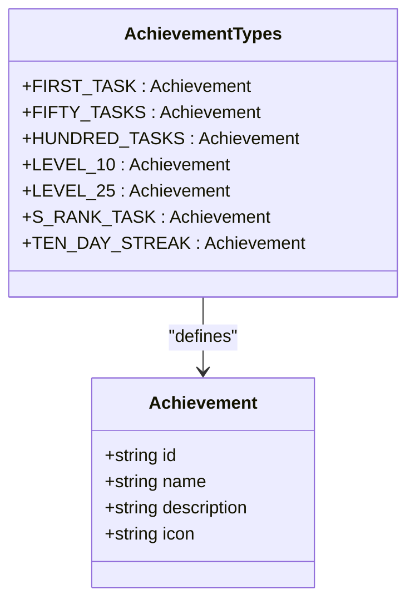
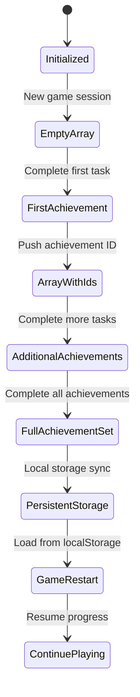
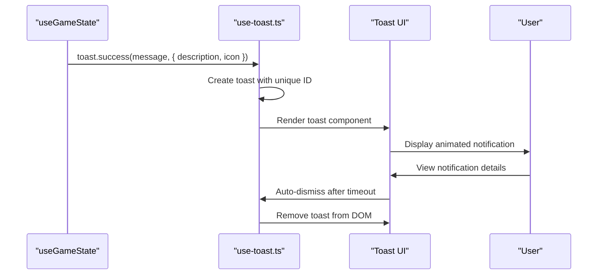
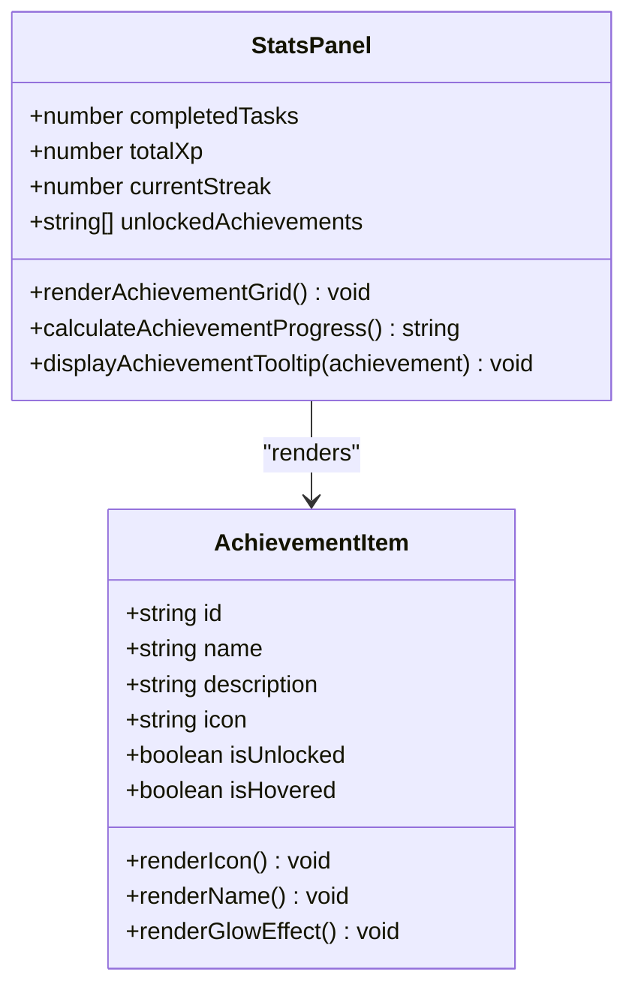
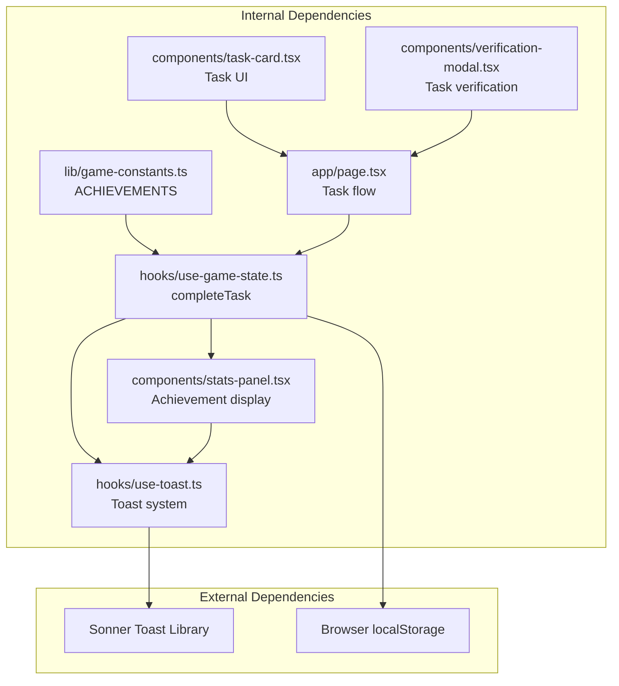

# Achievement System

<cite>
**Referenced Files in This Document**
- [game-constants.ts](file://lib/game-constants.ts)
- [use-game-state.ts](file://hooks/use-game-state.ts)
- [stats-panel.tsx](file://components/stats-panel.tsx)
- [page.tsx](file://app/page.tsx)
- [verification-modal.tsx](file://components/verification-modal.tsx)
- [task-card.tsx](file://components/task-card.tsx)
- [use-toast.ts](file://hooks/use-toast.ts)
</cite>

## Table of Contents
1. [Introduction](#introduction)
2. [Project Structure](#project-structure)
3. [Core Components](#core-components)
4. [Architecture Overview](#architecture-overview)
5. [Detailed Component Analysis](#detailed-component-analysis)
6. [Dependency Analysis](#dependency-analysis)
7. [Performance Considerations](#performance-considerations)
8. [Troubleshooting Guide](#troubleshooting-guide)
9. [Conclusion](#conclusion)

## Introduction
This document provides comprehensive documentation for the achievement system in the Solo Leveling game. It covers achievement definitions, unlock conditions, progress tracking mechanisms, and the toast notification system for achievement unlocks. The system tracks seven distinct achievement types: Awakening (first task), Rising Hunter (50 tasks), Veteran Hunter (100 tasks), Ascension (level 10), Realm Breaker (level 25), Legendary (S-rank tasks), and Perseverance (10-day streak). The documentation explains the completeTask function's unlock logic, the checkAndAddAchievement mechanism, the ACHIEVEMENTS constant structure, and how achievements are stored in the unlockedAchievements array. It also details the toast notification system with custom icons and descriptions, provides examples of achievement triggers, progress tracking, and UI display.

## Project Structure
The achievement system spans several key files:
- Achievement definitions and constants are centralized in the game constants module
- Achievement logic and state updates are handled in the game state hook
- Achievement display is rendered in the statistics panel component
- Task completion and verification flow integrates with achievement triggers
- Toast notifications are managed through the toast hook

**Diagram sources**
- [game-constants.ts:50-94](file://lib/game-constants.ts#L50-L94)
- [use-game-state.ts:143-210](file://hooks/use-game-state.ts#L143-L210)
- [stats-panel.tsx:1-145](file://components/stats-panel.tsx#L1-L145)
- [page.tsx:111-126](file://app/page.tsx#L111-L126)
- [verification-modal.tsx:112-145](file://components/verification-modal.tsx#L112-L145)
- [task-card.tsx:25-36](file://components/task-card.tsx#L25-L36)
- [use-toast.ts:142-169](file://hooks/use-toast.ts#L142-L169)

**Section sources**
- [game-constants.ts:50-94](file://lib/game-constants.ts#L50-L94)
- [use-game-state.ts:143-210](file://hooks/use-game-state.ts#L143-L210)
- [stats-panel.tsx:1-145](file://components/stats-panel.tsx#L1-L145)
- [page.tsx:111-126](file://app/page.tsx#L111-L126)
- [verification-modal.tsx:112-145](file://components/verification-modal.tsx#L112-L145)
- [task-card.tsx:25-36](file://components/task-card.tsx#L25-L36)
- [use-toast.ts:142-169](file://hooks/use-toast.ts#L142-L169)

## Core Components
The achievement system consists of three primary components:

### Achievement Definitions (ACHIEVEMENTS)
The ACHIEVEMENTS constant defines seven achievement types with structured metadata:
- Awakening: First task completion trigger
- Rising Hunter: 50 total task completions
- Veteran Hunter: 100 total task completions
- Ascension: Level 10 milestone
- Realm Breaker: Level 25 milestone
- Legendary: S-rank task completion
- Perseverance: 10-day streak maintenance

Each achievement includes id, name, description, and icon properties for consistent UI rendering and user feedback.

### Achievement Logic (completeTask)
The completeTask function orchestrates achievement unlocking through a structured process:
1. Marks task as completed and calculates XP rewards
2. Updates player statistics including total XP and level
3. Triggers level-up notifications when applicable
4. Executes achievement checks through checkAndAddAchievement
5. Updates unlockedAchievements array with new achievements

### Achievement Display (Stats Panel)
The StatsPanel component renders achievements with interactive tooltips, visual indicators for unlocked status, and responsive grid layout for optimal display across screen sizes.

**Section sources**
- [game-constants.ts:50-94](file://lib/game-constants.ts#L50-L94)
- [use-game-state.ts:143-210](file://hooks/use-game-state.ts#L143-L210)
- [stats-panel.tsx:84-141](file://components/stats-panel.tsx#L84-L141)

## Architecture Overview
The achievement system follows a reactive architecture pattern with clear separation of concerns:

**Diagram sources**
- [task-card.tsx:25-36](file://components/task-card.tsx#L25-L36)
- [verification-modal.tsx:142-145](file://components/verification-modal.tsx#L142-L145)
- [page.tsx:111-126](file://app/page.tsx#L111-L126)
- [use-game-state.ts:143-210](file://hooks/use-game-state.ts#L143-L210)
- [use-toast.ts:142-169](file://hooks/use-toast.ts#L142-L169)
- [stats-panel.tsx:84-141](file://components/stats-panel.tsx#L84-L141)

## Detailed Component Analysis

### Achievement Definitions Analysis
The ACHIEVEMENTS constant provides a centralized definition of all achievement types with consistent structure:

**Diagram sources**
- [game-constants.ts:50-94](file://lib/game-constants.ts#L50-L94)

Key characteristics of achievement definitions:
- **Unique identifiers**: Each achievement has a unique string ID for tracking
- **Descriptive metadata**: Human-readable names and descriptions for UI display
- **Visual representation**: Emoji-based icons for immediate recognition
- **Immutable structure**: Defined as readonly constants for consistency

**Section sources**
- [game-constants.ts:50-94](file://lib/game-constants.ts#L50-L94)

### Achievement Unlock Logic Analysis
The completeTask function implements sophisticated achievement checking through the checkAndAddAchievement mechanism:

```mermaid
flowchart TD
Start([Task Completion]) --> UpdateTask["Mark task completed<br/>Set completedAt timestamp"]
UpdateTask --> CalcXP["Calculate XP rewards<br/>Final XP = Base XP or Awarded XP"]
CalcXP --> UpdateStats["Update player stats<br/>totalXp + level + completedTasks"]
UpdateStats --> CheckLevel["Check level progression<br/>if level > prev.level"]
CheckLevel --> LevelToast["Display level up toast<br/>⚡ Power increased"]
CheckLevel --> CheckAchievements["Execute achievement checks"]
LevelToast --> CheckAchievements
CheckAchievements --> FirstTask{"First task?<br/>completedTasks === 0"}
FirstTask --> |Yes| UnlockFirst["Unlock Awakening<br/>checkAndAddAchievement('first_task')"]
FirstTask --> |No| Check50Tasks{"50 tasks?<br/>completedTasks + 1 === 50"}
UnlockFirst --> Check50Tasks
Check50Tasks --> |Yes| Unlock50["Unlock Rising Hunter<br/>checkAndAddAchievement('fifty_tasks')"]
Check50Tasks --> |No| Check100Tasks{"100 tasks?<br/>completedTasks + 1 === 100"}
Unlock50 --> Check100Tasks
Check100Tasks --> |Yes| Unlock100["Unlock Veteran Hunter<br/>checkAndAddAchievement('hundred_tasks')"]
Check100Tasks --> |No| CheckLevel10{"Level 10?<br/>level >= 10 && prev.level < 10"}
Unlock100 --> CheckLevel10
CheckLevel10 --> |Yes| UnlockLevel10["Unlock Ascension<br/>checkAndAddAchievement('level_10')"]
CheckLevel10 --> |No| CheckLevel25{"Level 25?<br/>level >= 25 && prev.level < 25"}
UnlockLevel10 --> CheckLevel25
CheckLevel25 --> |Yes| UnlockLevel25["Unlock Realm Breaker<br/>checkAndAddAchievement('level_25')"]
CheckLevel25 --> |No| CheckSRank{"S-rank task?<br/>task.difficulty === 'S'"}
UnlockLevel25 --> CheckSRank
CheckSRank --> |Yes| UnlockSRank["Unlock Legendary<br/>checkAndAddAchievement('s_rank_task')"]
CheckSRank --> |No| CheckStreak{"10-day streak?<br/>prev.currentStreak === 10"}
UnlockSRank --> CheckStreak
CheckStreak --> |Yes| UnlockStreak["Unlock Perseverance<br/>checkAndAddAchievement('ten_day_streak')"]
CheckStreak --> |No| End([Update state<br/>Return new stats])
UnlockStreak --> End
```

**Diagram sources**
- [use-game-state.ts:143-210](file://hooks/use-game-state.ts#L143-L210)

The achievement unlock logic follows these principles:
- **Idempotent checks**: Each achievement can only be unlocked once
- **Progressive milestones**: Earlier achievements unlock later ones automatically
- **Context-aware triggers**: Some achievements require specific conditions (difficulty, level)
- **Sequential progression**: Achievements build upon each other logically

**Section sources**
- [use-game-state.ts:143-210](file://hooks/use-game-state.ts#L143-L210)

### Achievement Storage Mechanism
The unlockedAchievements array serves as the persistent storage mechanism for achievements:

**Diagram sources**
- [use-game-state.ts:53-59](file://hooks/use-game-state.ts#L53-L59)
- [use-game-state.ts:206-208](file://hooks/use-game-state.ts#L206-L208)

Key aspects of achievement storage:
- **Array-based indexing**: Achievement IDs stored as strings in an array
- **Uniqueness enforcement**: checkAndAddAchievement prevents duplicate entries
- **Persistent persistence**: Achievements saved to localStorage for continuity
- **Reference-based lookup**: UI determines unlocked status via array membership

**Section sources**
- [use-game-state.ts:53-59](file://hooks/use-game-state.ts#L53-L59)
- [use-game-state.ts:206-208](file://hooks/use-game-state.ts#L206-L208)

### Toast Notification System
The toast notification system provides immediate feedback for achievement unlocks and level-ups:

**Diagram sources**
- [use-game-state.ts:161-178](file://hooks/use-game-state.ts#L161-L178)
- [use-toast.ts:142-169](file://hooks/use-toast.ts#L142-L169)

Toast notification features:
- **Customizable icons**: Achievement unlocks use 🏆, level-ups use ⚡
- **Descriptive messages**: Clear descriptions explain achievement details
- **Auto-dismiss**: Notifications automatically disappear after timeout
- **Non-blocking**: Users can continue playing while notifications appear

**Section sources**
- [use-game-state.ts:161-178](file://hooks/use-game-state.ts#L161-L178)
- [use-toast.ts:142-169](file://hooks/use-toast.ts#L142-L169)

### Achievement Display System
The StatsPanel component provides comprehensive achievement visualization:

**Diagram sources**
- [stats-panel.tsx:13-18](file://components/stats-panel.tsx#L13-L18)
- [stats-panel.tsx:96-139](file://components/stats-panel.tsx#L96-L139)

Display features:
- **Responsive grid layout**: Adapts to different screen sizes
- **Interactive tooltips**: Hover reveals achievement descriptions
- **Visual feedback**: Unlocked achievements glow with amber accents
- **Progress indicators**: Shows total achievements unlocked vs. total available
- **Hover animations**: Interactive scaling and color transitions

**Section sources**
- [stats-panel.tsx:84-141](file://components/stats-panel.tsx#L84-L141)

## Dependency Analysis
The achievement system exhibits clear dependency relationships:

**Diagram sources**
- [game-constants.ts:50-94](file://lib/game-constants.ts#L50-L94)
- [use-game-state.ts:143-210](file://hooks/use-game-state.ts#L143-L210)
- [stats-panel.tsx:19](file://components/stats-panel.tsx#L19)
- [page.tsx:111-126](file://app/page.tsx#L111-L126)
- [verification-modal.tsx:112-145](file://components/verification-modal.tsx#L112-L145)
- [task-card.tsx:25-36](file://components/task-card.tsx#L25-L36)
- [use-toast.ts:142-169](file://hooks/use-toast.ts#L142-L169)

Key dependency characteristics:
- **Centralized constants**: All components depend on ACHIEVEMENTS for consistency
- **Hook-based state management**: Single source of truth for achievement state
- **Component composition**: UI components consume state from hooks
- **Toast abstraction**: Notification system isolated from achievement logic

**Section sources**
- [game-constants.ts:50-94](file://lib/game-constants.ts#L50-L94)
- [use-game-state.ts:143-210](file://hooks/use-game-state.ts#L143-L210)
- [stats-panel.tsx:19](file://components/stats-panel.tsx#L19)
- [page.tsx:111-126](file://app/page.tsx#L111-L126)
- [verification-modal.tsx:112-145](file://components/verification-modal.tsx#L112-L145)
- [task-card.tsx:25-36](file://components/task-card.tsx#L25-L36)
- [use-toast.ts:142-169](file://hooks/use-toast.ts#L142-L169)

## Performance Considerations
The achievement system is designed for optimal performance:

### Achievement Checking Efficiency
- **Single pass evaluation**: Each task completion triggers exactly one achievement check cycle
- **Early termination**: Achievement checks short-circuit once conditions are met
- **Minimal re-renders**: Achievement state updates only trigger necessary UI refreshes

### Memory Management
- **Immutable arrays**: Achievement arrays are copied rather than mutated in place
- **Efficient lookups**: Array membership testing provides O(n) performance for achievement checks
- **LocalStorage optimization**: Achievement data persists without blocking UI thread

### UI Rendering Optimization
- **Conditional rendering**: Achievement items only render when needed
- **CSS animations**: Visual effects use hardware-accelerated CSS properties
- **Responsive design**: Grid layout adapts to different screen sizes efficiently

## Troubleshooting Guide
Common issues and solutions for the achievement system:

### Achievement Not Unlocking
**Symptoms**: Achievement remains locked despite meeting criteria
**Causes and Solutions**:
- Duplicate achievement entries: The checkAndAddAchievement function prevents duplicates, but manual modifications to unlockedAchievements could cause issues
- Incorrect state synchronization: Ensure completeTask is called through the proper flow rather than direct state manipulation
- Timing issues: Achievement checks occur after state updates; verify that the achievement condition is evaluated after the relevant stat changes

### Toast Notifications Not Appearing
**Symptoms**: No achievement or level-up notifications
**Causes and Solutions**:
- Toast system initialization: Verify that the toast hook is properly initialized in the application
- Browser permissions: Some browsers block notifications; check browser settings
- Toast limit conflicts: The toast system limits concurrent notifications; wait for existing toasts to clear

### Achievement Display Issues
**Symptoms**: Achievements not showing in UI or incorrect unlock status
**Causes and Solutions**:
- State synchronization: Ensure StatsPanel receives the latest stats from useGameState
- Achievement ID mismatches: Verify that achievement IDs in unlockedAchievements match ACHIEVEMENTS constant definitions
- Component re-rendering: Achievement display relies on prop changes; ensure parent components properly pass updated props

**Section sources**
- [use-game-state.ts:170-178](file://hooks/use-game-state.ts#L170-L178)
- [stats-panel.tsx:97-98](file://components/stats-panel.tsx#L97-L98)
- [use-toast.ts:8-9](file://hooks/use-toast.ts#L8-L9)

## Conclusion
The achievement system provides a robust, scalable framework for player progression tracking in the Solo Leveling game. Its design emphasizes clarity, maintainability, and user engagement through thoughtful UX patterns. The system successfully balances immediate feedback with long-term progression goals, encouraging sustained player engagement through meaningful milestones and visual rewards.

Key strengths of the implementation include:
- **Centralized achievement definitions** ensuring consistency across the application
- **Reactive state management** providing real-time updates without performance overhead
- **Intuitive UI design** making achievement tracking accessible and visually appealing
- **Extensible architecture** allowing easy addition of new achievement types
- **Robust notification system** enhancing player engagement through timely feedback

The system effectively bridges the gap between gameplay mechanics and player motivation, creating a compelling progression experience that encourages continued engagement while maintaining technical excellence.