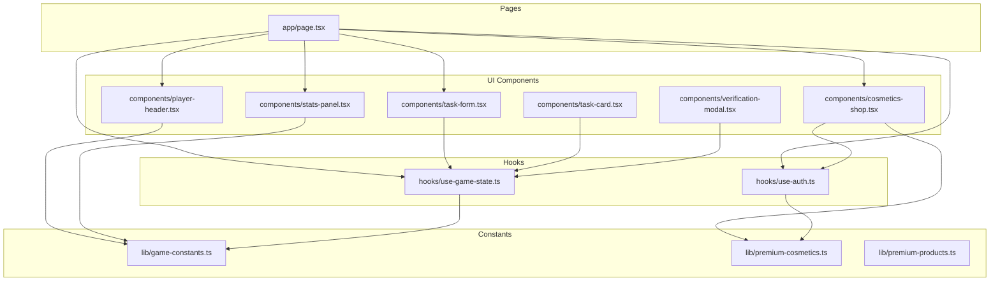
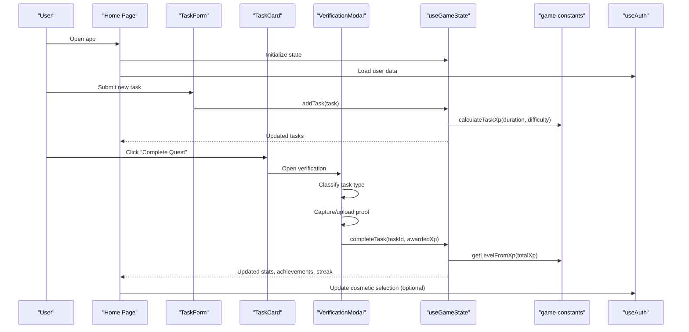
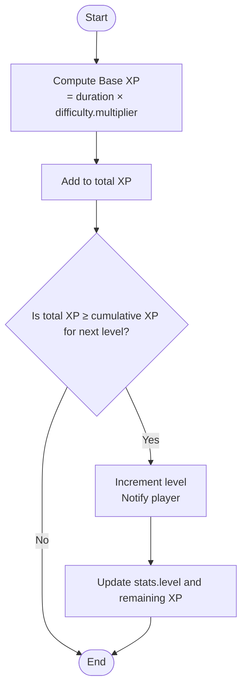
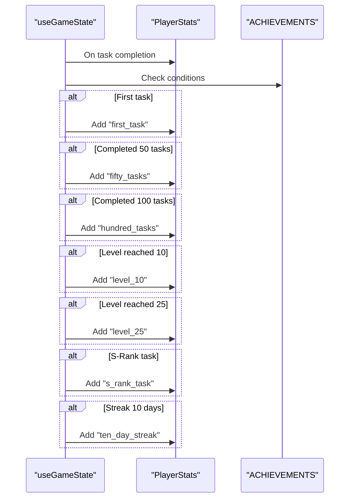
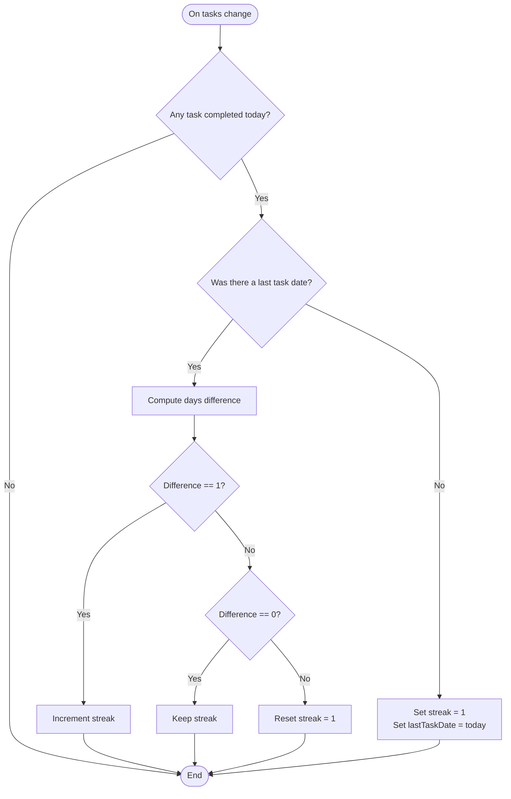
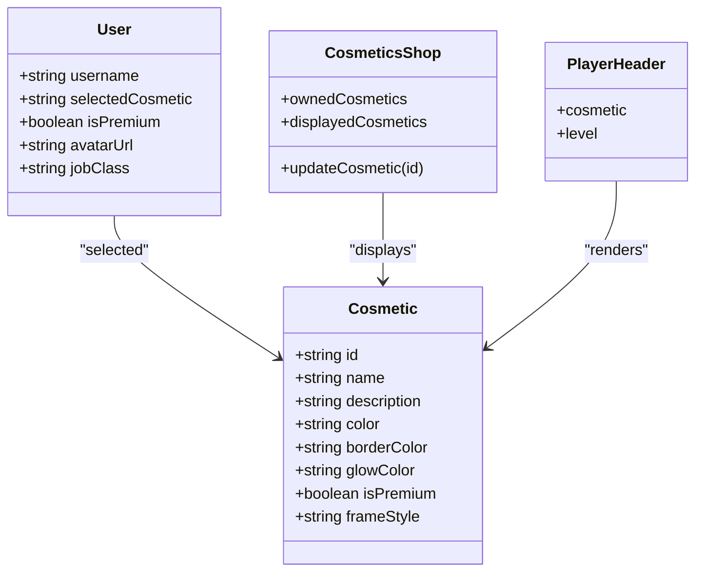
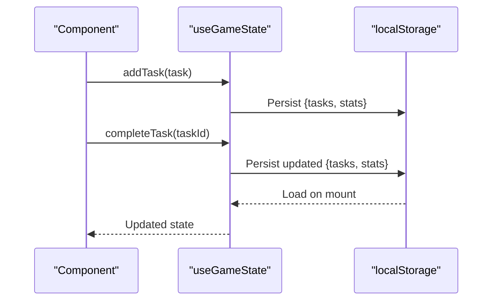
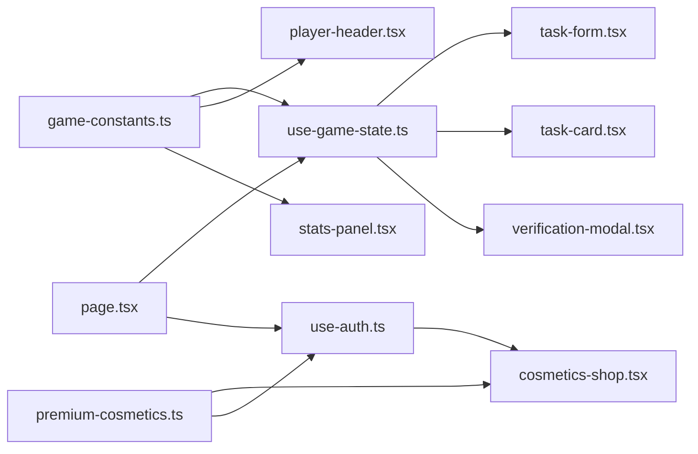

# Core Game System

<cite>
**Referenced Files in This Document**
- [game-constants.ts](file://lib/game-constants.ts)
- [use-game-state.ts](file://hooks/use-game-state.ts)
- [premium-cosmetics.ts](file://lib/premium-cosmetics.ts)
- [premium-products.ts](file://lib/premium-products.ts)
- [use-auth.ts](file://hooks/use-auth.ts)
- [page.tsx](file://app/page.tsx)
- [task-form.tsx](file://components/task-form.tsx)
- [task-card.tsx](file://components/task-card.tsx)
- [verification-modal.tsx](file://components/verification-modal.tsx)
- [player-header.tsx](file://components/player-header.tsx)
- [stats-panel.tsx](file://components/stats-panel.tsx)
- [cosmetics-shop.tsx](file://components/cosmetics-shop.tsx)
</cite>

## Table of Contents
1. [Introduction](#introduction)
2. [Project Structure](#project-structure)
3. [Core Components](#core-components)
4. [Architecture Overview](#architecture-overview)
5. [Detailed Component Analysis](#detailed-component-analysis)
6. [Dependency Analysis](#dependency-analysis)
7. [Performance Considerations](#performance-considerations)
8. [Troubleshooting Guide](#troubleshooting-guide)
9. [Conclusion](#conclusion)
10. [Appendices](#appendices)

## Introduction
This document explains the core game system mechanics implemented in the Solo Leveling Manager application. It covers:
- XP accumulation and leveling with exponential progression
- Difficulty multiplier calculations and level advancement criteria
- Achievement system definitions, unlock conditions, and progress tracking
- Streak calculation for consecutive task completions and bonus XP multipliers
- Premium cosmetic system with free and premium categories, selection, and visual effects
- State management architecture using the use-game-state hook and local storage persistence
- Game constants for XP thresholds, achievement criteria, and premium feature restrictions
- Practical examples of XP calculations, achievement triggers, and cosmetic unlocking scenarios

## Project Structure
The game system spans several modules:
- Constants and utilities define XP formulas, difficulty ranks, and achievement definitions
- Hooks manage global game state and user authentication
- UI components render player stats, tasks, achievements, and cosmetic shop
- Pages orchestrate the main application flow and integrate state and UI

**Diagram sources**
- [page.tsx:17-255](file://app/page.tsx#L17-L255)
- [use-game-state.ts:51-251](file://hooks/use-game-state.ts#L51-L251)
- [game-constants.ts:1-95](file://lib/game-constants.ts#L1-L95)
- [premium-cosmetics.ts:1-77](file://lib/premium-cosmetics.ts#L1-L77)
- [premium-products.ts:1-76](file://lib/premium-products.ts#L1-L76)
- [use-auth.ts:14-121](file://hooks/use-auth.ts#L14-L121)
- [task-form.tsx:18-191](file://components/task-form.tsx#L18-L191)
- [task-card.tsx:17-185](file://components/task-card.tsx#L17-L185)
- [verification-modal.tsx:18-331](file://components/verification-modal.tsx#L18-L331)
- [player-header.tsx:16-180](file://components/player-header.tsx#L16-L180)
- [stats-panel.tsx:13-145](file://components/stats-panel.tsx#L13-L145)
- [cosmetics-shop.tsx:7-178](file://components/cosmetics-shop.tsx#L7-L178)

**Section sources**
- [page.tsx:17-255](file://app/page.tsx#L17-L255)
- [use-game-state.ts:51-251](file://hooks/use-game-state.ts#L51-L251)
- [game-constants.ts:1-95](file://lib/game-constants.ts#L1-L95)
- [premium-cosmetics.ts:1-77](file://lib/premium-cosmetics.ts#L1-L77)
- [premium-products.ts:1-76](file://lib/premium-products.ts#L1-L76)
- [use-auth.ts:14-121](file://hooks/use-auth.ts#L14-L121)
- [task-form.tsx:18-191](file://components/task-form.tsx#L18-L191)
- [task-card.tsx:17-185](file://components/task-card.tsx#L17-L185)
- [verification-modal.tsx:18-331](file://components/verification-modal.tsx#L18-L331)
- [player-header.tsx:16-180](file://components/player-header.tsx#L16-L180)
- [stats-panel.tsx:13-145](file://components/stats-panel.tsx#L13-L145)
- [cosmetics-shop.tsx:7-178](file://components/cosmetics-shop.tsx#L7-L178)

## Core Components
This section documents the primary building blocks of the game system.

- Difficulty Ranks and XP Formulas
  - Difficulty multipliers are defined for E, D, C, B, A, S ranks.
  - XP for a level follows an exponential formula starting at 100 XP for level 1.
  - Cumulative XP to reach a level is computed iteratively.
  - Level extraction from total XP uses cumulative thresholds.

- Achievement System
  - Achievement definitions enumerate unlockable milestones with identifiers, names, descriptions, and icons.
  - Unlock conditions are evaluated during task completion and level progression.

- Streak Calculation
  - Daily streak is computed from task completion timestamps.
  - Resets when a day is skipped; increments when completed the next day; resets to 1 on first completion of the day.

- Premium Cosmetic System
  - Free and premium cosmetic categories are defined with visual attributes and styles.
  - Users can equip cosmetics; premium users gain access to all cosmetics.

- State Management
  - use-game-state manages tasks, player stats, XP, level, achievements, and streaks.
  - Local storage persistence ensures continuity across sessions.

**Section sources**
- [game-constants.ts:2-95](file://lib/game-constants.ts#L2-L95)
- [use-game-state.ts:15-251](file://hooks/use-game-state.ts#L15-L251)
- [premium-cosmetics.ts:1-77](file://lib/premium-cosmetics.ts#L1-L77)
- [use-auth.ts:4-121](file://hooks/use-auth.ts#L4-L121)

## Architecture Overview
The application integrates UI components with game logic through hooks and constants. The main page orchestrates rendering and event handling, delegating state updates to use-game-state and user data to use-auth.

**Diagram sources**
- [page.tsx:17-255](file://app/page.tsx#L17-L255)
- [task-form.tsx:18-191](file://components/task-form.tsx#L18-L191)
- [task-card.tsx:17-185](file://components/task-card.tsx#L17-L185)
- [verification-modal.tsx:18-331](file://components/verification-modal.tsx#L18-L331)
- [use-game-state.ts:127-210](file://hooks/use-game-state.ts#L127-L210)
- [game-constants.ts:44-48](file://lib/game-constants.ts#L44-L48)
- [use-auth.ts:66-75](file://hooks/use-auth.ts#L66-L75)

## Detailed Component Analysis

### XP Accumulation and Leveling System
- Exponential XP progression
  - getXpForLevel computes XP required for the next level using an exponential base.
  - getCumulativeXp sums XP thresholds up to a given level.
  - getLevelFromXp determines current level, remaining XP, and XP to next level from total XP.

- Difficulty multiplier calculations
  - calculateTaskXp multiplies duration minutes by the difficulty rank’s multiplier to compute base XP reward.

- Level advancement criteria
  - When total XP reaches or exceeds the threshold for the next level, the player levels up and receives a notification.

**Diagram sources**
- [game-constants.ts:14-42](file://lib/game-constants.ts#L14-L42)
- [game-constants.ts:44-48](file://lib/game-constants.ts#L44-L48)
- [use-game-state.ts:152-210](file://hooks/use-game-state.ts#L152-L210)

**Section sources**
- [game-constants.ts:14-48](file://lib/game-constants.ts#L14-L48)
- [use-game-state.ts:152-210](file://hooks/use-game-state.ts#L152-L210)

### Achievement System
- Achievement definitions
  - First task, 50 tasks, 100 tasks, Level 10, Level 25, S-Rank task, and 10-day streak are defined with unique identifiers and metadata.

- Unlock conditions
  - First task: triggered on first completed task.
  - 50 and 100 tasks: triggered when completedTasks transitions to 50 or 100 respectively.
  - Level milestones: triggered when level crosses thresholds 10 and 25.
  - S-Rank task: triggered when a task with difficulty "S" is completed.
  - 10-day streak: triggered when currentStreak reaches 10.

- Progress tracking
  - Unlocked achievements are stored in stats.unlockedAchievements and surfaced via getNewAchievements.

**Diagram sources**
- [game-constants.ts:50-95](file://lib/game-constants.ts#L50-L95)
- [use-game-state.ts:169-200](file://hooks/use-game-state.ts#L169-L200)

**Section sources**
- [game-constants.ts:50-95](file://lib/game-constants.ts#L50-L95)
- [use-game-state.ts:169-200](file://hooks/use-game-state.ts#L169-L200)

### Streak Calculation System
- Daily streak computation
  - A daily streak is maintained based on task completion timestamps.
  - If a task was completed today, the streak either increments by 1, resets to 1 (if the previous day was skipped), or remains unchanged (if already completed today).
  - The lastTaskDate is normalized to midnight UTC for comparison.

- Bonus XP multipliers
  - The verification modal can adjust XP based on system feedback, returning a multiplier that is applied to the base XP reward.

**Diagram sources**
- [use-game-state.ts:84-125](file://hooks/use-game-state.ts#L84-L125)

**Section sources**
- [use-game-state.ts:84-125](file://hooks/use-game-state.ts#L84-L125)
- [verification-modal.tsx:112-140](file://components/verification-modal.tsx#L112-L140)

### Premium Cosmetic System
- Categories and definitions
  - Free and premium cosmetic categories are defined with visual attributes (colors, glow, frame style) and flags.
  - PREMIUM_COSMETICS and FREE_COSMETICS arrays segment the collection.

- Selection mechanism
  - Users can equip a cosmetic via use-auth.updateCosmetic, persisting selection in local storage.
  - The player header renders the selected cosmetic’s visual style.

- Visual effect implementations
  - Cosmetics shop displays glow, borders, and preview visuals based on cosmetic attributes.
  - Player header applies gradient borders and animated glows aligned with the selected cosmetic.

**Diagram sources**
- [premium-cosmetics.ts:1-77](file://lib/premium-cosmetics.ts#L1-L77)
- [use-auth.ts:66-75](file://hooks/use-auth.ts#L66-L75)
- [cosmetics-shop.tsx:7-178](file://components/cosmetics-shop.tsx#L7-L178)
- [player-header.tsx:23-24](file://components/player-header.tsx#L23-L24)

**Section sources**
- [premium-cosmetics.ts:12-77](file://lib/premium-cosmetics.ts#L12-L77)
- [use-auth.ts:66-75](file://hooks/use-auth.ts#L66-L75)
- [cosmetics-shop.tsx:7-178](file://components/cosmetics-shop.tsx#L7-L178)
- [player-header.tsx:23-24](file://components/player-header.tsx#L23-L24)

### State Management Architecture
- use-game-state hook
  - Manages tasks and player stats, exposes CRUD operations, and derived getters.
  - Persists state to localStorage on changes and loads on mount.
  - Computes streaks and evaluates achievements upon task completion.

- Local storage persistence
  - Storage key stores both tasks and stats together.
  - Loading handles malformed data by ignoring and initializing defaults.

- State synchronization patterns
  - Effects synchronize streaks from tasks.
  - Callbacks encapsulate state updates to ensure atomic changes.

**Diagram sources**
- [use-game-state.ts:49-82](file://hooks/use-game-state.ts#L49-L82)
- [use-game-state.ts:127-210](file://hooks/use-game-state.ts#L127-L210)

**Section sources**
- [use-game-state.ts:49-82](file://hooks/use-game-state.ts#L49-L82)
- [use-game-state.ts:127-210](file://hooks/use-game-state.ts#L127-L210)

### Game Constants
- Difficulty ranks and multipliers
  - E, D, C, B, A, S ranks define increasing XP multipliers.

- XP thresholds and formulas
  - getXpForLevel, getCumulativeXp, getLevelFromXp define progression mechanics.

- Achievement criteria
  - Milestones for tasks completed, levels reached, S-Rank tasks, and streaks.

- Premium feature restrictions
  - Premium products define tiers and features; cosmetic shop restricts visibility based on premium status.

**Section sources**
- [game-constants.ts:2-95](file://lib/game-constants.ts#L2-L95)
- [premium-products.ts:13-76](file://lib/premium-products.ts#L13-L76)

## Dependency Analysis
The system exhibits clear separation of concerns:
- Constants define deterministic game mechanics.
- Hooks encapsulate state and persistence.
- UI components depend on hooks and constants for rendering and behavior.
- Premium cosmetic definitions are consumed by UI and auth hooks.

**Diagram sources**
- [game-constants.ts:1-95](file://lib/game-constants.ts#L1-L95)
- [use-game-state.ts:1-13](file://hooks/use-game-state.ts#L1-L13)
- [premium-cosmetics.ts:1-10](file://lib/premium-cosmetics.ts#L1-L10)
- [use-auth.ts:14-121](file://hooks/use-auth.ts#L14-L121)
- [page.tsx:3-15](file://app/page.tsx#L3-L15)

**Section sources**
- [game-constants.ts:1-95](file://lib/game-constants.ts#L1-L95)
- [use-game-state.ts:1-13](file://hooks/use-game-state.ts#L1-L13)
- [premium-cosmetics.ts:1-10](file://lib/premium-cosmetics.ts#L1-L10)
- [use-auth.ts:14-121](file://hooks/use-auth.ts#L14-L121)
- [page.tsx:3-15](file://app/page.tsx#L3-L15)

## Performance Considerations
- Exponential XP computations are lightweight; cumulative sums are bounded by reasonable level caps.
- Streak computation scans completed tasks daily; keep task lists manageable for optimal performance.
- Local storage writes occur on state changes; batching updates minimizes redundant writes.
- UI rendering relies on memoized callbacks; ensure props remain stable to prevent unnecessary re-renders.

## Troubleshooting Guide
- XP not updating after task completion
  - Verify that completeTask is invoked with the correct taskId and that awardedXp is applied when provided.
  - Confirm that getLevelFromXp is used to derive the new level.

- Achievement not unlocking
  - Check that the unlock condition logic runs after stats.completedTasks and stats.level updates.
  - Ensure the achievement id matches the one stored in stats.unlockedAchievements.

- Streak resets unexpectedly
  - Confirm that task.completedAt timestamps are set consistently and normalized to midnight.
  - Verify that the difference calculation accounts for time zone differences.

- Cosmetic not equipping
  - Ensure updateCosmetic is called with a valid cosmetic id and that the user’s selectedCosmetic is persisted.

**Section sources**
- [use-game-state.ts:152-210](file://hooks/use-game-state.ts#L152-L210)
- [verification-modal.tsx:112-140](file://components/verification-modal.tsx#L112-L140)
- [use-auth.ts:66-75](file://hooks/use-auth.ts#L66-L75)

## Conclusion
The Solo Leveling Manager implements a cohesive core game system centered on exponential XP progression, difficulty-based rewards, streak mechanics, and cosmetic customization. The use-game-state hook centralizes state management with robust persistence, while constants and UI components provide a clear, extensible foundation for future enhancements.

## Appendices

### Practical Examples

- Example: XP Calculation
  - A task with 60 minutes duration and difficulty “A” yields base XP equal to 60 × 6 = 360.
  - After completion, total XP increases by 360; if this pushes total XP past the next level threshold, the player levels up.

- Example: Achievement Trigger
  - Completing the first task unlocks “Awakening.”
  - Completing the 50th task unlocks “Rising Hunter.”
  - Reaching Level 25 unlocks “Realm Breaker.”

- Example: Cosmetic Unlocking Scenario
  - A user selects a premium cosmetic; updateCosmetic persists the selection.
  - The player header renders the selected cosmetic’s visual attributes.

**Section sources**
- [game-constants.ts:44-48](file://lib/game-constants.ts#L44-L48)
- [use-game-state.ts:169-200](file://hooks/use-game-state.ts#L169-L200)
- [verification-modal.tsx:129-134](file://components/verification-modal.tsx#L129-L134)
- [use-auth.ts:66-75](file://hooks/use-auth.ts#L66-L75)