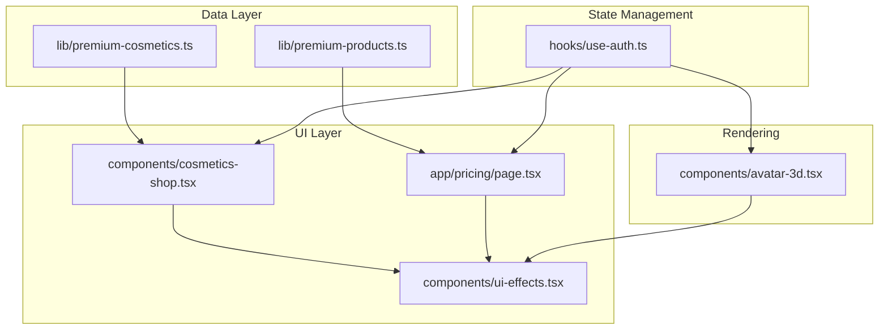
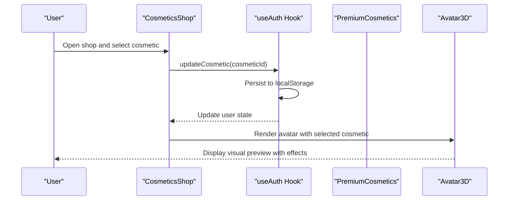
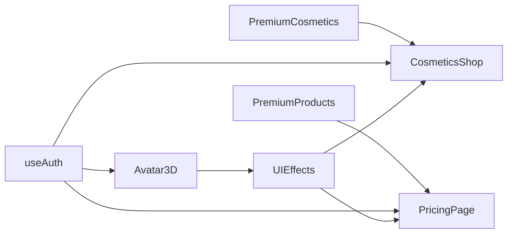

# Premium Cosmetic System

<cite>
**Referenced Files in This Document**
- [premium-cosmetics.ts](file://lib/premium-cosmetics.ts)
- [premium-products.ts](file://lib/premium-products.ts)
- [cosmetics-shop.tsx](file://components/cosmetics-shop.tsx)
- [use-auth.ts](file://hooks/use-auth.ts)
- [pricing/page.tsx](file://app/pricing/page.tsx)
- [avatar-3d.tsx](file://components/avatar-3d.tsx)
- [ui-effects.tsx](file://components/ui-effects.tsx)
</cite>

## Table of Contents
1. [Introduction](#introduction)
2. [Project Structure](#project-structure)
3. [Core Components](#core-components)
4. [Architecture Overview](#architecture-overview)
5. [Detailed Component Analysis](#detailed-component-analysis)
6. [Dependency Analysis](#dependency-analysis)
7. [Performance Considerations](#performance-considerations)
8. [Troubleshooting Guide](#troubleshooting-guide)
9. [Conclusion](#conclusion)

## Introduction
This document describes the premium cosmetic system that powers avatar customization and premium feature gating. It covers cosmetic definitions, categories, selection mechanisms, visual effect implementations, and the integration between premium status and cosmetic ownership. The system includes:
- Free and premium cosmetic categories with distinct visual styles
- A shop interface for selecting and applying cosmetics
- Premium product tiers that unlock additional cosmetics and features
- Visual preview systems using 3D avatars and animated UI effects
- Premium gating that restricts certain features until premium status is achieved

## Project Structure
The premium cosmetic system spans several modules:
- Data definitions for cosmetics and premium products
- Authentication hook managing user state and premium status
- Shop component for browsing and selecting cosmetics
- Pricing page for upgrading to premium tiers
- 3D avatar renderer that applies cosmetic visuals and premium effects
- UI effects library for animated and glowing components

**Diagram sources**
- [premium-cosmetics.ts:1-77](file://lib/premium-cosmetics.ts#L1-L77)
- [premium-products.ts:1-76](file://lib/premium-products.ts#L1-L76)
- [cosmetics-shop.tsx:1-178](file://components/cosmetics-shop.tsx#L1-L178)
- [pricing/page.tsx:1-176](file://app/pricing/page.tsx#L1-L176)
- [use-auth.ts:1-167](file://hooks/use-auth.ts#L1-L167)
- [avatar-3d.tsx:1-1361](file://components/avatar-3d.tsx#L1-L1361)
- [ui-effects.tsx:1-284](file://components/ui-effects.tsx#L1-L284)

**Section sources**
- [premium-cosmetics.ts:1-77](file://lib/premium-cosmetics.ts#L1-L77)
- [premium-products.ts:1-76](file://lib/premium-products.ts#L1-L76)
- [cosmetics-shop.tsx:1-178](file://components/cosmetics-shop.tsx#L1-L178)
- [pricing/page.tsx:1-176](file://app/pricing/page.tsx#L1-L176)
- [use-auth.ts:1-167](file://hooks/use-auth.ts#L1-L167)
- [avatar-3d.tsx:1-1361](file://components/avatar-3d.tsx#L1-L1361)
- [ui-effects.tsx:1-284](file://components/ui-effects.tsx#L1-L284)

## Core Components
- Premium cosmetics definition module defines cosmetic attributes, categories, and filtering helpers.
- Premium products module defines subscription tiers, pricing, and feature bundles.
- Cosmetics shop component renders the selection UI, handles tab filtering, and updates user preferences.
- Authentication hook manages user state, premium status, and cosmetic selection persistence.
- Pricing page integrates premium product selection with avatar previews and upgrade flows.
- 3D avatar component renders visual effects and premium enhancements based on user state.
- UI effects library provides animated cards, buttons, and glow effects used across the system.

**Section sources**
- [premium-cosmetics.ts:1-77](file://lib/premium-cosmetics.ts#L1-L77)
- [premium-products.ts:1-76](file://lib/premium-products.ts#L1-L76)
- [cosmetics-shop.tsx:1-178](file://components/cosmetics-shop.tsx#L1-L178)
- [use-auth.ts:1-167](file://hooks/use-auth.ts#L1-L167)
- [pricing/page.tsx:1-176](file://app/pricing/page.tsx#L1-L176)
- [avatar-3d.tsx:1-1361](file://components/avatar-3d.tsx#L1-L1361)
- [ui-effects.tsx:1-284](file://components/ui-effects.tsx#L1-L284)

## Architecture Overview
The system follows a layered architecture:
- Data layer: Defines cosmetic and product schemas and constants.
- UI layer: Provides shop and pricing pages with interactive selection and purchase flows.
- State management: Centralizes user state and premium status updates.
- Rendering layer: Applies cosmetic visuals and premium effects to 3D avatars.

**Diagram sources**
- [cosmetics-shop.tsx:7-120](file://components/cosmetics-shop.tsx#L7-L120)
- [use-auth.ts:111-120](file://hooks/use-auth.ts#L111-L120)
- [premium-cosmetics.ts:12-77](file://lib/premium-cosmetics.ts#L12-L77)
- [avatar-3d.tsx:1304-1344](file://components/avatar-3d.tsx#L1304-L1344)

## Detailed Component Analysis

### Premium Cosmetics Definition
The cosmetic system defines a structured set of cosmetic items with attributes for visual presentation and premium gating:
- Attributes include identifiers, names, descriptions, color palettes, border colors, glow colors, premium flags, and frame styles.
- Predefined collections include default and premium frames with distinct visual themes.
- Helper arrays separate free and premium cosmetics for UI filtering.

Key implementation patterns:
- Strongly typed cosmetic interface ensures consistent data structures.
- Filter helpers enable dynamic UI rendering based on premium status.

**Section sources**
- [premium-cosmetics.ts:1-77](file://lib/premium-cosmetics.ts#L1-L77)

### Premium Products Integration
Premium products define subscription tiers with features and pricing:
- Product schema includes identifiers, names, descriptions, pricing, feature lists, and tier levels.
- Helper functions provide product lookup by ID.
- Pricing page integrates product selection with avatar previews and upgrade actions.

Integration highlights:
- Pricing page triggers premium status updates and avatar assignment upon purchase.
- Product features align with cosmetic unlocks and premium benefits.

**Section sources**
- [premium-products.ts:1-76](file://lib/premium-products.ts#L1-L76)
- [pricing/page.tsx:13-34](file://app/pricing/page.tsx#L13-L34)

### Cosmetics Shop Component
The shop component provides a tabbed interface for browsing and selecting cosmetics:
- Tabs: "All Cosmetics" and "My Collection" (visible only for premium users).
- Filtering: Non-premium users see only free cosmetics; premium users see all.
- Selection: Clicking a cosmetic updates the user's selected cosmetic if owned.
- Visual indicators: Premium badges, active selection highlights, and glow effects.
- Preview: Each cosmetic displays a representative avatar preview with themed colors and glow.

Selection flow:
- Owned vs. unowned: Unowned premium cosmetics are disabled and labeled accordingly.
- Active selection: Selected cosmetic receives a border highlight and radial glow.
- Purchase prompt: Unowned premium cosmetics display a "Unlock with Premium" message.

**Section sources**
- [cosmetics-shop.tsx:7-178](file://components/cosmetics-shop.tsx#L7-L178)

### Authentication and Premium Gating
The authentication hook manages user state and premium status:
- User schema includes premium flags, selected cosmetic, avatar URL, and tier information.
- Login initializes default selections and avatar URLs based on premium status.
- Premium status updates adjust avatar URLs and selected cosmetic defaults.
- Cosmetic updates persist to local storage and trigger UI feedback.

Premium gating mechanisms:
- Shop filters cosmetics based on premium status.
- Premium upgrades unlock additional cosmetic categories.
- Avatar previews reflect premium status and tier.

**Section sources**
- [use-auth.ts:4-167](file://hooks/use-auth.ts#L4-L167)

### 3D Avatar Visual Effects
The avatar renderer applies cosmetic visuals and premium effects:
- Animated 3D avatar with class-specific equipment and particle effects.
- Premium effects include golden torus rings and enhanced sparkles.
- Visual themes adapt to level tiers and job classes.
- Particle systems and emissive materials create immersive visuals.

Visual effect integration:
- Premium status toggles premium effects and enhanced visuals.
- Job class and level influence equipment appearance and glow intensity.
- Theme colors dynamically adjust based on level progression.

**Section sources**
- [avatar-3d.tsx:1-1361](file://components/avatar-3d.tsx#L1-L1361)

### UI Effects Library
The UI effects library provides reusable animated components:
- Glass cards with 3D hover effects and glow overlays.
- Glowing buttons with gradient backgrounds and shimmer animations.
- Animated counters, pulsing dots, and energy bars.
- Neon borders and floating elements for enhanced visual appeal.

These effects are used across the shop and pricing pages to create immersive experiences.

**Section sources**
- [ui-effects.tsx:1-284](file://components/ui-effects.tsx#L1-L284)

## Dependency Analysis
The system exhibits clear separation of concerns:
- Data dependencies: Shop and pricing depend on cosmetic and product definitions.
- State dependencies: Shop and pricing depend on authentication hook for user state.
- Rendering dependencies: Avatar component consumes user state and premium status.
- UI dependencies: Shop and pricing leverage UI effects for consistent styling.

**Diagram sources**
- [premium-cosmetics.ts:1-77](file://lib/premium-cosmetics.ts#L1-L77)
- [premium-products.ts:1-76](file://lib/premium-products.ts#L1-L76)
- [cosmetics-shop.tsx:1-178](file://components/cosmetics-shop.tsx#L1-L178)
- [pricing/page.tsx:1-176](file://app/pricing/page.tsx#L1-L176)
- [use-auth.ts:1-167](file://hooks/use-auth.ts#L1-L167)
- [avatar-3d.tsx:1-1361](file://components/avatar-3d.tsx#L1-L1361)
- [ui-effects.tsx:1-284](file://components/ui-effects.tsx#L1-L284)

**Section sources**
- [premium-cosmetics.ts:1-77](file://lib/premium-cosmetics.ts#L1-L77)
- [premium-products.ts:1-76](file://lib/premium-products.ts#L1-L76)
- [cosmetics-shop.tsx:1-178](file://components/cosmetics-shop.tsx#L1-L178)
- [pricing/page.tsx:1-176](file://app/pricing/page.tsx#L1-L176)
- [use-auth.ts:1-167](file://hooks/use-auth.ts#L1-L167)
- [avatar-3d.tsx:1-1361](file://components/avatar-3d.tsx#L1-L1361)
- [ui-effects.tsx:1-284](file://components/ui-effects.tsx#L1-L284)

## Performance Considerations
- Local storage usage: User state and selections are persisted locally to avoid re-fetching on each visit.
- Conditional rendering: Premium-only UI elements are hidden for non-premium users to reduce DOM complexity.
- 3D rendering: Avatar scenes use efficient geometry and materials; fallback rendering ensures graceful degradation.
- Animations: UI effects use lightweight CSS transforms and minimal JavaScript to maintain smooth performance.

## Troubleshooting Guide
Common issues and resolutions:
- Shop shows no cosmetics: Verify user premium status and ensure local storage contains valid user data.
- Selected cosmetic does not apply: Confirm the cosmetic ID exists and the user has permission to use it.
- Avatar preview fails: Check model URL validity and network connectivity; fallback avatar should render if model loading fails.
- Premium upgrade not reflected: Ensure the authentication hook updates premium status and avatar URL after purchase.

**Section sources**
- [use-auth.ts:28-167](file://hooks/use-auth.ts#L28-L167)
- [pricing/page.tsx:13-34](file://app/pricing/page.tsx#L13-L34)
- [avatar-3d.tsx:1210-1266](file://components/avatar-3d.tsx#L1210-L1266)

## Conclusion
The premium cosmetic system provides a cohesive framework for avatar customization, premium feature gating, and immersive visual experiences. By separating data definitions, UI components, state management, and rendering logic, the system enables scalable enhancements while maintaining a consistent user experience. The integration of premium products, cosmetic selection, and 3D visual effects creates a compelling pathway for users to unlock exclusive content and elevate their avatar presentation.