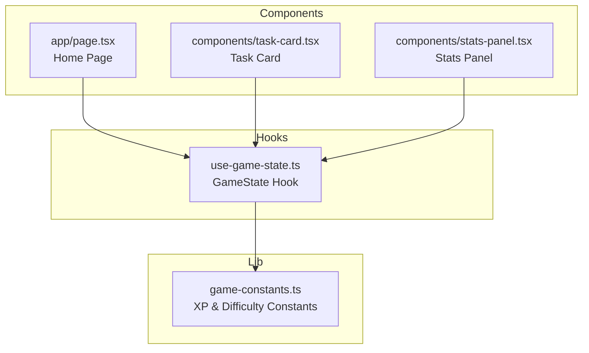
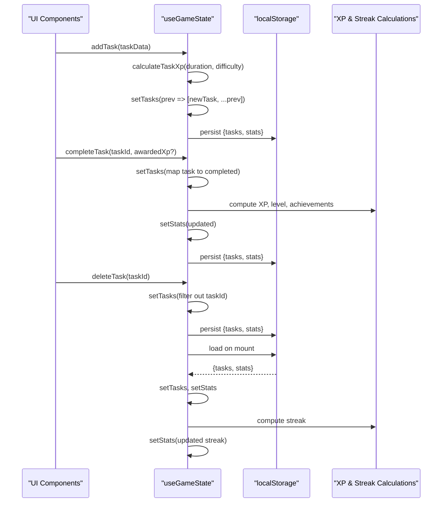
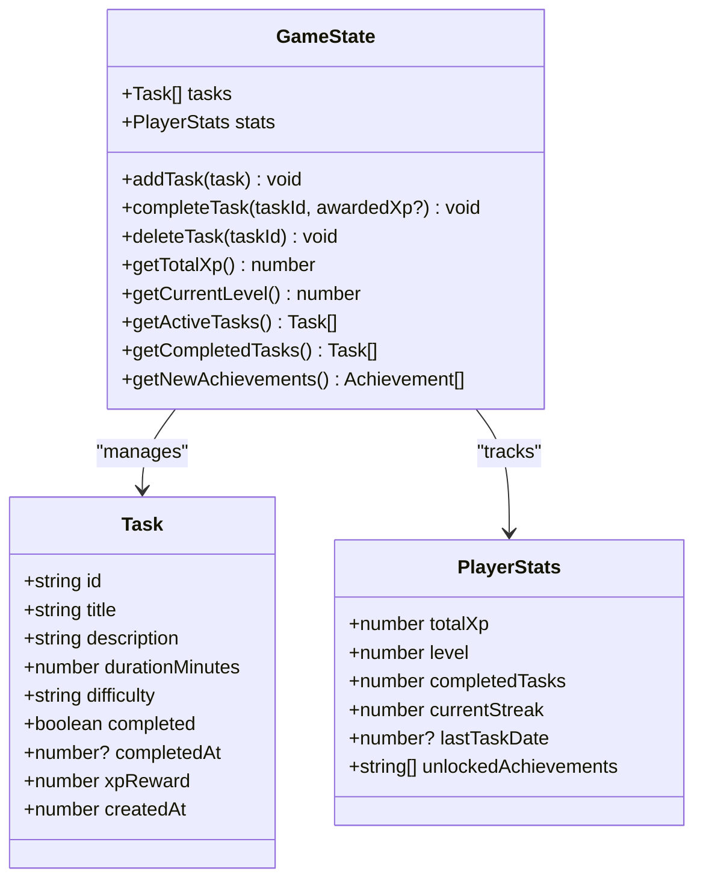
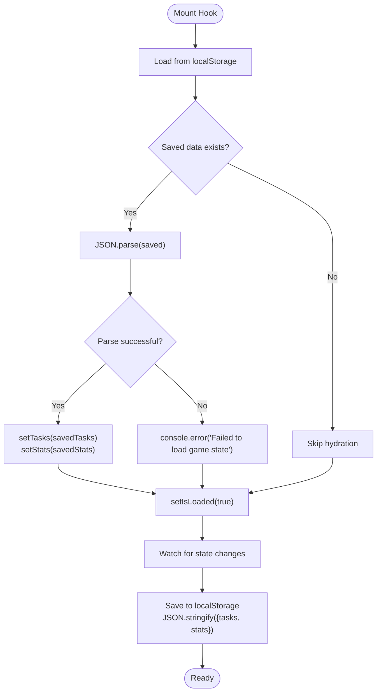
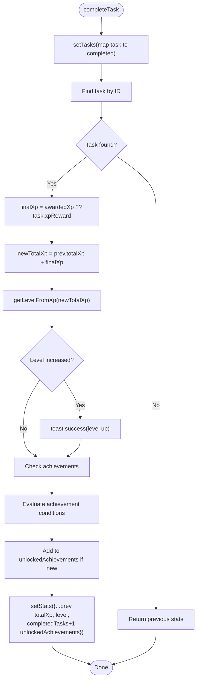
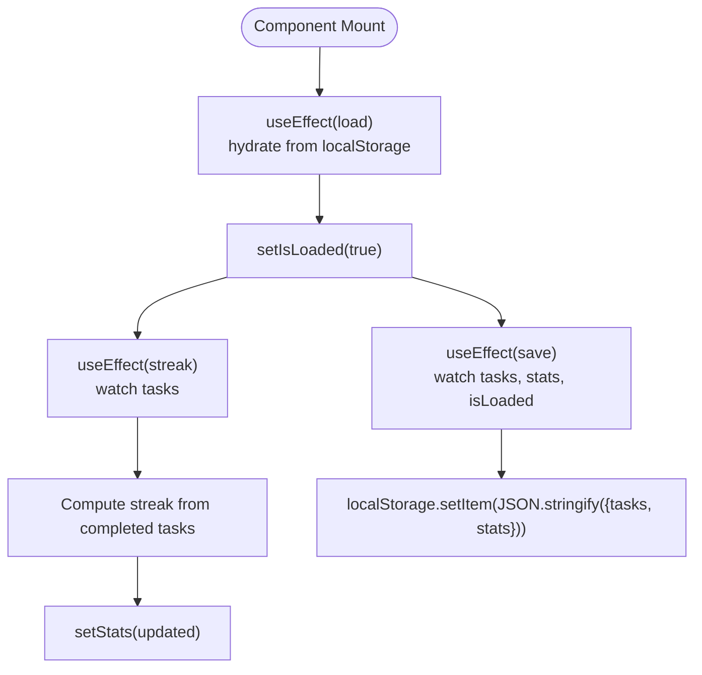
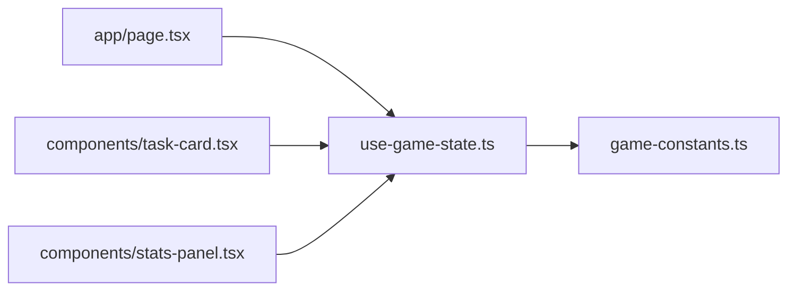

# State Management Architecture

<cite>
**Referenced Files in This Document**
- [use-game-state.ts](file://hooks/use-game-state.ts)
- [game-constants.ts](file://lib/game-constants.ts)
- [page.tsx](file://app/page.tsx)
- [task-card.tsx](file://components/task-card.tsx)
- [stats-panel.tsx](file://components/stats-panel.tsx)
</cite>

## Table of Contents
1. [Introduction](#introduction)
2. [Project Structure](#project-structure)
3. [Core Components](#core-components)
4. [Architecture Overview](#architecture-overview)
5. [Detailed Component Analysis](#detailed-component-analysis)
6. [Dependency Analysis](#dependency-analysis)
7. [Performance Considerations](#performance-considerations)
8. [Troubleshooting Guide](#troubleshooting-guide)
9. [Conclusion](#conclusion)

## Introduction
This document provides comprehensive documentation for the state management architecture centered around the `useGameState` hook. It explains the GameState interface structure, local storage persistence strategy, state synchronization patterns between tasks and stats, useCallback optimizations, useEffect patterns for automatic calculations, immutability patterns, and practical debugging techniques.

## Project Structure
The state management is encapsulated within a single custom hook that manages both tasks and player statistics. Supporting constants and calculations are provided by the game-constants module. Components consume the hook to render UI and trigger state updates.

**Diagram sources**
- [use-game-state.ts:1-252](file://hooks/use-game-state.ts#L1-L252)
- [game-constants.ts:1-95](file://lib/game-constants.ts#L1-L95)
- [page.tsx:1-200](file://app/page.tsx#L1-L200)
- [task-card.tsx:1-186](file://components/task-card.tsx#L1-L186)
- [stats-panel.tsx:84-131](file://components/stats-panel.tsx#L84-L131)

**Section sources**
- [use-game-state.ts:1-252](file://hooks/use-game-state.ts#L1-L252)
- [game-constants.ts:1-95](file://lib/game-constants.ts#L1-L95)
- [page.tsx:1-200](file://app/page.tsx#L1-L200)
- [task-card.tsx:1-186](file://components/task-card.tsx#L1-L186)
- [stats-panel.tsx:84-131](file://components/stats-panel.tsx#L84-L131)

## Core Components
The GameState interface defines the contract for managing tasks and player statistics, along with action methods and computed getters.

Key elements:
- Task interface: Defines task properties including difficulty, duration, XP reward, completion status, and timestamps.
- PlayerStats interface: Tracks total XP, level, completed tasks count, current streak, last task date, and unlocked achievements.
- GameState interface: Exposes tasks array, stats object, and action methods (addTask, completeTask, deleteTask) plus computed getters (getTotalXp, getCurrentLevel, getActiveTasks, getCompletedTasks, getNewAchievements).

Action methods:
- addTask: Creates a new task with calculated XP reward and adds it to the top of the list.
- completeTask: Marks a task as completed, updates XP and level, checks for achievements, and manages streak logic.
- deleteTask: Removes a task by ID.

Computed getters:
- getTotalXp: Returns current XP from stats.
- getCurrentLevel: Computes level from total XP.
- getActiveTasks/getCompletedTasks: Filter tasks by completion status.
- getNewAchievements: Resolves achievement objects for unlocked IDs.

**Section sources**
- [use-game-state.ts:15-47](file://hooks/use-game-state.ts#L15-L47)

## Architecture Overview
The state management follows a centralized hook pattern with automatic persistence and synchronization:

**Diagram sources**
- [use-game-state.ts:62-82](file://hooks/use-game-state.ts#L62-L82)
- [use-game-state.ts:84-125](file://hooks/use-game-state.ts#L84-L125)
- [use-game-state.ts:127-214](file://hooks/use-game-state.ts#L127-L214)

## Detailed Component Analysis

### GameState Interface and Data Model
The GameState interface combines two primary concerns: task management and player progression tracking.

**Diagram sources**
- [use-game-state.ts:15-47](file://hooks/use-game-state.ts#L15-L47)

**Section sources**
- [use-game-state.ts:15-47](file://hooks/use-game-state.ts#L15-L47)

### Local Storage Persistence Strategy
The hook implements robust persistence using a dedicated storage key and JSON serialization/deserialization with error handling.

Persistence mechanics:
- Storage Key: A constant key identifies the persisted state in localStorage.
- Load Phase: On mount, the hook attempts to parse and hydrate state from localStorage. Parsing errors are caught and logged without crashing the app.
- Save Phase: After state updates, the hook persists the combined state object to localStorage, guarded by an isLoaded flag to prevent premature writes during hydration.

Error handling:
- Try/catch around JSON parsing prevents crashes from malformed data.
- Console logging provides visibility into persistence failures.

**Diagram sources**
- [use-game-state.ts:62-82](file://hooks/use-game-state.ts#L62-L82)

**Section sources**
- [use-game-state.ts:49](file://hooks/use-game-state.ts#L49)
- [use-game-state.ts:62-82](file://hooks/use-game-state.ts#L62-L82)

### State Synchronization Patterns
The system ensures consistency between tasks and stats through coordinated updates:

Task completion flow:
- Mark task as completed and record completion timestamp.
- Compute XP gain (either awarded or precomputed).
- Update total XP and recalculate level.
- Check for new achievements and notify via toast.
- Update stats atomically with immutable setState patterns.

Streak calculation:
- Detect if any completed task occurred today.
- Compare last task date to today to determine streak increment or reset.
- Normalize dates to midnight to handle timezone differences.

Achievement unlocking:
- Evaluate thresholds for first task, milestones, level thresholds, difficulty ranks, and streak targets.
- Prevent duplicate unlocks by checking existing unlocked achievements.

**Diagram sources**
- [use-game-state.ts:143-210](file://hooks/use-game-state.ts#L143-L210)

**Section sources**
- [use-game-state.ts:143-210](file://hooks/use-game-state.ts#L143-L210)

### useCallback Optimizations
The hook leverages useCallback to prevent unnecessary re-renders by memoizing action methods and computed getters:

Action methods:
- addTask: Memoized with empty dependency array, ensuring stable references across renders.
- completeTask: Memoized with dependency on tasks to ensure access to latest task list when computing XP and achievements.
- deleteTask: Memoized with empty dependency array.

Computed getters:
- getTotalXp: Memoized with dependency on stats.totalXp.
- getCurrentLevel: Memoized with dependency on stats.totalXp.
- getActiveTasks/getCompletedTasks: Memoized with dependency on tasks.
- getNewAchievements: Memoized with dependency on stats.unlockedAchievements.

Benefits:
- Stable references reduce prop drilling and improve performance in downstream components.
- Dependencies ensure computations reflect the latest state.

**Section sources**
- [use-game-state.ts:127-237](file://hooks/use-game-state.ts#L127-L237)

### useEffect Patterns for Automatic Calculations
The hook orchestrates several automatic behaviors using useEffect:

State loading/saving:
- Load: Runs once on mount to hydrate state from localStorage.
- Save: Runs whenever tasks, stats, or isLoaded change, persisting the state.

Streak calculation:
- Runs whenever tasks change, recalculating current streak based on completed tasks and last task date.

Level detection:
- Computed getters rely on XP-to-level conversion from game constants.

**Diagram sources**
- [use-game-state.ts:62-82](file://hooks/use-game-state.ts#L62-L82)
- [use-game-state.ts:84-125](file://hooks/use-game-state.ts#L84-L125)

**Section sources**
- [use-game-state.ts:62-82](file://hooks/use-game-state.ts#L62-L82)
- [use-game-state.ts:84-125](file://hooks/use-game-state.ts#L84-L125)

### State Immutability Patterns
The hook enforces immutability through setState callbacks that return new objects rather than mutating existing ones:

- Tasks updates: Use functional setState with spread operators to create new arrays.
- Stats updates: Return new objects with updated fields, preserving previous values for unchanged properties.
- Achievement management: Clone arrays before mutation to avoid shared references.

Consistency guarantees:
- Functional setState ensures predictable updates and avoids accidental shared state.
- Immutable patterns prevent subtle bugs caused by direct object/array mutations.

**Section sources**
- [use-game-state.ts:127-214](file://hooks/use-game-state.ts#L127-L214)

### Practical Workflows and Examples

#### Adding a Task
- Input: Task definition without derived fields.
- Processing: Calculate XP reward using difficulty multiplier and duration.
- Output: New task with generated ID, completion status, XP reward, and creation timestamp.
- Persistence: Trigger save to localStorage.

#### Completing a Task
- Input: Task ID and optional awarded XP.
- Processing: Mark task as completed, compute XP gain, update XP and level, evaluate achievements, and adjust streak.
- Output: Updated tasks and stats reflecting completion.
- Persistence: Trigger save to localStorage.

#### Deleting a Task
- Input: Task ID.
- Processing: Filter out the task from the list.
- Output: Updated tasks array.
- Persistence: Trigger save to localStorage.

#### Debugging State-Related Issues
Common techniques:
- Verify localStorage key and data shape: Ensure the stored object contains both tasks and stats arrays.
- Check for parsing errors: Inspect console logs for failed JSON.parse errors indicating corrupted data.
- Validate XP calculations: Confirm XP multipliers and level thresholds align with game-constants.
- Monitor streak logic: Ensure date normalization to midnight handles timezone differences correctly.
- Achievement tracking: Verify unlockedAchievements IDs match defined achievements and prevent duplicates.

**Section sources**
- [use-game-state.ts:62-82](file://hooks/use-game-state.ts#L62-L82)
- [use-game-state.ts:84-125](file://hooks/use-game-state.ts#L84-L125)
- [use-game-state.ts:143-210](file://hooks/use-game-state.ts#L143-L210)

## Dependency Analysis
The GameState hook depends on game constants for XP calculations and difficulty multipliers. Components consume the hook to render UI and trigger actions.

**Diagram sources**
- [use-game-state.ts:1-13](file://hooks/use-game-state.ts#L1-L13)
- [page.tsx:34](file://app/page.tsx#L34)
- [task-card.tsx:3](file://components/task-card.tsx#L3)
- [stats-panel.tsx:84](file://components/stats-panel.tsx#L84)

**Section sources**
- [use-game-state.ts:1-13](file://hooks/use-game-state.ts#L1-L13)
- [page.tsx:34](file://app/page.tsx#L34)
- [task-card.tsx:3](file://components/task-card.tsx#L3)
- [stats-panel.tsx:84](file://components/stats-panel.tsx#L84)

## Performance Considerations
- useCallback memoization reduces re-renders for action methods and computed getters.
- Functional setState minimizes unnecessary updates by avoiding deep equality checks.
- useEffect dependencies are scoped to relevant state slices to limit re-computation.
- XP and streak calculations are lightweight and run only when affected state changes.

## Troubleshooting Guide
- Corrupted localStorage data: The hook catches parsing errors and logs them; clear the storage key to reset.
- Streak anomalies: Verify that completion timestamps and lastTaskDate normalization are consistent.
- Achievement not unlocking: Check achievement conditions and ensure unlockedAchievements does not contain duplicates.
- XP mismatch: Confirm difficulty multipliers and XP calculation logic align with game-constants.

**Section sources**
- [use-game-state.ts:62-82](file://hooks/use-game-state.ts#L62-L82)
- [use-game-state.ts:84-125](file://hooks/use-game-state.ts#L84-L125)
- [use-game-state.ts:143-210](file://hooks/use-game-state.ts#L143-L210)

## Conclusion
The useGameState hook provides a robust, immutable, and efficient state management solution for the Solo Leveling game. It centralizes task and player progression logic, implements reliable persistence, and offers optimized action methods and computed getters. The architecture ensures consistency between tasks and stats, supports automatic calculations, and includes practical debugging techniques for maintaining data integrity.