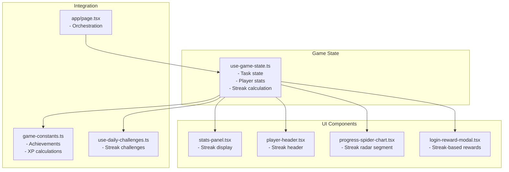
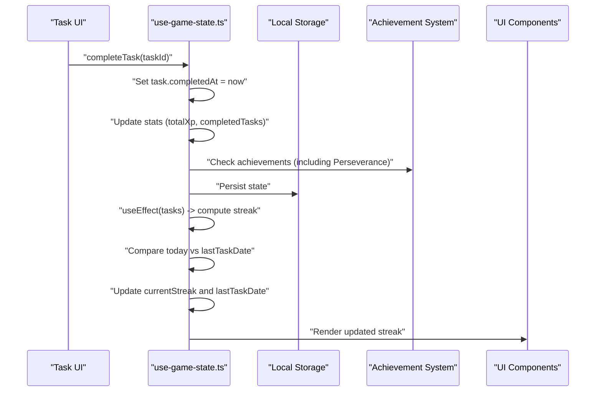
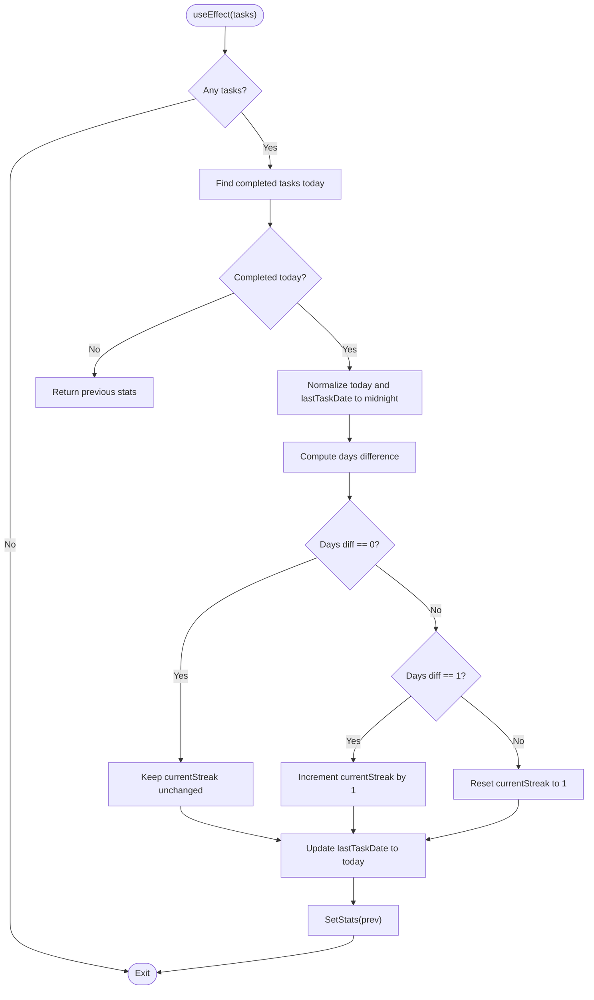
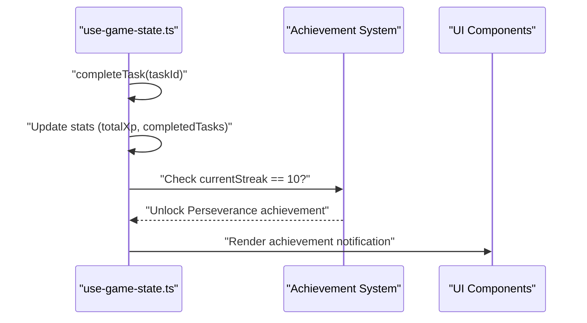
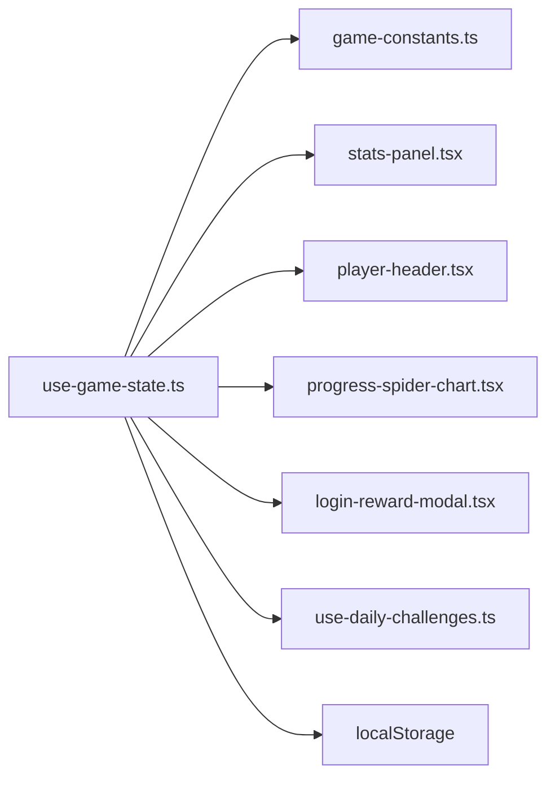

# Streak Calculation System

<cite>
**Referenced Files in This Document**
- [use-game-state.ts](file://hooks/use-game-state.ts)
- [game-constants.ts](file://lib/game-constants.ts)
- [stats-panel.tsx](file://components/stats-panel.tsx)
- [player-header.tsx](file://components/player-header.tsx)
- [progress-spider-chart.tsx](file://components/progress-spider-chart.tsx)
- [login-reward-modal.tsx](file://components/login-reward-modal.tsx)
- [use-daily-challenges.ts](file://hooks/use-daily-challenges.ts)
- [page.tsx](file://app/page.tsx)
</cite>

## Table of Contents
1. [Introduction](#introduction)
2. [Project Structure](#project-structure)
3. [Core Components](#core-components)
4. [Architecture Overview](#architecture-overview)
5. [Detailed Component Analysis](#detailed-component-analysis)
6. [Dependency Analysis](#dependency-analysis)
7. [Performance Considerations](#performance-considerations)
8. [Troubleshooting Guide](#troubleshooting-guide)
9. [Conclusion](#conclusion)

## Introduction
This document explains the streak calculation system that tracks consecutive task completions in the solo leveling game. It focuses on the useEffect hook that computes daily streaks based on completed tasks' completion dates, the date comparison logic that determines consecutive days, same-day completion, and reset scenarios. It covers streak increment conditions, reset scenarios when days are skipped, timezone handling, currentStreak state management, lastTaskDate tracking, integration with the achievement system for the Perseverance achievement (10-day streak), and UI implications for displaying streak information.

## Project Structure
The streak system spans several key files:
- State management and streak calculation live in the game state hook
- UI displays are handled by dedicated components
- Achievement definitions and XP mechanics are centralized
- Daily challenges integrate with streak tracking

**Diagram sources**
- [use-game-state.ts:1-252](file://hooks/use-game-state.ts#L1-L252)
- [stats-panel.tsx:1-145](file://components/stats-panel.tsx#L1-L145)
- [player-header.tsx:1-183](file://components/player-header.tsx#L1-L183)
- [progress-spider-chart.tsx:1-218](file://components/progress-spider-chart.tsx#L1-L218)
- [login-reward-modal.tsx:1-190](file://components/login-reward-modal.tsx#L1-L190)
- [game-constants.ts:1-95](file://lib/game-constants.ts#L1-L95)
- [use-daily-challenges.ts:1-153](file://hooks/use-daily-challenges.ts#L1-L153)
- [page.tsx:1-384](file://app/page.tsx#L1-L384)

**Section sources**
- [use-game-state.ts:1-252](file://hooks/use-game-state.ts#L1-L252)
- [stats-panel.tsx:1-145](file://components/stats-panel.tsx#L1-L145)
- [player-header.tsx:1-183](file://components/player-header.tsx#L1-L183)
- [progress-spider-chart.tsx:1-218](file://components/progress-spider-chart.tsx#L1-L218)
- [login-reward-modal.tsx:1-190](file://components/login-reward-modal.tsx#L1-L190)
- [game-constants.ts:1-95](file://lib/game-constants.ts#L1-L95)
- [use-daily-challenges.ts:1-153](file://hooks/use-daily-challenges.ts#L1-L153)
- [page.tsx:1-384](file://app/page.tsx#L1-L384)

## Core Components
- Game state hook manages tasks, player stats, and performs streak calculations
- UI components render streak information across the dashboard
- Achievement system integrates with streak milestones
- Daily challenges track streak-based objectives

Key responsibilities:
- Compute daily streaks from completed tasks
- Manage currentStreak and lastTaskDate state
- Trigger achievements when milestones are reached
- Integrate with UI for real-time display

**Section sources**
- [use-game-state.ts:51-251](file://hooks/use-game-state.ts#L51-L251)
- [stats-panel.tsx:13-144](file://components/stats-panel.tsx#L13-L144)
- [player-header.tsx:16-182](file://components/player-header.tsx#L16-L182)
- [progress-spider-chart.tsx:14-217](file://components/progress-spider-chart.tsx#L14-L217)
- [game-constants.ts:50-95](file://lib/game-constants.ts#L50-L95)
- [use-daily-challenges.ts:66-152](file://hooks/use-daily-challenges.ts#L66-L152)

## Architecture Overview
The streak system operates through a centralized game state hook that:
- Monitors task completion events
- Computes whether a task was completed today
- Updates currentStreak and lastTaskDate based on date comparisons
- Triggers achievements when milestones are met

**Diagram sources**
- [use-game-state.ts:143-210](file://hooks/use-game-state.ts#L143-L210)
- [use-game-state.ts:84-125](file://hooks/use-game-state.ts#L84-L125)
- [game-constants.ts:88-94](file://lib/game-constants.ts#L88-L94)
- [stats-panel.tsx:13-82](file://components/stats-panel.tsx#L13-L82)
- [player-header.tsx:16-82](file://components/player-header.tsx#L16-L82)

## Detailed Component Analysis

### Streak Calculation Hook
The useEffect hook responsible for daily streak computation:
- Detects if any completed task occurred today
- Normalizes timestamps to midnight for date comparison
- Compares lastTaskDate with today to determine increment/reset
- Updates currentStreak and lastTaskDate accordingly

**Diagram sources**
- [use-game-state.ts:84-125](file://hooks/use-game-state.ts#L84-L125)

Key implementation details:
- Today and lastTaskDate are normalized to midnight to ignore time-of-day
- daysDiff computed using milliseconds-to-days conversion
- Same-day completion does not change streak
- One-day skip increments streak; larger gaps reset to 1

**Section sources**
- [use-game-state.ts:84-125](file://hooks/use-game-state.ts#L84-L125)

### Date Comparison Logic
The system uses normalized dates for reliable comparison:
- Both today and lastTaskDate are set to 00:00:00.000
- daysDiff calculated as floor((today - lastTaskDate) / (1000 * 60 * 60 * 24))
- Conditions:
  - daysDiff === 0: same day, keep streak
  - daysDiff === 1: consecutive day, increment streak
  - daysDiff > 1: gap detected, reset streak to 1

Edge cases handled:
- Midnight boundary: normalization ensures consistent comparison across timezones
- No previous task: initializes streak to 1 upon first completion today

**Section sources**
- [use-game-state.ts:100-120](file://hooks/use-game-state.ts#L100-L120)

### Streak Increment and Reset Conditions
Behavior matrix:
- First completion today with no prior lastTaskDate: currentStreak = 1, lastTaskDate = today
- Same day completion: currentStreak unchanged
- Consecutive day completion: currentStreak += 1, lastTaskDate = today
- Non-consecutive day completion: currentStreak = 1, lastTaskDate = today

Integration points:
- Achievement trigger occurs during task completion when currentStreak reaches milestone thresholds
- UI components re-render with updated stats

**Section sources**
- [use-game-state.ts:104-121](file://hooks/use-game-state.ts#L104-L121)
- [use-game-state.ts:198-200](file://hooks/use-game-state.ts#L198-L200)

### Timezone Handling
The system normalizes timestamps to midnight before comparison, which:
- Eliminates timezone offset effects for date boundaries
- Treats any completion within the local day as part of that day
- Ensures consistent behavior regardless of device timezone

Potential considerations:
- If a user completes a task late at night in a timezone far behind UTC, it may still count as "today" due to normalization
- For strict UTC-based streaks, timestamps would need to be converted to UTC before normalization

**Section sources**
- [use-game-state.ts:101-110](file://hooks/use-game-state.ts#L101-L110)

### State Management: currentStreak and lastTaskDate
State structure:
- currentStreak: number representing consecutive days
- lastTaskDate: number (timestamp) of the last completed task

Persistence:
- Both fields are persisted to localStorage alongside tasks and stats
- Loaded on initial mount and updated on subsequent changes

UI updates:
- Components subscribe to gameState.stats and re-render when currentStreak changes
- Visual feedback includes pulsing animations and active indicators when streak > 0

**Section sources**
- [use-game-state.ts:27-34](file://hooks/use-game-state.ts#L27-L34)
- [use-game-state.ts:53-59](file://hooks/use-game-state.ts#L53-L59)
- [use-game-state.ts:78-82](file://hooks/use-game-state.ts#L78-L82)

### Achievement Integration: Perseverance (10-day streak)
Trigger mechanism:
- During task completion, the system checks if currentStreak equals 10
- If so, unlocks the "Perseverance" achievement and displays notifications

Achievement definition:
- Defined centrally with id, name, description, and icon
- Unlocked achievements are tracked in stats.unlockedAchievements

**Diagram sources**
- [use-game-state.ts:198-200](file://hooks/use-game-state.ts#L198-L200)
- [game-constants.ts:88-94](file://lib/game-constants.ts#L88-L94)

**Section sources**
- [use-game-state.ts:198-200](file://hooks/use-game-state.ts#L198-L200)
- [game-constants.ts:88-94](file://lib/game-constants.ts#L88-L94)

### UI Implications and Display
Multiple components present streak information:
- Player header: shows currentStreak with visual indicators when active
- Stats panel: prominent "Current Streak" card with animated fire icon
- Progress spider chart: radar segment for "Daily Streak" scaled to 30-day maximum
- Login reward modal: milestone-based rewards tied to currentStreak

Visual enhancements:
- Animated pulse effects for active streaks
- Gradient borders and glowing elements
- Real-time updates without page refresh

**Section sources**
- [player-header.tsx:16-82](file://components/player-header.tsx#L16-L82)
- [stats-panel.tsx:57-82](file://components/stats-panel.tsx#L57-L82)
- [progress-spider-chart.tsx:167-188](file://components/progress-spider-chart.tsx#L167-L188)
- [login-reward-modal.tsx:108-110](file://components/login-reward-modal.tsx#L108-L110)

### Streak Scenarios and Examples
- Starting a new streak: First completion today sets currentStreak = 1 and lastTaskDate = today
- Maintaining streaks: Consecutive day completion increments currentStreak by 1
- Breaking streaks: Non-consecutive day completion resets currentStreak to 1
- Task completion timing: Same-day completions do not change streak; only date transitions matter

Integration with daily challenges:
- Daily challenges include "Streak Keeper" and "Unstoppable" objectives
- Streak progress is updated whenever tasks are completed

**Section sources**
- [use-game-state.ts:104-121](file://hooks/use-game-state.ts#L104-L121)
- [use-daily-challenges.ts:100-127](file://hooks/use-daily-challenges.ts#L100-L127)

## Dependency Analysis
The streak system depends on:
- Game constants for achievement definitions
- UI components for rendering and user feedback
- Daily challenges for streak-based objectives
- Local storage for persistence

**Diagram sources**
- [use-game-state.ts:1-13](file://hooks/use-game-state.ts#L1-L13)
- [stats-panel.tsx:1-4](file://components/stats-panel.tsx#L1-L4)
- [player-header.tsx:1-7](file://components/player-header.tsx#L1-L7)
- [progress-spider-chart.tsx:1-4](file://components/progress-spider-chart.tsx#L1-L4)
- [login-reward-modal.tsx:1-6](file://components/login-reward-modal.tsx#L1-L6)
- [use-daily-challenges.ts:1-4](file://hooks/use-daily-challenges.ts#L1-L4)

**Section sources**
- [use-game-state.ts:1-13](file://hooks/use-game-state.ts#L1-L13)
- [game-constants.ts:50-95](file://lib/game-constants.ts#L50-L95)
- [use-daily-challenges.ts:66-152](file://hooks/use-daily-challenges.ts#L66-L152)

## Performance Considerations
- useEffect runs on every task change; ensure minimal recomputation by normalizing dates once per run
- Timestamp normalization to midnight is constant-time and negligible overhead
- Achievement checks occur during task completion; keep condition checks efficient
- UI components re-render on stats changes; batching updates reduces unnecessary renders

## Troubleshooting Guide
Common issues and resolutions:
- Streak not incrementing: Verify that tasks have completedAt timestamps and that the useEffect runs on task changes
- Streak resets unexpectedly: Confirm that daysDiff logic aligns with intended behavior; ensure timestamps are normalized to midnight
- Achievement not unlocking: Check that currentStreak reaches milestone thresholds during task completion
- UI not updating: Ensure components subscribe to gameState.stats and that state persists to localStorage

**Section sources**
- [use-game-state.ts:84-125](file://hooks/use-game-state.ts#L84-L125)
- [use-game-state.ts:198-200](file://hooks/use-game-state.ts#L198-L200)
- [page.tsx:111-126](file://app/page.tsx#L111-L126)

## Conclusion
The streak calculation system provides a robust foundation for tracking consecutive task completions. By normalizing timestamps to midnight, comparing date differences, and updating state consistently, it reliably maintains currentStreak and lastTaskDate. Integration with achievements, UI components, and daily challenges creates a cohesive progression experience. The system handles edge cases like same-day completions and non-consecutive days, and its modular design allows for future enhancements such as strict UTC-based streaks or configurable reset windows.