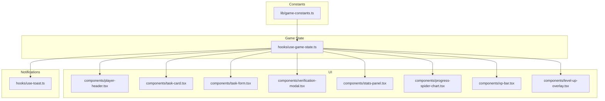
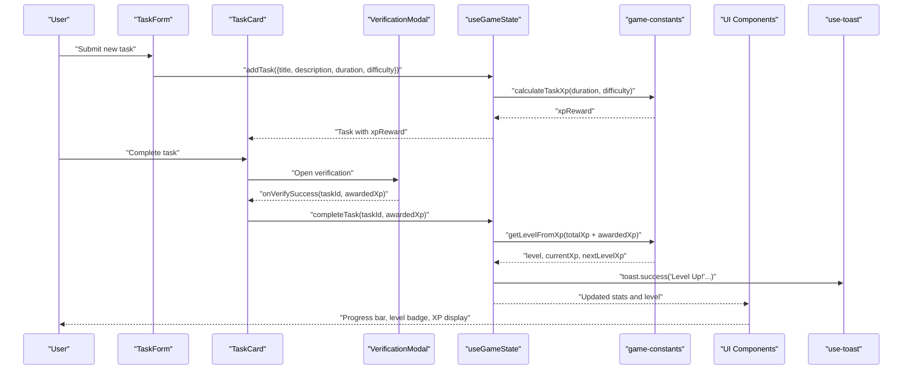
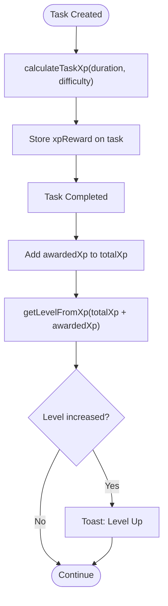
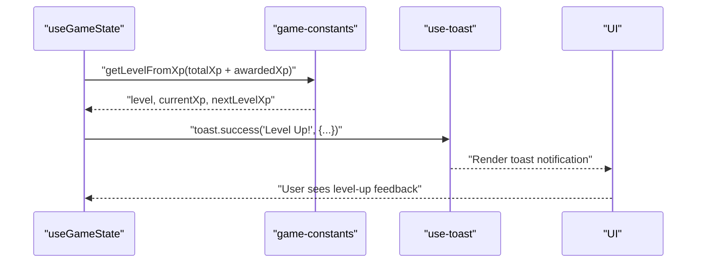
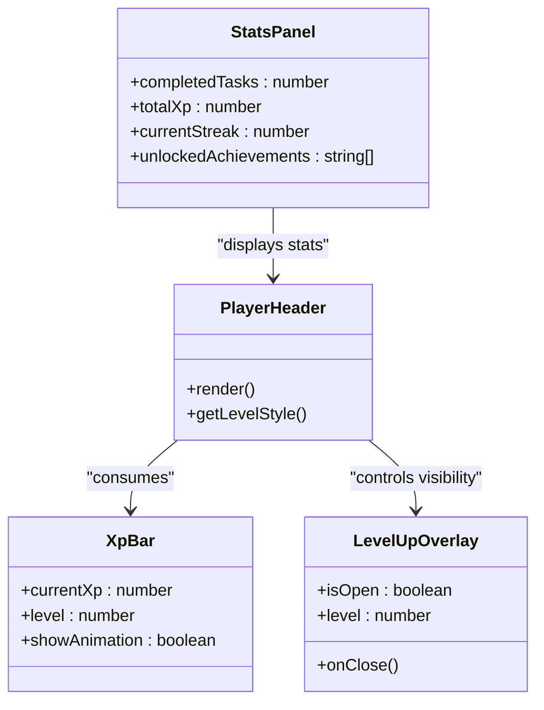
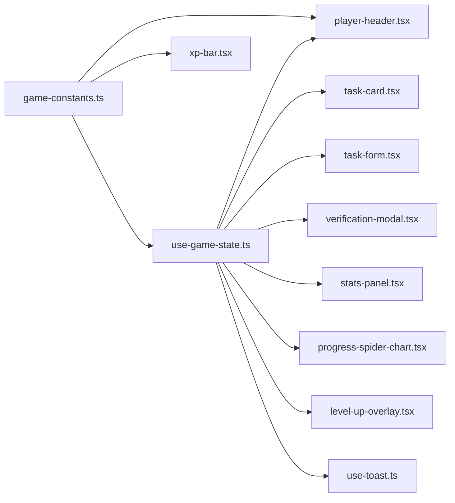

# XP and Leveling System

<cite>
**Referenced Files in This Document**
- [game-constants.ts](file://lib/game-constants.ts)
- [use-game-state.ts](file://hooks/use-game-state.ts)
- [player-header.tsx](file://components/player-header.tsx)
- [task-card.tsx](file://components/task-card.tsx)
- [task-form.tsx](file://components/task-form.tsx)
- [verification-modal.tsx](file://components/verification-modal.tsx)
- [stats-panel.tsx](file://components/stats-panel.tsx)
- [progress-spider-chart.tsx](file://components/progress-spider-chart.tsx)
- [xp-bar.tsx](file://components/xp-bar.tsx)
- [level-up-overlay.tsx](file://components/level-up-overlay.tsx)
- [use-toast.ts](file://hooks/use-toast.ts)
</cite>

## Table of Contents
1. [Introduction](#introduction)
2. [Project Structure](#project-structure)
3. [Core Components](#core-components)
4. [Architecture Overview](#architecture-overview)
5. [Detailed Component Analysis](#detailed-component-analysis)
6. [Dependency Analysis](#dependency-analysis)
7. [Performance Considerations](#performance-considerations)
8. [Troubleshooting Guide](#troubleshooting-guide)
9. [Conclusion](#conclusion)

## Introduction
This document explains the XP and leveling system mechanics implemented in the project. It covers the exponential XP progression algorithm, difficulty multiplier system, task XP calculation, level advancement criteria, and UI feedback mechanisms including toasts and overlays.

## Project Structure
The XP and leveling system spans several modules:
- Constants and algorithms live in a dedicated constants module
- Game state management coordinates XP updates, achievements, and notifications
- UI components visualize XP, levels, progress, and level-ups
- Toast and overlay systems provide user feedback

**Diagram sources**
- [game-constants.ts:1-95](file://lib/game-constants.ts#L1-L95)
- [use-game-state.ts:1-252](file://hooks/use-game-state.ts#L1-L252)
- [player-header.tsx:1-183](file://components/player-header.tsx#L1-L183)
- [task-card.tsx:1-186](file://components/task-card.tsx#L1-L186)
- [task-form.tsx:1-191](file://components/task-form.tsx#L1-L191)
- [verification-modal.tsx:279-330](file://components/verification-modal.tsx#L279-L330)
- [stats-panel.tsx:1-145](file://components/stats-panel.tsx#L1-L145)
- [progress-spider-chart.tsx:1-217](file://components/progress-spider-chart.tsx#L1-L217)
- [xp-bar.tsx:1-88](file://components/xp-bar.tsx#L1-L88)
- [level-up-overlay.tsx:1-121](file://components/level-up-overlay.tsx#L1-L121)
- [use-toast.ts:1-191](file://hooks/use-toast.ts#L1-L191)

**Section sources**
- [game-constants.ts:1-95](file://lib/game-constants.ts#L1-L95)
- [use-game-state.ts:1-252](file://hooks/use-game-state.ts#L1-L252)

## Core Components
- Difficulty ranks and multipliers define task XP scaling
- Exponential XP progression defines level thresholds
- Task XP calculation combines duration and difficulty
- Game state manages XP accumulation, level computation, and notifications
- UI displays current level, progress, and XP details
- Toasts and overlays provide feedback for level-ups and rewards

**Section sources**
- [game-constants.ts:2-9](file://lib/game-constants.ts#L2-L9)
- [game-constants.ts:14-48](file://lib/game-constants.ts#L14-L48)
- [use-game-state.ts:127-210](file://hooks/use-game-state.ts#L127-L210)
- [player-header.tsx:21-22](file://components/player-header.tsx#L21-L22)
- [task-card.tsx:19-36](file://components/task-card.tsx#L19-L36)

## Architecture Overview
The XP system follows a clean separation of concerns:
- Constants define difficulty multipliers and progression formulas
- Game state orchestrates XP updates, level detection, and achievements
- UI components consume computed values to render progress and stats
- Notifications integrate with a toast system for user feedback

**Diagram sources**
- [task-form.tsx:25-51](file://components/task-form.tsx#L25-L51)
- [task-card.tsx:25-36](file://components/task-card.tsx#L25-L36)
- [verification-modal.tsx:279-330](file://components/verification-modal.tsx#L279-L330)
- [use-game-state.ts:127-210](file://hooks/use-game-state.ts#L127-L210)
- [game-constants.ts:45-48](file://lib/game-constants.ts#L45-L48)
- [use-toast.ts:142-169](file://hooks/use-toast.ts#L142-L169)

## Detailed Component Analysis

### Exponential XP Progression
The system uses an exponential curve for XP per level:
- Base XP for level 1 is defined
- For level n > 1, XP = floor(base × multiplier^(n-1))
- Cumulative XP to reach level n is the sum of XP for all levels 1..n-1
- Level extraction computes current level from total XP and remaining XP to next level

Key functions:
- getXpForLevel(level): returns XP needed for a given level
- getCumulativeXp(level): returns total XP to reach level n
- getLevelFromXp(totalXp): returns { level, currentXp, nextLevelXp }

Practical implications:
- Early levels require modest XP gains
- Later levels demand exponentially increasing XP
- Provides a long-term progression curve suitable for sustained engagement

**Section sources**
- [game-constants.ts:14-42](file://lib/game-constants.ts#L14-L42)

### Difficulty Multiplier System
Difficulty ranks and their multipliers:
- E: 1x
- D: 1.5x
- C: 2.5x
- B: 4x
- A: 6x
- S: 10x

Task XP calculation:
- XP = ceil(duration × difficulty.multiplier)
- Duration is in minutes
- Multiplier is taken from the difficulty rank mapping

This creates a clear, predictable scaling where higher difficulty tasks yield proportionally more XP.

**Section sources**
- [game-constants.ts:2-9](file://lib/game-constants.ts#L2-L9)
- [game-constants.ts:45-48](file://lib/game-constants.ts#L45-L48)

### Task XP Calculation Workflow
When a task is created:
- Duration and difficulty are provided
- calculateTaskXp(duration, difficulty) computes the base XP reward
- The task stores this reward for later completion

When a task is completed:
- The system adds the awarded XP to the player’s total
- getLevelFromXp(totalXp + awardedXp) determines if a level-up occurred
- Toast notifications inform the user of level-ups and achievements

**Diagram sources**
- [game-constants.ts:45-48](file://lib/game-constants.ts#L45-L48)
- [use-game-state.ts:127-210](file://hooks/use-game-state.ts#L127-L210)

**Section sources**
- [use-game-state.ts:127-141](file://hooks/use-game-state.ts#L127-L141)
- [use-game-state.ts:143-210](file://hooks/use-game-state.ts#L143-L210)

### Level Advancement Criteria and Thresholds
- Each level requires a specific amount of XP defined by getXpForLevel
- Cumulative XP to reach level n is computed by summing XPForLevel for all levels 1..n-1
- getLevelFromXp(totalXp) iteratively sums XP until exceeding totalXp, then derives:
  - level
  - currentXp (totalXp minus cumulative XP up to previous level)
  - nextLevelXp (XP needed for the current level)

Relationship between total XP, current level, and remaining XP:
- Remaining XP to next level = nextLevelXp - currentXp
- Progress percentage = (currentXp / nextLevelXp) × 100

**Section sources**
- [game-constants.ts:19-42](file://lib/game-constants.ts#L19-L42)
- [player-header.tsx:21-22](file://components/player-header.tsx#L21-L22)

### Practical Examples of XP Calculations
- Example 1: A 30-minute D-ranked task yields ceil(30 × 1.5) = 45 XP
- Example 2: A 60-minute S-ranked task yields ceil(60 × 10) = 600 XP
- Example 3: Completing 5 consecutive 30-minute E-ranked tasks yields 5 × ceil(30 × 1) = 150 XP
- Example 4: Completing 10 30-minute B-ranked tasks yields 10 × ceil(30 × 4) = 1,200 XP

These examples illustrate how difficulty multipliers scale XP rewards proportionally to task duration.

**Section sources**
- [game-constants.ts:45-48](file://lib/game-constants.ts#L45-L48)

### Level-Up Scenarios and Progression Tracking
- Scenario 1: Starting at 0 XP, completing a 30-minute D task (45 XP) increases total to 45
- Scenario 2: At 100 XP, completing a 60-minute S task (600 XP) increases total to 700
- Scenario 3: After multiple tasks, getLevelFromXp(totalXp) detects level increases and triggers notifications

Progression tracking:
- Player header displays current level, total XP, and progress bar to next level
- Stats panel shows total XP, completed tasks, and current streak
- XP mastery bar normalizes XP earned against a fixed cap for visualization

**Section sources**
- [player-header.tsx:102-154](file://components/player-header.tsx#L102-L154)
- [stats-panel.tsx:25-82](file://components/stats-panel.tsx#L25-L82)
- [progress-spider-chart.tsx:21-26](file://components/progress-spider-chart.tsx#L21-L26)

### Toast Notification System for Level-Ups
- When a level-up is detected, a toast is shown with a success message and icon
- The toast system enforces a limit on concurrent toasts and manages removal timing
- Additional achievement toasts are triggered based on milestones

**Diagram sources**
- [use-game-state.ts:156-167](file://hooks/use-game-state.ts#L156-L167)
- [use-toast.ts:142-169](file://hooks/use-toast.ts#L142-L169)

**Section sources**
- [use-game-state.ts:156-167](file://hooks/use-game-state.ts#L156-L167)
- [use-toast.ts:1-191](file://hooks/use-toast.ts#L1-L191)

### UI Response to Level Changes
- Player header dynamically updates level, total XP, and progress bar
- Level-up overlay animates when a level-up occurs, displaying celebratory visuals
- XP bar component animates XP changes and renders particle effects
- Stats panel and progress spider chart reflect updated metrics

**Diagram sources**
- [player-header.tsx:1-183](file://components/player-header.tsx#L1-L183)
- [level-up-overlay.tsx:1-121](file://components/level-up-overlay.tsx#L1-L121)
- [xp-bar.tsx:1-88](file://components/xp-bar.tsx#L1-L88)
- [stats-panel.tsx:1-145](file://components/stats-panel.tsx#L1-L145)

**Section sources**
- [player-header.tsx:1-183](file://components/player-header.tsx#L1-L183)
- [level-up-overlay.tsx:1-121](file://components/level-up-overlay.tsx#L1-L121)
- [xp-bar.tsx:1-88](file://components/xp-bar.tsx#L1-L88)
- [stats-panel.tsx:1-145](file://components/stats-panel.tsx#L1-L145)

## Dependency Analysis
The XP system exhibits low coupling and high cohesion:
- game-constants.ts encapsulates progression formulas and difficulty multipliers
- use-game-state.ts depends on game-constants.ts for XP computations and notifications
- UI components depend on game-constants.ts for rendering progress and on use-game-state.ts for live stats
- Toast system is decoupled and reusable across components

**Diagram sources**
- [game-constants.ts:1-95](file://lib/game-constants.ts#L1-L95)
- [use-game-state.ts:1-252](file://hooks/use-game-state.ts#L1-L252)
- [player-header.tsx:1-183](file://components/player-header.tsx#L1-L183)
- [xp-bar.tsx:1-88](file://components/xp-bar.tsx#L1-L88)
- [task-card.tsx:1-186](file://components/task-card.tsx#L1-L186)
- [task-form.tsx:1-191](file://components/task-form.tsx#L1-L191)
- [verification-modal.tsx:279-330](file://components/verification-modal.tsx#L279-L330)
- [stats-panel.tsx:1-145](file://components/stats-panel.tsx#L1-L145)
- [progress-spider-chart.tsx:1-217](file://components/progress-spider-chart.tsx#L1-L217)
- [level-up-overlay.tsx:1-121](file://components/level-up-overlay.tsx#L1-L121)
- [use-toast.ts:1-191](file://hooks/use-toast.ts#L1-L191)

**Section sources**
- [game-constants.ts:1-95](file://lib/game-constants.ts#L1-L95)
- [use-game-state.ts:1-252](file://hooks/use-game-state.ts#L1-L252)

## Performance Considerations
- getXpForLevel and getLevelFromXp are O(1) and O(n) respectively; n corresponds to level number
- getCumulativeXp is O(n) and can be optimized to O(1) using the geometric series formula
- Task XP calculation is O(1) per task
- Toast notifications are limited to reduce UI overhead
- UI animations (XP bar, level-up overlay) use requestAnimationFrame and controlled lifecycles

Optimization opportunities:
- Replace iterative cumulative sum with closed-form geometric series for getCumulativeXp
- Debounce or batch UI updates during rapid XP gains

[No sources needed since this section provides general guidance]

## Troubleshooting Guide
Common issues and resolutions:
- Incorrect XP rewards: Verify difficulty rank selection and duration input in task creation
- Level-up not detected: Ensure total XP is updated before calling getLevelFromXp
- Toast not appearing: Confirm toast registration and limits in the toast system
- Progress bar stuck: Check that currentXp and nextLevelXp are recalculated after XP changes
- Achievement not unlocking: Verify milestone conditions and unlockedAchievements state updates

**Section sources**
- [use-game-state.ts:156-200](file://hooks/use-game-state.ts#L156-L200)
- [use-toast.ts:8-10](file://hooks/use-toast.ts#L8-L10)
- [player-header.tsx:21-22](file://components/player-header.tsx#L21-L22)

## Conclusion
The XP and leveling system employs a robust exponential progression model with explicit difficulty multipliers. The modular design cleanly separates constants, state management, and UI, enabling scalable enhancements. The notification and visual feedback mechanisms provide immediate, engaging reinforcement for player achievements and progress.