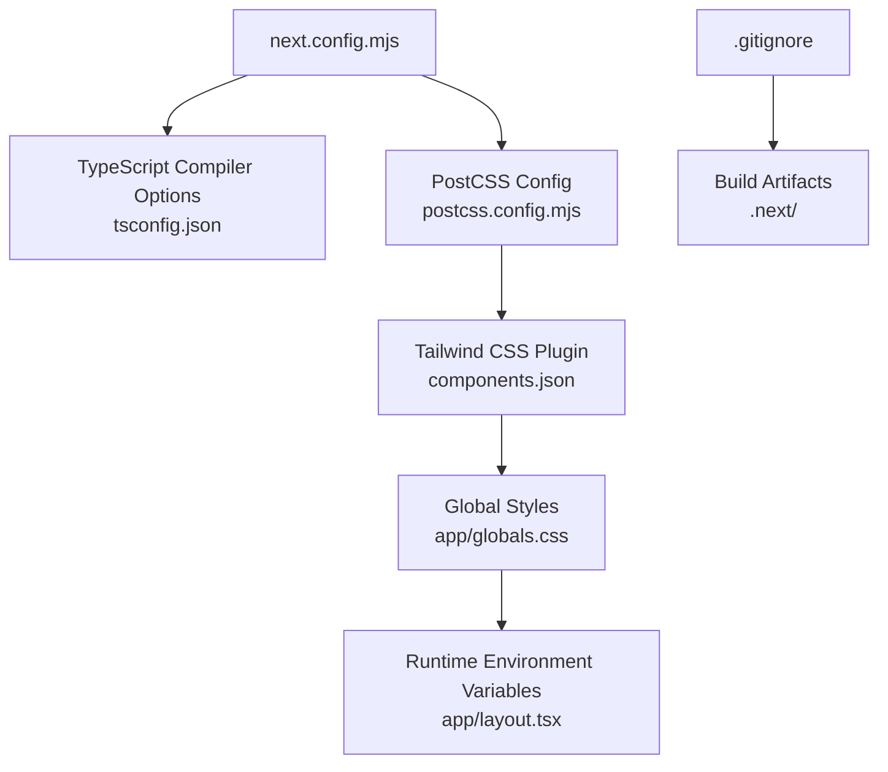
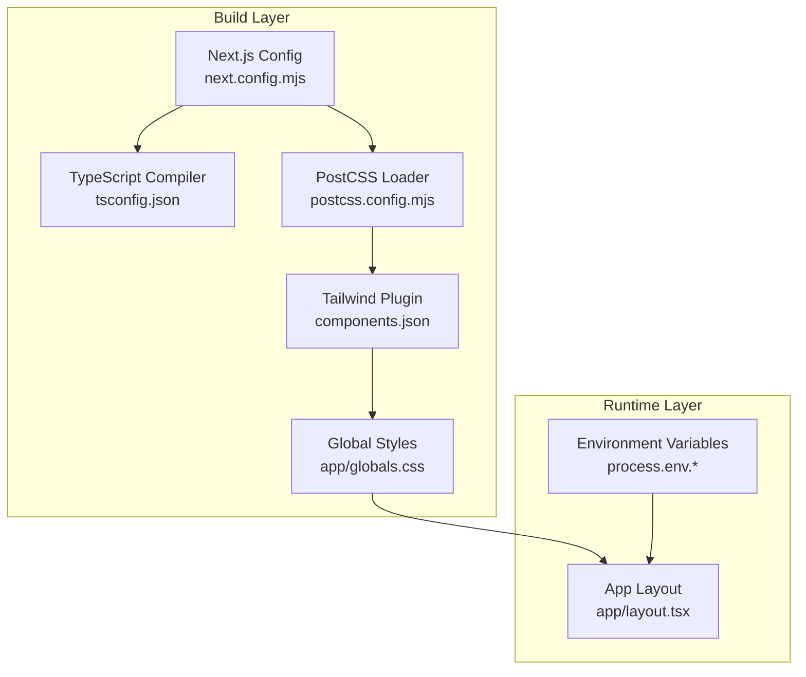
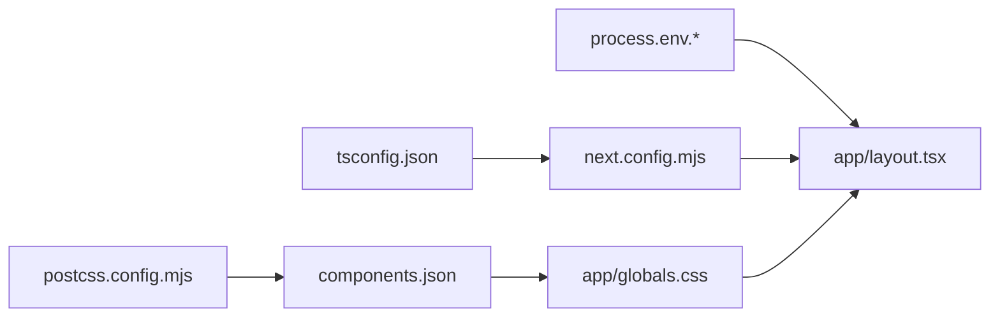

# Build Configuration

<cite>
**Referenced Files in This Document**
- [next.config.mjs](file://next.config.mjs)
- [package.json](file://package.json)
- [tsconfig.json](file://tsconfig.json)
- [postcss.config.mjs](file://postcss.config.mjs)
- [components.json](file://components.json)
- [app/layout.tsx](file://app/layout.tsx)
- [app/globals.css](file://app/globals.css)
- [styles/globals.css](file://styles/globals.css)
- [next-env.d.ts](file://next-env.d.ts)
- [.gitignore](file://.gitignore)
- [backend/server.js](file://backend/server.js)
</cite>

## Table of Contents
1. [Introduction](#introduction)
2. [Project Structure](#project-structure)
3. [Core Components](#core-components)
4. [Architecture Overview](#architecture-overview)
5. [Detailed Component Analysis](#detailed-component-analysis)
6. [Dependency Analysis](#dependency-analysis)
7. [Performance Considerations](#performance-considerations)
8. [Troubleshooting Guide](#troubleshooting-guide)
9. [Conclusion](#conclusion)

## Introduction
This document describes the build configuration for Solo Leveling Manager, focusing on Next.js build settings, TypeScript compilation, PostCSS/Tailwind integration, asset bundling, environment variable handling, and production optimization strategies. It also covers performance monitoring, caching, incremental compilation, and troubleshooting guidance tailored to the current repository setup.

## Project Structure
The build pipeline centers on Next.js App Router pages and modern frontend tooling:
- Next.js configuration defines TypeScript behavior, image optimization, and logging.
- TypeScript compiler options enable strictness, incremental builds, and bundler module resolution.
- PostCSS with Tailwind CSS plugin generates optimized CSS from global styles.
- Environment variables are consumed at runtime and during metadata generation.
- Backend service is separate and does not impact frontend build configuration.

**Diagram sources**
- [next.config.mjs:1-15](file://next.config.mjs#L1-L15)
- [tsconfig.json:1-43](file://tsconfig.json#L1-L43)
- [postcss.config.mjs:1-9](file://postcss.config.mjs#L1-L9)
- [components.json:1-22](file://components.json#L1-L22)
- [app/globals.css:1-594](file://app/globals.css#L1-L594)
- [app/layout.tsx:1-47](file://app/layout.tsx#L1-L47)
- [.gitignore:1-17](file://.gitignore#L1-L17)

**Section sources**
- [next.config.mjs:1-15](file://next.config.mjs#L1-L15)
- [tsconfig.json:1-43](file://tsconfig.json#L1-L43)
- [postcss.config.mjs:1-9](file://postcss.config.mjs#L1-L9)
- [components.json:1-22](file://components.json#L1-L22)
- [app/globals.css:1-594](file://app/globals.css#L1-L594)
- [app/layout.tsx:1-47](file://app/layout.tsx#L1-L47)
- [.gitignore:1-17](file://.gitignore#L1-L17)

## Core Components
- Next.js build configuration
  - TypeScript: build errors are ignored during the build phase.
  - Images: unoptimized images are enabled.
  - Logging: browser logs are forwarded to terminal.
- TypeScript configuration
  - Strict mode enabled, ES6 target, esnext module, bundler module resolution, isolated modules, JSX with react-jsx, incremental compilation, and path aliases.
- PostCSS and Tailwind
  - Tailwind plugin configured via PostCSS; Tailwind CSS imported in global styles; shadcn/slots configured for RSC/TSX.
- Global CSS and fonts
  - Tailwind directives and animations imported; theme tokens and dark mode variants defined.
- Environment variables
  - Runtime consumption in metadata and analytics; backend server loads environment from a sibling path.

**Section sources**
- [next.config.mjs:1-15](file://next.config.mjs#L1-L15)
- [tsconfig.json:1-43](file://tsconfig.json#L1-L43)
- [postcss.config.mjs:1-9](file://postcss.config.mjs#L1-L9)
- [components.json:1-22](file://components.json#L1-L22)
- [app/globals.css:1-594](file://app/globals.css#L1-L594)
- [app/layout.tsx:1-47](file://app/layout.tsx#L1-L47)
- [backend/server.js:1-155](file://backend/server.js#L1-L155)

## Architecture Overview
The build pipeline integrates Next.js, TypeScript, and PostCSS/Tailwind to produce a modern, optimized client bundle. The backend remains separate and unaffected by frontend build settings.

**Diagram sources**
- [next.config.mjs:1-15](file://next.config.mjs#L1-L15)
- [tsconfig.json:1-43](file://tsconfig.json#L1-L43)
- [postcss.config.mjs:1-9](file://postcss.config.mjs#L1-L9)
- [components.json:1-22](file://components.json#L1-L22)
- [app/globals.css:1-594](file://app/globals.css#L1-L594)
- [app/layout.tsx:1-47](file://app/layout.tsx#L1-L47)

## Detailed Component Analysis

### Next.js Build Configuration
- Purpose: Centralizes Next.js build-time behavior.
- Key settings:
  - TypeScript: build errors are ignored during the build phase.
  - Images: unoptimized images are enabled.
  - Logging: browser logs are forwarded to terminal.
- Implications:
  - Enabling unoptimized images disables automatic responsive image optimization; assets must be optimized externally.
  - Ignoring TypeScript build errors allows builds to proceed even if type checks fail; ensure CI enforces type safety separately.

**Section sources**
- [next.config.mjs:1-15](file://next.config.mjs#L1-L15)

### TypeScript Compilation Settings
- Strictness and emit control:
  - Strict mode enabled.
  - No emit (compiled types only).
- Module and resolution:
  - ES6 target, esnext module, bundler module resolution, isolated modules.
- JSX and incremental builds:
  - JSX via react-jsx, incremental enabled for faster rebuilds.
- Path aliases:
  - Path mapping @/* to project root simplifies imports.

**Section sources**
- [tsconfig.json:1-43](file://tsconfig.json#L1-L43)

### Module Resolution and Path Aliases
- Bundler module resolution ensures compatibility with Next.js App Router and modern bundlers.
- Path alias @/* resolves to the project root, reducing relative path complexity.

**Section sources**
- [tsconfig.json:15-29](file://tsconfig.json#L15-L29)

### PostCSS and Tailwind CSS Integration
- PostCSS configuration:
  - Tailwind plugin loaded via @tailwindcss/postcss.
- Tailwind configuration:
  - Tailwind CSS configured via components.json with RSC/TSX support, CSS path, color palette, and aliases.
- Global styles:
  - Tailwind directives and custom animations imported in app/globals.css; theme tokens and dark mode variants defined.

**Section sources**
- [postcss.config.mjs:1-9](file://postcss.config.mjs#L1-L9)
- [components.json:1-22](file://components.json#L1-L22)
- [app/globals.css:1-594](file://app/globals.css#L1-L594)

### Environment Variable Handling
- Runtime usage:
  - Site name and base URL are read from NEXT_PUBLIC_* environment variables in app/layout.tsx.
- Backend usage:
  - Backend server loads OPENAI_API_KEY from a sibling .env path.
- Build-time artifacts:
  - .next directory is ignored by version control per .gitignore.

**Section sources**
- [app/layout.tsx:10-31](file://app/layout.tsx#L10-L31)
- [backend/server.js:1](file://backend/server.js#L1)
- [.gitignore:10-16](file://.gitignore#L10-L16)

### Asset Bundling Strategies
- Image optimization:
  - Unoptimized images are enabled; external optimization recommended.
- Fonts:
  - Next.js Google Fonts integration used for Geist and Geist Mono.
- CSS:
  - Tailwind directives processed by PostCSS; global CSS included in app layout.

**Section sources**
- [next.config.mjs:6-8](file://next.config.mjs#L6-L8)
- [app/layout.tsx:2-8](file://app/layout.tsx#L2-L8)
- [app/globals.css:1-2](file://app/globals.css#L1-L2)

### Static Site Generation Options
- Current configuration does not enable static generation; Next.js defaults apply.
- Pages using server-side features (e.g., analytics, toasts) remain dynamic.

**Section sources**
- [package.json:5-9](file://package.json#L5-L9)

### Build Artifacts and Incremental Compilation
- Build artifacts:
  - .next directory generated by Next.js build; excluded from version control.
- Incremental compilation:
  - Enabled in TypeScript configuration for faster development rebuilds.

**Section sources**
- [.gitignore:15](file://.gitignore#L15)
- [tsconfig.json:19](file://tsconfig.json#L19)

### Bundle Analysis Tools
- No explicit bundle analysis configuration present in the repository.
- Consider integrating next-bundle-analyzer or similar for production insights.

**Section sources**
- [next.config.mjs:1-15](file://next.config.mjs#L1-L15)

### Optimization Techniques for Production Builds
- Recommended adjustments (conceptual):
  - Enable static generation for data-less pages.
  - Configure image optimization and responsive images.
  - Split vendor chunks and use dynamic imports for large libraries.
  - Enable compression and cache headers via hosting provider.
  - Monitor bundle size and remove unused CSS/JS.

[No sources needed since this section provides general guidance]

### Code Splitting and Lazy Loading
- Dynamic imports and React.lazy are not explicitly configured in the repository.
- Consider dynamic imports for heavy components and third-party libraries.

**Section sources**
- [components/avatar-3d.tsx:1257-1265](file://components/avatar-3d.tsx#L1257-L1265)

### Build Performance Monitoring and Cache Optimization
- Logging:
  - Browser logs forwarded to terminal aid debugging.
- Caching:
  - No explicit cache optimization settings found.
- Recommendations:
  - Use CDN and cache headers.
  - Leverage Next.js static export for fully static deployments.

**Section sources**
- [next.config.mjs:9-11](file://next.config.mjs#L9-L11)

## Dependency Analysis
- Next.js runtime depends on TypeScript configuration and PostCSS pipeline.
- Tailwind plugin relies on PostCSS configuration and components.json.
- Global CSS depends on Tailwind directives and theme tokens.
- Environment variables influence metadata and analytics.

**Diagram sources**
- [tsconfig.json:1-43](file://tsconfig.json#L1-L43)
- [next.config.mjs:1-15](file://next.config.mjs#L1-L15)
- [postcss.config.mjs:1-9](file://postcss.config.mjs#L1-L9)
- [components.json:1-22](file://components.json#L1-L22)
- [app/globals.css:1-594](file://app/globals.css#L1-L594)
- [app/layout.tsx:1-47](file://app/layout.tsx#L1-L47)

**Section sources**
- [tsconfig.json:1-43](file://tsconfig.json#L1-L43)
- [next.config.mjs:1-15](file://next.config.mjs#L1-L15)
- [postcss.config.mjs:1-9](file://postcss.config.mjs#L1-L9)
- [components.json:1-22](file://components.json#L1-L22)
- [app/globals.css:1-594](file://app/globals.css#L1-L594)
- [app/layout.tsx:1-47](file://app/layout.tsx#L1-L47)

## Performance Considerations
- Keep TypeScript incremental enabled for faster rebuilds.
- External optimize images and fonts to reduce bundle weight.
- Prefer static generation for pages without server-side data.
- Use dynamic imports for large third-party libraries.
- Monitor bundle size and remove unused CSS/JS.

[No sources needed since this section provides general guidance]

## Troubleshooting Guide
- TypeScript build errors during CI:
  - The build ignores TypeScript errors; ensure CI runs type checking separately.
- Missing environment variables:
  - Verify NEXT_PUBLIC_* variables for metadata and base URL.
  - Confirm backend .env path and OPENAI_API_KEY availability.
- Image optimization issues:
  - Unoptimized images are enabled; ensure assets are optimized externally.
- Build artifacts not tracked:
  - .next is ignored by .gitignore; ensure deployment scripts handle build output.

**Section sources**
- [next.config.mjs:3-5](file://next.config.mjs#L3-L5)
- [app/layout.tsx:10-31](file://app/layout.tsx#L10-L31)
- [backend/server.js:1](file://backend/server.js#L1)
- [next.config.mjs:6-8](file://next.config.mjs#L6-L8)
- [.gitignore:15](file://.gitignore#L15)

## Conclusion
Solo Leveling Manager’s build configuration emphasizes developer experience with strict TypeScript settings, bundler module resolution, and Tailwind CSS integration. While image optimization and static generation are not configured, the setup supports rapid iteration and modern frontend tooling. For production, consider enabling static generation, optimizing assets, and adding bundle analysis to maintain performance and reliability.