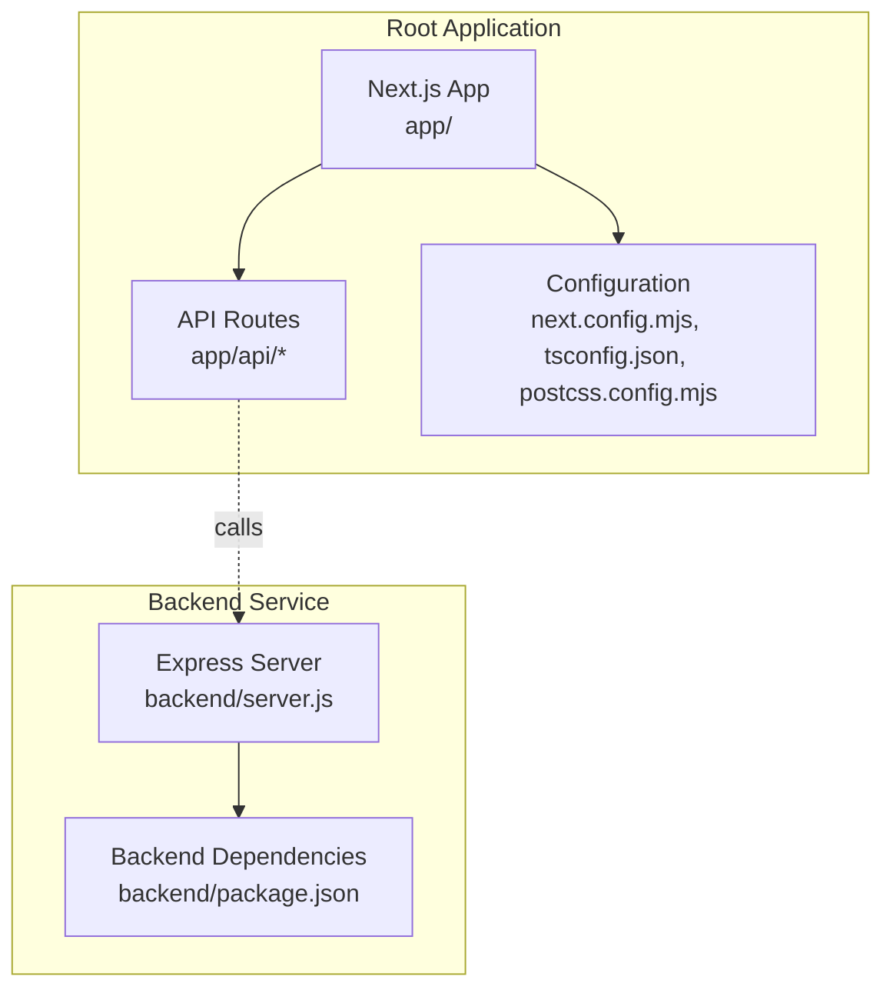
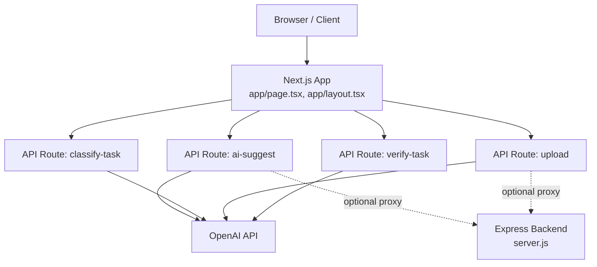
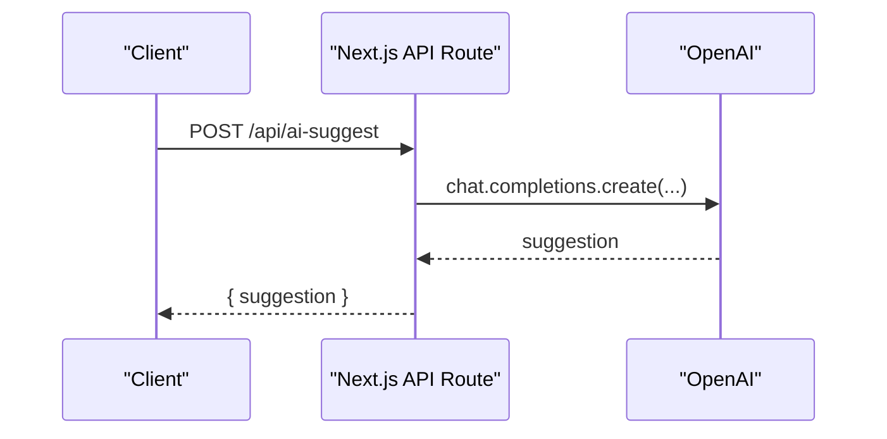
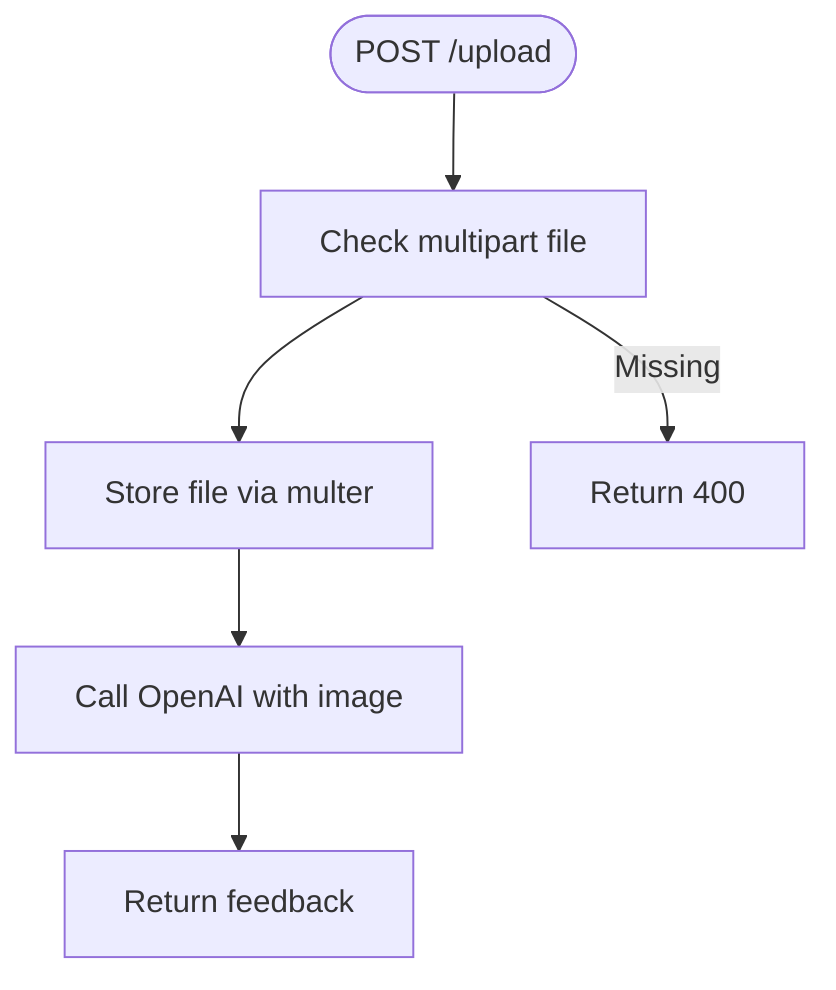

# Deployment Guide

<cite>
**Referenced Files in This Document**
- [package.json](file://package.json)
- [next.config.mjs](file://next.config.mjs)
- [tsconfig.json](file://tsconfig.json)
- [postcss.config.mjs](file://postcss.config.mjs)
- [backend/package.json](file://backend/package.json)
- [backend/server.js](file://backend/server.js)
- [app/api/ai-suggest/route.ts](file://app/api/ai-suggest/route.ts)
- [app/api/classify-task/route.ts](file://app/api/classify-task/route.ts)
- [app/api/upload/route.ts](file://app/api/upload/route.ts)
- [app/api/verify-task/route.ts](file://app/api/verify-task/route.ts)
</cite>

## Table of Contents
1. [Introduction](#introduction)
2. [Project Structure](#project-structure)
3. [Core Components](#core-components)
4. [Architecture Overview](#architecture-overview)
5. [Detailed Component Analysis](#detailed-component-analysis)
6. [Environment Variables and Configuration](#environment-variables-and-configuration)
7. [Build and Production Optimization](#build-and-production-optimization)
8. [Bundle Analysis](#bundle-analysis)
9. [Frontend Deployment](#frontend-deployment)
10. [Backend Deployment](#backend-deployment)
11. [Containerization and Cloud Deployment](#containerization-and-cloud-deployment)
12. [CI/CD Pipeline Setup](#cicd-pipeline-setup)
13. [Scaling, Load Balancing, and Monitoring](#scaling-load-balancing-and-monitoring)
14. [Security and SSL](#security-and-ssl)
15. [Backup Strategies](#backup-strategies)
16. [Troubleshooting Guide](#troubleshooting-guide)
17. [Conclusion](#conclusion)

## Introduction
This guide provides end-to-end deployment instructions for Solo Leveling Manager, covering frontend (Next.js 16.2.0), backend (Express.js), environment configuration, build optimization, containerization, cloud deployment, CI/CD, scaling, security, and troubleshooting. It is designed for both technical and non-technical audiences and references concrete files in the repository.

## Project Structure
Solo Leveling Manager is a dual-service project:
- Frontend: Next.js 16.2.0 application under the root with API routes under app/api.
- Backend: Express.js microservice under backend/ with a simple server and file upload support.

**Diagram sources**
- [package.json:1-78](file://package.json#L1-L78)
- [next.config.mjs:1-15](file://next.config.mjs#L1-L15)
- [tsconfig.json:1-43](file://tsconfig.json#L1-L43)
- [postcss.config.mjs:1-9](file://postcss.config.mjs#L1-L9)
- [backend/server.js:1-155](file://backend/server.js#L1-L155)
- [backend/package.json:1-13](file://backend/package.json#L1-L13)

**Section sources**
- [package.json:1-78](file://package.json#L1-L78)
- [next.config.mjs:1-15](file://next.config.mjs#L1-L15)
- [tsconfig.json:1-43](file://tsconfig.json#L1-L43)
- [postcss.config.mjs:1-9](file://postcss.config.mjs#L1-L9)
- [backend/package.json:1-13](file://backend/package.json#L1-L13)

## Core Components
- Next.js App: React-based frontend with API routes for AI-powered features.
- Express Backend: Provides file upload and OpenAI integrations for premium features.
- Environment Variables: API keys and runtime configuration are loaded via dotenv and process.env.

Key runtime dependencies and scripts:
- Frontend scripts: dev, build, start, lint.
- Backend dependencies: express, cors, multer, dotenv, body-parser, openai.

**Section sources**
- [package.json:5-10](file://package.json#L5-L10)
- [package.json:11-64](file://package.json#L11-L64)
- [backend/package.json:4-11](file://backend/package.json#L4-L11)

## Architecture Overview
The frontend Next.js app exposes API routes that integrate with OpenAI. Premium features (AI suggestions, image analysis) rely on the backend Express service. The backend uses environment variables for OpenAI credentials and persists uploads locally.

**Diagram sources**
- [app/api/ai-suggest/route.ts:1-34](file://app/api/ai-suggest/route.ts#L1-L34)
- [app/api/classify-task/route.ts:1-43](file://app/api/classify-task/route.ts#L1-L43)
- [app/api/upload/route.ts:1-43](file://app/api/upload/route.ts#L1-L43)
- [app/api/verify-task/route.ts:1-55](file://app/api/verify-task/route.ts#L1-L55)
- [backend/server.js:14-16](file://backend/server.js#L14-L16)

## Detailed Component Analysis

### Next.js API Routes
- ai-suggest: Generates task suggestions using OpenAI. Falls back to a mock response if the API key is missing.
- classify-task: Classifies tasks as written/physical or none using OpenAI.
- upload: Accepts a file and sends it to OpenAI for analysis.
- verify-task: Evaluates proof images and returns XP multiplier and feedback.

**Diagram sources**
- [app/api/ai-suggest/route.ts:8-33](file://app/api/ai-suggest/route.ts#L8-L33)

**Section sources**
- [app/api/ai-suggest/route.ts:1-34](file://app/api/ai-suggest/route.ts#L1-L34)
- [app/api/classify-task/route.ts:1-43](file://app/api/classify-task/route.ts#L1-L43)
- [app/api/upload/route.ts:1-43](file://app/api/upload/route.ts#L1-L43)
- [app/api/verify-task/route.ts:1-55](file://app/api/verify-task/route.ts#L1-L55)

### Express Backend
- Loads environment variables from a parent .env file.
- Exposes endpoints for tasks, upgrades, AI suggestions, and image uploads.
- Uses multer for disk storage and CORS for cross-origin requests.
- Integrates with OpenAI for premium features.

**Diagram sources**
- [backend/server.js:111-135](file://backend/server.js#L111-L135)

**Section sources**
- [backend/server.js:1-155](file://backend/server.js#L1-L155)
- [backend/package.json:1-13](file://backend/package.json#L1-L13)

## Environment Variables and Configuration
- Frontend API routes read OPENAI_API_KEY from process.env.
- Backend loads .env from a parent directory and reads OPENAI_API_KEY.
- TypeScript configuration targets ES6 and uses bundler module resolution.
- PostCSS is configured with Tailwind PostCSS plugin.

Recommended environment variables:
- OPENAI_API_KEY: Required for AI features.
- PORT: Optional; defaults to 3000 in backend server.

Configuration files:
- next.config.mjs: Typescript ignores build errors, images unoptimized, browser logs enabled.
- tsconfig.json: Strict mode, esmodule interop, bundler module resolution.
- postcss.config.mjs: Tailwind PostCSS plugin.

**Section sources**
- [app/api/ai-suggest/route.ts:4-6](file://app/api/ai-suggest/route.ts#L4-L6)
- [app/api/classify-task/route.ts:4-6](file://app/api/classify-task/route.ts#L4-L6)
- [app/api/upload/route.ts:4-6](file://app/api/upload/route.ts#L4-L6)
- [app/api/verify-task/route.ts:4-6](file://app/api/verify-task/route.ts#L4-L6)
- [backend/server.js:1-1](file://backend/server.js#L1-L1)
- [backend/server.js:14-16](file://backend/server.js#L14-L16)
- [next.config.mjs:3-12](file://next.config.mjs#L3-L12)
- [tsconfig.json:9-18](file://tsconfig.json#L9-L18)
- [postcss.config.mjs:2-6](file://postcss.config.mjs#L2-L6)

## Build and Production Optimization
- Next.js build pipeline is used for frontend production builds.
- next.config.mjs enables browser logs and unoptimized images; consider enabling image optimization in production.
- TypeScript compilation is strict; ignoreBuildErrors is enabled for TS in production builds.
- PostCSS with Tailwind is configured for styling.

Recommendations:
- Enable image optimization for production deployments.
- Configure static export if the app supports it.
- Use Next.js SWC minification and built-in optimizations.

**Section sources**
- [package.json:7-8](file://package.json#L7-L8)
- [next.config.mjs:3-12](file://next.config.mjs#L3-L12)
- [tsconfig.json:11-12](file://tsconfig.json#L11-L12)

## Bundle Analysis
- Use Next.js telemetry and analyzer packages to inspect bundle composition.
- Focus on third-party libraries (OpenAI SDK, Three.js, Radix UI) and route-level code splitting.

Suggested steps:
- Install a Next.js bundle analyzer and run the production build to visualize dependencies.
- Audit OpenAI SDK usage across routes to minimize duplication.

[No sources needed since this section provides general guidance]

## Frontend Deployment
Supported platforms:
- Vercel: Recommended for Next.js applications. Configure environment variables and build settings in the dashboard.

Local build and start:
- Build: next build
- Start: next start

Vercel-specific steps:
- Set OPENAI_API_KEY in project settings.
- Configure build output to .next.
- Enable serverless or Edge runtime for API routes as needed.

**Section sources**
- [package.json:6-9](file://package.json#L6-L9)
- [next.config.mjs:1-15](file://next.config.mjs#L1-L15)

## Backend Deployment
Options:
- Node.js hosting (e.g., Render, Railway, AWS Elastic Beanstalk).
- Containerized deployment (see next section).

Local execution:
- Install dependencies: npm install (in backend/)
- Start server: node server.js

Production considerations:
- Set OPENAI_API_KEY in environment.
- Persist uploads directory if needed; otherwise use object storage.
- Use a process manager (PM2) or container orchestration.

**Section sources**
- [backend/package.json:4-11](file://backend/package.json#L4-L11)
- [backend/server.js:152-154](file://backend/server.js#L152-L154)

## Containerization and Cloud Deployment
Docker (recommended approach):
- Create a Dockerfile for the backend service.
- Build a multi-stage image to reduce size.
- Mount persistent volumes for uploads if local storage is required.

Kubernetes (optional):
- Deploy backend as a StatefulSet with persistent volume claims.
- Use ConfigMaps/Secrets for environment variables.

Cloud providers:
- AWS: ECS/Fargate or EKS.
- GCP: Cloud Run or GKE.
- Azure: Container Instances or AKS.

[No sources needed since this section provides general guidance]

## CI/CD Pipeline Setup
Recommended workflow:
- Trigger on push to main branch.
- Run lint and type checks.
- Run tests (unit/integration).
- Build frontend and backend.
- Push images to registry.
- Deploy to target environment.

Tools:
- GitHub Actions, GitLab CI, or Jenkins.
- Use secrets for OPENAI_API_KEY and deployment credentials.

[No sources needed since this section provides general guidance]

## Scaling, Load Balancing, and Monitoring
- Horizontal scaling: Deploy multiple instances behind a load balancer.
- API routes: Prefer serverless or edge functions for cost efficiency.
- Monitoring: Add analytics and error tracking; configure health checks.
- CDN: Serve static assets via CDN for improved performance.

[No sources needed since this section provides general guidance]

## Security and SSL
- Enforce HTTPS at the ingress/load balancer level.
- Store secrets in environment variables or managed secret stores.
- Rate limit AI endpoints to prevent abuse.
- Validate and sanitize all uploaded files.

[No sources needed since this section provides general guidance]

## Backup Strategies
- Database: Use managed database backups or logical dumps.
- File uploads: Back up the uploads directory to object storage.
- Configuration: Version control environment variables externally.

[No sources needed since this section provides general guidance]

## Troubleshooting Guide
Common issues and resolutions:
- Missing OPENAI_API_KEY:
  - Symptom: Mock responses or 500 errors.
  - Fix: Set OPENAI_API_KEY in environment variables.
- CORS errors:
  - Symptom: Cross-origin failures.
  - Fix: Ensure CORS middleware is enabled and origins are allowed.
- Upload failures:
  - Symptom: 400 errors or storage issues.
  - Fix: Verify multer destination and permissions; check file size limits.
- Build errors:
  - Symptom: Type errors during production build.
  - Fix: Review tsconfig strictness and ignoreBuildErrors setting.

**Section sources**
- [app/api/ai-suggest/route.ts:12-20](file://app/api/ai-suggest/route.ts#L12-L20)
- [backend/server.js:8-8](file://backend/server.js#L8-L8)
- [backend/server.js:21-28](file://backend/server.js#L21-L28)
- [next.config.mjs:3-5](file://next.config.mjs#L3-L5)

## Conclusion
Solo Leveling Manager can be deployed efficiently using modern cloud platforms. The frontend leverages Next.js with API routes and optional backend integration for premium features. Secure, scalable, and observable deployments require proper environment configuration, containerization, CI/CD automation, and monitoring. Use the sections above to tailor the deployment to your infrastructure and operational needs.