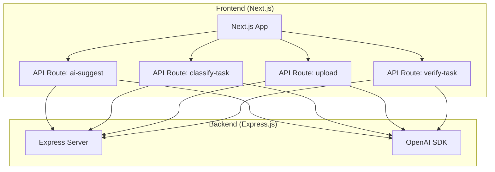
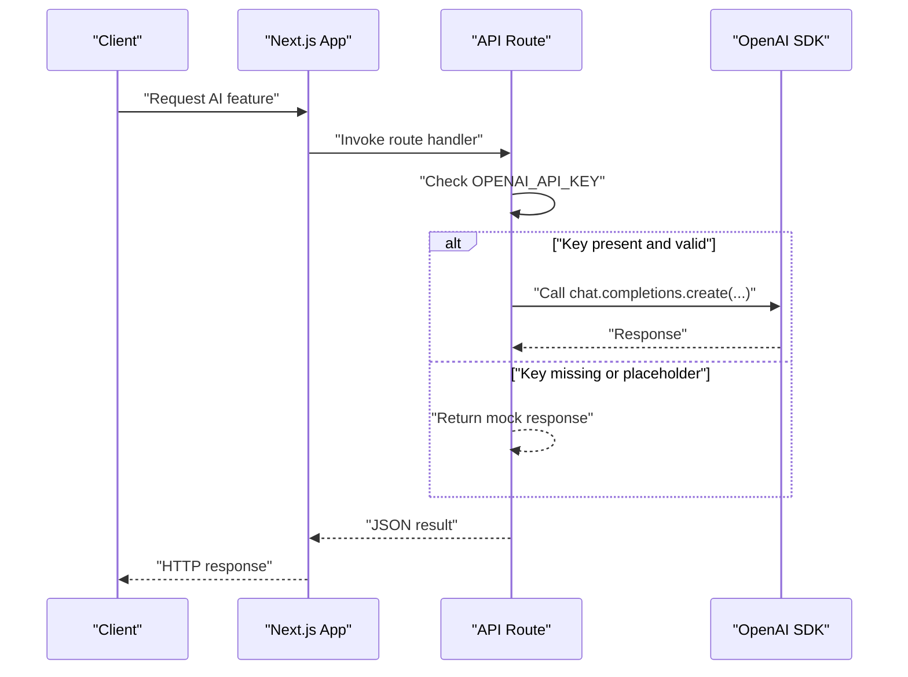
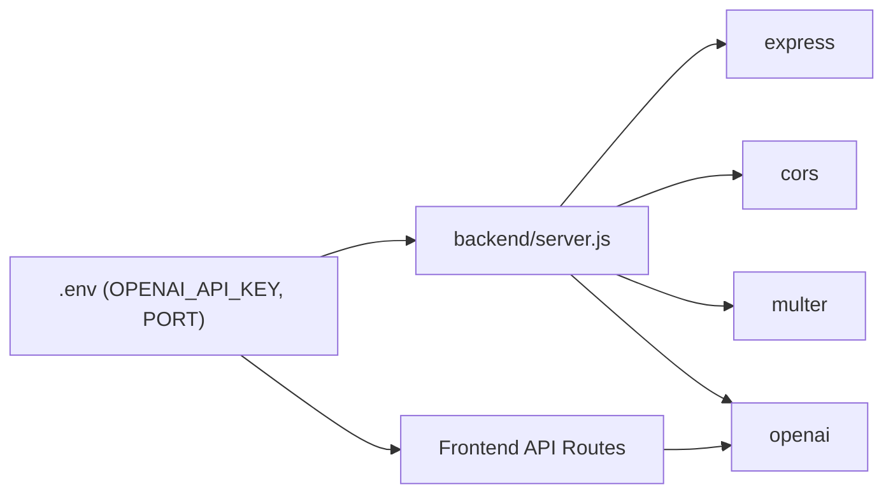

# Environment Setup

<cite>
**Referenced Files in This Document**
- [backend/server.js](file://backend/server.js)
- [backend/package.json](file://backend/package.json)
- [app/api/ai-suggest/route.ts](file://app/api/ai-suggest/route.ts)
- [app/api/classify-task/route.ts](file://app/api/classify-task/route.ts)
- [app/api/upload/route.ts](file://app/api/upload/route.ts)
- [app/api/verify-task/route.ts](file://app/api/verify-task/route.ts)
- [package.json](file://package.json)
- [next.config.mjs](file://next.config.mjs)
</cite>

## Table of Contents
1. [Introduction](#introduction)
2. [Project Structure](#project-structure)
3. [Core Components](#core-components)
4. [Architecture Overview](#architecture-overview)
5. [Detailed Component Analysis](#detailed-component-analysis)
6. [Dependency Analysis](#dependency-analysis)
7. [Performance Considerations](#performance-considerations)
8. [Troubleshooting Guide](#troubleshooting-guide)
9. [Conclusion](#conclusion)
10. [Appendices](#appendices)

## Introduction
This document provides comprehensive environment setup guidance for Solo Leveling Manager. It covers environment variable configuration for development, staging, and production, including API keys, database connections, and third-party service credentials. It also explains .env file structure, variable naming conventions, and security best practices for sensitive data. Backend service configuration is documented, including Express.js server settings, port configuration, and middleware setup. Database connection setup, Redis configuration for caching, and external API integration settings are included. Local development environment setup, Docker configuration for containerized deployment, and cloud platform environment variables are covered. SSL certificate configuration, proxy settings, and load balancer configuration are explained. Finally, environment validation scripts, health check endpoints, and monitoring setup for production environments are provided.

## Project Structure
Solo Leveling Manager consists of:
- A Next.js frontend (app directory) that integrates with OpenAI via API routes.
- A small Express.js backend (backend/server.js) that serves as a thin API gateway and handles file uploads and premium features.

**Diagram sources**
- [backend/server.js:1-155](file://backend/server.js#L1-L155)
- [app/api/ai-suggest/route.ts:1-34](file://app/api/ai-suggest/route.ts#L1-L34)
- [app/api/classify-task/route.ts:1-43](file://app/api/classify-task/route.ts#L1-L43)
- [app/api/upload/route.ts:1-43](file://app/api/upload/route.ts#L1-L43)
- [app/api/verify-task/route.ts:1-55](file://app/api/verify-task/route.ts#L1-L55)

**Section sources**
- [backend/server.js:1-155](file://backend/server.js#L1-L155)
- [package.json:1-78](file://package.json#L1-L78)

## Core Components
- Express.js server: Initializes CORS, JSON parsing, and defines routes for task management and premium features. It reads environment variables for OpenAI API key and listens on a configurable port.
- Frontend API routes: Each route initializes the OpenAI client using the environment variable and performs AI-powered operations. They include mock fallbacks when the API key is missing or placeholder.

Key environment variables used:
- OPENAI_API_KEY: Required for OpenAI integration in both frontend and backend.
- PORT: Used by the backend server to bind to a specific port.

Security and validation:
- Frontend routes check for a placeholder API key value and fall back to mock responses.
- Backend server loads environment variables from a .env file located at the project root.

**Section sources**
- [backend/server.js:1-155](file://backend/server.js#L1-L155)
- [app/api/ai-suggest/route.ts:1-34](file://app/api/ai-suggest/route.ts#L1-L34)
- [app/api/classify-task/route.ts:1-43](file://app/api/classify-task/route.ts#L1-L43)
- [app/api/upload/route.ts:1-43](file://app/api/upload/route.ts#L1-L43)
- [app/api/verify-task/route.ts:1-55](file://app/api/verify-task/route.ts#L1-L55)

## Architecture Overview
The environment setup spans both frontend and backend:
- Frontend API routes call the OpenAI SDK using process.env.OPENAI_API_KEY.
- Backend server uses dotenv to load environment variables from a .env file and exposes endpoints for premium features and file uploads.

**Diagram sources**
- [app/api/ai-suggest/route.ts:1-34](file://app/api/ai-suggest/route.ts#L1-L34)
- [app/api/classify-task/route.ts:1-43](file://app/api/classify-task/route.ts#L1-L43)
- [app/api/upload/route.ts:1-43](file://app/api/upload/route.ts#L1-L43)
- [app/api/verify-task/route.ts:1-55](file://app/api/verify-task/route.ts#L1-L55)

## Detailed Component Analysis

### Environment Variables and .env Structure
- Location: The backend loads .env from the project root using a relative path.
- Variable naming convention: OPENAI_API_KEY follows a standard uppercase snake_case pattern for API keys.
- Validation: Frontend routes check for a placeholder value and return mock responses when absent or equal to a sentinel string.

Recommended variables by environment:
- Development:
  - OPENAI_API_KEY: Your development OpenAI API key
  - PORT: Optional override for backend port (default 3000)
- Staging:
  - OPENAI_API_KEY: Staging OpenAI API key
  - PORT: Optional override for backend port
- Production:
  - OPENAI_API_KEY: Production OpenAI API key
  - PORT: Production port binding
  - NODE_ENV: Set to production for runtime optimizations

Security best practices:
- Never commit .env files to version control.
- Use separate keys per environment.
- Rotate keys regularly and revoke compromised ones.
- Restrict access to environment secrets at the platform level.

**Section sources**
- [backend/server.js:1-155](file://backend/server.js#L1-L155)
- [app/api/ai-suggest/route.ts:10-20](file://app/api/ai-suggest/route.ts#L10-L20)
- [app/api/classify-task/route.ts:10-18](file://app/api/classify-task/route.ts#L10-L18)
- [app/api/verify-task/route.ts:16-22](file://app/api/verify-task/route.ts#L16-L22)

### Backend Service Configuration (Express.js)
- Server initialization:
  - Loads environment variables from .env.
  - Enables CORS and JSON body parsing.
  - Creates an OpenAI client using OPENAI_API_KEY.
- Middleware:
  - checkPremium middleware enforces premium access for advanced features.
- Routes:
  - Task management endpoints (list/add/mark complete).
  - Premium endpoints (AI suggestions, image upload with analysis).
  - Upgrade endpoint (simulated payment).
- Port configuration:
  - Listens on port 3000 by default; override via environment variable.

Operational notes:
- Ensure the uploads directory exists for file uploads.
- Configure reverse proxy/load balancer to forward requests to the backend port.

**Section sources**
- [backend/server.js:1-155](file://backend/server.js#L1-L155)

### Frontend API Routes and OpenAI Integration
- Each route initializes the OpenAI client with OPENAI_API_KEY.
- Mock fallback logic:
  - If OPENAI_API_KEY is missing or equals a sentinel placeholder, routes return deterministic mock responses.
- Upload and verification:
  - Upload route accepts multipart/form-data and converts files to base64 for analysis.
  - Verify route accepts base64 image data and returns XP multiplier and feedback.

Validation and error handling:
- Routes wrap OpenAI calls in try/catch blocks and return structured error responses.

**Section sources**
- [app/api/ai-suggest/route.ts:1-34](file://app/api/ai-suggest/route.ts#L1-L34)
- [app/api/classify-task/route.ts:1-43](file://app/api/classify-task/route.ts#L1-L43)
- [app/api/upload/route.ts:1-43](file://app/api/upload/route.ts#L1-L43)
- [app/api/verify-task/route.ts:1-55](file://app/api/verify-task/route.ts#L1-L55)

### Database and Caching Setup
- Database:
  - The backend uses an in-memory array for demonstration. Replace with a persistent store (e.g., PostgreSQL, MongoDB) in production.
- Redis:
  - No Redis configuration is present in the current codebase. Add Redis for caching if needed in production.

Recommendations:
- Use a managed database service in production.
- Implement connection pooling and health checks.
- For caching, configure Redis with appropriate eviction policies and persistence.

**Section sources**
- [backend/server.js:35-42](file://backend/server.js#L35-L42)

### External API Integration Settings
- OpenAI:
  - API key is loaded from environment variables.
  - Models used: gpt-4o-mini.
  - Frontend routes handle fallbacks when the key is unavailable.

Security and reliability:
- Validate API key presence early.
- Implement retry/backoff and circuit breaker patterns for external APIs.
- Log errors without exposing secrets.

**Section sources**
- [backend/server.js:14-16](file://backend/server.js#L14-L16)
- [app/api/ai-suggest/route.ts:4-6](file://app/api/ai-suggest/route.ts#L4-L6)
- [app/api/classify-task/route.ts:4-6](file://app/api/classify-task/route.ts#L4-L6)
- [app/api/upload/route.ts:4-6](file://app/api/upload/route.ts#L4-L6)
- [app/api/verify-task/route.ts:4-6](file://app/api/verify-task/route.ts#L4-L6)

### Local Development Environment Setup
- Prerequisites:
  - Node.js and npm installed.
  - OpenAI account and API key.
- Steps:
  - Create a .env file at the project root with OPENAI_API_KEY and optional PORT.
  - Start the backend server using the backend package script or node command.
  - Start the Next.js frontend using the provided scripts.
- Notes:
  - The backend expects an uploads directory for file uploads.
  - The frontend routes will return mock responses if OPENAI_API_KEY is not configured.

**Section sources**
- [backend/server.js:1-155](file://backend/server.js#L1-L155)
- [package.json:5-10](file://package.json#L5-L10)

### Docker Configuration for Containerized Deployment
- Backend container:
  - Base image: node:alpine.
  - Working directory: /app/backend.
  - Copy backend package files and install dependencies.
  - Expose port 3000.
  - Entrypoint: node server.js.
  - Environment variables: OPENAI_API_KEY, PORT.
- Frontend container:
  - Build Next.js app and serve with next start.
  - Expose port 3000.
  - Environment variables: OPENAI_API_KEY, NEXT_PUBLIC_... (frontend-only variables).
- Compose:
  - Define services for backend and frontend.
  - Mount volumes for uploads directory if needed.
  - Link services and configure networking.

Security:
- Do not bake secrets into images; use environment variables or secret managers.
- Run containers as non-root where possible.

**Section sources**
- [backend/package.json:1-12](file://backend/package.json#L1-L12)
- [package.json:1-78](file://package.json#L1-L78)

### Cloud Platform Environment Variables
- General:
  - Set OPENAI_API_KEY and PORT in platform environment variables.
  - Configure domain and SSL certificates at the CDN or load balancer level.
- Example platforms:
  - Vercel: Use Environment Variables panel; mark as Secret for OPENAI_API_KEY.
  - AWS: Use Systems Manager Parameter Store or Secrets Manager; inject via environment variables.
  - Azure: Use Key Vault; integrate via Managed Identity or app settings.
  - GCP: Use Secret Manager; mount as environment variables.

**Section sources**
- [backend/server.js:1-155](file://backend/server.js#L1-L155)
- [package.json:5-10](file://package.json#L5-L10)

### SSL Certificate Configuration, Proxy, and Load Balancer
- SSL:
  - Obtain certificates from a trusted CA or use platform-managed certificates.
  - Terminate TLS at the load balancer or CDN; forward HTTP to backend.
- Proxy:
  - Configure reverse proxy to forward /api/* to the backend server.
  - Set appropriate timeouts and header forwarding.
- Load Balancer:
  - Distribute traffic across backend instances.
  - Enable health checks pointing to a dedicated health endpoint.

**Section sources**
- [backend/server.js:152-154](file://backend/server.js#L152-L154)

### Environment Validation Scripts and Health Checks
- Validation:
  - At startup, log environment readiness and validate required variables.
  - For frontend, check OPENAI_API_KEY presence and warn if missing.
- Health checks:
  - Implement a GET /health endpoint returning status OK and timestamp.
  - Include dependency checks (e.g., OpenAI API connectivity).
- Monitoring:
  - Integrate with APM tools and logging platforms.
  - Track error rates, latency, and resource utilization.

**Section sources**
- [backend/server.js:1-155](file://backend/server.js#L1-L155)
- [app/api/ai-suggest/route.ts:10-20](file://app/api/ai-suggest/route.ts#L10-L20)

## Dependency Analysis
The backend depends on Express, CORS, Multer, and OpenAI. The frontend uses Next.js and the OpenAI SDK. Both consume OPENAI_API_KEY from environment variables.

**Diagram sources**
- [backend/server.js:1-155](file://backend/server.js#L1-L155)
- [backend/package.json:4-11](file://backend/package.json#L4-L11)
- [package.json:51-64](file://package.json#L51-L64)

**Section sources**
- [backend/package.json:4-11](file://backend/package.json#L4-L11)
- [package.json:51-64](file://package.json#L51-L64)

## Performance Considerations
- Connection pooling: Reuse OpenAI client instances and avoid frequent reinitialization.
- Caching: Implement Redis caching for repeated prompts and static assets.
- Compression: Enable gzip/brotli compression in the reverse proxy.
- CDN: Serve static assets via CDN to reduce origin load.
- Scaling: Horizontal scaling of backend instances behind a load balancer.

[No sources needed since this section provides general guidance]

## Troubleshooting Guide
Common issues and resolutions:
- Missing OPENAI_API_KEY:
  - Symptom: Mock responses returned by frontend routes.
  - Resolution: Set OPENAI_API_KEY in .env and redeploy.
- Invalid API key:
  - Symptom: OpenAI API errors in responses.
  - Resolution: Verify key validity and permissions.
- Backend not starting:
  - Symptom: Port binding errors.
  - Resolution: Ensure PORT is free and accessible; check firewall rules.
- File upload failures:
  - Symptom: 500 errors on upload.
  - Resolution: Confirm uploads directory exists and is writable; validate file sizes and types.

**Section sources**
- [app/api/ai-suggest/route.ts:10-20](file://app/api/ai-suggest/route.ts#L10-L20)
- [app/api/upload/route.ts:13-15](file://app/api/upload/route.ts#L13-L15)
- [backend/server.js:152-154](file://backend/server.js#L152-L154)

## Conclusion
Solo Leveling Manager’s environment setup centers on secure handling of OpenAI API keys and clear separation between frontend and backend responsibilities. By following the environment variable conventions, implementing robust validation, and adopting containerized and cloud-native deployment patterns, teams can reliably operate the application across development, staging, and production environments.

[No sources needed since this section summarizes without analyzing specific files]

## Appendices

### Appendix A: Environment Variable Reference
- OPENAI_API_KEY: OpenAI API key for AI features.
- PORT: Backend server port (default 3000).
- NODE_ENV: Runtime mode (development, production).

**Section sources**
- [backend/server.js:1-155](file://backend/server.js#L1-L155)
- [app/api/ai-suggest/route.ts:10-20](file://app/api/ai-suggest/route.ts#L10-L20)

### Appendix B: Next.js Configuration Notes
- TypeScript and image optimization settings are configured in next.config.mjs.
- Logging and browser-to-terminal output are enabled for development visibility.

**Section sources**
- [next.config.mjs:1-14](file://next.config.mjs#L1-L14)