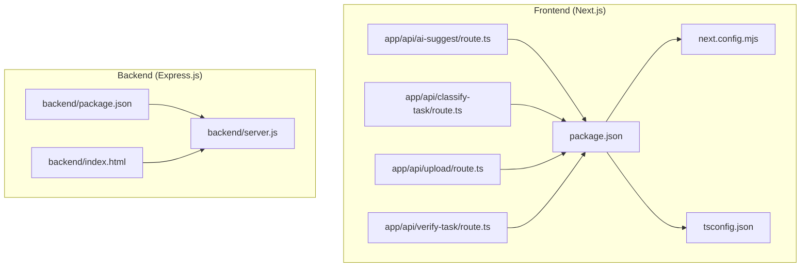
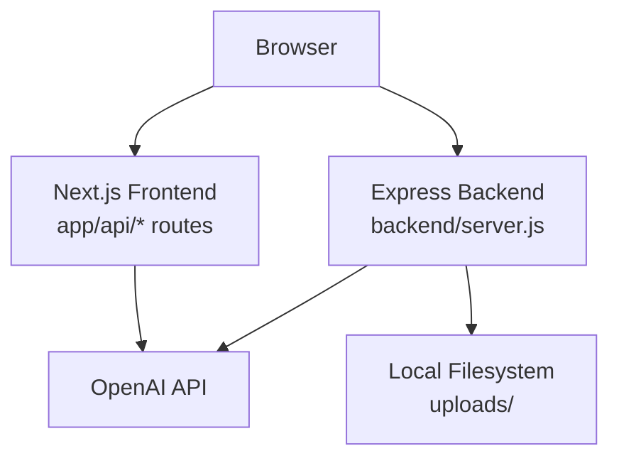
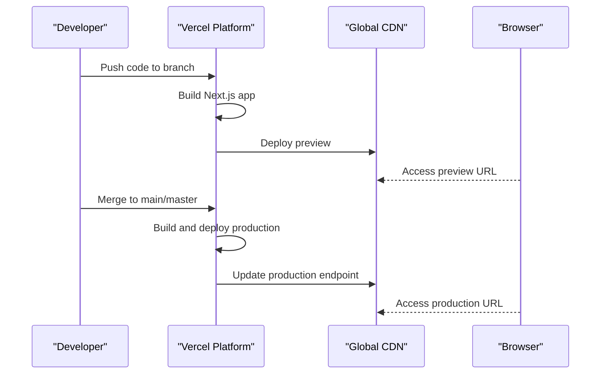
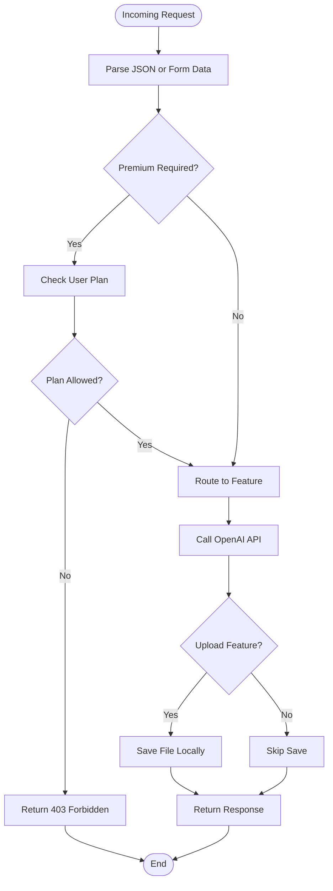
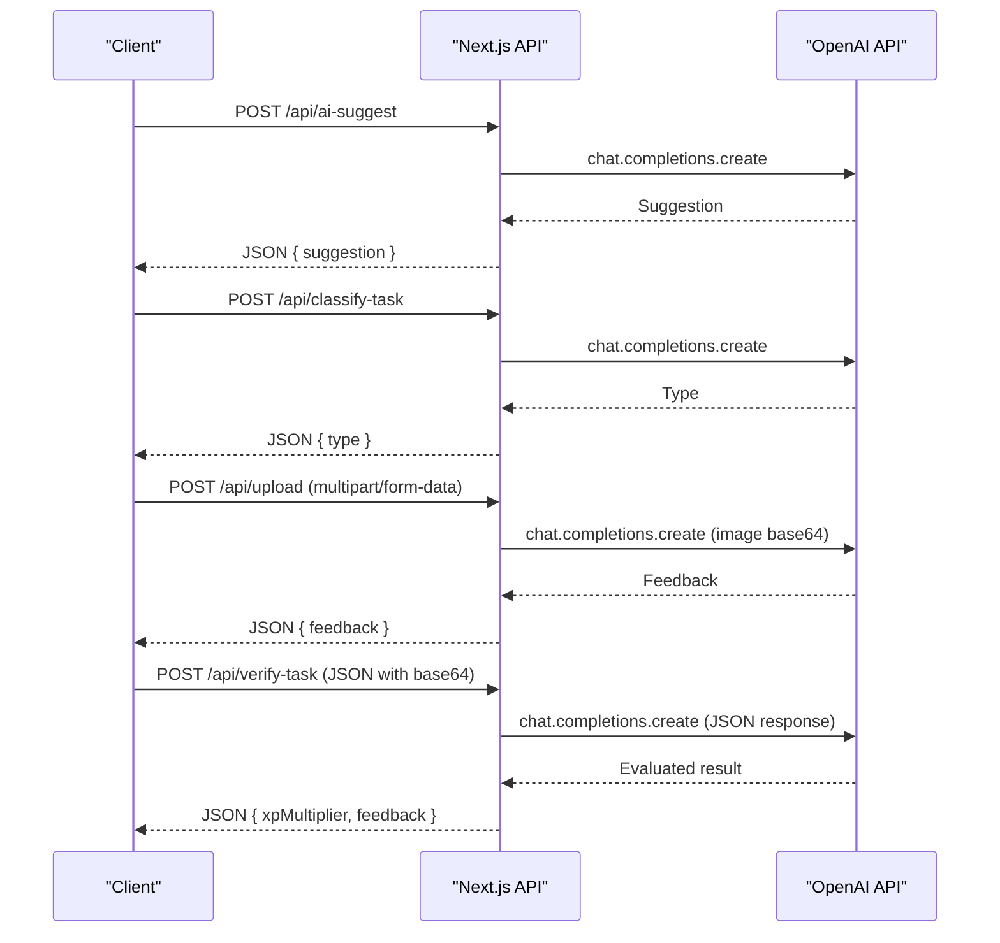
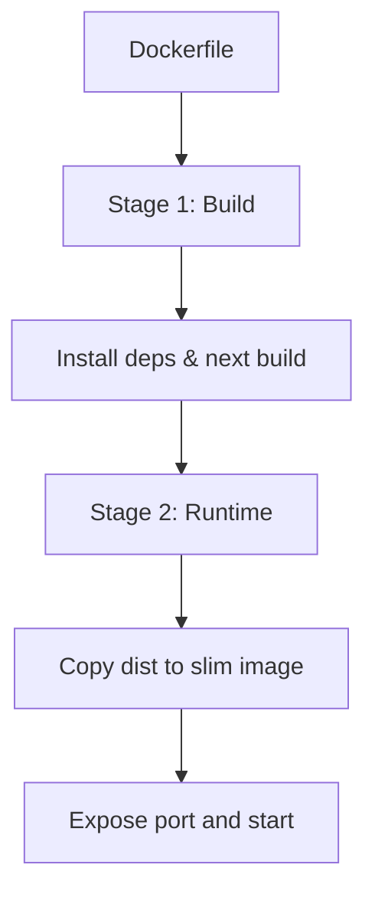
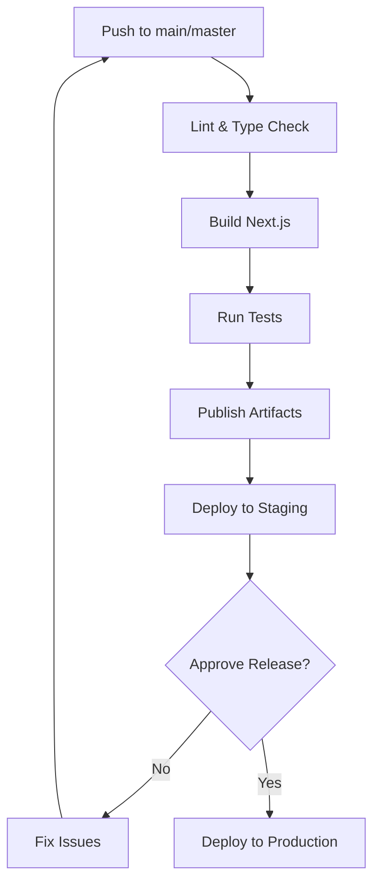
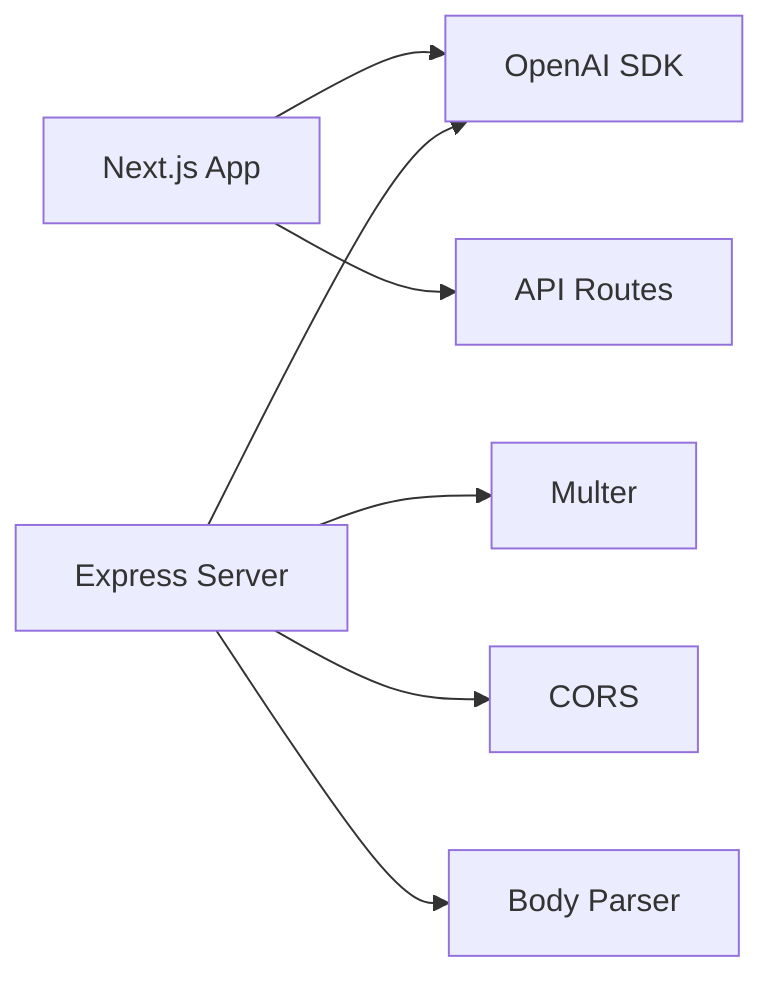

# Production Deployment

<cite>
**Referenced Files in This Document**
- [package.json](file://package.json)
- [next.config.mjs](file://next.config.mjs)
- [tsconfig.json](file://tsconfig.json)
- [backend/package.json](file://backend/package.json)
- [backend/server.js](file://backend/server.js)
- [backend/index.html](file://backend/index.html)
- [app/api/ai-suggest/route.ts](file://app/api/ai-suggest/route.ts)
- [app/api/classify-task/route.ts](file://app/api/classify-task/route.ts)
- [app/api/upload/route.ts](file://app/api/upload/route.ts)
- [app/api/verify-task/route.ts](file://app/api/verify-task/route.ts)
</cite>

## Table of Contents
1. [Introduction](#introduction)
2. [Project Structure](#project-structure)
3. [Core Components](#core-components)
4. [Architecture Overview](#architecture-overview)
5. [Detailed Component Analysis](#detailed-component-analysis)
6. [Dependency Analysis](#dependency-analysis)
7. [Performance Considerations](#performance-considerations)
8. [Troubleshooting Guide](#troubleshooting-guide)
9. [Conclusion](#conclusion)
10. [Appendices](#appendices)

## Introduction
This document provides production-grade deployment guidance for Solo Leveling Manager. It covers:
- Frontend deployment with Vercel for Next.js
- Backend deployment strategies for Express.js
- Containerization with Docker and orchestration with Kubernetes
- Cloud provider options (AWS, Google Cloud, Azure)
- CI/CD with GitHub Actions
- Load balancing, auto-scaling, and monitoring
- Security hardening and DDoS protection
- Rollback, blue-green deployments, and disaster recovery

## Project Structure
Solo Leveling Manager consists of:
- Next.js frontend under the repository root configured via Next.js config and TypeScript compiler options
- Express.js backend under the backend directory with a simple server and static HTML client
- API routes under app/api implementing AI-powered endpoints

**Diagram sources**
- [package.json:1-78](file://package.json#L1-L78)
- [next.config.mjs:1-15](file://next.config.mjs#L1-L15)
- [tsconfig.json:1-43](file://tsconfig.json#L1-L43)
- [backend/package.json:1-13](file://backend/package.json#L1-L13)
- [backend/server.js:1-155](file://backend/server.js#L1-L155)
- [backend/index.html:1-61](file://backend/index.html#L1-L61)
- [app/api/ai-suggest/route.ts:1-34](file://app/api/ai-suggest/route.ts#L1-L34)
- [app/api/classify-task/route.ts:1-43](file://app/api/classify-task/route.ts#L1-L43)
- [app/api/upload/route.ts:1-43](file://app/api/upload/route.ts#L1-L43)
- [app/api/verify-task/route.ts:1-55](file://app/api/verify-task/route.ts#L1-L55)

**Section sources**
- [package.json:1-78](file://package.json#L1-L78)
- [next.config.mjs:1-15](file://next.config.mjs#L1-L15)
- [tsconfig.json:1-43](file://tsconfig.json#L1-L43)
- [backend/package.json:1-13](file://backend/package.json#L1-L13)
- [backend/server.js:1-155](file://backend/server.js#L1-L155)
- [backend/index.html:1-61](file://backend/index.html#L1-L61)
- [app/api/ai-suggest/route.ts:1-34](file://app/api/ai-suggest/route.ts#L1-L34)
- [app/api/classify-task/route.ts:1-43](file://app/api/classify-task/route.ts#L1-L43)
- [app/api/upload/route.ts:1-43](file://app/api/upload/route.ts#L1-L43)
- [app/api/verify-task/route.ts:1-55](file://app/api/verify-task/route.ts#L1-L55)

## Core Components
- Next.js frontend
  - Build and runtime scripts defined in the root package.json
  - Next.js configuration for build-time and runtime behavior
  - TypeScript configuration for strictness and module resolution
- Express.js backend
  - Minimal server exposing REST endpoints for tasks, AI suggestions, uploads, and verification
  - Uses environment variables for OpenAI API key and local file uploads
- API routes
  - AI suggestion classification and verification powered by OpenAI
  - Image upload endpoint converts files to base64 and sends to OpenAI

Key production considerations:
- Environment variables for secrets (OpenAI API key)
- CORS enabled for development; restrict in production
- File uploads stored locally; scale with shared storage in production
- Mock fallbacks when API key is missing

**Section sources**
- [package.json:5-10](file://package.json#L5-L10)
- [next.config.mjs:3-12](file://next.config.mjs#L3-L12)
- [tsconfig.json:2-29](file://tsconfig.json#L2-L29)
- [backend/server.js:14-16](file://backend/server.js#L14-L16)
- [backend/server.js:8-9](file://backend/server.js#L8-L9)
- [backend/server.js:21-28](file://backend/server.js#L21-L28)
- [app/api/ai-suggest/route.ts:12-20](file://app/api/ai-suggest/route.ts#L12-L20)
- [app/api/classify-task/route.ts:12-18](file://app/api/classify-task/route.ts#L12-L18)
- [app/api/upload/route.ts:17-21](file://app/api/upload/route.ts#L17-L21)
- [app/api/verify-task/route.ts:16-22](file://app/api/verify-task/route.ts#L16-L22)

## Architecture Overview
The system comprises:
- Frontend Next.js application serving UI and API routes
- Backend Express server for premium features and static HTML client
- OpenAI integration for AI-driven features
- Local file uploads and in-memory data stores (replace for production)

**Diagram sources**
- [backend/server.js:14-16](file://backend/server.js#L14-L16)
- [backend/server.js:21-28](file://backend/server.js#L21-L28)
- [app/api/ai-suggest/route.ts:4-6](file://app/api/ai-suggest/route.ts#L4-L6)
- [app/api/classify-task/route.ts:4-6](file://app/api/classify-task/route.ts#L4-L6)
- [app/api/upload/route.ts:4-6](file://app/api/upload/route.ts#L4-L6)
- [app/api/verify-task/route.ts:4-6](file://app/api/verify-task/route.ts#L4-L6)

## Detailed Component Analysis

### Next.js Frontend Deployment (Vercel)
- Build and runtime
  - Use the root package.json scripts for build and start
  - Configure Next.js behavior via next.config.mjs
- Preview and production
  - Vercel automatically deploys branches for previews and main/master for production
  - Set environment variables for OpenAI API key in Vercel project settings
- Static exports and images
  - Images are unoptimized for static export; ensure proper asset handling in production
- Monitoring
  - Enable Vercel Analytics and performance monitoring

**Diagram sources**
- [package.json:6-9](file://package.json#L6-L9)
- [next.config.mjs:6-8](file://next.config.mjs#L6-L8)

**Section sources**
- [package.json:5-10](file://package.json#L5-L10)
- [next.config.mjs:3-12](file://next.config.mjs#L3-L12)

### Express.js Backend Deployment
- Runtime configuration
  - Use environment variables for OPENAI_API_KEY and port binding
  - CORS enabled globally; tighten in production
- Scaling
  - Run behind a reverse proxy/load balancer
  - Use process managers like PM2 for restarts and monitoring
- File uploads
  - Current implementation writes to local filesystem; replace with cloud storage for scale
- Premium checks
  - Middleware enforces premium-only features; ensure robust identity and plan validation in production

**Diagram sources**
- [backend/server.js:46-52](file://backend/server.js#L46-L52)
- [backend/server.js:111-135](file://backend/server.js#L111-L135)
- [backend/server.js:14-16](file://backend/server.js#L14-L16)

**Section sources**
- [backend/package.json:4-11](file://backend/package.json#L4-L11)
- [backend/server.js:8-9](file://backend/server.js#L8-L9)
- [backend/server.js:46-52](file://backend/server.js#L46-L52)
- [backend/server.js:111-135](file://backend/server.js#L111-L135)

### API Routes (Next.js App)
- AI suggestion
  - Returns mock suggestion if API key is missing; otherwise calls OpenAI
- Classification
  - Classifies tasks as written, physical, or none using OpenAI
- Upload
  - Converts uploaded file to base64 and sends to OpenAI
- Verification
  - Evaluates proof images and returns XP multiplier and feedback

**Diagram sources**
- [app/api/ai-suggest/route.ts:8-33](file://app/api/ai-suggest/route.ts#L8-L33)
- [app/api/classify-task/route.ts:8-42](file://app/api/classify-task/route.ts#L8-L42)
- [app/api/upload/route.ts:8-42](file://app/api/upload/route.ts#L8-L42)
- [app/api/verify-task/route.ts:8-54](file://app/api/verify-task/route.ts#L8-L54)

**Section sources**
- [app/api/ai-suggest/route.ts:8-33](file://app/api/ai-suggest/route.ts#L8-L33)
- [app/api/classify-task/route.ts:8-42](file://app/api/classify-task/route.ts#L8-L42)
- [app/api/upload/route.ts:8-42](file://app/api/upload/route.ts#L8-L42)
- [app/api/verify-task/route.ts:8-54](file://app/api/verify-task/route.ts#L8-L54)

### Containerization with Docker
- Multi-stage build
  - Stage 1: Build Next.js app with Node.js and install dependencies
  - Stage 2: Copy artifacts to minimal runtime image (e.g., Node slim)
- Image optimization
  - Use .dockerignore to exclude dev dependencies and build artifacts
  - Reduce layers and choose appropriate base image
- Orchestration with Kubernetes
  - Define Deployment, Service, ConfigMap, and Secret resources
  - Expose via Ingress with TLS termination
  - Scale replicas and configure readiness/liveness probes

[No sources needed since this diagram shows conceptual workflow, not actual code structure]

### Cloud Platform Deployment Options
- AWS
  - Host frontend on Amazon CloudFront/S3 origin for Next.js static export or use Elastic Beanstalk for SSR
  - Host backend on ECS/Fargate or EC2 with ALB; use RDS/Aurora for persistent data
  - Enable WAF/DDoS protection at the edge
- Google Cloud
  - Deploy frontend to Cloud Run or Artifact Registry with GKE for orchestration
  - Run backend on Cloud Run or GCE; use Cloud SQL for databases
  - Enable Cloud Armor and Cloud CDN
- Azure
  - Host frontend on Azure Static Web Apps or AKS
  - Run backend on App Service or AKS; use Azure Database for MySQL/PostgreSQL
  - Enable WAF and DDoS protection via Azure Front Door

[No sources needed since this section provides general guidance]

### CI/CD Pipeline with GitHub Actions
- Build and test
  - Run lint and type checks
  - Build Next.js app and run backend tests
- Release
  - Tag releases and publish container images to registry
  - Deploy to staging and promote to production after approvals
- Release management
  - Use semantic versioning and automated changelog generation

[No sources needed since this diagram shows conceptual workflow, not actual code structure]

## Dependency Analysis
- Frontend dependencies
  - Next.js, React, Radix UI, Tailwind, Three.js, OpenAI SDK
- Backend dependencies
  - Express, Multer, CORS, Body Parser, Dotenv, OpenAI
- Internal coupling
  - API routes depend on OpenAI SDK and environment variables
  - Backend server depends on environment variables and local uploads

**Diagram sources**
- [package.json:51-64](file://package.json#L51-L64)
- [backend/package.json:4-11](file://backend/package.json#L4-L11)
- [app/api/ai-suggest/route.ts:2-6](file://app/api/ai-suggest/route.ts#L2-L6)
- [app/api/classify-task/route.ts:2-6](file://app/api/classify-task/route.ts#L2-L6)
- [app/api/upload/route.ts:2-6](file://app/api/upload/route.ts#L2-L6)
- [app/api/verify-task/route.ts:2-6](file://app/api/verify-task/route.ts#L2-L6)

**Section sources**
- [package.json:11-64](file://package.json#L11-L64)
- [backend/package.json:4-11](file://backend/package.json#L4-L11)

## Performance Considerations
- Frontend
  - Enable static export and optimize images
  - Use ISR/SSG where possible; cache aggressively
- Backend
  - Use connection pooling and limit concurrent uploads
  - Cache OpenAI responses when appropriate
- Observability
  - Add tracing and metrics collection
  - Monitor latency and error rates

[No sources needed since this section provides general guidance]

## Troubleshooting Guide
- OpenAI API key issues
  - API routes fall back to mock responses when the key is missing or invalid
- CORS errors
  - Configure allowed origins and credentials appropriately
- Upload failures
  - Verify file size limits and MIME types; ensure storage permissions
- Environment variables
  - Confirm OPENAI_API_KEY is set in production

**Section sources**
- [app/api/ai-suggest/route.ts:12-20](file://app/api/ai-suggest/route.ts#L12-L20)
- [app/api/classify-task/route.ts:12-18](file://app/api/classify-task/route.ts#L12-L18)
- [app/api/upload/route.ts:13-15](file://app/api/upload/route.ts#L13-L15)
- [app/api/verify-task/route.ts:16-22](file://app/api/verify-task/route.ts#L16-L22)
- [backend/server.js:8-9](file://backend/server.js#L8-L9)

## Conclusion
Solo Leveling Manager can be deployed across multiple platforms with clear separation between the Next.js frontend and Express backend. Production readiness requires environment variable management, secure storage for uploads, robust monitoring, and scalable infrastructure. The included diagrams and sections provide a blueprint for Vercel, Docker/Kubernetes, and cloud provider deployments.

## Appendices
- Environment variables to define
  - OPENAI_API_KEY
  - PORT (backend)
  - NODE_ENV (production)
- Secrets management
  - Store secrets in platform-specific secret managers and mount as environment variables
- Blue-green deployment
  - Maintain two identical environments and switch traffic on successful validation
- Disaster recovery
  - Back up uploads and database snapshots; automate restore procedures

[No sources needed since this section provides general guidance]