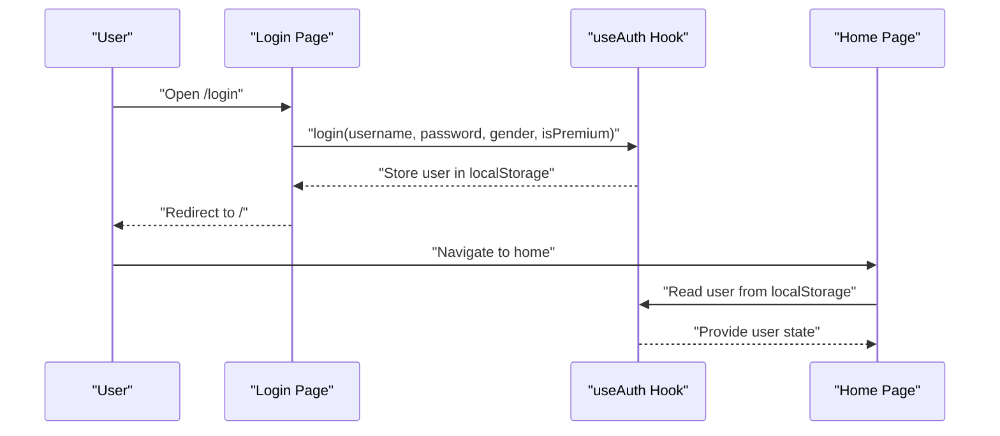
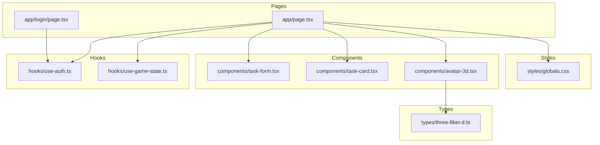

# Getting Started

<cite>
**Referenced Files in This Document**
- [package.json](file://package.json)
- [next.config.mjs](file://next.config.mjs)
- [tsconfig.json](file://tsconfig.json)
- [app/layout.tsx](file://app/layout.tsx)
- [app/page.tsx](file://app/page.tsx)
- [app/login/page.tsx](file://app/login/page.tsx)
- [hooks/use-auth.ts](file://hooks/use-auth.ts)
- [hooks/use-game-state.ts](file://hooks/use-game-state.ts)
- [lib/game-constants.ts](file://lib/game-constants.ts)
- [components/task-form.tsx](file://components/task-form.tsx)
- [components/task-card.tsx](file://components/task-card.tsx)
- [components/avatar-3d.tsx](file://components/avatar-3d.tsx)
- [types/three-fiber.d.ts](file://types/three-fiber.d.ts)
- [styles/globals.css](file://styles/globals.css)
</cite>

## Table of Contents
1. [Introduction](#introduction)
2. [Prerequisites](#prerequisites)
3. [Installation](#installation)
4. [Development Workflow](#development-workflow)
5. [Basic Usage](#basic-usage)
6. [Authentication and Onboarding](#authentication-and-onboarding)
7. [Architecture Overview](#architecture-overview)
8. [Troubleshooting](#troubleshooting)
9. [Verification Checklist](#verification-checklist)
10. [Conclusion](#conclusion)

## Introduction
Solo Leveling Manager is a gamified task management application built with Next.js 16.2.0, React 19, and TypeScript. It turns productivity into an RPG-style journey where you create quests (tasks), complete them to earn experience points (XP), level up, and unlock achievements and cosmetics. The app includes a 3D avatar viewer powered by React Three Fiber and Drei, and a polished UI using Tailwind CSS and Radix UI primitives.

## Prerequisites
Before installing and running Solo Leveling Manager, ensure your environment meets the following requirements:

- Node.js: Use a stable LTS version compatible with the project’s dependencies. The project relies on modern Node APIs and bundler features.
- Package manager: Install dependencies using pnpm as specified by the repository’s lock file and scripts.
- React and Next.js: The project targets Next.js 16.2.0 and React 19.2.4. Ensure your local environment aligns with these versions.
- TypeScript: The project uses TypeScript 5.7.3 with strict compiler options and JSX runtime configured for Next.js.
- 3D graphics concepts: Familiarity with 3D scenes, lighting, materials, and basic WebGL concepts helps when customizing the avatar experience.
- Browser support: Modern browsers with WebGL enabled are required for the 3D avatar viewer.

These requirements are reflected in the project’s dependency and configuration files.

**Section sources**
- [package.json:11-64](file://package.json#L11-L64)
- [package.json:51-56](file://package.json#L51-L56)
- [tsconfig.json:1-43](file://tsconfig.json#L1-L43)
- [next.config.mjs:1-15](file://next.config.mjs#L1-L15)

## Installation
Follow these steps to install and configure the project locally:

1. Clone the repository and navigate to the project directory.
2. Install dependencies using pnpm:
   - Run: pnpm install
   - The project uses pnpm lock and defines scripts for dev, build, start, and lint.
3. Verify TypeScript configuration:
   - The tsconfig.json sets strict mode, JSX runtime for Next.js, and module resolution via bundler.
4. Configure environment variables:
   - The layout reads NEXT_PUBLIC_SITE_NAME and NEXT_PUBLIC_APP_URL for metadata and canonical URLs.
   - Define these environment variables in your local environment to match your deployment context.
5. Optional: Set up OpenAI integration (if you plan to use AI suggestions):
   - The frontend calls /api/ai-suggest. Ensure your backend supports this endpoint or mock it during local development.

After installation, the project is ready for development.

**Section sources**
- [package.json:5-10](file://package.json#L5-L10)
- [tsconfig.json:11-18](file://tsconfig.json#L11-L18)
- [app/layout.tsx:10-31](file://app/layout.tsx#L10-L31)

## Development Workflow
Start the development server and begin building:

1. Start the Next.js dev server:
   - Run: pnpm dev
   - The default port is 3000. If you need to change it, set the NEXT_PORT environment variable before starting the dev server.
2. Hot reload:
   - Changes to components, pages, and hooks trigger automatic hot reload in the browser.
3. Build for production:
   - Run: pnpm build
   - Start the production server: pnpm start
4. Linting:
   - Run: pnpm lint

Port configuration:
- The dev server listens on port 3000 by default. Override with NEXT_PORT if needed.

**Section sources**
- [package.json:5-10](file://package.json#L5-L10)
- [next.config.mjs:9-11](file://next.config.mjs#L9-L11)

## Basic Usage
Once the app loads, you will be prompted to log in. After logging in, you can manage your quests and track XP progression.

- Create a quest:
  - Use the “Create New Quest” form to add tasks with title, description, duration (minutes), and difficulty rank.
  - Difficulty affects XP multiplier. Higher ranks yield more XP.
- Manage active and completed quests:
  - Complete a quest to earn XP. Completing a quest triggers XP calculations and potential level-ups and achievements.
  - Delete a quest if needed.
- View XP and progression:
  - Stats panel shows total XP, level, completed tasks, and current streak.
  - A spider chart visualizes your progress metrics.
- Navigate the gamified interface:
  - The home page displays your quests, stats, and cosmetic shop.
  - Use the “Ask System (AI)” button to receive suggestions based on your current progress.

These behaviors are implemented by the game state hook and UI components.

**Section sources**
- [app/page.tsx:17-255](file://app/page.tsx#L17-L255)
- [components/task-form.tsx:18-191](file://components/task-form.tsx#L18-L191)
- [components/task-card.tsx:17-185](file://components/task-card.tsx#L17-L185)
- [hooks/use-game-state.ts:51-252](file://hooks/use-game-state.ts#L51-L252)
- [lib/game-constants.ts:1-95](file://lib/game-constants.ts#L1-L95)

## Authentication and Onboarding
The app simulates a persistent user session using localStorage. New users choose a gender and can opt into premium status during registration.

- Onboarding flow:
  - The login page presents two modes: “Create Account” and “Login.”
  - Creating an account requires a username and password. Gender selection is optional for new users.
  - Logging in validates credentials against stored values.
- Session persistence:
  - User data is stored in localStorage under a specific key. The auth hook hydrates the session on app load.
- Logout:
  - Logging out clears the session and redirects to the login page.

**Diagram sources**
- [app/login/page.tsx:8-305](file://app/login/page.tsx#L8-L305)
- [hooks/use-auth.ts:14-122](file://hooks/use-auth.ts#L14-L122)
- [app/page.tsx:22-66](file://app/page.tsx#L22-L66)

**Section sources**
- [app/login/page.tsx:8-305](file://app/login/page.tsx#L8-L305)
- [hooks/use-auth.ts:14-122](file://hooks/use-auth.ts#L14-L122)

## Architecture Overview
The application follows a modular structure with clear separation of concerns:

- Pages:
  - app/page.tsx renders the main dashboard and orchestrates game state and auth.
  - app/login/page.tsx handles user onboarding and authentication.
- Hooks:
  - hooks/use-auth.ts manages user session and profile updates.
  - hooks/use-game-state.ts encapsulates quest lifecycle, XP calculation, and achievements.
- UI Components:
  - components/task-form.tsx and components/task-card.tsx provide task creation and management.
  - components/avatar-3d.tsx renders a 3D avatar using React Three Fiber and Drei.
- Styling:
  - styles/globals.css configures Tailwind and theme tokens.
- Types:
  - types/three-fiber.d.ts augments JSX for React Three Fiber elements.

**Diagram sources**
- [app/page.tsx:1-255](file://app/page.tsx#L1-L255)
- [app/login/page.tsx:1-305](file://app/login/page.tsx#L1-L305)
- [hooks/use-auth.ts:1-122](file://hooks/use-auth.ts#L1-L122)
- [hooks/use-game-state.ts:1-252](file://hooks/use-game-state.ts#L1-L252)
- [components/task-form.tsx:1-191](file://components/task-form.tsx#L1-L191)
- [components/task-card.tsx:1-185](file://components/task-card.tsx#L1-L185)
- [components/avatar-3d.tsx:1-529](file://components/avatar-3d.tsx#L1-L529)
- [styles/globals.css:1-126](file://styles/globals.css#L1-L126)
- [types/three-fiber.d.ts:1-8](file://types/three-fiber.d.ts#L1-L8)

## Troubleshooting
Common setup and runtime issues:

- Port conflicts:
  - If port 3000 is in use, set NEXT_PORT to another value before running the dev server.
- TypeScript errors:
  - Ensure your editor is using the project’s tsconfig.json. Strict mode and bundler module resolution are enabled.
- 3D avatar rendering issues:
  - The avatar viewer depends on WebGL. If models fail to load, the component falls back to a procedural avatar. Verify model URLs and network connectivity.
- Missing environment variables:
  - The layout expects NEXT_PUBLIC_SITE_NAME and NEXT_PUBLIC_APP_URL. Define them to avoid unexpected metadata or canonical URL behavior.
- AI suggestion endpoint:
  - The frontend calls /api/ai-suggest. If unavailable, the UI disables the button and shows an error toast.

**Section sources**
- [next.config.mjs:9-11](file://next.config.mjs#L9-L11)
- [tsconfig.json:11-18](file://tsconfig.json#L11-L18)
- [app/layout.tsx:10-31](file://app/layout.tsx#L10-L31)
- [app/page.tsx:25-54](file://app/page.tsx#L25-L54)
- [components/avatar-3d.tsx:382-440](file://components/avatar-3d.tsx#L382-L440)

## Verification Checklist
Confirm a successful installation and basic functionality:

- Start the dev server and open http://localhost:3000.
- Log in:
  - Use the login page to create an account or log in with existing credentials.
- Create a task:
  - Open the task form and submit a new quest with a title and duration.
  - A success toast confirms the task was added.
- Award XP and verify progression:
  - Complete the newly created task via the task card.
  - Confirm XP is awarded, level-up notifications appear when applicable, and achievements unlock as conditions are met.
- 3D avatar:
  - Navigate to the avatar creator page and verify the 3D model renders. If a custom model fails to load, the fallback avatar should still appear.

**Section sources**
- [app/login/page.tsx:24-66](file://app/login/page.tsx#L24-L66)
- [components/task-form.tsx:25-51](file://components/task-form.tsx#L25-L51)
- [components/task-card.tsx:28-42](file://components/task-card.tsx#L28-L42)
- [hooks/use-game-state.ts:143-210](file://hooks/use-game-state.ts#L143-L210)
- [components/avatar-3d.tsx:473-512](file://components/avatar-3d.tsx#L473-L512)

## Conclusion
You are now ready to use Solo Leveling Manager. Create quests, track XP, level up, and personalize your avatar. For advanced customization, explore the 3D avatar system and integrate AI suggestions by implementing the backend endpoints referenced by the frontend. If you encounter environment-specific issues, refer to the troubleshooting section and ensure your Node.js, pnpm, and browser versions meet the project’s requirements.