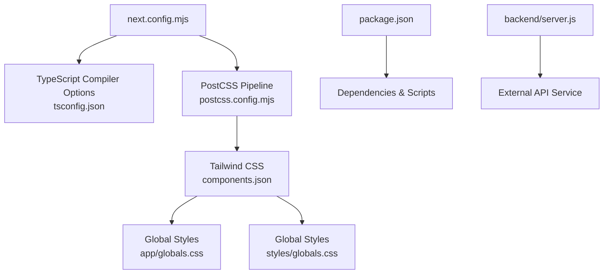
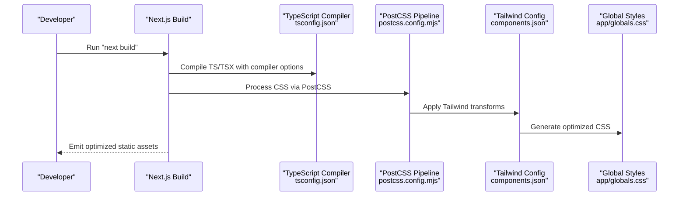
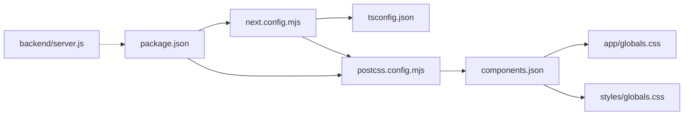

# Build Configuration and Bundle Optimization

<cite>
**Referenced Files in This Document**
- [next.config.mjs](file://next.config.mjs)
- [tsconfig.json](file://tsconfig.json)
- [package.json](file://package.json)
- [postcss.config.mjs](file://postcss.config.mjs)
- [components.json](file://components.json)
- [next-env.d.ts](file://next-env.d.ts)
- [styles/globals.css](file://styles/globals.css)
- [app/globals.css](file://app/globals.css)
- [backend/server.js](file://backend/server.js)
</cite>

## Table of Contents
1. [Introduction](#introduction)
2. [Project Structure](#project-structure)
3. [Core Components](#core-components)
4. [Architecture Overview](#architecture-overview)
5. [Detailed Component Analysis](#detailed-component-analysis)
6. [Dependency Analysis](#dependency-analysis)
7. [Performance Considerations](#performance-considerations)
8. [Troubleshooting Guide](#troubleshooting-guide)
9. [Conclusion](#conclusion)

## Introduction
This document explains the Next.js build configuration and bundle optimization strategies for the project. It covers the current Next.js configuration (TypeScript settings, image optimization, logging), how the build pipeline leverages PostCSS/Tailwind, and practical approaches to reduce bundle size and improve build performance. It also outlines environment-specific configurations and deployment optimization strategies grounded in the repository’s configuration files.

## Project Structure
The project follows a modern Next.js App Router setup with:
- Application pages under app/
- Shared UI components under components/
- Global styles under app/globals.css and styles/globals.css
- Build configuration in next.config.mjs, tsconfig.json, postcss.config.mjs, and components.json
- Backend service under backend/ for API endpoints unrelated to client-side bundling

**Diagram sources**
- [next.config.mjs:1-15](file://next.config.mjs#L1-L15)
- [tsconfig.json:1-43](file://tsconfig.json#L1-L43)
- [postcss.config.mjs:1-9](file://postcss.config.mjs#L1-L9)
- [components.json:1-22](file://components.json#L1-L22)
- [app/globals.css:1-594](file://app/globals.css#L1-L594)
- [styles/globals.css:1-126](file://styles/globals.css#L1-L126)
- [package.json:1-78](file://package.json#L1-L78)
- [backend/server.js:1-155](file://backend/server.js#L1-L155)

**Section sources**
- [next.config.mjs:1-15](file://next.config.mjs#L1-L15)
- [tsconfig.json:1-43](file://tsconfig.json#L1-L43)
- [postcss.config.mjs:1-9](file://postcss.config.mjs#L1-L9)
- [components.json:1-22](file://components.json#L1-L22)
- [app/globals.css:1-594](file://app/globals.css#L1-L594)
- [styles/globals.css:1-126](file://styles/globals.css#L1-L126)
- [package.json:1-78](file://package.json#L1-L78)
- [backend/server.js:1-155](file://backend/server.js#L1-L155)

## Core Components
- Next.js configuration: TypeScript settings, image optimization, and logging behavior are centralized here.
- TypeScript configuration: Compiler options, module resolution, and incremental builds.
- PostCSS/Tailwind pipeline: CSS processing and component library configuration.
- Global styles: Tailwind-based design tokens and animations.
- Dependencies and scripts: Build commands and third-party libraries impacting bundle size.

Key observations:
- TypeScript type checking is configured to ignore build errors during production builds.
- Image optimization is disabled via unoptimized mode.
- Browser logs are forwarded to the terminal for easier debugging.
- Tailwind is integrated via PostCSS and configured through components.json.
- The project uses React 19 and Next 16 with esnext module resolution and bundler module resolution.

**Section sources**
- [next.config.mjs:1-15](file://next.config.mjs#L1-L15)
- [tsconfig.json:1-43](file://tsconfig.json#L1-L43)
- [postcss.config.mjs:1-9](file://postcss.config.mjs#L1-L9)
- [components.json:1-22](file://components.json#L1-L22)
- [package.json:1-78](file://package.json#L1-L78)

## Architecture Overview
The build pipeline integrates configuration files to produce optimized client bundles and assets.

**Diagram sources**
- [next.config.mjs:1-15](file://next.config.mjs#L1-L15)
- [tsconfig.json:1-43](file://tsconfig.json#L1-L43)
- [postcss.config.mjs:1-9](file://postcss.config.mjs#L1-L9)
- [components.json:1-22](file://components.json#L1-L22)
- [app/globals.css:1-594](file://app/globals.css#L1-L594)

## Detailed Component Analysis

### Next.js Configuration (next.config.mjs)
Current settings:
- TypeScript: Build errors are ignored during production builds.
- Images: Unoptimized mode is enabled (external optimization recommended for production).
- Logging: Browser logs are forwarded to the terminal.

Optimization implications:
- Ignoring TypeScript build errors can mask issues; consider enabling strictness and failing on errors for production.
- Disabling image optimization defers optimization to CDNs or external services; ensure proper CDN configuration if images are served externally.

Practical adjustments:
- Enable image optimization with allowed domains and formats for production.
- Consider enabling type checking failures in CI to prevent broken builds.

**Section sources**
- [next.config.mjs:1-15](file://next.config.mjs#L1-L15)

### TypeScript Configuration (tsconfig.json)
Compiler options and impact:
- Target ES6 and module resolution set to bundler for compatibility with Next.js.
- Strict mode enabled with no emit, relying on Next’s build pipeline.
- Incremental compilation enabled to speed up repeated builds.
- Path aliases configured for clean imports.

Optimization implications:
- Using bundler module resolution helps with tree shaking and smaller bundles.
- Incremental builds reduce rebuild times in development.
- Strict mode improves type safety but does not increase bundle size.

Recommendations:
- Keep strict mode enabled.
- Consider enabling isolatedModules for faster linting and IDE responsiveness.

**Section sources**
- [tsconfig.json:1-43](file://tsconfig.json#L1-L43)

### PostCSS and Tailwind Pipeline (postcss.config.mjs, components.json)
- PostCSS loads Tailwind plugin via @tailwindcss/postcss.
- Tailwind is configured through components.json with RSC support, TSX, and custom aliases.
- Global styles define design tokens, animations, and responsive behaviors.

Optimization implications:
- Tailwind purges unused CSS in production automatically.
- Using design tokens reduces duplication and keeps styles maintainable.
- Aliases simplify imports and help with code splitting.

**Section sources**
- [postcss.config.mjs:1-9](file://postcss.config.mjs#L1-L9)
- [components.json:1-22](file://components.json#L1-L22)
- [app/globals.css:1-594](file://app/globals.css#L1-L594)
- [styles/globals.css:1-126](file://styles/globals.css#L1-L126)

### Global Styles and Animations
- Design tokens are defined in CSS variables and theme blocks.
- Extensive animations and effects are included; consider scoping heavy animations to specific routes to minimize initial bundle cost.
- Responsive adjustments and performance-conscious defaults (e.g., disabling heavy animations on small screens).

Recommendations:
- Split animations into route-level CSS to leverage code splitting.
- Use lazy loading for components that trigger heavy animations.

**Section sources**
- [app/globals.css:1-594](file://app/globals.css#L1-L594)
- [styles/globals.css:1-126](file://styles/globals.css#L1-L126)

### Dependencies and Scripts (package.json)
- Core stack includes Next.js, React 19, Tailwind, Radix UI primitives, Three.js ecosystem, and analytics.
- Scripts include dev, build, start, and lint commands.

Optimization implications:
- Large libraries like Three.js and Recharts can significantly impact bundle size.
- Analytics libraries add lightweight overhead but should be evaluated for privacy and performance.

Recommendations:
- Audit dependencies regularly and remove unused packages.
- Prefer tree-shakeable libraries and use dynamic imports for heavy features.

**Section sources**
- [package.json:1-78](file://package.json#L1-L78)

### Backend Service (backend/server.js)
- Separate Express server handles AI suggestions and image uploads.
- Not part of the Next.js client build but relevant for deployment strategy.

Recommendations:
- Deploy backend independently or alongside the frontend using platform-native deployment options.
- Ensure environment variables are properly managed and secrets are not exposed.

**Section sources**
- [backend/server.js:1-155](file://backend/server.js#L1-L155)

## Dependency Analysis
This section maps how configuration files influence the build and runtime behavior.

**Diagram sources**
- [next.config.mjs:1-15](file://next.config.mjs#L1-L15)
- [tsconfig.json:1-43](file://tsconfig.json#L1-L43)
- [postcss.config.mjs:1-9](file://postcss.config.mjs#L1-L9)
- [components.json:1-22](file://components.json#L1-L22)
- [app/globals.css:1-594](file://app/globals.css#L1-L594)
- [styles/globals.css:1-126](file://styles/globals.css#L1-L126)
- [package.json:1-78](file://package.json#L1-L78)
- [backend/server.js:1-155](file://backend/server.js#L1-L155)

**Section sources**
- [next.config.mjs:1-15](file://next.config.mjs#L1-L15)
- [tsconfig.json:1-43](file://tsconfig.json#L1-L43)
- [postcss.config.mjs:1-9](file://postcss.config.mjs#L1-L9)
- [components.json:1-22](file://components.json#L1-L22)
- [app/globals.css:1-594](file://app/globals.css#L1-L594)
- [styles/globals.css:1-126](file://styles/globals.css#L1-L126)
- [package.json:1-78](file://package.json#L1-L78)
- [backend/server.js:1-155](file://backend/server.js#L1-L155)

## Performance Considerations
- Code splitting and dynamic imports
  - Use dynamic imports for heavy components (e.g., 3D scenes, charts) to defer loading until needed.
  - Split route-level code to reduce initial bundle size.
- Dependency management
  - Audit and prune unused dependencies.
  - Prefer lighter alternatives for heavy libraries (e.g., consider simpler charting solutions).
- TypeScript compilation
  - Keep strict mode and incremental builds enabled.
  - Avoid emitting during development; rely on Next’s pipeline.
- Asset optimization
  - Enable image optimization with allowed domains and formats.
  - Use CSS minification and Tailwind’s purge in production.
- Build performance tuning
  - Leverage incremental builds and fast module resolution.
  - Monitor build times and profile bottlenecks using Next.js telemetry.

[No sources needed since this section provides general guidance]

## Troubleshooting Guide
Common areas to inspect:
- TypeScript build errors: Review tsconfig.json for strictness and module resolution settings.
- Image optimization issues: Verify next.config.mjs image settings and CDN configuration.
- CSS not applying: Confirm Tailwind plugin is loaded in postcss.config.mjs and components.json is configured correctly.
- Excessive bundle size: Audit dependencies in package.json and split large components with dynamic imports.

**Section sources**
- [tsconfig.json:1-43](file://tsconfig.json#L1-L43)
- [next.config.mjs:1-15](file://next.config.mjs#L1-L15)
- [postcss.config.mjs:1-9](file://postcss.config.mjs#L1-L9)
- [components.json:1-22](file://components.json#L1-L22)
- [package.json:1-78](file://package.json#L1-L78)

## Conclusion
The project’s build configuration centers around Next.js with Tailwind CSS and a modern TypeScript setup. Current settings disable image optimization and ignore TypeScript build errors, which can be adjusted for stricter and more optimized production builds. By combining dynamic imports, dependency pruning, and Tailwind’s purge, the team can significantly reduce bundle size while maintaining a robust developer experience. Environment-specific configurations and backend separation further support scalable deployments.

[No sources needed since this section summarizes without analyzing specific files]