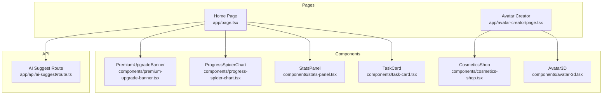
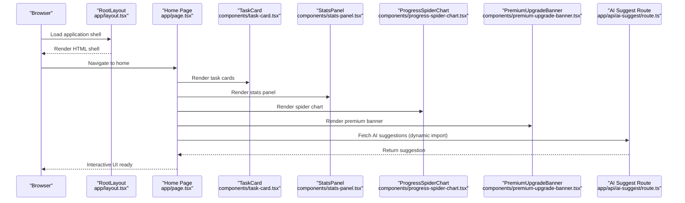
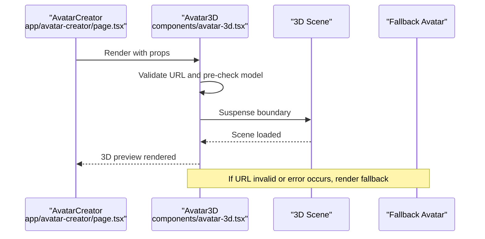
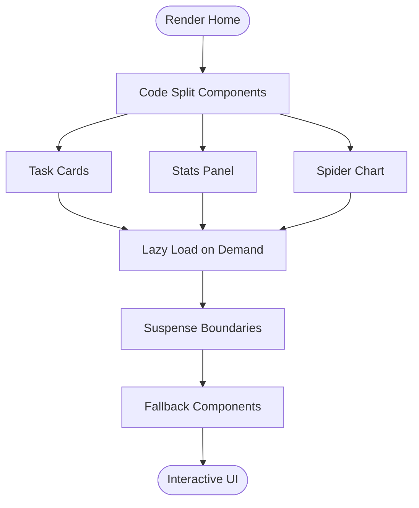
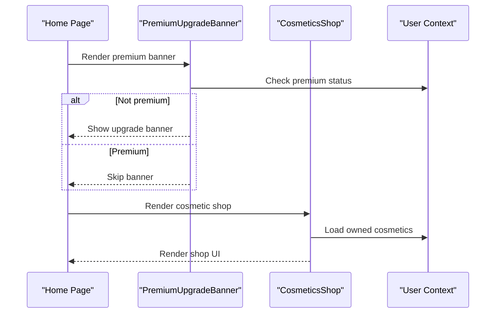
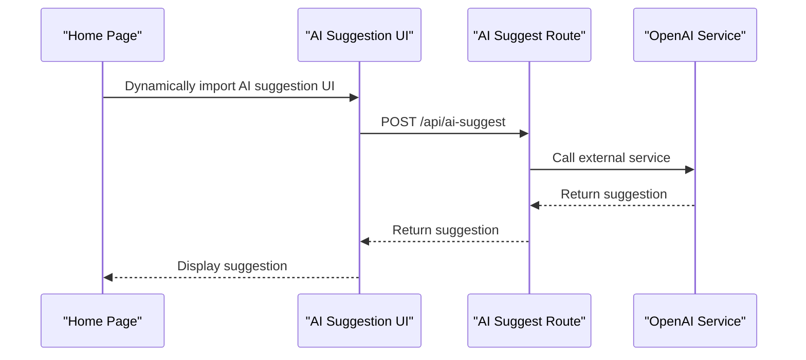
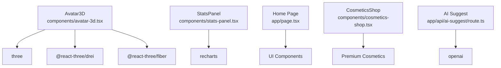

# Lazy Loading and Dynamic Imports

<cite>
**Referenced Files in This Document**
- [app/page.tsx](file://app/page.tsx)
- [app/layout.tsx](file://app/layout.tsx)
- [app/avatar-creator/page.tsx](file://app/avatar-creator/page.tsx)
- [components/avatar-3d.tsx](file://components/avatar-3d.tsx)
- [components/task-card.tsx](file://components/task-card.tsx)
- [components/stats-panel.tsx](file://components/stats-panel.tsx)
- [components/progress-spider-chart.tsx](file://components/progress-spider-chart.tsx)
- [components/cosmetics-shop.tsx](file://components/cosmetics-shop.tsx)
- [components/premium-upgrade-banner.tsx](file://components/premium-upgrade-banner.tsx)
- [app/api/ai-suggest/route.ts](file://app/api/ai-suggest/route.ts)
- [lib/premium-cosmetics.ts](file://lib/premium-cosmetics.ts)
- [next.config.mjs](file://next.config.mjs)
- [package.json](file://package.json)
</cite>

## Table of Contents
1. [Introduction](#introduction)
2. [Project Structure](#project-structure)
3. [Core Components](#core-components)
4. [Architecture Overview](#architecture-overview)
5. [Detailed Component Analysis](#detailed-component-analysis)
6. [Dependency Analysis](#dependency-analysis)
7. [Performance Considerations](#performance-considerations)
8. [Troubleshooting Guide](#troubleshooting-guide)
9. [Conclusion](#conclusion)

## Introduction
This document explains the current lazy loading and dynamic import strategies in the project, focusing on React.lazy usage for 3D components, heavy UI elements, and premium features. It also covers code splitting techniques for task cards, statistics panels, and avatar creators, along with dynamic imports for AI integration modules, premium cosmetic components, and 3D graphics libraries. The guide details suspense boundaries, loading states, and fallback components, and provides performance impact analysis, user experience considerations, and optimization strategies tailored to different component types.

## Project Structure
The application follows a Next.js app directory structure with client-side components, server routes, and shared UI elements. Key areas relevant to lazy loading include:
- Client-side pages and components that render heavy UI elements
- 3D avatar rendering via Three.js and Drei
- Statistics and charts using Recharts
- Premium cosmetic shop and upgrade banners
- AI integration endpoints

**Diagram sources**
- [app/page.tsx:1-384](file://app/page.tsx#L1-384)
- [app/avatar-creator/page.tsx:1-571](file://app/avatar-creator/page.tsx#L1-571)
- [components/task-card.tsx:1-186](file://components/task-card.tsx#L1-186)
- [components/stats-panel.tsx:1-145](file://components/stats-panel.tsx#L1-145)
- [components/progress-spider-chart.tsx:1-218](file://components/progress-spider-chart.tsx#L1-218)
- [components/avatar-3d.tsx:1-1361](file://components/avatar-3d.tsx#L1-1361)
- [components/cosmetics-shop.tsx:1-178](file://components/cosmetics-shop.tsx#L1-178)
- [components/premium-upgrade-banner.tsx:1-89](file://components/premium-upgrade-banner.tsx#L1-89)
- [app/api/ai-suggest/route.ts:1-34](file://app/api/ai-suggest/route.ts#L1-34)

**Section sources**
- [app/page.tsx:1-384](file://app/page.tsx#L1-384)
- [app/avatar-creator/page.tsx:1-571](file://app/avatar-creator/page.tsx#L1-571)

## Core Components
This section outlines the primary components that benefit from lazy loading and dynamic imports, and how they are currently structured.

- Home page orchestrates multiple UI sections and heavy components.
- Avatar creator integrates 3D rendering and customization panels.
- Task card, stats panel, spider chart, and premium banner are heavy UI components suitable for code splitting.
- AI integration is handled via a server route, enabling dynamic import of client-side AI suggestion UI.

**Section sources**
- [app/page.tsx:1-384](file://app/page.tsx#L1-384)
- [app/avatar-creator/page.tsx:1-571](file://app/avatar-creator/page.tsx#L1-571)
- [components/task-card.tsx:1-186](file://components/task-card.tsx#L1-186)
- [components/stats-panel.tsx:1-145](file://components/stats-panel.tsx#L1-145)
- [components/progress-spider-chart.tsx:1-218](file://components/progress-spider-chart.tsx#L1-218)
- [components/premium-upgrade-banner.tsx:1-89](file://components/premium-upgrade-banner.tsx#L1-89)
- [app/api/ai-suggest/route.ts:1-34](file://app/api/ai-suggest/route.ts#L1-34)

## Architecture Overview
The current architecture does not use React.lazy for client components. Instead, it leverages:
- Suspense boundaries around 3D scenes and animations
- Dynamic imports for client-side AI suggestion UI
- Code splitting via Next.js automatic chunking for route-based splits

**Diagram sources**
- [app/layout.tsx:33-47](file://app/layout.tsx#L33-47)
- [app/page.tsx:24-382](file://app/page.tsx#L24-382)
- [components/task-card.tsx:18-184](file://components/task-card.tsx#L18-184)
- [components/stats-panel.tsx:13-143](file://components/stats-panel.tsx#L13-143)
- [components/progress-spider-chart.tsx:14-215](file://components/progress-spider-chart.tsx#L14-215)
- [components/premium-upgrade-banner.tsx:7-87](file://components/premium-upgrade-banner.tsx#L7-87)
- [app/api/ai-suggest/route.ts:8-32](file://app/api/ai-suggest/route.ts#L8-32)

## Detailed Component Analysis

### 3D Avatar Rendering with Suspense
The 3D avatar component uses Suspense to manage asynchronous scene loading and error boundaries for graceful fallbacks.

**Diagram sources**
- [app/avatar-creator/page.tsx:252-285](file://app/avatar-creator/page.tsx#L252-285)
- [components/avatar-3d.tsx:1211-1266](file://components/avatar-3d.tsx#L1211-1266)

**Section sources**
- [app/avatar-creator/page.tsx:252-285](file://app/avatar-creator/page.tsx#L252-285)
- [components/avatar-3d.tsx:1211-1266](file://components/avatar-3d.tsx#L1211-1266)

### Task Cards and Heavy UI Elements
Task cards and statistics panels are heavy components that benefit from code splitting and lazy loading to improve initial page load performance.

**Diagram sources**
- [app/page.tsx:284-370](file://app/page.tsx#L284-370)
- [components/task-card.tsx:18-184](file://components/task-card.tsx#L18-184)
- [components/stats-panel.tsx:13-143](file://components/stats-panel.tsx#L13-143)
- [components/progress-spider-chart.tsx:14-215](file://components/progress-spider-chart.tsx#L14-215)

**Section sources**
- [app/page.tsx:284-370](file://app/page.tsx#L284-370)
- [components/task-card.tsx:18-184](file://components/task-card.tsx#L18-184)
- [components/stats-panel.tsx:13-143](file://components/stats-panel.tsx#L13-143)
- [components/progress-spider-chart.tsx:14-215](file://components/progress-spider-chart.tsx#L14-215)

### Premium Cosmetic Shop and Upgrade Banner
The premium cosmetic shop and upgrade banner are premium features that can be lazy-loaded to reduce initial bundle size.

**Diagram sources**
- [components/premium-upgrade-banner.tsx:7-87](file://components/premium-upgrade-banner.tsx#L7-87)
- [components/cosmetics-shop.tsx:7-177](file://components/cosmetics-shop.tsx#L7-177)
- [lib/premium-cosmetics.ts:12-77](file://lib/premium-cosmetics.ts#L12-77)

**Section sources**
- [components/premium-upgrade-banner.tsx:7-87](file://components/premium-upgrade-banner.tsx#L7-87)
- [components/cosmetics-shop.tsx:7-177](file://components/cosmetics-shop.tsx#L7-177)
- [lib/premium-cosmetics.ts:12-77](file://lib/premium-cosmetics.ts#L12-77)

### AI Integration Module
The AI suggestion feature uses a server route for backend processing. Client-side UI can be dynamically imported to optimize initial load.

**Diagram sources**
- [app/page.tsx:40-73](file://app/page.tsx#L40-73)
- [app/api/ai-suggest/route.ts:8-32](file://app/api/ai-suggest/route.ts#L8-32)

**Section sources**
- [app/page.tsx:40-73](file://app/page.tsx#L40-73)
- [app/api/ai-suggest/route.ts:8-32](file://app/api/ai-suggest/route.ts#L8-32)

## Dependency Analysis
External dependencies relevant to lazy loading and dynamic imports include:
- 3D graphics and animation libraries for Avatar3D
- Charting library for statistics panels
- UI component libraries for common elements

**Diagram sources**
- [components/avatar-3d.tsx:3-7](file://components/avatar-3d.tsx#L3-7)
- [components/stats-panel.tsx](file://components/stats-panel.tsx#L3)
- [app/page.tsx](file://app/page.tsx#L3)
- [components/cosmetics-shop.tsx](file://components/cosmetics-shop.tsx#L3)
- [app/api/ai-suggest/route.ts](file://app/api/ai-suggest/route.ts#L2)
- [package.json:40-64](file://package.json#L40-64)

**Section sources**
- [package.json:40-64](file://package.json#L40-64)
- [components/avatar-3d.tsx:3-7](file://components/avatar-3d.tsx#L3-7)
- [components/stats-panel.tsx](file://components/stats-panel.tsx#L3)
- [components/cosmetics-shop.tsx](file://components/cosmetics-shop.tsx#L3)
- [app/api/ai-suggest/route.ts](file://app/api/ai-suggest/route.ts#L2)

## Performance Considerations
- Initial bundle size: Heavy components like Avatar3D, Recharts, and premium features increase initial payload.
- Code splitting: Automatic route-based splitting reduces initial load; manual code splitting for heavy UI improves perceived performance.
- Suspense boundaries: Prevent waterfalls and enable streaming hydration for 3D scenes.
- Dynamic imports: Defer non-critical UI like AI suggestion until needed.
- Image and asset optimization: Disable Next.js image optimization to avoid extra overhead for static assets.

Practical recommendations:
- Split task cards and stats panels into separate chunks and lazy-load on demand.
- Use React.lazy for premium cosmetic shop and upgrade banner.
- Implement skeleton loaders and minimal fallbacks for 3D scenes.
- Measure LCP, FID, and INP improvements after implementing lazy loading.

[No sources needed since this section provides general guidance]

## Troubleshooting Guide
Common issues and resolutions:
- 3D model loading failures: Pre-validate URLs and provide fallback avatars; use error boundaries around scenes.
- Suspense fallback timing: Ensure fallbacks are lightweight and render quickly to avoid perceived slowness.
- Premium feature visibility: Verify user context before rendering premium-only components.
- AI suggestion errors: Handle network failures gracefully and provide mock suggestions when API keys are missing.

**Section sources**
- [components/avatar-3d.tsx:1211-1266](file://components/avatar-3d.tsx#L1211-1266)
- [app/api/ai-suggest/route.ts:12-20](file://app/api/ai-suggest/route.ts#L12-20)

## Conclusion
The project currently relies on Suspense boundaries and Next.js automatic code splitting rather than React.lazy. To further optimize performance, implement React.lazy for premium features, split heavy UI components, and dynamically import AI suggestion UI. Combine these strategies with skeleton loaders, error boundaries, and careful fallback design to deliver a smooth user experience while reducing initial bundle size.