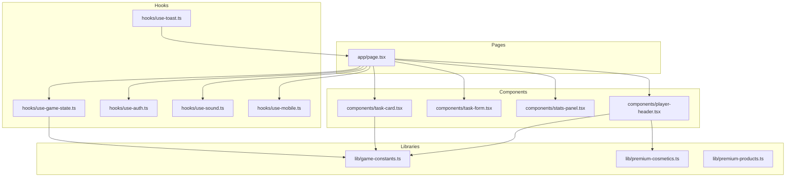
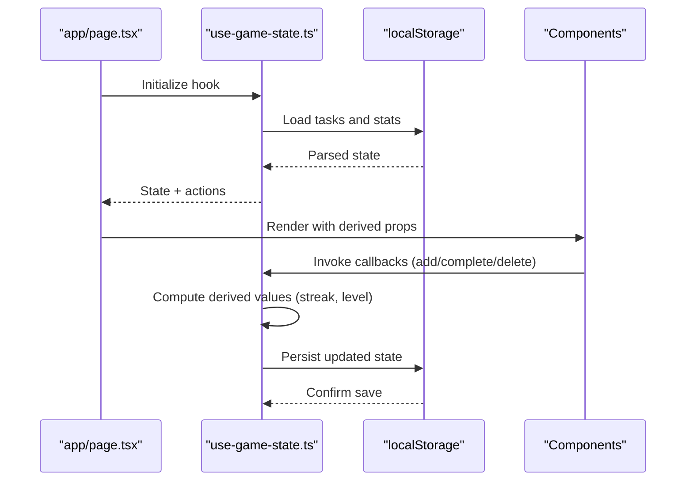
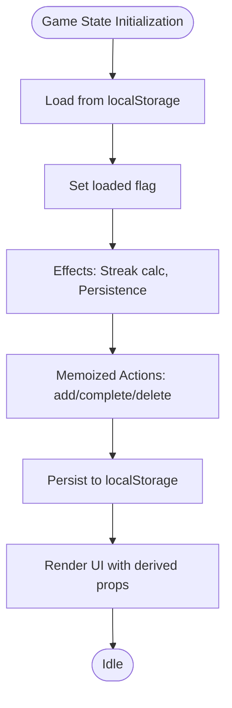
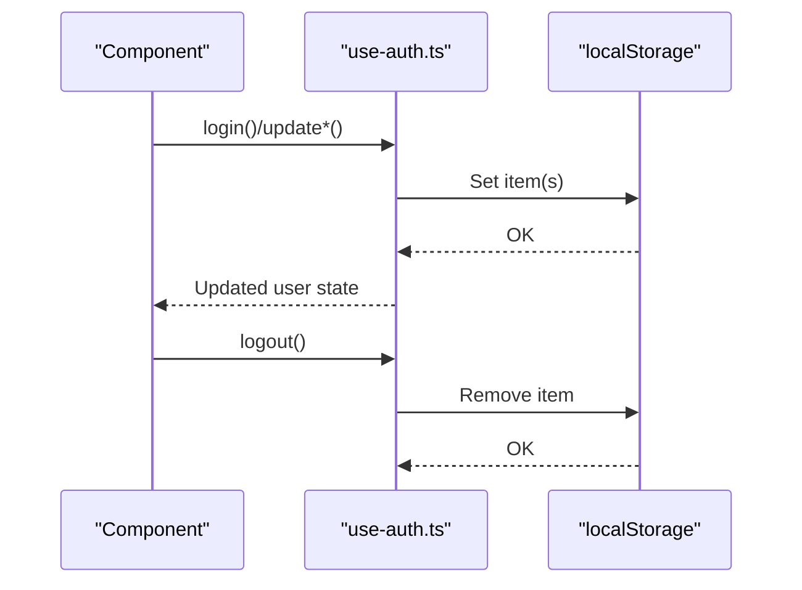
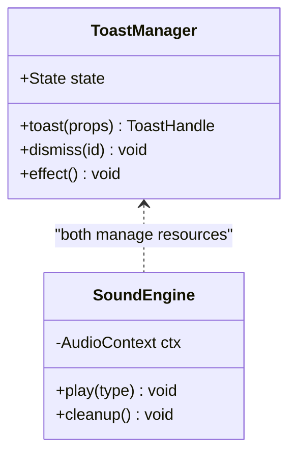
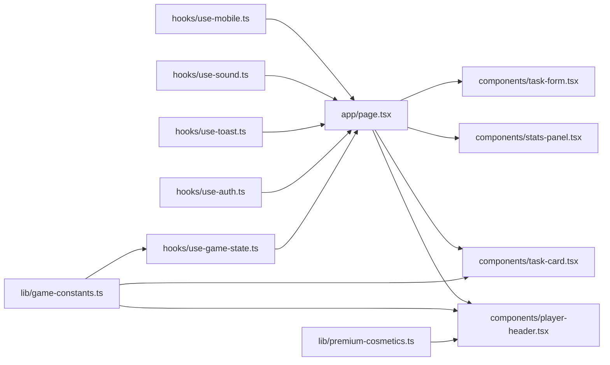

# Memory Management and State Optimization

<cite>
**Referenced Files in This Document**
- [use-game-state.ts](file://hooks/use-game-state.ts)
- [game-constants.ts](file://lib/game-constants.ts)
- [use-auth.ts](file://hooks/use-auth.ts)
- [page.tsx](file://app/page.tsx)
- [task-card.tsx](file://components/task-card.tsx)
- [task-form.tsx](file://components/task-form.tsx)
- [stats-panel.tsx](file://components/stats-panel.tsx)
- [player-header.tsx](file://components/player-header.tsx)
- [use-toast.ts](file://hooks/use-toast.ts)
- [use-sound.ts](file://hooks/use-sound.ts)
- [use-mobile.ts](file://hooks/use-mobile.ts)
- [premium-cosmetics.ts](file://lib/premium-cosmetics.ts)
- [premium-products.ts](file://lib/premium-products.ts)
</cite>

## Table of Contents
1. [Introduction](#introduction)
2. [Project Structure](#project-structure)
3. [Core Components](#core-components)
4. [Architecture Overview](#architecture-overview)
5. [Detailed Component Analysis](#detailed-component-analysis)
6. [Dependency Analysis](#dependency-analysis)
7. [Performance Considerations](#performance-considerations)
8. [Troubleshooting Guide](#troubleshooting-guide)
9. [Conclusion](#conclusion)

## Introduction
This document focuses on memory management and state optimization for a React-based productivity and RPG-style progression application. It covers efficient state structure design, local storage optimization, and strategies to prevent memory leaks. It also explains React state optimization using useMemo, useCallback, and useRef, along with garbage collection considerations for game state, task data, and user progress tracking. Memory-efficient data structures for XP calculations, achievement tracking, and task management are detailed, alongside performance monitoring and optimization strategies for large datasets. Cleanup procedures, event listener management, and resource deallocation patterns are addressed to ensure robust, scalable behavior.

## Project Structure
The application follows a feature-based structure with clear separation of concerns:
- Hooks encapsulate reusable state and side effects (game state, authentication, UI utilities).
- Libraries define constants and pure calculation functions for XP and achievements.
- Components are modular and self-contained, consuming hooks and passing callbacks.
- Pages orchestrate multiple hooks and components, coordinating cross-feature state.

**Diagram sources**
- [page.tsx:1-384](file://app/page.tsx#L1-L384)
- [use-game-state.ts:1-252](file://hooks/use-game-state.ts#L1-L252)
- [use-auth.ts:1-167](file://hooks/use-auth.ts#L1-L167)
- [use-toast.ts:1-192](file://hooks/use-toast.ts#L1-L192)
- [use-sound.ts:1-36](file://hooks/use-sound.ts#L1-L36)
- [use-mobile.ts:1-19](file://hooks/use-mobile.ts#L1-L19)
- [game-constants.ts:1-95](file://lib/game-constants.ts#L1-L95)
- [premium-cosmetics.ts:1-77](file://lib/premium-cosmetics.ts#L1-L77)
- [premium-products.ts:1-76](file://lib/premium-products.ts#L1-L76)
- [task-card.tsx:1-186](file://components/task-card.tsx#L1-L186)
- [task-form.tsx:1-191](file://components/task-form.tsx#L1-L191)
- [stats-panel.tsx:1-145](file://components/stats-panel.tsx#L1-L145)
- [player-header.tsx:1-183](file://components/player-header.tsx#L1-L183)

**Section sources**
- [page.tsx:1-384](file://app/page.tsx#L1-L384)
- [use-game-state.ts:1-252](file://hooks/use-game-state.ts#L1-L252)
- [use-auth.ts:1-167](file://hooks/use-auth.ts#L1-L167)
- [game-constants.ts:1-95](file://lib/game-constants.ts#L1-L95)

## Core Components
This section outlines the primary state management units and their memory implications.

- Game state hook
  - Manages tasks and player stats, persists to localStorage, and computes derived values.
  - Uses memoized callbacks to avoid unnecessary re-renders.
  - Implements effect-driven updates for streak calculation and persistence.

- Authentication hook
  - Loads and normalizes user data from localStorage, sets default avatars, and exposes update functions.
  - Persists updates immediately to localStorage.

- UI utilities
  - Toast manager maintains a bounded queue and cleans up timed entries.
  - Sound hook manages a singleton audio context and synthesized tones.
  - Mobile detection hook registers and removes media query listeners.

Key memory considerations:
- Prefer immutable updates to minimize accidental shared references.
- Persist only essential fields to reduce storage footprint.
- Limit concurrent UI notifications to control memory growth.
- Dispose of audio resources when appropriate.

**Section sources**
- [use-game-state.ts:51-251](file://hooks/use-game-state.ts#L51-L251)
- [use-auth.ts:28-166](file://hooks/use-auth.ts#L28-L166)
- [use-toast.ts:11-192](file://hooks/use-toast.ts#L11-L192)
- [use-sound.ts:1-36](file://hooks/use-sound.ts#L1-L36)
- [use-mobile.ts:1-19](file://hooks/use-mobile.ts#L1-L19)

## Architecture Overview
The state lifecycle spans initialization, persistence, computation, and UI rendering.

**Diagram sources**
- [page.tsx:34-126](file://app/page.tsx#L34-L126)
- [use-game-state.ts:63-82](file://hooks/use-game-state.ts#L63-L82)

## Detailed Component Analysis

### Game State Hook: Memory-Efficient Design and Optimization
- State shape
  - Tasks array stores lightweight records with minimal fields.
  - Player stats include counters and arrays for achievements and streak metadata.
- Persistence
  - Single localStorage write per state change after initial load guard.
  - JSON serialization avoids excessive cloning overhead.
- Derived computations
  - Streak computed via date comparisons; memoized via dependency arrays.
  - Level and XP derived from pure functions; cached via callback memoization.
- Callback optimization
  - useCallback used for actions and getters to prevent prop drift.
- Achievement tracking
  - Achievement IDs stored as strings; lookups performed on demand.

**Diagram sources**
- [use-game-state.ts:63-82](file://hooks/use-game-state.ts#L63-L82)
- [use-game-state.ts:127-237](file://hooks/use-game-state.ts#L127-L237)

**Section sources**
- [use-game-state.ts:15-47](file://hooks/use-game-state.ts#L15-L47)
- [use-game-state.ts:63-125](file://hooks/use-game-state.ts#L63-L125)
- [use-game-state.ts:127-237](file://hooks/use-game-state.ts#L127-L237)

### Authentication Hook: Local Storage Optimization and Cleanup
- Normalization
  - Ensures avatar URLs for premium and non-premium users during load.
  - Writes normalized user back to localStorage.
- Updates
  - Immediate persistence on profile changes (avatar, cosmetic, job class, premium status).
- Logout
  - Removes user entry from localStorage.

**Diagram sources**
- [use-auth.ts:32-58](file://hooks/use-auth.ts#L32-L58)
- [use-auth.ts:60-147](file://hooks/use-auth.ts#L60-L147)

**Section sources**
- [use-auth.ts:28-166](file://hooks/use-auth.ts#L28-L166)

### UI Utilities: Toast Manager and Sound Engine
- Toast manager
  - Maintains a bounded queue and schedules removal timers.
  - Listeners are registered/unregistered in a single effect; cleanup removes listener references.
- Sound engine
  - Singleton AudioContext prevents multiple contexts.
  - Oscillators/gains created per sound; consider pooling for high-frequency events.

**Diagram sources**
- [use-toast.ts:171-189](file://hooks/use-toast.ts#L171-L189)
- [use-sound.ts:9-36](file://hooks/use-sound.ts#L9-L36)

**Section sources**
- [use-toast.ts:11-192](file://hooks/use-toast.ts#L11-L192)
- [use-sound.ts:1-36](file://hooks/use-sound.ts#L1-L36)

### Components: Refs, Event Listeners, and Rendering Patterns
- TaskCard
  - Uses useRef for DOM transforms and mouse move/leave handlers.
  - Modal open state managed locally; no external persistence.
- TaskForm
  - Local form state; submits to parent via callback.
- StatsPanel and PlayerHeader
  - Pure render components using derived values; minimal internal state.

Memory and performance notes:
- Avoid storing heavy objects in refs; use them for DOM nodes or lightweight handles.
- Ensure event listeners attached in effects are removed in cleanup.
- Keep component props shallow to prevent unnecessary re-renders.

**Section sources**
- [task-card.tsx:18-63](file://components/task-card.tsx#L18-L63)
- [task-form.tsx:18-51](file://components/task-form.tsx#L18-L51)
- [stats-panel.tsx:13-144](file://components/stats-panel.tsx#L13-L144)
- [player-header.tsx:16-182](file://components/player-header.tsx#L16-L182)

## Dependency Analysis
The following diagram highlights key dependencies among state hooks, libraries, and components.

**Diagram sources**
- [use-game-state.ts:1-13](file://hooks/use-game-state.ts#L1-L13)
- [game-constants.ts:1-95](file://lib/game-constants.ts#L1-L95)
- [use-auth.ts:1-13](file://hooks/use-auth.ts#L1-L13)
- [page.tsx:1-384](file://app/page.tsx#L1-L384)
- [player-header.tsx:1-183](file://components/player-header.tsx#L1-L183)
- [task-card.tsx:1-186](file://components/task-card.tsx#L1-L186)
- [task-form.tsx:1-191](file://components/task-form.tsx#L1-L191)
- [stats-panel.tsx:1-145](file://components/stats-panel.tsx#L1-L145)
- [premium-cosmetics.ts:1-77](file://lib/premium-cosmetics.ts#L1-L77)

**Section sources**
- [use-game-state.ts:1-252](file://hooks/use-game-state.ts#L1-L252)
- [use-auth.ts:1-167](file://hooks/use-auth.ts#L1-L167)
- [page.tsx:1-384](file://app/page.tsx#L1-L384)

## Performance Considerations
- React state optimization
  - useCallback for event handlers and getters to prevent prop drift and re-renders.
  - useMemo for expensive derived computations (e.g., large filtered lists) when necessary.
  - useRef for DOM handles and lightweight mutable flags; avoid storing heavy objects.
- Local storage optimization
  - Persist only essential fields; avoid serializing large transient objects.
  - Debounce or batch writes for frequent updates.
- Garbage collection
  - Clear timeouts and intervals in cleanup effects.
  - Remove event listeners attached to window/document.
  - Dismiss toasts and remove timed entries to prevent accumulation.
- Data structures
  - Use primitive IDs and lookup maps for achievements and difficulty ranks.
  - Keep task arrays sorted or indexed by creation/completion timestamps for fast scans.
- Large datasets
  - Virtualize long lists (active/completed tasks) to limit DOM nodes.
  - Paginate or truncate non-critical lists (e.g., recent completed tasks preview).
- Audio and animations
  - Reuse oscillators and gains; avoid creating new nodes per event.
  - Throttle mousemove/touch events for 3D tilt effects.

[No sources needed since this section provides general guidance]

## Troubleshooting Guide
Common issues and remedies:
- Stale or corrupted localStorage data
  - Validate JSON parsing and fallback to defaults on errors.
  - Normalize user data on load to ensure consistent shapes.
- Excessive re-renders
  - Verify useCallback dependencies and ensure stable references for callbacks passed to children.
  - Avoid inline object/array creation in render; pass primitives or memoized values.
- Memory leaks from event listeners
  - Always remove listeners in effect cleanup; confirm media queries and global listeners are detached.
- Toast accumulation
  - Ensure toasts are dismissed programmatically or via onOpenChange; verify timers are cleared.
- Audio context issues
  - Reuse singleton context; avoid creating multiple contexts.
  - Stop oscillators and disconnect nodes when leaving pages or components.

**Section sources**
- [use-game-state.ts:63-82](file://hooks/use-game-state.ts#L63-L82)
- [use-auth.ts:32-58](file://hooks/use-auth.ts#L32-L58)
- [use-toast.ts:171-189](file://hooks/use-toast.ts#L171-L189)
- [use-sound.ts:9-17](file://hooks/use-sound.ts#L9-L17)
- [task-card.tsx:46-63](file://components/task-card.tsx#L46-L63)

## Conclusion
By structuring state immutably, persisting only essential data, and optimizing with React’s memoization primitives, the application achieves predictable memory behavior and responsive UI. Proper cleanup of effects, listeners, and timers ensures long-running sessions remain stable. For large datasets, virtualization and truncation further improve performance. These patterns collectively support scalable growth while maintaining a smooth user experience.