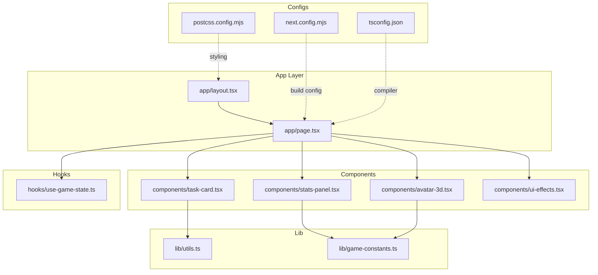
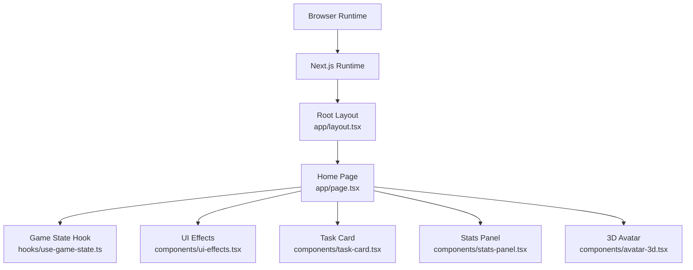
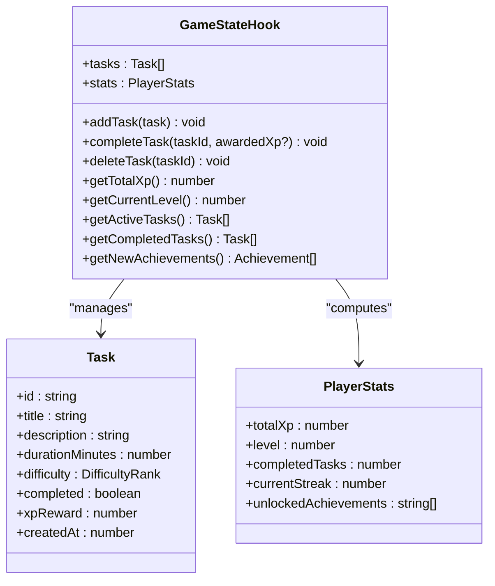
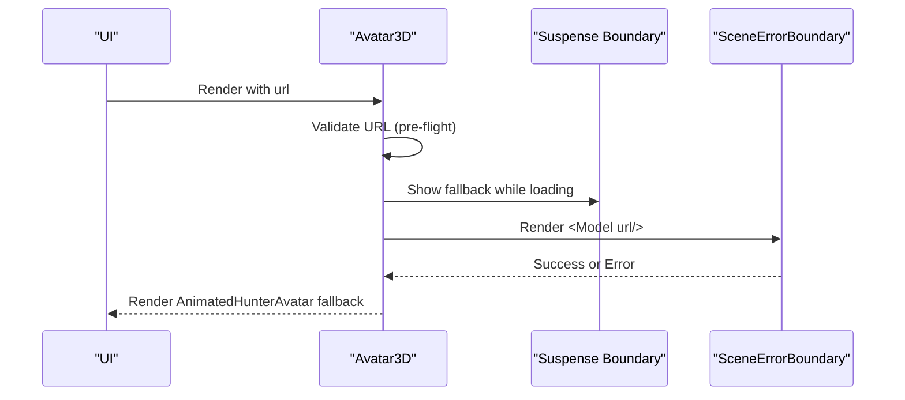
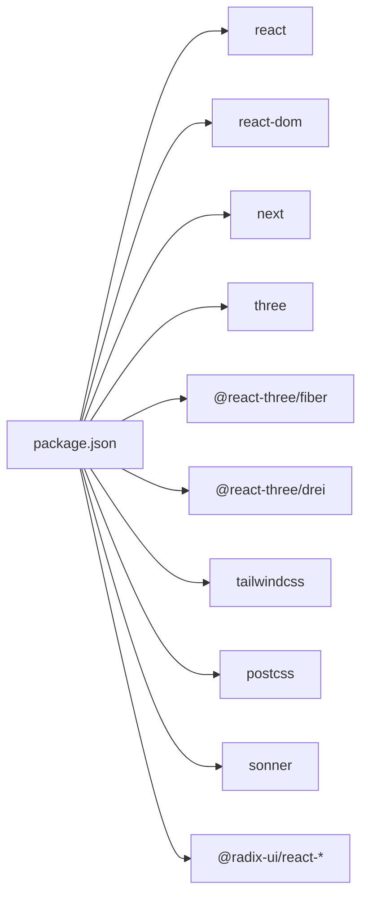

# Performance Optimization

<cite>
**Referenced Files in This Document**
- [next.config.mjs](file://next.config.mjs)
- [package.json](file://package.json)
- [postcss.config.mjs](file://postcss.config.mjs)
- [tsconfig.json](file://tsconfig.json)
- [app/layout.tsx](file://app/layout.tsx)
- [app/page.tsx](file://app/page.tsx)
- [components/avatar-3d.tsx](file://components/avatar-3d.tsx)
- [components/stats-panel.tsx](file://components/stats-panel.tsx)
- [components/task-card.tsx](file://components/task-card.tsx)
- [components/ui-effects.tsx](file://components/ui-effects.tsx)
- [hooks/use-game-state.ts](file://hooks/use-game-state.ts)
- [lib/utils.ts](file://lib/utils.ts)
- [lib/game-constants.ts](file://lib/game-constants.ts)
- [components/theme-provider.tsx](file://components/theme-provider.tsx)
</cite>

## Table of Contents
1. [Introduction](#introduction)
2. [Project Structure](#project-structure)
3. [Core Components](#core-components)
4. [Architecture Overview](#architecture-overview)
5. [Detailed Component Analysis](#detailed-component-analysis)
6. [Dependency Analysis](#dependency-analysis)
7. [Performance Considerations](#performance-considerations)
8. [Troubleshooting Guide](#troubleshooting-guide)
9. [Conclusion](#conclusion)
10. [Appendices](#appendices)

## Introduction
This document provides a comprehensive guide to performance optimization strategies and best practices for the project. It covers Next.js build configuration, bundle optimization, code splitting, lazy loading, memory management, state optimization, rendering performance, 3D graphics and animation performance, responsive design efficiency, React memoization primitives, performance monitoring and profiling, bundle size analysis, runtime metrics, and user experience optimization.

## Project Structure
The project follows a Next.js App Router structure with a clear separation of concerns:
- Application pages under app/
- Shared UI components under components/
- Hooks under hooks/
- Utilities and constants under lib/
- Global styles and fonts under app/globals.css and app/layout.tsx
- Build-time configuration under next.config.mjs, postcss.config.mjs, tsconfig.json
- Dependencies and scripts under package.json

**Diagram sources**
- [app/layout.tsx](file://app/layout.tsx)
- [app/page.tsx](file://app/page.tsx)
- [components/task-card.tsx](file://components/task-card.tsx)
- [components/stats-panel.tsx](file://components/stats-panel.tsx)
- [components/avatar-3d.tsx](file://components/avatar-3d.tsx)
- [components/ui-effects.tsx](file://components/ui-effects.tsx)
- [hooks/use-game-state.ts](file://hooks/use-game-state.ts)
- [lib/utils.ts](file://lib/utils.ts)
- [lib/game-constants.ts](file://lib/game-constants.ts)
- [next.config.mjs](file://next.config.mjs)
- [postcss.config.mjs](file://postcss.config.mjs)
- [tsconfig.json](file://tsconfig.json)

**Section sources**
- [next.config.mjs](file://next.config.mjs)
- [postcss.config.mjs](file://postcss.config.mjs)
- [tsconfig.json](file://tsconfig.json)
- [app/layout.tsx](file://app/layout.tsx)
- [app/page.tsx](file://app/page.tsx)

## Core Components
- Next.js configuration: Minimal TypeScript strictness, image optimization settings, and analytics integration.
- Global layout and fonts: Centralized metadata, theme provider, and analytics injection.
- Game state hook: Local-first state with memoized callbacks and derived computations.
- UI effects: Reusable 3D hover cards, animated counters, energy bars, and floating elements.
- Task and stats panels: Interactive lists with lightweight animations and tooltips.
- 3D avatar: Complex Three.js scene with lazy model loading, suspense boundaries, and frame-based animations.

Key performance-relevant aspects:
- useGameState leverages useCallback and useMemo to prevent unnecessary recalculations and re-renders.
- UI effects components encapsulate animations and 3D transforms efficiently.
- 3D avatar uses Suspense for lazy model loading and guards against invalid URLs.

**Section sources**
- [next.config.mjs](file://next.config.mjs)
- [app/layout.tsx](file://app/layout.tsx)
- [hooks/use-game-state.ts](file://hooks/use-game-state.ts)
- [components/ui-effects.tsx](file://components/ui-effects.tsx)
- [components/task-card.tsx](file://components/task-card.tsx)
- [components/stats-panel.tsx](file://components/stats-panel.tsx)
- [components/avatar-3d.tsx](file://components/avatar-3d.tsx)

## Architecture Overview
The application is a single-page React application built with Next.js App Router. It integrates:
- Analytics via Vercel Analytics
- Local storage-backed game state
- Lightweight UI effects and animations
- Optional 3D rendering with Three.js and React Three Fiber

**Diagram sources**
- [app/layout.tsx](file://app/layout.tsx)
- [app/page.tsx](file://app/page.tsx)
- [hooks/use-game-state.ts](file://hooks/use-game-state.ts)
- [components/ui-effects.tsx](file://components/ui-effects.tsx)
- [components/task-card.tsx](file://components/task-card.tsx)
- [components/stats-panel.tsx](file://components/stats-panel.tsx)
- [components/avatar-3d.tsx](file://components/avatar-3d.tsx)

## Detailed Component Analysis

### Next.js Build and Runtime Configuration
- next.config.mjs disables TypeScript checks during builds and marks images as unoptimized, reducing build overhead and avoiding external image optimization.
- Analytics integration is enabled globally via app/layout.tsx.
- PostCSS/Tailwind pipeline is configured for efficient CSS generation.
- TypeScript compiler targets ES6 with bundler module resolution and strict checks.

Optimization implications:
- Faster builds with relaxed TS checks.
- Reduced image processing overhead.
- Tailwind-based styling supports JIT compilation for minimal CSS.

**Section sources**
- [next.config.mjs](file://next.config.mjs)
- [postcss.config.mjs](file://postcss.config.mjs)
- [tsconfig.json](file://tsconfig.json)
- [app/layout.tsx](file://app/layout.tsx)

### Game State Management and Rendering Performance
The game state hook centralizes task and player statistics management with memoization and callbacks to minimize re-renders.

**Diagram sources**
- [hooks/use-game-state.ts](file://hooks/use-game-state.ts)
- [lib/game-constants.ts](file://lib/game-constants.ts)

Key optimizations:
- useCallback for event handlers prevents prop drift and reduces downstream re-renders.
- useMemo for derived values avoids recomputation on unrelated updates.
- Local-first persistence with guarded loading prevents blocking renders.

**Section sources**
- [hooks/use-game-state.ts](file://hooks/use-game-state.ts)
- [lib/game-constants.ts](file://lib/game-constants.ts)

### UI Effects and Responsive Design Efficiency
Reusable UI components encapsulate animations and 3D transforms efficiently:
- GlassCard: 3D hover effect with controlled transform updates.
- GlowButton: Animated gradients and shine effects.
- AnimatedCounter: Optimized numeric transitions.
- EnergyBar: Smooth progress bar with animated shine.
- FloatingElement and PulsingDot: Lightweight animations.

Responsive design:
- Tailwind utilities enable adaptive layouts.
- Mobile breakpoints handled via shared hooks (not shown here but commonly used).
- CSS animations and transforms leverage GPU acceleration.

**Section sources**
- [components/ui-effects.tsx](file://components/ui-effects.tsx)
- [lib/utils.ts](file://lib/utils.ts)

### Task Card and Stats Panel
- TaskCard implements lightweight 3D tilt effect using mouse move handlers and controlled transforms.
- StatsPanel renders achievement grids with hover tooltips and animated elements.

Performance considerations:
- Mouse handlers are attached conditionally and reset on leave.
- Grid rendering uses memoized computed values for achievement counts.

**Section sources**
- [components/task-card.tsx](file://components/task-card.tsx)
- [components/stats-panel.tsx](file://components/stats-panel.tsx)

### 3D Avatar and Lazy Model Loading
The 3D avatar component demonstrates advanced performance strategies:
- Lazy model loading with Suspense boundaries.
- Pre-flight URL validation with timeouts to avoid long hangs.
- Error boundary wrapping to degrade gracefully.
- Frame-based animations using React Three Fiber’s useFrame for smooth updates.
- Memoized theme and level-dependent props to reduce re-renders.

**Diagram sources**
- [components/avatar-3d.tsx](file://components/avatar-3d.tsx)

Additional optimizations:
- useFrame animations are scoped to component lifecycles.
- Memoized theme colors and geometry props reduce material updates.

**Section sources**
- [components/avatar-3d.tsx](file://components/avatar-3d.tsx)

## Dependency Analysis
External libraries impacting performance:
- React 19 and Next 16: Latest React features and App Router optimizations.
- Three.js ecosystem (@react-three/fiber, @react-three/drei): Efficient declarative 3D rendering.
- Tailwind 4 and PostCSS: Utility-first CSS with JIT for minimal payload.
- Sonner: Lightweight toast notifications with minimal footprint.
- Radix UI primitives: Accessible, small-footprint UI components.

**Diagram sources**
- [package.json](file://package.json)

**Section sources**
- [package.json](file://package.json)

## Performance Considerations
- Build configuration
  - Disable TS checks during build to reduce CI/build time.
  - Images unoptimized to skip external optimization steps.
  - Logging browserToTerminal enabled for development insights.

- Bundle optimization
  - Prefer tree-shaking by using named exports and granular imports.
  - Keep UI libraries small (Radix UI) and remove unused components.
  - Use Tailwind JIT to purge unused CSS in production.

- Code splitting
  - Next.js automatic code splitting via App Router pages and route segments.
  - Lazy load heavy 3D scenes and models using dynamic imports and Suspense boundaries.

- Memory management
  - Avoid closures capturing large objects in event handlers.
  - Clean up subscriptions and timers in effects.
  - Use refs for DOM nodes and Three.js objects to avoid unnecessary re-renders.

- State optimization
  - Use useCallback for event handlers passed down to children.
  - Use useMemo for derived data and expensive computations.
  - Normalize state to reduce deep equality churn.

- Rendering performance
  - Minimize re-renders by keeping props shallow and stable.
  - Use React 19 features (e.g., use, cache) for improved scheduling.
  - Defer non-critical work to idle callbacks or microtasks.

- 3D graphics and animation
  - Use React Three Fiber’s useFrame for per-frame updates.
  - Limit draw calls by sharing materials and geometries.
  - Use frustum culling and level-of-detail strategies for complex models.

- Responsive design efficiency
  - Use CSS transforms and GPU-accelerated animations.
  - Avoid layout thrashing by batching DOM reads/writes.

[No sources needed since this section provides general guidance]

## Troubleshooting Guide
Common performance issues and remedies:
- Slow initial load
  - Verify build logs for TS errors and image optimization delays.
  - Confirm Suspense boundaries are used for heavy components.

- Excessive re-renders
  - Audit props passed to children; wrap unstable callbacks with useCallback.
  - Replace deep objects with memoized references using useMemo.

- Janky animations
  - Ensure useFrame loops are not doing heavy work; offload to workers if needed.
  - Reduce number of animated elements and simplify materials.

- High memory usage
  - Dispose of Three.js resources when components unmount.
  - Avoid storing large arrays in state; compute on demand.

- Bundle bloat
  - Run a bundle analyzer and remove unused dependencies.
  - Split vendor chunks and defer non-critical routes.

**Section sources**
- [hooks/use-game-state.ts](file://hooks/use-game-state.ts)
- [components/avatar-3d.tsx](file://components/avatar-3d.tsx)

## Conclusion
By combining Next.js’s built-in optimizations, strategic code splitting, memoization patterns, and efficient 3D rendering practices, the application achieves a responsive and visually engaging experience. The included hooks, components, and configuration provide a solid foundation for maintaining and extending performance as the project evolves.

[No sources needed since this section summarizes without analyzing specific files]

## Appendices

### Practical Examples and Implementation Paths
- Performance monitoring
  - Integrate Vercel Analytics for runtime metrics and user behavior insights.
  - Use React DevTools Profiler to identify slow components and render bottlenecks.
  - Measure CLS, FID, and LCP using web vitals collection.

- Bundle size analysis
  - Use next bundle analyzer or similar tools to inspect output bundles.
  - Identify largest dependencies and consider alternatives or lazy loading.

- Optimization implementation
  - Apply React.memo to pure functional components with stable props.
  - Wrap heavy computations with useMemo and useCallback.
  - Lazy load non-critical routes and components with dynamic imports.

- User experience optimization
  - Provide meaningful loading states and skeleton screens.
  - Use optimistic updates for immediate feedback.
  - Ensure animations are smooth and do not block the main thread.

[No sources needed since this section provides general guidance]