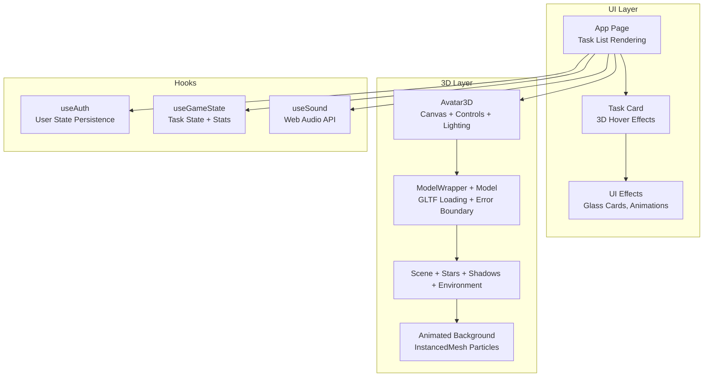
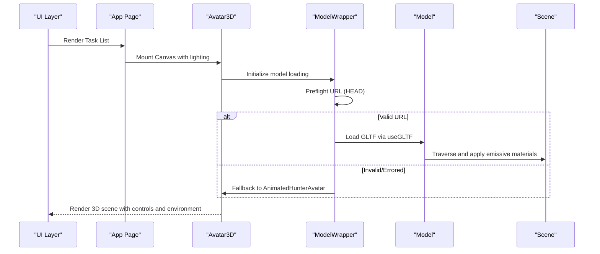
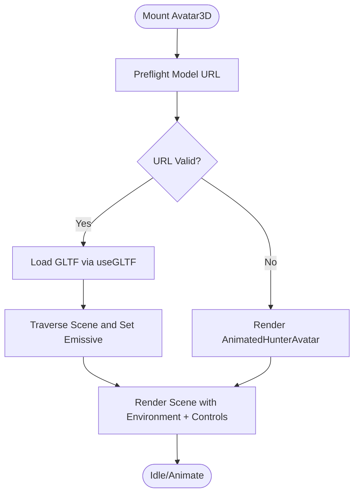
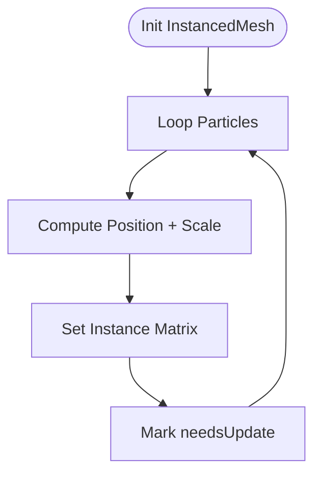
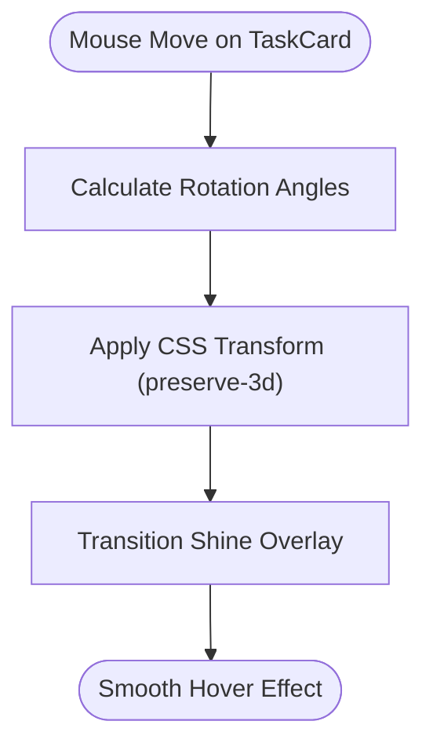
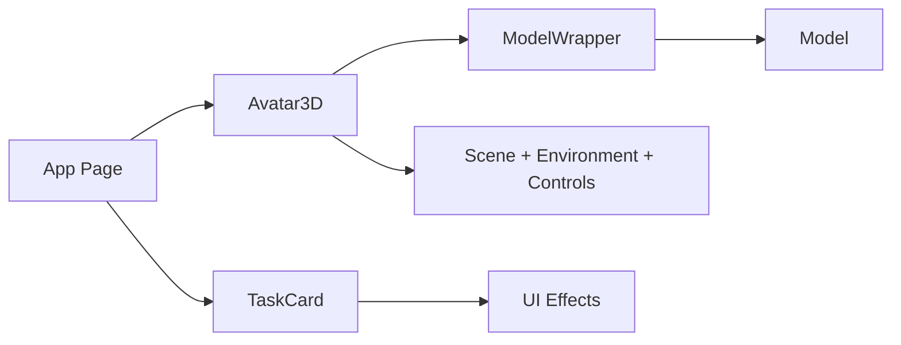

# Rendering Performance and 3D Graphics Optimization

<cite>
**Referenced Files in This Document**
- [avatar-3d.tsx](file://components/avatar-3d.tsx)
- [page.tsx](file://app/page.tsx)
- [task-card.tsx](file://components/task-card.tsx)
- [animated-background.tsx](file://components/animated-background.tsx)
- [three-fiber.d.ts](file://types/three-fiber.d.ts)
- [use-auth.ts](file://hooks/use-auth.ts)
- [use-game-state.ts](file://hooks/use-game-state.ts)
- [use-sound.ts](file://hooks/use-sound.ts)
- [focus-timer.tsx](file://components/focus-timer.tsx)
- [ui-effects.tsx](file://components/ui-effects.tsx)
</cite>

## Table of Contents
1. [Introduction](#introduction)
2. [Project Structure](#project-structure)
3. [Core Components](#core-components)
4. [Architecture Overview](#architecture-overview)
5. [Detailed Component Analysis](#detailed-component-analysis)
6. [Dependency Analysis](#dependency-analysis)
7. [Performance Considerations](#performance-considerations)
8. [Troubleshooting Guide](#troubleshooting-guide)
9. [Conclusion](#conclusion)

## Introduction
This document focuses on rendering performance optimization and 3D graphics efficiency in a modern React application that integrates Three.js via React Three Fiber. It covers:
- Three.js optimization techniques and scene graph management
- Geometry optimization and material strategies
- React Three Fiber performance best practices, including render cycle optimization
- Animation performance tuning and GPU utilization strategies
- UI rendering optimization for task lists and responsive design
- Performance profiling, bottleneck identification, and practical optimization examples
- Mobile device performance considerations, battery life, and UX impact

## Project Structure
The project combines React UI with interactive 3D scenes. Key areas relevant to performance:
- 3D avatar creation and preview pipeline
- Task list UI with lightweight 3D hover effects
- Animated background using instanced meshes
- Game state and sound hooks impacting render cycles

**Diagram sources**
- [avatar-3d.tsx:1304-1361](file://components/avatar-3d.tsx#L1304-L1361)
- [page.tsx:314-348](file://app/page.tsx#L314-L348)
- [task-card.tsx:18-186](file://components/task-card.tsx#L18-L186)
- [animated-background.tsx:73-120](file://components/animated-background.tsx#L73-L120)
- [use-auth.ts:28-167](file://hooks/use-auth.ts#L28-L167)
- [use-game-state.ts:51-252](file://hooks/use-game-state.ts#L51-L252)
- [use-sound.ts:180-204](file://hooks/use-sound.ts#L180-L204)

**Section sources**
- [avatar-3d.tsx:1304-1361](file://components/avatar-3d.tsx#L1304-L1361)
- [page.tsx:314-348](file://app/page.tsx#L314-L348)
- [task-card.tsx:18-186](file://components/task-card.tsx#L18-L186)
- [animated-background.tsx:73-120](file://components/animated-background.tsx#L73-L120)
- [use-auth.ts:28-167](file://hooks/use-auth.ts#L28-L167)
- [use-game-state.ts:51-252](file://hooks/use-game-state.ts#L51-L252)
- [use-sound.ts:180-204](file://hooks/use-sound.ts#L180-L204)

## Core Components
- Avatar3D: Main 3D canvas with lighting, environment, controls, and optional GLTF model loading with fallbacks.
- ModelWrapper/Model: Robust model loader with preflight checks, error boundary, and emissive material updates.
- AnimatedHunterAvatar: Lightweight procedural avatar used as fallback during model load or errors.
- TaskCard: Task list item with subtle 3D hover transforms and animated effects.
- AnimatedBackground: GPU-friendly instanced particle system for background ambiance.
- UI Effects: Reusable components for glass cards, glow, and animations with minimal DOM overhead.
- Hooks: useAuth, useGameState, useSound manage state and audio synthesis to avoid unnecessary re-renders.

**Section sources**
- [avatar-3d.tsx:1304-1361](file://components/avatar-3d.tsx#L1304-L1361)
- [avatar-3d.tsx:1210-1266](file://components/avatar-3d.tsx#L1210-L1266)
- [avatar-3d.tsx:1133-1186](file://components/avatar-3d.tsx#L1133-L1186)
- [avatar-3d.tsx:1099-1128](file://components/avatar-3d.tsx#L1099-L1128)
- [task-card.tsx:18-186](file://components/task-card.tsx#L18-L186)
- [animated-background.tsx:73-120](file://components/animated-background.tsx#L73-L120)
- [ui-effects.tsx:13-65](file://components/ui-effects.tsx#L13-L65)
- [use-auth.ts:28-167](file://hooks/use-auth.ts#L28-L167)
- [use-game-state.ts:51-252](file://hooks/use-game-state.ts#L51-L252)
- [use-sound.ts:180-204](file://hooks/use-sound.ts#L180-L204)

## Architecture Overview
The rendering architecture balances 3D interactivity with UI responsiveness:
- 3D rendering occurs inside a dedicated Canvas with controlled lighting and camera parameters.
- Model loading is asynchronous with preflight checks and graceful fallbacks.
- UI components leverage CSS transforms and lightweight animations to minimize layout thrashing.
- Game state and audio hooks persist across renders to reduce re-computation.

**Diagram sources**
- [avatar-3d.tsx:1210-1266](file://components/avatar-3d.tsx#L1210-L1266)
- [avatar-3d.tsx:1133-1186](file://components/avatar-3d.tsx#L1133-L1186)
- [avatar-3d.tsx:1304-1361](file://components/avatar-3d.tsx#L1304-L1361)

**Section sources**
- [avatar-3d.tsx:1210-1266](file://components/avatar-3d.tsx#L1210-L1266)
- [avatar-3d.tsx:1133-1186](file://components/avatar-3d.tsx#L1133-L1186)
- [avatar-3d.tsx:1304-1361](file://components/avatar-3d.tsx#L1304-L1361)

## Detailed Component Analysis

### Avatar3D and Model Pipeline
Key performance strategies:
- Asynchronous model loading with preflight checks to avoid blocking the main thread.
- Error boundary ensures graceful fallback to procedural avatar.
- Material emissive updates applied only when level threshold is met to limit shader work.
- Controlled camera and lighting reduce overdraw and shadow computations.

**Diagram sources**
- [avatar-3d.tsx:1210-1266](file://components/avatar-3d.tsx#L1210-L1266)
- [avatar-3d.tsx:1133-1186](file://components/avatar-3d.tsx#L1133-L1186)
- [avatar-3d.tsx:1099-1128](file://components/avatar-3d.tsx#L1099-L1128)

**Section sources**
- [avatar-3d.tsx:1210-1266](file://components/avatar-3d.tsx#L1210-L1266)
- [avatar-3d.tsx:1133-1186](file://components/avatar-3d.tsx#L1133-L1186)
- [avatar-3d.tsx:1099-1128](file://components/avatar-3d.tsx#L1099-L1128)

### Animated Background (Instanced Particles)
GPU-centric optimization:
- Uses InstancedMesh to batch thousands of particles with per-instance matrices.
- Updates instance matrices directly and marks needsUpdate once per frame.
- Sinusoidal motion and scaling computed per particle to keep CPU work minimal.

**Diagram sources**
- [animated-background.tsx:73-120](file://components/animated-background.tsx#L73-L120)

**Section sources**
- [animated-background.tsx:73-120](file://components/animated-background.tsx#L73-L120)

### Task List Rendering and 3D Hover Effects
Performance-sensitive UI:
- TaskCard applies 3D tilt via CSS transforms and preserves-3d to avoid layout recalculations.
- Hover shine and glow use gradients and transitions for smooth GPU-accelerated animations.
- Minimal DOM nodes and efficient event handlers prevent jank.

**Diagram sources**
- [task-card.tsx:45-63](file://components/task-card.tsx#L45-L63)

**Section sources**
- [task-card.tsx:18-186](file://components/task-card.tsx#L18-L186)

### UI Effects Library
Reusable components optimized for performance:
- GlassCard uses transform-based 3D tilt and layered gradients for glow.
- AnimatedCounter and EnergyBar rely on CSS animations and transitions.
- FloatingElement and PulsingDot use minimal DOM and CSS animations.

**Section sources**
- [ui-effects.tsx:13-65](file://components/ui-effects.tsx#L13-L65)
- [ui-effects.tsx:146-154](file://components/ui-effects.tsx#L146-L154)
- [ui-effects.tsx:215-262](file://components/ui-effects.tsx#L215-L262)
- [ui-effects.tsx:182-194](file://components/ui-effects.tsx#L182-L194)
- [ui-effects.tsx:197-204](file://components/ui-effects.tsx#L197-L204)

### Game State and Sound Hooks
- useGameState persists and calculates state efficiently, minimizing re-renders.
- useSound initializes Web Audio API once and plays short synthesized clips to avoid heavy assets.

**Section sources**
- [use-game-state.ts:51-252](file://hooks/use-game-state.ts#L51-L252)
- [use-sound.ts:180-204](file://hooks/use-sound.ts#L180-L204)

## Dependency Analysis
- Avatar3D depends on React Three Fiber primitives and Drei helpers for GLTF loading, environment, shadows, and controls.
- ModelWrapper encapsulates error handling and fallback logic, isolating 3D rendering concerns from UI.
- TaskCard leverages Tailwind classes and CSS transforms for visual polish without heavy libraries.
- UI Effects provide reusable, performant building blocks for consistent UX.

**Diagram sources**
- [avatar-3d.tsx:1304-1361](file://components/avatar-3d.tsx#L1304-L1361)
- [avatar-3d.tsx:1210-1266](file://components/avatar-3d.tsx#L1210-L1266)
- [avatar-3d.tsx:1133-1186](file://components/avatar-3d.tsx#L1133-L1186)
- [task-card.tsx:18-186](file://components/task-card.tsx#L18-L186)
- [ui-effects.tsx:13-65](file://components/ui-effects.tsx#L13-L65)

**Section sources**
- [avatar-3d.tsx:1304-1361](file://components/avatar-3d.tsx#L1304-L1361)
- [avatar-3d.tsx:1210-1266](file://components/avatar-3d.tsx#L1210-L1266)
- [avatar-3d.tsx:1133-1186](file://components/avatar-3d.tsx#L1133-L1186)
- [task-card.tsx:18-186](file://components/task-card.tsx#L18-L186)
- [ui-effects.tsx:13-65](file://components/ui-effects.tsx#L13-L65)

## Performance Considerations
- Three.js optimization techniques
  - Prefer InstancedMesh for large particle systems; update instance matrices efficiently and mark needsUpdate once per frame.
  - Use additive blending sparingly; ensure materials are reused to minimize state changes.
  - Limit dynamic lights and shadows; prefer environment lighting for ambient scenes.
  - Control camera FOV and near/far planes to reduce overdraw and depth buffer pressure.
- Scene graph management
  - Keep hierarchy shallow; avoid deep nesting of groups.
  - Defer expensive geometry generation to initialization; reuse geometries and materials.
  - Use primitive objects for fallbacks to avoid heavy GLTF parsing until validated.
- Geometry optimization
  - Use simpler primitives (capsule, box, sphere) for procedural avatars; reduce tessellation where possible.
  - Share geometry instances across multiple meshes to cut memory and draw calls.
- React Three Fiber best practices
  - Memoize derived values (theme colors, scales) to prevent unnecessary re-renders.
  - Use Suspense boundaries to defer heavy GLTF loads; provide fast fallbacks.
  - Avoid frequent prop changes on animated frames; compute deltas incrementally.
- Animation performance tuning
  - Use requestAnimationFrame via useFrame judiciously; batch updates and avoid per-frame allocations.
  - Cap animation speeds on lower-end devices; expose adjustable speed toggles.
- GPU utilization strategies
  - Prefer additive blending for glow effects; disable color writes where possible.
  - Reduce texture sizes and use compressed formats; avoid frequent texture uploads.
- UI rendering optimization
  - Use CSS transforms for 3D effects; avoid layout-affecting properties.
  - Virtualize long lists; for task lists, render visible items only.
  - Minimize reflows by batching DOM updates and avoiding forced synchronous layouts.
- Responsive design performance
  - Adjust resolution and quality dynamically based on device capabilities.
  - Use media queries and runtime checks to scale down effects on mobile.
- Profiling and bottleneck identification
  - Use browser DevTools Rendering and Performance panels to detect FPS drops and long frames.
  - Measure frame times and identify heavy components; profile 3D vs. UI separately.
  - Monitor GPU memory usage and texture counts; watch for leaks.
- Practical examples
  - Replace per-pixel calculations with precomputed tables or uniforms.
  - Use requestIdleCallback to schedule non-urgent UI updates.
  - Cache computed styles and geometry; invalidate caches only when props change.

[No sources needed since this section provides general guidance]

## Troubleshooting Guide
Common issues and remedies:
- Model fails to load
  - Verify URL preflight passes; fallback to procedural avatar gracefully.
  - Ensure error boundary catches runtime errors and logs warnings.
- Low FPS in 3D scenes
  - Reduce particle count or simplify geometry; disable additive blending where not essential.
  - Limit emissive intensity and material complexity.
- UI lag during animations
  - Switch to CSS transforms and GPU-accelerated properties; avoid layout triggers.
  - Debounce mousemove handlers and throttle animation updates.
- Battery drain on mobile
  - Lower animation speeds and reduce visual effects; disable background animations when inactive.
  - Use reduced motion settings and respect prefers-reduced-motion.
- Audio synthesis performance
  - Reuse audio context; avoid creating oscillators per event.
  - Keep sound durations short and disable audio when not needed.

**Section sources**
- [avatar-3d.tsx:1191-1205](file://components/avatar-3d.tsx#L1191-L1205)
- [avatar-3d.tsx:1231-1252](file://components/avatar-3d.tsx#L1231-L1252)
- [use-sound.ts:180-204](file://hooks/use-sound.ts#L180-L204)

## Conclusion
By combining GPU-efficient rendering (InstancedMesh, additive blending, environment lighting), robust fallbacks (procedural avatars), and UI optimizations (CSS transforms, virtualization), the application achieves smooth performance across devices. Prioritizing memoization, controlled animation updates, and responsive quality adjustments ensures excellent user experience while maintaining low resource usage and extended battery life.