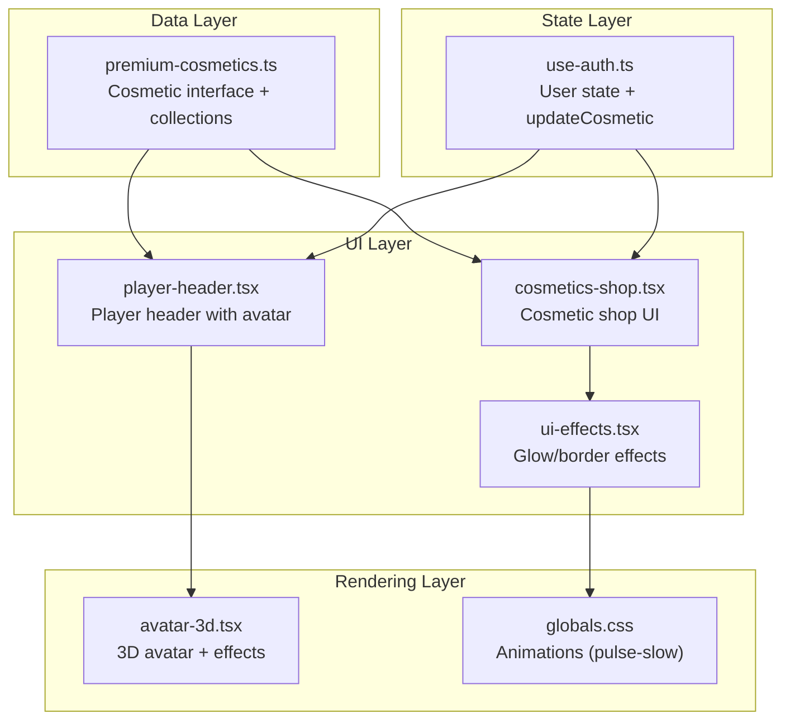
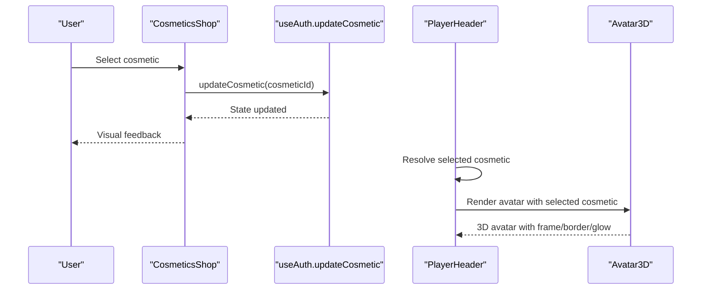
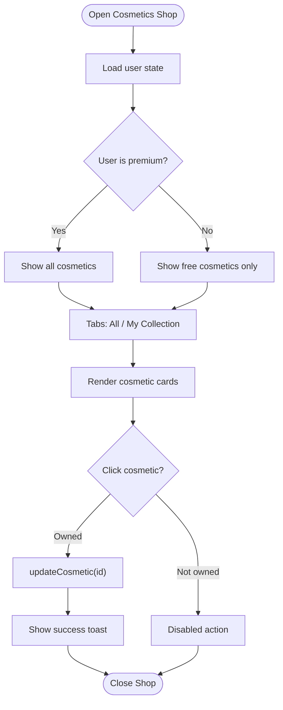
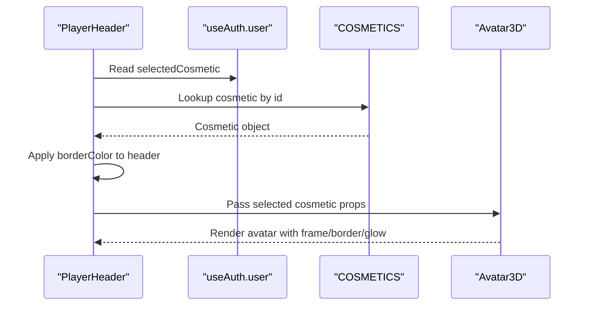
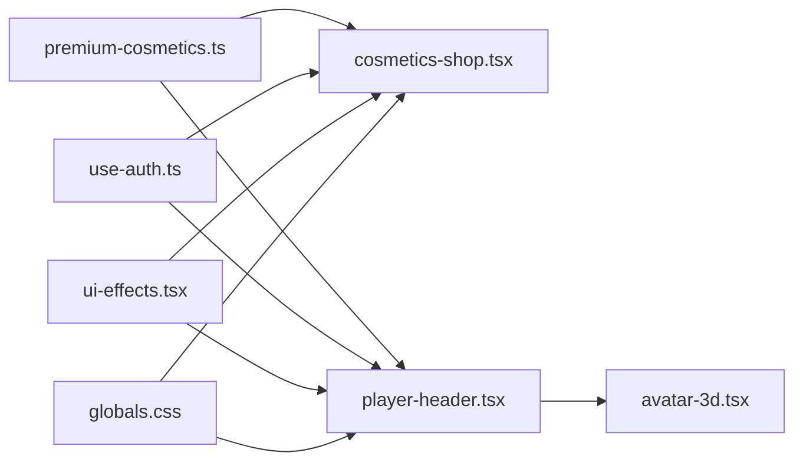

# Cosmetic System

<cite>
**Referenced Files in This Document**
- [premium-cosmetics.ts](file://lib/premium-cosmetics.ts)
- [cosmetics-shop.tsx](file://components/cosmetics-shop.tsx)
- [player-header.tsx](file://components/player-header.tsx)
- [use-auth.ts](file://hooks/use-auth.ts)
- [avatar-3d.tsx](file://components/avatar-3d.tsx)
- [ui-effects.tsx](file://components/ui-effects.tsx)
- [globals.css](file://app/globals.css)
</cite>

## Table of Contents
1. [Introduction](#introduction)
2. [Project Structure](#project-structure)
3. [Core Components](#core-components)
4. [Architecture Overview](#architecture-overview)
5. [Detailed Component Analysis](#detailed-component-analysis)
6. [Dependency Analysis](#dependency-analysis)
7. [Performance Considerations](#performance-considerations)
8. [Troubleshooting Guide](#troubleshooting-guide)
9. [Conclusion](#conclusion)

## Introduction
This document describes the cosmetic system that allows players to customize their avatar appearance through visual frames and effects. It covers the cosmetic data structure, predefined collections, filtering logic for free vs premium items, integration with the player header, and the cosmetic shop implementation. It also explains how visual effects are rendered, including glow, borders, and animations.

## Project Structure
The cosmetic system spans several modules:
- Data model and collections: lib/premium-cosmetics.ts
- Shop UI: components/cosmetics-shop.tsx
- Player header integration: components/player-header.tsx
- Authentication and state: hooks/use-auth.ts
- 3D avatar rendering: components/avatar-3d.tsx
- UI effects and animations: components/ui-effects.tsx
- Global animations: app/globals.css

**Diagram sources**
- [premium-cosmetics.ts:1-77](file://lib/premium-cosmetics.ts#L1-L77)
- [cosmetics-shop.tsx:1-178](file://components/cosmetics-shop.tsx#L1-L178)
- [player-header.tsx:1-183](file://components/player-header.tsx#L1-L183)
- [use-auth.ts:1-167](file://hooks/use-auth.ts#L1-L167)
- [avatar-3d.tsx:1-1361](file://components/avatar-3d.tsx#L1-L1361)
- [ui-effects.tsx:1-284](file://components/ui-effects.tsx#L1-L284)
- [globals.css:549-563](file://app/globals.css#L549-L563)

**Section sources**
- [premium-cosmetics.ts:1-77](file://lib/premium-cosmetics.ts#L1-L77)
- [cosmetics-shop.tsx:1-178](file://components/cosmetics-shop.tsx#L1-L178)
- [player-header.tsx:1-183](file://components/player-header.tsx#L1-L183)
- [use-auth.ts:1-167](file://hooks/use-auth.ts#L1-L167)
- [avatar-3d.tsx:1-1361](file://components/avatar-3d.tsx#L1-L1361)
- [ui-effects.tsx:1-284](file://components/ui-effects.tsx#L1-L284)
- [globals.css:549-563](file://app/globals.css#L549-L563)

## Core Components
- Cosmetic interface: Defines the structure for cosmetic items including identifiers, visual attributes, and premium flags.
- Predefined collections: A registry of cosmetic items with distinct visual themes and styles.
- Filtering logic: Determines which cosmetics are available to free vs premium users.
- Shop UI: Presents cosmetic options, previews, and selection controls.
- Player header integration: Applies the selected cosmetic to the player’s avatar frame and border.
- 3D avatar rendering: Renders the avatar with dynamic lighting and effects based on level and premium status.

**Section sources**
- [premium-cosmetics.ts:1-77](file://lib/premium-cosmetics.ts#L1-L77)
- [cosmetics-shop.tsx:7-178](file://components/cosmetics-shop.tsx#L7-L178)
- [player-header.tsx:24-26](file://components/player-header.tsx#L24-L26)
- [use-auth.ts:111-120](file://hooks/use-auth.ts#L111-L120)
- [avatar-3d.tsx:1304-1344](file://components/avatar-3d.tsx#L1304-L1344)

## Architecture Overview
The cosmetic system follows a layered architecture:
- Data layer defines the cosmetic model and collections.
- UI layer renders the shop and player header with visual effects.
- State layer manages user preferences and updates.
- Rendering layer handles 3D avatar presentation and animations.

**Diagram sources**
- [cosmetics-shop.tsx:79-82](file://components/cosmetics-shop.tsx#L79-L82)
- [use-auth.ts:111-120](file://hooks/use-auth.ts#L111-L120)
- [player-header.tsx:24-26](file://components/player-header.tsx#L24-L26)
- [avatar-3d.tsx:1304-1344](file://components/avatar-3d.tsx#L1304-L1344)

## Detailed Component Analysis

### Cosmetic Data Structure
The cosmetic interface defines the properties used across the system:
- id: Unique identifier for the cosmetic.
- name: Display name.
- description: Short description.
- color: Primary color used for preview and branding.
- borderColor: Border color applied to frames.
- glowColor: Glow color for visual effects.
- isPremium: Flag indicating premium-only availability.
- frameStyle: Enumeration of predefined frame styles.

Predefined cosmetic collection includes:
- default: Standard frame for free users.
- gold: Premium golden frame.
- diamond: Premium diamond-studded frame.
- celestial: Premium ethereal frame.
- shadow: Premium dark enigmatic frame.
- infernal: Premium demonic frame.

Filtering logic:
- Free users see only non-premium items.
- Premium users see all items.

**Section sources**
- [premium-cosmetics.ts:1-10](file://lib/premium-cosmetics.ts#L1-L10)
- [premium-cosmetics.ts:12-73](file://lib/premium-cosmetics.ts#L12-L73)
- [premium-cosmetics.ts:75-76](file://lib/premium-cosmetics.ts#L75-L76)

### Cosmetic Shop Implementation
The shop presents cosmetic options with:
- Tabbed view: All cosmetics and My Collection (premium only).
- Grid layout: Each cosmetic card shows preview, name, description, and badges.
- Selection logic: Clicking a cosmetic triggers state update if owned.
- Visual feedback: Selected cosmetic displays border and glow; premium-only items show unlock badges.

**Diagram sources**
- [cosmetics-shop.tsx:7-178](file://components/cosmetics-shop.tsx#L7-L178)
- [use-auth.ts:111-120](file://hooks/use-auth.ts#L111-L120)

**Section sources**
- [cosmetics-shop.tsx:7-178](file://components/cosmetics-shop.tsx#L7-L178)
- [use-auth.ts:111-120](file://hooks/use-auth.ts#L111-L120)

### Player Header Integration
The player header integrates the selected cosmetic by:
- Resolving the selected cosmetic from the registry.
- Applying the cosmetic’s border color to the header frame.
- Passing the selected cosmetic to the 3D avatar component.

**Diagram sources**
- [player-header.tsx:24-26](file://components/player-header.tsx#L24-L26)
- [premium-cosmetics.ts:12-73](file://lib/premium-cosmetics.ts#L12-L73)
- [avatar-3d.tsx:1304-1344](file://components/avatar-3d.tsx#L1304-L1344)

**Section sources**
- [player-header.tsx:24-26](file://components/player-header.tsx#L24-L26)
- [premium-cosmetics.ts:12-73](file://lib/premium-cosmetics.ts#L12-L73)
- [avatar-3d.tsx:1304-1344](file://components/avatar-3d.tsx#L1304-L1344)

### Visual Effect Rendering
Visual effects are implemented through:
- CSS glow and border styling for shop cards and player header.
- Radial gradients and box shadows for glow overlays.
- Pulse animation for selected items.
- 3D avatar rendering with emissive materials and particle effects.

Key rendering aspects:
- Shop card glow: Radial gradient overlay with pulse animation.
- Player header border: Dynamic border color from selected cosmetic.
- Avatar frame: Frame color and glow applied to the avatar container.
- Particle effects: Sparkles and emissive materials for premium and level-based visuals.

**Section sources**
- [cosmetics-shop.tsx:94-109](file://components/cosmetics-shop.tsx#L94-L109)
- [player-header.tsx:54-55](file://components/player-header.tsx#L54-L55)
- [avatar-3d.tsx:1306-1344](file://components/avatar-3d.tsx#L1306-L1344)
- [globals.css:549-563](file://app/globals.css#L549-L563)

### UI Effects and Animations
Reusable UI effects include:
- Glass cards with 3D hover transforms and glow overlays.
- Glowing buttons with gradient backgrounds and shine effects.
- Pulsing dots and animated counters.
- Neon borders with spinning gradients.

These utilities support the cosmetic shop and player header by providing consistent visual feedback and animations.

**Section sources**
- [ui-effects.tsx:13-65](file://components/ui-effects.tsx#L13-L65)
- [ui-effects.tsx:77-136](file://components/ui-effects.tsx#L77-L136)
- [ui-effects.tsx:197-204](file://components/ui-effects.tsx#L197-L204)
- [ui-effects.tsx:271-283](file://components/ui-effects.tsx#L271-L283)

## Dependency Analysis
The cosmetic system exhibits clear separation of concerns:
- Data dependencies: Shop and player header depend on the cosmetic registry.
- State dependencies: Shop and player header depend on user state.
- Rendering dependencies: Player header depends on 3D avatar rendering.
- Utility dependencies: UI effects and animations are reused across components.

**Diagram sources**
- [premium-cosmetics.ts:12-73](file://lib/premium-cosmetics.ts#L12-L73)
- [cosmetics-shop.tsx:3-5](file://components/cosmetics-shop.tsx#L3-L5)
- [player-header.tsx:6](file://components/player-header.tsx#L6)
- [use-auth.ts:8](file://hooks/use-auth.ts#L8)
- [avatar-3d.tsx:1304-1344](file://components/avatar-3d.tsx#L1304-L1344)
- [ui-effects.tsx:1-284](file://components/ui-effects.tsx#L1-L284)
- [globals.css:549-563](file://app/globals.css#L549-L563)

**Section sources**
- [premium-cosmetics.ts:12-73](file://lib/premium-cosmetics.ts#L12-L73)
- [cosmetics-shop.tsx:3-5](file://components/cosmetics-shop.tsx#L3-L5)
- [player-header.tsx:6](file://components/player-header.tsx#L6)
- [use-auth.ts:8](file://hooks/use-auth.ts#L8)
- [avatar-3d.tsx:1304-1344](file://components/avatar-3d.tsx#L1304-L1344)
- [ui-effects.tsx:1-284](file://components/ui-effects.tsx#L1-L284)
- [globals.css:549-563](file://app/globals.css#L549-L563)

## Performance Considerations
- State updates: Cosmetic selection triggers local state updates and toast notifications; keep updates minimal and efficient.
- Rendering costs: 3D avatar rendering can be expensive; ensure only necessary props are passed and avoid unnecessary re-renders.
- Visual effects: Glow overlays and animations are lightweight CSS-based; avoid heavy JavaScript animations in hot paths.
- Asset loading: GLTF model loading includes pre-flight checks and fallback rendering to minimize jank.

## Troubleshooting Guide
Common issues and resolutions:
- Selected cosmetic not applying: Verify the user’s selectedCosmetic matches a registered cosmetic id and that updateCosmetic persists the change.
- Premium-only items hidden: Confirm user.isPremium is true; otherwise, only free cosmetics are shown.
- Visual effects not appearing: Ensure CSS animations (pulse-slow) are loaded and the selected cosmetic has valid color/glow values.
- 3D avatar rendering errors: Check GLTF model URL validity and fallback rendering path.

**Section sources**
- [use-auth.ts:111-120](file://hooks/use-auth.ts#L111-L120)
- [cosmetics-shop.tsx:13-15](file://components/cosmetics-shop.tsx#L13-L15)
- [globals.css:549-563](file://app/globals.css#L549-L563)
- [avatar-3d.tsx:1210-1266](file://components/avatar-3d.tsx#L1210-L1266)

## Conclusion
The cosmetic system provides a cohesive framework for visual customization, combining a structured data model, intuitive shop UI, and integrated avatar rendering. It balances free and premium experiences while delivering polished visual effects through CSS and 3D rendering. The modular design ensures maintainability and extensibility for future cosmetic additions.