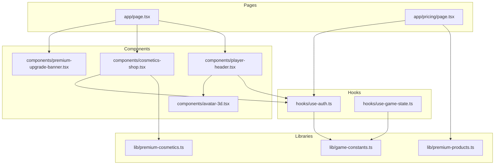
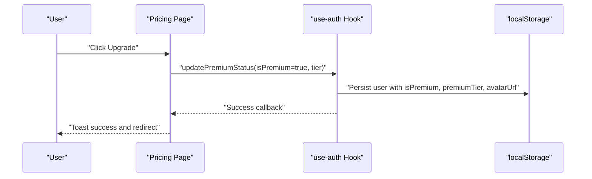
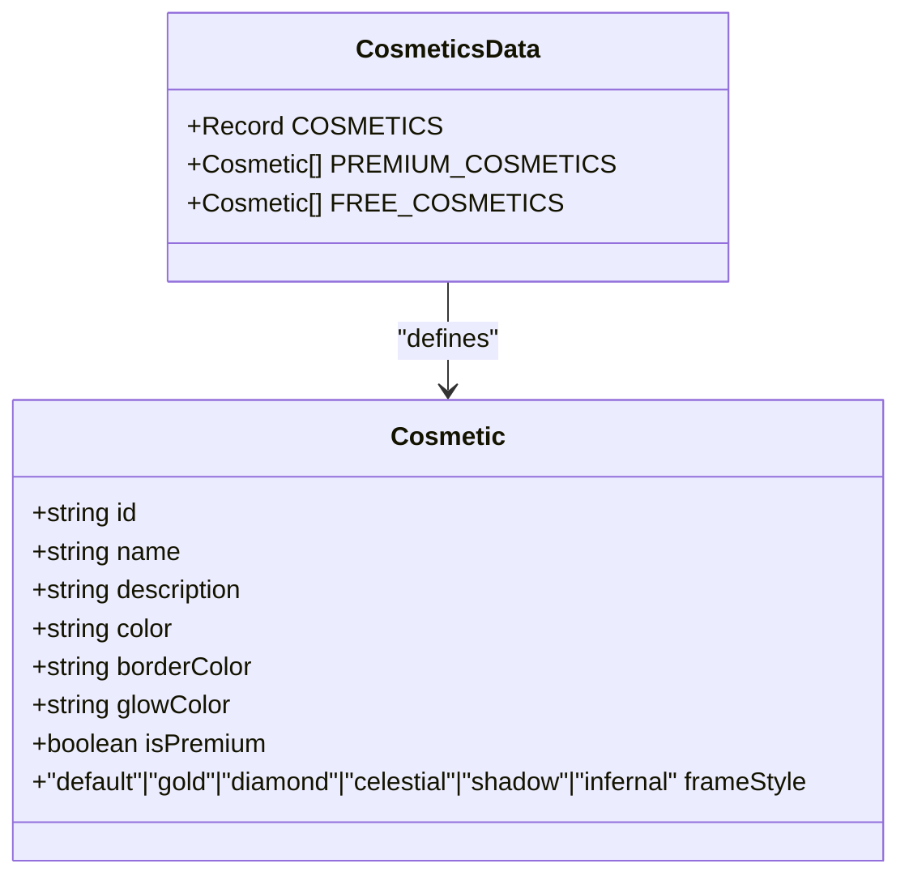
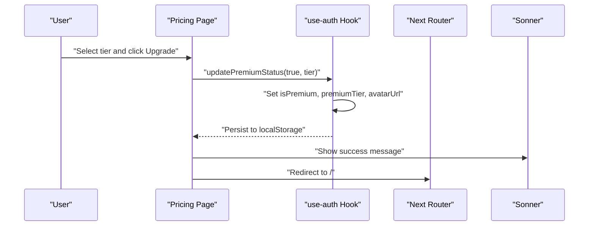
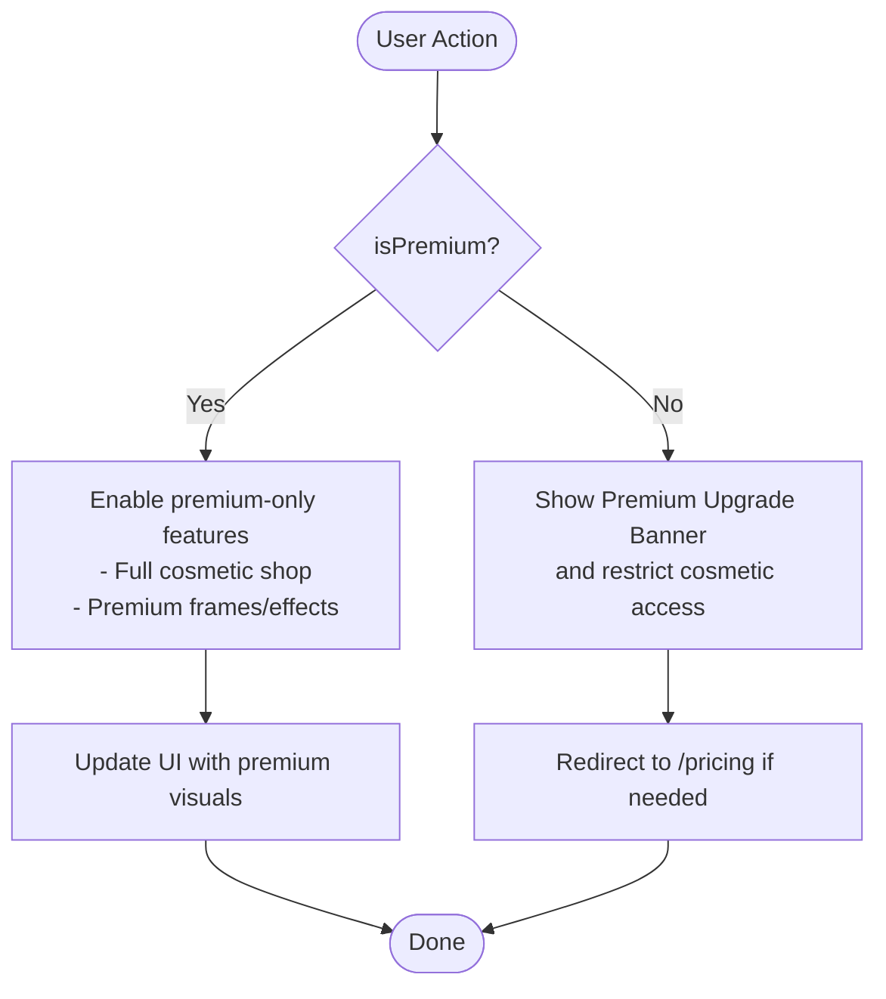
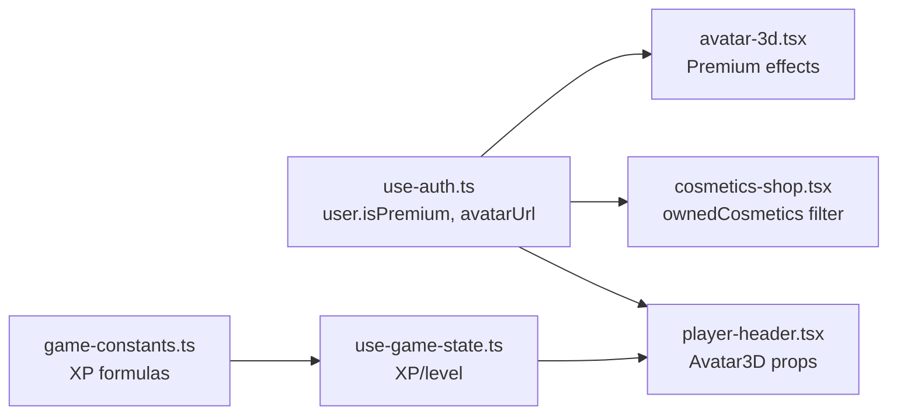
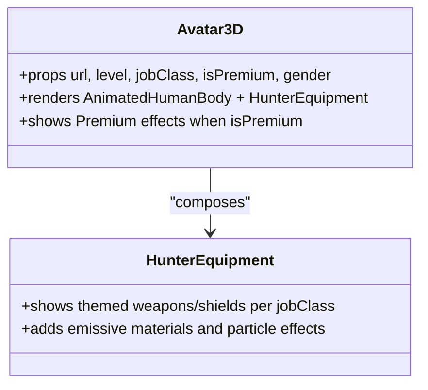
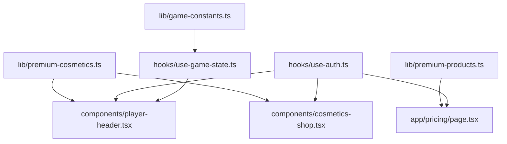

# Premium Features

<cite>
**Referenced Files in This Document**
- [premium-cosmetics.ts](file://lib/premium-cosmetics.ts)
- [premium-products.ts](file://lib/premium-products.ts)
- [use-auth.ts](file://hooks/use-auth.ts)
- [use-game-state.ts](file://hooks/use-game-state.ts)
- [game-constants.ts](file://lib/game-constants.ts)
- [page.tsx](file://app/page.tsx)
- [pricing/page.tsx](file://app/pricing/page.tsx)
- [player-header.tsx](file://components/player-header.tsx)
- [cosmetics-shop.tsx](file://components/cosmetics-shop.tsx)
- [premium-upgrade-banner.tsx](file://components/premium-upgrade-banner.tsx)
- [avatar-3d.tsx](file://components/avatar-3d.tsx)
</cite>

## Table of Contents
1. [Introduction](#introduction)
2. [Project Structure](#project-structure)
3. [Core Components](#core-components)
4. [Architecture Overview](#architecture-overview)
5. [Detailed Component Analysis](#detailed-component-analysis)
6. [Dependency Analysis](#dependency-analysis)
7. [Performance Considerations](#performance-considerations)
8. [Troubleshooting Guide](#troubleshooting-guide)
9. [Conclusion](#conclusion)

## Introduction
This document explains the premium features and monetization system, focusing on the cosmetic system, premium product catalog, upgrade flows, and the integration between premium status and core game functionality. It covers how premium unlocks additional cosmetic categories, enhances visual customization, and integrates with the XP and leveling mechanics to improve the user experience.

## Project Structure
The premium system spans several layers:
- Data models for premium products and cosmetics
- Authentication and user state management
- Game state and XP progression
- UI components for purchasing, cosmetic selection, and avatar presentation
- Integration points across the dashboard and pricing pages

**Diagram sources**
- [premium-cosmetics.ts:1-77](file://lib/premium-cosmetics.ts#L1-L77)
- [premium-products.ts:1-76](file://lib/premium-products.ts#L1-L76)
- [use-auth.ts:1-167](file://hooks/use-auth.ts#L1-L167)
- [use-game-state.ts:1-252](file://hooks/use-game-state.ts#L1-L252)
- [page.tsx:1-384](file://app/page.tsx#L1-L384)
- [pricing/page.tsx:1-176](file://app/pricing/page.tsx#L1-L176)
- [player-header.tsx:1-183](file://components/player-header.tsx#L1-L183)
- [cosmetics-shop.tsx:1-178](file://components/cosmetics-shop.tsx#L1-L178)
- [premium-upgrade-banner.tsx:1-89](file://components/premium-upgrade-banner.tsx#L1-L89)
- [avatar-3d.tsx:1-1361](file://components/avatar-3d.tsx#L1-L1361)

**Section sources**
- [page.tsx:1-384](file://app/page.tsx#L1-L384)
- [pricing/page.tsx:1-176](file://app/pricing/page.tsx#L1-L176)

## Core Components
- Premium cosmetics data model and collections
- Premium product catalog with tiers and features
- Authentication hook managing premium status and selections
- Game state and XP progression integration
- UI components for cosmetic shop, upgrade banners, and avatar preview

Key responsibilities:
- Define cosmetic metadata and categorize free vs premium
- Define premium tiers, pricing, and feature sets
- Persist and update user premium status and selections
- Reflect premium effects in avatar rendering and UI

**Section sources**
- [premium-cosmetics.ts:1-77](file://lib/premium-cosmetics.ts#L1-L77)
- [premium-products.ts:1-76](file://lib/premium-products.ts#L1-L76)
- [use-auth.ts:1-167](file://hooks/use-auth.ts#L1-L167)
- [use-game-state.ts:1-252](file://hooks/use-game-state.ts#L1-L252)

## Architecture Overview
The premium system follows a layered architecture:
- Data layer: product and cosmetic definitions
- State layer: user premium status and selections
- Presentation layer: cosmetic shop, upgrade banner, avatar preview
- Integration layer: XP progression and UI feedback

**Diagram sources**
- [pricing/page.tsx:18-34](file://app/pricing/page.tsx#L18-L34)
- [use-auth.ts:90-109](file://hooks/use-auth.ts#L90-L109)

## Detailed Component Analysis

### Premium Cosmetics System
The cosmetic system defines visual customization options and distinguishes free from premium items. Each cosmetic includes attributes for color, border, glow, and frame style. Collections filter free and premium items for UI consumption.

**Diagram sources**
- [premium-cosmetics.ts:1-77](file://lib/premium-cosmetics.ts#L1-L77)

Practical examples:
- Selecting a premium frame updates the avatar border and glow visuals.
- Free users see only default and free cosmetic options; premium users see the full collection.

**Section sources**
- [premium-cosmetics.ts:12-77](file://lib/premium-cosmetics.ts#L12-L77)
- [cosmetics-shop.tsx:13-17](file://components/cosmetics-shop.tsx#L13-L17)

### Premium Product Catalog and Purchase Workflow
The premium product catalog enumerates tiers with pricing, features, and associated 3D avatar previews. The purchase workflow updates user premium status and avatar, then redirects to the home dashboard.

**Diagram sources**
- [pricing/page.tsx:18-34](file://app/pricing/page.tsx#L18-L34)
- [use-auth.ts:90-109](file://hooks/use-auth.ts#L90-L109)

Pricing simulation:
- Prices are defined in cents and formatted for display.
- Tiers: starter, elite, sovereign with increasing features and costs.

**Section sources**
- [premium-products.ts:13-71](file://lib/premium-products.ts#L13-L71)
- [pricing/page.tsx:139-154](file://app/pricing/page.tsx#L139-L154)

### Premium Gate and Feature Activation
Premium status gates access to premium-only cosmetic frames and effects. The system ensures:
- Premium users receive premium avatars and cosmetic access
- Non-premium users remain on default avatars and limited cosmetic access
- UI components conditionally render based on premium status

**Diagram sources**
- [use-auth.ts:28-58](file://hooks/use-auth.ts#L28-L58)
- [cosmetics-shop.tsx:13-17](file://components/cosmetics-shop.tsx#L13-L17)
- [premium-upgrade-banner.tsx:7-12](file://components/premium-upgrade-banner.tsx#L7-L12)

**Section sources**
- [use-auth.ts:90-109](file://hooks/use-auth.ts#L90-L109)
- [cosmetics-shop.tsx:13-17](file://components/cosmetics-shop.tsx#L13-L17)
- [premium-upgrade-banner.tsx:7-12](file://components/premium-upgrade-banner.tsx#L7-L12)

### Integration Between Premium Status and Game Functionality
Premium status influences:
- Avatar 3D rendering with premium effects and materials
- Cosmetic shop visibility and selection
- Player header premium badge and upgrade prompt
- XP progression enhancements (as indicated by product features)

**Diagram sources**
- [use-auth.ts:28-58](file://hooks/use-auth.ts#L28-L58)
- [player-header.tsx:84-90](file://components/player-header.tsx#L84-L90)
- [cosmetics-shop.tsx:13-17](file://components/cosmetics-shop.tsx#L13-L17)
- [avatar-3d.tsx:1071-1091](file://components/avatar-3d.tsx#L1071-L1091)
- [use-game-state.ts:1-252](file://hooks/use-game-state.ts#L1-L252)
- [game-constants.ts:14-48](file://lib/game-constants.ts#L14-L48)

**Section sources**
- [avatar-3d.tsx:1071-1091](file://components/avatar-3d.tsx#L1071-L1091)
- [player-header.tsx:60-74](file://components/player-header.tsx#L60-L74)
- [use-game-state.ts:143-210](file://hooks/use-game-state.ts#L143-L210)

### Visual Customization Options and Effects
Premium cosmetics provide:
- Distinct color palettes, borders, and glow effects
- Premium-only frames (gold, diamond, celestial, shadow, infernal)
- Avatar 3D enhancements when premium status is active

**Diagram sources**
- [avatar-3d.tsx:9-15](file://components/avatar-3d.tsx#L9-L15)
- [avatar-3d.tsx:561-1094](file://components/avatar-3d.tsx#L561-L1094)

**Section sources**
- [avatar-3d.tsx:1071-1091](file://components/avatar-3d.tsx#L1071-L1091)
- [player-header.tsx:84-90](file://components/player-header.tsx#L84-L90)

### Practical Examples
- Premium feature access: After upgrading, the user gains access to all premium cosmetic frames and avatar effects.
- Cosmetic selection: Premium users can browse and equip any cosmetic; free users see locked premium items.
- Upgrade process: From the pricing page, selecting a tier triggers an update to premium status and avatar, with immediate UI feedback.

**Section sources**
- [pricing/page.tsx:18-34](file://app/pricing/page.tsx#L18-L34)
- [cosmetics-shop.tsx:72-163](file://components/cosmetics-shop.tsx#L72-L163)
- [use-auth.ts:111-120](file://hooks/use-auth.ts#L111-L120)

## Dependency Analysis
The premium system exhibits low coupling and clear separation of concerns:
- Data definitions are isolated in libraries
- State mutations occur in the auth hook
- UI components depend on state and data via props
- No circular dependencies observed

**Diagram sources**
- [premium-cosmetics.ts:1-77](file://lib/premium-cosmetics.ts#L1-L77)
- [premium-products.ts:1-76](file://lib/premium-products.ts#L1-L76)
- [use-auth.ts:1-167](file://hooks/use-auth.ts#L1-L167)
- [use-game-state.ts:1-252](file://hooks/use-game-state.ts#L1-L252)
- [page.tsx:1-384](file://app/page.tsx#L1-L384)
- [pricing/page.tsx:1-176](file://app/pricing/page.tsx#L1-L176)
- [player-header.tsx:1-183](file://components/player-header.tsx#L1-L183)
- [cosmetics-shop.tsx:1-178](file://components/cosmetics-shop.tsx#L1-L178)

**Section sources**
- [page.tsx:24-384](file://app/page.tsx#L24-L384)
- [pricing/page.tsx:13-176](file://app/pricing/page.tsx#L13-L176)

## Performance Considerations
- Premium effects in 3D rendering rely on emissive materials and particle systems; keep counts reasonable for mobile devices.
- Use lazy loading and fallbacks for external GLB models to avoid blocking renders.
- Filter cosmetic lists efficiently by tier to minimize re-renders in the shop UI.
- Cache XP calculations and cosmetic filters to reduce recomputation during frequent UI updates.

## Troubleshooting Guide
Common issues and resolutions:
- Premium upgrade does not persist: Verify local storage keys and ensure the auth hook updates both premium status and avatar URL.
- Cosmetic shop shows no premium items: Confirm user premium status and that the shop filters align with the user’s tier.
- Avatar preview fails: Check model URL validity and fallback logic in the avatar component; inspect network errors and GLTF loader callbacks.
- Level progression anomalies: Validate XP calculation functions and ensure game state persists correctly.

**Section sources**
- [use-auth.ts:90-109](file://hooks/use-auth.ts#L90-L109)
- [cosmetics-shop.tsx:13-17](file://components/cosmetics-shop.tsx#L13-L17)
- [avatar-3d.tsx:1210-1266](file://components/avatar-3d.tsx#L1210-L1266)
- [use-game-state.ts:143-210](file://hooks/use-game-state.ts#L143-L210)

## Conclusion
The premium system integrates seamlessly with the core game by unlocking cosmetic customization and avatar enhancements while maintaining clear upgrade pathways. Premium status influences UI, avatar visuals, and access to exclusive content, reinforcing engagement and progression. The modular design supports future expansion of tiers, cosmetic categories, and premium features.