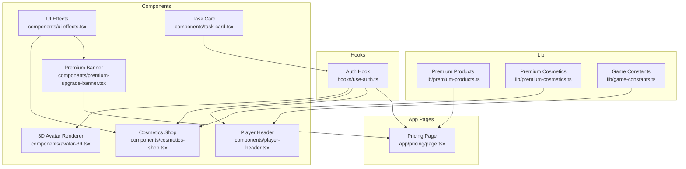
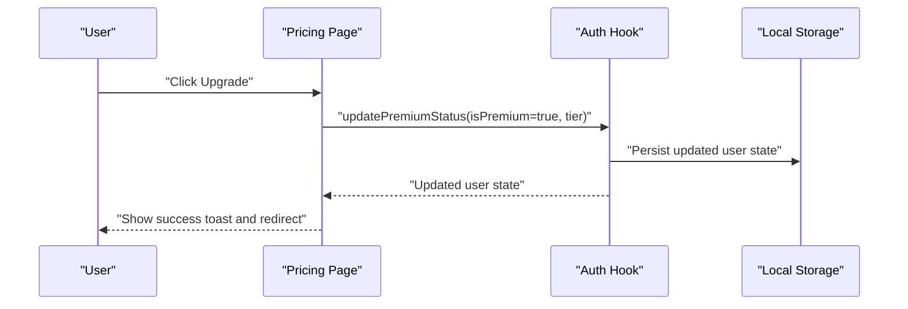
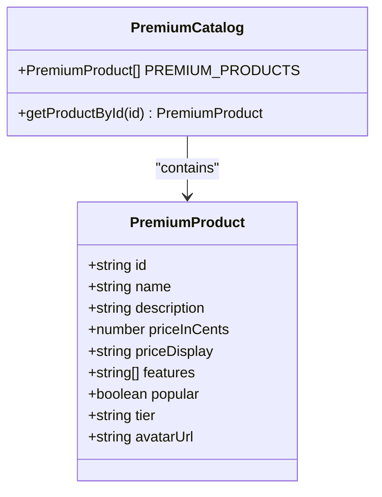
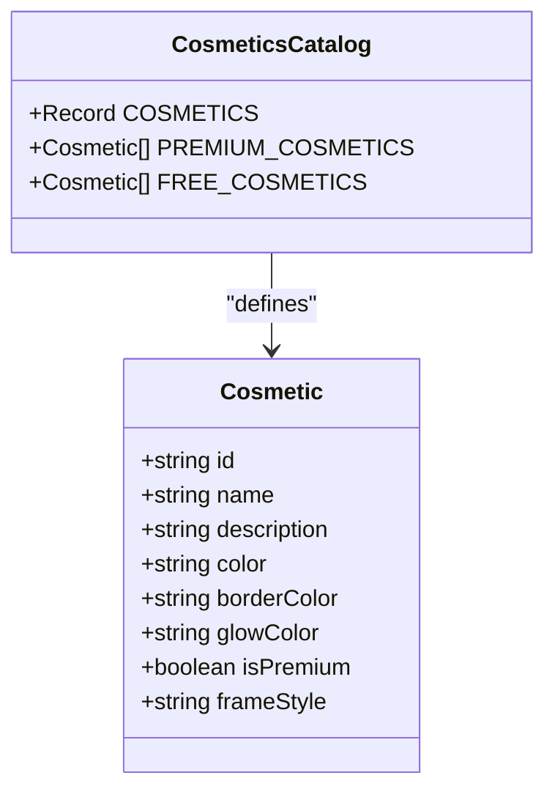
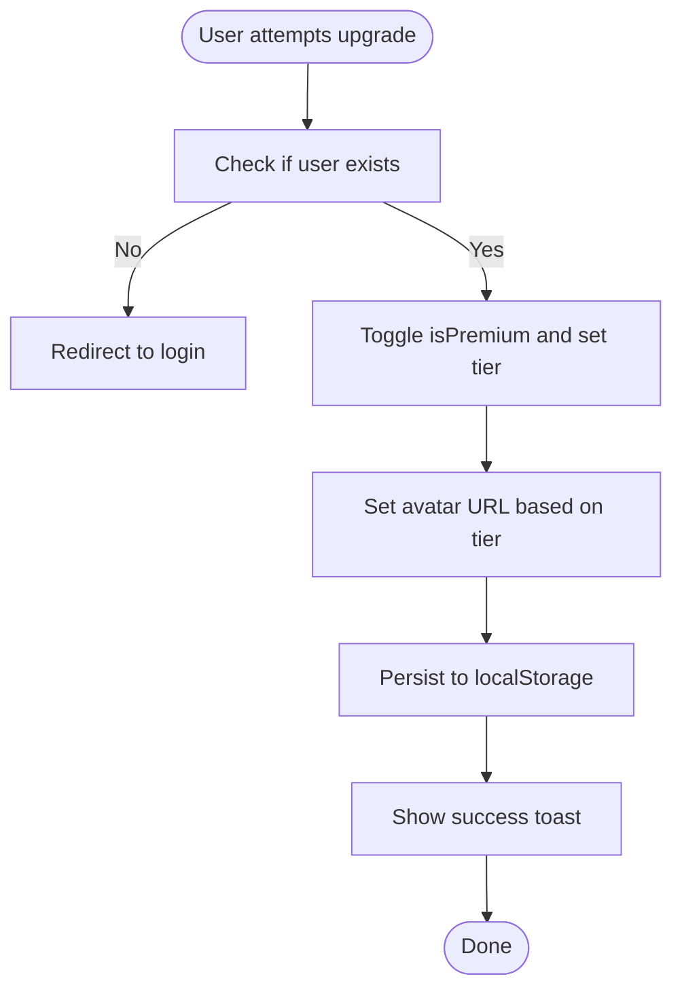
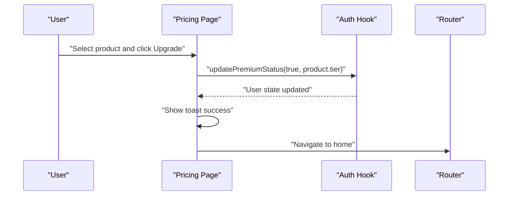
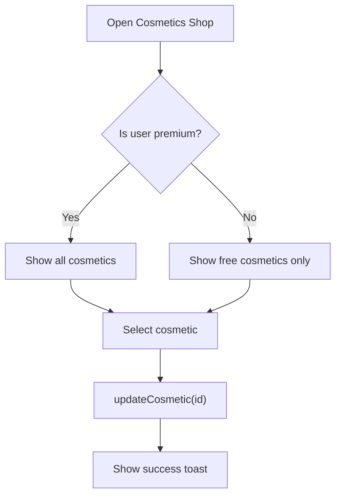
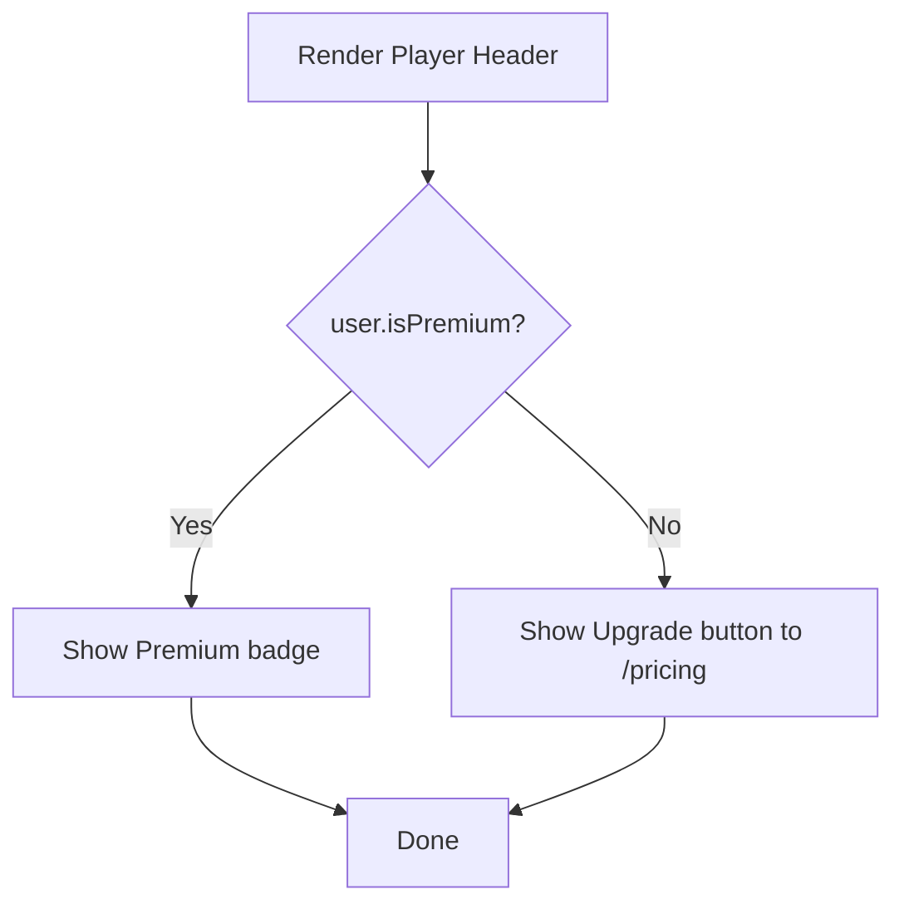
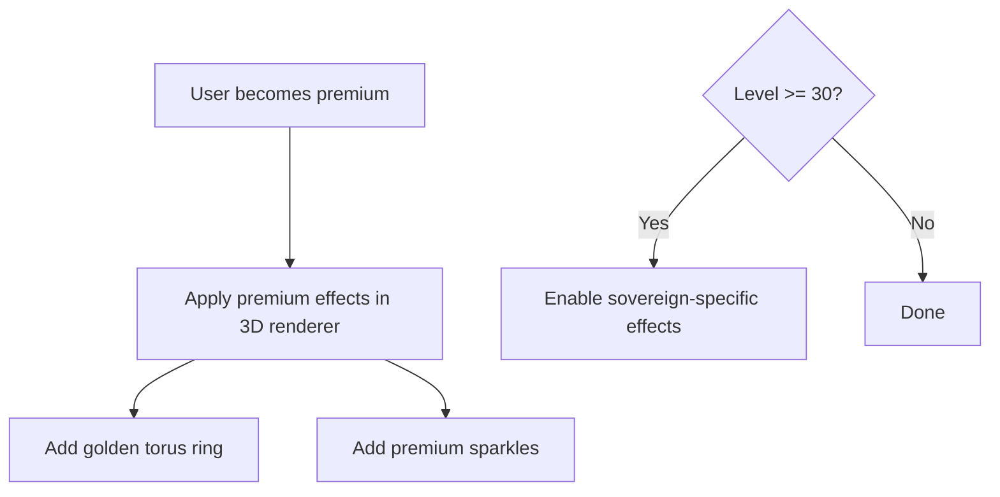
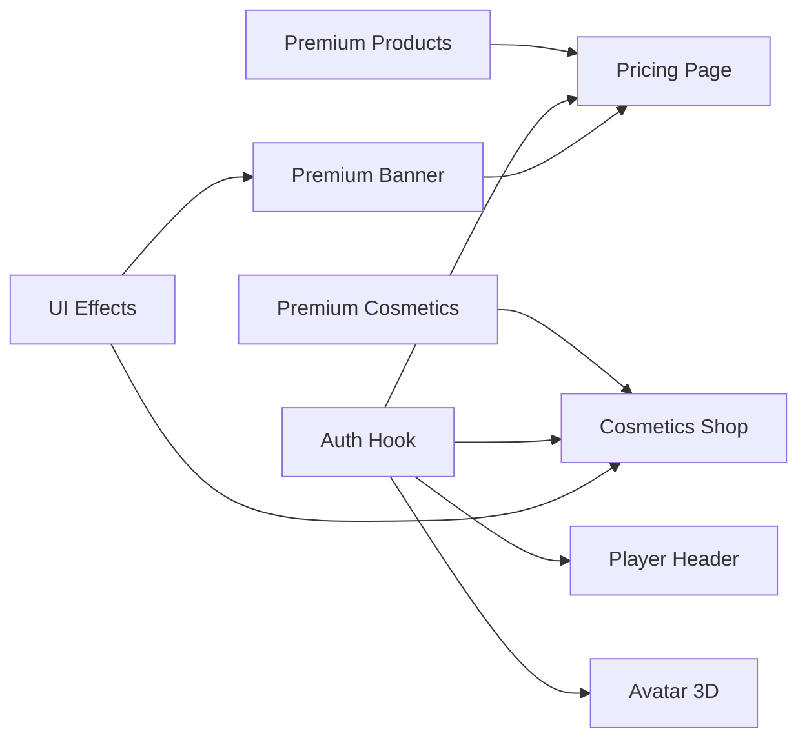

# Premium Products Catalog

<cite>
**Referenced Files in This Document**
- [premium-products.ts](file://lib/premium-products.ts)
- [premium-cosmetics.ts](file://lib/premium-cosmetics.ts)
- [use-auth.ts](file://hooks/use-auth.ts)
- [page.tsx](file://app/pricing/page.tsx)
- [premium-upgrade-banner.tsx](file://components/premium-upgrade-banner.tsx)
- [cosmetics-shop.tsx](file://components/cosmetics-shop.tsx)
- [player-header.tsx](file://components/player-header.tsx)
- [avatar-3d.tsx](file://components/avatar-3d.tsx)
- [ui-effects.tsx](file://components/ui-effects.tsx)
- [task-card.tsx](file://components/task-card.tsx)
- [game-constants.ts](file://lib/game-constants.ts)
</cite>

## Table of Contents
1. [Introduction](#introduction)
2. [Project Structure](#project-structure)
3. [Core Components](#core-components)
4. [Architecture Overview](#architecture-overview)
5. [Detailed Component Analysis](#detailed-component-analysis)
6. [Dependency Analysis](#dependency-analysis)
7. [Performance Considerations](#performance-considerations)
8. [Troubleshooting Guide](#troubleshooting-guide)
9. [Conclusion](#conclusion)

## Introduction
This document explains the premium products catalog and monetization system. It covers the premium product data model, pricing simulation, purchase workflow, premium upgrade banners, UI integration with the pricing page, cosmetic catalog organization, feature restrictions based on premium status, and the upgrade process from free to premium accounts. It also documents the technical implementation of premium gates, feature activation mechanisms, user status management, and the relationship between premium purchases and enhanced game functionality such as AI features, advanced visual effects, and exclusive cosmetics.

## Project Structure
The premium system spans several layers:
- Data models and constants in lib/
- Authentication and user state in hooks/
- UI components in components/
- Application pages in app/

**Diagram sources**
- [premium-products.ts:1-76](file://lib/premium-products.ts#L1-L76)
- [premium-cosmetics.ts:1-77](file://lib/premium-cosmetics.ts#L1-L77)
- [use-auth.ts:1-167](file://hooks/use-auth.ts#L1-L167)
- [page.tsx:1-176](file://app/pricing/page.tsx#L1-L176)
- [premium-upgrade-banner.tsx:1-89](file://components/premium-upgrade-banner.tsx#L1-L89)
- [cosmetics-shop.tsx:1-178](file://components/cosmetics-shop.tsx#L1-L178)
- [player-header.tsx:1-183](file://components/player-header.tsx#L1-L183)
- [avatar-3d.tsx:1000-1094](file://components/avatar-3d.tsx#L1000-L1094)
- [ui-effects.tsx:1-284](file://components/ui-effects.tsx#L1-L284)
- [task-card.tsx:1-186](file://components/task-card.tsx#L1-L186)
- [game-constants.ts:1-95](file://lib/game-constants.ts#L1-L95)

**Section sources**
- [premium-products.ts:1-76](file://lib/premium-products.ts#L1-L76)
- [premium-cosmetics.ts:1-77](file://lib/premium-cosmetics.ts#L1-L77)
- [use-auth.ts:1-167](file://hooks/use-auth.ts#L1-L167)
- [page.tsx:1-176](file://app/pricing/page.tsx#L1-L176)
- [premium-upgrade-banner.tsx:1-89](file://components/premium-upgrade-banner.tsx#L1-L89)
- [cosmetics-shop.tsx:1-178](file://components/cosmetics-shop.tsx#L1-L178)
- [player-header.tsx:1-183](file://components/player-header.tsx#L1-L183)
- [avatar-3d.tsx:1000-1094](file://components/avatar-3d.tsx#L1000-L1094)
- [ui-effects.tsx:1-284](file://components/ui-effects.tsx#L1-L284)
- [task-card.tsx:1-186](file://components/task-card.tsx#L1-L186)
- [game-constants.ts:1-95](file://lib/game-constants.ts#L1-L95)

## Core Components
- Premium product catalog: Defines tiers, pricing, features, and preview avatars.
- Premium cosmetics catalog: Defines cosmetic items, styles, and availability by premium status.
- Authentication hook: Manages user state, premium status, avatar URLs, and cosmetic selection.
- Pricing page: Renders product cards, handles upgrades, and updates user status.
- Premium upgrade banner: Prominently displays upgrade options for non-premium users.
- Cosmetics shop: Filters and displays cosmetics based on premium status.
- Player header: Shows premium badge and upgrade call-to-action.
- 3D avatar renderer: Applies premium visual effects and animations.
- UI effects library: Provides reusable animated UI components for premium presentation.

**Section sources**
- [premium-products.ts:1-76](file://lib/premium-products.ts#L1-L76)
- [premium-cosmetics.ts:1-77](file://lib/premium-cosmetics.ts#L1-L77)
- [use-auth.ts:1-167](file://hooks/use-auth.ts#L1-L167)
- [page.tsx:1-176](file://app/pricing/page.tsx#L1-L176)
- [premium-upgrade-banner.tsx:1-89](file://components/premium-upgrade-banner.tsx#L1-L89)
- [cosmetics-shop.tsx:1-178](file://components/cosmetics-shop.tsx#L1-L178)
- [player-header.tsx:1-183](file://components/player-header.tsx#L1-L183)
- [avatar-3d.tsx:1000-1094](file://components/avatar-3d.tsx#L1000-L1094)
- [ui-effects.tsx:1-284](file://components/ui-effects.tsx#L1-L284)

## Architecture Overview
The premium system follows a layered architecture:
- Data layer: Product and cosmetic catalogs define features and availability.
- State layer: Authentication hook centralizes user state and premium toggling.
- Presentation layer: Pricing page, upgrade banner, and shop present premium options.
- Rendering layer: 3D avatar renderer applies premium visuals based on user status.

**Diagram sources**
- [page.tsx:18-34](file://app/pricing/page.tsx#L18-L34)
- [use-auth.ts:90-109](file://hooks/use-auth.ts#L90-L109)

**Section sources**
- [page.tsx:1-176](file://app/pricing/page.tsx#L1-L176)
- [use-auth.ts:1-167](file://hooks/use-auth.ts#L1-L167)

## Detailed Component Analysis

### Premium Product Data Model
The premium product catalog defines:
- Product identity and metadata (id, name, description, tier).
- Pricing (priceInCents, priceDisplay).
- Features array for marketing and feature gating.
- Popular flag for promotional emphasis.
- Preview avatar URL for 3D rendering.

Implementation highlights:
- Product array with three tiers: starter, elite, sovereign.
- Helper to retrieve a product by ID.

**Diagram sources**
- [premium-products.ts:1-76](file://lib/premium-products.ts#L1-L76)

**Section sources**
- [premium-products.ts:1-76](file://lib/premium-products.ts#L1-L76)

### Premium Cosmetics Catalog
The cosmetic catalog defines:
- Cosmetic identity and attributes (id, name, description, color, border, glow).
- Premium flag to gate visibility and unlock mechanics.
- Frame styles and categories.

Implementation highlights:
- Predefined cosmetic records.
- Filtered lists for free and premium cosmetics.
- Integration with the cosmetics shop and player header.

**Diagram sources**
- [premium-cosmetics.ts:1-77](file://lib/premium-cosmetics.ts#L1-L77)

**Section sources**
- [premium-cosmetics.ts:1-77](file://lib/premium-cosmetics.ts#L1-L77)

### Authentication and User State Management
The auth hook manages:
- User profile (username, gender, job class, selected cosmetic, avatar URL).
- Premium status and tier.
- Local storage persistence.
- Methods to update premium status, cosmetic selection, avatar URL, and job class.
- Login and logout helpers.

Key behaviors:
- On load, restores user from local storage and ensures avatar URLs are set based on premium tier or gender.
- updatePremiumStatus toggles premium state, sets tier, avatar URL, and selected cosmetic accordingly.
- updateCosmetic persists selected cosmetic and shows feedback.

**Diagram sources**
- [page.tsx:18-34](file://app/pricing/page.tsx#L18-L34)
- [use-auth.ts:90-109](file://hooks/use-auth.ts#L90-L109)

**Section sources**
- [use-auth.ts:1-167](file://hooks/use-auth.ts#L1-L167)
- [page.tsx:1-176](file://app/pricing/page.tsx#L1-L176)

### Pricing Page and Purchase Workflow
The pricing page:
- Imports premium products and renders cards with 3D previews.
- Handles upgrade actions by calling updatePremiumStatus.
- Disables upgrade button for existing premium users.
- Shows success notifications and redirects after a delay.

**Diagram sources**
- [page.tsx:18-34](file://app/pricing/page.tsx#L18-L34)
- [use-auth.ts:90-109](file://hooks/use-auth.ts#L90-L109)

**Section sources**
- [page.tsx:1-176](file://app/pricing/page.tsx#L1-L176)

### Premium Upgrade Banner
The premium upgrade banner:
- Renders only for non-premium users.
- Displays promotional messaging and links to the pricing page.
- Uses animated UI effects for engagement.

Integration points:
- Links to /pricing for conversion.
- Complements the player header upgrade button.

**Section sources**
- [premium-upgrade-banner.tsx:1-89](file://components/premium-upgrade-banner.tsx#L1-L89)

### Cosmetics Shop and Feature Activation
The cosmetics shop:
- Filters cosmetics based on premium status (all for premium, free-only for non-premium).
- Allows switching tabs to view “All Cosmetics” or “My Collection”.
- Enables cosmetic selection and updates user state.

**Diagram sources**
- [cosmetics-shop.tsx:7-178](file://components/cosmetics-shop.tsx#L7-L178)
- [use-auth.ts:111-120](file://hooks/use-auth.ts#L111-L120)

**Section sources**
- [cosmetics-shop.tsx:1-178](file://components/cosmetics-shop.tsx#L1-L178)
- [use-auth.ts:1-167](file://hooks/use-auth.ts#L1-L167)

### Player Header and Premium Gates
The player header:
- Shows a premium badge when the user is premium.
- Provides an upgrade button linking to /pricing for non-premium users.
- Integrates with XP calculations and cosmetic styling.

**Diagram sources**
- [player-header.tsx:60-74](file://components/player-header.tsx#L60-L74)

**Section sources**
- [player-header.tsx:1-183](file://components/player-header.tsx#L1-L183)

### Advanced Visual Effects and Premium Activation
Premium activation triggers enhanced visual effects:
- Premium effects include torus rings and sparkles around the avatar.
- Sovereign tier unlocks additional distortion materials and aura geometry.
- Particle systems scale with level to emphasize progression.

**Diagram sources**
- [avatar-3d.tsx:1044-1094](file://components/avatar-3d.tsx#L1044-L1094)

**Section sources**
- [avatar-3d.tsx:1000-1094](file://components/avatar-3d.tsx#L1000-L1094)

### UI Effects Library
Reusable animated UI components enhance premium presentation:
- Glass cards with 3D hover tilt.
- Glowing buttons with gradient transitions.
- Floating elements and pulsing dots for ambient effects.
- Energy bars and neon borders for stat displays.

These components are used across the premium banner, shop, and pricing page.

**Section sources**
- [ui-effects.tsx:1-284](file://components/ui-effects.tsx#L1-L284)

### Practical Examples

#### Example: Product Selection and Payment Simulation
- Navigate to the pricing page and select a product (starter, elite, or sovereign).
- Click “Upgrade Now”; the system checks if the user is logged in.
- If logged in, updatePremiumStatus is called with isPremium true and the chosen tier.
- The user’s avatar URL is updated to match the tier, and a success notification is shown.
- The user is redirected to the home dashboard.

References:
- [page.tsx:18-34](file://app/pricing/page.tsx#L18-L34)
- [use-auth.ts:90-109](file://hooks/use-auth.ts#L90-L109)

#### Example: Cosmetic Unlocking
- Open the cosmetics shop.
- Non-premium users see free cosmetics only.
- Premium users see all cosmetics and can select any unlocked cosmetic.
- Selecting a cosmetic calls updateCosmetic and persists the change.

References:
- [cosmetics-shop.tsx:7-178](file://components/cosmetics-shop.tsx#L7-L178)
- [use-auth.ts:111-120](file://hooks/use-auth.ts#L111-L120)

#### Example: Feature Unlocking
- Premium status enables:
  - Access to premium-only cosmetics and frames.
  - Enhanced avatar visual effects in the 3D renderer.
  - Premium badges and UI enhancements in the player header and shop.

References:
- [premium-cosmetics.ts:1-77](file://lib/premium-cosmetics.ts#L1-L77)
- [avatar-3d.tsx:1044-1094](file://components/avatar-3d.tsx#L1044-L1094)
- [player-header.tsx:60-74](file://components/player-header.tsx#L60-L74)

## Dependency Analysis
The premium system exhibits low coupling and clear separation of concerns:
- lib modules define immutable data structures.
- hooks manage state and persistence.
- components consume data and state to render UI.
- app pages orchestrate user interactions.

**Diagram sources**
- [premium-products.ts:1-76](file://lib/premium-products.ts#L1-L76)
- [premium-cosmetics.ts:1-77](file://lib/premium-cosmetics.ts#L1-L77)
- [use-auth.ts:1-167](file://hooks/use-auth.ts#L1-L167)
- [page.tsx:1-176](file://app/pricing/page.tsx#L1-L176)
- [premium-upgrade-banner.tsx:1-89](file://components/premium-upgrade-banner.tsx#L1-L89)
- [cosmetics-shop.tsx:1-178](file://components/cosmetics-shop.tsx#L1-L178)
- [player-header.tsx:1-183](file://components/player-header.tsx#L1-L183)
- [avatar-3d.tsx:1000-1094](file://components/avatar-3d.tsx#L1000-L1094)
- [ui-effects.tsx:1-284](file://components/ui-effects.tsx#L1-L284)

**Section sources**
- [premium-products.ts:1-76](file://lib/premium-products.ts#L1-L76)
- [premium-cosmetics.ts:1-77](file://lib/premium-cosmetics.ts#L1-L77)
- [use-auth.ts:1-167](file://hooks/use-auth.ts#L1-L167)
- [page.tsx:1-176](file://app/pricing/page.tsx#L1-L176)
- [premium-upgrade-banner.tsx:1-89](file://components/premium-upgrade-banner.tsx#L1-L89)
- [cosmetics-shop.tsx:1-178](file://components/cosmetics-shop.tsx#L1-L178)
- [player-header.tsx:1-183](file://components/player-header.tsx#L1-L183)
- [avatar-3d.tsx:1000-1094](file://components/avatar-3d.tsx#L1000-L1094)
- [ui-effects.tsx:1-284](file://components/ui-effects.tsx#L1-L284)

## Performance Considerations
- 3D rendering: Premium effects and particle systems scale with level; keep counts reasonable to avoid heavy GPU usage.
- Local storage: Frequent writes occur on state changes; batch updates where possible.
- Image/model loading: The avatar renderer validates model URLs and falls back gracefully to ensure smooth UX.
- UI animations: Use CSS transforms and minimal reflows; avoid excessive nested animations.

## Troubleshooting Guide
Common issues and resolutions:
- Upgrade button disabled: Ensure the user is logged in; the pricing page redirects unauthenticated users to login.
- Premium effects not visible: Confirm user.isPremium is true and the avatar URL matches the premium tier.
- Cosmetics not unlocking: Verify the user is premium; free users only see free cosmetics.
- Model load failures: The avatar renderer falls back to a procedural avatar if GLB loading fails.

**Section sources**
- [page.tsx:18-34](file://app/pricing/page.tsx#L18-L34)
- [use-auth.ts:90-109](file://hooks/use-auth.ts#L90-L109)
- [cosmetics-shop.tsx:13-15](file://components/cosmetics-shop.tsx#L13-L15)
- [avatar-3d.tsx:1210-1266](file://components/avatar-3d.tsx#L1210-L1266)

## Conclusion
The premium system integrates a clean data model, robust authentication state management, and visually engaging UI components to deliver a seamless upgrade experience. Premium purchases unlock exclusive cosmetics, enhanced visual effects, and improved progression features, while maintaining a responsive and accessible interface across devices.