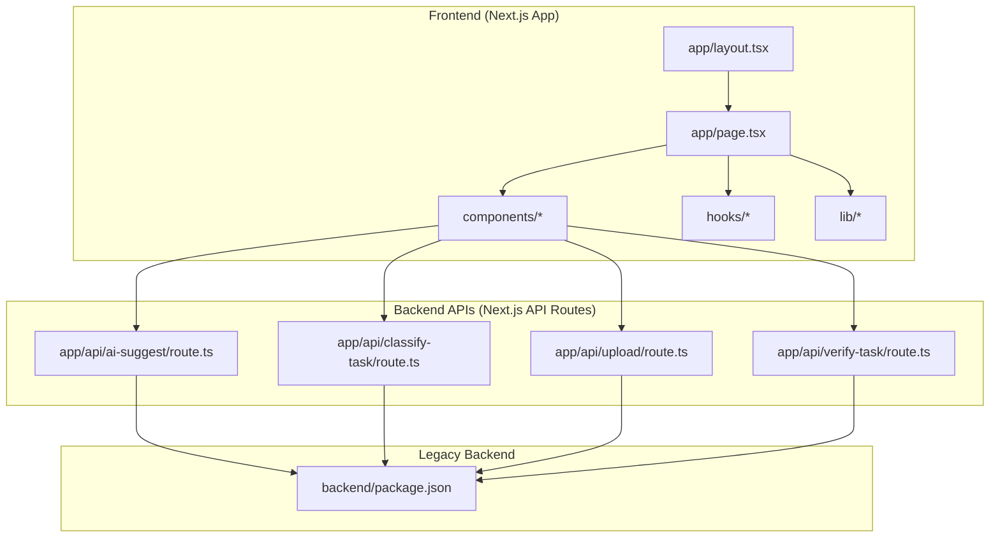
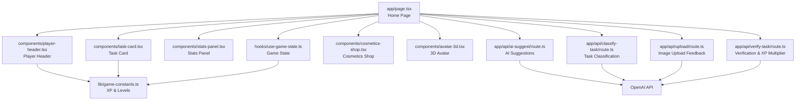
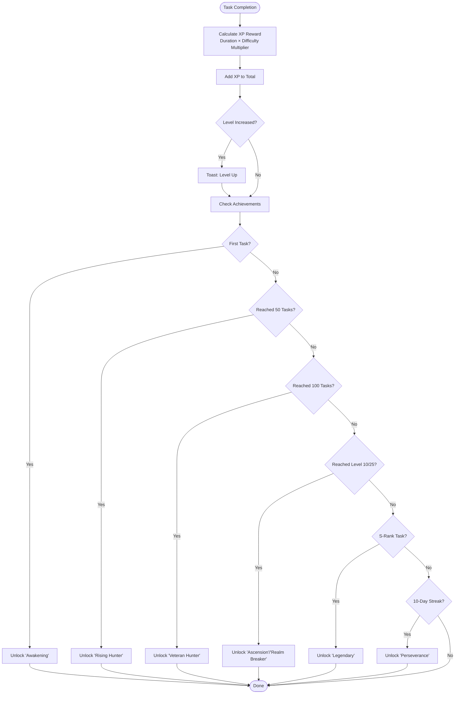
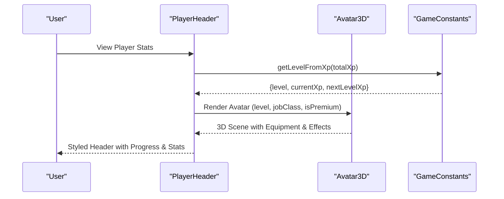
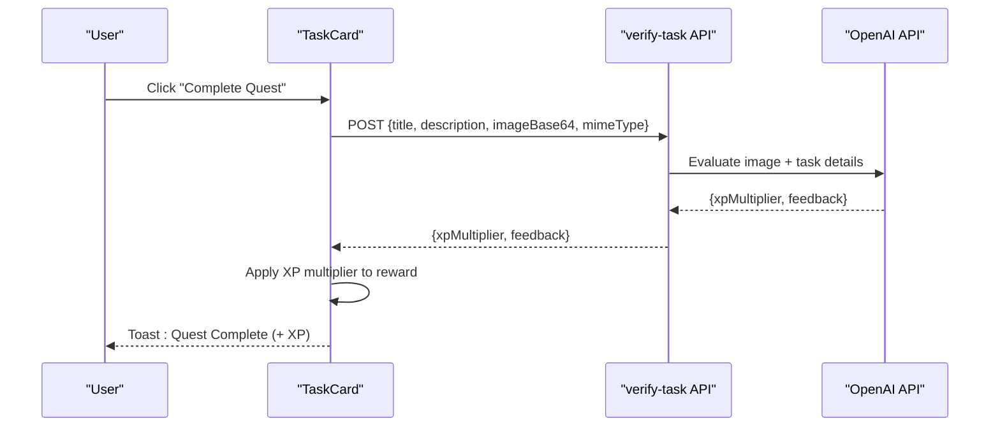
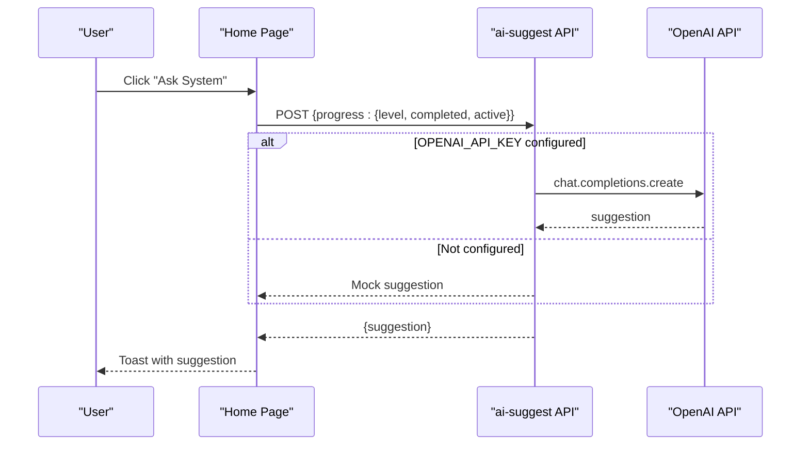
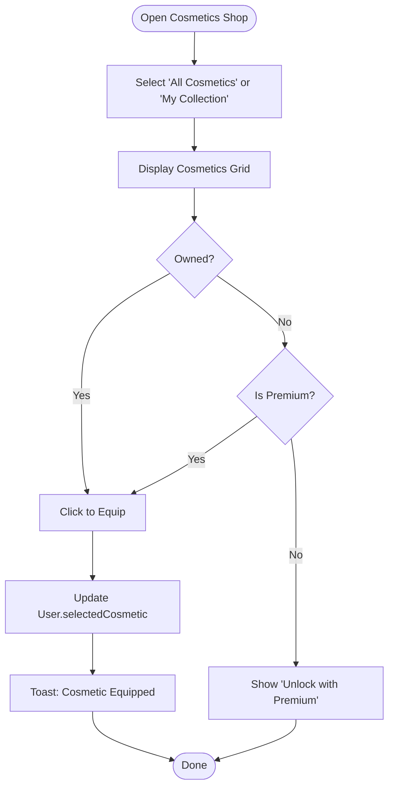
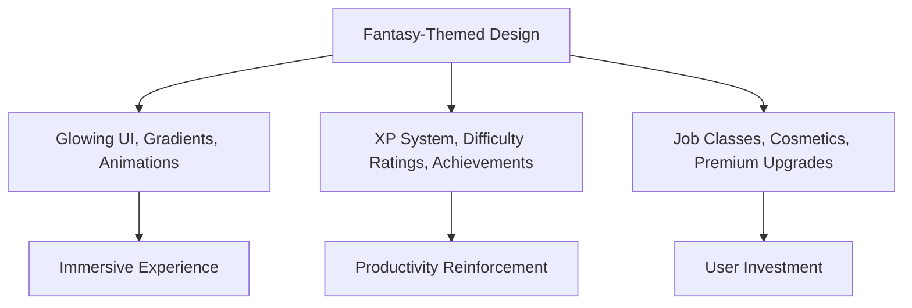
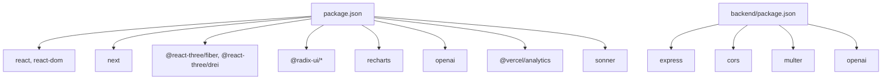

# Project Overview

<cite>
**Referenced Files in This Document**
- [package.json](file://package.json)
- [app/layout.tsx](file://app/layout.tsx)
- [app/page.tsx](file://app/page.tsx)
- [hooks/use-game-state.ts](file://hooks/use-game-state.ts)
- [lib/game-constants.ts](file://lib/game-constants.ts)
- [lib/premium-cosmetics.ts](file://lib/premium-cosmetics.ts)
- [hooks/use-auth.ts](file://hooks/use-auth.ts)
- [components/player-header.tsx](file://components/player-header.tsx)
- [components/stats-panel.tsx](file://components/stats-panel.tsx)
- [components/tabs.tsx](file://components/tabs.tsx)
- [components/task-card.tsx](file://components/task-card.tsx)
- [components/cosmetics-shop.tsx](file://components/cosmetics-shop.tsx)
- [components/avatar-3d.tsx](file://components/avatar-3d.tsx)
- [app/api/ai-suggest/route.ts](file://app/api/ai-suggest/route.ts)
- [app/api/classify-task/route.ts](file://app/api/classify-task/route.ts)
- [app/api/upload/route.ts](file://app/api/upload/route.ts)
- [app/api/verify-task/route.ts](file://app/api/verify-task/route.ts)
- [backend/package.json](file://backend/package.json)
</cite>

## Table of Contents
1. [Introduction](#introduction)
2. [Project Structure](#project-structure)
3. [Core Components](#core-components)
4. [Architecture Overview](#architecture-overview)
5. [Detailed Component Analysis](#detailed-component-analysis)
6. [Dependency Analysis](#dependency-analysis)
7. [Performance Considerations](#performance-considerations)
8. [Troubleshooting Guide](#troubleshooting-guide)
9. [Conclusion](#conclusion)

## Introduction
Solo Leveling Manager is a gamified task management application inspired by the webtoon Solo Leveling. It transforms everyday productivity into an RPG-style journey by integrating an XP system, leveling mechanics, difficulty ratings, achievements, and fantasy-themed visuals. Users complete tasks to earn experience points, grow stronger, unlock achievements, and customize their avatar with premium cosmetics. The platform blends frontend React components with backend AI services to deliver an immersive, motivating experience for daily productivity.

Key value proposition:
- Gamified productivity: Turn routine tasks into meaningful quests with tangible rewards.
- Fantasy immersion: Visual themes, 3D avatars, and themed UI elements reinforce the RPG experience.
- Personalization: Choose a job class, customize your avatar with free and premium cosmetics, and track progress across levels and achievements.
- Intelligent assistance: AI-backed suggestions and verification help users stay motivated and accountable.

Target audience:
- Productivity enthusiasts who enjoy gamification and storytelling.
- Users seeking motivation through XP, levels, and achievements.
- Gamers or fans of fantasy themes who want a thematic twist on task management.

## Project Structure
The project follows a modern Next.js architecture with a clear separation of concerns:
- Frontend (Next.js App Router):
  - Pages and layouts under app/.
  - Reusable UI components under components/.
  - Hooks for state and authentication under hooks/.
  - Shared constants and utilities under lib/.
- Backend services:
  - AI-powered APIs under app/api/* for suggestions, classification, uploads, and verification.
  - Legacy backend service under backend/ (Express server) for potential future expansion.

**Diagram sources**
- [app/layout.tsx:1-48](file://app/layout.tsx#L1-L48)
- [app/page.tsx:1-255](file://app/page.tsx#L1-L255)
- [app/api/ai-suggest/route.ts:1-34](file://app/api/ai-suggest/route.ts#L1-L34)
- [app/api/classify-task/route.ts:1-43](file://app/api/classify-task/route.ts#L1-L43)
- [app/api/upload/route.ts:1-43](file://app/api/upload/route.ts#L1-L43)
- [app/api/verify-task/route.ts:1-55](file://app/api/verify-task/route.ts#L1-L55)
- [backend/package.json:1-13](file://backend/package.json#L1-L13)

**Section sources**
- [package.json:1-78](file://package.json#L1-L78)
- [app/layout.tsx:1-48](file://app/layout.tsx#L1-L48)
- [app/page.tsx:1-255](file://app/page.tsx#L1-L255)

## Core Components
- Game state management:
  - Tracks tasks, XP, level, streaks, and achievements.
  - Persists state locally for continuity across sessions.
- XP system and leveling:
  - Exponential XP progression per level with cumulative XP calculations.
  - Difficulty ratings influence XP rewards.
- Achievements:
  - Unlock milestones such as first task, reaching levels, S-Rank completions, and streaks.
- Authentication and user profile:
  - Manages user identity, premium status, selected cosmetic, job class, and avatar URL.
- Visual and personalization:
  - Player header with dynamic level styling, progress bar, and 3D avatar preview.
  - Cosmetics shop with free and premium cosmetic skins.
- AI integrations:
  - AI suggestions for quests, task classification, image upload feedback, and verification with XP multipliers.

Practical examples:
- Difficulty ratings: Completing a 60-minute S-Rank task yields higher XP than a 30-minute E-Rank task.
- Achievement unlocking: Completing 50 tasks unlocks “Rising Hunter”; reaching Level 25 unlocks “Realm Breaker”.
- Premium cosmetics: Gold, Diamond, Celestial, Shadow, and Infernal frames are available to premium users.

**Section sources**
- [hooks/use-game-state.ts:1-252](file://hooks/use-game-state.ts#L1-L252)
- [lib/game-constants.ts:1-95](file://lib/game-constants.ts#L1-L95)
- [lib/premium-cosmetics.ts:1-77](file://lib/premium-cosmetics.ts#L1-L77)
- [hooks/use-auth.ts:1-122](file://hooks/use-auth.ts#L1-L122)
- [components/player-header.tsx:1-180](file://components/player-header.tsx#L1-L180)
- [components/cosmetics-shop.tsx:1-178](file://components/cosmetics-shop.tsx#L1-L178)
- [components/avatar-3d.tsx:1-529](file://components/avatar-3d.tsx#L1-L529)

## Architecture Overview
The system integrates frontend React components with backend AI services through Next.js API routes. The frontend manages user interactions, state, and presentation, while the backend provides AI-driven insights and verifications.

**Diagram sources**
- [app/page.tsx:1-255](file://app/page.tsx#L1-L255)
- [hooks/use-game-state.ts:1-252](file://hooks/use-game-state.ts#L1-L252)
- [lib/game-constants.ts:1-95](file://lib/game-constants.ts#L1-L95)
- [components/player-header.tsx:1-180](file://components/player-header.tsx#L1-L180)
- [components/stats-panel.tsx:1-145](file://components/stats-panel.tsx#L1-L145)
- [components/task-card.tsx:1-185](file://components/task-card.tsx#L1-L185)
- [components/cosmetics-shop.tsx:1-178](file://components/cosmetics-shop.tsx#L1-L178)
- [components/avatar-3d.tsx:1-529](file://components/avatar-3d.tsx#L1-L529)
- [app/api/ai-suggest/route.ts:1-34](file://app/api/ai-suggest/route.ts#L1-L34)
- [app/api/classify-task/route.ts:1-43](file://app/api/classify-task/route.ts#L1-L43)
- [app/api/upload/route.ts:1-43](file://app/api/upload/route.ts#L1-L43)
- [app/api/verify-task/route.ts:1-55](file://app/api/verify-task/route.ts#L1-L55)

## Detailed Component Analysis

### Game State and XP System
The game state encapsulates tasks, XP, level, streaks, and achievements. It calculates XP rewards based on task duration and difficulty, updates level thresholds, and triggers notifications for level-ups and new achievements.

**Diagram sources**
- [hooks/use-game-state.ts:143-210](file://hooks/use-game-state.ts#L143-L210)
- [lib/game-constants.ts:44-48](file://lib/game-constants.ts#L44-L48)
- [lib/game-constants.ts:50-94](file://lib/game-constants.ts#L50-L94)

**Section sources**
- [hooks/use-game-state.ts:1-252](file://hooks/use-game-state.ts#L1-L252)
- [lib/game-constants.ts:1-95](file://lib/game-constants.ts#L1-L95)

### Player Header and 3D Avatar
The player header displays current level, XP progress, and streaks with dynamic styling based on level. The 3D avatar renders procedurally with class-specific gear, particle effects, and optional premium enhancements.

**Diagram sources**
- [components/player-header.tsx:16-25](file://components/player-header.tsx#L16-L25)
- [lib/game-constants.ts:28-42](file://lib/game-constants.ts#L28-L42)
- [components/avatar-3d.tsx:473-529](file://components/avatar-3d.tsx#L473-L529)

**Section sources**
- [components/player-header.tsx:1-180](file://components/player-header.tsx#L1-L180)
- [components/avatar-3d.tsx:1-529](file://components/avatar-3d.tsx#L1-L529)

### Task Management and Verification
Task cards present difficulty, XP reward, and actions to mark completion. A verification modal integrates with backend APIs to classify tasks, accept images, and evaluate proof with XP multipliers.

**Diagram sources**
- [components/task-card.tsx:24-35](file://components/task-card.tsx#L24-L35)
- [app/api/verify-task/route.ts:8-54](file://app/api/verify-task/route.ts#L8-L54)

**Section sources**
- [components/task-card.tsx:1-185](file://components/task-card.tsx#L1-L185)
- [app/api/verify-task/route.ts:1-55](file://app/api/verify-task/route.ts#L1-L55)

### AI Suggestions Workflow
The home page exposes an “Ask System (AI)” button that sends progress to the AI suggestions endpoint, which either returns a mock suggestion or queries OpenAI for personalized quest recommendations.

**Diagram sources**
- [app/page.tsx:25-54](file://app/page.tsx#L25-L54)
- [app/api/ai-suggest/route.ts:8-33](file://app/api/ai-suggest/route.ts#L8-L33)

**Section sources**
- [app/page.tsx:1-255](file://app/page.tsx#L1-L255)
- [app/api/ai-suggest/route.ts:1-34](file://app/api/ai-suggest/route.ts#L1-L34)

### Cosmetics Shop and Premium Features
The cosmetics shop lists free and premium cosmetic skins. Premium users gain access to exclusive frames and can equip them to personalize their avatar’s appearance.

**Diagram sources**
- [components/cosmetics-shop.tsx:7-177](file://components/cosmetics-shop.tsx#L7-L177)
- [lib/premium-cosmetics.ts:12-77](file://lib/premium-cosmetics.ts#L12-L77)
- [hooks/use-auth.ts:66-75](file://hooks/use-auth.ts#L66-L75)

**Section sources**
- [components/cosmetics-shop.tsx:1-178](file://components/cosmetics-shop.tsx#L1-L178)
- [lib/premium-cosmetics.ts:1-77](file://lib/premium-cosmetics.ts#L1-L77)
- [hooks/use-auth.ts:1-122](file://hooks/use-auth.ts#L1-L122)

### Conceptual Overview
The application’s fantasy-themed design philosophy centers around an immersive RPG experience:
- Visuals: Glowing borders, gradients, animated backgrounds, and 3D avatars enhance the atmosphere.
- Mechanics: Difficulty ratings, XP multipliers, and achievements encourage consistent progress.
- Personalization: Job classes, cosmetic skins, and premium upgrades offer variety and ownership.

[No sources needed since this diagram shows conceptual workflow, not actual code structure]

[No sources needed since this section doesn't analyze specific source files]

## Dependency Analysis
Frontend dependencies include React Three Fiber for 3D rendering, Radix UI for accessible primitives, and Tailwind-based design tokens. Backend AI services rely on OpenAI for natural language understanding and multimodal evaluation.

**Diagram sources**
- [package.json:11-64](file://package.json#L11-L64)
- [backend/package.json:4-11](file://backend/package.json#L4-L11)

**Section sources**
- [package.json:1-78](file://package.json#L1-L78)
- [backend/package.json:1-13](file://backend/package.json#L1-L13)

## Performance Considerations
- Local persistence: Game state and user profiles are stored in localStorage to minimize network requests and improve responsiveness.
- Lazy loading: 3D scenes and heavy components are rendered conditionally to reduce initial load.
- Optimized animations: CSS-based animations and lightweight Three.js materials balance visual appeal and performance.
- AI caching: Responses from AI endpoints should be cached or rate-limited to avoid unnecessary API calls.

[No sources needed since this section provides general guidance]

## Troubleshooting Guide
Common issues and resolutions:
- Missing OpenAI API key:
  - Symptom: AI endpoints return mock responses or errors.
  - Resolution: Set OPENAI_API_KEY in environment variables or remove the key to use mock behavior.
- Authentication problems:
  - Symptom: Login fails or user not found.
  - Resolution: Verify stored credentials and ensure the login function is called with valid parameters.
- 3D avatar loading failures:
  - Symptom: Avatar falls back to procedural geometry or shows errors.
  - Resolution: Validate the avatar URL, ensure it is publicly accessible, and confirm CORS settings.

**Section sources**
- [hooks/use-auth.ts:18-29](file://hooks/use-auth.ts#L18-L29)
- [hooks/use-auth.ts:104-107](file://hooks/use-auth.ts#L104-L107)
- [components/avatar-3d.tsx:382-440](file://components/avatar-3d.tsx#L382-L440)
- [app/api/ai-suggest/route.ts:12-20](file://app/api/ai-suggest/route.ts#L12-L20)

## Conclusion
Solo Leveling Manager reimagines productivity through a fantasy RPG lens. By combining a robust XP system, difficulty-based rewards, achievements, and a vibrant personalization layer, it turns mundane tasks into exciting quests. AI-backed suggestions and verification further enhance motivation and accountability. The modular architecture ensures scalability, while the immersive UI and 3D elements elevate user engagement.

[No sources needed since this section summarizes without analyzing specific files]