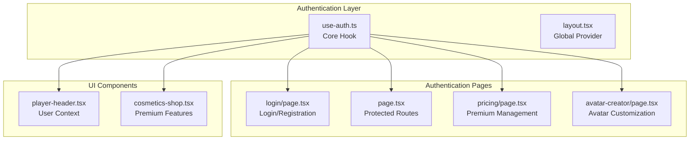
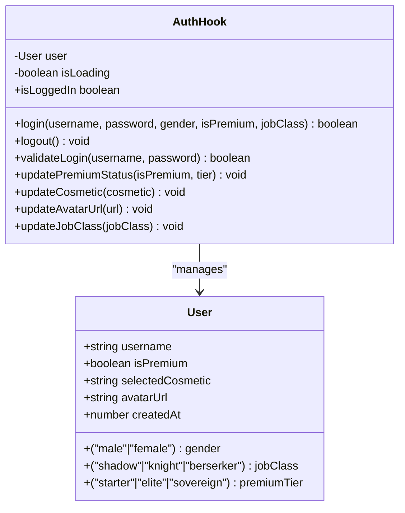
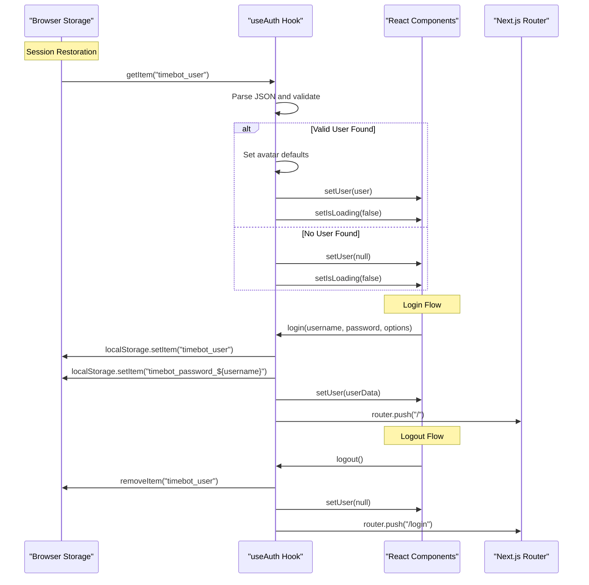
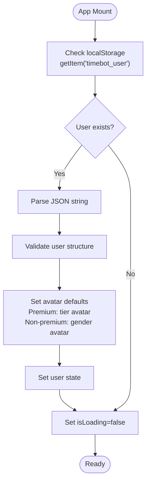
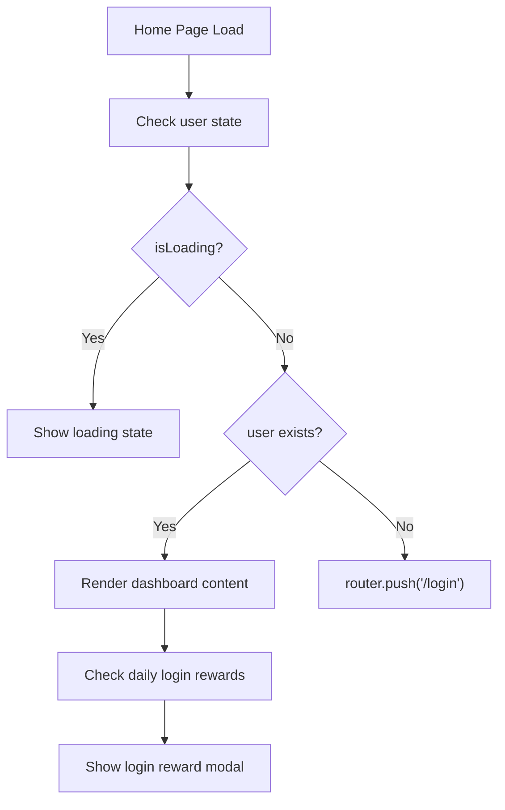

# Authentication Hook

<cite>
**Referenced Files in This Document**
- [use-auth.ts](file://hooks/use-auth.ts)
- [login/page.tsx](file://app/login/page.tsx)
- [layout.tsx](file://app/layout.tsx)
- [page.tsx](file://app/page.tsx)
- [player-header.tsx](file://components/player-header.tsx)
- [pricing/page.tsx](file://app/pricing/page.tsx)
- [cosmetics-shop.tsx](file://components/cosmetics-shop.tsx)
- [avatar-creator/page.tsx](file://app/avatar-creator/page.tsx)
- [package.json](file://package.json)
</cite>

## Table of Contents
1. [Introduction](#introduction)
2. [Project Structure](#project-structure)
3. [Core Components](#core-components)
4. [Architecture Overview](#architecture-overview)
5. [Detailed Component Analysis](#detailed-component-analysis)
6. [Dependency Analysis](#dependency-analysis)
7. [Performance Considerations](#performance-considerations)
8. [Security Considerations](#security-considerations)
9. [Troubleshooting Guide](#troubleshooting-guide)
10. [Conclusion](#conclusion)

## Introduction

The useAuth hook is a comprehensive authentication state management solution for the Time Bot application. It provides user session handling, login/logout functionality, and user context propagation throughout the Next.js application. This hook manages authentication state using localStorage as the primary persistence mechanism and integrates seamlessly with the application's gamified task management system.

The authentication system is designed around a fantasy-themed gaming experience where users create hunter profiles, customize their avatars, and progress through levels while managing tasks and earning experience points. The useAuth hook serves as the central state manager for all authentication-related functionality.

## Project Structure

The authentication system is organized across several key areas of the application:



**Diagram sources**
- [use-auth.ts:1-167](file://hooks/use-auth.ts#L1-L167)
- [login/page.tsx:1-668](file://app/login/page.tsx#L1-L668)
- [page.tsx:1-384](file://app/page.tsx#L1-L384)

**Section sources**
- [use-auth.ts:1-167](file://hooks/use-auth.ts#L1-L167)
- [login/page.tsx:1-668](file://app/login/page.tsx#L1-L668)
- [page.tsx:1-384](file://app/page.tsx#L1-L384)

## Core Components

### Authentication State Structure

The useAuth hook manages a comprehensive user state structure that encompasses all aspects of the gaming experience:



**Diagram sources**
- [use-auth.ts:4-13](file://hooks/use-auth.ts#L4-L13)
- [use-auth.ts:28-166](file://hooks/use-auth.ts#L28-L166)

The authentication state includes:

- **Basic Profile Information**: Username, gender selection, and creation timestamp
- **Game Progression**: Job class selection (Shadow Hunter, Holy Knight, Inferno Berserker)
- **Premium Status**: Tier-based premium membership with cosmetic unlocks
- **Avatar Management**: 3D avatar URL, cosmetic selection, and customization options
- **Session State**: Loading indicators and authentication status tracking

**Section sources**
- [use-auth.ts:4-13](file://hooks/use-auth.ts#L4-L13)
- [use-auth.ts:28-166](file://hooks/use-auth.ts#L28-L166)

## Architecture Overview

The authentication architecture follows a centralized state management pattern with automatic session restoration:



**Diagram sources**
- [use-auth.ts:32-58](file://hooks/use-auth.ts#L32-L58)
- [use-auth.ts:60-88](file://hooks/use-auth.ts#L60-L88)
- [use-auth.ts:142-147](file://hooks/use-auth.ts#L142-L147)

**Section sources**
- [use-auth.ts:32-58](file://hooks/use-auth.ts#L32-L58)
- [use-auth.ts:60-88](file://hooks/use-auth.ts#L60-L88)
- [use-auth.ts:142-147](file://hooks/use-auth.ts#L142-L147)

## Detailed Component Analysis

### useAuth Hook Implementation

The useAuth hook provides comprehensive authentication state management with the following key capabilities:

#### Session Restoration and Validation

The hook automatically restores user sessions on application startup by checking localStorage for stored user data:



**Diagram sources**
- [use-auth.ts:32-58](file://hooks/use-auth.ts#L32-L58)

#### Login and Registration Flow

The login function handles both new user registration and existing user authentication:

**Section sources**
- [use-auth.ts:60-88](file://hooks/use-auth.ts#L60-L88)

#### Premium Management System

The premium system provides tier-based access to exclusive features:

**Section sources**
- [use-auth.ts:90-109](file://hooks/use-auth.ts#L90-L109)

#### User Context Propagation

Components throughout the application can access authentication state through the useAuth hook:

**Section sources**
- [player-header.tsx:23](file://components/player-header.tsx#L23)
- [cosmetics-shop.tsx:8](file://components/cosmetics-shop.tsx#L8)

### Protected Route Implementation

The application implements automatic protected routing through the main dashboard page:



**Diagram sources**
- [page.tsx:105-109](file://app/page.tsx#L105-L109)
- [page.tsx:86-97](file://app/page.tsx#L86-L97)

**Section sources**
- [page.tsx:105-109](file://app/page.tsx#L105-L109)
- [page.tsx:86-97](file://app/page.tsx#L86-L97)

### Login Page Integration

The login page provides a comprehensive authentication interface:

**Section sources**
- [login/page.tsx:224-312](file://app/login/page.tsx#L224-L312)

### Premium Feature Integration

Premium functionality is integrated across multiple application sections:

**Section sources**
- [pricing/page.tsx:14-34](file://app/pricing/page.tsx#L14-L34)
- [cosmetics-shop.tsx:8](file://components/cosmetics-shop.tsx#L8)

## Dependency Analysis

The authentication system relies on several key dependencies and external integrations:

```mermaid
graph LR
subgraph "Core Dependencies"
REACT[React 19.2.4]
NEXT[Next.js 16.2.0]
SONNER[sonner 1.7.1]
end
subgraph "3D Avatar System"
THREE[three 0.173.0]
DREI[@react-three/drei 10.7.7]
FIBER[@react-three/fiber 9.5.0]
end
subgraph "UI Framework"
RADIX[Radix UI Components]
TAILWIND[Tailwind CSS]
RECHARTS[Recharts 2.15.0]
end
subgraph "Authentication Layer"
LOCALSTORAGE[localStorage API]
TOASTER[sonner notifications]
end
REACT --> NEXT
NEXT --> LOCALSTORAGE
NEXT --> TOASTER
THREE --> DREI
THREE --> FIBER
REACT --> RADIX
REACT --> TAILWIND
```

**Diagram sources**
- [package.json:11-64](file://package.json#L11-L64)

**Section sources**
- [package.json:11-64](file://package.json#L11-L64)

## Performance Considerations

The authentication system is designed with several performance optimizations:

### Local Storage Optimization
- Single localStorage read during initialization
- Efficient JSON parsing and validation
- Minimal re-renders through proper state management

### Memory Management
- Automatic cleanup of invalid user data
- Efficient state updates using React's setState batching
- Proper cleanup of event listeners and intervals

### UI Performance
- Loading states prevent unnecessary re-renders
- Conditional rendering based on authentication status
- Optimized avatar loading with fallback URLs

## Security Considerations

The current authentication implementation uses localStorage for session storage, which has important security implications:

### Current Security Model
- **Local Storage**: User credentials and session data stored locally
- **Password Storage**: Plain text passwords stored with username prefix
- **Session Persistence**: Automatic session restoration on browser reload

### Security Recommendations

Given the current implementation, several security improvements are recommended:

#### Immediate Improvements
- **Password Hashing**: Implement bcrypt or similar hashing for password storage
- **Secure Storage**: Consider using HttpOnly cookies for sensitive data
- **Token-Based Authentication**: Implement JWT tokens for server-side validation
- **CSRF Protection**: Add CSRF tokens for form submissions

#### Long-term Enhancements
- **Server-Side Sessions**: Move authentication to server-side sessions
- **OAuth Integration**: Add OAuth providers (Google, GitHub, Discord)
- **Two-Factor Authentication**: Implement 2FA for enhanced security
- **Session Timeout**: Add automatic logout after inactivity

**Section sources**
- [use-auth.ts:149-152](file://hooks/use-auth.ts#L149-L152)

## Troubleshooting Guide

### Common Authentication Issues

#### Session Not Restoring
**Symptoms**: Users are redirected to login page despite having accounts
**Causes**: Corrupted localStorage data or invalid JSON format
**Solutions**:
- Clear browser localStorage manually
- Check for corrupted user data entries
- Verify JSON parsing in useEffect

#### Login Failures
**Symptoms**: Login attempts fail with validation errors
**Causes**: Empty username/password fields or incorrect validation
**Solutions**:
- Ensure both username and password are provided
- Check validateLogin function implementation
- Verify password storage format

#### Premium Feature Access Issues
**Symptoms**: Premium features not unlocking despite payment
**Causes**: Incorrect premium tier assignment or avatar URL issues
**Solutions**:
- Verify updatePremiumStatus function parameters
- Check premium avatar URL mapping
- Ensure proper state updates

#### Avatar Loading Problems
**Symptoms**: 3D avatars not displaying correctly
**Causes**: Invalid avatar URLs or model loading failures
**Solutions**:
- Verify avatar URL format and accessibility
- Check Ready Player Me model availability
- Implement fallback avatar loading

**Section sources**
- [use-auth.ts:32-58](file://hooks/use-auth.ts#L32-L58)
- [use-auth.ts:149-152](file://hooks/use-auth.ts#L149-L152)

## Conclusion

The useAuth hook provides a robust foundation for authentication state management in the Time Bot application. It successfully handles user session management, login/logout functionality, and user context propagation across the Next.js application. The hook's design accommodates the application's gamified nature with comprehensive user profile management, premium feature integration, and avatar customization capabilities.

Key strengths of the implementation include:
- **Automatic Session Restoration**: Seamless user experience through localStorage persistence
- **Comprehensive State Management**: Complete user profile and game progression tracking
- **Flexible Premium System**: Tier-based premium membership with cosmetic unlocks
- **Integrated UI Components**: Consistent authentication state across all application pages

The system is well-suited for the current application requirements but would benefit from enhanced security measures, particularly around password storage and session management. The modular design allows for easy integration of additional authentication providers and advanced security features as the application evolves.

Future enhancements could include server-side authentication, OAuth integration, and improved security measures while maintaining the current user-friendly interface and seamless experience.