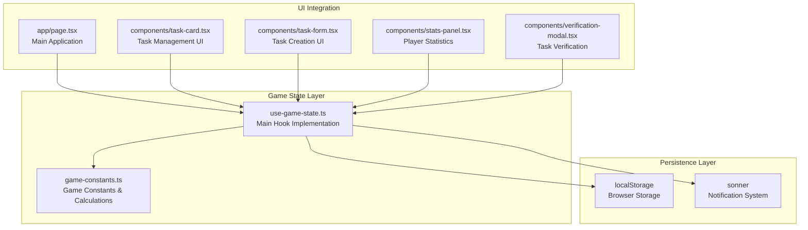
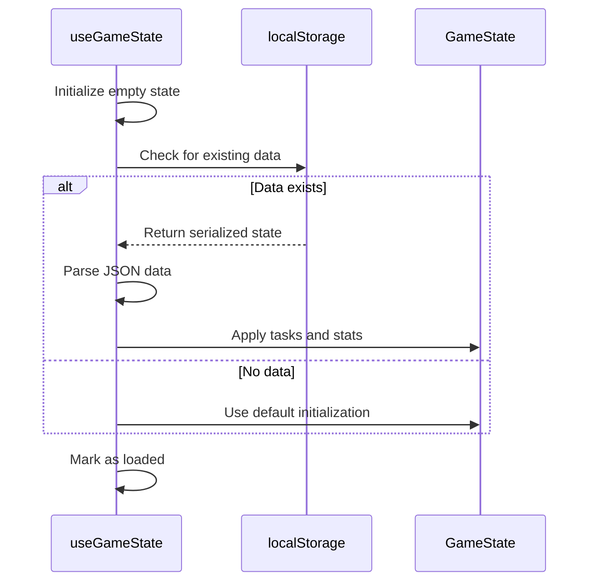
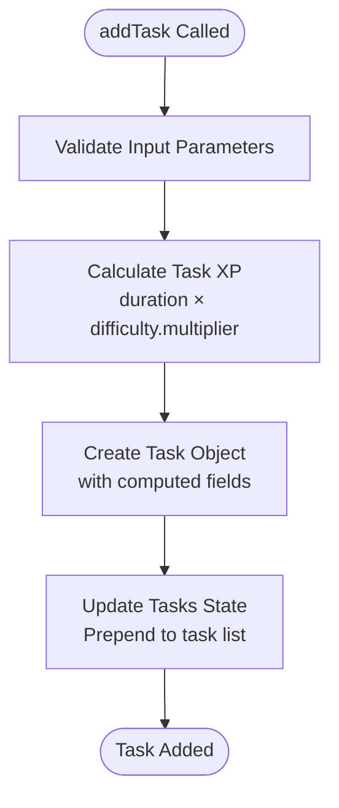
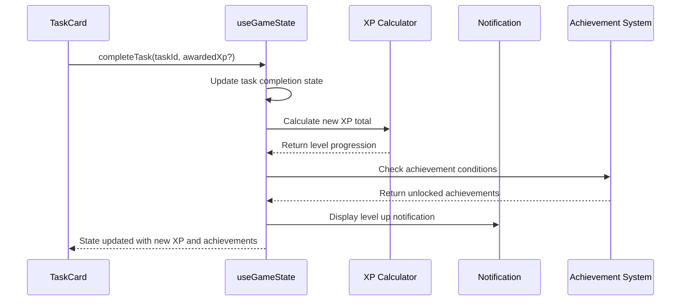
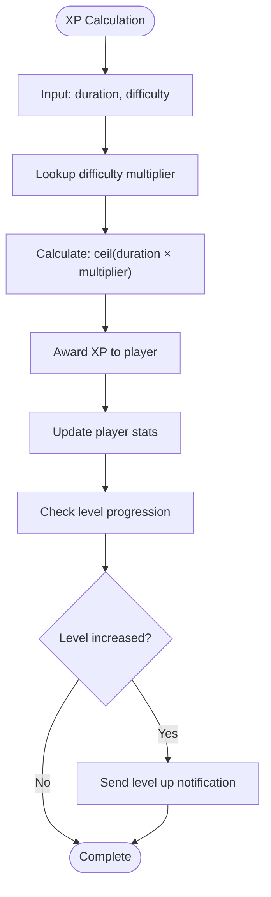
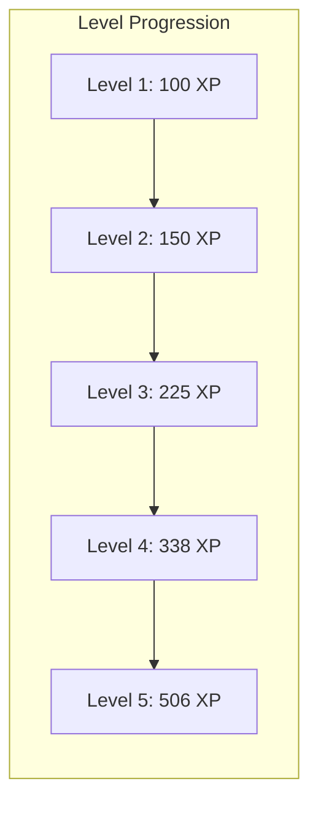
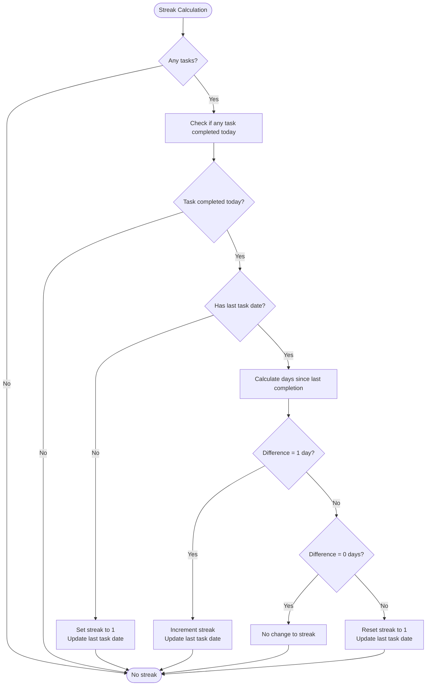
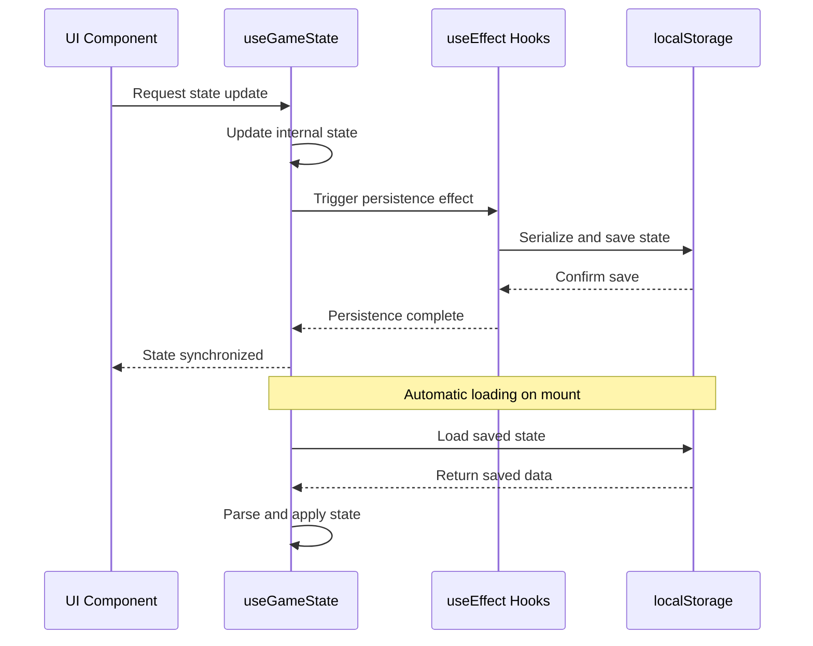
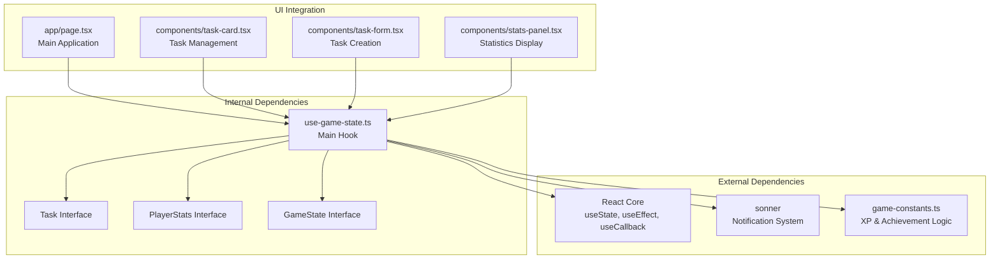

# Game State Hook

<cite>
**Referenced Files in This Document**
- [use-game-state.ts](file://hooks/use-game-state.ts)
- [game-constants.ts](file://lib/game-constants.ts)
- [page.tsx](file://app/page.tsx)
- [task-card.tsx](file://components/task-card.tsx)
- [task-form.tsx](file://components/task-form.tsx)
- [stats-panel.tsx](file://components/stats-panel.tsx)
- [verification-modal.tsx](file://components/verification-modal.tsx)
</cite>

## Table of Contents
1. [Introduction](#introduction)
2. [Project Structure](#project-structure)
3. [Core Components](#core-components)
4. [Architecture Overview](#architecture-overview)
5. [Detailed Component Analysis](#detailed-component-analysis)
6. [Dependency Analysis](#dependency-analysis)
7. [Performance Considerations](#performance-considerations)
8. [Troubleshooting Guide](#troubleshooting-guide)
9. [Conclusion](#conclusion)

## Introduction

The useGameState hook is the central state management system for the Solo Leveling game implementation. It provides a comprehensive gaming experience with task management, XP progression, level advancement, streak tracking, and achievement systems. This hook encapsulates all game state logic while maintaining seamless integration with React's component ecosystem through proper state synchronization and persistence mechanisms.

The hook implements a sophisticated game loop that manages player progression through carefully balanced XP calculations, difficulty-based rewards, and social engagement features. It serves as the backbone for the entire gaming experience, coordinating between UI components, user interactions, and persistent storage.

## Project Structure

The game state implementation follows a modular architecture with clear separation of concerns:



**Diagram sources**
- [use-game-state.ts:1-252](file://hooks/use-game-state.ts#L1-L252)
- [game-constants.ts:1-95](file://lib/game-constants.ts#L1-L95)
- [page.tsx:1-200](file://app/page.tsx#L1-L200)

**Section sources**
- [use-game-state.ts:1-252](file://hooks/use-game-state.ts#L1-L252)
- [game-constants.ts:1-95](file://lib/game-constants.ts#L1-L95)

## Core Components

### State Structure Definition

The useGameState hook manages two primary state objects with well-defined interfaces:

**Task Interface**: Represents individual game objectives with comprehensive metadata
- Unique identifier for task tracking
- Title and description for user interaction
- Duration in minutes for time-based calculations
- Difficulty ranking (E, D, C, B, A, S) with exponential XP multipliers
- Completion tracking with timestamps
- XP reward calculation and creation metadata

**PlayerStats Interface**: Comprehensive player progression tracking
- Total accumulated experience points
- Current player level with progression metrics
- Completed task count for milestone tracking
- Daily streak calculation with date-based validation
- Achievement unlock tracking
- Last task completion date for streak continuity

**GameState Interface**: Public API surface for external components
- Full task collection management
- Player statistics access
- Core game operations (add, complete, delete tasks)
- Utility methods for filtered task access
- Achievement and XP calculation helpers

**Section sources**
- [use-game-state.ts:15-47](file://hooks/use-game-state.ts#L15-L47)

### Initialization Patterns

The hook establishes robust initialization through controlled state loading:



**Diagram sources**
- [use-game-state.ts:62-75](file://hooks/use-game-state.ts#L62-L75)

**Section sources**
- [use-game-state.ts:51-60](file://hooks/use-game-state.ts#L51-L60)

## Architecture Overview

The game state architecture implements a reactive pattern with automatic persistence and real-time synchronization:

```mermaid
graph TD
subgraph "State Management"
TS[tasks: Task[]]
PS[playerStats: PlayerStats]
IS[isLoaded: boolean]
end
subgraph "Persistence Layer"
LS[localStorage.setItem/getItem]
SK[solo_leveling_game key]
end
subgraph "Calculation Engine"
CT[calculateTaskXp]
GL[getLevelFromXp]
GA[getCumulativeXp]
XP[getXpForLevel]
end
subgraph "Achievement System"
AC[ACHIEVEMENTS]
UA[unlockedAchievements]
end
TS --> LS
PS --> LS
CT --> TS
GL --> PS
AC --> UA
LS --> TS
LS --> PS
```

**Diagram sources**
- [use-game-state.ts:49-82](file://hooks/use-game-state.ts#L49-L82)
- [game-constants.ts:44-48](file://lib/game-constants.ts#L44-L48)
- [game-constants.ts:28-42](file://lib/game-constants.ts#L28-L42)

**Section sources**
- [use-game-state.ts:49-82](file://hooks/use-game-state.ts#L49-L82)
- [game-constants.ts:1-95](file://lib/game-constants.ts#L1-L95)

## Detailed Component Analysis

### Core Game Logic Functions

#### Task Management Operations

**addTask Function**: Creates new tasks with automatic XP calculation and metadata assignment

The addTask operation implements a comprehensive task creation pipeline:

1. **Input Validation**: Receives task parameters excluding computed fields
2. **XP Calculation**: Uses difficulty multipliers and duration to determine rewards
3. **Metadata Assignment**: Generates unique identifiers and timestamps
4. **State Update**: Inserts new task at the beginning of the task list



**Diagram sources**
- [use-game-state.ts:127-141](file://hooks/use-game-state.ts#L127-L141)

**Section sources**
- [use-game-state.ts:127-141](file://hooks/use-game-state.ts#L127-L141)

#### Task Completion Processing

**completeTask Function**: Handles task completion with XP awarding, level progression, and achievement checking

The completion process involves multiple interconnected systems:

1. **Task State Update**: Marks task as completed with timestamp
2. **XP Calculation**: Awards either predefined or verified XP
3. **Level Progression**: Updates total XP and checks for level increases
4. **Achievement Validation**: Triggers achievement unlock conditions
5. **Streak Management**: Updates daily streak counters



**Diagram sources**
- [use-game-state.ts:143-210](file://hooks/use-game-state.ts#L143-L210)

**Section sources**
- [use-game-state.ts:143-210](file://hooks/use-game-state.ts#L143-L210)

#### Task Deletion Mechanism

**deleteTask Function**: Removes tasks from the active collection with immediate state updates

The deletion process maintains state consistency through immutable updates:

1. **Filter Operation**: Creates new task array excluding target task
2. **State Replacement**: Updates tasks state atomically
3. **UI Synchronization**: Immediate reflection in task lists

**Section sources**
- [use-game-state.ts:212-214](file://hooks/use-game-state.ts#L212-L214)

### XP Calculation Algorithms

The XP system implements an exponential growth curve designed to balance early progression with long-term sustainability:



**Diagram sources**
- [game-constants.ts:44-48](file://lib/game-constants.ts#L44-L48)
- [use-game-state.ts:129](file://hooks/use-game-state.ts#L129)

**Section sources**
- [game-constants.ts:13-48](file://lib/game-constants.ts#L13-L48)

### Level Progression System

The level system uses a geometric progression formula that accelerates difficulty as players advance:

**XP for Level Formula**: `100 × 1.5^(level-1)`
**Cumulative XP Calculation**: Summation of all previous level requirements
**Level Detection**: Iterative calculation until requirement threshold is met



**Diagram sources**
- [game-constants.ts:14-42](file://lib/game-constants.ts#L14-L42)

**Section sources**
- [game-constants.ts:14-42](file://lib/game-constants.ts#L14-L42)

### Achievement Unlock Mechanisms

The achievement system provides meaningful milestones with immediate feedback:

**Achievement Categories**:
- **First Task**: Initial task completion
- **Task Milestones**: 50 and 100 task completions
- **Level Progression**: 10 and 25 level reaches
- **Difficulty Mastery**: Completion of S-rank tasks
- **Streak Persistence**: 10-day consecutive completion

Each achievement triggers a notification with visual feedback and unlocks special cosmetic rewards.

**Section sources**
- [game-constants.ts:50-94](file://lib/game-constants.ts#L50-L94)
- [use-game-state.ts:169-200](file://hooks/use-game-state.ts#L169-L200)

### Streak Calculation Logic

The streak system implements sophisticated date-based tracking with timezone awareness:



**Diagram sources**
- [use-game-state.ts:84-125](file://hooks/use-game-state.ts#L84-L125)

**Section sources**
- [use-game-state.ts:84-125](file://hooks/use-game-state.ts#L84-L125)

### Task Filtering Methods

The hook provides efficient task filtering through specialized utility methods:

**getActiveTasks**: Filters out completed tasks for current focus
**getCompletedTasks**: Retrieves historical task completion records
**getNewAchievements**: Maps achievement IDs to full achievement objects

These methods leverage React's memoization patterns to prevent unnecessary re-renders while maintaining data consistency.

**Section sources**
- [use-game-state.ts:223-237](file://hooks/use-game-state.ts#L223-L237)

### State Synchronization Patterns

The hook implements bidirectional synchronization between in-memory state and persistent storage:



**Diagram sources**
- [use-game-state.ts:62-82](file://hooks/use-game-state.ts#L62-L82)

**Section sources**
- [use-game-state.ts:62-82](file://hooks/use-game-state.ts#L62-L82)

## Dependency Analysis

The useGameState hook demonstrates excellent dependency management with clear boundaries:



**Diagram sources**
- [use-game-state.ts:3-13](file://hooks/use-game-state.ts#L3-L13)
- [page.tsx:3-22](file://app/page.tsx#L3-L22)

**Section sources**
- [use-game-state.ts:3-13](file://hooks/use-game-state.ts#L3-L13)
- [page.tsx:3-22](file://app/page.tsx#L3-L22)

## Performance Considerations

### Optimization Strategies

The hook implements several performance optimization techniques:

**useCallback Implementation**: All public methods are wrapped in useCallback to prevent unnecessary re-renders in consuming components. The dependency arrays are carefully constructed to trigger updates only when relevant state changes occur.

**Memoized Calculations**: XP calculations and level computations are performed efficiently using mathematical formulas rather than lookup tables, reducing memory overhead.

**Selective State Updates**: The hook uses functional state updates (`setTasks(prev => ...)`) to ensure atomic updates and prevent race conditions during concurrent operations.

**Lazy Loading Pattern**: The initial state loads asynchronously from localStorage, preventing blocking operations during component mounting.

### Memory Management

The implementation avoids memory leaks through proper cleanup in useEffect hooks and maintains minimal state footprint by storing only essential data in localStorage.

## Troubleshooting Guide

### Common Issues and Solutions

**State Not Persisting**: Verify localStorage availability and check for quota exceeded errors. The hook includes error handling for malformed JSON data during load operations.

**Achievement Not Unlocking**: Ensure achievement conditions are met and verify that achievement IDs match the constants definition. Check for duplicate achievement entries in the unlocked array.

**XP Calculation Errors**: Validate difficulty rankings and ensure duration values are positive integers. The calculation function uses ceiling rounding to prevent fractional XP loss.

**Streak Not Updating**: Confirm that task completion timestamps are properly recorded and that date comparisons account for timezone differences. The streak calculation uses UTC date normalization.

### Debugging Techniques

**Console Logging**: Enable console logging during development to track state transitions and calculation results. The hook includes comprehensive error logging for persistence failures.

**State Inspection**: Use browser developer tools to inspect localStorage contents and verify data serialization. Monitor React DevTools to observe component re-render patterns.

**Performance Profiling**: Utilize React Profiler to identify expensive state updates and optimize callback dependencies. Monitor useEffect execution timing to ensure efficient persistence operations.

**Section sources**
- [use-game-state.ts:70-72](file://hooks/use-game-state.ts#L70-L72)
- [use-game-state.ts:162-167](file://hooks/use-game-state.ts#L162-L167)

## Conclusion

The useGameState hook represents a comprehensive solution for managing complex game state in a React application. Its implementation demonstrates advanced patterns for state management, persistence, and real-time synchronization while maintaining excellent performance characteristics.

The hook successfully balances simplicity for consumers with sophistication in implementation, providing a robust foundation for the Solo Leveling game experience. Its modular design allows for easy extension and maintenance, while the comprehensive error handling ensures reliable operation across various scenarios.

Key strengths include the elegant XP progression system, thoughtful achievement mechanics, and seamless integration with the broader application architecture. The hook serves as both a functional component and a model for building scalable state management solutions in React applications.