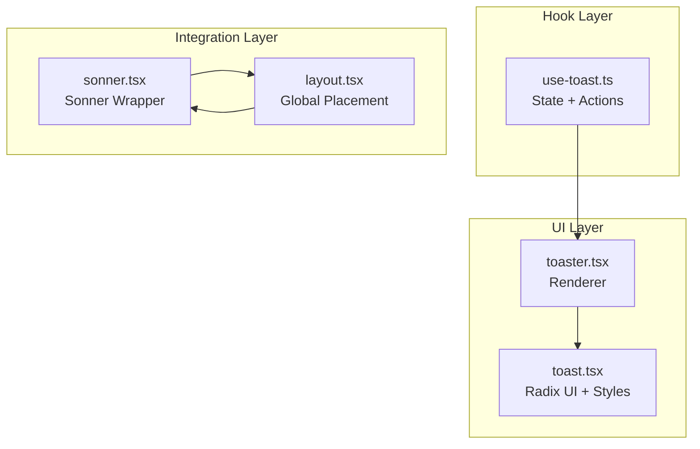
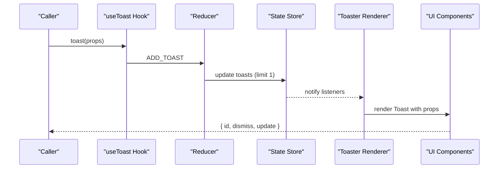
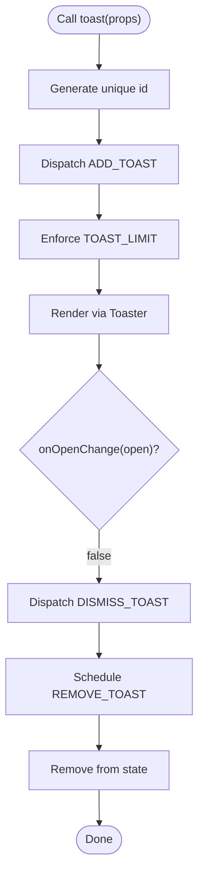
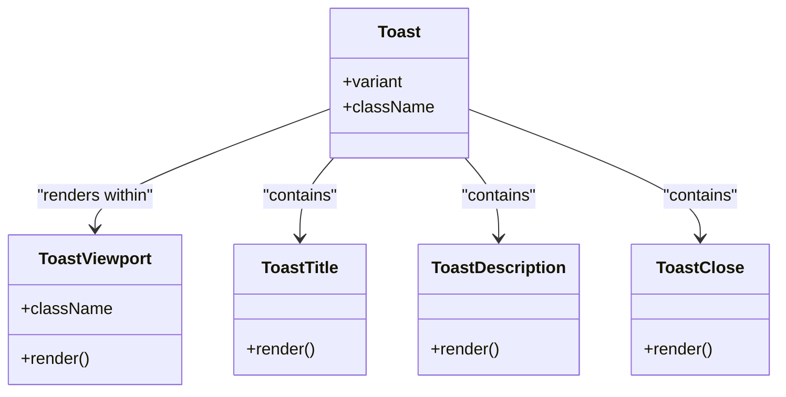
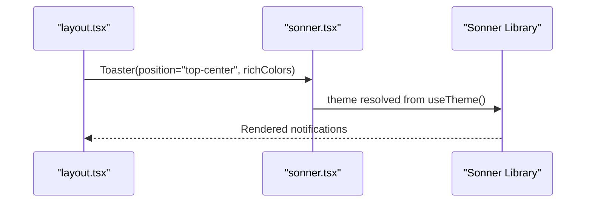
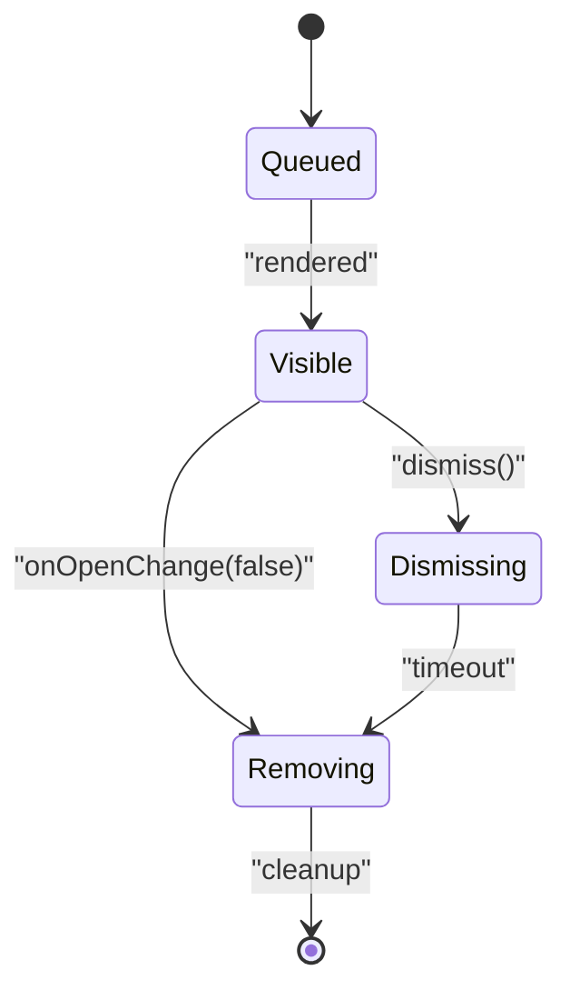
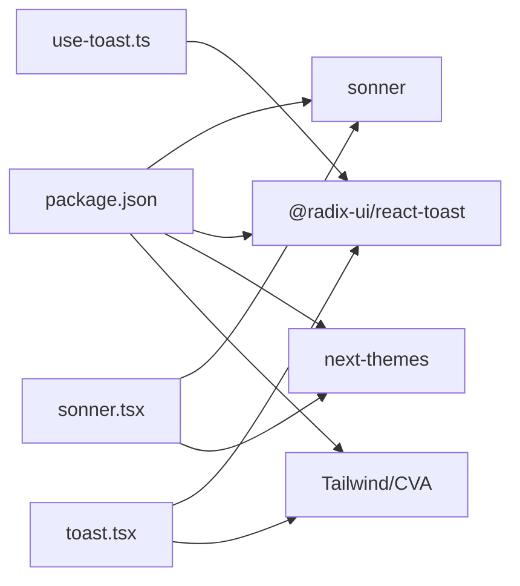

# Notification Hook

<cite>
**Referenced Files in This Document**
- [use-toast.ts](file://hooks/use-toast.ts)
- [toast.tsx](file://components/ui/toast.tsx)
- [toaster.tsx](file://components/ui/toaster.tsx)
- [sonner.tsx](file://components/ui/sonner.tsx)
- [layout.tsx](file://app/layout.tsx)
- [page.tsx](file://app/page.tsx)
- [task-card.tsx](file://components/task-card.tsx)
- [daily-challenges.tsx](file://components/daily-challenges.tsx)
- [package.json](file://package.json)
</cite>

## Table of Contents
1. [Introduction](#introduction)
2. [Project Structure](#project-structure)
3. [Core Components](#core-components)
4. [Architecture Overview](#architecture-overview)
5. [Detailed Component Analysis](#detailed-component-analysis)
6. [Dependency Analysis](#dependency-analysis)
7. [Performance Considerations](#performance-considerations)
8. [Troubleshooting Guide](#troubleshooting-guide)
9. [Conclusion](#conclusion)

## Introduction
This document explains the notification system built around the useToast hook and Sonner integration. It covers toast positioning, notification types, user feedback patterns, configuration options, duration settings, custom styling, queue management, and lifecycle. Practical examples demonstrate success, error, and achievement notifications within the application.

## Project Structure
The notification system spans three layers:
- Hook layer: centralized state and actions for toast management
- UI layer: Radix UI primitives and styled components for rendering
- Integration layer: Sonner-based Toaster wrapper and global placement

**Diagram sources**
- [use-toast.ts:171-189](file://hooks/use-toast.ts#L171-L189)
- [toast.tsx:12-56](file://components/ui/toast.tsx#L12-L56)
- [toaster.tsx:13-35](file://components/ui/toaster.tsx#L13-L35)
- [sonner.tsx:6-23](file://components/ui/sonner.tsx#L6-L23)
- [layout.tsx:42-43](file://app/layout.tsx#L42-L43)

**Section sources**
- [use-toast.ts:171-189](file://hooks/use-toast.ts#L171-L189)
- [toast.tsx:12-56](file://components/ui/toast.tsx#L12-L56)
- [toaster.tsx:13-35](file://components/ui/toaster.tsx#L13-L35)
- [sonner.tsx:6-23](file://components/ui/sonner.tsx#L6-L23)
- [layout.tsx:42-43](file://app/layout.tsx#L42-L43)

## Core Components
- useToast hook: manages toast state, dispatches actions, and exposes toast creation/update/dismiss APIs
- Toaster renderer: maps state to UI components using Radix UI primitives
- Sonner wrapper: integrates Sonner with theme-aware styling and global positioning
- Global placement: top-center position with rich colors enabled

Key behaviors:
- Single-toast limit enforced by the reducer
- Auto-dismiss after a long timeout with manual dismissal support
- Variant support for default and destructive styling
- Accessible viewport with keyboard and swipe interactions

**Section sources**
- [use-toast.ts:8-127](file://hooks/use-toast.ts#L8-L127)
- [toast.tsx:27-41](file://components/ui/toast.tsx#L27-L41)
- [layout.tsx:42-43](file://app/layout.tsx#L42-L43)

## Architecture Overview
The system combines a custom hook with Sonner for rendering. The hook maintains a minimal queue and dispatches actions to update state. The Toaster renders each toast using Radix UI components, while the Sonner wrapper provides cross-theme styling and positioning.

**Diagram sources**
- [use-toast.ts:142-169](file://hooks/use-toast.ts#L142-L169)
- [use-toast.ts:74-127](file://hooks/use-toast.ts#L74-L127)
- [toaster.tsx:13-35](file://components/ui/toaster.tsx#L13-L35)
- [toast.tsx:43-56](file://components/ui/toast.tsx#L43-L56)

## Detailed Component Analysis

### useToast Hook Implementation
The hook centralizes toast state and actions:
- State: array of active toasts
- Actions: ADD_TOAST, UPDATE_TOAST, DISMISS_TOAST, REMOVE_TOAST
- Queue management: enforces a single-toast limit and schedules removal
- Public API: toast(), dismiss(), and state access

**Diagram sources**
- [use-toast.ts:142-169](file://hooks/use-toast.ts#L142-L169)
- [use-toast.ts:58-72](file://hooks/use-toast.ts#L58-L72)
- [use-toast.ts:74-127](file://hooks/use-toast.ts#L74-L127)

**Section sources**
- [use-toast.ts:171-189](file://hooks/use-toast.ts#L171-L189)
- [use-toast.ts:56-72](file://hooks/use-toast.ts#L56-L72)
- [use-toast.ts:8-16](file://hooks/use-toast.ts#L8-L16)

### Toast UI Components
The UI layer builds on Radix UI with Tailwind-based styling:
- Viewport: fixed positioning with responsive bottom/right alignment
- Toast: configurable variant (default/destructive) with animations
- Title/Description: semantic labeling for accessibility
- Close button: accessible controls with hover states

**Diagram sources**
- [toast.tsx:12-56](file://components/ui/toast.tsx#L12-L56)
- [toast.tsx:91-113](file://components/ui/toast.tsx#L91-L113)

**Section sources**
- [toast.tsx:12-56](file://components/ui/toast.tsx#L12-L56)
- [toast.tsx:27-41](file://components/ui/toast.tsx#L27-L41)

### Sonner Integration
The Sonner wrapper adapts the library to the app’s theme and styling:
- Theme resolution via next-themes
- Custom CSS variables for consistent palette
- Positioning and rich colors configured globally

**Diagram sources**
- [layout.tsx:42-43](file://app/layout.tsx#L42-L43)
- [sonner.tsx:6-23](file://components/ui/sonner.tsx#L6-L23)

**Section sources**
- [sonner.tsx:6-23](file://components/ui/sonner.tsx#L6-L23)
- [layout.tsx:42-43](file://app/layout.tsx#L42-L43)

### Notification Types and User Feedback
The system supports multiple feedback categories through Sonner’s convenience methods and custom props:
- Success: positive outcomes and confirmations
- Error: failures and warnings
- Info: neutral updates and reminders
- Achievement: celebratory events with custom icons

Examples in the app:
- Success: AI suggestions, daily rewards, quest completions
- Error: system errors, camera access issues
- Info: logout confirmation, verification overrides
- Achievement: daily streaks, cosmetic unlocks

**Section sources**
- [page.tsx:59-65](file://app/page.tsx#L59-L65)
- [page.tsx:137-140](file://app/page.tsx#L137-L140)
- [task-card.tsx:32-35](file://components/task-card.tsx#L32-L35)
- [daily-challenges.tsx:19-22](file://components/daily-challenges.tsx#L19-L22)

### Toast Configuration Options
Common configuration keys exposed to callers:
- title: primary message
- description: secondary message
- duration: milliseconds before auto-dismiss
- icon: emoji or custom element
- cancel/success/error: convenience methods via Sonner

These options are passed through to Sonner and rendered by the Toaster.

**Section sources**
- [page.tsx:59-65](file://app/page.tsx#L59-L65)
- [page.tsx:137-140](file://app/page.tsx#L137-L140)
- [task-card.tsx:32-35](file://components/task-card.tsx#L32-L35)
- [daily-challenges.tsx:19-22](file://components/daily-challenges.tsx#L19-L22)

### Toast Queue Management and Lifecycle
- Single-toast policy: the reducer slices the list to one item at a time
- Dismissal triggers: manual close or onOpenChange(false)
- Removal scheduling: delayed removal after a long timeout
- Listener pattern: subscribers receive state updates for re-rendering

**Diagram sources**
- [use-toast.ts:74-127](file://hooks/use-toast.ts#L74-L127)
- [use-toast.ts:58-72](file://hooks/use-toast.ts#L58-L72)

**Section sources**
- [use-toast.ts:74-127](file://hooks/use-toast.ts#L74-L127)
- [use-toast.ts:58-72](file://hooks/use-toast.ts#L58-L72)

## Dependency Analysis
External libraries and their roles:
- Sonner: primary notification renderer with theme-aware styling
- @radix-ui/react-toast: accessible primitives for toast UI
- next-themes: theme resolution for consistent colors
- Tailwind/CVA: styling and variant composition

**Diagram sources**
- [package.json:60-64](file://package.json#L60-L64)
- [use-toast.ts:4](file://hooks/use-toast.ts#L4)
- [toast.tsx:4](file://components/ui/toast.tsx#L4)
- [sonner.tsx:3](file://components/ui/sonner.tsx#L3)

**Section sources**
- [package.json:60-64](file://package.json#L60-L64)
- [use-toast.ts:4](file://hooks/use-toast.ts#L4)
- [toast.tsx:4](file://components/ui/toast.tsx#L4)
- [sonner.tsx:3](file://components/ui/sonner.tsx#L3)

## Performance Considerations
- Single-toast limit reduces DOM churn and improves perceived performance
- Minimal state updates via targeted listeners
- CSS transitions and animations are hardware-accelerated through Tailwind
- Avoid excessive concurrent toasts to prevent layout thrashing

## Troubleshooting Guide
Common issues and resolutions:
- Notifications not appearing
  - Verify the global Toaster is mounted in the root layout
  - Confirm Sonner is imported and configured with position and richColors
- Toasts not dismissing
  - Ensure onOpenChange is wired to trigger dismiss
  - Check that the DISMISS_TOAST action is dispatched
- Styling inconsistencies
  - Confirm next-themes is properly initialized
  - Verify CSS variables for theme tokens are applied
- Accessibility concerns
  - Provide title and description for meaningful announcements
  - Include visible close controls and ensure keyboard focus order

**Section sources**
- [layout.tsx:42-43](file://app/layout.tsx#L42-L43)
- [use-toast.ts:158-160](file://hooks/use-toast.ts#L158-L160)
- [sonner.tsx:6-23](file://components/ui/sonner.tsx#L6-L23)
- [toast.tsx:91-113](file://components/ui/toast.tsx#L91-L113)

## Conclusion
The notification system combines a lightweight custom hook with Sonner for robust, accessible, and visually consistent feedback. The single-toast policy, queue management, and theme-aware styling deliver a smooth user experience across the application. By leveraging Sonner’s convenience methods and the UI components’ variants, teams can quickly implement success, error, info, and achievement notifications with consistent styling and behavior.