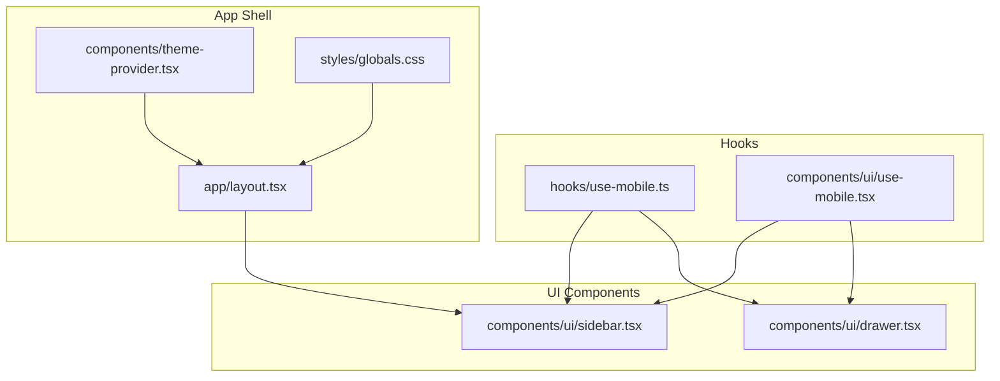
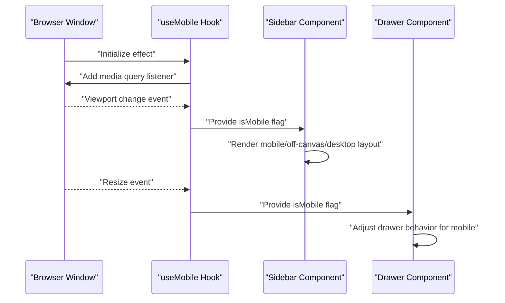
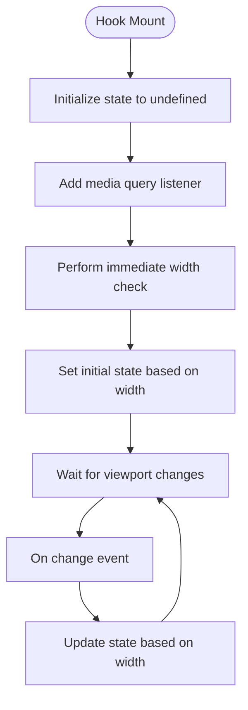
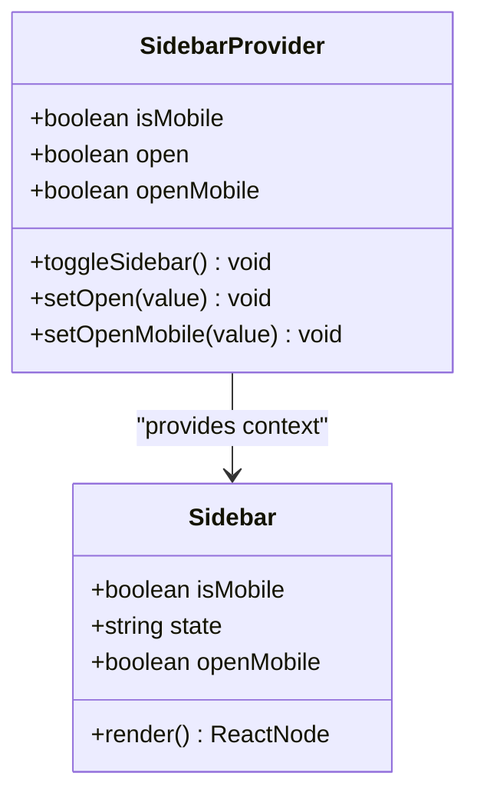
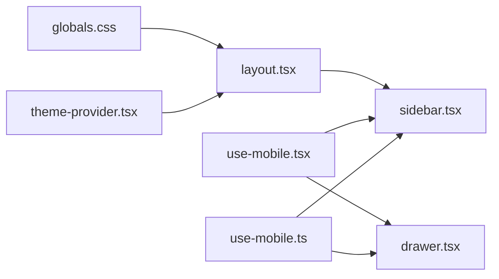

# Responsive Design Hook

<cite>
**Referenced Files in This Document**
- [use-mobile.ts](file://hooks/use-mobile.ts)
- [use-mobile.tsx](file://components/ui/use-mobile.tsx)
- [sidebar.tsx](file://components/ui/sidebar.tsx)
- [drawer.tsx](file://components/ui/drawer.tsx)
- [layout.tsx](file://app/layout.tsx)
- [theme-provider.tsx](file://components/theme-provider.tsx)
- [globals.css](file://styles/globals.css)
- [package.json](file://package.json)
</cite>

## Table of Contents
1. [Introduction](#introduction)
2. [Project Structure](#project-structure)
3. [Core Components](#core-components)
4. [Architecture Overview](#architecture-overview)
5. [Detailed Component Analysis](#detailed-component-analysis)
6. [Dependency Analysis](#dependency-analysis)
7. [Performance Considerations](#performance-considerations)
8. [Troubleshooting Guide](#troubleshooting-guide)
9. [Conclusion](#conclusion)

## Introduction
This document provides comprehensive documentation for the useMobile hook, which detects mobile devices and enables responsive behavior adaptation across the application. It explains breakpoint detection, device type identification, and how the hook integrates with mobile-first design patterns. The documentation covers responsive UI adjustments, touch interaction handling, adaptive component rendering, and performance considerations for mobile responsiveness.

## Project Structure
The useMobile hook is implemented in two locations:
- A functional React hook located under hooks/use-mobile.ts
- A UI-focused variant located under components/ui/use-mobile.tsx

Both implementations share identical logic and constants, ensuring consistent behavior across the application. The hook is consumed by UI components such as the sidebar and drawer to adapt layout and interaction patterns for mobile devices.

**Diagram sources**
- [use-mobile.ts:1-20](file://hooks/use-mobile.ts#L1-L20)
- [use-mobile.tsx:1-20](file://components/ui/use-mobile.tsx#L1-L20)
- [sidebar.tsx:1-727](file://components/ui/sidebar.tsx#L1-L727)
- [drawer.tsx:1-136](file://components/ui/drawer.tsx#L1-L136)
- [layout.tsx:1-48](file://app/layout.tsx#L1-L48)
- [theme-provider.tsx:1-12](file://components/theme-provider.tsx#L1-L12)
- [globals.css:1-126](file://styles/globals.css#L1-L126)

**Section sources**
- [use-mobile.ts:1-20](file://hooks/use-mobile.ts#L1-L20)
- [use-mobile.tsx:1-20](file://components/ui/use-mobile.tsx#L1-L20)
- [sidebar.tsx:1-727](file://components/ui/sidebar.tsx#L1-L727)
- [drawer.tsx:1-136](file://components/ui/drawer.tsx#L1-L136)
- [layout.tsx:1-48](file://app/layout.tsx#L1-L48)
- [theme-provider.tsx:1-12](file://components/theme-provider.tsx#L1-L12)
- [globals.css:1-126](file://styles/globals.css#L1-L126)

## Core Components
The useMobile hook provides a single exported function that determines whether the current viewport corresponds to a mobile device. It uses a media query to detect widths below the mobile breakpoint and updates state reactively when the viewport changes.

Key characteristics:
- Breakpoint: 768 pixels
- Detection method: Media query listener combined with width check
- Return value: Boolean indicating mobile state
- Initialization: Runs once during component mount

Integration points:
- Sidebar component uses the hook to decide between off-canvas mobile layout and desktop sidebar
- Drawer component leverages mobile detection for responsive drawer behavior

**Section sources**
- [use-mobile.ts:3-19](file://hooks/use-mobile.ts#L3-L19)
- [use-mobile.tsx:3-19](file://components/ui/use-mobile.tsx#L3-L19)
- [sidebar.tsx:69-94](file://components/ui/sidebar.tsx#L69-L94)
- [drawer.tsx:1-136](file://components/ui/drawer.tsx#L1-L136)

## Architecture Overview
The responsive architecture centers on the useMobile hook and its consumption by UI components. The hook encapsulates viewport detection logic, while UI components adapt their rendering and behavior based on the detected device type.

**Diagram sources**
- [use-mobile.ts:8-16](file://hooks/use-mobile.ts#L8-L16)
- [sidebar.tsx:69-94](file://components/ui/sidebar.tsx#L69-L94)
- [drawer.tsx:1-136](file://components/ui/drawer.tsx#L1-L136)

## Detailed Component Analysis

### useMobile Hook Implementation
The hook implements a lightweight responsive detection mechanism:
- Defines a constant mobile breakpoint at 768 pixels
- Initializes state to undefined to distinguish initial render from subsequent updates
- Subscribes to media query change events for efficient viewport updates
- Performs an immediate width check on mount to set initial state
- Returns a boolean coerced value representing mobile state

**Diagram sources**
- [use-mobile.ts:5-19](file://hooks/use-mobile.ts#L5-L19)

**Section sources**
- [use-mobile.ts:3-19](file://hooks/use-mobile.ts#L3-L19)
- [use-mobile.tsx:3-19](file://components/ui/use-mobile.tsx#L3-L19)

### Sidebar Responsive Behavior
The sidebar component consumes the useMobile hook to adapt its layout and interaction model:
- Mobile mode: Uses a sheet-based off-canvas layout with a dedicated mobile width
- Desktop mode: Renders a traditional sidebar with collapsible states and keyboard shortcuts
- State management: Maintains separate open/collapsed states for mobile and desktop contexts
- Accessibility: Provides keyboard shortcuts and screen reader support

**Diagram sources**
- [sidebar.tsx:56-152](file://components/ui/sidebar.tsx#L56-L152)
- [sidebar.tsx:154-254](file://components/ui/sidebar.tsx#L154-L254)

**Section sources**
- [sidebar.tsx:69-94](file://components/ui/sidebar.tsx#L69-L94)
- [sidebar.tsx:183-206](file://components/ui/sidebar.tsx#L183-L206)
- [sidebar.tsx:208-253](file://components/ui/sidebar.tsx#L208-L253)

### Drawer Component Integration
The drawer component demonstrates mobile-specific UI adjustments:
- Uses vaul for native-like drawer behavior
- Adapts content sizing and positioning based on mobile detection
- Implements directional drawers for different orientations
- Provides accessibility enhancements for touch interactions

**Section sources**
- [drawer.tsx:48-73](file://components/ui/drawer.tsx#L48-L73)

### Mobile-First Design Patterns
The application follows mobile-first design principles:
- Base styles target mobile experiences by default
- Desktop adaptations are layered via responsive utilities
- Touch-friendly interaction targets are prioritized
- Component layouts adapt seamlessly across device sizes

**Section sources**
- [globals.css:118-126](file://styles/globals.css#L118-L126)
- [sidebar.tsx:430-432](file://components/ui/sidebar.tsx#L430-L432)

## Dependency Analysis
The responsive system exhibits clear separation of concerns:
- Hook module: Pure detection logic with no UI dependencies
- UI components: Consume hook results to adapt behavior
- Layout shell: Provides global theming and typography
- Styling: Supports responsive utilities and mobile-first patterns

**Diagram sources**
- [use-mobile.ts:1-20](file://hooks/use-mobile.ts#L1-L20)
- [use-mobile.tsx:1-20](file://components/ui/use-mobile.tsx#L1-L20)
- [sidebar.tsx:1-727](file://components/ui/sidebar.tsx#L1-L727)
- [drawer.tsx:1-136](file://components/ui/drawer.tsx#L1-L136)
- [layout.tsx:1-48](file://app/layout.tsx#L1-L48)
- [theme-provider.tsx:1-12](file://components/theme-provider.tsx#L1-L12)
- [globals.css:1-126](file://styles/globals.css#L1-L126)

**Section sources**
- [package.json:1-78](file://package.json#L1-L78)

## Performance Considerations
Responsive detection performance is optimized through several mechanisms:
- Efficient media query listeners minimize re-renders
- Immediate width check prevents unnecessary state transitions
- Cleanup removes event listeners to prevent memory leaks
- Hook state initialization avoids redundant computations

Recommendations for production use:
- Debounce resize handlers if extending functionality
- Cache computed values when combining with other responsive checks
- Consider intersection observers for viewport-aware components
- Monitor bundle size impact of additional responsive utilities

## Troubleshooting Guide
Common issues and resolutions:
- Hook not updating: Verify media query listener is attached and cleanup occurs
- Incorrect initial state: Ensure immediate width check runs after mount
- Memory leaks: Confirm event listeners are removed in effect cleanup
- SSR compatibility: Wrap hook usage in client directives when needed

Debugging tips:
- Log breakpoint values to verify detection thresholds
- Test with various viewport sizes and orientations
- Validate component re-rendering behavior with React DevTools
- Check for conflicting CSS that might affect width calculations

**Section sources**
- [use-mobile.ts:8-16](file://hooks/use-mobile.ts#L8-L16)
- [use-mobile.tsx:8-16](file://components/ui/use-mobile.tsx#L8-L16)

## Conclusion
The useMobile hook provides a robust foundation for responsive design by offering reliable device detection and seamless integration with UI components. Its mobile-first approach ensures optimal user experiences across devices, while the clean separation of concerns enables maintainable and extensible responsive behavior. The hook's performance characteristics and straightforward API make it suitable for production applications requiring adaptive layouts and touch-friendly interfaces.