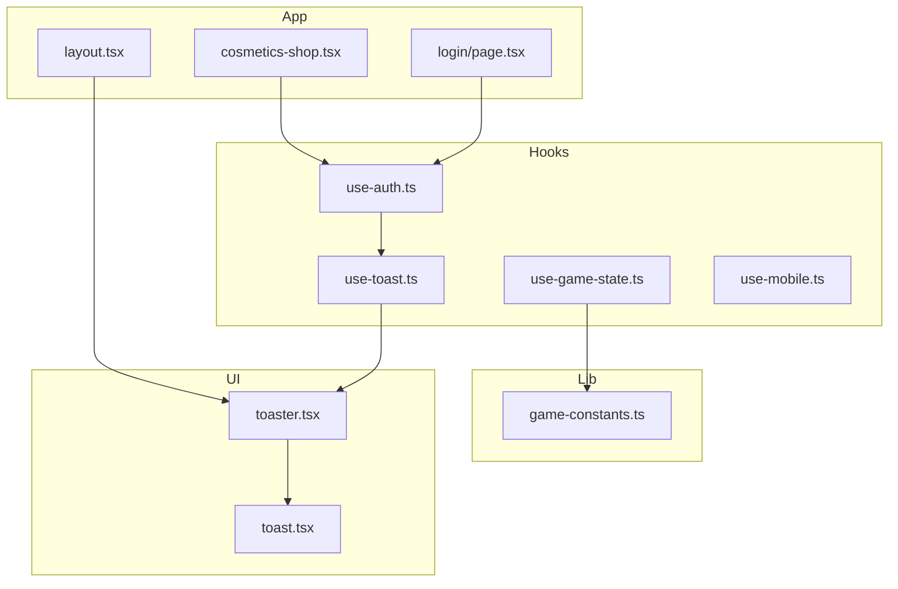
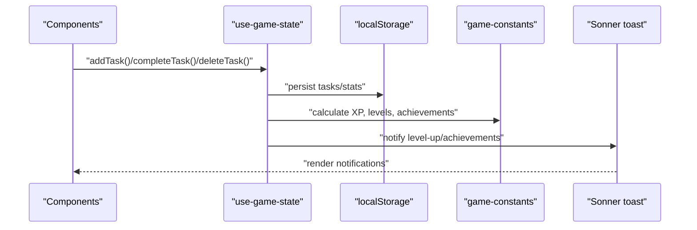
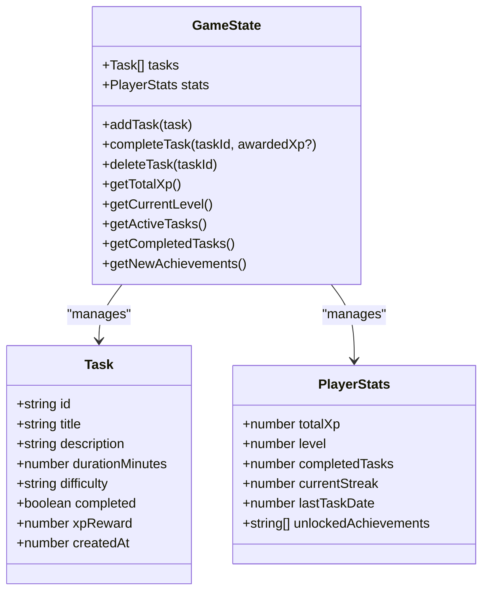
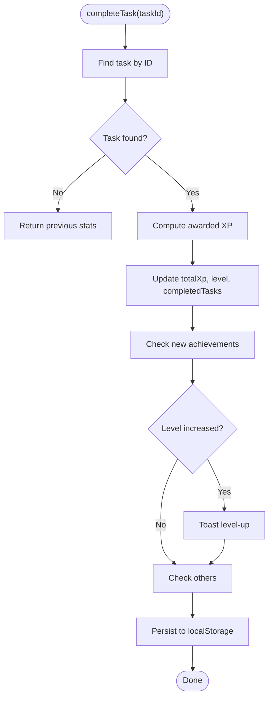
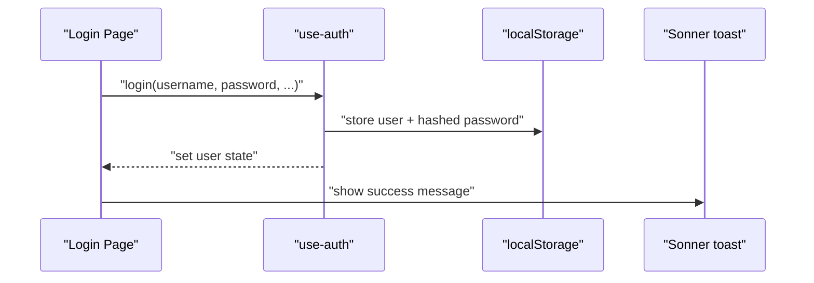
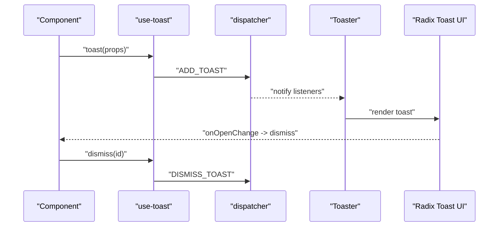
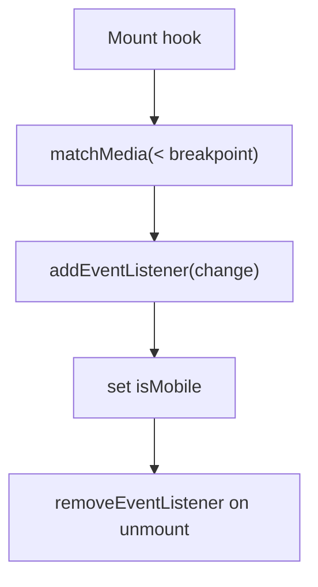
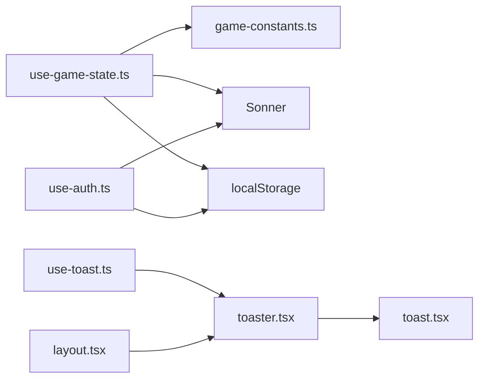

# State Management

<cite>
**Referenced Files in This Document**
- [use-game-state.ts](file://hooks/use-game-state.ts)
- [use-auth.ts](file://hooks/use-auth.ts)
- [use-toast.ts](file://hooks/use-toast.ts)
- [use-mobile.ts](file://hooks/use-mobile.ts)
- [game-constants.ts](file://lib/game-constants.ts)
- [toast.tsx](file://components/ui/toast.tsx)
- [toaster.tsx](file://components/ui/toaster.tsx)
- [layout.tsx](file://app/layout.tsx)
- [login/page.tsx](file://app/login/page.tsx)
- [cosmetics-shop.tsx](file://components/cosmetics-shop.tsx)
</cite>

## Table of Contents
1. [Introduction](#introduction)
2. [Project Structure](#project-structure)
3. [Core Components](#core-components)
4. [Architecture Overview](#architecture-overview)
5. [Detailed Component Analysis](#detailed-component-analysis)
6. [Dependency Analysis](#dependency-analysis)
7. [Performance Considerations](#performance-considerations)
8. [Troubleshooting Guide](#troubleshooting-guide)
9. [Conclusion](#conclusion)

## Introduction
This document explains the state management architecture and custom hooks that power the gamified task management application. It focuses on:
- use-game-state: persistent game state with XP, leveling, streaks, and achievements
- use-auth: authentication and user profile management with session persistence
- use-toast: notification system with Sonner integration
- use-mobile: responsive detection hook
It also covers state synchronization patterns, hook composition strategies, and integration with React’s concurrent features, including practical examples of state updates, side effects handling, and persistence.

## Project Structure
The state management is implemented primarily in the hooks directory, with supporting game constants and UI toast components. The application layout integrates a global toast provider.

**Diagram sources**
- [use-game-state.ts:1-252](file://hooks/use-game-state.ts#L1-L252)
- [use-auth.ts:1-167](file://hooks/use-auth.ts#L1-L167)
- [use-toast.ts:1-192](file://hooks/use-toast.ts#L1-L192)
- [use-mobile.ts:1-20](file://hooks/use-mobile.ts#L1-L20)
- [game-constants.ts:1-95](file://lib/game-constants.ts#L1-L95)
- [toast.tsx:1-130](file://components/ui/toast.tsx#L1-L130)
- [toaster.tsx:1-36](file://components/ui/toaster.tsx#L1-L36)
- [layout.tsx:1-48](file://app/layout.tsx#L1-L48)
- [login/page.tsx:1-314](file://app/login/page.tsx#L1-L314)
- [cosmetics-shop.tsx:1-17](file://components/cosmetics-shop.tsx#L1-L17)

**Section sources**
- [use-game-state.ts:1-252](file://hooks/use-game-state.ts#L1-L252)
- [use-auth.ts:1-167](file://hooks/use-auth.ts#L1-L167)
- [use-toast.ts:1-192](file://hooks/use-toast.ts#L1-L192)
- [use-mobile.ts:1-20](file://hooks/use-mobile.ts#L1-L20)
- [game-constants.ts:1-95](file://lib/game-constants.ts#L1-L95)
- [toast.tsx:1-130](file://components/ui/toast.tsx#L1-L130)
- [toaster.tsx:1-36](file://components/ui/toaster.tsx#L1-L36)
- [layout.tsx:1-48](file://app/layout.tsx#L1-L48)

## Core Components
- use-game-state: Manages tasks and player stats, persists to localStorage, computes streaks, and triggers notifications for level-ups and achievements.
- use-auth: Handles user login/logout, profile updates, and session persistence in localStorage.
- use-toast: Provides a lightweight toast manager with a reducer-based dispatcher and a global provider.
- use-mobile: Detects mobile viewport and exposes a boolean flag for responsive UI decisions.

**Section sources**
- [use-game-state.ts:51-251](file://hooks/use-game-state.ts#L51-L251)
- [use-auth.ts:28-166](file://hooks/use-auth.ts#L28-L166)
- [use-toast.ts:171-189](file://hooks/use-toast.ts#L171-L189)
- [use-mobile.ts:5-19](file://hooks/use-mobile.ts#L5-L19)

## Architecture Overview
The hooks are designed as encapsulated state containers with minimal coupling. They rely on:
- React state and effects for lifecycle management
- localStorage for persistence
- Utility modules for deterministic calculations
- UI toast components for user feedback

**Diagram sources**
- [use-game-state.ts:77-82](file://hooks/use-game-state.ts#L77-L82)
- [use-game-state.ts:127-210](file://hooks/use-game-state.ts#L127-L210)
- [game-constants.ts:14-48](file://lib/game-constants.ts#L14-L48)
- [layout.tsx:42-42](file://app/layout.tsx#L42-L42)

## Detailed Component Analysis

### use-game-state Hook
Purpose: Centralized game state for tasks and player stats with persistence and notifications.

Key aspects:
- State structure
  - tasks: array of Task with computed xpReward and timestamps
  - stats: PlayerStats with totalXp, level, completedTasks, currentStreak, lastTaskDate, unlockedAchievements
- Persistence
  - Loads initial state from localStorage on mount
  - Persists state on changes after initial load
- Streak calculation
  - Tracks daily completion and resets/continues streaks based on date differences
- Notifications
  - Triggers Sonner toasts for level-ups and new achievements
- Computed helpers
  - getTotalXp, getCurrentLevel, getActiveTasks, getCompletedTasks, getNewAchievements

**Diagram sources**
- [use-game-state.ts:15-47](file://hooks/use-game-state.ts#L15-L47)

**Diagram sources**
- [use-game-state.ts:143-210](file://hooks/use-game-state.ts#L143-L210)
- [use-game-state.ts:77-82](file://hooks/use-game-state.ts#L77-L82)

Practical examples:
- Adding a task with difficulty and duration determines XP reward and creation timestamp.
- Completing a task updates XP, checks for level-ups and achievements, and persists state.
- Deleting a task removes it from the list and persists.

Side effects handling:
- Effects manage loading from localStorage, saving to localStorage, and computing streaks.
- Callbacks are memoized to prevent unnecessary re-renders.

Persistence:
- Single storage key stores both tasks and stats as a JSON object.
- Initial load guards against malformed data by catching parse errors.

**Section sources**
- [use-game-state.ts:51-251](file://hooks/use-game-state.ts#L51-L251)
- [game-constants.ts:14-94](file://lib/game-constants.ts#L14-L94)

### use-auth Hook
Purpose: Authentication and user profile management with session persistence.

Key aspects:
- State structure
  - user: User profile with username, gender, isPremium, selectedCosmetic, avatarUrl, jobClass, premiumTier, createdAt
  - isLoading: indicates initialization status
- Session handling
  - On mount, loads user from localStorage and ensures avatar URLs are set based on premium tier or gender
  - Supports login, logout, and validation against stored credentials
- Profile updates
  - updatePremiumStatus, updateCosmetic, updateAvatarUrl, updateJobClass
  - Each update persists to localStorage and triggers Sonner notifications

**Diagram sources**
- [use-auth.ts:60-88](file://hooks/use-auth.ts#L60-L88)
- [login/page.tsx:282-301](file://app/login/page.tsx#L282-L301)

Practical examples:
- New user registration sets default avatar and premium status based on inputs.
- Premium upgrade updates avatar URL and cosmetic selection, then notifies the user.
- Logout clears the stored user session.

**Section sources**
- [use-auth.ts:28-166](file://hooks/use-auth.ts#L28-L166)
- [login/page.tsx:224-314](file://app/login/page.tsx#L224-L314)

### use-toast Hook and UI Integration
Purpose: Lightweight toast notification system with a reducer-based dispatcher and a global provider.

Key aspects:
- Dispatcher model
  - Memory state holds current toasts
  - Reducer handles adding, updating, dismissing, and removing toasts
  - Listeners subscribe to state changes
- UI provider
  - Toaster renders toasts from the hook’s state
  - toast.tsx defines toast primitives and positioning
- Global integration
  - layout.tsx mounts a Sonner Toaster at the root with top-center positioning and rich colors

**Diagram sources**
- [use-toast.ts:142-169](file://hooks/use-toast.ts#L142-L169)
- [use-toast.ts:171-189](file://hooks/use-toast.ts#L171-L189)
- [toaster.tsx:13-35](file://components/ui/toaster.tsx#L13-L35)
- [toast.tsx:12-24](file://components/ui/toast.tsx#L12-L24)
- [layout.tsx:42-42](file://app/layout.tsx#L42-L42)

Practical examples:
- use-game-state triggers toasts for level-ups and achievements.
- use-auth triggers toasts for premium activation and cosmetic updates.

**Section sources**
- [use-toast.ts:1-192](file://hooks/use-toast.ts#L1-L192)
- [toaster.tsx:1-36](file://components/ui/toaster.tsx#L1-L36)
- [toast.tsx:1-130](file://components/ui/toast.tsx#L1-L130)
- [layout.tsx:1-48](file://app/layout.tsx#L1-L48)

### use-mobile Hook
Purpose: Responsive viewport detection for mobile-specific UI behavior.

Key aspects:
- Uses matchMedia to track width changes
- Returns a boolean indicating whether the screen is below the mobile breakpoint
- Cleans up event listeners on unmount

**Diagram sources**
- [use-mobile.ts:8-16](file://hooks/use-mobile.ts#L8-L16)

**Section sources**
- [use-mobile.ts:1-20](file://hooks/use-mobile.ts#L1-L20)

## Dependency Analysis
- use-game-state depends on:
  - game-constants for XP calculations and achievement definitions
  - Sonner for notifications
  - localStorage for persistence
- use-auth depends on:
  - localStorage for session persistence
  - Sonner for notifications
- use-toast provides a dispatcher and UI components consumed by:
  - Toaster component
  - layout.tsx global provider
- UI toast components depend on:
  - @radix-ui/react-toast for primitives
  - class-variance-authority for variants
  - Tailwind utilities for styling

**Diagram sources**
- [use-game-state.ts:1-13](file://hooks/use-game-state.ts#L1-L13)
- [game-constants.ts:1-95](file://lib/game-constants.ts#L1-L95)
- [use-auth.ts:1-2](file://hooks/use-auth.ts#L1-L2)
- [use-toast.ts:1-6](file://hooks/use-toast.ts#L1-L6)
- [toaster.tsx:1-11](file://components/ui/toaster.tsx#L1-L11)
- [toast.tsx:1-8](file://components/ui/toast.tsx#L1-L8)
- [layout.tsx:4-4](file://app/layout.tsx#L4-L4)

**Section sources**
- [use-game-state.ts:1-13](file://hooks/use-game-state.ts#L1-L13)
- [use-auth.ts:1-2](file://hooks/use-auth.ts#L1-L2)
- [use-toast.ts:1-6](file://hooks/use-toast.ts#L1-L6)
- [toaster.tsx:1-11](file://components/ui/toaster.tsx#L1-L11)
- [toast.tsx:1-8](file://components/ui/toast.tsx#L1-L8)
- [layout.tsx:4-4](file://app/layout.tsx#L4-L4)

## Performance Considerations
- Memoization
  - use-game-state uses useCallback for action functions to prevent unnecessary re-renders.
  - use-auth action functions are not memoized; consider wrapping in useCallback if used in heavy dependency chains.
- Effects
  - use-game-state persists only after initial load to avoid redundant writes during hydration.
  - use-mobile attaches and detaches event listeners safely.
- Storage
  - Single localStorage key reduces fragmentation; ensure payload sizes remain reasonable.
- Notifications
  - use-toast limits concurrent toasts and schedules removal; keep messages concise.
- Concurrent features
  - Hooks integrate with React 19’s concurrent rendering; ensure actions are idempotent and side-effect boundaries are clear.

[No sources needed since this section provides general guidance]

## Troubleshooting Guide
Common issues and resolutions:
- Game state not persisting
  - Verify localStorage availability and quota.
  - Confirm the storage key and JSON parsing logic in use-game-state.
- Streak not updating
  - Ensure tasks have completedAt timestamps and dates are normalized to midnight.
- Achievements not unlocking
  - Check unlockedAchievements deduplication and achievement thresholds.
- Authentication session not restored
  - Validate localStorage keys and avatar URL defaults in use-auth.
- Toasts not appearing
  - Confirm the global Toaster is mounted in layout.tsx and Sonner is configured.
- Mobile detection incorrect
  - Ensure the breakpoint aligns with design tokens and event listeners are cleaned up.

**Section sources**
- [use-game-state.ts:63-82](file://hooks/use-game-state.ts#L63-L82)
- [use-auth.ts:32-58](file://hooks/use-auth.ts#L32-L58)
- [layout.tsx:42-42](file://app/layout.tsx#L42-L42)
- [use-mobile.ts:8-16](file://hooks/use-mobile.ts#L8-L16)

## Conclusion
The hooks implement a cohesive, modular state management system:
- use-game-state centralizes game logic with deterministic XP and achievements, robust persistence, and user feedback.
- use-auth manages sessions and profiles with safe avatar resolution and notifications.
- use-toast provides a scalable notification layer integrated globally.
- use-mobile enables responsive UI decisions.
Together, they demonstrate clean separation of concerns, predictable side effects, and efficient persistence patterns suitable for concurrent React environments.